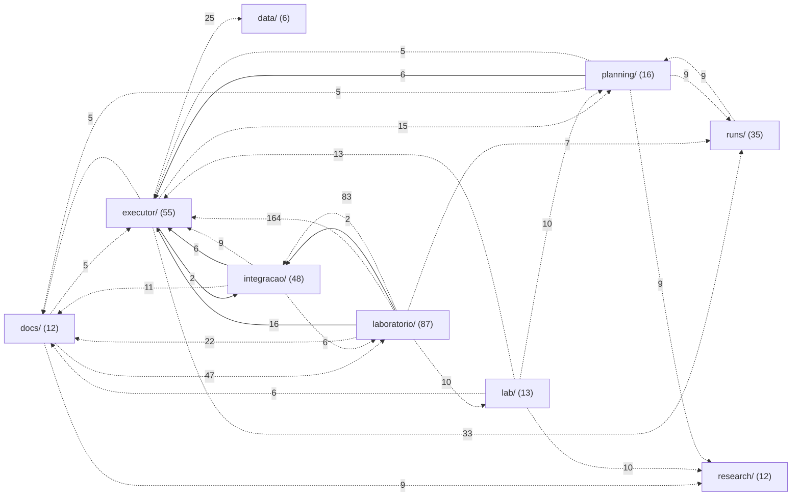
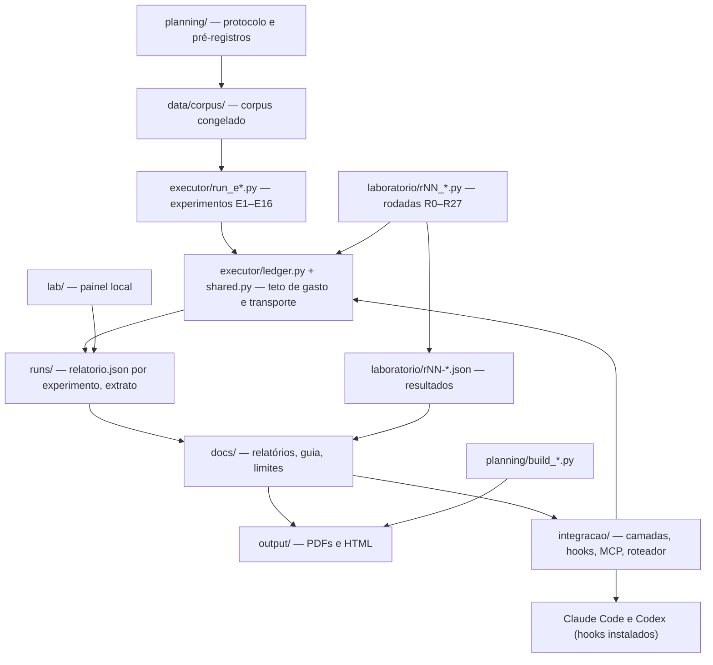

# Mapa do repositório JEV

Ponto de entrada para qualquer pessoa ou IA achar qualquer coisa nesta pasta. Gerado por `python mapa/gerar_mapa.py`; não editar à mão, regenerar depois de mudar arquivos.

**296 arquivos** em **41 pastas**, ligados por **1318 relações** (333 imports, 62 links, 923 citações).

## Como usar este mapa

- **Achar um arquivo por assunto:** a tabela "Onde está" abaixo, depois a página da pasta.
- **Achar uma função, classe ou seção:** [mapa/simbolos.md](mapa/simbolos.md) (nome → arquivo:linha).
- **Ver quem usa um arquivo:** a página da pasta mostra, para cada arquivo, o que ele usa e quem o usa.
- **Grafo para programas:** [mapa/grafo.json](mapa/grafo.json) (nós = arquivos com descrição; arestas `importa`, `link`, `cita`).
- **Fora do mapa de propósito:** `.env` (chave OpenRouter, nunca abrir), `.venv-s08/`, `graphify-out/`, `.planning/`, `runs/ledger.sqlite3`, `research/sources/`, `research/hermes/raw/`, material privado de `integracao/avaliacao/` e estado operacional de `integracao/` — tudo que o `.gitignore` exclui.

## Onde está

| preciso de | comece por |
|---|---|
| Regras do projeto, orçamento de US$ 5 e cuidado com a chave | [`AGENTS.md`](AGENTS.md) |
| Visão geral e como rodar o painel | [`README.md`](README.md), [`lab/server.py`](lab/server.py) |
| Resultado final do estudo | [`docs/RELATORIO-FINAL-JEV.md`](docs/RELATORIO-FINAL-JEV.md), [`output/pdf/RELATORIO-FINAL-JEV.pdf`](output/pdf/RELATORIO-FINAL-JEV.pdf) |
| Como aplicar o Jev na prática | [`docs/GUIA-PRATICO-JEV.md`](docs/GUIA-PRATICO-JEV.md) |
| Onde o Jev falha | [`docs/LIMITES-DO-JEV.md`](docs/LIMITES-DO-JEV.md), [`laboratorio/mapa-de-limites.json`](laboratorio/mapa-de-limites.json), [`output/mapa-de-limites.html`](output/mapa-de-limites.html) |
| Plano científico e protocolo | [`docs/PLANO-CIENTIFICO-JEV-HELENA.md`](docs/PLANO-CIENTIFICO-JEV-HELENA.md), [`planning/protocolo.md`](planning/protocolo.md) |
| Controle de gasto (reserva atômica, teto) | [`executor/ledger.py`](executor/ledger.py), [`executor/pricing.py`](executor/pricing.py), [`executor/prices.json`](executor/prices.json), [`executor/README.md`](executor/README.md) |
| Chamar o Jev pelo transporte compartilhado | [`executor/shared.py`](executor/shared.py) |
| Extrato do gasto conferível | [`runs/extrato-ledger.json`](runs/extrato-ledger.json), [`executor/exportar_extrato.py`](executor/exportar_extrato.py) |
| Hooks do Claude Code (leitura, busca, sentinela, saída) | [`integracao/README.md`](integracao/README.md), [`integracao/camadas/nucleo.py`](integracao/camadas/nucleo.py), [`integracao/hooks/jev_leitura.py`](integracao/hooks/jev_leitura.py), [`integracao/instalar.py`](integracao/instalar.py) |
| Medição das camadas no Claude Code | [`docs/CAMADAS-CLAUDE-CODE.md`](docs/CAMADAS-CLAUDE-CODE.md), [`integracao/camadas/medir.py`](integracao/camadas/medir.py) |
| Jev no Codex |  |
| Servidor MCP (jev_assist, jev_rank_context) | [`integracao/jev_mcp.py`](integracao/jev_mcp.py), [`executor/assist.py`](executor/assist.py) |
| Roteador de prompts e redação de credenciais | [`integracao/jev_router/roteador.py`](integracao/jev_router/roteador.py), [`integracao/jev_router/redacao.py`](integracao/jev_router/redacao.py) |
| Rodadas do laboratório R0–R27 | [`laboratorio/PREREGISTRO.md`](laboratorio/PREREGISTRO.md), [`laboratorio/nucleo.py`](laboratorio/nucleo.py) |
| Cem hipóteses e cem perguntas | [`docs/CEM-HIPOTESES.md`](docs/CEM-HIPOTESES.md), [`docs/CEM-PERGUNTAS-ESTRATEGICAS.md`](docs/CEM-PERGUNTAS-ESTRATEGICAS.md), [`laboratorio/h100/provas.py`](laboratorio/h100/provas.py), [`laboratorio/q100/respostas.py`](laboratorio/q100/respostas.py) |
| Conferir números publicados | [`docs/AUDITORIA-DE-NUMEROS.md`](docs/AUDITORIA-DE-NUMEROS.md), [`laboratorio/auditoria.py`](laboratorio/auditoria.py), [`laboratorio/auditoria-placar.json`](laboratorio/auditoria-placar.json) |
| Regenerar documentos e PDFs | [`planning/build_plan.py`](planning/build_plan.py), [`planning/build_deliverables.py`](planning/build_deliverables.py), [`planning/build_relatorio_pdf.py`](planning/build_relatorio_pdf.py) |

## Pastas

| pasta | arquivos | finalidade |
|---|---:|---|
| [raiz](mapa/pastas/_raiz.md) | 296 | Raiz do projeto JEV: avaliação científica do modelo Jev 1.13 (classificador barato via OpenRouter) e sua integração medida no Claude Code e no Codex. |
| &nbsp;&nbsp;&nbsp;&nbsp;[.reticle/](mapa/pastas/reticle.md) | 1 | Pasta de ferramenta local; só o .gitignore é versionado. |
| &nbsp;&nbsp;&nbsp;&nbsp;[data/](mapa/pastas/data.md) | 6 | Dados locais. Só o corpus de avaliação é versionado; o resto é ignorado. |
| &nbsp;&nbsp;&nbsp;&nbsp;&nbsp;&nbsp;&nbsp;&nbsp;[corpus/](mapa/pastas/data__corpus.md) | 6 | Corpus congelado dos experimentos (triagem, evidência, ressalvas), em JSONL. É o insumo dos executores `executor/run_e*.py`. |
| &nbsp;&nbsp;&nbsp;&nbsp;[docs/](mapa/pastas/docs.md) | 12 | Documentos finais em Markdown: plano científico, relatórios, guia prático, limites, auditoria de números, hipóteses e medições das camadas. |
| &nbsp;&nbsp;&nbsp;&nbsp;[executor/](mapa/pastas/executor.md) | 55 | Executor financeiro e dos experimentos E1–E16: livro-caixa com reserva atômica (`ledger.py`), preços, transporte compartilhado (`shared.py`), placar e um `run_e*.py` por experimento. |
| &nbsp;&nbsp;&nbsp;&nbsp;&nbsp;&nbsp;&nbsp;&nbsp;[tests/](mapa/pastas/executor__tests.md) | 17 | Testes do executor: livro-caixa, preços, runner, placar, achados de cada revisão adversarial, entregáveis, MCP. |
| &nbsp;&nbsp;&nbsp;&nbsp;[integracao/](mapa/pastas/integracao.md) | 48 | O Jev dentro do fluxo real: roteador de prompts, hooks do Claude Code, servidor MCP, instalador, leitura de contexto para o Codex. |
| &nbsp;&nbsp;&nbsp;&nbsp;&nbsp;&nbsp;&nbsp;&nbsp;[avaliacao/](mapa/pastas/integracao__avaliacao.md) | 17 | Avaliação da integração com tráfego real do Igor (E13): amostragem, gabaritos e relatórios agregados. O texto original é privado e fica fora do Git. |
| &nbsp;&nbsp;&nbsp;&nbsp;&nbsp;&nbsp;&nbsp;&nbsp;[camadas/](mapa/pastas/integracao__camadas.md) | 10 | As camadas que decidem o que entra no contexto do modelo caro: leitura, busca, sentinela, saída, verificação, `ler` (skill /jev-ler), medição e rotina. |
| &nbsp;&nbsp;&nbsp;&nbsp;&nbsp;&nbsp;&nbsp;&nbsp;[hooks/](mapa/pastas/integracao__hooks.md) | 6 | Os scripts de hook instalados no Claude Code/Codex; cada um é um invólucro fino sobre uma camada. |
| &nbsp;&nbsp;&nbsp;&nbsp;&nbsp;&nbsp;&nbsp;&nbsp;[jev_router/](mapa/pastas/integracao__jev_router.md) | 7 | Roteador de prompts: política, orçamento, redação de credenciais, cliente do provedor e CLI. |
| &nbsp;&nbsp;&nbsp;&nbsp;&nbsp;&nbsp;&nbsp;&nbsp;[tests/](mapa/pastas/integracao__tests.md) | 5 | Testes da integração: camadas, guarda de comando, redação, roteador e rotina. |
| &nbsp;&nbsp;&nbsp;&nbsp;[lab/](mapa/pastas/lab.md) | 13 | Painel local de acompanhamento (servidor stdlib + HTML/JS): fila de rodadas, execuções, métricas e orçamento. |
| &nbsp;&nbsp;&nbsp;&nbsp;&nbsp;&nbsp;&nbsp;&nbsp;[data/](mapa/pastas/lab__data.md) | 1 | Estado compartilhado do painel (`execution.json`). |
| &nbsp;&nbsp;&nbsp;&nbsp;&nbsp;&nbsp;&nbsp;&nbsp;[tests/](mapa/pastas/lab__tests.md) | 1 | Testes do servidor do painel. |
| &nbsp;&nbsp;&nbsp;&nbsp;[laboratorio/](mapa/pastas/laboratorio.md) | 87 | Programa E14 de rodadas R0–R27: cada `rNN_*.py` roda uma rodada e grava `rNN-*.json`. Inclui auditoria do placar, canários, dossiê e mapa de limites. |
| &nbsp;&nbsp;&nbsp;&nbsp;&nbsp;&nbsp;&nbsp;&nbsp;[h100/](mapa/pastas/laboratorio__h100.md) | 6 | Bateria H100: as cem hipóteses (dados, provas, avaliação, registro, relatório). |
| &nbsp;&nbsp;&nbsp;&nbsp;&nbsp;&nbsp;&nbsp;&nbsp;[q100/](mapa/pastas/laboratorio__q100.md) | 4 | Bateria Q100: as cem perguntas estratégicas (respostas, registro, relatório). |
| &nbsp;&nbsp;&nbsp;&nbsp;&nbsp;&nbsp;&nbsp;&nbsp;[tests/](mapa/pastas/laboratorio__tests.md) | 5 | Testes do laboratório: auditoria, canários, H100, Q100. |
| &nbsp;&nbsp;&nbsp;&nbsp;[output/](mapa/pastas/output.md) | 5 | Entregáveis gerados (HTML e PDF). Não editar à mão: regenerar pelos scripts de `planning/` e `laboratorio/`. |
| &nbsp;&nbsp;&nbsp;&nbsp;&nbsp;&nbsp;&nbsp;&nbsp;[pdf/](mapa/pastas/output__pdf.md) | 4 | PDFs finais: guia prático, plano científico e relatório final. |
| &nbsp;&nbsp;&nbsp;&nbsp;[planning/](mapa/pastas/planning.md) | 16 | Protocolo, pré-registros dos experimentos, emendas, esquema SQL, matriz de testes e os geradores dos documentos/PDFs. |
| &nbsp;&nbsp;&nbsp;&nbsp;[research/](mapa/pastas/research.md) | 12 | Pesquisa de base: fontes consultadas, manifesto das fontes GitHub, inventário de sistemas, auditoria do PDF do Hermes. |
| &nbsp;&nbsp;&nbsp;&nbsp;&nbsp;&nbsp;&nbsp;&nbsp;[hermes/](mapa/pastas/research__hermes.md) | 7 | Material do Hermes: relatório final da Helena, dossiê quantitativo, auditoria local e decisões extraídas do PDF. |
| &nbsp;&nbsp;&nbsp;&nbsp;[runs/](mapa/pastas/runs.md) | 35 | Resultados dos experimentos: um diretório por experimento com `relatorio.json` agregado; extrato do livro-caixa e erro grave. O banco `ledger.sqlite3` não é versionado. |
| &nbsp;&nbsp;&nbsp;&nbsp;&nbsp;&nbsp;&nbsp;&nbsp;[canaries/](mapa/pastas/runs__canaries.md) | 1 | Resumo dos canários de comportamento (verificação de que o modelo servido não mudou). |
| &nbsp;&nbsp;&nbsp;&nbsp;&nbsp;&nbsp;&nbsp;&nbsp;[e1-triagem/](mapa/pastas/runs__e1-triagem.md) | 1 | Resultados do experimento E1 (triagem): relatório agregado e, quando houve, adjudicação cega e respostas brutas. |
| &nbsp;&nbsp;&nbsp;&nbsp;&nbsp;&nbsp;&nbsp;&nbsp;[e10-llm-economico/](mapa/pastas/runs__e10-llm-economico.md) | 1 | Resultados do experimento E10 (llm economico): relatório agregado e, quando houve, adjudicação cega e respostas brutas. |
| &nbsp;&nbsp;&nbsp;&nbsp;&nbsp;&nbsp;&nbsp;&nbsp;[e10b-piloto/](mapa/pastas/runs__e10b-piloto.md) | 1 | Resultados do experimento E10b (piloto): relatório agregado e, quando houve, adjudicação cega e respostas brutas. |
| &nbsp;&nbsp;&nbsp;&nbsp;&nbsp;&nbsp;&nbsp;&nbsp;[e11-desempate/](mapa/pastas/runs__e11-desempate.md) | 7 | Resultados do experimento E11 (desempate): relatório agregado e, quando houve, adjudicação cega e respostas brutas. |
| &nbsp;&nbsp;&nbsp;&nbsp;&nbsp;&nbsp;&nbsp;&nbsp;[e12-replicacao/](mapa/pastas/runs__e12-replicacao.md) | 7 | Resultados do experimento E12 (replicacao): relatório agregado e, quando houve, adjudicação cega e respostas brutas. |
| &nbsp;&nbsp;&nbsp;&nbsp;&nbsp;&nbsp;&nbsp;&nbsp;[e2-fatorial/](mapa/pastas/runs__e2-fatorial.md) | 1 | Resultados do experimento E2 (fatorial): relatório agregado e, quando houve, adjudicação cega e respostas brutas. |
| &nbsp;&nbsp;&nbsp;&nbsp;&nbsp;&nbsp;&nbsp;&nbsp;[e2b-posicao/](mapa/pastas/runs__e2b-posicao.md) | 1 | Resultados do experimento E2b (posicao): relatório agregado e, quando houve, adjudicação cega e respostas brutas. |
| &nbsp;&nbsp;&nbsp;&nbsp;&nbsp;&nbsp;&nbsp;&nbsp;[e3-evidencia/](mapa/pastas/runs__e3-evidencia.md) | 1 | Resultados do experimento E3 (evidencia): relatório agregado e, quando houve, adjudicação cega e respostas brutas. |
| &nbsp;&nbsp;&nbsp;&nbsp;&nbsp;&nbsp;&nbsp;&nbsp;[e4-ressalvas/](mapa/pastas/runs__e4-ressalvas.md) | 1 | Resultados do experimento E4 (ressalvas): relatório agregado e, quando houve, adjudicação cega e respostas brutas. |
| &nbsp;&nbsp;&nbsp;&nbsp;&nbsp;&nbsp;&nbsp;&nbsp;[e5-provedores/](mapa/pastas/runs__e5-provedores.md) | 1 | Resultados do experimento E5 (provedores): relatório agregado e, quando houve, adjudicação cega e respostas brutas. |
| &nbsp;&nbsp;&nbsp;&nbsp;&nbsp;&nbsp;&nbsp;&nbsp;[e6-repetibilidade/](mapa/pastas/runs__e6-repetibilidade.md) | 1 | Resultados do experimento E6 (repetibilidade): relatório agregado e, quando houve, adjudicação cega e respostas brutas. |
| &nbsp;&nbsp;&nbsp;&nbsp;&nbsp;&nbsp;&nbsp;&nbsp;[e7-confirmacao/](mapa/pastas/runs__e7-confirmacao.md) | 1 | Resultados do experimento E7 (confirmacao): relatório agregado e, quando houve, adjudicação cega e respostas brutas. |
| &nbsp;&nbsp;&nbsp;&nbsp;&nbsp;&nbsp;&nbsp;&nbsp;[e8-anotador/](mapa/pastas/runs__e8-anotador.md) | 6 | Resultados do experimento E8 (anotador): relatório agregado e, quando houve, adjudicação cega e respostas brutas. |
| &nbsp;&nbsp;&nbsp;&nbsp;&nbsp;&nbsp;&nbsp;&nbsp;[e9-prevalencia/](mapa/pastas/runs__e9-prevalencia.md) | 1 | Resultados do experimento E9 (prevalencia): relatório agregado e, quando houve, adjudicação cega e respostas brutas. |

## Grafo entre as pastas de topo

Setas cheias: imports de código (todos). Tracejadas: documentos e dados que citam ou linkam arquivos de outra pasta, só quando são 5 ou mais. O número é a quantidade de relações; a matriz abaixo traz todas.

Matriz completa (linha usa coluna; imports + citações + links):

| de → para | .reticle/ | data/ | docs/ | executor/ | integracao/ | lab/ | laboratorio/ | output/ | planning/ | research/ | runs/ |
|---|---:|---:|---:|---:|---:|---:|---:|---:|---:|---:|---:|
| **.reticle/** |  |  |  |  |  |  |  |  |  |  |  |
| **data/** |  |  |  |  |  |  |  |  |  |  |  |
| **docs/** |  |  |  | 5 | 2 | 1 | 47 | 3 | 4 | 9 | 4 |
| **executor/** |  | 25 | 5 |  | 3 | 3 |  | 2 | 15 | 2 | 33 |
| **integracao/** |  |  | 11 | 15 |  |  | 6 |  |  |  | 1 |
| **lab/** |  |  | 6 | 13 |  |  |  | 4 | 10 | 10 |  |
| **laboratorio/** |  | 4 | 22 | 180 | 85 | 10 |  | 4 | 1 | 3 | 7 |
| **output/** |  |  | 1 |  |  |  | 3 |  |  |  |  |
| **planning/** |  | 4 | 5 | 11 |  | 2 |  | 3 |  | 9 | 9 |
| **research/** |  |  | 1 |  |  |  |  |  |  |  |  |
| **runs/** |  | 3 |  |  |  |  |  |  | 9 |  |  |

## Como as partes se ligam

## Experimentos E1–E16: cada peça de cada um

Pré-registro, executor, adjudicação, testes e resultados do mesmo experimento, juntos. O E13 (tráfego real) mora em [integracao/avaliacao/](mapa/pastas/integracao__avaliacao.md) e o E14 (rodadas R0–R27) em [laboratorio/](mapa/pastas/laboratorio.md), na tabela seguinte.

| exp. | arquivos |
|---|---|
| E1 | [run_e1_triagem.py](executor/run_e1_triagem.py) · [preregistro-E1-triagem.md](planning/preregistro-E1-triagem.md) · [e1-triagem/relatorio.json](runs/e1-triagem/relatorio.json) |
| E2 | [run_e2_fatorial.py](executor/run_e2_fatorial.py) · [e2-fatorial/relatorio.json](runs/e2-fatorial/relatorio.json) |
| E2b | [run_e2b_posicao.py](executor/run_e2b_posicao.py) · [e2b-posicao/relatorio.json](runs/e2b-posicao/relatorio.json) |
| E3 | [run_e3_evidencia.py](executor/run_e3_evidencia.py) · [e3-evidencia/relatorio.json](runs/e3-evidencia/relatorio.json) |
| E4 | [run_e4_ressalvas.py](executor/run_e4_ressalvas.py) · [e4-ressalvas/relatorio.json](runs/e4-ressalvas/relatorio.json) |
| E5 | [run_e5_provedores.py](executor/run_e5_provedores.py) · [e5-provedores/relatorio.json](runs/e5-provedores/relatorio.json) |
| E6 | [run_e6_repetibilidade.py](executor/run_e6_repetibilidade.py) · [e6-repetibilidade/relatorio.json](runs/e6-repetibilidade/relatorio.json) |
| E7 | [run_e7_confirmacao.py](executor/run_e7_confirmacao.py) · [preregistro-E7-confirmacao.md](planning/preregistro-E7-confirmacao.md) · [e7-confirmacao/relatorio.json](runs/e7-confirmacao/relatorio.json) |
| E8 | [run_e8_anotador.py](executor/run_e8_anotador.py) · [e8-anotador/adjudicacao-bruta.jsonl](runs/e8-anotador/adjudicacao-bruta.jsonl) · [e8-anotador/adjudicacao-mapa.json](runs/e8-anotador/adjudicacao-mapa.json) · [e8-anotador/adjudicacao.json](runs/e8-anotador/adjudicacao.json) · [e8-anotador/casos-cegos.json](runs/e8-anotador/casos-cegos.json) · [e8-anotador/prompt-adjudicacao.txt](runs/e8-anotador/prompt-adjudicacao.txt) · [e8-anotador/relatorio.json](runs/e8-anotador/relatorio.json) |
| E9 | [run_e9_prevalencia.py](executor/run_e9_prevalencia.py) · [e9-prevalencia/relatorio.json](runs/e9-prevalencia/relatorio.json) |
| E10 | [run_e10_llm_economico.py](executor/run_e10_llm_economico.py) · [preregistro-E10-llm-economico.md](planning/preregistro-E10-llm-economico.md) · [e10-llm-economico/relatorio.json](runs/e10-llm-economico/relatorio.json) |
| E10b | [run_e10b_piloto.py](executor/run_e10b_piloto.py) · [e10b-piloto/relatorio.json](runs/e10b-piloto/relatorio.json) |
| E11 | [adjudicar_e11.py](executor/adjudicar_e11.py) · [run_e11_desempate.py](executor/run_e11_desempate.py) · [preregistro-E11-desempate.md](planning/preregistro-E11-desempate.md) · [e11-desempate/adjudicacao-bruta.jsonl](runs/e11-desempate/adjudicacao-bruta.jsonl) · [e11-desempate/adjudicacao-mapa.json](runs/e11-desempate/adjudicacao-mapa.json) · [e11-desempate/adjudicacao.json](runs/e11-desempate/adjudicacao.json) · [e11-desempate/casos-cegos.json](runs/e11-desempate/casos-cegos.json) · [e11-desempate/prompt-adjudicacao.txt](runs/e11-desempate/prompt-adjudicacao.txt) · [e11-desempate/relatorio.json](runs/e11-desempate/relatorio.json) · [e11-desempate/respostas.jsonl](runs/e11-desempate/respostas.jsonl) |
| E12 | [adjudicar_e12.py](executor/adjudicar_e12.py) · [run_e12_replicacao.py](executor/run_e12_replicacao.py) · [test_calibracao_e12.py](executor/tests/test_calibracao_e12.py) · [test_e12_replicacao.py](executor/tests/test_e12_replicacao.py) · [preregistro-E12-replicacao.md](planning/preregistro-E12-replicacao.md) · [e12-replicacao/adjudicacao-mapa.json](runs/e12-replicacao/adjudicacao-mapa.json) · [e12-replicacao/adjudicacao.json](runs/e12-replicacao/adjudicacao.json) · [e12-replicacao/anuladas-emenda-3.json](runs/e12-replicacao/anuladas-emenda-3.json) · [e12-replicacao/casos-cegos.json](runs/e12-replicacao/casos-cegos.json) · [e12-replicacao/prompt-adjudicacao.txt](runs/e12-replicacao/prompt-adjudicacao.txt) · [e12-replicacao/relatorio.json](runs/e12-replicacao/relatorio.json) · [e12-replicacao/respostas.jsonl](runs/e12-replicacao/respostas.jsonl) |
| E15 | [run_e15.py](executor/run_e15.py) · [emenda-E15-01.md](planning/emenda-E15-01.md) · [preregistro-E15-implantacao.md](planning/preregistro-E15-implantacao.md) |
| E16 | [run_e16.py](executor/run_e16.py) · [preregistro-E16-recuperacao.md](planning/preregistro-E16-recuperacao.md) |

## Rodadas do laboratório: script e resultado

| rodada | arquivos |
|---|---|
| R0 | [r0-calibracao.json](laboratorio/r0-calibracao.json) · [r0_calibracao.py](laboratorio/r0_calibracao.py) |
| R1–R3 | [r1-r3-estresse.json](laboratorio/r1-r3-estresse.json) · [r1_r3_estresse.py](laboratorio/r1_r3_estresse.py) |
| R4–R7 | [r4-r7-limites.json](laboratorio/r4-r7-limites.json) · [r4_r7_limites.py](laboratorio/r4_r7_limites.py) |
| R8–R9 | [r8-r9-adversarial.json](laboratorio/r8-r9-adversarial.json) · [r8_r9_adversarial.py](laboratorio/r8_r9_adversarial.py) |
| R10 | [r10-injecao-comparada.json](laboratorio/r10-injecao-comparada.json) · [r10_injecao_comparada.py](laboratorio/r10_injecao_comparada.py) |
| R11 | [r11-extremos.json](laboratorio/r11-extremos.json) · [r11_extremos.py](laboratorio/r11_extremos.py) |
| R12–R13 | [r12-r13-contexto.json](laboratorio/r12-r13-contexto.json) · [r12_r13_contexto.py](laboratorio/r12_r13_contexto.py) |
| R14 | [r14-decisoes.json](laboratorio/r14-decisoes.json) · [r14_autorrecursivo.py](laboratorio/r14_autorrecursivo.py) |
| R15 | [r15-adversario-externo.json](laboratorio/r15-adversario-externo.json) · [r15-vetores-gerados.json](laboratorio/r15-vetores-gerados.json) · [r15_adversario_externo.py](laboratorio/r15_adversario_externo.py) |
| R15b | [r15b-familias.json](laboratorio/r15b-familias.json) · [r15b_familias.py](laboratorio/r15b_familias.py) |
| R16 | [r16-resumo.json](laboratorio/r16-resumo.json) · [r16_guarda_de_comando.py](laboratorio/r16_guarda_de_comando.py) |
| R17 | [r17-economia-de-contexto.json](laboratorio/r17-economia-de-contexto.json) · [r17_economia_de_contexto.py](laboratorio/r17_economia_de_contexto.py) |
| R17b | [r17b-sensibilidade.json](laboratorio/r17b-sensibilidade.json) · [r17b_sensibilidade.py](laboratorio/r17b_sensibilidade.py) |
| R18 | [r18-escala.json](laboratorio/r18-escala.json) · [r18-perguntas.json](laboratorio/r18-perguntas.json) · [r18_escala.py](laboratorio/r18_escala.py) |
| R18–R20 | [r18-r20-consolidado.json](laboratorio/r18-r20-consolidado.json) |
| R19 | [r19-armadilha.json](laboratorio/r19-armadilha.json) · [r19-corpus.json](laboratorio/r19-corpus.json) · [r19_armadilha_de_sujeito.py](laboratorio/r19_armadilha_de_sujeito.py) |
| R20 | [r20-k-adaptativo.json](laboratorio/r20-k-adaptativo.json) · [r20-perguntas.json](laboratorio/r20-perguntas.json) · [r20_k_adaptativo.py](laboratorio/r20_k_adaptativo.py) |
| R21 | [r21-corpus.json](laboratorio/r21-corpus.json) · [r21-generalizacao.json](laboratorio/r21-generalizacao.json) · [r21-prosa.json](laboratorio/r21-prosa.json) · [r21_generalizacao.py](laboratorio/r21_generalizacao.py) |
| R21b | [r21b-cruzamento.json](laboratorio/r21b-cruzamento.json) · [r21b_cruzamento.py](laboratorio/r21b_cruzamento.py) |
| R22 | [r22-defesas.json](laboratorio/r22-defesas.json) · [r22_defesas.py](laboratorio/r22_defesas.py) |
| R23 | [r23-gerado.json](laboratorio/r23-gerado.json) · [r23-parafrase.json](laboratorio/r23-parafrase.json) · [r23_parafrase.py](laboratorio/r23_parafrase.py) |
| R24 | [r24-votacao.json](laboratorio/r24-votacao.json) · [r24_votacao.py](laboratorio/r24_votacao.py) |
| R25 | [r25-corpus.json](laboratorio/r25-corpus.json) · [r25-terceiro-dominio.json](laboratorio/r25-terceiro-dominio.json) · [r25_terceiro_dominio.py](laboratorio/r25_terceiro_dominio.py) |
| R26 | [r26-bruto.json](laboratorio/r26-bruto.json) · [r26-dois-trechos.json](laboratorio/r26-dois-trechos.json) · [r26_dois_trechos.py](laboratorio/r26_dois_trechos.py) |
| R27 | [r27-integracao.json](laboratorio/r27-integracao.json) · [r27_integracao.py](laboratorio/r27_integracao.py) |

## Código e seus testes

| módulo | testado em |
|---|---|
| [`executor/analise.py`](executor/analise.py) | [test_achados_revisao2.py](executor/tests/test_achados_revisao2.py), [test_achados_revisao4.py](executor/tests/test_achados_revisao4.py) |
| [`executor/assist.py`](executor/assist.py) | [test_shared.py](executor/tests/test_shared.py) |
| [`executor/gabarito.py`](executor/gabarito.py) | [test_coerencia_placar.py](executor/tests/test_coerencia_placar.py), [test_mutacao.py](executor/tests/test_mutacao.py) |
| [`executor/ledger.py`](executor/ledger.py) | [test_achados_revisao.py](executor/tests/test_achados_revisao.py), [test_achados_revisao2.py](executor/tests/test_achados_revisao2.py), [test_achados_revisao3.py](executor/tests/test_achados_revisao3.py), [test_achados_revisao4.py](executor/tests/test_achados_revisao4.py), [test_ledger.py](executor/tests/test_ledger.py), [test_liquidacao_429.py](executor/tests/test_liquidacao_429.py), [test_runner.py](executor/tests/test_runner.py), [test_shared.py](executor/tests/test_shared.py) |
| [`executor/placar.py`](executor/placar.py) | [test_achados_revisao4.py](executor/tests/test_achados_revisao4.py), [test_coerencia_placar.py](executor/tests/test_coerencia_placar.py), [test_mutacao.py](executor/tests/test_mutacao.py) |
| [`executor/pricing.py`](executor/pricing.py) | [test_achados_revisao.py](executor/tests/test_achados_revisao.py), [test_achados_revisao2.py](executor/tests/test_achados_revisao2.py), [test_achados_revisao3.py](executor/tests/test_achados_revisao3.py), [test_achados_revisao4.py](executor/tests/test_achados_revisao4.py), [test_ledger.py](executor/tests/test_ledger.py), [test_liquidacao_429.py](executor/tests/test_liquidacao_429.py), [test_runner.py](executor/tests/test_runner.py), [test_shared.py](executor/tests/test_shared.py) |
| [`executor/publicar_experimentos.py`](executor/publicar_experimentos.py) | [test_coerencia_placar.py](executor/tests/test_coerencia_placar.py) |
| [`executor/run_e12_replicacao.py`](executor/run_e12_replicacao.py) | [test_e12_replicacao.py](executor/tests/test_e12_replicacao.py) |
| [`executor/run_e1_triagem.py`](executor/run_e1_triagem.py) | [test_achados_revisao.py](executor/tests/test_achados_revisao.py) |
| [`executor/run_e8_anotador.py`](executor/run_e8_anotador.py) | [test_achados_revisao4.py](executor/tests/test_achados_revisao4.py) |
| [`executor/run_e9_prevalencia.py`](executor/run_e9_prevalencia.py) | [test_achados_revisao4.py](executor/tests/test_achados_revisao4.py) |
| [`executor/runner.py`](executor/runner.py) | [test_achados_revisao.py](executor/tests/test_achados_revisao.py), [test_achados_revisao4.py](executor/tests/test_achados_revisao4.py), [test_runner.py](executor/tests/test_runner.py), [test_shared.py](executor/tests/test_shared.py) |
| [`executor/shared.py`](executor/shared.py) | [test_shared.py](executor/tests/test_shared.py) |
| [`integracao/camadas/busca.py`](integracao/camadas/busca.py) | [test_camadas.py](integracao/tests/test_camadas.py) |
| [`integracao/camadas/leitura.py`](integracao/camadas/leitura.py) | [test_camadas.py](integracao/tests/test_camadas.py) |
| [`integracao/camadas/ler.py`](integracao/camadas/ler.py) | [test_camadas.py](integracao/tests/test_camadas.py) |
| [`integracao/camadas/medir.py`](integracao/camadas/medir.py) | [test_camadas.py](integracao/tests/test_camadas.py) |
| [`integracao/camadas/nucleo.py`](integracao/camadas/nucleo.py) | [test_camadas.py](integracao/tests/test_camadas.py) |
| [`integracao/camadas/rotina.py`](integracao/camadas/rotina.py) | [test_rotina.py](integracao/tests/test_rotina.py) |
| [`integracao/camadas/saida.py`](integracao/camadas/saida.py) | [test_camadas.py](integracao/tests/test_camadas.py) |
| [`integracao/camadas/sentinela.py`](integracao/camadas/sentinela.py) | [test_camadas.py](integracao/tests/test_camadas.py) |
| [`integracao/camadas/verificar.py`](integracao/camadas/verificar.py) | [test_camadas.py](integracao/tests/test_camadas.py) |
| [`integracao/hooks/jev_guarda_comando.py`](integracao/hooks/jev_guarda_comando.py) | [test_guarda_comando.py](integracao/tests/test_guarda_comando.py) |
| [`integracao/jev_mcp.py`](integracao/jev_mcp.py) | [test_mcp.py](executor/tests/test_mcp.py) |
| [`integracao/jev_router/orcamento.py`](integracao/jev_router/orcamento.py) | [test_camadas.py](integracao/tests/test_camadas.py) |
| [`integracao/jev_router/politica.py`](integracao/jev_router/politica.py) | [test_roteador.py](integracao/tests/test_roteador.py) |
| [`integracao/jev_router/redacao.py`](integracao/jev_router/redacao.py) | [test_redacao.py](integracao/tests/test_redacao.py) |
| [`integracao/jev_router/roteador.py`](integracao/jev_router/roteador.py) | [test_roteador.py](integracao/tests/test_roteador.py) |
| [`laboratorio/auditoria.py`](laboratorio/auditoria.py) | [test_auditoria.py](laboratorio/tests/test_auditoria.py) |
| [`laboratorio/canarios_de_comportamento.py`](laboratorio/canarios_de_comportamento.py) | [test_canarios_de_comportamento.py](laboratorio/tests/test_canarios_de_comportamento.py) |
| [`laboratorio/h100/avaliar.py`](laboratorio/h100/avaliar.py) | [test_h100.py](laboratorio/tests/test_h100.py) |
| [`laboratorio/h100/dados.py`](laboratorio/h100/dados.py) | [test_h100.py](laboratorio/tests/test_h100.py), [test_q100.py](laboratorio/tests/test_q100.py) |
| [`laboratorio/h100/provas.py`](laboratorio/h100/provas.py) | [test_h100.py](laboratorio/tests/test_h100.py) |
| [`laboratorio/h100/registro.py`](laboratorio/h100/registro.py) | [test_h100.py](laboratorio/tests/test_h100.py) |
| [`laboratorio/nucleo.py`](laboratorio/nucleo.py) | [test_auditoria.py](laboratorio/tests/test_auditoria.py) |
| [`laboratorio/q100/registro.py`](laboratorio/q100/registro.py) | [test_q100.py](laboratorio/tests/test_q100.py) |
| [`laboratorio/q100/relatorio.py`](laboratorio/q100/relatorio.py) | [test_q100.py](laboratorio/tests/test_q100.py) |
| [`laboratorio/q100/respostas.py`](laboratorio/q100/respostas.py) | [test_q100.py](laboratorio/tests/test_q100.py) |

## Arquivos mais referenciados

Os que mais outros arquivos importam, linkam ou citam: mudar um deles tem efeito amplo.

| arquivo | recebe | descrição |
|---|---:|---|
| [`executor/ledger.py`](executor/ledger.py) | 34 | Controle financeiro com reserva atomica antes de cada tentativa paga. |
| [`executor/pricing.py`](executor/pricing.py) | 34 | Tabela de precos e custo em nanodolares inteiros. |
| [`laboratorio/nucleo.py`](laboratorio/nucleo.py) | 34 | Núcleo do programa E14: despacho paralelo com teto próprio, e a estatística que uso sempre. |
| [`executor/runner.py`](executor/runner.py) | 31 | Despacho de chamadas Jev com reserva financeira obrigatoria. |
| [`executor/run_e1_triagem.py`](executor/run_e1_triagem.py) | 25 | E1 piloto, tarefa de triagem: Jev contra regra simples, no corpus pré-registrado. |
| [`executor/gabarito.py`](executor/gabarito.py) | 19 | O gabarito oficial do estudo, num lugar só. |
| [`executor/run_e12_replicacao.py`](executor/run_e12_replicacao.py) | 16 | E12: a replicação do desempate com 30 famílias novas e quatro comparadores econômicos. |
| [`executor/shared.py`](executor/shared.py) | 16 | Single financial path for local JEV consumers. Never truncates inputs. |
| [`executor/analise.py`](executor/analise.py) | 14 | Análise pareada com a unidade de agrupamento correta. |
| [`laboratorio/auditoria.py`](laboratorio/auditoria.py) | 14 | Audita os números publicados contra as linhas brutas de cada rodada. |
| [`data/corpus/triagem-replicacao.jsonl`](data/corpus/triagem-replicacao.jsonl) | 13 | 90 registros JSONL (campos: case_id, family, gold, text, rationale, revisado_antes_de_executar) |
| [`executor/placar.py`](executor/placar.py) | 13 | Placar de decisão: transforma os relatórios dos experimentos em números de decidir. |
| [`integracao/jev_router/redacao.py`](integracao/jev_router/redacao.py) | 13 | Mascara segredo antes de o pedido sair desta máquina. |
| [`laboratorio/r15_adversario_externo.py`](laboratorio/r15_adversario_externo.py) | 13 | R15 — a injeção escrita por outro, não por mim. |
| [`integracao/camadas/nucleo.py`](integracao/camadas/nucleo.py) | 12 | O que as camadas do Jev no Claude Code compartilham: pedido vigente, chamadas em paralelo, registro único e estimativa de tokens. |
| [`integracao/jev_router/cliente.py`](integracao/jev_router/cliente.py) | 12 | Chamada ao endpoint de decisões do Jev, no formato que um hook pode usar. |
| [`docs/GUIA-PRATICO-JEV.md`](docs/GUIA-PRATICO-JEV.md) | 11 | Como aplicar o Jev — guia de uso — *Documento de aplicação. Todos os números vêm dos experimentos E1 a E16 e do livro-caixa; nenhum |
| [`docs/RELATORIO-FINAL-JEV.md`](docs/RELATORIO-FINAL-JEV.md) | 11 | Jev 1.13 — relatório final de avaliação — **Autoria:** Dra. Helena Strategos, Cientista-Chefe de Inteligência da INTEIA |
| [`integracao/jev_router/__init__.py`](integracao/jev_router/__init__.py) | 11 | Roteador de trabalho baseado no Jev: classifica o pedido antes de gastar modelo caro. |
| [`integracao/jev_router/politica.py`](integracao/jev_router/politica.py) | 11 | O que o Jev decide nos fluxos do Claude Code e do Codex, e o que ele não decide. |
