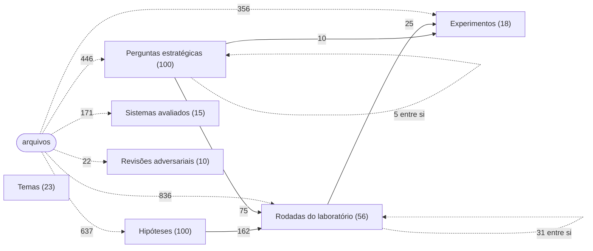
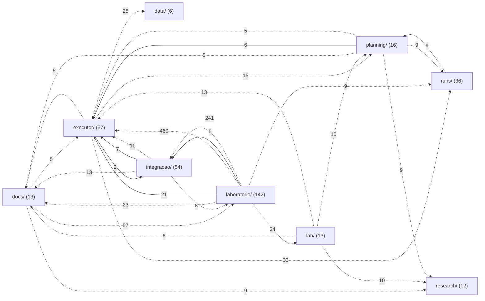
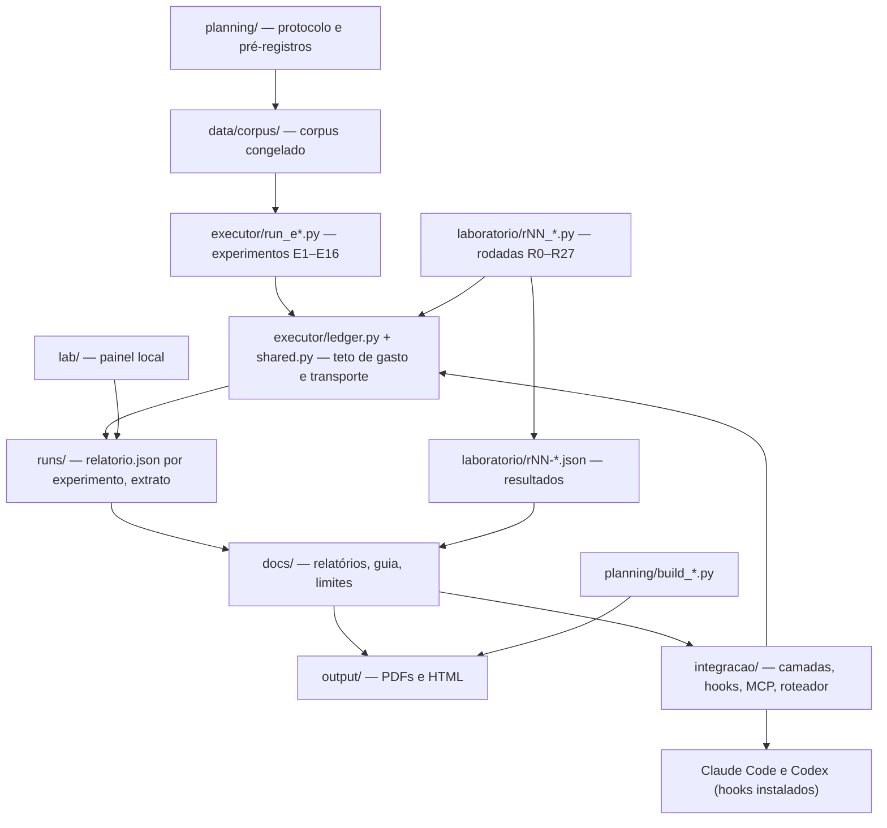

# Mapa do repositório JEV

Ponto de entrada para qualquer pessoa ou IA achar qualquer coisa nesta pasta. Gerado por `python mapa/gerar_mapa.py`; não editar à mão, regenerar depois de mudar arquivos.

**399 arquivos** em **57 pastas** e **322 conceitos do estudo** (experimentos, rodadas, hipóteses, perguntas, sistemas, revisões e temas), ligados por **6659 relações**: 481 imports, 62 links, 1622 citações entre arquivos; 769 usos de função ou classe de outro arquivo; 2468 ligações arquivo–conceito, 308 conceito–conceito, 202 de pertença a tema e 747 de semelhança de conteúdo julgadas pelo Jev.

## Como usar este mapa

- **Ver o grafo:** abra [MAPA.html](MAPA.html) no navegador (busca, filtros por tipo de ponto e de ligação, foco na vizinhança, painel com tudo sobre cada ponto e link para o arquivo).
- **Perguntar ao grafo direto:** `python mapa/consultar.py TERMO` (arquivo, função, `H012`, `R17`, `Q042`, palavra), `--caminho A B` (como duas coisas se ligam), `--vizinhos X --profundidade 2`. Só biblioteca padrão, lê `mapa/grafo.json`.
- **Achar um arquivo por assunto:** a tabela "Onde está" abaixo, depois a página da pasta.
- **Achar um estudo, hipótese ou pergunta:** a seção "Conhecimento do estudo" abaixo; cada conceito diz onde está, em que se apoia, o que sustenta e quem o menciona.
- **Achar uma função, classe ou seção:** [mapa/simbolos.md](mapa/simbolos.md) (nome → arquivo:linha, e em quantos arquivos é usada).
- **Ver quem usa um arquivo ou função:** a página da pasta mostra, para cada arquivo, o que ele usa, quem o usa, que funções de outros arquivos chama e que estudos menciona.
- **Saber o que falta:** [lacunas e ideias abertas](mapa/conhecimento/lacunas.md) e [testes, com o código sem teste direto](mapa/conhecimento/testes.md).
- **Grafo para programas:** [mapa/grafo.json](mapa/grafo.json) (nós: arquivos, conceitos e símbolos; cada aresta tem tipo e, nas menções, peso).
- **Fora do mapa de propósito:** `.env` (chave OpenRouter, nunca abrir), `.venv-s08/`, `graphify-out/`, `.planning/`, `runs/ledger.sqlite3`, `research/sources/`, `research/hermes/raw/`, material privado de `integracao/avaliacao/` e estado operacional de `integracao/` — tudo que o `.gitignore` exclui.

## Onde está

| preciso de | comece por |
|---|---|
| Regras do projeto, orçamento de US$ 5 e cuidado com a chave | [`AGENTS.md`](AGENTS.md) |
| Visão geral e como rodar o painel | [`README.md`](README.md), [`lab/server.py`](lab/server.py) |
| Resultado final do estudo | [`docs/RELATORIO-FINAL-JEV.md`](docs/RELATORIO-FINAL-JEV.md), [`output/pdf/RELATORIO-FINAL-JEV.pdf`](output/pdf/RELATORIO-FINAL-JEV.pdf) |
| Essência do Jev e descobertas das rodadas R28–R45 (comece por aqui) | [`docs/ESSENCIA-DO-JEV.md`](docs/ESSENCIA-DO-JEV.md) |
| jev-gateway: o Jev escolhendo a ferramenta de cada turno do Codex e do Claude Code |  |
| Como aplicar o Jev na prática | [`docs/GUIA-PRATICO-JEV.md`](docs/GUIA-PRATICO-JEV.md) |
| Onde o Jev falha | [`docs/LIMITES-DO-JEV.md`](docs/LIMITES-DO-JEV.md), [`laboratorio/mapa-de-limites.json`](laboratorio/mapa-de-limites.json), [`output/mapa-de-limites.html`](output/mapa-de-limites.html) |
| Plano científico e protocolo | [`docs/PLANO-CIENTIFICO-JEV-HELENA.md`](docs/PLANO-CIENTIFICO-JEV-HELENA.md), [`planning/protocolo.md`](planning/protocolo.md) |
| Controle de gasto (reserva atômica, teto) | [`executor/ledger.py`](executor/ledger.py), [`executor/pricing.py`](executor/pricing.py), [`executor/prices.json`](executor/prices.json), [`executor/README.md`](executor/README.md) |
| Chamar o Jev pelo transporte compartilhado | [`executor/shared.py`](executor/shared.py) |
| Extrato do gasto conferível | [`runs/extrato-ledger.json`](runs/extrato-ledger.json), [`executor/exportar_extrato.py`](executor/exportar_extrato.py) |
| Hooks do Claude Code (leitura, busca, sentinela, saída) | [`integracao/README.md`](integracao/README.md), [`integracao/camadas/nucleo.py`](integracao/camadas/nucleo.py), [`integracao/hooks/jev_leitura.py`](integracao/hooks/jev_leitura.py), [`integracao/instalar.py`](integracao/instalar.py) |
| Medição das camadas no Claude Code | [`docs/CAMADAS-CLAUDE-CODE.md`](docs/CAMADAS-CLAUDE-CODE.md), [`integracao/camadas/medir.py`](integracao/camadas/medir.py) |
| Jev no Codex |  |
| Servidor MCP (jev_assist, jev_rank_context) | [`integracao/jev_mcp.py`](integracao/jev_mcp.py), [`executor/assist.py`](executor/assist.py) |
| Roteador de prompts e redação de credenciais | [`integracao/jev_router/roteador.py`](integracao/jev_router/roteador.py), [`integracao/jev_router/redacao.py`](integracao/jev_router/redacao.py) |
| Rodadas do laboratório R0–R27 | [`laboratorio/PREREGISTRO.md`](laboratorio/PREREGISTRO.md), [`laboratorio/nucleo.py`](laboratorio/nucleo.py) |
| Cem hipóteses e cem perguntas | [`docs/CEM-HIPOTESES.md`](docs/CEM-HIPOTESES.md), [`docs/CEM-PERGUNTAS-ESTRATEGICAS.md`](docs/CEM-PERGUNTAS-ESTRATEGICAS.md), [`laboratorio/h100/provas.py`](laboratorio/h100/provas.py), [`laboratorio/q100/respostas.py`](laboratorio/q100/respostas.py) |
| Conferir números publicados | [`docs/AUDITORIA-DE-NUMEROS.md`](docs/AUDITORIA-DE-NUMEROS.md), [`laboratorio/auditoria.py`](laboratorio/auditoria.py), [`laboratorio/auditoria-placar.json`](laboratorio/auditoria-placar.json) |
| Regenerar documentos e PDFs | [`planning/build_plan.py`](planning/build_plan.py), [`planning/build_deliverables.py`](planning/build_deliverables.py), [`planning/build_relatorio_pdf.py`](planning/build_relatorio_pdf.py) |

## Conhecimento do estudo

Os conceitos são nós do grafo, lidos da fonte que os define. Cada página diz, por conceito, onde ele está, em que se apoia, o que sustenta e que arquivos o mencionam.

| conceito | quantos | página | o que tem |
|---|---:|---|---|
| Experimentos | 18 | [experimentos.md](mapa/conhecimento/experimentos.md) | pré-registro, executor, adjudicação, testes e resultado de cada um |
| Rodadas do laboratório | 56 | [rodadas.md](mapa/conhecimento/rodadas.md) | pré-registro, script, artefato e retratações de cada rodada; linhagem entre rodadas |
| Hipóteses | 100 | [hipoteses.md](mapa/conhecimento/hipoteses.md) | 81 sustentada, 18 falsificada, 1 inconclusiva; cada uma com as rodadas em que a prova se apoia |
| Perguntas estratégicas | 100 | [perguntas.md](mapa/conhecimento/perguntas.md) | 76 respondidas por dado medido; as demais por conta declarada ou coleta nova |
| Sistemas avaliados | 15 | [sistemas.md](mapa/conhecimento/sistemas.md) | os sistemas do ecossistema Jev cobertos pelo plano |
| Revisões adversariais | 10 | [revisoes.md](mapa/conhecimento/revisoes.md) | revisões independentes do executor e os testes que fixam cada achado |
| Temas | 23 | [temas.md](mapa/conhecimento/temas.md) | grupos por semelhança de conteúdo, com 36 contrastes de veredito; 747 ligações de semelhança julgadas pelo Jev |
| Testes | 30 | [testes.md](mapa/conhecimento/testes.md) | o que cada teste exercita e que estudo fixa; código sem teste direto |
| Lacunas e ideias | — | [lacunas.md](mapa/conhecimento/lacunas.md) | hipóteses que caíram, respostas sem dado medido, peças faltando, pendências declaradas |

Como os tipos de conceito se apoiam uns nos outros (número de ligações), e quantas ligações os arquivos fazem a cada tipo:

## Pastas

| pasta | arquivos | finalidade |
|---|---:|---|
| [raiz](mapa/pastas/_raiz.md) | 399 | Raiz do projeto JEV: avaliação científica do modelo Jev 1.13 (classificador barato via OpenRouter) e sua integração medida no Claude Code e no Codex. |
| &nbsp;&nbsp;&nbsp;&nbsp;[.reticle/](mapa/pastas/reticle.md) | 1 | Pasta de ferramenta local; só o .gitignore é versionado. |
| &nbsp;&nbsp;&nbsp;&nbsp;[data/](mapa/pastas/data.md) | 6 | Dados locais. Só o corpus de avaliação é versionado; o resto é ignorado. |
| &nbsp;&nbsp;&nbsp;&nbsp;&nbsp;&nbsp;&nbsp;&nbsp;[corpus/](mapa/pastas/data__corpus.md) | 6 | Corpus congelado dos experimentos (triagem, evidência, ressalvas), em JSONL. É o insumo dos executores `executor/run_e*.py`. |
| &nbsp;&nbsp;&nbsp;&nbsp;[docs/](mapa/pastas/docs.md) | 13 | Documentos finais em Markdown: plano científico, relatórios, guia prático, limites, auditoria de números, hipóteses e medições das camadas. |
| &nbsp;&nbsp;&nbsp;&nbsp;[executor/](mapa/pastas/executor.md) | 57 | Executor financeiro e dos experimentos E1–E16: livro-caixa com reserva atômica (`ledger.py`), preços, transporte compartilhado (`shared.py`), placar e um `run_e*.py` por experimento. |
| &nbsp;&nbsp;&nbsp;&nbsp;&nbsp;&nbsp;&nbsp;&nbsp;[tests/](mapa/pastas/executor__tests.md) | 18 | Testes do executor: livro-caixa, preços, runner, placar, achados de cada revisão adversarial, entregáveis, MCP. |
| &nbsp;&nbsp;&nbsp;&nbsp;[hermes/](mapa/pastas/hermes.md) | 38 |  |
| &nbsp;&nbsp;&nbsp;&nbsp;&nbsp;&nbsp;&nbsp;&nbsp;[infra/](mapa/pastas/hermes__infra.md) | 1 |  |
| &nbsp;&nbsp;&nbsp;&nbsp;&nbsp;&nbsp;&nbsp;&nbsp;[jev_hermes/](mapa/pastas/hermes__jev_hermes.md) | 12 |  |
| &nbsp;&nbsp;&nbsp;&nbsp;&nbsp;&nbsp;&nbsp;&nbsp;&nbsp;&nbsp;&nbsp;&nbsp;[listas/](mapa/pastas/hermes__jev_hermes__listas.md) | 2 |  |
| &nbsp;&nbsp;&nbsp;&nbsp;&nbsp;&nbsp;&nbsp;&nbsp;[plugin/](mapa/pastas/hermes__plugin.md) | 5 |  |
| &nbsp;&nbsp;&nbsp;&nbsp;&nbsp;&nbsp;&nbsp;&nbsp;&nbsp;&nbsp;&nbsp;&nbsp;[jev-advisor/](mapa/pastas/hermes__plugin__jev-advisor.md) | 2 |  |
| &nbsp;&nbsp;&nbsp;&nbsp;&nbsp;&nbsp;&nbsp;&nbsp;&nbsp;&nbsp;&nbsp;&nbsp;[jev-camadas/](mapa/pastas/hermes__plugin__jev-camadas.md) | 2 |  |
| &nbsp;&nbsp;&nbsp;&nbsp;&nbsp;&nbsp;&nbsp;&nbsp;&nbsp;&nbsp;&nbsp;&nbsp;[youtube-auto-bridge/](mapa/pastas/hermes__plugin__youtube-auto-bridge.md) | 1 |  |
| &nbsp;&nbsp;&nbsp;&nbsp;&nbsp;&nbsp;&nbsp;&nbsp;[portoes/](mapa/pastas/hermes__portoes.md) | 8 |  |
| &nbsp;&nbsp;&nbsp;&nbsp;&nbsp;&nbsp;&nbsp;&nbsp;[rotinas/](mapa/pastas/hermes__rotinas.md) | 8 |  |
| &nbsp;&nbsp;&nbsp;&nbsp;&nbsp;&nbsp;&nbsp;&nbsp;[skill/](mapa/pastas/hermes__skill.md) | 1 |  |
| &nbsp;&nbsp;&nbsp;&nbsp;&nbsp;&nbsp;&nbsp;&nbsp;&nbsp;&nbsp;&nbsp;&nbsp;[jev/](mapa/pastas/hermes__skill__jev.md) | 1 |  |
| &nbsp;&nbsp;&nbsp;&nbsp;&nbsp;&nbsp;&nbsp;&nbsp;[tests/](mapa/pastas/hermes__tests.md) | 2 |  |
| &nbsp;&nbsp;&nbsp;&nbsp;[integracao/](mapa/pastas/integracao.md) | 54 | O Jev dentro do fluxo real: roteador de prompts, hooks do Claude Code, servidor MCP, instalador, leitura de contexto para o Codex. |
| &nbsp;&nbsp;&nbsp;&nbsp;&nbsp;&nbsp;&nbsp;&nbsp;[avaliacao/](mapa/pastas/integracao__avaliacao.md) | 17 | Avaliação da integração com tráfego real do Igor (E13): amostragem, gabaritos e relatórios agregados. O texto original é privado e fica fora do Git. |
| &nbsp;&nbsp;&nbsp;&nbsp;&nbsp;&nbsp;&nbsp;&nbsp;[camadas/](mapa/pastas/integracao__camadas.md) | 13 | As camadas que decidem o que entra no contexto do modelo caro: leitura, busca, sentinela, saída, verificação, `ler` (skill /jev-ler), medição e rotina. |
| &nbsp;&nbsp;&nbsp;&nbsp;&nbsp;&nbsp;&nbsp;&nbsp;&nbsp;&nbsp;&nbsp;&nbsp;[listas/](mapa/pastas/integracao__camadas__listas.md) | 1 |  |
| &nbsp;&nbsp;&nbsp;&nbsp;&nbsp;&nbsp;&nbsp;&nbsp;[hooks/](mapa/pastas/integracao__hooks.md) | 7 | Os scripts de hook instalados no Claude Code/Codex; cada um é um invólucro fino sobre uma camada. |
| &nbsp;&nbsp;&nbsp;&nbsp;&nbsp;&nbsp;&nbsp;&nbsp;[jev_router/](mapa/pastas/integracao__jev_router.md) | 7 | Roteador de prompts: política, orçamento, redação de credenciais, cliente do provedor e CLI. |
| &nbsp;&nbsp;&nbsp;&nbsp;&nbsp;&nbsp;&nbsp;&nbsp;[skill/](mapa/pastas/integracao__skill.md) | 1 |  |
| &nbsp;&nbsp;&nbsp;&nbsp;&nbsp;&nbsp;&nbsp;&nbsp;&nbsp;&nbsp;&nbsp;&nbsp;[jev-completo/](mapa/pastas/integracao__skill__jev-completo.md) | 1 |  |
| &nbsp;&nbsp;&nbsp;&nbsp;&nbsp;&nbsp;&nbsp;&nbsp;[tests/](mapa/pastas/integracao__tests.md) | 6 | Testes da integração: camadas, guarda de comando, redação, roteador e rotina. |
| &nbsp;&nbsp;&nbsp;&nbsp;[lab/](mapa/pastas/lab.md) | 13 | Painel local de acompanhamento (servidor stdlib + HTML/JS): fila de rodadas, execuções, métricas e orçamento. |
| &nbsp;&nbsp;&nbsp;&nbsp;&nbsp;&nbsp;&nbsp;&nbsp;[data/](mapa/pastas/lab__data.md) | 1 | Estado compartilhado do painel (`execution.json`). |
| &nbsp;&nbsp;&nbsp;&nbsp;&nbsp;&nbsp;&nbsp;&nbsp;[tests/](mapa/pastas/lab__tests.md) | 1 | Testes do servidor do painel. |
| &nbsp;&nbsp;&nbsp;&nbsp;[laboratorio/](mapa/pastas/laboratorio.md) | 142 | Programa E14 de rodadas R0–R27: cada `rNN_*.py` roda uma rodada e grava `rNN-*.json`. Inclui auditoria do placar, canários, dossiê e mapa de limites. |
| &nbsp;&nbsp;&nbsp;&nbsp;&nbsp;&nbsp;&nbsp;&nbsp;[h100/](mapa/pastas/laboratorio__h100.md) | 6 | Bateria H100: as cem hipóteses (dados, provas, avaliação, registro, relatório). |
| &nbsp;&nbsp;&nbsp;&nbsp;&nbsp;&nbsp;&nbsp;&nbsp;[q100/](mapa/pastas/laboratorio__q100.md) | 4 | Bateria Q100: as cem perguntas estratégicas (respostas, registro, relatório). |
| &nbsp;&nbsp;&nbsp;&nbsp;&nbsp;&nbsp;&nbsp;&nbsp;[tests/](mapa/pastas/laboratorio__tests.md) | 5 | Testes do laboratório: auditoria, canários, H100, Q100. |
| &nbsp;&nbsp;&nbsp;&nbsp;[output/](mapa/pastas/output.md) | 5 | Entregáveis gerados (HTML e PDF). Não editar à mão: regenerar pelos scripts de `planning/` e `laboratorio/`. |
| &nbsp;&nbsp;&nbsp;&nbsp;&nbsp;&nbsp;&nbsp;&nbsp;[pdf/](mapa/pastas/output__pdf.md) | 4 | PDFs finais: guia prático, plano científico e relatório final. |
| &nbsp;&nbsp;&nbsp;&nbsp;[planning/](mapa/pastas/planning.md) | 16 | Protocolo, pré-registros dos experimentos, emendas, esquema SQL, matriz de testes e os geradores dos documentos/PDFs. |
| &nbsp;&nbsp;&nbsp;&nbsp;[research/](mapa/pastas/research.md) | 12 | Pesquisa de base: fontes consultadas, manifesto das fontes GitHub, inventário de sistemas, auditoria do PDF do Hermes. |
| &nbsp;&nbsp;&nbsp;&nbsp;&nbsp;&nbsp;&nbsp;&nbsp;[hermes/](mapa/pastas/research__hermes.md) | 7 | Material do Hermes: relatório final da Helena, dossiê quantitativo, auditoria local e decisões extraídas do PDF. |
| &nbsp;&nbsp;&nbsp;&nbsp;[runs/](mapa/pastas/runs.md) | 36 | Resultados dos experimentos: um diretório por experimento com `relatorio.json` agregado; extrato do livro-caixa e erro grave. O banco `ledger.sqlite3` não é versionado. |
| &nbsp;&nbsp;&nbsp;&nbsp;&nbsp;&nbsp;&nbsp;&nbsp;[canaries/](mapa/pastas/runs__canaries.md) | 1 | Resumo dos canários de comportamento (verificação de que o modelo servido não mudou). |
| &nbsp;&nbsp;&nbsp;&nbsp;&nbsp;&nbsp;&nbsp;&nbsp;[e1-triagem/](mapa/pastas/runs__e1-triagem.md) | 1 | Resultados do experimento E1 (triagem): relatório agregado e, quando houve, adjudicação cega e respostas brutas. |
| &nbsp;&nbsp;&nbsp;&nbsp;&nbsp;&nbsp;&nbsp;&nbsp;[e10-llm-economico/](mapa/pastas/runs__e10-llm-economico.md) | 1 | Resultados do experimento E10 (llm economico): relatório agregado e, quando houve, adjudicação cega e respostas brutas. |
| &nbsp;&nbsp;&nbsp;&nbsp;&nbsp;&nbsp;&nbsp;&nbsp;[e10b-piloto/](mapa/pastas/runs__e10b-piloto.md) | 1 | Resultados do experimento E10b (piloto): relatório agregado e, quando houve, adjudicação cega e respostas brutas. |
| &nbsp;&nbsp;&nbsp;&nbsp;&nbsp;&nbsp;&nbsp;&nbsp;[e11-desempate/](mapa/pastas/runs__e11-desempate.md) | 7 | Resultados do experimento E11 (desempate): relatório agregado e, quando houve, adjudicação cega e respostas brutas. |
| &nbsp;&nbsp;&nbsp;&nbsp;&nbsp;&nbsp;&nbsp;&nbsp;[e12-replicacao/](mapa/pastas/runs__e12-replicacao.md) | 7 | Resultados do experimento E12 (replicacao): relatório agregado e, quando houve, adjudicação cega e respostas brutas. |
| &nbsp;&nbsp;&nbsp;&nbsp;&nbsp;&nbsp;&nbsp;&nbsp;[e2-fatorial/](mapa/pastas/runs__e2-fatorial.md) | 1 | Resultados do experimento E2 (fatorial): relatório agregado e, quando houve, adjudicação cega e respostas brutas. |
| &nbsp;&nbsp;&nbsp;&nbsp;&nbsp;&nbsp;&nbsp;&nbsp;[e2b-posicao/](mapa/pastas/runs__e2b-posicao.md) | 1 | Resultados do experimento E2b (posicao): relatório agregado e, quando houve, adjudicação cega e respostas brutas. |
| &nbsp;&nbsp;&nbsp;&nbsp;&nbsp;&nbsp;&nbsp;&nbsp;[e3-evidencia/](mapa/pastas/runs__e3-evidencia.md) | 1 | Resultados do experimento E3 (evidencia): relatório agregado e, quando houve, adjudicação cega e respostas brutas. |
| &nbsp;&nbsp;&nbsp;&nbsp;&nbsp;&nbsp;&nbsp;&nbsp;[e4-ressalvas/](mapa/pastas/runs__e4-ressalvas.md) | 1 | Resultados do experimento E4 (ressalvas): relatório agregado e, quando houve, adjudicação cega e respostas brutas. |
| &nbsp;&nbsp;&nbsp;&nbsp;&nbsp;&nbsp;&nbsp;&nbsp;[e5-provedores/](mapa/pastas/runs__e5-provedores.md) | 1 | Resultados do experimento E5 (provedores): relatório agregado e, quando houve, adjudicação cega e respostas brutas. |
| &nbsp;&nbsp;&nbsp;&nbsp;&nbsp;&nbsp;&nbsp;&nbsp;[e6-repetibilidade/](mapa/pastas/runs__e6-repetibilidade.md) | 1 | Resultados do experimento E6 (repetibilidade): relatório agregado e, quando houve, adjudicação cega e respostas brutas. |
| &nbsp;&nbsp;&nbsp;&nbsp;&nbsp;&nbsp;&nbsp;&nbsp;[e7-confirmacao/](mapa/pastas/runs__e7-confirmacao.md) | 1 | Resultados do experimento E7 (confirmacao): relatório agregado e, quando houve, adjudicação cega e respostas brutas. |
| &nbsp;&nbsp;&nbsp;&nbsp;&nbsp;&nbsp;&nbsp;&nbsp;[e8-anotador/](mapa/pastas/runs__e8-anotador.md) | 6 | Resultados do experimento E8 (anotador): relatório agregado e, quando houve, adjudicação cega e respostas brutas. |
| &nbsp;&nbsp;&nbsp;&nbsp;&nbsp;&nbsp;&nbsp;&nbsp;[e9-prevalencia/](mapa/pastas/runs__e9-prevalencia.md) | 1 | Resultados do experimento E9 (prevalencia): relatório agregado e, quando houve, adjudicação cega e respostas brutas. |

## Grafo entre as pastas de topo

Setas cheias: imports de código (todos). Tracejadas: documentos e dados que citam ou linkam arquivos de outra pasta, só quando são 5 ou mais. O número é a quantidade de relações; a matriz abaixo traz todas.

Matriz completa (linha usa coluna; imports + citações + links):

| de → para | .reticle/ | data/ | docs/ | executor/ | hermes/ | integracao/ | lab/ | laboratorio/ | output/ | planning/ | research/ | runs/ |
|---|---:|---:|---:|---:|---:|---:|---:|---:|---:|---:|---:|---:|
| **.reticle/** |  |  |  |  |  |  |  |  |  |  |  |  |
| **data/** |  |  |  |  |  |  |  |  |  |  |  |  |
| **docs/** |  |  |  | 5 |  | 4 | 1 | 57 | 3 | 4 | 9 | 4 |
| **executor/** |  | 25 | 5 |  |  | 3 | 3 |  | 2 | 15 | 2 | 33 |
| **hermes/** |  |  | 1 | 2 |  | 1 |  |  |  |  |  |  |
| **integracao/** |  |  | 13 | 18 |  |  |  | 8 |  |  | 1 | 2 |
| **lab/** |  |  | 6 | 13 |  |  |  |  | 4 | 10 | 10 |  |
| **laboratorio/** |  | 4 | 23 | 481 |  | 246 | 24 |  | 4 | 1 | 3 | 9 |
| **output/** |  |  | 1 |  |  |  |  | 3 |  |  |  |  |
| **planning/** |  | 4 | 5 | 11 |  |  | 2 |  | 3 |  | 9 | 9 |
| **research/** |  |  | 1 |  |  |  |  |  |  |  |  |  |
| **runs/** |  | 3 |  |  |  |  |  |  |  | 9 |  |  |

## Como as partes se ligam

## Experimentos E1–E16: cada peça de cada um

Pré-registro, executor, adjudicação, testes e resultados do mesmo experimento, juntos. O E13 (tráfego real) mora em [integracao/avaliacao/](mapa/pastas/integracao__avaliacao.md) e o E14 (rodadas R0–R27) em [laboratorio/](mapa/pastas/laboratorio.md), na tabela seguinte.

| exp. | arquivos |
|---|---|
| [E1](mapa/conhecimento/experimentos.md#e1) | [run_e1_triagem.py](executor/run_e1_triagem.py) · [preregistro-E1-triagem.md](planning/preregistro-E1-triagem.md) · [e1-triagem/relatorio.json](runs/e1-triagem/relatorio.json) |
| [E2](mapa/conhecimento/experimentos.md#e2) | [run_e2_fatorial.py](executor/run_e2_fatorial.py) · [e2-fatorial/relatorio.json](runs/e2-fatorial/relatorio.json) |
| [E2b](mapa/conhecimento/experimentos.md#e2b) | [run_e2b_posicao.py](executor/run_e2b_posicao.py) · [e2b-posicao/relatorio.json](runs/e2b-posicao/relatorio.json) |
| [E3](mapa/conhecimento/experimentos.md#e3) | [run_e3_evidencia.py](executor/run_e3_evidencia.py) · [e3-evidencia/relatorio.json](runs/e3-evidencia/relatorio.json) |
| [E4](mapa/conhecimento/experimentos.md#e4) | [run_e4_ressalvas.py](executor/run_e4_ressalvas.py) · [e4-ressalvas/relatorio.json](runs/e4-ressalvas/relatorio.json) |
| [E5](mapa/conhecimento/experimentos.md#e5) | [run_e5_provedores.py](executor/run_e5_provedores.py) · [e5-provedores/relatorio.json](runs/e5-provedores/relatorio.json) |
| [E6](mapa/conhecimento/experimentos.md#e6) | [run_e6_repetibilidade.py](executor/run_e6_repetibilidade.py) · [e6-repetibilidade/relatorio.json](runs/e6-repetibilidade/relatorio.json) |
| [E7](mapa/conhecimento/experimentos.md#e7) | [run_e7_confirmacao.py](executor/run_e7_confirmacao.py) · [preregistro-E7-confirmacao.md](planning/preregistro-E7-confirmacao.md) · [e7-confirmacao/relatorio.json](runs/e7-confirmacao/relatorio.json) |
| [E8](mapa/conhecimento/experimentos.md#e8) | [run_e8_anotador.py](executor/run_e8_anotador.py) · [e8-anotador/adjudicacao-bruta.jsonl](runs/e8-anotador/adjudicacao-bruta.jsonl) · [e8-anotador/adjudicacao-mapa.json](runs/e8-anotador/adjudicacao-mapa.json) · [e8-anotador/adjudicacao.json](runs/e8-anotador/adjudicacao.json) · [e8-anotador/casos-cegos.json](runs/e8-anotador/casos-cegos.json) · [e8-anotador/prompt-adjudicacao.txt](runs/e8-anotador/prompt-adjudicacao.txt) · [e8-anotador/relatorio.json](runs/e8-anotador/relatorio.json) |
| [E9](mapa/conhecimento/experimentos.md#e9) | [run_e9_prevalencia.py](executor/run_e9_prevalencia.py) · [e9-prevalencia/relatorio.json](runs/e9-prevalencia/relatorio.json) |
| [E10](mapa/conhecimento/experimentos.md#e10) | [run_e10_llm_economico.py](executor/run_e10_llm_economico.py) · [preregistro-E10-llm-economico.md](planning/preregistro-E10-llm-economico.md) · [e10-llm-economico/relatorio.json](runs/e10-llm-economico/relatorio.json) |
| [E10b](mapa/conhecimento/experimentos.md#e10b) | [run_e10b_piloto.py](executor/run_e10b_piloto.py) · [e10b-piloto/relatorio.json](runs/e10b-piloto/relatorio.json) |
| [E11](mapa/conhecimento/experimentos.md#e11) | [adjudicar_e11.py](executor/adjudicar_e11.py) · [run_e11_desempate.py](executor/run_e11_desempate.py) · [preregistro-E11-desempate.md](planning/preregistro-E11-desempate.md) · [e11-desempate/adjudicacao-bruta.jsonl](runs/e11-desempate/adjudicacao-bruta.jsonl) · [e11-desempate/adjudicacao-mapa.json](runs/e11-desempate/adjudicacao-mapa.json) · [e11-desempate/adjudicacao.json](runs/e11-desempate/adjudicacao.json) · [e11-desempate/casos-cegos.json](runs/e11-desempate/casos-cegos.json) · [e11-desempate/prompt-adjudicacao.txt](runs/e11-desempate/prompt-adjudicacao.txt) · [e11-desempate/relatorio.json](runs/e11-desempate/relatorio.json) · [e11-desempate/respostas.jsonl](runs/e11-desempate/respostas.jsonl) |
| [E12](mapa/conhecimento/experimentos.md#e12) | [adjudicar_e12.py](executor/adjudicar_e12.py) · [run_e12_replicacao.py](executor/run_e12_replicacao.py) · [test_calibracao_e12.py](executor/tests/test_calibracao_e12.py) · [test_e12_replicacao.py](executor/tests/test_e12_replicacao.py) · [preregistro-E12-replicacao.md](planning/preregistro-E12-replicacao.md) · [e12-replicacao/adjudicacao-mapa.json](runs/e12-replicacao/adjudicacao-mapa.json) · [e12-replicacao/adjudicacao.json](runs/e12-replicacao/adjudicacao.json) · [e12-replicacao/anuladas-emenda-3.json](runs/e12-replicacao/anuladas-emenda-3.json) · [e12-replicacao/casos-cegos.json](runs/e12-replicacao/casos-cegos.json) · [e12-replicacao/prompt-adjudicacao.txt](runs/e12-replicacao/prompt-adjudicacao.txt) · [e12-replicacao/relatorio.json](runs/e12-replicacao/relatorio.json) · [e12-replicacao/respostas.jsonl](runs/e12-replicacao/respostas.jsonl) |
| [E15](mapa/conhecimento/experimentos.md#e15) | [run_e15.py](executor/run_e15.py) · [emenda-E15-01.md](planning/emenda-E15-01.md) · [preregistro-E15-implantacao.md](planning/preregistro-E15-implantacao.md) |
| [E16](mapa/conhecimento/experimentos.md#e16) | [run_e16.py](executor/run_e16.py) · [preregistro-E16-recuperacao.md](planning/preregistro-E16-recuperacao.md) |

## Rodadas do laboratório: script e resultado

| rodada | arquivos |
|---|---|
| [R0](mapa/conhecimento/rodadas.md#r0) | [r0-calibracao.json](laboratorio/r0-calibracao.json) · [r0_calibracao.py](laboratorio/r0_calibracao.py) |
| [R1](mapa/conhecimento/rodadas.md#r1) [R3](mapa/conhecimento/rodadas.md#r3) | [r1-r3-estresse.json](laboratorio/r1-r3-estresse.json) · [r1_r3_estresse.py](laboratorio/r1_r3_estresse.py) |
| [R4](mapa/conhecimento/rodadas.md#r4) [R7](mapa/conhecimento/rodadas.md#r7) | [r4-r7-limites.json](laboratorio/r4-r7-limites.json) · [r4_r7_limites.py](laboratorio/r4_r7_limites.py) |
| [R8](mapa/conhecimento/rodadas.md#r8) [R9](mapa/conhecimento/rodadas.md#r9) | [r8-r9-adversarial.json](laboratorio/r8-r9-adversarial.json) · [r8_r9_adversarial.py](laboratorio/r8_r9_adversarial.py) |
| [R10](mapa/conhecimento/rodadas.md#r10) | [r10-injecao-comparada.json](laboratorio/r10-injecao-comparada.json) · [r10_injecao_comparada.py](laboratorio/r10_injecao_comparada.py) |
| [R11](mapa/conhecimento/rodadas.md#r11) | [r11-extremos.json](laboratorio/r11-extremos.json) · [r11_extremos.py](laboratorio/r11_extremos.py) |
| [R12](mapa/conhecimento/rodadas.md#r12) [R13](mapa/conhecimento/rodadas.md#r13) | [r12-r13-contexto.json](laboratorio/r12-r13-contexto.json) · [r12_r13_contexto.py](laboratorio/r12_r13_contexto.py) |
| [R14](mapa/conhecimento/rodadas.md#r14) | [r14-decisoes.json](laboratorio/r14-decisoes.json) · [r14_autorrecursivo.py](laboratorio/r14_autorrecursivo.py) |
| [R15](mapa/conhecimento/rodadas.md#r15) | [r15-adversario-externo.json](laboratorio/r15-adversario-externo.json) · [r15-vetores-gerados.json](laboratorio/r15-vetores-gerados.json) · [r15_adversario_externo.py](laboratorio/r15_adversario_externo.py) |
| [R15b](mapa/conhecimento/rodadas.md#r15b) | [r15b-familias.json](laboratorio/r15b-familias.json) · [r15b_familias.py](laboratorio/r15b_familias.py) |
| [R16](mapa/conhecimento/rodadas.md#r16) | [r16-resumo.json](laboratorio/r16-resumo.json) · [r16_guarda_de_comando.py](laboratorio/r16_guarda_de_comando.py) |
| [R17](mapa/conhecimento/rodadas.md#r17) | [r17-economia-de-contexto.json](laboratorio/r17-economia-de-contexto.json) · [r17_economia_de_contexto.py](laboratorio/r17_economia_de_contexto.py) |
| [R17b](mapa/conhecimento/rodadas.md#r17b) | [r17b-sensibilidade.json](laboratorio/r17b-sensibilidade.json) · [r17b_sensibilidade.py](laboratorio/r17b_sensibilidade.py) |
| [R18](mapa/conhecimento/rodadas.md#r18) | [r18-escala.json](laboratorio/r18-escala.json) · [r18-perguntas.json](laboratorio/r18-perguntas.json) · [r18_escala.py](laboratorio/r18_escala.py) |
| [R18](mapa/conhecimento/rodadas.md#r18) [R20](mapa/conhecimento/rodadas.md#r20) | [r18-r20-consolidado.json](laboratorio/r18-r20-consolidado.json) |
| [R19](mapa/conhecimento/rodadas.md#r19) | [r19-armadilha.json](laboratorio/r19-armadilha.json) · [r19-corpus.json](laboratorio/r19-corpus.json) · [r19_armadilha_de_sujeito.py](laboratorio/r19_armadilha_de_sujeito.py) |
| [R20](mapa/conhecimento/rodadas.md#r20) | [r20-k-adaptativo.json](laboratorio/r20-k-adaptativo.json) · [r20-perguntas.json](laboratorio/r20-perguntas.json) · [r20_k_adaptativo.py](laboratorio/r20_k_adaptativo.py) |
| [R21](mapa/conhecimento/rodadas.md#r21) | [r21-corpus.json](laboratorio/r21-corpus.json) · [r21-generalizacao.json](laboratorio/r21-generalizacao.json) · [r21-prosa.json](laboratorio/r21-prosa.json) · [r21_generalizacao.py](laboratorio/r21_generalizacao.py) |
| [R21b](mapa/conhecimento/rodadas.md#r21b) | [r21b-cruzamento.json](laboratorio/r21b-cruzamento.json) · [r21b_cruzamento.py](laboratorio/r21b_cruzamento.py) |
| [R22](mapa/conhecimento/rodadas.md#r22) | [r22-defesas.json](laboratorio/r22-defesas.json) · [r22_defesas.py](laboratorio/r22_defesas.py) |
| [R23](mapa/conhecimento/rodadas.md#r23) | [r23-gerado.json](laboratorio/r23-gerado.json) · [r23-parafrase.json](laboratorio/r23-parafrase.json) · [r23_parafrase.py](laboratorio/r23_parafrase.py) |
| [R24](mapa/conhecimento/rodadas.md#r24) | [r24-votacao.json](laboratorio/r24-votacao.json) · [r24_votacao.py](laboratorio/r24_votacao.py) |
| [R25](mapa/conhecimento/rodadas.md#r25) | [r25-corpus.json](laboratorio/r25-corpus.json) · [r25-terceiro-dominio.json](laboratorio/r25-terceiro-dominio.json) · [r25_terceiro_dominio.py](laboratorio/r25_terceiro_dominio.py) |
| [R26](mapa/conhecimento/rodadas.md#r26) | [r26-bruto.json](laboratorio/r26-bruto.json) · [r26-dois-trechos.json](laboratorio/r26-dois-trechos.json) · [r26_dois_trechos.py](laboratorio/r26_dois_trechos.py) |
| [R27](mapa/conhecimento/rodadas.md#r27) | [r27-integracao.json](laboratorio/r27-integracao.json) · [r27_integracao.py](laboratorio/r27_integracao.py) |
| [R28](mapa/conhecimento/rodadas.md#r28) | [r28-ato-de-fala.json](laboratorio/r28-ato-de-fala.json) · [r28-bruto.json](laboratorio/r28-bruto.json) · [r28_ato_de_fala.py](laboratorio/r28_ato_de_fala.py) |
| [R29](mapa/conhecimento/rodadas.md#r29) | [r29-bruto.json](laboratorio/r29-bruto.json) · [r29-o-que-carrega.json](laboratorio/r29-o-que-carrega.json) · [r29_o_que_carrega_a_decisao.py](laboratorio/r29_o_que_carrega_a_decisao.py) |
| [R30](mapa/conhecimento/rodadas.md#r30) | [r30-bruto.json](laboratorio/r30-bruto.json) · [r30-hipotese-e-prova.json](laboratorio/r30-hipotese-e-prova.json) · [r30_hipotese_e_prova.py](laboratorio/r30_hipotese_e_prova.py) |
| [R31](mapa/conhecimento/rodadas.md#r31) | [r31-corpus.json](laboratorio/r31-corpus.json) · [r31-quarto-dominio-bruto.json](laboratorio/r31-quarto-dominio-bruto.json) · [r31-quarto-dominio.json](laboratorio/r31-quarto-dominio.json) |
| [R31](mapa/conhecimento/rodadas.md#r31) [R37](mapa/conhecimento/rodadas.md#r37) | [r31_r37_segunda_leva.py](laboratorio/r31_r37_segunda_leva.py) |
| [R32](mapa/conhecimento/rodadas.md#r32) [R33](mapa/conhecimento/rodadas.md#r33) | [r32-r33-confianca-e-painel-bruto.json](laboratorio/r32-r33-confianca-e-painel-bruto.json) · [r32-r33-confianca-e-painel.json](laboratorio/r32-r33-confianca-e-painel.json) |
| [R34](mapa/conhecimento/rodadas.md#r34) | [r34-ordenar-numa-chamada-bruto.json](laboratorio/r34-ordenar-numa-chamada-bruto.json) · [r34-ordenar-numa-chamada.json](laboratorio/r34-ordenar-numa-chamada.json) |
| [R35](mapa/conhecimento/rodadas.md#r35) | [r35-auditoria-de-sentido-bruto.json](laboratorio/r35-auditoria-de-sentido-bruto.json) · [r35-auditoria-de-sentido.json](laboratorio/r35-auditoria-de-sentido.json) |
| [R36](mapa/conhecimento/rodadas.md#r36) | [r36-ruido-por-provedor-bruto.json](laboratorio/r36-ruido-por-provedor-bruto.json) · [r36-ruido-por-provedor.json](laboratorio/r36-ruido-por-provedor.json) |
| [R37](mapa/conhecimento/rodadas.md#r37) | [r37-acordo-sob-ataque-bruto.json](laboratorio/r37-acordo-sob-ataque-bruto.json) · [r37-acordo-sob-ataque.json](laboratorio/r37-acordo-sob-ataque.json) |
| [R38](mapa/conhecimento/rodadas.md#r38) | [r38-dois-trechos-em-lista-bruto.json](laboratorio/r38-dois-trechos-em-lista-bruto.json) · [r38-dois-trechos-em-lista.json](laboratorio/r38-dois-trechos-em-lista.json) |
| [R38](mapa/conhecimento/rodadas.md#r38) [R41](mapa/conhecimento/rodadas.md#r41) | [r38_r41_terceira_leva.py](laboratorio/r38_r41_terceira_leva.py) |
| [R39](mapa/conhecimento/rodadas.md#r39) | [r39-codigo-numa-chamada-bruto.json](laboratorio/r39-codigo-numa-chamada-bruto.json) · [r39-codigo-numa-chamada.json](laboratorio/r39-codigo-numa-chamada.json) |
| [R40](mapa/conhecimento/rodadas.md#r40) | [r40-receita-nos-dominios-bruto.json](laboratorio/r40-receita-nos-dominios-bruto.json) · [r40-receita-nos-dominios.json](laboratorio/r40-receita-nos-dominios.json) |
| [R41](mapa/conhecimento/rodadas.md#r41) | [r41-guarda-por-noul-bruto.json](laboratorio/r41-guarda-por-noul-bruto.json) · [r41-guarda-por-noul.json](laboratorio/r41-guarda-por-noul.json) |
| [R42](mapa/conhecimento/rodadas.md#r42) | [r42-payload-de-producao-bruto.json](laboratorio/r42-payload-de-producao-bruto.json) · [r42-payload-de-producao.json](laboratorio/r42-payload-de-producao.json) |
| [R42](mapa/conhecimento/rodadas.md#r42) [R44](mapa/conhecimento/rodadas.md#r44) | [r42_r44_quarta_leva.py](laboratorio/r42_r44_quarta_leva.py) |
| [R43](mapa/conhecimento/rodadas.md#r43) | [r43-tamanho-da-lista-bruto.json](laboratorio/r43-tamanho-da-lista-bruto.json) · [r43-tamanho-da-lista.json](laboratorio/r43-tamanho-da-lista.json) |
| [R44](mapa/conhecimento/rodadas.md#r44) | [r44-candidato-envenenado-bruto.json](laboratorio/r44-candidato-envenenado-bruto.json) · [r44-candidato-envenenado.json](laboratorio/r44-candidato-envenenado.json) |
| [R45](mapa/conhecimento/rodadas.md#r45) | [r45-lista-nas-duas-ordens-bruto.json](laboratorio/r45-lista-nas-duas-ordens-bruto.json) · [r45-lista-nas-duas-ordens.json](laboratorio/r45-lista-nas-duas-ordens.json) · [r45_lista_nas_duas_ordens.py](laboratorio/r45_lista_nas_duas_ordens.py) |
| [R46](mapa/conhecimento/rodadas.md#r46) | [r46-conta-na-leitura-bruto.json](laboratorio/r46-conta-na-leitura-bruto.json) · [r46-conta-na-leitura.json](laboratorio/r46-conta-na-leitura.json) |
| [R46](mapa/conhecimento/rodadas.md#r46) [R49](mapa/conhecimento/rodadas.md#r49) | [r46_r49_pontos_do_video.py](laboratorio/r46_r49_pontos_do_video.py) |
| [R47](mapa/conhecimento/rodadas.md#r47) | [r47-fiscal-com-evidencia-parcial-bruto.json](laboratorio/r47-fiscal-com-evidencia-parcial-bruto.json) · [r47-fiscal-com-evidencia-parcial.json](laboratorio/r47-fiscal-com-evidencia-parcial.json) |
| [R48](mapa/conhecimento/rodadas.md#r48) | [r48-banking77-bruto.json](laboratorio/r48-banking77-bruto.json) · [r48-banking77.json](laboratorio/r48-banking77.json) |
| [R49](mapa/conhecimento/rodadas.md#r49) | [r49-sessenta-e-quatro-perguntas-bruto.json](laboratorio/r49-sessenta-e-quatro-perguntas-bruto.json) · [r49-sessenta-e-quatro-perguntas.json](laboratorio/r49-sessenta-e-quatro-perguntas.json) |
| [R50](mapa/conhecimento/rodadas.md#r50) | [r50-checklist-de-contrato-bruto.json](laboratorio/r50-checklist-de-contrato-bruto.json) · [r50-checklist-de-contrato.json](laboratorio/r50-checklist-de-contrato.json) · [r50_checklist_de_contrato.py](laboratorio/r50_checklist_de_contrato.py) |

## Código e seus testes

| módulo | testado em |
|---|---|
| [`executor/analise.py`](executor/analise.py) | [test_achados_revisao2.py](executor/tests/test_achados_revisao2.py), [test_achados_revisao4.py](executor/tests/test_achados_revisao4.py) |
| [`executor/assist.py`](executor/assist.py) | [test_shared.py](executor/tests/test_shared.py) |
| [`executor/credenciais.py`](executor/credenciais.py) | [test_credenciais.py](executor/tests/test_credenciais.py) |
| [`executor/gabarito.py`](executor/gabarito.py) | [test_coerencia_placar.py](executor/tests/test_coerencia_placar.py), [test_mutacao.py](executor/tests/test_mutacao.py) |
| [`executor/ledger.py`](executor/ledger.py) | [test_achados_revisao.py](executor/tests/test_achados_revisao.py), [test_achados_revisao2.py](executor/tests/test_achados_revisao2.py), [test_achados_revisao3.py](executor/tests/test_achados_revisao3.py), [test_achados_revisao4.py](executor/tests/test_achados_revisao4.py), [test_ledger.py](executor/tests/test_ledger.py), [test_liquidacao_429.py](executor/tests/test_liquidacao_429.py), [test_runner.py](executor/tests/test_runner.py), [test_shared.py](executor/tests/test_shared.py) |
| [`executor/placar.py`](executor/placar.py) | [test_achados_revisao4.py](executor/tests/test_achados_revisao4.py), [test_coerencia_placar.py](executor/tests/test_coerencia_placar.py), [test_mutacao.py](executor/tests/test_mutacao.py) |
| [`executor/pricing.py`](executor/pricing.py) | [test_achados_revisao.py](executor/tests/test_achados_revisao.py), [test_achados_revisao2.py](executor/tests/test_achados_revisao2.py), [test_achados_revisao3.py](executor/tests/test_achados_revisao3.py), [test_achados_revisao4.py](executor/tests/test_achados_revisao4.py), [test_ledger.py](executor/tests/test_ledger.py), [test_liquidacao_429.py](executor/tests/test_liquidacao_429.py), [test_runner.py](executor/tests/test_runner.py), [test_shared.py](executor/tests/test_shared.py) |
| [`executor/publicar_experimentos.py`](executor/publicar_experimentos.py) | [test_coerencia_placar.py](executor/tests/test_coerencia_placar.py) |
| [`executor/run_e12_replicacao.py`](executor/run_e12_replicacao.py) | [test_e12_replicacao.py](executor/tests/test_e12_replicacao.py) |
| [`executor/run_e1_triagem.py`](executor/run_e1_triagem.py) | [test_achados_revisao.py](executor/tests/test_achados_revisao.py) |
| [`executor/run_e8_anotador.py`](executor/run_e8_anotador.py) | [test_achados_revisao4.py](executor/tests/test_achados_revisao4.py) |
| [`executor/run_e9_prevalencia.py`](executor/run_e9_prevalencia.py) | [test_achados_revisao4.py](executor/tests/test_achados_revisao4.py) |
| [`executor/runner.py`](executor/runner.py) | [test_achados_revisao.py](executor/tests/test_achados_revisao.py), [test_achados_revisao4.py](executor/tests/test_achados_revisao4.py), [test_credenciais.py](executor/tests/test_credenciais.py), [test_runner.py](executor/tests/test_runner.py), [test_shared.py](executor/tests/test_shared.py) |
| [`executor/shared.py`](executor/shared.py) | [test_shared.py](executor/tests/test_shared.py) |
| [`hermes/jev_hermes/camadas.py`](hermes/jev_hermes/camadas.py) | [test_jev_hermes.py](hermes/tests/test_jev_hermes.py) |
| [`hermes/jev_hermes/checklist.py`](hermes/jev_hermes/checklist.py) | [test_jev_hermes.py](hermes/tests/test_jev_hermes.py) |
| [`hermes/jev_hermes/nucleo.py`](hermes/jev_hermes/nucleo.py) | [test_jev_hermes.py](hermes/tests/test_jev_hermes.py) |
| [`hermes/jev_hermes/pendencias.py`](hermes/jev_hermes/pendencias.py) | [test_jev_hermes.py](hermes/tests/test_jev_hermes.py) |
| [`hermes/jev_hermes/ponte_openai.py`](hermes/jev_hermes/ponte_openai.py) | [test_jev_hermes.py](hermes/tests/test_jev_hermes.py) |
| [`hermes/jev_hermes/portao.py`](hermes/jev_hermes/portao.py) | [test_jev_hermes.py](hermes/tests/test_jev_hermes.py) |
| [`hermes/jev_hermes/prazos.py`](hermes/jev_hermes/prazos.py) | [test_jev_hermes.py](hermes/tests/test_jev_hermes.py) |
| [`hermes/jev_hermes/recortes.py`](hermes/jev_hermes/recortes.py) | [test_recortes.py](hermes/tests/test_recortes.py) |
| [`integracao/camadas/busca.py`](integracao/camadas/busca.py) | [test_camadas.py](integracao/tests/test_camadas.py) |
| [`integracao/camadas/leitura.py`](integracao/camadas/leitura.py) | [test_camadas.py](integracao/tests/test_camadas.py) |
| [`integracao/camadas/ler.py`](integracao/camadas/ler.py) | [test_camadas.py](integracao/tests/test_camadas.py) |
| [`integracao/camadas/medir.py`](integracao/camadas/medir.py) | [test_camadas.py](integracao/tests/test_camadas.py) |
| [`integracao/camadas/nucleo.py`](integracao/camadas/nucleo.py) | [test_camadas.py](integracao/tests/test_camadas.py), [test_shell.py](integracao/tests/test_shell.py) |
| [`integracao/camadas/rotina.py`](integracao/camadas/rotina.py) | [test_rotina.py](integracao/tests/test_rotina.py) |
| [`integracao/camadas/saida.py`](integracao/camadas/saida.py) | [test_camadas.py](integracao/tests/test_camadas.py) |
| [`integracao/camadas/sentinela.py`](integracao/camadas/sentinela.py) | [test_camadas.py](integracao/tests/test_camadas.py) |
| [`integracao/camadas/shell.py`](integracao/camadas/shell.py) | [test_shell.py](integracao/tests/test_shell.py) |
| [`integracao/camadas/verificar.py`](integracao/camadas/verificar.py) | [test_camadas.py](integracao/tests/test_camadas.py) |
| [`integracao/hooks/jev_guarda_comando.py`](integracao/hooks/jev_guarda_comando.py) | [test_guarda_comando.py](integracao/tests/test_guarda_comando.py) |
| [`integracao/jev_mcp.py`](integracao/jev_mcp.py) | [test_mcp.py](executor/tests/test_mcp.py) |
| [`integracao/jev_router/orcamento.py`](integracao/jev_router/orcamento.py) | [test_camadas.py](integracao/tests/test_camadas.py) |
| [`integracao/jev_router/politica.py`](integracao/jev_router/politica.py) | [test_roteador.py](integracao/tests/test_roteador.py) |
| [`integracao/jev_router/redacao.py`](integracao/jev_router/redacao.py) | [test_redacao.py](integracao/tests/test_redacao.py) |
| [`integracao/jev_router/roteador.py`](integracao/jev_router/roteador.py) | [test_roteador.py](integracao/tests/test_roteador.py) |
| [`laboratorio/auditoria.py`](laboratorio/auditoria.py) | [test_auditoria.py](laboratorio/tests/test_auditoria.py) |
| [`laboratorio/canarios_de_comportamento.py`](laboratorio/canarios_de_comportamento.py) | [test_canarios_de_comportamento.py](laboratorio/tests/test_canarios_de_comportamento.py) |
| [`laboratorio/h100/avaliar.py`](laboratorio/h100/avaliar.py) | [test_h100.py](laboratorio/tests/test_h100.py) |
| [`laboratorio/h100/dados.py`](laboratorio/h100/dados.py) | [test_h100.py](laboratorio/tests/test_h100.py), [test_q100.py](laboratorio/tests/test_q100.py) |
| [`laboratorio/h100/provas.py`](laboratorio/h100/provas.py) | [test_h100.py](laboratorio/tests/test_h100.py) |
| [`laboratorio/h100/registro.py`](laboratorio/h100/registro.py) | [test_h100.py](laboratorio/tests/test_h100.py) |
| [`laboratorio/nucleo.py`](laboratorio/nucleo.py) | [test_auditoria.py](laboratorio/tests/test_auditoria.py) |
| [`laboratorio/q100/registro.py`](laboratorio/q100/registro.py) | [test_q100.py](laboratorio/tests/test_q100.py) |
| [`laboratorio/q100/relatorio.py`](laboratorio/q100/relatorio.py) | [test_q100.py](laboratorio/tests/test_q100.py) |
| [`laboratorio/q100/respostas.py`](laboratorio/q100/respostas.py) | [test_q100.py](laboratorio/tests/test_q100.py) |

## Arquivos mais referenciados

Os que mais outros arquivos importam, linkam ou citam: mudar um deles tem efeito amplo.

| arquivo | recebe | descrição |
|---|---:|---|
| [`laboratorio/nucleo.py`](laboratorio/nucleo.py) | 53 | Núcleo do programa E14: despacho paralelo com teto próprio, e a estatística que uso sempre. |
| [`executor/pricing.py`](executor/pricing.py) | 44 | Tabela de precos e custo em nanodolares inteiros. |
| [`executor/runner.py`](executor/runner.py) | 43 | Despacho de chamadas Jev com reserva financeira obrigatoria. |
| [`executor/ledger.py`](executor/ledger.py) | 40 | Controle financeiro com reserva atomica antes de cada tentativa paga. |
| [`executor/run_e1_triagem.py`](executor/run_e1_triagem.py) | 35 | E1 piloto, tarefa de triagem: Jev contra regra simples, no corpus pré-registrado. |
| [`executor/run_e12_replicacao.py`](executor/run_e12_replicacao.py) | 30 | E12: a replicação do desempate com 30 famílias novas e quatro comparadores econômicos. |
| [`executor/gabarito.py`](executor/gabarito.py) | 29 | O gabarito oficial do estudo, num lugar só. |
| [`executor/shared.py`](executor/shared.py) | 27 | Single financial path for local JEV consumers. Never truncates inputs. |
| [`laboratorio/r15_adversario_externo.py`](laboratorio/r15_adversario_externo.py) | 24 | R15 — a injeção escrita por outro, não por mim. |
| [`executor/placar.py`](executor/placar.py) | 23 | Placar de decisão: transforma os relatórios dos experimentos em números de decidir. |
| [`integracao/jev_router/cliente.py`](integracao/jev_router/cliente.py) | 22 | Chamada ao endpoint de decisões do Jev, no formato que um hook pode usar. |
| [`laboratorio/r17_economia_de_contexto.py`](laboratorio/r17_economia_de_contexto.py) | 22 | R17 — a pergunta que o projeto inteiro nunca respondeu: quanto token isso economiza? |
| [`hermes/jev_hermes/__init__.py`](hermes/jev_hermes/__init__.py) | 21 | O Jev no Hermes da VPS: núcleo, camadas do plugin, porteiros de cron e medição. |
| [`integracao/jev_router/politica.py`](integracao/jev_router/politica.py) | 21 | O que o Jev decide nos fluxos do Claude Code e do Codex, e o que ele não decide. |
| [`executor/analise.py`](executor/analise.py) | 20 | Análise pareada com a unidade de agrupamento correta. |
| [`hermes/jev_hermes/nucleo.py`](hermes/jev_hermes/nucleo.py) | 20 | O cliente único do Jev no Hermes da VPS: chaves, provedores, teto, cache e registro. |
| [`integracao/hooks/jev_guarda_comando.py`](integracao/hooks/jev_guarda_comando.py) | 20 | Hook PreToolUse: o Jev reduz as confirmações que o guarda por palavra pede à toa. |
| [`integracao/jev_router/roteador.py`](integracao/jev_router/roteador.py) | 20 | Orquestra a classificação: cache, chamada ao Jev, política e registro da decisão. |
| [`executor/run_e9_prevalencia.py`](executor/run_e9_prevalencia.py) | 19 | E9: o que acontece com o desempenho quando a distribuição de classes não é a do corpus. |
| [`integracao/camadas/nucleo.py`](integracao/camadas/nucleo.py) | 18 | O que as camadas do Jev no Claude Code compartilham: pedido vigente, chamadas em paralelo, registro único e estimativa de tokens. |
