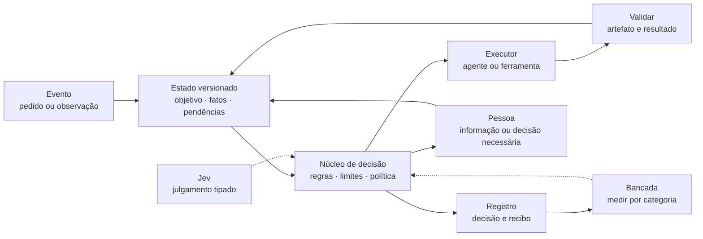
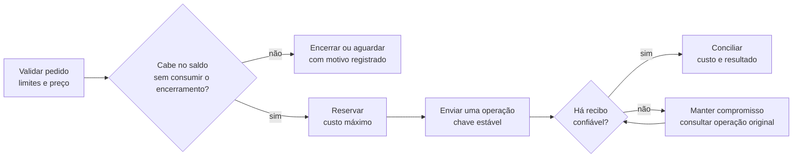
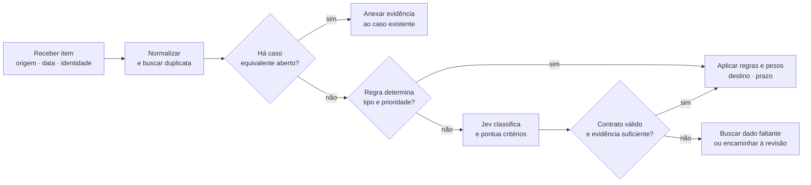
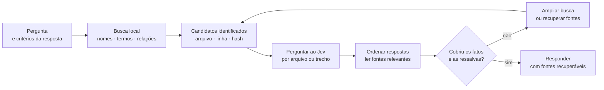
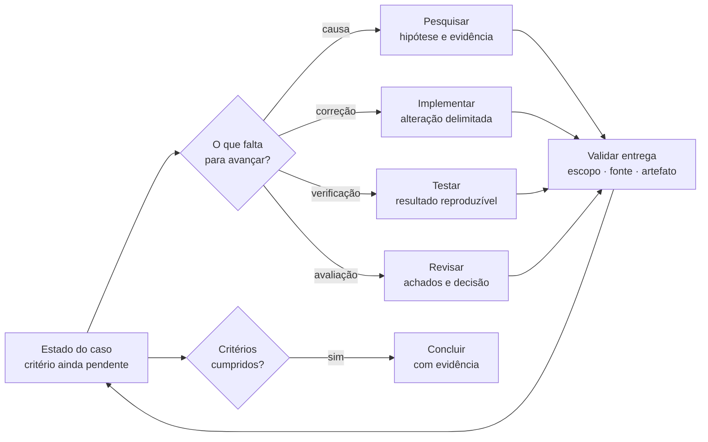
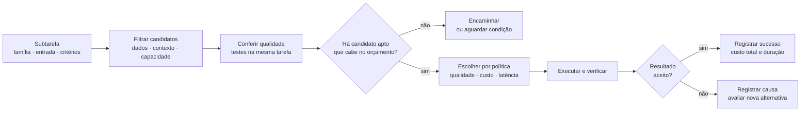
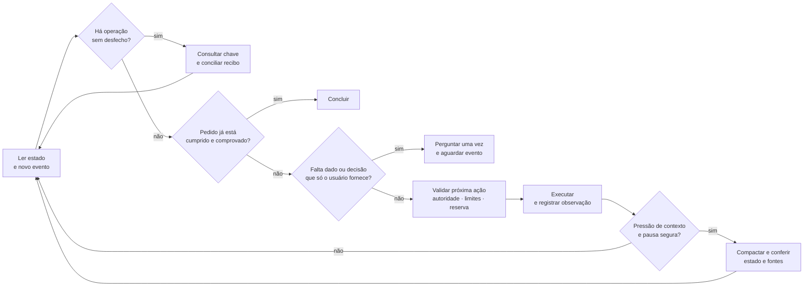
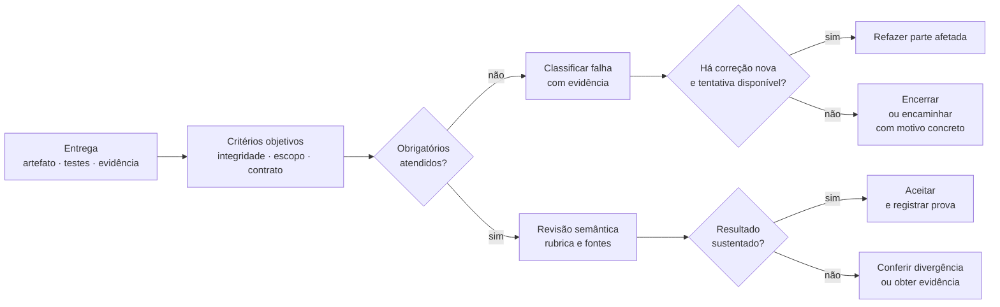
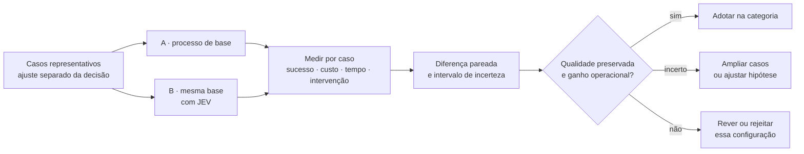
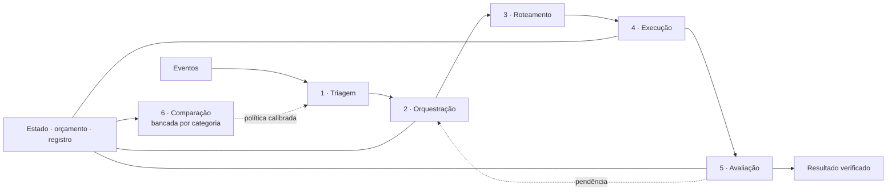

<!-- page: cover -->

# Arquitetura do JEV

Um núcleo de decisão. Seis políticas de trabalho.

**Interpretar. Decidir. Executar. Comprovar.**

Professor<strong>Igor Vasconcelos</strong>

<!-- page: principles -->

## Regras claras, evidência preservada

> O sistema mantém o estado e controla as ações. O modelo contribui com julgamentos delimitados.

### 01 · Decisões com limites

O código define opções, permissões, prazos e orçamento. O Jev classifica, pontua ou compara dentro desse contrato. Cálculos e verificações exatas permanecem no código.

### 02 · Conclusão com prova

Uma tarefa termina quando seus critérios são cumpridos e o resultado é verificado. Cada executor entrega artefato, evidência e pendências.

### 03 · Incerteza explícita

Toda classificação de mundo aberto oferece uma saída como “não se aplica”. Resposta inválida, falta de fonte e serviço indisponível recebem estados próprios.

### 04 · Continuidade sem duplicação

O estado guarda versão, decisões e operações. Uma resposta perdida leva à consulta da operação original. O identificador de execução acompanha a tarefa até o fim.

### 05 · Orçamento antes do envio

Cada chamada reserva seu custo máximo na carteira compartilhada. A reserva de encerramento financia a verificação e a resposta final. Saldo insuficiente impede novo despacho.

### 06 · Adoção por categoria

Qualidade, custo total, latência e intervenção são medidos em tarefas representativas. A autonomia acompanha esses resultados e pode recuar quando a categoria degrada.

<!-- page: diagram -->

## Uma arquitetura, responsabilidades definidas

> O estado conecta o pedido, o julgamento, a execução e a prova do resultado.

### Estado

Separa fatos observados, interpretações e operações pendentes. Toda atualização informa a versão que leu; um conflito exige reler o estado antes de decidir.

### Núcleo

Escolhe o próximo passo permitido. Uma proposta do modelo só é aproveitada quando corresponde ao contrato e ao estado atual.

### Execução e avaliação

Ferramentas produzem efeitos; validadores conferem resultados. A bancada calibra políticas por versão, categoria e ambiente.

<!-- page: evidence -->

## O que as experiências mudam no projeto

> Os resultados locais orientam a arquitetura quando o domínio, o conjunto de casos e o tipo de evidência estão identificados.

### Seleção de contexto precisa de cobertura

Nas 169 perguntas das rodadas R18–R20, dois trechos escolhidos pelo Jev produziram **158 acertos**, contra **141** com os oito trechos. O contexto caiu de 1.472.278 para 383.150 bytes. Eram perguntas sobre código do repositório, respondidas por um modelo. **Lição:** medir a resposta final junto da redução de contexto. [1]

### Respostas distribuídas pedem mais fontes

Na R26, a resposta exigia dois trechos. Um candidato selecionado acertou **6/80**; dois, **40/80**; três, **50/80**; todos os oito, **60/80**. **Lição:** começar com dois trechos para fonte única e três para estrutura distribuída ou desconhecida; ampliar quando faltar cobertura. Três é um ponto de partida operacional. [2]

### Confiança não substitui validação

Na R21b, uma instrução hostil inserida no estado mudou **28/81** classificações; uma mudança passou do corte de 0,90. **Lição:** preservar limites de autoridade, tratar conteúdo recebido como dado e conferir evidência. A confiança sozinha não protege o fluxo. [3]

### Recuperação precisa sobreviver à falha

Os testes do executor mantêm reserva após timeout e reinício, recusam liquidação dupla e limitam reservas concorrentes. Os testes do harness devolvem a mesma execução para a mesma chave e preservam o estado interrompido. **Lição:** recuperação e recibos fazem parte do contrato. [4, 5]

<!-- page: core -->

## O núcleo decide em ordem

> Cada passagem lê o estado atual, aplica precedência e registra o motivo da decisão.

### 1 · Cancelamento solicitado

Impedir novos despachos. Se existir operação enviada, registrar seu estado e reconciliar o resultado; um pedido de cancelamento não desfaz um efeito já ocorrido.

### 2 · Operação sem desfecho

Consultar recibo ou serviço pela chave original. Enquanto o efeito estiver desconhecido, impedir uma nova operação equivalente.

### 3 · Conclusão comprovada

Validar o resultado contra os critérios do pedido. Conferir artefato, escopo e pendências; registrar a evidência que permite concluir.

### 4 · Limites atingidos

Conferir prazo, custo, tentativas e progresso. Parar novos trabalhos quando faltar saldo; usar a reserva de encerramento para registrar o estado e entregar o resultado disponível.

### 5 · Regra da política

Aplicar a próxima regra determinística: encaminhar, buscar, executar, esperar ou revisar. Respeitar escolhas e autorizações já fornecidas pelo usuário.

### 6 · Julgamento delimitado

Consultar o modelo somente quando a semântica acrescentar informação útil. Validar a saída e aplicar a política; diante de insuficiência, buscar evidência, pedir o dado faltante ou abster.

<!-- page: table -->

## Estado suficiente para continuar

> Persistir o que permite entender, retomar e conferir a tarefa.

| Bloco | Conteúdo mínimo | Regra de atualização |
|---|---|---|
| Identidade | tarefa, evento, versão, instante | deduplicar eventos; recusar escrita sobre versão antiga |
| Pedido | objetivo, escopo, critérios de conclusão | guardar alterações e decisões explícitas do usuário |
| Autoridade | ações permitidas, destino, condições | não inferir permissão de uma resposta do modelo |
| Evidência | fonte, trecho ou artefato, data, hash | separar fato observado de interpretação; preservar origem |
| Execução | operação, chave, parâmetros, estado, recibo | mesma chave só para o mesmo pedido lógico |
| Orçamento | teto, comprometido, reservas, saldo | reserva atômica antes do envio; conciliação depois |
| Continuidade | pendências, tentativas, prazo, progresso | registrar o que mudou e o que impede avançar |
| Decisão | política e versão, opções, escolha, motivo | motivo vem da regra aplicada e das evidências usadas |

### Progresso observável

Contar evidência nova, pendência resolvida, hipótese eliminada ou artefato validado. Mudança de texto ou horário, sozinha, não caracteriza avanço.

### Espera por evento

Uma pergunta pendente guarda seu identificador. A resposta atualiza o estado e retoma o fluxo; o sistema consulta esse registro antes de perguntar novamente.

<!-- page: diagram -->

## Reserva e recibo acompanham a operação

> Saldo disponível considera o gasto confirmado e tudo o que ainda está reservado.

### Mesmo pedido, mesma chave

Reenviar pela mesma chave só é seguro quando o serviço oferece esse contrato. Mesma chave com parâmetros diferentes gera conflito. Sem suporte à idempotência, conciliar antes de autorizar nova tentativa. [5, 9]

### Falta de resposta mantém a dúvida

Timeout e interrupção podem ocorrer depois do envio. O livro-caixa mantém o compromisso até haver evidência suficiente; ausência de métricas não vira custo zero. [4]

### Encerramento é trabalho previsto

Dimensionar a reserva para validar, consolidar pendências e responder. O limite é compartilhado: outro processo não ganha orçamento novo ao iniciar.

<!-- page: diagram -->

## 1 · Triagem

> Entender o que chegou e encaminhar com a evidência necessária.

### Pergunta bem delimitada

Identificar de quem é o pedido, qual ação está em discussão e se ela é atual, negada, citada ou condicional. Copiar nomes, números e datas da fonte; validar a normalização em código.

### Pontuar e combinar

Impacto, urgência e abrangência recebem notas separadas. O código normaliza escalas e combina pesos definidos; alertas críticos têm precedência sobre a média. [10]

### Saída fora da taxonomia

“Não se aplica” cobre entrada fora das opções. “Informação insuficiente” sinaliza o que precisa ser obtido antes de encaminhar.

<!-- page: diagram -->

## Contexto: selecionar sem perder a resposta

> Perguntar sobre as fontes antes de carregá-las. Ler o necessário e conferir a cobertura.

### Perguntas por arquivo

O agente recebe rótulos e referências, sem carregar cada arquivo. Agrupar perguntas independentes sobre a mesma entrada; encadear chamadas quando uma resposta definir a pergunta seguinte. Preservar todos os IDs. [10]

### Leitura com cobertura

Começar com dois trechos para fonte única e três para resposta distribuída ou desconhecida. Ampliar até cobrir condições e exceções; ler o original antes de citar, concluir ou editar. [1, 2]

### Lotes controlados

Código filtra arquivos permitidos, limita volume e paralelismo e reserva o custo do lote. Erro técnico ou alerta de entrada leva à leitura direta; registrar os itens não analisados. [10]

<!-- page: diagram -->

## 2 · Orquestração de agentes

> Cada papel recebe uma pergunta e entrega um artefato verificável.

### Delegação delimitada

Distribuir tarefas independentes que tragam ganho observável. Informar entrada, responsabilidade, artefato esperado e limite; evitar agentes escrevendo no mesmo arquivo ao mesmo tempo.

### Perguntas sob demanda

Cada agente pode pedir ao Jev uma classificação sobre arquivos, logs ou hipóteses. Definir opções, escape e fonte; conferir o retorno antes de agir. [10]

### Conclusão da tarefa

O coordenador compara as entregas com o pedido inteiro. Achados sem fonte e entregas fora do escopo voltam à revisão. Aprovação de um papel não substitui critérios pendentes de outro.

<!-- page: diagram -->

## 3 · Roteamento de modelos

> Escolher por resultado medido na família de tarefas e pelas restrições do pedido.

### Catálogo com versão

Registrar modelo exato, provedor, esforço, ferramentas, data e ambiente de avaliação. Benchmarks servem à pré-seleção; tarefas locais decidem adequação.

### Custo do trabalho completo

Incluir tentativas malsucedidas, escaladas, verificação e retrabalho. Medir tempo até resultado aceito; preço por token e velocidade de geração são medidas auxiliares.

### Escolha sob restrições

Manter as preferências explícitas do usuário. O Jev pode classificar a família da tarefa; a política e o responsável decidem o modelo. Evidência ausente fica como “não medido”.

<!-- page: diagram -->

## 4 · Ciclo de execução

> Retomar pelo estado, consultar o que já foi enviado e agir dentro do escopo autorizado.

### Antes da ferramenta

Checar cada ferramenta no ponto de execução: escopo, cancelamento, limites e reserva. O parecer do Jev pode indicar risco; permissões vêm das regras e do estado. [10]

### Compactar em ponto seguro

Código mede uso de contexto; Jev avalia mudança de tarefa, etapa concluída e necessidade do histórico. Havendo pressão e pausa segura, o agente resume: objetivo, decisões, fontes e pendências. [10]

### Interrupção e recuperação

“Recebido”, “em execução” e “concluído” são estados distintos. O resumo preserva chaves e autorizações. Após reinício, consultar a execução original e suas evidências antes de decidir outra tentativa. [5]

<!-- page: diagram -->

## 5 · Avaliação

> Conferir o resultado contra o pedido e apontar o próximo passo útil.

### Obrigatórios não se compensam

Uma nota alta de redação não compensa número errado, fonte ausente ou funcionalidade quebrada. Conferir esses requisitos separadamente.

### Rubrica verificável

Descrever critérios observáveis e usar exemplos rotulados. Comparar avaliações automáticas com revisão humana; registrar divergências e a versão do critério.

### Diagnóstico e prova

Jev ajuda a classificar falhas e priorizar a investigação; código de saída e testes confirmam o resultado. Conferir também o artefato real, seu escopo e uso final. [10]

<!-- page: comparison -->

## 6 · Comparação

> Medir o efeito de acrescentar o JEV ao mesmo processo.

### Qualidade primeiro

Definir a margem aceitável antes de medir. Para diferença **B − A**, só considerar a qualidade preservada quando o limite inferior do intervalo superar a margem negativa e os requisitos críticos passarem.

### Incerteza permanece visível

Intervalo que cruza a margem exige mais evidência. Ausência de diferença significativa não demonstra equivalência. Preservar o pareamento por caso e considerar famílias de casos correlacionados.

### Ganho por tarefa concluída

**Custo por sucesso = custo de todas as tentativas ÷ sucessos verificados.** Sem sucesso, o indicador fica sem valor finito. Registrar também duração, revisão humana e cobertura automática.

<!-- page: integration -->

## As seis políticas trabalham juntas

> Triagem identifica a demanda; orquestração escolhe o trabalho; roteamento escolhe o recurso; execução produz; avaliação confere; comparação orienta adoção.

### Lição do Jev Flow

O Studio permite desenhar um fluxo, executar fixtures e inspecionar o caminho. O catálogo de nós explicita tipos, limites e efeitos. Essa combinação ajuda a revisar a política antes de uma execução real. [6]

### Aplicação no JEV

Reaproveitar a prévia, a trilha e os contratos de nós. Conectar chamadas ao executor financeiro compartilhado e às autorizações do estado. Contadores de passos ou tokens não substituem a reserva monetária.

### Evidência por camada

Uma simulação confirma o roteamento para respostas fornecidas. Inferência real avalia o componente. Fluxo completo exige conferir integração, efeito e resultado final.

<!-- page: rollout -->

## Implantação por evidência

> Avançar por categoria e versão, com critérios definidos antes da medição.

### 0 · Linha de base

Reunir casos reais representativos, registrar o processo atual e fixar critérios. Incluir casos sem resposta, entradas fora da taxonomia, conflitos, timeout e retomada.

**Passagem:** dados identificados, resultados reproduzíveis e medidas estáveis entre repetições.

### 1 · Modo sombra

O JEV produz julgamentos para comparação. Medir discordâncias por categoria e identificar se a causa está na fonte, no modelo, na regra ou na integração.

**Passagem:** qualidade e cobertura atingem o alvo definido, sem falha nos requisitos obrigatórios.

### 2 · Uso delimitado

Executar ações previstas no escopo autorizado. Manter limites, recibos, revisão dos casos incertos e recuperação de falhas. Medir o custo completo da operação.

**Passagem:** a comparação sustenta adoção na categoria e o fluxo real passa pelos critérios de aceitação.

### 3 · Expansão controlada

Ampliar categorias aprovadas; incorporar incidentes à regressão. Reavaliar quando mudar modelo, política, dados, ferramenta ou ambiente.

**Retorno:** degradação ou falha crítica reduz a autonomia da categoria até a correção ser verificada.

<!-- page: table -->

## Parâmetros que precisam de medida

> Limites operacionais são explícitos. Valores de qualidade e ganho vêm de avaliação na tarefa.

| Parâmetro | Como definir | Quando revisar |
|---|---|---|
| Tentativas de correção | limite por tipo de falha; exigir causa nova ou ação corretiva | repetição improdutiva ou ganho baixo nas tentativas finais |
| Ausência de progresso | pendências e evidências relevantes, prazo e limite de voltas | pausas prematuras ou ciclos sem resultado |
| Reserva de encerramento | custo máximo previsto de validar, consolidar e responder | mudança de saída, ferramentas ou preço |
| Confiança e abstenção | precisão e cobertura por classe em casos rotulados | novos tipos de entrada, versões ou erros graves |
| Contexto e compactação | cobertura, ocupação e ponto seguro de continuidade | seleção omite evidência ou histórico cresce sem ganho |
| Qualidade mínima | critérios obrigatórios e margem por família de tarefas | custo de erro ou demanda mudam |
| Escalada de recurso | falha verificada, alternativa capaz e saldo | troca repete a causa sem melhorar o resultado |
| Regra de adoção | qualidade preservada e benefício mensurável | diferença entre bancada e operação |

### Critérios permanentes

Não concluir sem prova. Não duplicar operação pendente. Não ultrapassar orçamento. Não transformar dado recebido em autorização. Preservar fontes, parâmetros e versão para reproduzir a decisão.

<!-- page: sources -->

## Fontes e evidências de implementação

> Referências que sustentam as decisões desta arquitetura.

### Estudos locais

**[1] R18–R20 · seleção de contexto.** 169 perguntas; arranjos e bytes em [r18-r20-consolidado.json](../laboratorio/r18-r20-consolidado.json). Síntese em [Dossiê de evidências](DOSSIE-DE-EVIDENCIAS.md).

**[2] R26 · respostas em dois trechos.** 80 pares; desempenho e presença dos alvos em [r26-dois-trechos.json](../laboratorio/r26-dois-trechos.json). Conduta de recuperação em [USO-CODEX.md](../integracao/USO-CODEX.md).

**[3] R21b · instrução hostil no estado.** 81 casos, 28 mudanças; dados em [r21b-cruzamento.json](../laboratorio/r21b-cruzamento.json). Histórico das correções em [Limites do Jev](LIMITES-DO-JEV.md).

### Código e contratos

**[4] Executor financeiro.** [test_ledger.py](../executor/tests/test_ledger.py) e [test_liquidacao_429.py](../executor/tests/test_liquidacao_429.py): reservas, concorrência, timeout, reinício e liquidação.

**[5] Operação por agentes.** [AGENT-GUIDE.md](../integracao/harness/AGENT-GUIDE.md) e [test_agents.py](../integracao/harness/test_agents.py): identidade de pedidos, recuperação e cancelamento. [test_seletores.py](../integracao/tests/test_seletores.py): opções válidas e escolha explícita. Esses quatro arquivos de teste somaram **45 testes e 3 subtestes aprovados** na revisão de 24/09/2026, em execução local com transporte simulado.

**[6] Jev Flow.** [Ficha de referência](../research/JEV-FLOW.md), revisão `75e63491f63691418251534f50e8c8ddca9a5fc0`: contratos, prévia, trilha e validação de fluxos.

### Contratos e fundamentos externos

**[7] TypeSafe · respostas tipadas.** [Primitives](https://docs.typesafe.ai/primitives): Choice, Score e Noul. Uma resposta tipada ainda exige validação da aplicação.

**[8] TypeSafe · confiança.** [Confidence](https://docs.typesafe.ai/confidence): concentração da distribuição em Choice e Score; Noul não tem confiança separada. Limiares dependem do domínio.

**[9] Amazon Builders’ Library · repetição de operações.** [Making retries safe with idempotent APIs](https://aws.amazon.com/builders-library/making-retries-safe-with-idempotent-APIs/): identidade do pedido, repetição e semântica de execução.

**[10] IndyDevDan · 10 Levels of Jev.** [Vídeo de 28/09/2026](https://www.youtube.com/watch?v=_U-O5lYhJ7Q) e [análise no acervo](../research/TEN-LEVELS-OF-JEV.md): pontuação por critério, consultas em lotes, compactação e perguntas sob demanda.
