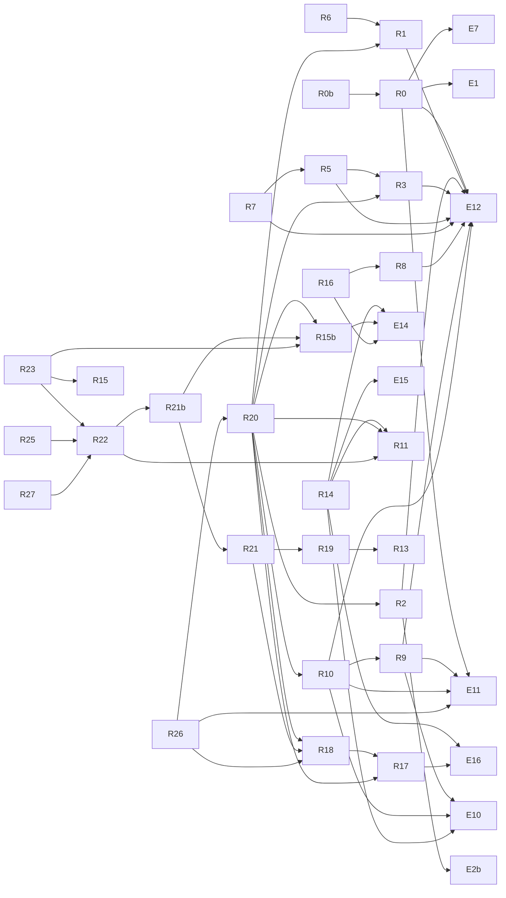

# Rodadas do laboratório

O programa E14: rodadas R0–R27 com pré-registro em `laboratorio/PREREGISTRO.md`, um script e um artefato de resultado cada.

← [MAPA.md](../../MAPA.md) · [Experimentos](../../mapa/conhecimento/experimentos.md) · [Hipóteses](../../mapa/conhecimento/hipoteses.md) · [Perguntas estratégicas](../../mapa/conhecimento/perguntas.md) · [Sistemas avaliados](../../mapa/conhecimento/sistemas.md) · [Revisões adversariais](../../mapa/conhecimento/revisoes.md) · [Testes](../../mapa/conhecimento/testes.md) · [Lacunas e ideias](../../mapa/conhecimento/lacunas.md)

**33** itens: [R0](../../mapa/conhecimento/rodadas.md#r0) [R0b](../../mapa/conhecimento/rodadas.md#r0b) [R1](../../mapa/conhecimento/rodadas.md#r1) [R2](../../mapa/conhecimento/rodadas.md#r2) [R3](../../mapa/conhecimento/rodadas.md#r3) [R4](../../mapa/conhecimento/rodadas.md#r4) [R5](../../mapa/conhecimento/rodadas.md#r5) [R6](../../mapa/conhecimento/rodadas.md#r6) [R7](../../mapa/conhecimento/rodadas.md#r7) [R8](../../mapa/conhecimento/rodadas.md#r8) [R9](../../mapa/conhecimento/rodadas.md#r9) [R10](../../mapa/conhecimento/rodadas.md#r10) [R11](../../mapa/conhecimento/rodadas.md#r11) [R12](../../mapa/conhecimento/rodadas.md#r12) [R13](../../mapa/conhecimento/rodadas.md#r13) [R14](../../mapa/conhecimento/rodadas.md#r14) [R15](../../mapa/conhecimento/rodadas.md#r15) [R15b](../../mapa/conhecimento/rodadas.md#r15b) [R16](../../mapa/conhecimento/rodadas.md#r16) [R16b](../../mapa/conhecimento/rodadas.md#r16b) [R17](../../mapa/conhecimento/rodadas.md#r17) [R17b](../../mapa/conhecimento/rodadas.md#r17b) [R18](../../mapa/conhecimento/rodadas.md#r18) [R19](../../mapa/conhecimento/rodadas.md#r19) [R20](../../mapa/conhecimento/rodadas.md#r20) [R21](../../mapa/conhecimento/rodadas.md#r21) [R21b](../../mapa/conhecimento/rodadas.md#r21b) [R22](../../mapa/conhecimento/rodadas.md#r22) [R23](../../mapa/conhecimento/rodadas.md#r23) [R24](../../mapa/conhecimento/rodadas.md#r24) [R25](../../mapa/conhecimento/rodadas.md#r25) [R26](../../mapa/conhecimento/rodadas.md#r26) [R27](../../mapa/conhecimento/rodadas.md#r27)

| id | título | executa | pré-registro | resultados | outras peças |
|---|---|---|---|---:|---|
| [R0](../../mapa/conhecimento/rodadas.md#r0) | A confiança do Jev é calibrada, ou só ordenada? (custo zero) | [r0_calibracao.py](../../laboratorio/r0_calibracao.py) | [PREREGISTRO.md](../../laboratorio/PREREGISTRO.md#L39) | 1 |  |
| [R0b](../../mapa/conhecimento/rodadas.md#r0b) | fechados. H0 sustentada, com uma inversão de sinal. |  | [PREREGISTRO.md](../../laboratorio/PREREGISTRO.md#L143) | 0 |  |
| [R1](../../mapa/conhecimento/rodadas.md#r1) | Quantas opções o Jev aguenta? | [r1_r3_estresse.py](../../laboratorio/r1_r3_estresse.py) | [PREREGISTRO.md](../../laboratorio/PREREGISTRO.md#L61) | 1 |  |
| [R2](../../mapa/conhecimento/rodadas.md#r2) | A ordem das opções enviesa a escolha? | [r1_r3_estresse.py](../../laboratorio/r1_r3_estresse.py) | [PREREGISTRO.md](../../laboratorio/PREREGISTRO.md#L81) | 1 |  |
| [R3](../../mapa/conhecimento/rodadas.md#r3) | O Jev aguenta o jeito que o Igor escreve? | [r1_r3_estresse.py](../../laboratorio/r1_r3_estresse.py) | [PREREGISTRO.md](../../laboratorio/PREREGISTRO.md#L99) | 1 |  |
| [R4](../../mapa/conhecimento/rodadas.md#r4) | O Jev é logicamente coerente consigo mesmo? | [r4_r7_limites.py](../../laboratorio/r4_r7_limites.py) | [PREREGISTRO.md](../../laboratorio/PREREGISTRO.md#L119) | 1 |  |
| [R5](../../mapa/conhecimento/rodadas.md#r5) | nascida de R3, e o achado mais útil do programa até agora. | [r4_r7_limites.py](../../laboratorio/r4_r7_limites.py) | [PREREGISTRO.md](../../laboratorio/PREREGISTRO.md#L193) | 1 |  |
| [R6](../../mapa/conhecimento/rodadas.md#r6) | onde fica o ponto de quebra do número de opções? | [r4_r7_limites.py](../../laboratorio/r4_r7_limites.py) | [PREREGISTRO.md](../../laboratorio/PREREGISTRO.md#L208) | 1 |  |
| [R7](../../mapa/conhecimento/rodadas.md#r7) | a confiança distingue texto ruim de sentido ambíguo? | [r4_r7_limites.py](../../laboratorio/r4_r7_limites.py) | [PREREGISTRO.md](../../laboratorio/PREREGISTRO.md#L221) | 1 |  |
| [R8](../../mapa/conhecimento/rodadas.md#r8) | 48 armadilhas semânticas novas: 91,7%, e nenhum erro acima de 0,90. | [r8_r9_adversarial.py](../../laboratorio/r8_r9_adversarial.py) | [PREREGISTRO.md](../../laboratorio/PREREGISTRO.md#L258) | 1 |  |
| [R9](../../mapa/conhecimento/rodadas.md#r9) | o desempate que o estudo arrastava desde o E10. | [r8_r9_adversarial.py](../../laboratorio/r8_r9_adversarial.py) | [PREREGISTRO.md](../../laboratorio/PREREGISTRO.md#L268) | 1 |  |
| [R10](../../mapa/conhecimento/rodadas.md#r10) | o desempate que o estudo arrastava desde o E10. | [r10_injecao_comparada.py](../../laboratorio/r10_injecao_comparada.py) | [PREREGISTRO.md](../../laboratorio/PREREGISTRO.md#L268) | 1 |  |
| [R11](../../mapa/conhecimento/rodadas.md#r11) | a varredura dos extremos, e um achado falso que eu mesma produzi. | [r11_extremos.py](../../laboratorio/r11_extremos.py) | [PREREGISTRO.md](../../laboratorio/PREREGISTRO.md#L292) | 1 |  |
| [R12](../../mapa/conhecimento/rodadas.md#r12) | diluição de contexto: nenhum efeito até 50 mil caracteres. | [r12_r13_contexto.py](../../laboratorio/r12_r13_contexto.py) | [PREREGISTRO.md](../../laboratorio/PREREGISTRO.md#L320) | 1 |  |
| [R13](../../mapa/conhecimento/rodadas.md#r13) | o modo de falha mais perigoso, e a mitigação que custa uma linha. | [r12_r13_contexto.py](../../laboratorio/r12_r13_contexto.py) | [PREREGISTRO.md](../../laboratorio/PREREGISTRO.md#L327) | 1 |  |
| [R14](../../mapa/conhecimento/rodadas.md#r14) | o ciclo autorrecursivo, medido em vez de proclamado. | [r14_autorrecursivo.py](../../laboratorio/r14_autorrecursivo.py) | [PREREGISTRO.md](../../laboratorio/PREREGISTRO.md#L339) | 1 |  |
| [R15](../../mapa/conhecimento/rodadas.md#r15) | a injeção escrita por outro | [r15_adversario_externo.py](../../laboratorio/r15_adversario_externo.py) | [PREREGISTRO.md](../../laboratorio/PREREGISTRO.md#L434) | 2 |  |
| [R15b](../../mapa/conhecimento/rodadas.md#r15b) | a emenda: "injeção" eram duas coisas | [r15b_familias.py](../../laboratorio/r15b_familias.py) | [PREREGISTRO.md](../../laboratorio/PREREGISTRO.md#L446) | 1 |  |
| [R16](../../mapa/conhecimento/rodadas.md#r16) | o guarda de comando irreversível | [r16_guarda_de_comando.py](../../laboratorio/r16_guarda_de_comando.py) | [PREREGISTRO.md](../../laboratorio/PREREGISTRO.md#L474) | 1 |  |
| [R16b](../../mapa/conhecimento/rodadas.md#r16b) | o desenho certo: segunda camada |  | [PREREGISTRO.md](../../laboratorio/PREREGISTRO.md#L503) | 0 |  |
| [R17](../../mapa/conhecimento/rodadas.md#r17) | a pergunta que o projeto nunca tinha respondido: quanto isso economiza? | [r17_economia_de_contexto.py](../../laboratorio/r17_economia_de_contexto.py) | [PREREGISTRO.md](../../laboratorio/PREREGISTRO.md#L534) | 1 |  |
| [R17b](../../mapa/conhecimento/rodadas.md#r17b) | análise de sensibilidade: o que muda se a minha verificação estivesse certa. | [r17b_sensibilidade.py](../../laboratorio/r17b_sensibilidade.py) |  | 1 |  |
| [R18](../../mapa/conhecimento/rodadas.md#r18) | a R17 em escala, com as perguntas feitas por máquina | [r18_escala.py](../../laboratorio/r18_escala.py) | [PREREGISTRO.md](../../laboratorio/PREREGISTRO.md#L619) | 3 |  |
| [R19](../../mapa/conhecimento/rodadas.md#r19) | atacar a pior fraqueza medida, e usar o contrato inteiro | [r19_armadilha_de_sujeito.py](../../laboratorio/r19_armadilha_de_sujeito.py) | [PREREGISTRO.md](../../laboratorio/PREREGISTRO.md#L668) | 3 |  |
| [R20](../../mapa/conhecimento/rodadas.md#r20) | o lote novo que deu poder ao achado, e o k que a confiança escolhe | [r20_k_adaptativo.py](../../laboratorio/r20_k_adaptativo.py) | [PREREGISTRO.md](../../laboratorio/PREREGISTRO.md#L709) | 3 |  |
| [R21](../../mapa/conhecimento/rodadas.md#r21) | o Jev fora do atendimento em português | [r21_generalizacao.py](../../laboratorio/r21_generalizacao.py) | [PREREGISTRO.md](../../laboratorio/PREREGISTRO.md#L883) | 3 |  |
| [R21b](../../mapa/conhecimento/rodadas.md#r21b) | a correção que custou mais caro do programa inteiro | [r21b_cruzamento.py](../../laboratorio/r21b_cruzamento.py) | [PREREGISTRO.md](../../laboratorio/PREREGISTRO.md#L918) | 1 |  |
| [R22](../../mapa/conhecimento/rodadas.md#r22) | a defesa contra a ordem direta, medida | [r22_defesas.py](../../laboratorio/r22_defesas.py) | [PREREGISTRO.md](../../laboratorio/PREREGISTRO.md#L952) | 1 |  |
| [R23](../../mapa/conhecimento/rodadas.md#r23) | o sanitizador contra a ordem escrita de outro jeito (12.377 chamadas) | [r23_parafrase.py](../../laboratorio/r23_parafrase.py) | [PREREGISTRO.md](../../laboratorio/PREREGISTRO.md#L1033) | 2 |  |
| [R24](../../mapa/conhecimento/rodadas.md#r24) | votação de ponta a ponta (758 chamadas) | [r24_votacao.py](../../laboratorio/r24_votacao.py) | [PREREGISTRO.md](../../laboratorio/PREREGISTRO.md#L1069) | 1 |  |
| [R25](../../mapa/conhecimento/rodadas.md#r25) | o terceiro domínio (303 chamadas) | [r25_terceiro_dominio.py](../../laboratorio/r25_terceiro_dominio.py) | [PREREGISTRO.md](../../laboratorio/PREREGISTRO.md#L1081) | 2 |  |
| [R26](../../mapa/conhecimento/rodadas.md#r26) | a resposta que exige dois trechos (1.747 chamadas, mais 897 perdidas) | [r26_dois_trechos.py](../../laboratorio/r26_dois_trechos.py) | [PREREGISTRO.md](../../laboratorio/PREREGISTRO.md#L1103) | 2 |  |
| [R27](../../mapa/conhecimento/rodadas.md#r27) | sanitizador e sentinela no mesmo payload (925 chamadas) | [r27_integracao.py](../../laboratorio/r27_integracao.py) | [PREREGISTRO.md](../../laboratorio/PREREGISTRO.md#L1093) | 1 |  |

## Linhagem

Quem se apoia em quem: a seta sai do estudo que usa o resultado de outro, lida do pré-registro e das seções de resultado.

## Itens

### R0 — A confiança do Jev é calibrada, ou só ordenada? (custo zero)

- **seções no pré-registro:** [A confiança do Jev é calibrada, ou só ordenada? (custo zero)](../../laboratorio/PREREGISTRO.md#L39); [fechados. H0 sustentada, com uma inversão de sinal.](../../laboratorio/PREREGISTRO.md#L143)
- **onde está:** pré-registra [laboratorio/PREREGISTRO.md:39](../../laboratorio/PREREGISTRO.md#L39); resultado [laboratorio/r0-calibracao.json](../../laboratorio/r0-calibracao.json); executa [laboratorio/r0_calibracao.py](../../laboratorio/r0_calibracao.py)
- **apoia-se em:** [E1](../../mapa/conhecimento/experimentos.md#e1), [E7](../../mapa/conhecimento/experimentos.md#e7), [E11](../../mapa/conhecimento/experimentos.md#e11), [E12](../../mapa/conhecimento/experimentos.md#e12)
- **sustenta:** [R0b](../../mapa/conhecimento/rodadas.md#r0b), [H023](../../mapa/conhecimento/hipoteses.md#h023), [H024](../../mapa/conhecimento/hipoteses.md#h024)
- **mencionado em 5 arquivos:** [laboratorio/gerar_mapa_visual.py](../../laboratorio/gerar_mapa_visual.py) (5×), [output/mapa-de-limites.html](../../output/mapa-de-limites.html) (5×), [docs/CEM-HIPOTESES.md](../../docs/CEM-HIPOTESES.md) (2×), [laboratorio/h100-resultados.json](../../laboratorio/h100-resultados.json) (2×), [laboratorio/h100/registro.py](../../laboratorio/h100/registro.py) (2×)

### R0b — fechados. H0 sustentada, com uma inversão de sinal.

- **seções no pré-registro:** [fechados. H0 sustentada, com uma inversão de sinal.](../../laboratorio/PREREGISTRO.md#L143)
- **onde está:** pré-registra [laboratorio/PREREGISTRO.md:143](../../laboratorio/PREREGISTRO.md#L143)
- **apoia-se em:** [R0](../../mapa/conhecimento/rodadas.md#r0)

### R1 — Quantas opções o Jev aguenta?

- **seções no pré-registro:** [Quantas opções o Jev aguenta?](../../laboratorio/PREREGISTRO.md#L61); [H1 **falsificada**. O Jev aguenta taxonomia grande.](../../laboratorio/PREREGISTRO.md#L159)
- **onde está:** pré-registra [laboratorio/PREREGISTRO.md:61](../../laboratorio/PREREGISTRO.md#L61); resultado [laboratorio/r1-r3-estresse.json](../../laboratorio/r1-r3-estresse.json); executa [laboratorio/r1_r3_estresse.py](../../laboratorio/r1_r3_estresse.py)
- **apoia-se em:** [E12](../../mapa/conhecimento/experimentos.md#e12)
- **sustenta:** [R6](../../mapa/conhecimento/rodadas.md#r6), [R20](../../mapa/conhecimento/rodadas.md#r20), [H005](../../mapa/conhecimento/hipoteses.md#h005), [H006](../../mapa/conhecimento/hipoteses.md#h006), [H013](../../mapa/conhecimento/hipoteses.md#h013), [H021](../../mapa/conhecimento/hipoteses.md#h021), [H022](../../mapa/conhecimento/hipoteses.md#h022), [H084](../../mapa/conhecimento/hipoteses.md#h084), [H085](../../mapa/conhecimento/hipoteses.md#h085), [Q007](../../mapa/conhecimento/perguntas.md#q007), [Q023](../../mapa/conhecimento/perguntas.md#q023)
- **mencionado em 14 arquivos:** [laboratorio/h100-resultados.json](../../laboratorio/h100-resultados.json) (9×), [docs/CEM-HIPOTESES.md](../../docs/CEM-HIPOTESES.md) (8×), [laboratorio/h100/registro.py](../../laboratorio/h100/registro.py) (8×), [laboratorio/gerar_mapa_visual.py](../../laboratorio/gerar_mapa_visual.py) (5×), [output/mapa-de-limites.html](../../output/mapa-de-limites.html) (5×), [laboratorio/auditoria.py](../../laboratorio/auditoria.py) (3×), [laboratorio/q100/respostas.py](../../laboratorio/q100/respostas.py) (3×), [docs/AUDITORIA-DE-NUMEROS.md](../../docs/AUDITORIA-DE-NUMEROS.md) (2×), [docs/GUIA-PRATICO-JEV.md](../../docs/GUIA-PRATICO-JEV.md) (2×), [laboratorio/r24_votacao.py](../../laboratorio/r24_votacao.py) (2×), [laboratorio/auditoria-placar.json](../../laboratorio/auditoria-placar.json) (1×), [laboratorio/h100/dados.py](../../laboratorio/h100/dados.py) (1×) … e mais 2

### R2 — A ordem das opções enviesa a escolha?

- **seções no pré-registro:** [A ordem das opções enviesa a escolha?](../../laboratorio/PREREGISTRO.md#L81); [H2 **sustentada**, e de forma absoluta.](../../laboratorio/PREREGISTRO.md#L172)
- **onde está:** pré-registra [laboratorio/PREREGISTRO.md:81](../../laboratorio/PREREGISTRO.md#L81); resultado [laboratorio/r1-r3-estresse.json](../../laboratorio/r1-r3-estresse.json); executa [laboratorio/r1_r3_estresse.py](../../laboratorio/r1_r3_estresse.py)
- **apoia-se em:** [E2b](../../mapa/conhecimento/experimentos.md#e2b), [E12](../../mapa/conhecimento/experimentos.md#e12)
- **sustenta:** [R20](../../mapa/conhecimento/rodadas.md#r20), [H005](../../mapa/conhecimento/hipoteses.md#h005), [H006](../../mapa/conhecimento/hipoteses.md#h006), [H013](../../mapa/conhecimento/hipoteses.md#h013), [H021](../../mapa/conhecimento/hipoteses.md#h021), [H022](../../mapa/conhecimento/hipoteses.md#h022), [H084](../../mapa/conhecimento/hipoteses.md#h084), [H085](../../mapa/conhecimento/hipoteses.md#h085), [Q007](../../mapa/conhecimento/perguntas.md#q007), [Q023](../../mapa/conhecimento/perguntas.md#q023)
- **mencionado em 12 arquivos:** [laboratorio/h100-resultados.json](../../laboratorio/h100-resultados.json) (9×), [docs/CEM-HIPOTESES.md](../../docs/CEM-HIPOTESES.md) (8×), [laboratorio/h100/registro.py](../../laboratorio/h100/registro.py) (8×), [laboratorio/auditoria.py](../../laboratorio/auditoria.py) (3×), [laboratorio/q100/respostas.py](../../laboratorio/q100/respostas.py) (3×), [docs/AUDITORIA-DE-NUMEROS.md](../../docs/AUDITORIA-DE-NUMEROS.md) (2×), [laboratorio/r24_votacao.py](../../laboratorio/r24_votacao.py) (2×), [docs/GUIA-PRATICO-JEV.md](../../docs/GUIA-PRATICO-JEV.md) (1×), [laboratorio/auditoria-placar.json](../../laboratorio/auditoria-placar.json) (1×), [laboratorio/h100/dados.py](../../laboratorio/h100/dados.py) (1×), [laboratorio/h100/provas.py](../../laboratorio/h100/provas.py) (1×), [laboratorio/tests/test_auditoria.py](../../laboratorio/tests/test_auditoria.py) (1×)

### R3 — O Jev aguenta o jeito que o Igor escreve?

- **seções no pré-registro:** [O Jev aguenta o jeito que o Igor escreve?](../../laboratorio/PREREGISTRO.md#L99); [H3 **parcialmente falsificada**.](../../laboratorio/PREREGISTRO.md#L182)
- **onde está:** pré-registra [laboratorio/PREREGISTRO.md:99](../../laboratorio/PREREGISTRO.md#L99); resultado [laboratorio/r1-r3-estresse.json](../../laboratorio/r1-r3-estresse.json); executa [laboratorio/r1_r3_estresse.py](../../laboratorio/r1_r3_estresse.py)
- **apoia-se em:** [E12](../../mapa/conhecimento/experimentos.md#e12)
- **sustenta:** [R5](../../mapa/conhecimento/rodadas.md#r5), [R20](../../mapa/conhecimento/rodadas.md#r20), [H005](../../mapa/conhecimento/hipoteses.md#h005), [H006](../../mapa/conhecimento/hipoteses.md#h006), [H013](../../mapa/conhecimento/hipoteses.md#h013), [H021](../../mapa/conhecimento/hipoteses.md#h021), [H022](../../mapa/conhecimento/hipoteses.md#h022), [H084](../../mapa/conhecimento/hipoteses.md#h084), [H085](../../mapa/conhecimento/hipoteses.md#h085), [Q007](../../mapa/conhecimento/perguntas.md#q007), [Q023](../../mapa/conhecimento/perguntas.md#q023)
- **mencionado em 13 arquivos:** [laboratorio/h100-resultados.json](../../laboratorio/h100-resultados.json) (9×), [docs/CEM-HIPOTESES.md](../../docs/CEM-HIPOTESES.md) (8×), [laboratorio/h100/registro.py](../../laboratorio/h100/registro.py) (8×), [laboratorio/auditoria.py](../../laboratorio/auditoria.py) (3×), [laboratorio/q100/respostas.py](../../laboratorio/q100/respostas.py) (3×), [docs/AUDITORIA-DE-NUMEROS.md](../../docs/AUDITORIA-DE-NUMEROS.md) (2×), [laboratorio/r24_votacao.py](../../laboratorio/r24_votacao.py) (2×), [docs/GUIA-PRATICO-JEV.md](../../docs/GUIA-PRATICO-JEV.md) (1×), [laboratorio/auditoria-placar.json](../../laboratorio/auditoria-placar.json) (1×), [laboratorio/h100/dados.py](../../laboratorio/h100/dados.py) (1×), [laboratorio/h100/provas.py](../../laboratorio/h100/provas.py) (1×), [laboratorio/r11_extremos.py](../../laboratorio/r11_extremos.py) (1×) … e mais 1

### R4 — O Jev é logicamente coerente consigo mesmo?

- **seções no pré-registro:** [O Jev é logicamente coerente consigo mesmo?](../../laboratorio/PREREGISTRO.md#L119); [coerência lógica (pré-registrada acima, ainda não executada)](../../laboratorio/PREREGISTRO.md#L206); [H4 sustentada, com 3,3% de contradição dura.](../../laboratorio/PREREGISTRO.md#L242)
- **onde está:** pré-registra [laboratorio/PREREGISTRO.md:119](../../laboratorio/PREREGISTRO.md#L119); resultado [laboratorio/r4-r7-limites.json](../../laboratorio/r4-r7-limites.json); executa [laboratorio/r4_r7_limites.py](../../laboratorio/r4_r7_limites.py)
- **sustenta:** [H012](../../mapa/conhecimento/hipoteses.md#h012), [H013](../../mapa/conhecimento/hipoteses.md#h013), [H016](../../mapa/conhecimento/hipoteses.md#h016), [H029](../../mapa/conhecimento/hipoteses.md#h029), [H030](../../mapa/conhecimento/hipoteses.md#h030), [H031](../../mapa/conhecimento/hipoteses.md#h031), [H033](../../mapa/conhecimento/hipoteses.md#h033), [H034](../../mapa/conhecimento/hipoteses.md#h034), [H035](../../mapa/conhecimento/hipoteses.md#h035), [H036](../../mapa/conhecimento/hipoteses.md#h036)
- **mencionado em 7 arquivos:** [docs/CEM-HIPOTESES.md](../../docs/CEM-HIPOTESES.md) (7×), [laboratorio/h100-resultados.json](../../laboratorio/h100-resultados.json) (7×), [laboratorio/h100/registro.py](../../laboratorio/h100/registro.py) (5×), [laboratorio/h100/dados.py](../../laboratorio/h100/dados.py) (2×), [laboratorio/q100/respostas.py](../../laboratorio/q100/respostas.py) (2×), [docs/GUIA-PRATICO-JEV.md](../../docs/GUIA-PRATICO-JEV.md) (1×), [laboratorio/h100/provas.py](../../laboratorio/h100/provas.py) (1×)

### R5 — nascida de R3, e o achado mais útil do programa até agora.

- **seções no pré-registro:** [nascida de R3, e o achado mais útil do programa até agora.](../../laboratorio/PREREGISTRO.md#L193)
- **onde está:** pré-registra [laboratorio/PREREGISTRO.md:193](../../laboratorio/PREREGISTRO.md#L193); resultado [laboratorio/r4-r7-limites.json](../../laboratorio/r4-r7-limites.json); executa [laboratorio/r4_r7_limites.py](../../laboratorio/r4_r7_limites.py)
- **apoia-se em:** [E12](../../mapa/conhecimento/experimentos.md#e12), [R3](../../mapa/conhecimento/rodadas.md#r3)
- **sustenta:** [R7](../../mapa/conhecimento/rodadas.md#r7), [H012](../../mapa/conhecimento/hipoteses.md#h012), [H013](../../mapa/conhecimento/hipoteses.md#h013), [H016](../../mapa/conhecimento/hipoteses.md#h016), [H029](../../mapa/conhecimento/hipoteses.md#h029), [H030](../../mapa/conhecimento/hipoteses.md#h030), [H031](../../mapa/conhecimento/hipoteses.md#h031), [H033](../../mapa/conhecimento/hipoteses.md#h033), [H034](../../mapa/conhecimento/hipoteses.md#h034), [H035](../../mapa/conhecimento/hipoteses.md#h035), [H036](../../mapa/conhecimento/hipoteses.md#h036)
- **mencionado em 7 arquivos:** [docs/CEM-HIPOTESES.md](../../docs/CEM-HIPOTESES.md) (7×), [laboratorio/h100-resultados.json](../../laboratorio/h100-resultados.json) (7×), [laboratorio/h100/registro.py](../../laboratorio/h100/registro.py) (5×), [laboratorio/q100/respostas.py](../../laboratorio/q100/respostas.py) (2×), [docs/GUIA-PRATICO-JEV.md](../../docs/GUIA-PRATICO-JEV.md) (1×), [laboratorio/h100/dados.py](../../laboratorio/h100/dados.py) (1×), [laboratorio/h100/provas.py](../../laboratorio/h100/provas.py) (1×)

### R6 — onde fica o ponto de quebra do número de opções?

- **seções no pré-registro:** [onde fica o ponto de quebra do número de opções?](../../laboratorio/PREREGISTRO.md#L208); [H6 sustentada. O ponto de quebra da taxonomia fica entre 12 e 20.](../../laboratorio/PREREGISTRO.md#L249)
- **onde está:** pré-registra [laboratorio/PREREGISTRO.md:208](../../laboratorio/PREREGISTRO.md#L208); resultado [laboratorio/r4-r7-limites.json](../../laboratorio/r4-r7-limites.json); executa [laboratorio/r4_r7_limites.py](../../laboratorio/r4_r7_limites.py)
- **apoia-se em:** [R1](../../mapa/conhecimento/rodadas.md#r1)
- **sustenta:** [H012](../../mapa/conhecimento/hipoteses.md#h012), [H013](../../mapa/conhecimento/hipoteses.md#h013), [H016](../../mapa/conhecimento/hipoteses.md#h016), [H029](../../mapa/conhecimento/hipoteses.md#h029), [H030](../../mapa/conhecimento/hipoteses.md#h030), [H031](../../mapa/conhecimento/hipoteses.md#h031), [H033](../../mapa/conhecimento/hipoteses.md#h033), [H034](../../mapa/conhecimento/hipoteses.md#h034), [H035](../../mapa/conhecimento/hipoteses.md#h035), [H036](../../mapa/conhecimento/hipoteses.md#h036)
- **mencionado em 8 arquivos:** [docs/CEM-HIPOTESES.md](../../docs/CEM-HIPOTESES.md) (8×), [laboratorio/h100-resultados.json](../../laboratorio/h100-resultados.json) (8×), [laboratorio/h100/registro.py](../../laboratorio/h100/registro.py) (6×), [laboratorio/q100/respostas.py](../../laboratorio/q100/respostas.py) (2×), [docs/GUIA-PRATICO-JEV.md](../../docs/GUIA-PRATICO-JEV.md) (1×), [laboratorio/h100/dados.py](../../laboratorio/h100/dados.py) (1×), [laboratorio/h100/provas.py](../../laboratorio/h100/provas.py) (1×), [laboratorio/r11_extremos.py](../../laboratorio/r11_extremos.py) (1×)

### R7 — a confiança distingue texto ruim de sentido ambíguo?

- **seções no pré-registro:** [a confiança distingue texto ruim de sentido ambíguo?](../../laboratorio/PREREGISTRO.md#L221)
- **onde está:** pré-registra [laboratorio/PREREGISTRO.md:221](../../laboratorio/PREREGISTRO.md#L221); resultado [laboratorio/r4-r7-limites.json](../../laboratorio/r4-r7-limites.json); executa [laboratorio/r4_r7_limites.py](../../laboratorio/r4_r7_limites.py)
- **apoia-se em:** [E12](../../mapa/conhecimento/experimentos.md#e12), [R5](../../mapa/conhecimento/rodadas.md#r5)
- **sustenta:** [H012](../../mapa/conhecimento/hipoteses.md#h012), [H013](../../mapa/conhecimento/hipoteses.md#h013), [H016](../../mapa/conhecimento/hipoteses.md#h016), [H029](../../mapa/conhecimento/hipoteses.md#h029), [H030](../../mapa/conhecimento/hipoteses.md#h030), [H031](../../mapa/conhecimento/hipoteses.md#h031), [H033](../../mapa/conhecimento/hipoteses.md#h033), [H034](../../mapa/conhecimento/hipoteses.md#h034), [H035](../../mapa/conhecimento/hipoteses.md#h035), [H036](../../mapa/conhecimento/hipoteses.md#h036)
- **mencionado em 8 arquivos:** [docs/CEM-HIPOTESES.md](../../docs/CEM-HIPOTESES.md) (9×), [laboratorio/h100-resultados.json](../../laboratorio/h100-resultados.json) (9×), [laboratorio/h100/registro.py](../../laboratorio/h100/registro.py) (7×), [docs/GUIA-PRATICO-JEV.md](../../docs/GUIA-PRATICO-JEV.md) (2×), [laboratorio/q100/respostas.py](../../laboratorio/q100/respostas.py) (2×), [laboratorio/h100/dados.py](../../laboratorio/h100/dados.py) (1×), [laboratorio/h100/provas.py](../../laboratorio/h100/provas.py) (1×), [laboratorio/r8_r9_adversarial.py](../../laboratorio/r8_r9_adversarial.py) (1×)

### R8 — 48 armadilhas semânticas novas: 91,7%, e nenhum erro acima de 0,90.

- **seções no pré-registro:** [48 armadilhas semânticas novas: 91,7%, e nenhum erro acima de 0,90.](../../laboratorio/PREREGISTRO.md#L258)
- **onde está:** pré-registra [laboratorio/PREREGISTRO.md:258](../../laboratorio/PREREGISTRO.md#L258); resultado [laboratorio/r8-r9-adversarial.json](../../laboratorio/r8-r9-adversarial.json); executa [laboratorio/r8_r9_adversarial.py](../../laboratorio/r8_r9_adversarial.py)
- **apoia-se em:** [E12](../../mapa/conhecimento/experimentos.md#e12)
- **sustenta:** [R16](../../mapa/conhecimento/rodadas.md#r16), [H013](../../mapa/conhecimento/hipoteses.md#h013), [H020](../../mapa/conhecimento/hipoteses.md#h020), [H022](../../mapa/conhecimento/hipoteses.md#h022), [H067](../../mapa/conhecimento/hipoteses.md#h067), [H068](../../mapa/conhecimento/hipoteses.md#h068), [H072](../../mapa/conhecimento/hipoteses.md#h072), [H073](../../mapa/conhecimento/hipoteses.md#h073), [H074](../../mapa/conhecimento/hipoteses.md#h074), [H075](../../mapa/conhecimento/hipoteses.md#h075), [H076](../../mapa/conhecimento/hipoteses.md#h076), [H094](../../mapa/conhecimento/hipoteses.md#h094), [Q034](../../mapa/conhecimento/perguntas.md#q034)
- **mencionado em 16 arquivos:** [laboratorio/h100-resultados.json](../../laboratorio/h100-resultados.json) (12×), [docs/CEM-HIPOTESES.md](../../docs/CEM-HIPOTESES.md) (10×), [laboratorio/h100/registro.py](../../laboratorio/h100/registro.py) (10×), [laboratorio/r18-escala.json](../../laboratorio/r18-escala.json) (9×), [laboratorio/auditoria.py](../../laboratorio/auditoria.py) (6×), [laboratorio/r26-bruto.json](../../laboratorio/r26-bruto.json) (6×), [laboratorio/r26-dois-trechos.json](../../laboratorio/r26-dois-trechos.json) (6×), [laboratorio/h100/provas.py](../../laboratorio/h100/provas.py) (2×), [laboratorio/r16_guarda_de_comando.py](../../laboratorio/r16_guarda_de_comando.py) (2×), [docs/AUDITORIA-DE-NUMEROS.md](../../docs/AUDITORIA-DE-NUMEROS.md) (1×), [docs/GUIA-PRATICO-JEV.md](../../docs/GUIA-PRATICO-JEV.md) (1×), [laboratorio/auditoria-placar.json](../../laboratorio/auditoria-placar.json) (1×) … e mais 4

### R9 — o desempate que o estudo arrastava desde o E10.

- **seções no pré-registro:** [o desempate que o estudo arrastava desde o E10.](../../laboratorio/PREREGISTRO.md#L268)
- **onde está:** pré-registra [laboratorio/PREREGISTRO.md:268](../../laboratorio/PREREGISTRO.md#L268); resultado [laboratorio/r8-r9-adversarial.json](../../laboratorio/r8-r9-adversarial.json); executa [laboratorio/r8_r9_adversarial.py](../../laboratorio/r8_r9_adversarial.py)
- **apoia-se em:** [E10](../../mapa/conhecimento/experimentos.md#e10), [E11](../../mapa/conhecimento/experimentos.md#e11), [E12](../../mapa/conhecimento/experimentos.md#e12)
- **sustenta:** [R10](../../mapa/conhecimento/rodadas.md#r10), [H013](../../mapa/conhecimento/hipoteses.md#h013), [H020](../../mapa/conhecimento/hipoteses.md#h020), [H022](../../mapa/conhecimento/hipoteses.md#h022), [H067](../../mapa/conhecimento/hipoteses.md#h067), [H068](../../mapa/conhecimento/hipoteses.md#h068), [H072](../../mapa/conhecimento/hipoteses.md#h072), [H094](../../mapa/conhecimento/hipoteses.md#h094), [Q034](../../mapa/conhecimento/perguntas.md#q034)
- **mencionado em 14 arquivos:** [docs/CEM-HIPOTESES.md](../../docs/CEM-HIPOTESES.md) (6×), [laboratorio/auditoria.py](../../laboratorio/auditoria.py) (6×), [laboratorio/h100-resultados.json](../../laboratorio/h100-resultados.json) (6×), [laboratorio/h100/registro.py](../../laboratorio/h100/registro.py) (5×), [laboratorio/r10_injecao_comparada.py](../../laboratorio/r10_injecao_comparada.py) (5×), [laboratorio/r20-k-adaptativo.json](../../laboratorio/r20-k-adaptativo.json) (5×), [laboratorio/h100/provas.py](../../laboratorio/h100/provas.py) (4×), [docs/AUDITORIA-DE-NUMEROS.md](../../docs/AUDITORIA-DE-NUMEROS.md) (1×), [laboratorio/auditoria-placar.json](../../laboratorio/auditoria-placar.json) (1×), [laboratorio/h100/dados.py](../../laboratorio/h100/dados.py) (1×), [laboratorio/q100/respostas.py](../../laboratorio/q100/respostas.py) (1×), [laboratorio/r26-bruto.json](../../laboratorio/r26-bruto.json) (1×) … e mais 2

### R10 — o desempate que o estudo arrastava desde o E10.

- **seções no pré-registro:** [o desempate que o estudo arrastava desde o E10.](../../laboratorio/PREREGISTRO.md#L268)
- **onde está:** pré-registra [laboratorio/PREREGISTRO.md:268](../../laboratorio/PREREGISTRO.md#L268); resultado [laboratorio/r10-injecao-comparada.json](../../laboratorio/r10-injecao-comparada.json); executa [laboratorio/r10_injecao_comparada.py](../../laboratorio/r10_injecao_comparada.py)
- **apoia-se em:** [E10](../../mapa/conhecimento/experimentos.md#e10), [E11](../../mapa/conhecimento/experimentos.md#e11), [E12](../../mapa/conhecimento/experimentos.md#e12), [R9](../../mapa/conhecimento/rodadas.md#r9)
- **sustenta:** [R20](../../mapa/conhecimento/rodadas.md#r20)
- **mencionado em 9 arquivos:** [laboratorio/auditoria.py](../../laboratorio/auditoria.py) (7×), [laboratorio/h100/dados.py](../../laboratorio/h100/dados.py) (3×), [laboratorio/r15_adversario_externo.py](../../laboratorio/r15_adversario_externo.py) (2×), [docs/AUDITORIA-DE-NUMEROS.md](../../docs/AUDITORIA-DE-NUMEROS.md) (1×), [docs/GUIA-PRATICO-JEV.md](../../docs/GUIA-PRATICO-JEV.md) (1×), [laboratorio/auditoria-placar.json](../../laboratorio/auditoria-placar.json) (1×), [laboratorio/q100/respostas.py](../../laboratorio/q100/respostas.py) (1×), [laboratorio/r15b_familias.py](../../laboratorio/r15b_familias.py) (1×), [laboratorio/tests/test_auditoria.py](../../laboratorio/tests/test_auditoria.py) (1×)

### R11 — a varredura dos extremos, e um achado falso que eu mesma produzi.

- **retratações:** diluicao/20k, diluicao/30k (2026-09-19): O LIMITE_DE_CARACTERES do núcleo do laboratório estava em 12.000 e o recheio vinha antes da mensagem, então o truncamento cortava fora o pedido do cliente. O modelo respondia sobre um texto sem pedid…
- **seções no pré-registro:** [a varredura dos extremos, e um achado falso que eu mesma produzi.](../../laboratorio/PREREGISTRO.md#L292)
- **onde está:** pré-registra [laboratorio/PREREGISTRO.md:292](../../laboratorio/PREREGISTRO.md#L292); resultado [laboratorio/r11-extremos.json](../../laboratorio/r11-extremos.json); executa [laboratorio/r11_extremos.py](../../laboratorio/r11_extremos.py)
- **sustenta:** [R14](../../mapa/conhecimento/rodadas.md#r14), [R20](../../mapa/conhecimento/rodadas.md#r20), [R22](../../mapa/conhecimento/rodadas.md#r22), [H007](../../mapa/conhecimento/hipoteses.md#h007), [H008](../../mapa/conhecimento/hipoteses.md#h008), [H009](../../mapa/conhecimento/hipoteses.md#h009), [H010](../../mapa/conhecimento/hipoteses.md#h010), [H013](../../mapa/conhecimento/hipoteses.md#h013), [H018](../../mapa/conhecimento/hipoteses.md#h018), [H019](../../mapa/conhecimento/hipoteses.md#h019), [H086](../../mapa/conhecimento/hipoteses.md#h086), [H087](../../mapa/conhecimento/hipoteses.md#h087), [H088](../../mapa/conhecimento/hipoteses.md#h088), [H089](../../mapa/conhecimento/hipoteses.md#h089), [H090](../../mapa/conhecimento/hipoteses.md#h090), [H092](../../mapa/conhecimento/hipoteses.md#h092), [H093](../../mapa/conhecimento/hipoteses.md#h093), [Q023](../../mapa/conhecimento/perguntas.md#q023), [Q037](../../mapa/conhecimento/perguntas.md#q037), [Q057](../../mapa/conhecimento/perguntas.md#q057), [Q058](../../mapa/conhecimento/perguntas.md#q058)
- **mencionado em 23 arquivos:** [docs/CEM-HIPOTESES.md](../../docs/CEM-HIPOTESES.md) (17×), [laboratorio/h100-resultados.json](../../laboratorio/h100-resultados.json) (17×), [laboratorio/h100/registro.py](../../laboratorio/h100/registro.py) (16×), [laboratorio/auditoria.py](../../laboratorio/auditoria.py) (7×), [laboratorio/h100/provas.py](../../laboratorio/h100/provas.py) (6×), [laboratorio/q100/respostas.py](../../laboratorio/q100/respostas.py) (5×), [docs/CEM-PERGUNTAS-ESTRATEGICAS.md](../../docs/CEM-PERGUNTAS-ESTRATEGICAS.md) (3×), [laboratorio/r21-prosa.json](../../laboratorio/r21-prosa.json) (3×), [docs/DOSSIE-DE-EVIDENCIAS.md](../../docs/DOSSIE-DE-EVIDENCIAS.md) (2×), [laboratorio/canarios-de-comportamento.jsonl](../../laboratorio/canarios-de-comportamento.jsonl) (2×), [laboratorio/gerar_dossie.py](../../laboratorio/gerar_dossie.py) (2×), [laboratorio/h100/dados.py](../../laboratorio/h100/dados.py) (2×) … e mais 11

### R12 — diluição de contexto: nenhum efeito até 50 mil caracteres.

- **seções no pré-registro:** [diluição de contexto: nenhum efeito até 50 mil caracteres.](../../laboratorio/PREREGISTRO.md#L320)
- **onde está:** pré-registra [laboratorio/PREREGISTRO.md:320](../../laboratorio/PREREGISTRO.md#L320); resultado [laboratorio/r12-r13-contexto.json](../../laboratorio/r12-r13-contexto.json); executa [laboratorio/r12_r13_contexto.py](../../laboratorio/r12_r13_contexto.py)
- **sustenta:** [H013](../../mapa/conhecimento/hipoteses.md#h013), [H019](../../mapa/conhecimento/hipoteses.md#h019), [H087](../../mapa/conhecimento/hipoteses.md#h087), [H091](../../mapa/conhecimento/hipoteses.md#h091), [Q039](../../mapa/conhecimento/perguntas.md#q039), [Q056](../../mapa/conhecimento/perguntas.md#q056)
- **mencionado em 9 arquivos:** [laboratorio/h100/provas.py](../../laboratorio/h100/provas.py) (7×), [docs/CEM-HIPOTESES.md](../../docs/CEM-HIPOTESES.md) (6×), [laboratorio/h100-resultados.json](../../laboratorio/h100-resultados.json) (6×), [laboratorio/h100/registro.py](../../laboratorio/h100/registro.py) (5×), [laboratorio/q100/respostas.py](../../laboratorio/q100/respostas.py) (4×), [docs/GUIA-PRATICO-JEV.md](../../docs/GUIA-PRATICO-JEV.md) (1×), [docs/LIMITES-DO-JEV.md](../../docs/LIMITES-DO-JEV.md) (1×), [laboratorio/h100/dados.py](../../laboratorio/h100/dados.py) (1×), [laboratorio/retratacoes.json](../../laboratorio/retratacoes.json) (1×)

### R13 — o modo de falha mais perigoso, e a mitigação que custa uma linha.

- **seções no pré-registro:** [o modo de falha mais perigoso, e a mitigação que custa uma linha.](../../laboratorio/PREREGISTRO.md#L327)
- **onde está:** pré-registra [laboratorio/PREREGISTRO.md:327](../../laboratorio/PREREGISTRO.md#L327); resultado [laboratorio/r12-r13-contexto.json](../../laboratorio/r12-r13-contexto.json); executa [laboratorio/r12_r13_contexto.py](../../laboratorio/r12_r13_contexto.py)
- **sustenta:** [R19](../../mapa/conhecimento/rodadas.md#r19), [H013](../../mapa/conhecimento/hipoteses.md#h013), [H019](../../mapa/conhecimento/hipoteses.md#h019), [H087](../../mapa/conhecimento/hipoteses.md#h087), [H091](../../mapa/conhecimento/hipoteses.md#h091), [Q039](../../mapa/conhecimento/perguntas.md#q039), [Q056](../../mapa/conhecimento/perguntas.md#q056)
- **mencionado em 11 arquivos:** [laboratorio/r18-escala.json](../../laboratorio/r18-escala.json) (7×), [laboratorio/r26-bruto.json](../../laboratorio/r26-bruto.json) (4×), [laboratorio/r26-dois-trechos.json](../../laboratorio/r26-dois-trechos.json) (4×), [laboratorio/q100/respostas.py](../../laboratorio/q100/respostas.py) (2×), [docs/CEM-HIPOTESES.md](../../docs/CEM-HIPOTESES.md) (1×), [docs/GUIA-PRATICO-JEV.md](../../docs/GUIA-PRATICO-JEV.md) (1×), [docs/LIMITES-DO-JEV.md](../../docs/LIMITES-DO-JEV.md) (1×), [laboratorio/h100-resultados.json](../../laboratorio/h100-resultados.json) (1×), [laboratorio/h100/dados.py](../../laboratorio/h100/dados.py) (1×), [laboratorio/nucleo.py](../../laboratorio/nucleo.py) (1×), [laboratorio/r16_guarda_de_comando.py](../../laboratorio/r16_guarda_de_comando.py) (1×)

### R14 — o ciclo autorrecursivo, medido em vez de proclamado.

- **seções no pré-registro:** [o ciclo autorrecursivo, medido em vez de proclamado.](../../laboratorio/PREREGISTRO.md#L339)
- **onde está:** pré-registra [laboratorio/PREREGISTRO.md:339](../../laboratorio/PREREGISTRO.md#L339); resultado [laboratorio/r14-decisoes.json](../../laboratorio/r14-decisoes.json); executa [laboratorio/r14_autorrecursivo.py](../../laboratorio/r14_autorrecursivo.py)
- **apoia-se em:** [E10](../../mapa/conhecimento/experimentos.md#e10), [E14](../../mapa/conhecimento/experimentos.md#e14), [E15](../../mapa/conhecimento/experimentos.md#e15), [E16](../../mapa/conhecimento/experimentos.md#e16), [R11](../../mapa/conhecimento/rodadas.md#r11)
- **mencionado em 1 arquivo:** [docs/GUIA-PRATICO-JEV.md](../../docs/GUIA-PRATICO-JEV.md) (1×)

### R15 — a injeção escrita por outro

- **seções no pré-registro:** [a injeção escrita por outro](../../laboratorio/PREREGISTRO.md#L434)
- **onde está:** pré-registra [laboratorio/PREREGISTRO.md:434](../../laboratorio/PREREGISTRO.md#L434); resultado [laboratorio/r15-adversario-externo.json](../../laboratorio/r15-adversario-externo.json); resultado [laboratorio/r15-vetores-gerados.json](../../laboratorio/r15-vetores-gerados.json); executa [laboratorio/r15_adversario_externo.py](../../laboratorio/r15_adversario_externo.py)
- **sustenta:** [R23](../../mapa/conhecimento/rodadas.md#r23), [H013](../../mapa/conhecimento/hipoteses.md#h013), [H065](../../mapa/conhecimento/hipoteses.md#h065), [H066](../../mapa/conhecimento/hipoteses.md#h066), [H094](../../mapa/conhecimento/hipoteses.md#h094), [Q083](../../mapa/conhecimento/perguntas.md#q083), [Q084](../../mapa/conhecimento/perguntas.md#q084)
- **mencionado em 23 arquivos:** [docs/CEM-HIPOTESES.md](../../docs/CEM-HIPOTESES.md) (5×), [laboratorio/auditoria.py](../../laboratorio/auditoria.py) (5×), [laboratorio/h100-resultados.json](../../laboratorio/h100-resultados.json) (4×), [laboratorio/gerar_mapa_visual.py](../../laboratorio/gerar_mapa_visual.py) (3×), [laboratorio/h100/dados.py](../../laboratorio/h100/dados.py) (3×), [laboratorio/h100/registro.py](../../laboratorio/h100/registro.py) (3×), [laboratorio/q100/respostas.py](../../laboratorio/q100/respostas.py) (3×), [docs/CEM-PERGUNTAS-ESTRATEGICAS.md](../../docs/CEM-PERGUNTAS-ESTRATEGICAS.md) (2×), [docs/LIMITES-DO-JEV.md](../../docs/LIMITES-DO-JEV.md) (2×), [laboratorio/r15b_familias.py](../../laboratorio/r15b_familias.py) (2×), [docs/AUDITORIA-DE-NUMEROS.md](../../docs/AUDITORIA-DE-NUMEROS.md) (1×), [docs/DOSSIE-DE-EVIDENCIAS.md](../../docs/DOSSIE-DE-EVIDENCIAS.md) (1×) … e mais 11

### R15b — a emenda: "injeção" eram duas coisas

- **seções no pré-registro:** [a emenda: "injeção" eram duas coisas](../../laboratorio/PREREGISTRO.md#L446)
- **onde está:** pré-registra [laboratorio/PREREGISTRO.md:446](../../laboratorio/PREREGISTRO.md#L446); resultado [laboratorio/r15b-familias.json](../../laboratorio/r15b-familias.json); executa [laboratorio/r15b_familias.py](../../laboratorio/r15b_familias.py)
- **apoia-se em:** [E14](../../mapa/conhecimento/experimentos.md#e14)
- **sustenta:** [R20](../../mapa/conhecimento/rodadas.md#r20), [R21b](../../mapa/conhecimento/rodadas.md#r21b), [R23](../../mapa/conhecimento/rodadas.md#r23), [H060](../../mapa/conhecimento/hipoteses.md#h060), [H061](../../mapa/conhecimento/hipoteses.md#h061), [H062](../../mapa/conhecimento/hipoteses.md#h062), [H063](../../mapa/conhecimento/hipoteses.md#h063), [H064](../../mapa/conhecimento/hipoteses.md#h064), [H098](../../mapa/conhecimento/hipoteses.md#h098), [Q065](../../mapa/conhecimento/perguntas.md#q065)
- **mencionado em 20 arquivos:** [laboratorio/auditoria.py](../../laboratorio/auditoria.py) (10×), [docs/CEM-HIPOTESES.md](../../docs/CEM-HIPOTESES.md) (5×), [laboratorio/canarios-de-comportamento.jsonl](../../laboratorio/canarios-de-comportamento.jsonl) (4×), [laboratorio/h100-resultados.json](../../laboratorio/h100-resultados.json) (4×), [laboratorio/h100/registro.py](../../laboratorio/h100/registro.py) (4×), [output/mapa-de-limites.html](../../output/mapa-de-limites.html) (3×), [docs/AUDITORIA-DE-NUMEROS.md](../../docs/AUDITORIA-DE-NUMEROS.md) (1×), [docs/BATERIA-COMPLEMENTAR.md](../../docs/BATERIA-COMPLEMENTAR.md) (1×), [docs/DOSSIE-DE-EVIDENCIAS.md](../../docs/DOSSIE-DE-EVIDENCIAS.md) (1×), [laboratorio/auditoria-placar.json](../../laboratorio/auditoria-placar.json) (1×), [laboratorio/canarios_de_comportamento.py](../../laboratorio/canarios_de_comportamento.py) (1×), [laboratorio/gerar_bateria.py](../../laboratorio/gerar_bateria.py) (1×) … e mais 8

### R16 — o guarda de comando irreversível

- **seções no pré-registro:** [o guarda de comando irreversível](../../laboratorio/PREREGISTRO.md#L474)
- **onde está:** pré-registra [laboratorio/PREREGISTRO.md:474](../../laboratorio/PREREGISTRO.md#L474); resultado [laboratorio/r16-resumo.json](../../laboratorio/r16-resumo.json); executa [laboratorio/r16_guarda_de_comando.py](../../laboratorio/r16_guarda_de_comando.py)
- **apoia-se em:** [E14](../../mapa/conhecimento/experimentos.md#e14), [R8](../../mapa/conhecimento/rodadas.md#r8)
- **sustenta:** [H069](../../mapa/conhecimento/hipoteses.md#h069), [H070](../../mapa/conhecimento/hipoteses.md#h070), [H071](../../mapa/conhecimento/hipoteses.md#h071), [H072](../../mapa/conhecimento/hipoteses.md#h072), [Q047](../../mapa/conhecimento/perguntas.md#q047)
- **mencionado em 22 arquivos:** [laboratorio/auditoria.py](../../laboratorio/auditoria.py) (7×), [integracao/hooks/jev_guarda_comando.py](../../integracao/hooks/jev_guarda_comando.py) (3×), [laboratorio/canarios-de-comportamento.jsonl](../../laboratorio/canarios-de-comportamento.jsonl) (2×), [laboratorio/mapa-de-limites.json](../../laboratorio/mapa-de-limites.json) (2×), [docs/AUDITORIA-DE-NUMEROS.md](../../docs/AUDITORIA-DE-NUMEROS.md) (1×), [docs/CAMADAS-CLAUDE-CODE.md](../../docs/CAMADAS-CLAUDE-CODE.md) (1×), [docs/CEM-HIPOTESES.md](../../docs/CEM-HIPOTESES.md) (1×), [docs/DOSSIE-DE-EVIDENCIAS.md](../../docs/DOSSIE-DE-EVIDENCIAS.md) (1×), [docs/GUIA-PRATICO-JEV.md](../../docs/GUIA-PRATICO-JEV.md) (1×), [integracao/README.md](../../integracao/README.md) (1×), [integracao/camadas/medir.py](../../integracao/camadas/medir.py) (1×), [integracao/instalar.py](../../integracao/instalar.py) (1×) … e mais 10

### R16b — o desenho certo: segunda camada

- **seções no pré-registro:** [o desenho certo: segunda camada](../../laboratorio/PREREGISTRO.md#L503)
- **onde está:** pré-registra [laboratorio/PREREGISTRO.md:503](../../laboratorio/PREREGISTRO.md#L503)
- **sustenta:** [H069](../../mapa/conhecimento/hipoteses.md#h069), [H071](../../mapa/conhecimento/hipoteses.md#h071), [H072](../../mapa/conhecimento/hipoteses.md#h072)
- **mencionado em 7 arquivos:** [docs/CEM-HIPOTESES.md](../../docs/CEM-HIPOTESES.md) (3×), [laboratorio/h100-resultados.json](../../laboratorio/h100-resultados.json) (3×), [laboratorio/h100/registro.py](../../laboratorio/h100/registro.py) (3×), [docs/GUIA-PRATICO-JEV.md](../../docs/GUIA-PRATICO-JEV.md) (1×), [laboratorio/gerar_mapa_visual.py](../../laboratorio/gerar_mapa_visual.py) (1×), [laboratorio/r16-resumo.json](../../laboratorio/r16-resumo.json) (1×), [output/mapa-de-limites.html](../../output/mapa-de-limites.html) (1×)

### R17 — a pergunta que o projeto nunca tinha respondido: quanto isso economiza?

- **seções no pré-registro:** [a pergunta que o projeto nunca tinha respondido: quanto isso economiza?](../../laboratorio/PREREGISTRO.md#L534)
- **onde está:** pré-registra [laboratorio/PREREGISTRO.md:534](../../laboratorio/PREREGISTRO.md#L534); resultado [laboratorio/r17-economia-de-contexto.json](../../laboratorio/r17-economia-de-contexto.json); executa [laboratorio/r17_economia_de_contexto.py](../../laboratorio/r17_economia_de_contexto.py)
- **apoia-se em:** [E16](../../mapa/conhecimento/experimentos.md#e16)
- **sustenta:** [R18](../../mapa/conhecimento/rodadas.md#r18), [R20](../../mapa/conhecimento/rodadas.md#r20)
- **mencionado em 15 arquivos:** [laboratorio/auditoria.py](../../laboratorio/auditoria.py) (5×), [laboratorio/gerar_mapa_visual.py](../../laboratorio/gerar_mapa_visual.py) (4×), [docs/DOSSIE-DE-EVIDENCIAS.md](../../docs/DOSSIE-DE-EVIDENCIAS.md) (3×), [laboratorio/gerar_dossie.py](../../laboratorio/gerar_dossie.py) (3×), [laboratorio/r18_escala.py](../../laboratorio/r18_escala.py) (3×), [output/mapa-de-limites.html](../../output/mapa-de-limites.html) (3×), [laboratorio/canarios-de-comportamento.jsonl](../../laboratorio/canarios-de-comportamento.jsonl) (2×), [laboratorio/mapa-de-limites.json](../../laboratorio/mapa-de-limites.json) (2×), [docs/AUDITORIA-DE-NUMEROS.md](../../docs/AUDITORIA-DE-NUMEROS.md) (1×), [docs/GUIA-PRATICO-JEV.md](../../docs/GUIA-PRATICO-JEV.md) (1×), [laboratorio/auditoria-placar.json](../../laboratorio/auditoria-placar.json) (1×), [laboratorio/canarios_de_comportamento.py](../../laboratorio/canarios_de_comportamento.py) (1×) … e mais 3

### R17b — análise de sensibilidade: o que muda se a minha verificação estivesse certa.

- **onde está:** resultado [laboratorio/r17b-sensibilidade.json](../../laboratorio/r17b-sensibilidade.json); executa [laboratorio/r17b_sensibilidade.py](../../laboratorio/r17b_sensibilidade.py)

### R18 — a R17 em escala, com as perguntas feitas por máquina

- **seções no pré-registro:** [a R17 em escala, com as perguntas feitas por máquina](../../laboratorio/PREREGISTRO.md#L619)
- **onde está:** pré-registra [laboratorio/PREREGISTRO.md:619](../../laboratorio/PREREGISTRO.md#L619); resultado [laboratorio/r18-escala.json](../../laboratorio/r18-escala.json); resultado [laboratorio/r18-perguntas.json](../../laboratorio/r18-perguntas.json); resultado [laboratorio/r18-r20-consolidado.json](../../laboratorio/r18-r20-consolidado.json); executa [laboratorio/r18_escala.py](../../laboratorio/r18_escala.py)
- **apoia-se em:** [R17](../../mapa/conhecimento/rodadas.md#r17)
- **sustenta:** [R20](../../mapa/conhecimento/rodadas.md#r20), [R21](../../mapa/conhecimento/rodadas.md#r21), [R26](../../mapa/conhecimento/rodadas.md#r26), [H043](../../mapa/conhecimento/hipoteses.md#h043), [H048](../../mapa/conhecimento/hipoteses.md#h048), [H049](../../mapa/conhecimento/hipoteses.md#h049), [H050](../../mapa/conhecimento/hipoteses.md#h050), [H051](../../mapa/conhecimento/hipoteses.md#h051), [H052](../../mapa/conhecimento/hipoteses.md#h052), [H053](../../mapa/conhecimento/hipoteses.md#h053), [H054](../../mapa/conhecimento/hipoteses.md#h054), [H055](../../mapa/conhecimento/hipoteses.md#h055), [H056](../../mapa/conhecimento/hipoteses.md#h056), [H059](../../mapa/conhecimento/hipoteses.md#h059), [H060](../../mapa/conhecimento/hipoteses.md#h060), [Q003](../../mapa/conhecimento/perguntas.md#q003), [Q009](../../mapa/conhecimento/perguntas.md#q009), [Q012](../../mapa/conhecimento/perguntas.md#q012), [Q013](../../mapa/conhecimento/perguntas.md#q013), [Q014](../../mapa/conhecimento/perguntas.md#q014), [Q016](../../mapa/conhecimento/perguntas.md#q016), [Q017](../../mapa/conhecimento/perguntas.md#q017), [Q024](../../mapa/conhecimento/perguntas.md#q024), [Q053](../../mapa/conhecimento/perguntas.md#q053), [Q062](../../mapa/conhecimento/perguntas.md#q062)
- **mencionado em 22 arquivos:** [docs/CEM-HIPOTESES.md](../../docs/CEM-HIPOTESES.md) (16×), [laboratorio/h100-resultados.json](../../laboratorio/h100-resultados.json) (14×), [laboratorio/h100/registro.py](../../laboratorio/h100/registro.py) (14×), [laboratorio/auditoria.py](../../laboratorio/auditoria.py) (9×), [laboratorio/q100/respostas.py](../../laboratorio/q100/respostas.py) (8×), [laboratorio/r20_k_adaptativo.py](../../laboratorio/r20_k_adaptativo.py) (8×), [laboratorio/r26_dois_trechos.py](../../laboratorio/r26_dois_trechos.py) (5×), [docs/CEM-PERGUNTAS-ESTRATEGICAS.md](../../docs/CEM-PERGUNTAS-ESTRATEGICAS.md) (4×), [laboratorio/r21_generalizacao.py](../../laboratorio/r21_generalizacao.py) (3×), [docs/CAMADAS-CLAUDE-CODE.md](../../docs/CAMADAS-CLAUDE-CODE.md) (2×), [docs/DOSSIE-DE-EVIDENCIAS.md](../../docs/DOSSIE-DE-EVIDENCIAS.md) (2×), [integracao/camadas/medir.py](../../integracao/camadas/medir.py) (2×) … e mais 10

### R19 — atacar a pior fraqueza medida, e usar o contrato inteiro

- **seções no pré-registro:** [atacar a pior fraqueza medida, e usar o contrato inteiro](../../laboratorio/PREREGISTRO.md#L668)
- **onde está:** pré-registra [laboratorio/PREREGISTRO.md:668](../../laboratorio/PREREGISTRO.md#L668); resultado [laboratorio/r18-r20-consolidado.json](../../laboratorio/r18-r20-consolidado.json); resultado [laboratorio/r19-armadilha.json](../../laboratorio/r19-armadilha.json); resultado [laboratorio/r19-corpus.json](../../laboratorio/r19-corpus.json); executa [laboratorio/r19_armadilha_de_sujeito.py](../../laboratorio/r19_armadilha_de_sujeito.py)
- **apoia-se em:** [R13](../../mapa/conhecimento/rodadas.md#r13)
- **sustenta:** [R21](../../mapa/conhecimento/rodadas.md#r21), [H013](../../mapa/conhecimento/hipoteses.md#h013), [H048](../../mapa/conhecimento/hipoteses.md#h048), [H054](../../mapa/conhecimento/hipoteses.md#h054), [H055](../../mapa/conhecimento/hipoteses.md#h055), [H056](../../mapa/conhecimento/hipoteses.md#h056), [H077](../../mapa/conhecimento/hipoteses.md#h077), [H078](../../mapa/conhecimento/hipoteses.md#h078), [H079](../../mapa/conhecimento/hipoteses.md#h079), [H080](../../mapa/conhecimento/hipoteses.md#h080), [H082](../../mapa/conhecimento/hipoteses.md#h082), [Q009](../../mapa/conhecimento/perguntas.md#q009), [Q012](../../mapa/conhecimento/perguntas.md#q012), [Q013](../../mapa/conhecimento/perguntas.md#q013), [Q014](../../mapa/conhecimento/perguntas.md#q014), [Q016](../../mapa/conhecimento/perguntas.md#q016), [Q023](../../mapa/conhecimento/perguntas.md#q023), [Q024](../../mapa/conhecimento/perguntas.md#q024), [Q027](../../mapa/conhecimento/perguntas.md#q027), [Q028](../../mapa/conhecimento/perguntas.md#q028)
- **mencionado em 20 arquivos:** [laboratorio/auditoria.py](../../laboratorio/auditoria.py) (12×), [docs/CEM-HIPOTESES.md](../../docs/CEM-HIPOTESES.md) (10×), [laboratorio/h100-resultados.json](../../laboratorio/h100-resultados.json) (10×), [laboratorio/h100/registro.py](../../laboratorio/h100/registro.py) (9×), [docs/CEM-PERGUNTAS-ESTRATEGICAS.md](../../docs/CEM-PERGUNTAS-ESTRATEGICAS.md) (4×), [laboratorio/canarios-de-comportamento.jsonl](../../laboratorio/canarios-de-comportamento.jsonl) (4×), [laboratorio/q100/respostas.py](../../laboratorio/q100/respostas.py) (3×), [laboratorio/canarios_de_comportamento.py](../../laboratorio/canarios_de_comportamento.py) (2×), [laboratorio/r21b_cruzamento.py](../../laboratorio/r21b_cruzamento.py) (2×), [output/mapa-de-limites.html](../../output/mapa-de-limites.html) (2×), [docs/AUDITORIA-DE-NUMEROS.md](../../docs/AUDITORIA-DE-NUMEROS.md) (1×), [docs/DOSSIE-DE-EVIDENCIAS.md](../../docs/DOSSIE-DE-EVIDENCIAS.md) (1×) … e mais 8

### R20 — o lote novo que deu poder ao achado, e o k que a confiança escolhe

- **seções no pré-registro:** [o lote novo que deu poder ao achado, e o k que a confiança escolhe](../../laboratorio/PREREGISTRO.md#L709)
- **onde está:** pré-registra [laboratorio/PREREGISTRO.md:709](../../laboratorio/PREREGISTRO.md#L709); resultado [laboratorio/r18-r20-consolidado.json](../../laboratorio/r18-r20-consolidado.json); resultado [laboratorio/r20-k-adaptativo.json](../../laboratorio/r20-k-adaptativo.json); resultado [laboratorio/r20-perguntas.json](../../laboratorio/r20-perguntas.json); executa [laboratorio/r20_k_adaptativo.py](../../laboratorio/r20_k_adaptativo.py)
- **apoia-se em:** [R1](../../mapa/conhecimento/rodadas.md#r1), [R2](../../mapa/conhecimento/rodadas.md#r2), [R3](../../mapa/conhecimento/rodadas.md#r3), [R10](../../mapa/conhecimento/rodadas.md#r10), [R11](../../mapa/conhecimento/rodadas.md#r11), [R15b](../../mapa/conhecimento/rodadas.md#r15b), [R17](../../mapa/conhecimento/rodadas.md#r17), [R18](../../mapa/conhecimento/rodadas.md#r18)
- **sustenta:** [R26](../../mapa/conhecimento/rodadas.md#r26), [H043](../../mapa/conhecimento/hipoteses.md#h043), [H048](../../mapa/conhecimento/hipoteses.md#h048), [H049](../../mapa/conhecimento/hipoteses.md#h049), [H050](../../mapa/conhecimento/hipoteses.md#h050), [H051](../../mapa/conhecimento/hipoteses.md#h051), [H053](../../mapa/conhecimento/hipoteses.md#h053), [H054](../../mapa/conhecimento/hipoteses.md#h054), [H055](../../mapa/conhecimento/hipoteses.md#h055), [H056](../../mapa/conhecimento/hipoteses.md#h056), [H057](../../mapa/conhecimento/hipoteses.md#h057), [H058](../../mapa/conhecimento/hipoteses.md#h058), [H060](../../mapa/conhecimento/hipoteses.md#h060), [Q009](../../mapa/conhecimento/perguntas.md#q009), [Q012](../../mapa/conhecimento/perguntas.md#q012), [Q013](../../mapa/conhecimento/perguntas.md#q013), [Q014](../../mapa/conhecimento/perguntas.md#q014), [Q015](../../mapa/conhecimento/perguntas.md#q015), [Q016](../../mapa/conhecimento/perguntas.md#q016), [Q024](../../mapa/conhecimento/perguntas.md#q024)
- **mencionado em 19 arquivos:** [docs/CEM-HIPOTESES.md](../../docs/CEM-HIPOTESES.md) (12×), [laboratorio/auditoria.py](../../laboratorio/auditoria.py) (12×), [laboratorio/h100-resultados.json](../../laboratorio/h100-resultados.json) (12×), [laboratorio/h100/registro.py](../../laboratorio/h100/registro.py) (12×), [laboratorio/q100/respostas.py](../../laboratorio/q100/respostas.py) (5×), [laboratorio/r26_dois_trechos.py](../../laboratorio/r26_dois_trechos.py) (4×), [docs/CAMADAS-CLAUDE-CODE.md](../../docs/CAMADAS-CLAUDE-CODE.md) (2×), [docs/GUIA-PRATICO-JEV.md](../../docs/GUIA-PRATICO-JEV.md) (2×), [integracao/camadas/medir.py](../../integracao/camadas/medir.py) (2×), [output/mapa-de-limites.html](../../output/mapa-de-limites.html) (2×), [docs/AUDITORIA-DE-NUMEROS.md](../../docs/AUDITORIA-DE-NUMEROS.md) (1×), [docs/CEM-PERGUNTAS-ESTRATEGICAS.md](../../docs/CEM-PERGUNTAS-ESTRATEGICAS.md) (1×) … e mais 7

### R21 — o Jev fora do atendimento em português

- **seções no pré-registro:** [o Jev fora do atendimento em português](../../laboratorio/PREREGISTRO.md#L883)
- **onde está:** pré-registra [laboratorio/PREREGISTRO.md:883](../../laboratorio/PREREGISTRO.md#L883); resultado [laboratorio/r21-corpus.json](../../laboratorio/r21-corpus.json); resultado [laboratorio/r21-generalizacao.json](../../laboratorio/r21-generalizacao.json); resultado [laboratorio/r21-prosa.json](../../laboratorio/r21-prosa.json); executa [laboratorio/r21_generalizacao.py](../../laboratorio/r21_generalizacao.py)
- **apoia-se em:** [R18](../../mapa/conhecimento/rodadas.md#r18), [R19](../../mapa/conhecimento/rodadas.md#r19)
- **sustenta:** [R21b](../../mapa/conhecimento/rodadas.md#r21b), [H094](../../mapa/conhecimento/hipoteses.md#h094), [H095](../../mapa/conhecimento/hipoteses.md#h095), [H096](../../mapa/conhecimento/hipoteses.md#h096), [H097](../../mapa/conhecimento/hipoteses.md#h097), [H098](../../mapa/conhecimento/hipoteses.md#h098), [H099](../../mapa/conhecimento/hipoteses.md#h099), [H100](../../mapa/conhecimento/hipoteses.md#h100), [Q003](../../mapa/conhecimento/perguntas.md#q003), [Q009](../../mapa/conhecimento/perguntas.md#q009), [Q051](../../mapa/conhecimento/perguntas.md#q051), [Q053](../../mapa/conhecimento/perguntas.md#q053), [Q063](../../mapa/conhecimento/perguntas.md#q063), [Q100](../../mapa/conhecimento/perguntas.md#q100)
- **mencionado em 14 arquivos:** [laboratorio/auditoria.py](../../laboratorio/auditoria.py) (14×), [laboratorio/gerar_mapa_visual.py](../../laboratorio/gerar_mapa_visual.py) (2×), [laboratorio/h100/registro.py](../../laboratorio/h100/registro.py) (2×), [laboratorio/q100/respostas.py](../../laboratorio/q100/respostas.py) (2×), [laboratorio/r21b_cruzamento.py](../../laboratorio/r21b_cruzamento.py) (2×), [laboratorio/r25_terceiro_dominio.py](../../laboratorio/r25_terceiro_dominio.py) (2×), [docs/AUDITORIA-DE-NUMEROS.md](../../docs/AUDITORIA-DE-NUMEROS.md) (1×), [docs/CEM-PERGUNTAS-ESTRATEGICAS.md](../../docs/CEM-PERGUNTAS-ESTRATEGICAS.md) (1×), [docs/DOSSIE-DE-EVIDENCIAS.md](../../docs/DOSSIE-DE-EVIDENCIAS.md) (1×), [docs/GUIA-PRATICO-JEV.md](../../docs/GUIA-PRATICO-JEV.md) (1×), [docs/LIMITES-DO-JEV.md](../../docs/LIMITES-DO-JEV.md) (1×), [laboratorio/auditoria-placar.json](../../laboratorio/auditoria-placar.json) (1×) … e mais 2

### R21b — a correção que custou mais caro do programa inteiro

- **seções no pré-registro:** [a correção que custou mais caro do programa inteiro](../../laboratorio/PREREGISTRO.md#L918)
- **onde está:** pré-registra [laboratorio/PREREGISTRO.md:918](../../laboratorio/PREREGISTRO.md#L918); resultado [laboratorio/r21b-cruzamento.json](../../laboratorio/r21b-cruzamento.json); executa [laboratorio/r21b_cruzamento.py](../../laboratorio/r21b_cruzamento.py)
- **apoia-se em:** [R15b](../../mapa/conhecimento/rodadas.md#r15b), [R21](../../mapa/conhecimento/rodadas.md#r21)
- **sustenta:** [R22](../../mapa/conhecimento/rodadas.md#r22), [H098](../../mapa/conhecimento/hipoteses.md#h098), [Q009](../../mapa/conhecimento/perguntas.md#q009), [Q083](../../mapa/conhecimento/perguntas.md#q083), [Q084](../../mapa/conhecimento/perguntas.md#q084), [Q100](../../mapa/conhecimento/perguntas.md#q100)
- **mencionado em 15 arquivos:** [laboratorio/auditoria.py](../../laboratorio/auditoria.py) (7×), [laboratorio/gerar_mapa_visual.py](../../laboratorio/gerar_mapa_visual.py) (3×), [laboratorio/q100/respostas.py](../../laboratorio/q100/respostas.py) (3×), [docs/CEM-HIPOTESES.md](../../docs/CEM-HIPOTESES.md) (2×), [docs/CEM-PERGUNTAS-ESTRATEGICAS.md](../../docs/CEM-PERGUNTAS-ESTRATEGICAS.md) (2×), [laboratorio/canarios_de_comportamento.py](../../laboratorio/canarios_de_comportamento.py) (2×), [laboratorio/h100/provas.py](../../laboratorio/h100/provas.py) (2×), [output/mapa-de-limites.html](../../output/mapa-de-limites.html) (2×), [docs/AUDITORIA-DE-NUMEROS.md](../../docs/AUDITORIA-DE-NUMEROS.md) (1×), [docs/GUIA-PRATICO-JEV.md](../../docs/GUIA-PRATICO-JEV.md) (1×), [docs/LIMITES-DO-JEV.md](../../docs/LIMITES-DO-JEV.md) (1×), [laboratorio/auditoria-placar.json](../../laboratorio/auditoria-placar.json) (1×) … e mais 3

### R22 — a defesa contra a ordem direta, medida

- **seções no pré-registro:** [a defesa contra a ordem direta, medida](../../laboratorio/PREREGISTRO.md#L952)
- **onde está:** pré-registra [laboratorio/PREREGISTRO.md:952](../../laboratorio/PREREGISTRO.md#L952); resultado [laboratorio/r22-defesas.json](../../laboratorio/r22-defesas.json); executa [laboratorio/r22_defesas.py](../../laboratorio/r22_defesas.py)
- **apoia-se em:** [R11](../../mapa/conhecimento/rodadas.md#r11), [R21b](../../mapa/conhecimento/rodadas.md#r21b)
- **sustenta:** [R23](../../mapa/conhecimento/rodadas.md#r23), [R25](../../mapa/conhecimento/rodadas.md#r25), [R27](../../mapa/conhecimento/rodadas.md#r27), [Q009](../../mapa/conhecimento/perguntas.md#q009), [Q042](../../mapa/conhecimento/perguntas.md#q042), [Q043](../../mapa/conhecimento/perguntas.md#q043), [Q044](../../mapa/conhecimento/perguntas.md#q044), [Q049](../../mapa/conhecimento/perguntas.md#q049)
- **mencionado em 15 arquivos:** [laboratorio/auditoria.py](../../laboratorio/auditoria.py) (22×), [laboratorio/gerar_bateria.py](../../laboratorio/gerar_bateria.py) (6×), [docs/BATERIA-COMPLEMENTAR.md](../../docs/BATERIA-COMPLEMENTAR.md) (5×), [docs/CEM-PERGUNTAS-ESTRATEGICAS.md](../../docs/CEM-PERGUNTAS-ESTRATEGICAS.md) (5×), [laboratorio/q100/respostas.py](../../laboratorio/q100/respostas.py) (5×), [laboratorio/r23_parafrase.py](../../laboratorio/r23_parafrase.py) (4×), [laboratorio/r27_integracao.py](../../laboratorio/r27_integracao.py) (3×), [docs/AUDITORIA-DE-NUMEROS.md](../../docs/AUDITORIA-DE-NUMEROS.md) (2×), [docs/CEM-HIPOTESES.md](../../docs/CEM-HIPOTESES.md) (2×), [docs/GUIA-PRATICO-JEV.md](../../docs/GUIA-PRATICO-JEV.md) (2×), [laboratorio/gerar_mapa_visual.py](../../laboratorio/gerar_mapa_visual.py) (2×), [laboratorio/h100/registro.py](../../laboratorio/h100/registro.py) (2×) … e mais 3

### R23 — o sanitizador contra a ordem escrita de outro jeito (12.377 chamadas)

- **seções no pré-registro:** [o sanitizador contra a ordem escrita de outro jeito (12.377 chamadas)](../../laboratorio/PREREGISTRO.md#L1033)
- **onde está:** pré-registra [laboratorio/PREREGISTRO.md:1033](../../laboratorio/PREREGISTRO.md#L1033); resultado [laboratorio/r23-gerado.json](../../laboratorio/r23-gerado.json); resultado [laboratorio/r23-parafrase.json](../../laboratorio/r23-parafrase.json); executa [laboratorio/r23_parafrase.py](../../laboratorio/r23_parafrase.py)
- **apoia-se em:** [R15](../../mapa/conhecimento/rodadas.md#r15), [R15b](../../mapa/conhecimento/rodadas.md#r15b), [R22](../../mapa/conhecimento/rodadas.md#r22)
- **sustenta:** [Q042](../../mapa/conhecimento/perguntas.md#q042), [Q043](../../mapa/conhecimento/perguntas.md#q043), [Q046](../../mapa/conhecimento/perguntas.md#q046), [Q049](../../mapa/conhecimento/perguntas.md#q049), [Q098](../../mapa/conhecimento/perguntas.md#q098)
- **mencionado em 16 arquivos:** [laboratorio/auditoria.py](../../laboratorio/auditoria.py) (20×), [laboratorio/gerar_bateria.py](../../laboratorio/gerar_bateria.py) (10×), [docs/CEM-PERGUNTAS-ESTRATEGICAS.md](../../docs/CEM-PERGUNTAS-ESTRATEGICAS.md) (6×), [laboratorio/q100/respostas.py](../../laboratorio/q100/respostas.py) (6×), [docs/CEM-HIPOTESES.md](../../docs/CEM-HIPOTESES.md) (3×), [docs/GUIA-PRATICO-JEV.md](../../docs/GUIA-PRATICO-JEV.md) (3×), [laboratorio/h100/relatorio.py](../../laboratorio/h100/relatorio.py) (3×), [docs/AUDITORIA-DE-NUMEROS.md](../../docs/AUDITORIA-DE-NUMEROS.md) (2×), [docs/BATERIA-COMPLEMENTAR.md](../../docs/BATERIA-COMPLEMENTAR.md) (2×), [docs/CAMADAS-CLAUDE-CODE.md](../../docs/CAMADAS-CLAUDE-CODE.md) (2×), [integracao/camadas/medir.py](../../integracao/camadas/medir.py) (2×), [integracao/camadas/sentinela.py](../../integracao/camadas/sentinela.py) (2×) … e mais 4

### R24 — votação de ponta a ponta (758 chamadas)

- **seções no pré-registro:** [votação de ponta a ponta (758 chamadas)](../../laboratorio/PREREGISTRO.md#L1069)
- **onde está:** pré-registra [laboratorio/PREREGISTRO.md:1069](../../laboratorio/PREREGISTRO.md#L1069); resultado [laboratorio/r24-votacao.json](../../laboratorio/r24-votacao.json); executa [laboratorio/r24_votacao.py](../../laboratorio/r24_votacao.py)
- **sustenta:** [Q019](../../mapa/conhecimento/perguntas.md#q019), [Q040](../../mapa/conhecimento/perguntas.md#q040), [Q098](../../mapa/conhecimento/perguntas.md#q098)
- **mencionado em 10 arquivos:** [laboratorio/auditoria.py](../../laboratorio/auditoria.py) (11×), [laboratorio/gerar_bateria.py](../../laboratorio/gerar_bateria.py) (9×), [docs/AUDITORIA-DE-NUMEROS.md](../../docs/AUDITORIA-DE-NUMEROS.md) (2×), [docs/BATERIA-COMPLEMENTAR.md](../../docs/BATERIA-COMPLEMENTAR.md) (2×), [docs/CEM-PERGUNTAS-ESTRATEGICAS.md](../../docs/CEM-PERGUNTAS-ESTRATEGICAS.md) (2×), [docs/GUIA-PRATICO-JEV.md](../../docs/GUIA-PRATICO-JEV.md) (2×), [laboratorio/q100/respostas.py](../../laboratorio/q100/respostas.py) (2×), [docs/CEM-HIPOTESES.md](../../docs/CEM-HIPOTESES.md) (1×), [laboratorio/auditoria-placar.json](../../laboratorio/auditoria-placar.json) (1×), [laboratorio/h100/relatorio.py](../../laboratorio/h100/relatorio.py) (1×)

### R25 — o terceiro domínio (303 chamadas)

- **seções no pré-registro:** [o terceiro domínio (303 chamadas)](../../laboratorio/PREREGISTRO.md#L1081)
- **onde está:** pré-registra [laboratorio/PREREGISTRO.md:1081](../../laboratorio/PREREGISTRO.md#L1081); resultado [laboratorio/r25-corpus.json](../../laboratorio/r25-corpus.json); resultado [laboratorio/r25-terceiro-dominio.json](../../laboratorio/r25-terceiro-dominio.json); executa [laboratorio/r25_terceiro_dominio.py](../../laboratorio/r25_terceiro_dominio.py)
- **apoia-se em:** [R22](../../mapa/conhecimento/rodadas.md#r22)
- **sustenta:** [Q060](../../mapa/conhecimento/perguntas.md#q060)
- **mencionado em 9 arquivos:** [laboratorio/auditoria.py](../../laboratorio/auditoria.py) (14×), [laboratorio/gerar_bateria.py](../../laboratorio/gerar_bateria.py) (9×), [docs/AUDITORIA-DE-NUMEROS.md](../../docs/AUDITORIA-DE-NUMEROS.md) (2×), [docs/BATERIA-COMPLEMENTAR.md](../../docs/BATERIA-COMPLEMENTAR.md) (2×), [docs/CEM-HIPOTESES.md](../../docs/CEM-HIPOTESES.md) (1×), [docs/CEM-PERGUNTAS-ESTRATEGICAS.md](../../docs/CEM-PERGUNTAS-ESTRATEGICAS.md) (1×), [laboratorio/auditoria-placar.json](../../laboratorio/auditoria-placar.json) (1×), [laboratorio/h100/relatorio.py](../../laboratorio/h100/relatorio.py) (1×), [laboratorio/q100/respostas.py](../../laboratorio/q100/respostas.py) (1×)

### R26 — a resposta que exige dois trechos (1.747 chamadas, mais 897 perdidas)

- **seções no pré-registro:** [a resposta que exige dois trechos (1.747 chamadas, mais 897 perdidas)](../../laboratorio/PREREGISTRO.md#L1103)
- **onde está:** pré-registra [laboratorio/PREREGISTRO.md:1103](../../laboratorio/PREREGISTRO.md#L1103); resultado [laboratorio/r26-bruto.json](../../laboratorio/r26-bruto.json); resultado [laboratorio/r26-dois-trechos.json](../../laboratorio/r26-dois-trechos.json); executa [laboratorio/r26_dois_trechos.py](../../laboratorio/r26_dois_trechos.py)
- **apoia-se em:** [E11](../../mapa/conhecimento/experimentos.md#e11), [R18](../../mapa/conhecimento/rodadas.md#r18), [R20](../../mapa/conhecimento/rodadas.md#r20)
- **sustenta:** [Q095](../../mapa/conhecimento/perguntas.md#q095), [Q099](../../mapa/conhecimento/perguntas.md#q099)
- **mencionado em 14 arquivos:** [laboratorio/auditoria.py](../../laboratorio/auditoria.py) (15×), [laboratorio/gerar_bateria.py](../../laboratorio/gerar_bateria.py) (9×), [integracao/camadas/leitura.py](../../integracao/camadas/leitura.py) (3×), [docs/AUDITORIA-DE-NUMEROS.md](../../docs/AUDITORIA-DE-NUMEROS.md) (2×), [docs/BATERIA-COMPLEMENTAR.md](../../docs/BATERIA-COMPLEMENTAR.md) (2×), [docs/CAMADAS-CLAUDE-CODE.md](../../docs/CAMADAS-CLAUDE-CODE.md) (2×), [docs/CEM-HIPOTESES.md](../../docs/CEM-HIPOTESES.md) (2×), [docs/CEM-PERGUNTAS-ESTRATEGICAS.md](../../docs/CEM-PERGUNTAS-ESTRATEGICAS.md) (2×), [docs/GUIA-PRATICO-JEV.md](../../docs/GUIA-PRATICO-JEV.md) (2×), [integracao/camadas/medir.py](../../integracao/camadas/medir.py) (2×), [laboratorio/h100/relatorio.py](../../laboratorio/h100/relatorio.py) (2×), [laboratorio/q100/respostas.py](../../laboratorio/q100/respostas.py) (2×) … e mais 2

### R27 — sanitizador e sentinela no mesmo payload (925 chamadas)

- **seções no pré-registro:** [sanitizador e sentinela no mesmo payload (925 chamadas)](../../laboratorio/PREREGISTRO.md#L1093)
- **onde está:** pré-registra [laboratorio/PREREGISTRO.md:1093](../../laboratorio/PREREGISTRO.md#L1093); resultado [laboratorio/r27-integracao.json](../../laboratorio/r27-integracao.json); executa [laboratorio/r27_integracao.py](../../laboratorio/r27_integracao.py)
- **apoia-se em:** [R22](../../mapa/conhecimento/rodadas.md#r22)
- **sustenta:** [Q043](../../mapa/conhecimento/perguntas.md#q043), [Q046](../../mapa/conhecimento/perguntas.md#q046)
- **mencionado em 11 arquivos:** [laboratorio/auditoria.py](../../laboratorio/auditoria.py) (11×), [laboratorio/gerar_bateria.py](../../laboratorio/gerar_bateria.py) (10×), [docs/BATERIA-COMPLEMENTAR.md](../../docs/BATERIA-COMPLEMENTAR.md) (2×), [docs/CEM-PERGUNTAS-ESTRATEGICAS.md](../../docs/CEM-PERGUNTAS-ESTRATEGICAS.md) (2×), [docs/GUIA-PRATICO-JEV.md](../../docs/GUIA-PRATICO-JEV.md) (2×), [laboratorio/q100/respostas.py](../../laboratorio/q100/respostas.py) (2×), [docs/AUDITORIA-DE-NUMEROS.md](../../docs/AUDITORIA-DE-NUMEROS.md) (1×), [docs/CAMADAS-CLAUDE-CODE.md](../../docs/CAMADAS-CLAUDE-CODE.md) (1×), [integracao/camadas/medir.py](../../integracao/camadas/medir.py) (1×), [integracao/camadas/sentinela.py](../../integracao/camadas/sentinela.py) (1×), [laboratorio/auditoria-placar.json](../../laboratorio/auditoria-placar.json) (1×)
