# raiz do projeto

Raiz do projeto JEV: avaliação científica do modelo Jev 1.13 (classificador barato via OpenRouter) e sua integração medida no Claude Code e no Codex.

← [MAPA.md](../../MAPA.md)

## Subpastas

| subpasta | arquivos | finalidade |
|---|---:|---|
| [.reticle/](../../mapa/pastas/reticle.md) | 1 | Pasta de ferramenta local; só o .gitignore é versionado. |
| [data/](../../mapa/pastas/data.md) | 6 | Dados locais. Só o corpus de avaliação é versionado; o resto é ignorado. |
| [docs/](../../mapa/pastas/docs.md) | 13 | Documentos finais em Markdown: plano científico, relatórios, guia prático, limites, auditoria de números, hipóteses e medições das camadas. |
| [executor/](../../mapa/pastas/executor.md) | 57 | Executor financeiro e dos experimentos E1–E16: livro-caixa com reserva atômica (`ledger.py`), preços, transporte compartilhado (`shared.py`), placar e um `run_e*.py` por experimento. |
| [hermes/](../../mapa/pastas/hermes.md) | 27 |  |
| [integracao/](../../mapa/pastas/integracao.md) | 50 | O Jev dentro do fluxo real: roteador de prompts, hooks do Claude Code, servidor MCP, instalador, leitura de contexto para o Codex. |
| [lab/](../../mapa/pastas/lab.md) | 13 | Painel local de acompanhamento (servidor stdlib + HTML/JS): fila de rodadas, execuções, métricas e orçamento. |
| [laboratorio/](../../mapa/pastas/laboratorio.md) | 132 | Programa E14 de rodadas R0–R27: cada `rNN_*.py` roda uma rodada e grava `rNN-*.json`. Inclui auditoria do placar, canários, dossiê e mapa de limites. |
| [output/](../../mapa/pastas/output.md) | 5 | Entregáveis gerados (HTML e PDF). Não editar à mão: regenerar pelos scripts de `planning/` e `laboratorio/`. |
| [planning/](../../mapa/pastas/planning.md) | 16 | Protocolo, pré-registros dos experimentos, emendas, esquema SQL, matriz de testes e os geradores dos documentos/PDFs. |
| [research/](../../mapa/pastas/research.md) | 12 | Pesquisa de base: fontes consultadas, manifesto das fontes GitHub, inventário de sistemas, auditoria do PDF do Hermes. |
| [runs/](../../mapa/pastas/runs.md) | 36 | Resultados dos experimentos: um diretório por experimento com `relatorio.json` agregado; extrato do livro-caixa e erro grave. O banco `ledger.sqlite3` não é versionado. |

## Arquivos

| arquivo | tipo | tamanho | descrição |
|---|---|---:|---|
| [.gitattributes](../../.gitattributes) | outro | 39 B | Arquivo |
| [.gitignore](../../.gitignore) | outro | 4 KB | Arquivo |
| [.graphifyignore](../../.graphifyignore) | outro | 379 B | Arquivo |
| [AGENTS.md](../../AGENTS.md) | doc | 30 l. | Instruções do projeto JEV — preferido `typesafe`. Nunca imprimir, registrar ou versionar valor de chave. |
| [README.md](../../README.md) | doc | 126 l. | JEV — Projeto experimental para testes com o modelo de classificação JEV. |
| [pytest.ini](../../pytest.ini) | config | 6 l. | [pytest] |

## Grafo de imports e links

Nós em negrito são desta pasta; setas cheias são imports, tracejadas são links de documento.

```mermaid
flowchart LR
  n_README_md["<b>README.md</b>"]
  n_data_corpus_evidencia_piloto_jsonl["data/corpus/evidencia-piloto.jsonl"]
  n_data_corpus_ressalvas_piloto_jsonl["data/corpus/ressalvas-piloto.jsonl"]
  n_data_corpus_triagem_confirmacao_jsonl["data/corpus/triagem-confirmacao.jsonl"]
  n_data_corpus_triagem_piloto_jsonl["data/corpus/triagem-piloto.jsonl"]
  n_data_corpus_triagem_replicacao_jsonl["data/corpus/triagem-replicacao.jsonl"]
  n_docs_AUDITORIA_DE_NUMEROS_md["docs/AUDITORIA-DE-NUMEROS.md"]
  n_docs_BATERIA_COMPLEMENTAR_md["docs/BATERIA-COMPLEMENTAR.md"]
  n_docs_CAMADAS_CLAUDE_CODE_md["docs/CAMADAS-CLAUDE-CODE.md"]
  n_docs_CEM_HIPOTESES_md["docs/CEM-HIPOTESES.md"]
  n_docs_CEM_PERGUNTAS_ESTRATEGICAS_md["docs/CEM-PERGUNTAS-ESTRATEGICAS.md"]
  n_docs_DOSSIE_DE_EVIDENCIAS_md["docs/DOSSIE-DE-EVIDENCIAS.md"]
  n_docs_GUIA_PRATICO_JEV_md["docs/GUIA-PRATICO-JEV.md"]
  n_docs_LIMITES_DO_JEV_md["docs/LIMITES-DO-JEV.md"]
  n_docs_PLANO_CIENTIFICO_JEV_HELENA_md["docs/PLANO-CIENTIFICO-JEV-HELENA.md"]
  n_docs_RELATORIO_EXECUCAO_JEV_HELENA_md["docs/RELATORIO-EXECUCAO-JEV-HELENA.md"]
  n_docs_RELATORIO_FINAL_JEV_md["docs/RELATORIO-FINAL-JEV.md"]
  n_docs_TRIAGEM_JEV_HELENA_md["docs/TRIAGEM-JEV-HELENA.md"]
  n_executor_README_md["executor/README.md"]
  n_integracao_README_md["integracao/README.md"]
  n_lab_README_md["lab/README.md"]
  n_lab_index_html["lab/index.html"]
  n_laboratorio_PREREGISTRO_md["laboratorio/PREREGISTRO.md"]
  n_output_pdf_PLANO_CIENTIFICO_JEV_HELENA_pdf["output/pdf/PLANO-CIENTIFICO-JEV-HELENA.pdf"]
  n_planning_matriz_testes_csv["planning/matriz-testes.csv"]
  n_planning_plan_json["planning/plan.json"]
  n_planning_preregistro_E1_triagem_md["planning/preregistro-E1-triagem.md"]
  n_planning_preregistro_E10_llm_economico_md["planning/preregistro-E10-llm-economico.md"]
  n_planning_preregistro_E11_desempate_md["planning/preregistro-E11-desempate.md"]
  n_planning_preregistro_E12_replicacao_md["planning/preregistro-E12-replicacao.md"]
  n_planning_preregistro_E7_confirmacao_md["planning/preregistro-E7-confirmacao.md"]
  n_planning_schema_sql["planning/schema.sql"]
  n_research_FONTES_md["research/FONTES.md"]
  n_research_hermes_auditoria_local_json["research/hermes/auditoria-local.json"]
  n_research_sources_manifest_json["research/sources-manifest.json"]
  n_README_md -.-> n_data_corpus_evidencia_piloto_jsonl
  n_README_md -.-> n_data_corpus_ressalvas_piloto_jsonl
  n_README_md -.-> n_data_corpus_triagem_confirmacao_jsonl
  n_README_md -.-> n_data_corpus_triagem_piloto_jsonl
  n_README_md -.-> n_data_corpus_triagem_replicacao_jsonl
  n_README_md -.-> n_docs_AUDITORIA_DE_NUMEROS_md
  n_README_md -.-> n_docs_BATERIA_COMPLEMENTAR_md
  n_README_md -.-> n_docs_CAMADAS_CLAUDE_CODE_md
  n_README_md -.-> n_docs_CEM_HIPOTESES_md
  n_README_md -.-> n_docs_CEM_PERGUNTAS_ESTRATEGICAS_md
  n_README_md -.-> n_docs_DOSSIE_DE_EVIDENCIAS_md
  n_README_md -.-> n_docs_GUIA_PRATICO_JEV_md
  n_README_md -.-> n_docs_LIMITES_DO_JEV_md
  n_README_md -.-> n_docs_PLANO_CIENTIFICO_JEV_HELENA_md
  n_README_md -.-> n_docs_RELATORIO_EXECUCAO_JEV_HELENA_md
  n_README_md -.-> n_docs_RELATORIO_FINAL_JEV_md
  n_README_md -.-> n_docs_TRIAGEM_JEV_HELENA_md
  n_README_md -.-> n_executor_README_md
  n_README_md -.-> n_integracao_README_md
  n_README_md -.-> n_lab_README_md
  n_README_md -.-> n_lab_index_html
  n_README_md -.-> n_laboratorio_PREREGISTRO_md
  n_README_md -.-> n_output_pdf_PLANO_CIENTIFICO_JEV_HELENA_pdf
  n_README_md -.-> n_planning_matriz_testes_csv
  n_README_md -.-> n_planning_plan_json
  n_README_md -.-> n_planning_preregistro_E1_triagem_md
  n_README_md -.-> n_planning_preregistro_E10_llm_economico_md
  n_README_md -.-> n_planning_preregistro_E11_desempate_md
  n_README_md -.-> n_planning_preregistro_E12_replicacao_md
  n_README_md -.-> n_planning_preregistro_E7_confirmacao_md
  n_README_md -.-> n_planning_schema_sql
  n_README_md -.-> n_research_FONTES_md
  n_README_md -.-> n_research_hermes_auditoria_local_json
  n_README_md -.-> n_research_sources_manifest_json
```

## Ligações e conteúdo de cada arquivo

### .gitattributes

- **é usado por** — citação: [`research/FONTES.md`](../../research/FONTES.md), [`research/sources-manifest.json`](../../research/sources-manifest.json)

### .gitignore

- **é usado por** — citação: [`docs/RELATORIO-FINAL-JEV.md`](../../docs/RELATORIO-FINAL-JEV.md), [`integracao/README.md`](../../integracao/README.md), [`integracao/jev_router/roteador.py`](../../integracao/jev_router/roteador.py), [`integracao/tests/test_roteador.py`](../../integracao/tests/test_roteador.py), [`laboratorio/PREREGISTRO.md`](../../laboratorio/PREREGISTRO.md), [`research/FONTES.md`](../../research/FONTES.md), [`research/sources-manifest.json`](../../research/sources-manifest.json)

### AGENTS.md

- **usa** — citação: [`docs/CAMADAS-CLAUDE-CODE.md`](../../docs/CAMADAS-CLAUDE-CODE.md), [`executor/credenciais.py`](../../executor/credenciais.py), [`executor/shared.py`](../../executor/shared.py), [`integracao/camadas/ler.py`](../../integracao/camadas/ler.py)
- **é usado por** — citação: [`README.md`](../../README.md), [`docs/TRIAGEM-JEV-HELENA.md`](../../docs/TRIAGEM-JEV-HELENA.md), [`integracao/camadas/leitura.py`](../../integracao/camadas/leitura.py), [`research/FONTES.md`](../../research/FONTES.md), [`research/sources-manifest.json`](../../research/sources-manifest.json)
- **parecidos (julgados pelo Jev)** — [R17](../../mapa/conhecimento/rodadas.md#r17) (complementar, 0.23), [E13](../../mapa/conhecimento/experimentos.md#e13) (complementar, 0.21), [`laboratorio/r27_integracao.py`](../../laboratorio/r27_integracao.py) (complementar, 0.21)
- **menciona 1 conceito** — [E15](../../mapa/conhecimento/experimentos.md#e15) (1×)
- **conteúdo** — Integração assistida medida (l. 9)

### README.md

- **usa** — link: [`data/corpus/evidencia-piloto.jsonl`](../../data/corpus/evidencia-piloto.jsonl), [`data/corpus/ressalvas-piloto.jsonl`](../../data/corpus/ressalvas-piloto.jsonl), [`data/corpus/triagem-confirmacao.jsonl`](../../data/corpus/triagem-confirmacao.jsonl), [`data/corpus/triagem-piloto.jsonl`](../../data/corpus/triagem-piloto.jsonl), [`data/corpus/triagem-replicacao.jsonl`](../../data/corpus/triagem-replicacao.jsonl), [`docs/AUDITORIA-DE-NUMEROS.md`](../../docs/AUDITORIA-DE-NUMEROS.md), [`docs/BATERIA-COMPLEMENTAR.md`](../../docs/BATERIA-COMPLEMENTAR.md), [`docs/CAMADAS-CLAUDE-CODE.md`](../../docs/CAMADAS-CLAUDE-CODE.md), [`docs/CEM-HIPOTESES.md`](../../docs/CEM-HIPOTESES.md), [`docs/CEM-PERGUNTAS-ESTRATEGICAS.md`](../../docs/CEM-PERGUNTAS-ESTRATEGICAS.md), [`docs/DOSSIE-DE-EVIDENCIAS.md`](../../docs/DOSSIE-DE-EVIDENCIAS.md), [`docs/GUIA-PRATICO-JEV.md`](../../docs/GUIA-PRATICO-JEV.md), [`docs/LIMITES-DO-JEV.md`](../../docs/LIMITES-DO-JEV.md), [`docs/PLANO-CIENTIFICO-JEV-HELENA.md`](../../docs/PLANO-CIENTIFICO-JEV-HELENA.md), [`docs/RELATORIO-EXECUCAO-JEV-HELENA.md`](../../docs/RELATORIO-EXECUCAO-JEV-HELENA.md), [`docs/RELATORIO-FINAL-JEV.md`](../../docs/RELATORIO-FINAL-JEV.md), [`docs/TRIAGEM-JEV-HELENA.md`](../../docs/TRIAGEM-JEV-HELENA.md), [`executor/README.md`](../../executor/README.md), [`integracao/README.md`](../../integracao/README.md), [`lab/README.md`](../../lab/README.md), [`lab/index.html`](../../lab/index.html), [`laboratorio/PREREGISTRO.md`](../../laboratorio/PREREGISTRO.md), [`output/pdf/PLANO-CIENTIFICO-JEV-HELENA.pdf`](../../output/pdf/PLANO-CIENTIFICO-JEV-HELENA.pdf), [`planning/matriz-testes.csv`](../../planning/matriz-testes.csv), [`planning/plan.json`](../../planning/plan.json), [`planning/preregistro-E1-triagem.md`](../../planning/preregistro-E1-triagem.md), [`planning/preregistro-E10-llm-economico.md`](../../planning/preregistro-E10-llm-economico.md), [`planning/preregistro-E11-desempate.md`](../../planning/preregistro-E11-desempate.md), [`planning/preregistro-E12-replicacao.md`](../../planning/preregistro-E12-replicacao.md), [`planning/preregistro-E7-confirmacao.md`](../../planning/preregistro-E7-confirmacao.md), [`planning/schema.sql`](../../planning/schema.sql), [`research/FONTES.md`](../../research/FONTES.md), [`research/hermes/auditoria-local.json`](../../research/hermes/auditoria-local.json), [`research/sources-manifest.json`](../../research/sources-manifest.json); citação: [`AGENTS.md`](../../AGENTS.md), [`executor/exportar_extrato.py`](../../executor/exportar_extrato.py), [`lab/data/execution.json`](../../lab/data/execution.json), [`lab/server.py`](../../lab/server.py), [`laboratorio/canarios_de_comportamento.py`](../../laboratorio/canarios_de_comportamento.py), [`planning/build_deliverables.py`](../../planning/build_deliverables.py), [`planning/build_plan.py`](../../planning/build_plan.py), [`planning/protocolo.md`](../../planning/protocolo.md), [`research/audit_hermes_pdf.py`](../../research/audit_hermes_pdf.py), [`runs/extrato-ledger.json`](../../runs/extrato-ledger.json)
- **é usado por** — citação: [`executor/tests/test_achados_revisao16.py`](../../executor/tests/test_achados_revisao16.py), [`executor/tests/test_coerencia_placar.py`](../../executor/tests/test_coerencia_placar.py), [`laboratorio/PREREGISTRO.md`](../../laboratorio/PREREGISTRO.md), [`research/FONTES.md`](../../research/FONTES.md), [`research/sources-manifest.json`](../../research/sources-manifest.json)
- **menciona 9 conceitos** — [E12](../../mapa/conhecimento/experimentos.md#e12) (4×), [E14](../../mapa/conhecimento/experimentos.md#e14) (3×), [E1](../../mapa/conhecimento/experimentos.md#e1) (2×), [E5](../../mapa/conhecimento/experimentos.md#e5) (1×), [E7](../../mapa/conhecimento/experimentos.md#e7) (1×), [E9](../../mapa/conhecimento/experimentos.md#e9) (1×), [E10](../../mapa/conhecimento/experimentos.md#e10) (1×), [E11](../../mapa/conhecimento/experimentos.md#e11) (1×), [E15](../../mapa/conhecimento/experimentos.md#e15) (1×)
- **conteúdo** — Execução realizada (l. 15), Plano de testes atual (l. 80), Estudo inicial (l. 104), Continuar em outra máquina (l. 112)
