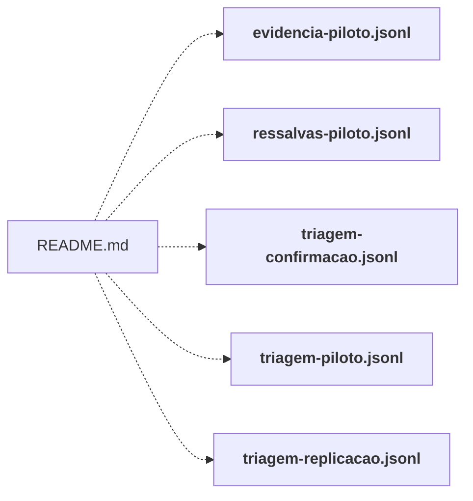

# data/corpus/

Corpus congelado dos experimentos (triagem, evidência, ressalvas), em JSONL. É o insumo dos executores `executor/run_e*.py`.

← [MAPA.md](../../MAPA.md) · pasta acima: [data](../../mapa/pastas/data.md) · abrir a pasta: [data/corpus/](../../data/corpus)

## Arquivos

| arquivo | tipo | tamanho | descrição |
|---|---|---:|---|
| [evidencia-piloto.jsonl](../../data/corpus/evidencia-piloto.jsonl) | dado | 24 l. | 24 registros JSONL (campos: case_id, family, kind, state, claim, gold, rationale) |
| [ressalvas-piloto.jsonl](../../data/corpus/ressalvas-piloto.jsonl) | dado | 8 l. | 8 registros JSONL (campos: query_id, query, candidates) |
| [triagem-confirmacao.jsonl](../../data/corpus/triagem-confirmacao.jsonl) | dado | 40 l. | 40 registros JSONL (campos: case_id, family, kind, text, gold, rationale) |
| [triagem-desempate.jsonl](../../data/corpus/triagem-desempate.jsonl) | dado | 60 l. | 60 registros JSONL (campos: case_id, family, gold, text, rationale, revisado_antes_de_executar) |
| [triagem-piloto.jsonl](../../data/corpus/triagem-piloto.jsonl) | dado | 40 l. | 40 registros JSONL (campos: case_id, family, kind, text, gold, rationale) |
| [triagem-replicacao.jsonl](../../data/corpus/triagem-replicacao.jsonl) | dado | 90 l. | 90 registros JSONL (campos: case_id, family, gold, text, rationale, revisado_antes_de_executar) |

## Grafo de imports e links

Nós em negrito são desta pasta; setas cheias são imports, tracejadas são links de documento.

## Ligações e conteúdo de cada arquivo

### evidencia-piloto.jsonl

- **é usado por** — link: [`README.md`](../../README.md); citação: [`executor/run_e3_evidencia.py`](../../executor/run_e3_evidencia.py), [`executor/tests/test_e12_replicacao.py`](../../executor/tests/test_e12_replicacao.py)

### ressalvas-piloto.jsonl

- **é usado por** — link: [`README.md`](../../README.md); citação: [`executor/run_e4_ressalvas.py`](../../executor/run_e4_ressalvas.py), [`executor/tests/test_e12_replicacao.py`](../../executor/tests/test_e12_replicacao.py)

### triagem-confirmacao.jsonl

- **é usado por** — link: [`README.md`](../../README.md); citação: [`executor/gabarito.py`](../../executor/gabarito.py), [`executor/run_e10_llm_economico.py`](../../executor/run_e10_llm_economico.py), [`executor/run_e7_confirmacao.py`](../../executor/run_e7_confirmacao.py), [`executor/run_e8_anotador.py`](../../executor/run_e8_anotador.py), [`executor/tests/test_e12_replicacao.py`](../../executor/tests/test_e12_replicacao.py), [`laboratorio/r18-escala.json`](../../laboratorio/r18-escala.json), [`planning/preregistro-E10-llm-economico.md`](../../planning/preregistro-E10-llm-economico.md), [`planning/preregistro-E7-confirmacao.md`](../../planning/preregistro-E7-confirmacao.md)

### triagem-desempate.jsonl

- **é usado por** — citação: [`executor/adjudicar_e11.py`](../../executor/adjudicar_e11.py), [`executor/gabarito.py`](../../executor/gabarito.py), [`executor/run_e11_desempate.py`](../../executor/run_e11_desempate.py), [`executor/run_e8_anotador.py`](../../executor/run_e8_anotador.py), [`executor/tests/test_e12_replicacao.py`](../../executor/tests/test_e12_replicacao.py), [`planning/preregistro-E11-desempate.md`](../../planning/preregistro-E11-desempate.md), [`runs/e11-desempate/adjudicacao.json`](../../runs/e11-desempate/adjudicacao.json)

### triagem-piloto.jsonl

- **é usado por** — link: [`README.md`](../../README.md); citação: [`executor/gabarito.py`](../../executor/gabarito.py), [`executor/run_e10b_piloto.py`](../../executor/run_e10b_piloto.py), [`executor/run_e1_triagem.py`](../../executor/run_e1_triagem.py), [`executor/run_e8_anotador.py`](../../executor/run_e8_anotador.py), [`executor/tests/test_e12_replicacao.py`](../../executor/tests/test_e12_replicacao.py)

### triagem-replicacao.jsonl

- **é usado por** — link: [`README.md`](../../README.md); citação: [`executor/adjudicar_e12.py`](../../executor/adjudicar_e12.py), [`executor/gabarito.py`](../../executor/gabarito.py), [`executor/run_e12_replicacao.py`](../../executor/run_e12_replicacao.py), [`executor/run_e15.py`](../../executor/run_e15.py), [`executor/run_e8_anotador.py`](../../executor/run_e8_anotador.py), [`executor/tests/test_e12_replicacao.py`](../../executor/tests/test_e12_replicacao.py), [`laboratorio/r11_extremos.py`](../../laboratorio/r11_extremos.py), [`laboratorio/r1_r3_estresse.py`](../../laboratorio/r1_r3_estresse.py), [`laboratorio/r4_r7_limites.py`](../../laboratorio/r4_r7_limites.py), [`planning/preregistro-E12-replicacao.md`](../../planning/preregistro-E12-replicacao.md), [`runs/e12-replicacao/adjudicacao.json`](../../runs/e12-replicacao/adjudicacao.json), [`runs/e12-replicacao/relatorio.json`](../../runs/e12-replicacao/relatorio.json)
