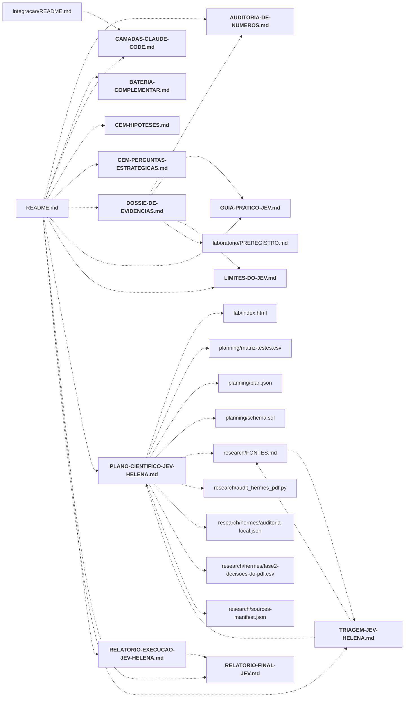

# docs/

Documentos finais em Markdown: plano científico, relatórios, guia prático, limites, auditoria de números, hipóteses e medições das camadas.

← [MAPA.md](../../MAPA.md) · pasta acima: [raiz](../../mapa/pastas/_raiz.md) · abrir a pasta: [docs/](../../docs)

## Arquivos

| arquivo | tipo | tamanho | descrição |
|---|---|---:|---|
| [AUDITORIA-DE-NUMEROS.md](../../docs/AUDITORIA-DE-NUMEROS.md) | doc | 1341 l. | Auditoria dos números publicados — Gerado por `python laboratorio/auditoria.py --escrever`, e preso na suíte de testes |
| [BATERIA-COMPLEMENTAR.md](../../docs/BATERIA-COMPLEMENTAR.md) | doc | 197 l. | Bateria complementar: as lacunas que o estudo declarou, medidas — **Cinco rodadas, 16.110 chamadas novas, US$ 0,4010.** O que cada uma fecha: |
| [CAMADAS-CLAUDE-CODE.md](../../docs/CAMADAS-CLAUDE-CODE.md) | doc | 134 l. | O Jev em camadas no Claude Code — medição — *Página gerada por `integracao/camadas/medir.py --gravar`; não edite à mão. Os números saem |
| [CEM-HIPOTESES.md](../../docs/CEM-HIPOTESES.md) | doc | 386 l. | Cem hipóteses sobre o Jev, e o que o dado respondeu — **81 sustentadas, 18 falsificadas, 1 inconclusiva.** |
| [CEM-PERGUNTAS-ESTRATEGICAS.md](../../docs/CEM-PERGUNTAS-ESTRATEGICAS.md) | doc | 734 l. | Cem perguntas estratégicas sobre o Jev, e o que o dado responde — **76 respondidas por dado medido, 19 por conta sobre o medido, 5 por coleta nova.** Confiança… |
| [DOSSIE-DE-EVIDENCIAS.md](../../docs/DOSSIE-DE-EVIDENCIAS.md) | doc | 168 l. | Dossiê de evidências — o que o estudo do Jev sustenta, e com que força — Os outros documentos respondem outras perguntas: o guia prático diz **o que |
| [GUIA-PRATICO-JEV.md](../../docs/GUIA-PRATICO-JEV.md) | doc | 498 l. | Como aplicar o Jev — guia de uso — *Documento de aplicação. Todos os números vêm dos experimentos E1 a E16 e do livro-caixa; nenhum |
| [LIMITES-DO-JEV.md](../../docs/LIMITES-DO-JEV.md) | doc | 250 l. | Os limites do Jev — mapa empírico — Os experimentos E1 a E13 mediram **quanto o Jev acerta**. Este mediu **onde ele para de |
| [PLANO-CIENTIFICO-JEV-HELENA.md](../../docs/PLANO-CIENTIFICO-JEV-HELENA.md) | doc | 575 l. | Plano científico de avaliação do ecossistema Jev — **Helena · versão 1.0 · 18 de setembro de 2026** |
| [RELATORIO-EXECUCAO-JEV-HELENA.md](../../docs/RELATORIO-EXECUCAO-JEV-HELENA.md) | doc | 389 l. | Relatório de execução — programa de avaliação Jev — **Helena Strategos · 18 e 19 de setembro de 2026 · primeira rodada com inferência real** |
| [RELATORIO-FINAL-JEV.md](../../docs/RELATORIO-FINAL-JEV.md) | doc | 1177 l. | Jev 1.13 — relatório final de avaliação — **Autoria:** Dra. Helena Strategos, Cientista-Chefe de Inteligência da INTEIA |
| [TRIAGEM-JEV-HELENA.md](../../docs/TRIAGEM-JEV-HELENA.md) | doc | 386 l. | JEV — triagem de projetos e agenda de experimentos — **Helena Strategos Inteia · perspectiva de cientista-chefe · 18/09/2026** |

## Grafo de imports e links

Nós em negrito são desta pasta; setas cheias são imports, tracejadas são links de documento.

## Ligações e conteúdo de cada arquivo

### AUDITORIA-DE-NUMEROS.md

- **usa** — citação: [`docs/BATERIA-COMPLEMENTAR.md`](../../docs/BATERIA-COMPLEMENTAR.md), [`docs/CEM-PERGUNTAS-ESTRATEGICAS.md`](../../docs/CEM-PERGUNTAS-ESTRATEGICAS.md), [`docs/DOSSIE-DE-EVIDENCIAS.md`](../../docs/DOSSIE-DE-EVIDENCIAS.md), [`docs/GUIA-PRATICO-JEV.md`](../../docs/GUIA-PRATICO-JEV.md), [`docs/LIMITES-DO-JEV.md`](../../docs/LIMITES-DO-JEV.md), [`laboratorio/PREREGISTRO.md`](../../laboratorio/PREREGISTRO.md), [`laboratorio/auditoria.py`](../../laboratorio/auditoria.py), [`laboratorio/tests/test_auditoria.py`](../../laboratorio/tests/test_auditoria.py)
- **é usado por** — link: [`README.md`](../../README.md), [`docs/DOSSIE-DE-EVIDENCIAS.md`](../../docs/DOSSIE-DE-EVIDENCIAS.md); citação: [`integracao/camadas/rotina.py`](../../integracao/camadas/rotina.py), [`laboratorio/auditoria.py`](../../laboratorio/auditoria.py), [`laboratorio/gerar_dossie.py`](../../laboratorio/gerar_dossie.py)
- **conteúdo** — R1-R3 — 27 conferências, todas fecham (l. 18), R8 — 18 conferências, todas fecham (l. 52), R9 — 10 conferências, todas fecham (l. 77), R10 — 20 conferências, todas fecham (l. 94), R11 — 80 conferências, todas fecham (l. 121), R15 — 20 conferências, todas fecham (l. 208), R15b — 45 conferências, todas fecham (l. 235), R16 — 20 conferências, todas fecham (l. 287), R17 — 37 conferências, todas fecham (l. 314), R18 — 71 conferências, todas fecham (l. 358), R19 — 59 conferências, todas fecham (l. 436), R20 — 52 conferências, todas fecham (l. 502), consolidado — 61 conferências, todas fecham (l. 561), R21 — 67 conferências, todas fecham (l. 629), R21b — 6 conferências, todas fecham (l. 701), R22 — 105 conferências, todas fecham (l. 712), R23 — 145 conferências, todas fecham (l. 824), R24 — 52 conferências, todas fecham (l. 976), R25 — 42 conferências, todas fecham (l. 1035), R26 — 39 conferências, todas fecham (l. 1084), R27 — 61 conferências, todas fecham (l. 1130), cem hipoteses — 8 conferências, todas fecham (l. 1198), cem perguntas — 5 conferências, todas fecham (l. 1211), documentação — 72 conferências, todas fecham (l. 1223), páginas geradas — 4 conferências, todas fecham (l. 1310), caixa — 4 conferências, todas fecham (l. 1319), Fora do alcance desta auditoria (l. 1330)

### BATERIA-COMPLEMENTAR.md

- **usa** — citação: [`laboratorio/gerar_bateria.py`](../../laboratorio/gerar_bateria.py), [`laboratorio/r23_parafrase.py`](../../laboratorio/r23_parafrase.py), [`laboratorio/r24_votacao.py`](../../laboratorio/r24_votacao.py), [`laboratorio/r25_terceiro_dominio.py`](../../laboratorio/r25_terceiro_dominio.py), [`laboratorio/r26_dois_trechos.py`](../../laboratorio/r26_dois_trechos.py), [`laboratorio/r27_integracao.py`](../../laboratorio/r27_integracao.py)
- **é usado por** — link: [`README.md`](../../README.md); citação: [`docs/AUDITORIA-DE-NUMEROS.md`](../../docs/AUDITORIA-DE-NUMEROS.md), [`docs/GUIA-PRATICO-JEV.md`](../../docs/GUIA-PRATICO-JEV.md), [`integracao/camadas/rotina.py`](../../integracao/camadas/rotina.py), [`laboratorio/PREREGISTRO.md`](../../laboratorio/PREREGISTRO.md), [`laboratorio/auditoria.py`](../../laboratorio/auditoria.py), [`laboratorio/gerar_bateria.py`](../../laboratorio/gerar_bateria.py), [`laboratorio/gerar_mapa_visual.py`](../../laboratorio/gerar_mapa_visual.py), [`output/mapa-de-limites.html`](../../output/mapa-de-limites.html)
- **conteúdo** — O que muda no guia (l. 18), R23 — o sanitizador contra a ordem escrita de outro jeito (l. 22), R24 — votar em três chamadas, de ponta a ponta (l. 112), R25 — o terceiro domínio: uma clínica de saúde (l. 132), R26 — a resposta que exige dois trechos (l. 147), R27 — sanitizador e sentinela no mesmo payload (l. 164), Como refazer (l. 187)

### CAMADAS-CLAUDE-CODE.md

- **usa** — citação: [`integracao/camadas/medir.py`](../../integracao/camadas/medir.py)
- **é usado por** — link: [`README.md`](../../README.md), [`integracao/README.md`](../../integracao/README.md); citação: [`AGENTS.md`](../../AGENTS.md), [`integracao/camadas/medir.py`](../../integracao/camadas/medir.py), [`integracao/camadas/nucleo.py`](../../integracao/camadas/nucleo.py), [`integracao/camadas/rotina.py`](../../integracao/camadas/rotina.py), [`integracao/instalar.py`](../../integracao/instalar.py)
- **conteúdo** — As camadas, e o que cada uma faz com o contexto do modelo caro (l. 11), O total (l. 24), Leitura (`Read`) (l. 33), Busca (`Grep`, `Glob` e listagens externas) (l. 52), Sentinela (conteúdo externo) (l. 67), Saída de comando (`Bash`, `PowerShell`) (l. 83), Verificação pela skill (`/jev-verificar`) (l. 97), Leitura seletiva pela skill (`/jev-ler`) (l. 108), Tema e guarda (as camadas anteriores) (l. 118), O que esta página não prova (l. 127)

### CEM-HIPOTESES.md

- **usa** — citação: [`laboratorio/auditoria.py`](../../laboratorio/auditoria.py), [`laboratorio/h100/avaliar.py`](../../laboratorio/h100/avaliar.py), [`laboratorio/h100/provas.py`](../../laboratorio/h100/provas.py), [`laboratorio/h100/registro.py`](../../laboratorio/h100/registro.py), [`laboratorio/h100/relatorio.py`](../../laboratorio/h100/relatorio.py)
- **é usado por** — link: [`README.md`](../../README.md); citação: [`docs/GUIA-PRATICO-JEV.md`](../../docs/GUIA-PRATICO-JEV.md), [`docs/LIMITES-DO-JEV.md`](../../docs/LIMITES-DO-JEV.md), [`integracao/camadas/rotina.py`](../../integracao/camadas/rotina.py), [`laboratorio/PREREGISTRO.md`](../../laboratorio/PREREGISTRO.md), [`laboratorio/auditoria.py`](../../laboratorio/auditoria.py), [`laboratorio/h100/relatorio.py`](../../laboratorio/h100/relatorio.py)
- **conteúdo** — O que este documento é, e o que ele não é (l. 10), As falsificações que mudam alguma coisa (l. 26), As cem, por família (l. 105), Como refazer (l. 379)

### CEM-PERGUNTAS-ESTRATEGICAS.md

- **usa** — citação: [`laboratorio/auditoria.py`](../../laboratorio/auditoria.py), [`laboratorio/q100/registro.py`](../../laboratorio/q100/registro.py), [`laboratorio/q100/relatorio.py`](../../laboratorio/q100/relatorio.py), [`laboratorio/q100/respostas.py`](../../laboratorio/q100/respostas.py), [`laboratorio/r19_armadilha_de_sujeito.py`](../../laboratorio/r19_armadilha_de_sujeito.py), [`laboratorio/r21_generalizacao.py`](../../laboratorio/r21_generalizacao.py)
- **é usado por** — link: [`README.md`](../../README.md); citação: [`docs/AUDITORIA-DE-NUMEROS.md`](../../docs/AUDITORIA-DE-NUMEROS.md), [`docs/GUIA-PRATICO-JEV.md`](../../docs/GUIA-PRATICO-JEV.md), [`integracao/camadas/rotina.py`](../../integracao/camadas/rotina.py), [`laboratorio/PREREGISTRO.md`](../../laboratorio/PREREGISTRO.md), [`laboratorio/auditoria.py`](../../laboratorio/auditoria.py), [`laboratorio/q100/relatorio.py`](../../laboratorio/q100/relatorio.py)
- **conteúdo** — O que separa esta página das cem hipóteses (l. 11), Os parâmetros que não foram medidos (l. 28), As respostas que mudam uma decisão já tomada (l. 42), As cem, por família (l. 86), Como refazer (l. 728)

### DOSSIE-DE-EVIDENCIAS.md

- **usa** — link: [`docs/AUDITORIA-DE-NUMEROS.md`](../../docs/AUDITORIA-DE-NUMEROS.md), [`docs/GUIA-PRATICO-JEV.md`](../../docs/GUIA-PRATICO-JEV.md), [`docs/LIMITES-DO-JEV.md`](../../docs/LIMITES-DO-JEV.md), [`laboratorio/PREREGISTRO.md`](../../laboratorio/PREREGISTRO.md); citação: [`laboratorio/auditoria.py`](../../laboratorio/auditoria.py), [`laboratorio/canarios-de-comportamento.jsonl`](../../laboratorio/canarios-de-comportamento.jsonl), [`laboratorio/canarios_de_comportamento.py`](../../laboratorio/canarios_de_comportamento.py), [`laboratorio/gerar_dossie.py`](../../laboratorio/gerar_dossie.py), [`laboratorio/r10-injecao-comparada.json`](../../laboratorio/r10-injecao-comparada.json), [`laboratorio/r11-extremos.json`](../../laboratorio/r11-extremos.json), [`laboratorio/r15-adversario-externo.json`](../../laboratorio/r15-adversario-externo.json), [`laboratorio/r15b-familias.json`](../../laboratorio/r15b-familias.json), [`laboratorio/r17-economia-de-contexto.json`](../../laboratorio/r17-economia-de-contexto.json), [`laboratorio/r18-escala.json`](../../laboratorio/r18-escala.json), [`laboratorio/r18-r20-consolidado.json`](../../laboratorio/r18-r20-consolidado.json), [`laboratorio/r19-armadilha.json`](../../laboratorio/r19-armadilha.json), [`laboratorio/r20-k-adaptativo.json`](../../laboratorio/r20-k-adaptativo.json), [`laboratorio/r21-generalizacao.json`](../../laboratorio/r21-generalizacao.json), [`laboratorio/r21b-cruzamento.json`](../../laboratorio/r21b-cruzamento.json)
- **é usado por** — link: [`README.md`](../../README.md); citação: [`docs/AUDITORIA-DE-NUMEROS.md`](../../docs/AUDITORIA-DE-NUMEROS.md), [`integracao/camadas/rotina.py`](../../integracao/camadas/rotina.py), [`laboratorio/auditoria.py`](../../laboratorio/auditoria.py), [`laboratorio/canarios_de_comportamento.py`](../../laboratorio/canarios_de_comportamento.py), [`laboratorio/gerar_dossie.py`](../../laboratorio/gerar_dossie.py)
- **conteúdo** — Como ler (l. 13), As afirmações (l. 30), Fichas das rodadas do programa E17 (l. 142), Contabilidade (l. 153), Como conferir (l. 157)

### GUIA-PRATICO-JEV.md

- **usa** — citação: [`docs/BATERIA-COMPLEMENTAR.md`](../../docs/BATERIA-COMPLEMENTAR.md), [`docs/CEM-HIPOTESES.md`](../../docs/CEM-HIPOTESES.md), [`docs/CEM-PERGUNTAS-ESTRATEGICAS.md`](../../docs/CEM-PERGUNTAS-ESTRATEGICAS.md), [`docs/LIMITES-DO-JEV.md`](../../docs/LIMITES-DO-JEV.md), [`docs/RELATORIO-FINAL-JEV.md`](../../docs/RELATORIO-FINAL-JEV.md), [`integracao/hooks/jev_guarda_comando.py`](../../integracao/hooks/jev_guarda_comando.py), [`laboratorio/auditoria.py`](../../laboratorio/auditoria.py), [`laboratorio/r22_defesas.py`](../../laboratorio/r22_defesas.py)
- **é usado por** — link: [`README.md`](../../README.md), [`docs/DOSSIE-DE-EVIDENCIAS.md`](../../docs/DOSSIE-DE-EVIDENCIAS.md); citação: [`docs/AUDITORIA-DE-NUMEROS.md`](../../docs/AUDITORIA-DE-NUMEROS.md), [`docs/LIMITES-DO-JEV.md`](../../docs/LIMITES-DO-JEV.md), [`executor/tests/test_calibracao_e12.py`](../../executor/tests/test_calibracao_e12.py), [`integracao/camadas/rotina.py`](../../integracao/camadas/rotina.py), [`laboratorio/PREREGISTRO.md`](../../laboratorio/PREREGISTRO.md), [`laboratorio/auditoria.py`](../../laboratorio/auditoria.py), [`laboratorio/conciliar_caixa.py`](../../laboratorio/conciliar_caixa.py), [`laboratorio/gerar_dossie.py`](../../laboratorio/gerar_dossie.py), [`planning/build_guia_pdf.py`](../../planning/build_guia_pdf.py)
- **conteúdo** — 1. Para que serve, em uma frase (l. 9), 2. As três aplicações testadas, com o ganho medido (l. 20), 3. Onde ele brilha: o tipo de texto que derruba os outros métodos (l. 138), 3b. A vantagem que não depende de quem escreve o gabarito (l. 166), 4. Como aplicar, passo a passo (l. 277), 5. O cuidado mais importante: a confiança é útil, mas não é garantia (l. 318), 6. Quanto custa e quanto economiza (l. 344), 7. Os cuidados, em ordem de risco (l. 361), 8. Os 15 sistemas do ecossistema: por onde começar (l. 402), 9. Placar final: todos os testes, o resultado e a consequência (l. 419), 10. O que decidir hoje (l. 481)

### LIMITES-DO-JEV.md

- **usa** — citação: [`docs/CEM-HIPOTESES.md`](../../docs/CEM-HIPOTESES.md), [`docs/GUIA-PRATICO-JEV.md`](../../docs/GUIA-PRATICO-JEV.md), [`laboratorio/PREREGISTRO.md`](../../laboratorio/PREREGISTRO.md), [`laboratorio/mapa-de-limites.json`](../../laboratorio/mapa-de-limites.json), [`laboratorio/r12-r13-contexto.json`](../../laboratorio/r12-r13-contexto.json), [`laboratorio/r14-decisoes.json`](../../laboratorio/r14-decisoes.json), [`laboratorio/r15-adversario-externo.json`](../../laboratorio/r15-adversario-externo.json), [`laboratorio/r15-vetores-gerados.json`](../../laboratorio/r15-vetores-gerados.json), [`laboratorio/r15b-familias.json`](../../laboratorio/r15b-familias.json), [`laboratorio/r21-generalizacao.json`](../../laboratorio/r21-generalizacao.json), [`laboratorio/r21b-cruzamento.json`](../../laboratorio/r21b-cruzamento.json), [`output/mapa-de-limites.html`](../../output/mapa-de-limites.html)
- **é usado por** — link: [`README.md`](../../README.md), [`docs/DOSSIE-DE-EVIDENCIAS.md`](../../docs/DOSSIE-DE-EVIDENCIAS.md); citação: [`docs/AUDITORIA-DE-NUMEROS.md`](../../docs/AUDITORIA-DE-NUMEROS.md), [`docs/GUIA-PRATICO-JEV.md`](../../docs/GUIA-PRATICO-JEV.md), [`laboratorio/PREREGISTRO.md`](../../laboratorio/PREREGISTRO.md), [`laboratorio/auditoria.py`](../../laboratorio/auditoria.py), [`laboratorio/gerar_dossie.py`](../../laboratorio/gerar_dossie.py)
- **conteúdo** — 1. O achado que fecha a questão aberta desde o E10 (l. 15), 2. O modo de falha mais perigoso, e a mitigação de uma linha (l. 118), 3. Onde ele quebra de verdade (l. 137), 4. Onde ele não quebra (e o que isso contradiz no guia) (l. 159), 5. O falso achado que eu produzi, e por que ele fica no registro (l. 181), 6. Ciclo autorrecursivo: o Jev decidindo sobre os dados do Jev (l. 199), 7. Calibração (l. 220), 8. Consequências para quem aplica (l. 228)

### PLANO-CIENTIFICO-JEV-HELENA.md

- **usa** — link: [`lab/index.html`](../../lab/index.html), [`planning/matriz-testes.csv`](../../planning/matriz-testes.csv), [`planning/plan.json`](../../planning/plan.json), [`planning/schema.sql`](../../planning/schema.sql), [`research/FONTES.md`](../../research/FONTES.md), [`research/audit_hermes_pdf.py`](../../research/audit_hermes_pdf.py), [`research/hermes/auditoria-local.json`](../../research/hermes/auditoria-local.json), [`research/hermes/fase2-decisoes-do-pdf.csv`](../../research/hermes/fase2-decisoes-do-pdf.csv), [`research/sources-manifest.json`](../../research/sources-manifest.json); citação: [`research/hermes/manifest.json`](../../research/hermes/manifest.json)
- **é usado por** — link: [`README.md`](../../README.md), [`docs/TRIAGEM-JEV-HELENA.md`](../../docs/TRIAGEM-JEV-HELENA.md); citação: [`lab/dashboard.js`](../../lab/dashboard.js), [`lab/index.html`](../../lab/index.html), [`lab/server.py`](../../lab/server.py), [`lab/template.html`](../../lab/template.html), [`planning/build_deliverables.py`](../../planning/build_deliverables.py), [`planning/build_plan.py`](../../planning/build_plan.py)
- **conteúdo** — 1. O que os testes anteriores realmente estabelecem (l. 13), 2. Objetivo, perguntas e critérios de utilidade (l. 46), 3. Cobertura: todos entram, cada um com um teste honesto (l. 64), 4. Desenho dos dados e gabaritos (l. 92), 5. Experimentos: separar as causas (l. 118), 6. Análise quantitativa e limites de inferência (l. 150), 7. Quanto gastar e como impedir estouro (l. 168), 8. OpenRouter ou TypeSafe direto: escolha e procedimento (l. 207), 9. Registro dos dados e interface do laboratório (l. 233), 10. Fluxo de execução e entregáveis por etapa (l. 263), 11. Regra final de adoção e aproveitamento de tokens (l. 281), 12. Fontes e arquivos de trabalho (l. 293), 13. Fichas executáveis dos 15 sistemas (l. 303)

### RELATORIO-EXECUCAO-JEV-HELENA.md

- **usa** — link: [`docs/RELATORIO-FINAL-JEV.md`](../../docs/RELATORIO-FINAL-JEV.md); citação: [`executor/tests/test_achados_revisao.py`](../../executor/tests/test_achados_revisao.py), [`executor/tests/test_achados_revisao2.py`](../../executor/tests/test_achados_revisao2.py), [`planning/preregistro-E1-triagem.md`](../../planning/preregistro-E1-triagem.md)
- **é usado por** — link: [`README.md`](../../README.md)
- **conteúdo** — 1. Recomendação (l. 22), 2. Achado principal (l. 36), 3. Evidência (l. 54), 4. Mecanismo (l. 173), 5. Revisão independente e o que ela derrubou (l. 186), 6. Contra-hipóteses (l. 268), 7. Calibração de confiança (l. 311), 8. Cenários (l. 326), 9. Próximo movimento (l. 341), 10. O que este relatório não estabelece (l. 365)

### RELATORIO-FINAL-JEV.md

- **usa** — citação: [`.gitignore`](../../.gitignore), [`executor/gabarito.py`](../../executor/gabarito.py), [`executor/placar.py`](../../executor/placar.py), [`executor/tests/test_coerencia_placar.py`](../../executor/tests/test_coerencia_placar.py), [`output/pdf/PLANO-CIENTIFICO-JEV-HELENA.pdf`](../../output/pdf/PLANO-CIENTIFICO-JEV-HELENA.pdf), [`output/pdf/RELATORIO-FINAL-JEV.pdf`](../../output/pdf/RELATORIO-FINAL-JEV.pdf), [`runs/e12-replicacao/respostas.jsonl`](../../runs/e12-replicacao/respostas.jsonl), [`runs/e3-evidencia/relatorio.json`](../../runs/e3-evidencia/relatorio.json), [`runs/e8-anotador/relatorio.json`](../../runs/e8-anotador/relatorio.json), [`runs/extrato-ledger.json`](../../runs/extrato-ledger.json)
- **é usado por** — link: [`README.md`](../../README.md), [`docs/RELATORIO-EXECUCAO-JEV-HELENA.md`](../../docs/RELATORIO-EXECUCAO-JEV-HELENA.md); citação: [`docs/GUIA-PRATICO-JEV.md`](../../docs/GUIA-PRATICO-JEV.md), [`executor/placar.py`](../../executor/placar.py), [`executor/tests/test_achados_revisao16.py`](../../executor/tests/test_achados_revisao16.py), [`executor/tests/test_calibracao_e12.py`](../../executor/tests/test_calibracao_e12.py), [`executor/tests/test_coerencia_placar.py`](../../executor/tests/test_coerencia_placar.py), [`lab/data/execution.json`](../../lab/data/execution.json), [`lab/index.html`](../../lab/index.html), [`planning/build_guia_pdf.py`](../../planning/build_guia_pdf.py), [`planning/build_relatorio_pdf.py`](../../planning/build_relatorio_pdf.py)
- **conteúdo** — 1. Recomendação (l. 12), 2. Achado principal (l. 164), 3. Evidência (l. 185), 4. Mecanismo: por que funciona (l. 656), 5. Contra-hipóteses testadas (l. 673), 6. Calibração (l. 709), 7. Custo e operação (l. 758), 8. Limites — o que este estudo não autoriza afirmar (l. 792), 9. Controle financeiro e integridade do processo (l. 843), 9.2 O E13: aplicar o Jev aos fluxos de trabalho desta casa (l. 1078), 10. Próximo movimento (l. 1142)

### TRIAGEM-JEV-HELENA.md

- **usa** — link: [`docs/PLANO-CIENTIFICO-JEV-HELENA.md`](../../docs/PLANO-CIENTIFICO-JEV-HELENA.md), [`research/FONTES.md`](../../research/FONTES.md); citação: [`AGENTS.md`](../../AGENTS.md), [`research/collect_sources.py`](../../research/collect_sources.py), [`research/sources-manifest.json`](../../research/sources-manifest.json)
- **é usado por** — link: [`README.md`](../../README.md), [`research/FONTES.md`](../../research/FONTES.md)
- **conteúdo** — 1. Decisão recomendada (l. 8), 2. Achado que altera a ordem: OpenRouter é uma condição técnica (l. 29), 3. Critério da triagem (l. 52), 4. Fichas dos sistemas (l. 63), 5. Achados de código que precisam entrar no desenho dos testes (l. 245), 6. Referências que não precisam virar novas frentes (l. 258), 7. Onde há redundância real (l. 269), 8. Perguntas científicas que decidem adoção (l. 281), 9. Orçamento de até US$ 5 (l. 321), 10. Estrutura para começar (l. 341), 11. Contra-hipóteses e decisão final de Helena (l. 371)
