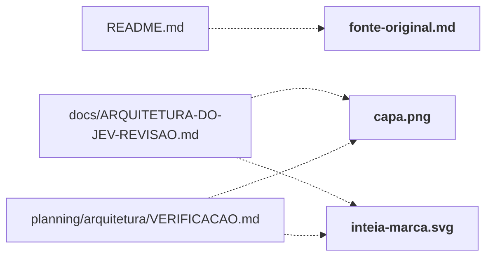

# docs/arquitetura-assets/

Capa ilustrada, diagramas vetoriais e Markdown original da arquitetura. Os SVGs são gerados a partir da edição revisada.

← [MAPA.md](../../MAPA.md) · pasta acima: [docs](../../mapa/pastas/docs.md) · abrir a pasta: [docs/arquitetura-assets/](../../docs/arquitetura-assets)

## Arquivos

| arquivo | tipo | tamanho | descrição |
|---|---|---:|---|
| [capa.png](../../docs/arquitetura-assets/capa.png) | outro | 2 MB | Arquivo |
| [diagrama-01.svg](../../docs/arquitetura-assets/diagrama-01.svg) | outro | 6 KB | Arquivo |
| [diagrama-02.svg](../../docs/arquitetura-assets/diagrama-02.svg) | outro | 5 KB | Arquivo |
| [diagrama-03.svg](../../docs/arquitetura-assets/diagrama-03.svg) | outro | 6 KB | Arquivo |
| [diagrama-04.svg](../../docs/arquitetura-assets/diagrama-04.svg) | outro | 5 KB | Arquivo |
| [diagrama-05.svg](../../docs/arquitetura-assets/diagrama-05.svg) | outro | 6 KB | Arquivo |
| [diagrama-06.svg](../../docs/arquitetura-assets/diagrama-06.svg) | outro | 6 KB | Arquivo |
| [diagrama-07.svg](../../docs/arquitetura-assets/diagrama-07.svg) | outro | 8 KB | Arquivo |
| [diagrama-08.svg](../../docs/arquitetura-assets/diagrama-08.svg) | outro | 7 KB | Arquivo |
| [diagrama-09.svg](../../docs/arquitetura-assets/diagrama-09.svg) | outro | 6 KB | Arquivo |
| [diagrama-10.svg](../../docs/arquitetura-assets/diagrama-10.svg) | outro | 5 KB | Arquivo |
| [fonte-original.md](../../docs/arquitetura-assets/fonte-original.md) | doc | 2110 l. | Arquitetura do JEV: fonte editável — Fonte completa do PDF “Arquitetura do JEV” (14 páginas, A4 paisagem): textos de cada página, sistema visual, código SVG do… |
| [inteia-marca.svg](../../docs/arquitetura-assets/inteia-marca.svg) | outro | 1 KB | Arquivo |

## Grafo de imports e links

Nós em negrito são desta pasta; setas cheias são imports, tracejadas são links de documento.

## Ligações e conteúdo de cada arquivo

### capa.png

- **é usado por** — link: [`docs/ARQUITETURA-DO-JEV-REVISAO.md`](../../docs/ARQUITETURA-DO-JEV-REVISAO.md), [`planning/arquitetura/VERIFICACAO.md`](../../planning/arquitetura/VERIFICACAO.md); citação: [`planning/arquitetura/arquivos-mapa.txt`](../../planning/arquitetura/arquivos-mapa.txt)

### diagrama-01.svg

- **é usado por** — citação: [`planning/arquitetura/arquivos-mapa.txt`](../../planning/arquitetura/arquivos-mapa.txt)

### diagrama-02.svg

- **é usado por** — citação: [`planning/arquitetura/arquivos-mapa.txt`](../../planning/arquitetura/arquivos-mapa.txt)

### diagrama-03.svg

- **é usado por** — citação: [`planning/arquitetura/arquivos-mapa.txt`](../../planning/arquitetura/arquivos-mapa.txt)

### diagrama-04.svg

- **é usado por** — citação: [`planning/arquitetura/arquivos-mapa.txt`](../../planning/arquitetura/arquivos-mapa.txt)

### diagrama-05.svg

- **é usado por** — citação: [`planning/arquitetura/arquivos-mapa.txt`](../../planning/arquitetura/arquivos-mapa.txt)

### diagrama-06.svg

- **é usado por** — citação: [`planning/arquitetura/arquivos-mapa.txt`](../../planning/arquitetura/arquivos-mapa.txt)

### diagrama-07.svg

- **é usado por** — citação: [`planning/arquitetura/arquivos-mapa.txt`](../../planning/arquitetura/arquivos-mapa.txt)

### diagrama-08.svg

- **é usado por** — citação: [`planning/arquitetura/arquivos-mapa.txt`](../../planning/arquitetura/arquivos-mapa.txt)

### diagrama-09.svg

- **é usado por** — citação: [`planning/arquitetura/arquivos-mapa.txt`](../../planning/arquitetura/arquivos-mapa.txt)

### diagrama-10.svg

- **é usado por** — citação: [`planning/arquitetura/arquivos-mapa.txt`](../../planning/arquitetura/arquivos-mapa.txt)

### fonte-original.md

- **é usado por** — link: [`README.md`](../../README.md); citação: [`planning/arquitetura/VERIFICACAO.md`](../../planning/arquitetura/VERIFICACAO.md), [`planning/arquitetura/arquivos-mapa.txt`](../../planning/arquitetura/arquivos-mapa.txt)
- **parecidos (julgados pelo Jev)** — [`docs/ARQUITETURA-DO-JEV-REVISAO.md`](../../docs/ARQUITETURA-DO-JEV-REVISAO.md) (não julgado, 0.30), [`planning/arquitetura/README.md`](../../planning/arquitetura/README.md) (não julgado, 0.20)
- **conteúdo** — 0. Instruções para quem edita (l. 5), 1. Sistema visual (l. 40), 2. Conteúdo, página a página (l. 104), 3. Diagramas (l. 268), Apêndices: arquivos do montador (l. 1329)

### inteia-marca.svg

- **é usado por** — link: [`docs/ARQUITETURA-DO-JEV-REVISAO.md`](../../docs/ARQUITETURA-DO-JEV-REVISAO.md), [`planning/arquitetura/VERIFICACAO.md`](../../planning/arquitetura/VERIFICACAO.md); citação: [`planning/arquitetura/arquivos-mapa.txt`](../../planning/arquitetura/arquivos-mapa.txt)
