# executor/tests/

Testes do executor: livro-caixa, preços, runner, placar, achados de cada revisão adversarial, entregáveis, MCP.

← [MAPA.md](../../MAPA.md) · pasta acima: [executor](../../mapa/pastas/executor.md) · abrir a pasta: [executor/tests/](../../executor/tests)

## Arquivos

| arquivo | tipo | tamanho | descrição |
|---|---|---:|---|
| [__init__.py](../../executor/tests/__init__.py) | código | 0 B | Script Python |
| [test_achados_revisao.py](../../executor/tests/test_achados_revisao.py) | código | 135 l. | Regressão dos achados da revisão independente (Codex gpt-6-astra, 2026-09-19). |
| [test_achados_revisao16.py](../../executor/tests/test_achados_revisao16.py) | código | 116 l. | O que a décima sexta rodada de revisão adversarial encontrou, travado contra regressão. |
| [test_achados_revisao2.py](../../executor/tests/test_achados_revisao2.py) | código | 239 l. | Regressão dos achados da SEGUNDA rodada de revisão independente (2026-09-19). |
| [test_achados_revisao3.py](../../executor/tests/test_achados_revisao3.py) | código | 191 l. | Regressão dos achados da QUINTA rodada de revisão independente (2026-09-19). |
| [test_achados_revisao4.py](../../executor/tests/test_achados_revisao4.py) | código | 234 l. | Regressão dos achados da SEXTA e da SÉTIMA rodadas de revisão (Grok 4.6 via Cursor, 2026-09-19). |
| [test_calibracao_e12.py](../../executor/tests/test_calibracao_e12.py) | código | 84 l. | A calibração publicada tem de ser a do dado, inclusive quando o dado desmente a recomendação. |
| [test_coerencia_placar.py](../../executor/tests/test_coerencia_placar.py) | código | 630 l. | O placar não pode se contradizer. |
| [test_credenciais.py](../../executor/tests/test_credenciais.py) | código | 75 l. | As chaves do Jev são achadas na ordem certa, o provedor preferido é o declarado, e nenhum valor de chave vaza em erro, log ou diagnóstico. |
| [test_e12_replicacao.py](../../executor/tests/test_e12_replicacao.py) | código | 208 l. | O que o E12 promete no pré-registro tem de valer no código, e não só no texto. |
| [test_entregaveis.py](../../executor/tests/test_entregaveis.py) | código | 70 l. | Cada PDF entregue tem de conter o documento que o nome dele promete. |
| [test_ledger.py](../../executor/tests/test_ledger.py) | código | 318 l. | Testes offline do controle financeiro: concorrencia, reinicio, timeout, usage ausente e arredondamento. |
| [test_liquidacao_429.py](../../executor/tests/test_liquidacao_429.py) | código | 78 l. | HTTP 429 não custa nada, e o livro-caixa tem de saber disso. |
| [test_mcp.py](../../executor/tests/test_mcp.py) | código | 40 l. | Define: test_stdio_handshake_and_catalog, test_rank_keeps_all_candidates_and_ids, test_bad_arguments_cannot_call_provider |
| [test_mutacao.py](../../executor/tests/test_mutacao.py) | código | 79 l. | Auditoria de mutação: perturbar o dado bruto tem de mover o painel. |
| [test_precos.py](../../executor/tests/test_precos.py) | código | 50 l. | O preço declarado tem de ser o preço bruto do provedor, na unidade certa. |
| [test_runner.py](../../executor/tests/test_runner.py) | código | 192 l. | Testes do despacho com transporte simulado. Nenhuma chamada de rede e nenhum custo. |
| [test_shared.py](../../executor/tests/test_shared.py) | código | 96 l. | Define: wallet, query, response, test_full_input_is_sent, test_oversized_input_abstains_without_dispatch, test_timeout_keeps_res |

## Grafo de imports e links

Nós em negrito são desta pasta; setas cheias são imports, tracejadas são links de documento.

```mermaid
flowchart LR
  n_executor___init___py["executor/__init__.py"]
  n_executor_analise_py["executor/analise.py"]
  n_executor_assist_py["executor/assist.py"]
  n_executor_credenciais_py["executor/credenciais.py"]
  n_executor_gabarito_py["executor/gabarito.py"]
  n_executor_ledger_py["executor/ledger.py"]
  n_executor_placar_py["executor/placar.py"]
  n_executor_pricing_py["executor/pricing.py"]
  n_executor_publicar_experimentos_py["executor/publicar_experimentos.py"]
  n_executor_run_e12_replicacao_py["executor/run_e12_replicacao.py"]
  n_executor_run_e1_triagem_py["executor/run_e1_triagem.py"]
  n_executor_run_e8_anotador_py["executor/run_e8_anotador.py"]
  n_executor_run_e9_prevalencia_py["executor/run_e9_prevalencia.py"]
  n_executor_runner_py["executor/runner.py"]
  n_executor_shared_py["executor/shared.py"]
  n_executor_tests_test_achados_revisao_py["<b>test_achados_revisao.py</b>"]
  n_executor_tests_test_achados_revisao2_py["<b>test_achados_revisao2.py</b>"]
  n_executor_tests_test_achados_revisao3_py["<b>test_achados_revisao3.py</b>"]
  n_executor_tests_test_achados_revisao4_py["<b>test_achados_revisao4.py</b>"]
  n_executor_tests_test_coerencia_placar_py["<b>test_coerencia_placar.py</b>"]
  n_executor_tests_test_credenciais_py["<b>test_credenciais.py</b>"]
  n_executor_tests_test_e12_replicacao_py["<b>test_e12_replicacao.py</b>"]
  n_executor_tests_test_ledger_py["<b>test_ledger.py</b>"]
  n_executor_tests_test_liquidacao_429_py["<b>test_liquidacao_429.py</b>"]
  n_executor_tests_test_mcp_py["<b>test_mcp.py</b>"]
  n_executor_tests_test_mutacao_py["<b>test_mutacao.py</b>"]
  n_executor_tests_test_runner_py["<b>test_runner.py</b>"]
  n_executor_tests_test_shared_py["<b>test_shared.py</b>"]
  n_integracao_jev_mcp_py["integracao/jev_mcp.py"]
  n_executor_tests_test_achados_revisao_py --> n_executor___init___py
  n_executor_tests_test_achados_revisao_py --> n_executor_ledger_py
  n_executor_tests_test_achados_revisao_py --> n_executor_pricing_py
  n_executor_tests_test_achados_revisao_py --> n_executor_run_e1_triagem_py
  n_executor_tests_test_achados_revisao_py --> n_executor_runner_py
  n_executor_tests_test_achados_revisao2_py --> n_executor_analise_py
  n_executor_tests_test_achados_revisao2_py --> n_executor_ledger_py
  n_executor_tests_test_achados_revisao2_py --> n_executor_pricing_py
  n_executor_tests_test_achados_revisao3_py --> n_executor_ledger_py
  n_executor_tests_test_achados_revisao3_py --> n_executor_pricing_py
  n_executor_tests_test_achados_revisao4_py --> n_executor___init___py
  n_executor_tests_test_achados_revisao4_py --> n_executor_analise_py
  n_executor_tests_test_achados_revisao4_py --> n_executor_ledger_py
  n_executor_tests_test_achados_revisao4_py --> n_executor_placar_py
  n_executor_tests_test_achados_revisao4_py --> n_executor_pricing_py
  n_executor_tests_test_achados_revisao4_py --> n_executor_run_e8_anotador_py
  n_executor_tests_test_achados_revisao4_py --> n_executor_run_e9_prevalencia_py
  n_executor_tests_test_achados_revisao4_py --> n_executor_runner_py
  n_executor_tests_test_coerencia_placar_py --> n_executor___init___py
  n_executor_tests_test_coerencia_placar_py --> n_executor_gabarito_py
  n_executor_tests_test_coerencia_placar_py --> n_executor_placar_py
  n_executor_tests_test_coerencia_placar_py --> n_executor_publicar_experimentos_py
  n_executor_tests_test_credenciais_py --> n_executor___init___py
  n_executor_tests_test_credenciais_py --> n_executor_credenciais_py
  n_executor_tests_test_credenciais_py --> n_executor_runner_py
  n_executor_tests_test_e12_replicacao_py --> n_executor___init___py
  n_executor_tests_test_e12_replicacao_py --> n_executor_run_e12_replicacao_py
  n_executor_tests_test_ledger_py --> n_executor_ledger_py
  n_executor_tests_test_ledger_py --> n_executor_pricing_py
  n_executor_tests_test_liquidacao_429_py --> n_executor_ledger_py
  n_executor_tests_test_liquidacao_429_py --> n_executor_pricing_py
  n_executor_tests_test_mcp_py --> n_integracao_jev_mcp_py
  n_executor_tests_test_mutacao_py --> n_executor___init___py
  n_executor_tests_test_mutacao_py --> n_executor_gabarito_py
  n_executor_tests_test_mutacao_py --> n_executor_placar_py
  n_executor_tests_test_runner_py --> n_executor___init___py
  n_executor_tests_test_runner_py --> n_executor_ledger_py
  n_executor_tests_test_runner_py --> n_executor_pricing_py
  n_executor_tests_test_runner_py --> n_executor_runner_py
  n_executor_tests_test_shared_py --> n_executor_assist_py
  n_executor_tests_test_shared_py --> n_executor_ledger_py
  n_executor_tests_test_shared_py --> n_executor_pricing_py
  n_executor_tests_test_shared_py --> n_executor_runner_py
  n_executor_tests_test_shared_py --> n_executor_shared_py
```

## Ligações e conteúdo de cada arquivo

### test_achados_revisao.py

- **usa** — import: [`executor/__init__.py`](../../executor/__init__.py), [`executor/ledger.py`](../../executor/ledger.py), [`executor/pricing.py`](../../executor/pricing.py), [`executor/run_e1_triagem.py`](../../executor/run_e1_triagem.py), [`executor/runner.py`](../../executor/runner.py)
- **é usado por** — citação: [`docs/RELATORIO-EXECUCAO-JEV-HELENA.md`](../../docs/RELATORIO-EXECUCAO-JEV-HELENA.md), [`lab/data/execution.json`](../../lab/data/execution.json), [`lab/index.html`](../../lab/index.html), [`laboratorio/r21-prosa.json`](../../laboratorio/r21-prosa.json)
- **chama de outros arquivos** — [`ledger.Ledger`](../../executor/ledger.py#L32), [`ledger.LedgerStateError`](../../executor/ledger.py#L24), [`pricing.PricingError`](../../executor/pricing.py#L14), [`pricing.usd_to_nusd`](../../executor/pricing.py#L74), [`pricing.worst_case_nusd`](../../executor/pricing.py#L56), [`run_e1_triagem.resumo`](../../executor/run_e1_triagem.py#L70), [`runner.dispatch`](../../executor/runner.py#L187), [`runner.reservation_output_tokens`](../../executor/runner.py#L75)
- **papel nos estudos** — testa [V1](../../mapa/conhecimento/revisoes.md#v1)
- **menciona 1 conceito** — [S01](../../mapa/conhecimento/sistemas.md#s01) (1×)
- **conteúdo** — [reserva](../../executor/tests/test_achados_revisao.py#L32) (l. 32), [AchadosP1](../../executor/tests/test_achados_revisao.py#L40) (l. 40), [AchadoP1Metricas](../../executor/tests/test_achados_revisao.py#L109) (l. 109)

### test_achados_revisao16.py

- **usa** — citação: [`README.md`](../../README.md), [`docs/RELATORIO-FINAL-JEV.md`](../../docs/RELATORIO-FINAL-JEV.md), [`runs/e12-replicacao/respostas.jsonl`](../../runs/e12-replicacao/respostas.jsonl)
- **papel nos estudos** — testa [V16](../../mapa/conhecimento/revisoes.md#v16)
- **menciona 3 conceitos** — [E12](../../mapa/conhecimento/experimentos.md#e12) (11×), [E8](../../mapa/conhecimento/experimentos.md#e8) (1×), [E11](../../mapa/conhecimento/experimentos.md#e11) (1×)
- **conteúdo** — [versionados](../../executor/tests/test_achados_revisao16.py#L30) (l. 30), [EvidenciaCitadaEstaVersionada](../../executor/tests/test_achados_revisao16.py#L37) (l. 37), [NumeroDeErroGraveNoTextoVemDoDado](../../executor/tests/test_achados_revisao16.py#L57) (l. 57), [ReadmeNaoExageraOResultado](../../executor/tests/test_achados_revisao16.py#L85) (l. 85)

### test_achados_revisao2.py

- **usa** — import: [`executor/analise.py`](../../executor/analise.py), [`executor/ledger.py`](../../executor/ledger.py), [`executor/pricing.py`](../../executor/pricing.py)
- **é usado por** — citação: [`docs/RELATORIO-EXECUCAO-JEV-HELENA.md`](../../docs/RELATORIO-EXECUCAO-JEV-HELENA.md)
- **chama de outros arquivos** — [`analise.bootstrap_cluster`](../../executor/analise.py#L21), [`analise.limite_superior_erro`](../../executor/analise.py#L57), [`ledger.BudgetError`](../../executor/ledger.py#L20), [`ledger.Ledger`](../../executor/ledger.py#L32), [`ledger.LedgerStateError`](../../executor/ledger.py#L24), [`pricing.usd_to_nusd`](../../executor/pricing.py#L74)
- **papel nos estudos** — testa [V2](../../mapa/conhecimento/revisoes.md#v2)
- **menciona 1 conceito** — [S01](../../mapa/conhecimento/sistemas.md#s01) (2×)
- **conteúdo** — [reserva](../../executor/tests/test_achados_revisao2.py#L29) (l. 29), [ConciliacaoRound2](../../executor/tests/test_achados_revisao2.py#L37) (l. 37), [TarifaEMigracao](../../executor/tests/test_achados_revisao2.py#L163) (l. 163), [EstatisticaRound2](../../executor/tests/test_achados_revisao2.py#L218) (l. 218)

### test_achados_revisao3.py

- **usa** — import: [`executor/ledger.py`](../../executor/ledger.py), [`executor/pricing.py`](../../executor/pricing.py)
- **chama de outros arquivos** — [`ledger.BudgetError`](../../executor/ledger.py#L20), [`ledger.Ledger`](../../executor/ledger.py#L32), [`ledger.LedgerStateError`](../../executor/ledger.py#L24), [`pricing.usd_to_nusd`](../../executor/pricing.py#L74)
- **papel nos estudos** — testa [V3](../../mapa/conhecimento/revisoes.md#v3)
- **menciona 1 conceito** — [S01](../../mapa/conhecimento/sistemas.md#s01) (1×)
- **conteúdo** — [reserva](../../executor/tests/test_achados_revisao3.py#L29) (l. 29), [Round5](../../executor/tests/test_achados_revisao3.py#L37) (l. 37)

### test_achados_revisao4.py

- **usa** — import: [`executor/__init__.py`](../../executor/__init__.py), [`executor/analise.py`](../../executor/analise.py), [`executor/ledger.py`](../../executor/ledger.py), [`executor/placar.py`](../../executor/placar.py), [`executor/pricing.py`](../../executor/pricing.py), [`executor/run_e8_anotador.py`](../../executor/run_e8_anotador.py), [`executor/run_e9_prevalencia.py`](../../executor/run_e9_prevalencia.py), [`executor/runner.py`](../../executor/runner.py)
- **chama de outros arquivos** — [`analise.main`](../../executor/analise.py#L177), [`ledger.BudgetError`](../../executor/ledger.py#L20), [`ledger.Ledger`](../../executor/ledger.py#L32), [`ledger.LedgerStateError`](../../executor/ledger.py#L24), [`placar.sobre_programados`](../../executor/placar.py#L52), [`placar.titulo_do_veredito`](../../executor/placar.py#L441), [`pricing.usd_to_nusd`](../../executor/pricing.py#L74), [`run_e8_anotador.kappa_cohen`](../../executor/run_e8_anotador.py#L95), [`run_e8_anotador.perguntar`](../../executor/run_e8_anotador.py#L63), [`run_e9_prevalencia.aceitacao`](../../executor/run_e9_prevalencia.py#L104), [`run_e9_prevalencia.acuracia_por_classe`](../../executor/run_e9_prevalencia.py#L91), [`runner.dispatch`](../../executor/runner.py#L187)
- **papel nos estudos** — testa [V4](../../mapa/conhecimento/revisoes.md#v4)
- **menciona 4 conceitos** — [E8](../../mapa/conhecimento/experimentos.md#e8) (1×), [E9](../../mapa/conhecimento/experimentos.md#e9) (1×), [S01](../../mapa/conhecimento/sistemas.md#s01) (1×), [V7](../../mapa/conhecimento/revisoes.md#v7) (1×)
- **conteúdo** — [reserva](../../executor/tests/test_achados_revisao4.py#L25) (l. 25), [PausaResisteAReautorizacao](../../executor/tests/test_achados_revisao4.py#L33) (l. 33), [ChaveAntesDaReserva](../../executor/tests/test_achados_revisao4.py#L80) (l. 80), [AnaliseNaoApagaCalibracaoDeConfirmacao](../../executor/tests/test_achados_revisao4.py#L94) (l. 94), [MetricasDoE8eE9](../../executor/tests/test_achados_revisao4.py#L106) (l. 106), [PlacarNaoUsaAcuraciaCondicional](../../executor/tests/test_achados_revisao4.py#L141) (l. 141), [SetimaRodada](../../executor/tests/test_achados_revisao4.py#L159) (l. 159)

### test_calibracao_e12.py

- **usa** — citação: [`docs/GUIA-PRATICO-JEV.md`](../../docs/GUIA-PRATICO-JEV.md), [`docs/RELATORIO-FINAL-JEV.md`](../../docs/RELATORIO-FINAL-JEV.md)
- **é usado por** — citação: [`integracao/tests/test_redacao.py`](../../integracao/tests/test_redacao.py)
- **papel nos estudos** — testa [E12](../../mapa/conhecimento/experimentos.md#e12)
- **conteúdo** — [calibracao](../../executor/tests/test_calibracao_e12.py#L24) (l. 24), [CalibracaoDoCorpusNovo](../../executor/tests/test_calibracao_e12.py#L35) (l. 35)

### test_coerencia_placar.py

- **usa** — import: [`executor/__init__.py`](../../executor/__init__.py), [`executor/gabarito.py`](../../executor/gabarito.py), [`executor/placar.py`](../../executor/placar.py), [`executor/publicar_experimentos.py`](../../executor/publicar_experimentos.py); citação: [`README.md`](../../README.md), [`docs/RELATORIO-FINAL-JEV.md`](../../docs/RELATORIO-FINAL-JEV.md), [`lab/data/execution.json`](../../lab/data/execution.json), [`runs/e1-triagem/relatorio.json`](../../runs/e1-triagem/relatorio.json), [`runs/e11-desempate/relatorio.json`](../../runs/e11-desempate/relatorio.json), [`runs/e7-confirmacao/relatorio.json`](../../runs/e7-confirmacao/relatorio.json), [`runs/e8-anotador/adjudicacao.json`](../../runs/e8-anotador/adjudicacao.json), [`runs/e9-prevalencia/relatorio.json`](../../runs/e9-prevalencia/relatorio.json), [`runs/extrato-ledger.json`](../../runs/extrato-ledger.json)
- **é usado por** — citação: [`docs/RELATORIO-FINAL-JEV.md`](../../docs/RELATORIO-FINAL-JEV.md)
- **chama de outros arquivos** — [`gabarito.adjudicado`](../../executor/gabarito.py#L60), [`gabarito.desempenho`](../../executor/gabarito.py#L95), [`gabarito.desempenho_do_estudo`](../../executor/gabarito.py#L145), [`gabarito.do_anotador_local`](../../executor/gabarito.py#L32), [`gabarito.do_autor`](../../executor/gabarito.py#L45), [`gabarito.rotulo`](../../executor/gabarito.py#L85), [`placar.confianca_calculada`](../../executor/placar.py#L191), [`placar.faixa_dos_gabaritos`](../../executor/placar.py#L81), [`placar.gabarito_do_corpus`](../../executor/placar.py#L65), [`placar.gabaritos_do_conjunto`](../../executor/placar.py#L114), [`placar.montar`](../../executor/placar.py#L641), [`placar.politica_de_referencia`](../../executor/placar.py#L178), [`publicar_experimentos.tentativas_orfas_run`](../../executor/publicar_experimentos.py#L374)
- **menciona 12 conceitos** — [E8](../../mapa/conhecimento/experimentos.md#e8) (10×), [E11](../../mapa/conhecimento/experimentos.md#e11) (8×), [V13](../../mapa/conhecimento/revisoes.md#v13) (4×), [E1](../../mapa/conhecimento/experimentos.md#e1) (2×), [E7](../../mapa/conhecimento/experimentos.md#e7) (2×), [E10](../../mapa/conhecimento/experimentos.md#e10) (2×), [V15](../../mapa/conhecimento/revisoes.md#v15) (2×), [E4](../../mapa/conhecimento/experimentos.md#e4) (1×), [E9](../../mapa/conhecimento/experimentos.md#e9) (1×), [E14](../../mapa/conhecimento/experimentos.md#e14) (1×), [V11](../../mapa/conhecimento/revisoes.md#v11) (1×), [V14](../../mapa/conhecimento/revisoes.md#v14) (1×)
- **conteúdo** — [tem_relatorios](../../executor/tests/test_coerencia_placar.py#L20) (l. 20), [veredito_recomenda_corte](../../executor/tests/test_coerencia_placar.py#L26) (l. 26), [CoerenciaDoPlacar](../../executor/tests/test_coerencia_placar.py#L38) (l. 38), [ConfiancaCalculada](../../executor/tests/test_coerencia_placar.py#L185) (l. 185), [GabaritoOficial](../../executor/tests/test_coerencia_placar.py#L220) (l. 220), [PainelPublicadoEhReproduzivel](../../executor/tests/test_coerencia_placar.py#L243) (l. 243), [FaixaDosTresGabaritos](../../executor/tests/test_coerencia_placar.py#L289) (l. 289), [RelatorioFinalBateComOsDados](../../executor/tests/test_coerencia_placar.py#L327) (l. 327), [PainelEmPortugues](../../executor/tests/test_coerencia_placar.py#L344) (l. 344), [test_cartao_e8_reage_a_mudanca_no_gabarito_do_anotador_local](../../executor/tests/test_coerencia_placar.py#L375) (l. 375), [ExtratoPublicadoConfereComOPainel](../../executor/tests/test_coerencia_placar.py#L425) (l. 425), [ReadmeNaoContradizOsDados](../../executor/tests/test_coerencia_placar.py#L461) (l. 461), [OrfasNaoSeApagam](../../executor/tests/test_coerencia_placar.py#L500) (l. 500), [NumeroVelhoNaoSobrevive](../../executor/tests/test_coerencia_placar.py#L527) (l. 527), [ErroGraveNaoEIndependenteDoGabarito](../../executor/tests/test_coerencia_placar.py#L576) (l. 576), [DocumentoNaoArgumentaRecomendacaoAnterior](../../executor/tests/test_coerencia_placar.py#L613) (l. 613)

### test_credenciais.py

- **usa** — import: [`executor/__init__.py`](../../executor/__init__.py), [`executor/credenciais.py`](../../executor/credenciais.py), [`executor/runner.py`](../../executor/runner.py)
- **chama de outros arquivos** — [`credenciais.chave`](../../executor/credenciais.py#L71), [`credenciais.provedor`](../../executor/credenciais.py#L59), [`credenciais.situacao`](../../executor/credenciais.py#L80), [`credenciais.valor`](../../executor/credenciais.py#L48), [`runner.url_for`](../../executor/runner.py#L37)
- **conteúdo** — [Credenciais](../../executor/tests/test_credenciais.py#L19) (l. 19)

### test_e12_replicacao.py

- **usa** — import: [`executor/__init__.py`](../../executor/__init__.py), [`executor/run_e12_replicacao.py`](../../executor/run_e12_replicacao.py); citação: [`data/corpus/evidencia-piloto.jsonl`](../../data/corpus/evidencia-piloto.jsonl), [`data/corpus/ressalvas-piloto.jsonl`](../../data/corpus/ressalvas-piloto.jsonl), [`data/corpus/triagem-confirmacao.jsonl`](../../data/corpus/triagem-confirmacao.jsonl), [`data/corpus/triagem-desempate.jsonl`](../../data/corpus/triagem-desempate.jsonl), [`data/corpus/triagem-piloto.jsonl`](../../data/corpus/triagem-piloto.jsonl), [`data/corpus/triagem-replicacao.jsonl`](../../data/corpus/triagem-replicacao.jsonl)
- **chama de outros arquivos** — [`run_e12_replicacao.cobertura_dos_bracos`](../../executor/run_e12_replicacao.py#L304), [`run_e12_replicacao.falha_de_transporte`](../../executor/run_e12_replicacao.py#L179), [`run_e12_replicacao.gabaritos`](../../executor/run_e12_replicacao.py#L251), [`run_e12_replicacao.leitura`](../../executor/run_e12_replicacao.py#L321), [`run_e12_replicacao.recuperar`](../../executor/run_e12_replicacao.py#L67)
- **papel nos estudos** — testa [E12](../../mapa/conhecimento/experimentos.md#e12)
- **conteúdo** — [carregar](../../executor/tests/test_e12_replicacao.py#L28) (l. 28), [CorpusDaReplicacao](../../executor/tests/test_e12_replicacao.py#L33) (l. 33), [LeituraCongelada](../../executor/tests/test_e12_replicacao.py#L72) (l. 72), [GabaritoAusenteNaoConcorda](../../executor/tests/test_e12_replicacao.py#L103) (l. 103), [CoberturaEAnulacao](../../executor/tests/test_e12_replicacao.py#L133) (l. 133), [FalhaDeTransporte](../../executor/tests/test_e12_replicacao.py#L195) (l. 195)

### test_entregaveis.py

- **usa** — citação: [`output/pdf/PLANO-CIENTIFICO-JEV-HELENA.pdf`](../../output/pdf/PLANO-CIENTIFICO-JEV-HELENA.pdf), [`output/pdf/RELATORIO-FINAL-JEV.pdf`](../../output/pdf/RELATORIO-FINAL-JEV.pdf), [`planning/build_deliverables.py`](../../planning/build_deliverables.py)
- **menciona 2 conceitos** — [E11](../../mapa/conhecimento/experimentos.md#e11) (1×), [V13](../../mapa/conhecimento/revisoes.md#v13) (1×)
- **conteúdo** — [primeira_pagina](../../executor/tests/test_entregaveis.py#L18) (l. 18), [EntregaveisNaoSeConfundem](../../executor/tests/test_entregaveis.py#L24) (l. 24), [GeradorDePdfAceitaOsCabecalhosDoRelatorio](../../executor/tests/test_entregaveis.py#L44) (l. 44)

### test_ledger.py

- **usa** — import: [`executor/ledger.py`](../../executor/ledger.py), [`executor/pricing.py`](../../executor/pricing.py)
- **chama de outros arquivos** — [`ledger.BudgetError`](../../executor/ledger.py#L20), [`ledger.Ledger`](../../executor/ledger.py#L32), [`ledger.LedgerStateError`](../../executor/ledger.py#L24), [`pricing.PricingError`](../../executor/pricing.py#L14), [`pricing.load_prices`](../../executor/pricing.py#L18), [`pricing.observed_nusd`](../../executor/pricing.py#L65), [`pricing.usd_to_nusd`](../../executor/pricing.py#L74), [`pricing.worst_case_nusd`](../../executor/pricing.py#L56)
- **menciona 2 conceitos** — [S01](../../mapa/conhecimento/sistemas.md#s01) (2×), [S02](../../mapa/conhecimento/sistemas.md#s02) (1×)
- **conteúdo** — [reserve_args](../../executor/tests/test_ledger.py#L36) (l. 36), [LedgerTests](../../executor/tests/test_ledger.py#L45) (l. 45), [RealPriceTableTests](../../executor/tests/test_ledger.py#L293) (l. 293)

### test_liquidacao_429.py

- **usa** — import: [`executor/ledger.py`](../../executor/ledger.py), [`executor/pricing.py`](../../executor/pricing.py)
- **chama de outros arquivos** — [`ledger.Ledger`](../../executor/ledger.py#L32), [`pricing.usd_to_nusd`](../../executor/pricing.py#L74)
- **menciona 2 conceitos** — [E12](../../mapa/conhecimento/experimentos.md#e12) (2×), [S01](../../mapa/conhecimento/sistemas.md#s01) (1×)
- **conteúdo** — [LiquidacaoDeRequisicaoRecusada](../../executor/tests/test_liquidacao_429.py#L23) (l. 23)

### test_mcp.py

- **usa** — import: [`integracao/jev_mcp.py`](../../integracao/jev_mcp.py)
- **chama de outros arquivos** — [`jev_mcp.call`](../../integracao/jev_mcp.py#L109), [`jev_mcp.handle`](../../integracao/jev_mcp.py#L166)
- **conteúdo** — [test_stdio_handshake_and_catalog](../../executor/tests/test_mcp.py#L9) (l. 9), [test_rank_keeps_all_candidates_and_ids](../../executor/tests/test_mcp.py#L24) (l. 24), [test_bad_arguments_cannot_call_provider](../../executor/tests/test_mcp.py#L35) (l. 35)

### test_mutacao.py

- **usa** — import: [`executor/__init__.py`](../../executor/__init__.py), [`executor/gabarito.py`](../../executor/gabarito.py), [`executor/placar.py`](../../executor/placar.py)
- **chama de outros arquivos** — [`placar.montar`](../../executor/placar.py#L641)
- **menciona 2 conceitos** — [E10](../../mapa/conhecimento/experimentos.md#e10) (1×), [V13](../../mapa/conhecimento/revisoes.md#v13) (1×)
- **conteúdo** — [montar](../../executor/tests/test_mutacao.py#L22) (l. 22), [relatorios_com_casos](../../executor/tests/test_mutacao.py#L29) (l. 29), [OPainelReageAoDadoBruto](../../executor/tests/test_mutacao.py#L39) (l. 39)

### test_precos.py

- **usa** — citação: [`executor/prices.json`](../../executor/prices.json)
- **menciona 2 conceitos** — [E10](../../mapa/conhecimento/experimentos.md#e10) (1×), [V13](../../mapa/conhecimento/revisoes.md#v13) (1×)
- **conteúdo** — [PrecoDeclaradoBateComOBruto](../../executor/tests/test_precos.py#L21) (l. 21)

### test_runner.py

- **usa** — import: [`executor/__init__.py`](../../executor/__init__.py), [`executor/ledger.py`](../../executor/ledger.py), [`executor/pricing.py`](../../executor/pricing.py), [`executor/runner.py`](../../executor/runner.py)
- **chama de outros arquivos** — [`ledger.BudgetError`](../../executor/ledger.py#L20), [`ledger.Ledger`](../../executor/ledger.py#L32), [`pricing.usd_to_nusd`](../../executor/pricing.py#L74), [`runner.TransportTimeout`](../../executor/runner.py#L21), [`runner.dispatch`](../../executor/runner.py#L187), [`runner.dry_run`](../../executor/runner.py#L167), [`runner.estimate_input_tokens`](../../executor/runner.py#L51), [`runner.payload_for`](../../executor/runner.py#L43)
- **menciona 1 conceito** — [S01](../../mapa/conhecimento/sistemas.md#s01) (1×)
- **conteúdo** — [dispatch_args](../../executor/tests/test_runner.py#L30) (l. 30), [RunnerTests](../../executor/tests/test_runner.py#L39) (l. 39)

### test_shared.py

- **usa** — import: [`executor/assist.py`](../../executor/assist.py), [`executor/ledger.py`](../../executor/ledger.py), [`executor/pricing.py`](../../executor/pricing.py), [`executor/runner.py`](../../executor/runner.py), [`executor/shared.py`](../../executor/shared.py)
- **chama de outros arquivos** — [`ledger.BudgetError`](../../executor/ledger.py#L20), [`ledger.Ledger`](../../executor/ledger.py#L32), [`pricing.load_prices`](../../executor/pricing.py#L18), [`pricing.usd_to_nusd`](../../executor/pricing.py#L74), [`runner.ContractError`](../../executor/runner.py#L25), [`runner.TransportTimeout`](../../executor/runner.py#L21), [`shared.ask`](../../executor/shared.py#L125), [`shared.import_legacy`](../../executor/shared.py#L67), [`shared.strict_answers`](../../executor/shared.py#L111)
- **conteúdo** — [wallet](../../executor/tests/test_shared.py#L15) (l. 15), [query](../../executor/tests/test_shared.py#L22) (l. 22), [response](../../executor/tests/test_shared.py#L27) (l. 27), [test_full_input_is_sent](../../executor/tests/test_shared.py#L33) (l. 33), [test_oversized_input_abstains_without_dispatch](../../executor/tests/test_shared.py#L45) (l. 45), [test_timeout_keeps_reservation](../../executor/tests/test_shared.py#L52) (l. 52), [test_legacy_import_is_idempotent_and_fail_closed](../../executor/tests/test_shared.py#L61) (l. 61), [test_bad_confidence_rejected](../../executor/tests/test_shared.py#L76) (l. 76), [test_concurrent_consumers_share_wallet](../../executor/tests/test_shared.py#L83) (l. 83)
