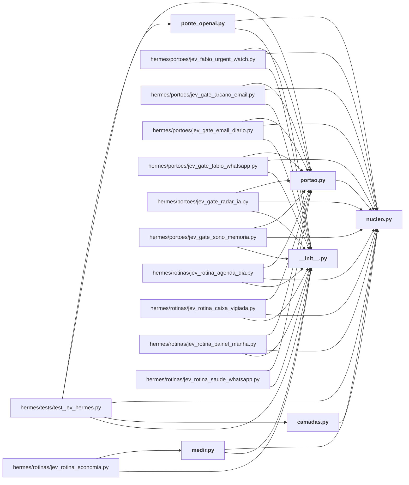

# hermes/jev_hermes/

← [MAPA.md](../../MAPA.md) · pasta acima: [hermes](../../mapa/pastas/hermes.md) · abrir a pasta: [hermes/jev_hermes/](../../hermes/jev_hermes)

## Arquivos

| arquivo | tipo | tamanho | descrição |
|---|---|---:|---|
| [__init__.py](../../hermes/jev_hermes/__init__.py) | código | 1 l. | O Jev no Hermes da VPS: núcleo, camadas do plugin, porteiros de cron e medição. |
| [camadas.py](../../hermes/jev_hermes/camadas.py) | código | 600 l. | As camadas do Jev dentro do Hermes: decidem o que entra no contexto do modelo caro. |
| [medir.py](../../hermes/jev_hermes/medir.py) | código | 149 l. | Medição do Jev no Hermes, recalculada dos registros: `python3 medir.py [--gravar]`. |
| [nucleo.py](../../hermes/jev_hermes/nucleo.py) | código | 477 l. | O cliente único do Jev no Hermes da VPS: chaves, provedores, teto, cache e registro. |
| [ponte_openai.py](../../hermes/jev_hermes/ponte_openai.py) | código | 157 l. | Ponte OpenAI → Jev: deixa o OmniRoute (e qualquer cliente OpenAI) usar o Jev como "modelo". |
| [portao.py](../../hermes/jev_hermes/portao.py) | código | 130 l. | O que os porteiros de cron compartilham: decidir se o modelo caro precisa acordar. |

## Grafo de imports e links

Nós em negrito são desta pasta; setas cheias são imports, tracejadas são links de documento.

## Ligações e conteúdo de cada arquivo

### __init__.py

- **é usado por** — import: [`hermes/jev_hermes/medir.py`](../../hermes/jev_hermes/medir.py), [`hermes/jev_hermes/ponte_openai.py`](../../hermes/jev_hermes/ponte_openai.py), [`hermes/portoes/jev_fabio_urgent_watch.py`](../../hermes/portoes/jev_fabio_urgent_watch.py), [`hermes/portoes/jev_gate_arcano_email.py`](../../hermes/portoes/jev_gate_arcano_email.py), [`hermes/portoes/jev_gate_email_diario.py`](../../hermes/portoes/jev_gate_email_diario.py), [`hermes/portoes/jev_gate_fabio_whatsapp.py`](../../hermes/portoes/jev_gate_fabio_whatsapp.py), [`hermes/portoes/jev_gate_radar_ia.py`](../../hermes/portoes/jev_gate_radar_ia.py), [`hermes/portoes/jev_gate_sono_memoria.py`](../../hermes/portoes/jev_gate_sono_memoria.py), [`hermes/rotinas/jev_rotina_agenda_dia.py`](../../hermes/rotinas/jev_rotina_agenda_dia.py), [`hermes/rotinas/jev_rotina_caixa_vigiada.py`](../../hermes/rotinas/jev_rotina_caixa_vigiada.py), [`hermes/rotinas/jev_rotina_economia.py`](../../hermes/rotinas/jev_rotina_economia.py), [`hermes/rotinas/jev_rotina_painel_manha.py`](../../hermes/rotinas/jev_rotina_painel_manha.py), [`hermes/rotinas/jev_rotina_saude_whatsapp.py`](../../hermes/rotinas/jev_rotina_saude_whatsapp.py), [`hermes/tests/test_jev_hermes.py`](../../hermes/tests/test_jev_hermes.py)
- **parecidos (julgados pelo Jev)** — [`hermes/README.md`](../../hermes/README.md) (complementar, 0.37), [`hermes/plugin/jev-camadas/__init__.py`](../../hermes/plugin/jev-camadas/__init__.py) (complementar, 0.24), [`hermes/plugin/jev-advisor/__init__.py`](../../hermes/plugin/jev-advisor/__init__.py) (complementar, 0.23)

### camadas.py

- **usa** — import: [`hermes/jev_hermes/nucleo.py`](../../hermes/jev_hermes/nucleo.py); citação: [`docs/CAMADAS-CLAUDE-CODE.md`](../../docs/CAMADAS-CLAUDE-CODE.md)
- **é usado por** — import: [`hermes/tests/test_jev_hermes.py`](../../hermes/tests/test_jev_hermes.py)
- **chama de outros arquivos** — [`nucleo._agora`](../../hermes/jev_hermes/nucleo.py#L162), [`nucleo.classificar_em_paralelo`](../../hermes/jev_hermes/nucleo.py#L433), [`nucleo.dec`](../../hermes/jev_hermes/nucleo.py#L470), [`nucleo.escolha`](../../hermes/jev_hermes/nucleo.py#L465), [`nucleo.perguntar`](../../hermes/jev_hermes/nucleo.py#L341), [`nucleo.redigir`](../../hermes/jev_hermes/nucleo.py#L133), [`nucleo.registrar`](../../hermes/jev_hermes/nucleo.py#L324), [`nucleo.resumo_das_chamadas`](../../hermes/jev_hermes/nucleo.py#L451)
- **parecidos (julgados pelo Jev)** — [`integracao/camadas/nucleo.py`](../../integracao/camadas/nucleo.py) (complementar, 0.36), [`hermes/plugin/jev-camadas/__init__.py`](../../hermes/plugin/jev-camadas/__init__.py) (mesmo assunto, 0.28), [`integracao/camadas/__init__.py`](../../integracao/camadas/__init__.py) (complementar, 0.28), [`integracao/hooks/jev_prompt_router.py`](../../integracao/hooks/jev_prompt_router.py) (complementar, 0.27), [`integracao/camadas/medir.py`](../../integracao/camadas/medir.py) (complementar, 0.23)
- **menciona 8 conceitos** — [E1](../../mapa/conhecimento/experimentos.md#e1) (2×), [E13](../../mapa/conhecimento/experimentos.md#e13) (1×), [E16](../../mapa/conhecimento/experimentos.md#e16) (1×), [R18](../../mapa/conhecimento/rodadas.md#r18) (1×), [R20](../../mapa/conhecimento/rodadas.md#r20) (1×), [R23](../../mapa/conhecimento/rodadas.md#r23) (1×), [R26](../../mapa/conhecimento/rodadas.md#r26) (1×), [R27](../../mapa/conhecimento/rodadas.md#r27) (1×)
- **conteúdo** — [registrar](../../hermes/jev_hermes/camadas.py#L31) (l. 31), [tokens](../../hermes/jev_hermes/camadas.py#L36) (l. 36), [guardar_pedido](../../hermes/jev_hermes/camadas.py#L42) (l. 42), [pedido_vigente](../../hermes/jev_hermes/camadas.py#L60) (l. 60), [_seguro](../../hermes/jev_hermes/camadas.py#L72) (l. 72), [limpar_sessoes](../../hermes/jev_hermes/camadas.py#L76) (l. 76), [tema](../../hermes/jev_hermes/camadas.py#L186) (l. 186; usado em 1), [dividir_em_blocos](../../hermes/jev_hermes/camadas.py#L233) (l. 233), [_json_do_resultado](../../hermes/jev_hermes/camadas.py#L249) (l. 249), [posicao](../../hermes/jev_hermes/camadas.py#L261) (l. 261), [leitura](../../hermes/jev_hermes/camadas.py#L270) (l. 270; usado em 1), [itens_da_busca](../../hermes/jev_hermes/camadas.py#L359) (l. 359), [busca](../../hermes/jev_hermes/camadas.py#L385) (l. 385; usado em 1), [texto_de](../../hermes/jev_hermes/camadas.py#L434) (l. 434), [sentinela](../../hermes/jev_hermes/camadas.py#L458) (l. 458; usado em 1), [saida](../../hermes/jev_hermes/camadas.py#L498) (l. 498), [recortar_terminal](../../hermes/jev_hermes/camadas.py#L542) (l. 542; usado em 1)

### medir.py

- **usa** — import: [`hermes/jev_hermes/__init__.py`](../../hermes/jev_hermes/__init__.py), [`hermes/jev_hermes/nucleo.py`](../../hermes/jev_hermes/nucleo.py)
- **é usado por** — import: [`hermes/rotinas/jev_rotina_economia.py`](../../hermes/rotinas/jev_rotina_economia.py)
- **chama de outros arquivos** — [`nucleo._agora`](../../hermes/jev_hermes/nucleo.py#L162), [`nucleo.situacao`](../../hermes/jev_hermes/nucleo.py#L176)
- **parecidos (julgados pelo Jev)** — [`integracao/camadas/medir.py`](../../integracao/camadas/medir.py) (complementar, 0.32), [`research/audit_hermes_pdf.py`](../../research/audit_hermes_pdf.py) (mesmo assunto, 0.21)
- **conteúdo** — [linhas](../../hermes/jev_hermes/medir.py#L25) (l. 25), [tamanho_medio_do_prompt](../../hermes/jev_hermes/medir.py#L39) (l. 39), [medir](../../hermes/jev_hermes/medir.py#L52) (l. 52; usado em 1), [pagina](../../hermes/jev_hermes/medir.py#L107) (l. 107; usado em 1)

### nucleo.py

- **usa** — citação: [`executor/prices.json`](../../executor/prices.json), [`executor/runner.py`](../../executor/runner.py)
- **é usado por** — import: [`hermes/jev_hermes/camadas.py`](../../hermes/jev_hermes/camadas.py), [`hermes/jev_hermes/medir.py`](../../hermes/jev_hermes/medir.py), [`hermes/jev_hermes/ponte_openai.py`](../../hermes/jev_hermes/ponte_openai.py), [`hermes/jev_hermes/portao.py`](../../hermes/jev_hermes/portao.py), [`hermes/portoes/jev_fabio_urgent_watch.py`](../../hermes/portoes/jev_fabio_urgent_watch.py), [`hermes/portoes/jev_gate_arcano_email.py`](../../hermes/portoes/jev_gate_arcano_email.py), [`hermes/portoes/jev_gate_email_diario.py`](../../hermes/portoes/jev_gate_email_diario.py), [`hermes/portoes/jev_gate_fabio_whatsapp.py`](../../hermes/portoes/jev_gate_fabio_whatsapp.py), [`hermes/portoes/jev_gate_radar_ia.py`](../../hermes/portoes/jev_gate_radar_ia.py), [`hermes/portoes/jev_gate_sono_memoria.py`](../../hermes/portoes/jev_gate_sono_memoria.py), [`hermes/rotinas/jev_rotina_agenda_dia.py`](../../hermes/rotinas/jev_rotina_agenda_dia.py), [`hermes/rotinas/jev_rotina_caixa_vigiada.py`](../../hermes/rotinas/jev_rotina_caixa_vigiada.py), [`hermes/rotinas/jev_rotina_painel_manha.py`](../../hermes/rotinas/jev_rotina_painel_manha.py), [`hermes/tests/test_jev_hermes.py`](../../hermes/tests/test_jev_hermes.py)
- **parecidos (julgados pelo Jev)** — [`integracao/jev_router/roteador.py`](../../integracao/jev_router/roteador.py) (complementar, 0.43), [`executor/credenciais.py`](../../executor/credenciais.py) (mesmo assunto, 0.29), [`integracao/camadas/nucleo.py`](../../integracao/camadas/nucleo.py) (complementar, 0.26), [`integracao/jev_router/cliente.py`](../../integracao/jev_router/cliente.py) (complementar, 0.21)
- **menciona 1 conceito** — [E5](../../mapa/conhecimento/experimentos.md#e5) (1×)
- **conteúdo** — [_ler_arquivo](../../hermes/jev_hermes/nucleo.py#L68) (l. 68), [configuracao](../../hermes/jev_hermes/nucleo.py#L82) (l. 82), [tetos](../../hermes/jev_hermes/nucleo.py#L88) (l. 88), [ordem_de_provedores](../../hermes/jev_hermes/nucleo.py#L97) (l. 97), [desligado](../../hermes/jev_hermes/nucleo.py#L105) (l. 105; usado em 1), [redigir](../../hermes/jev_hermes/nucleo.py#L133) (l. 133; usado em 1), [_banco](../../hermes/jev_hermes/nucleo.py#L149) (l. 149), [_agora](../../hermes/jev_hermes/nucleo.py#L162) (l. 162; usado em 3), [pior_caso_usd](../../hermes/jev_hermes/nucleo.py#L166) (l. 166), [situacao](../../hermes/jev_hermes/nucleo.py#L176) (l. 176; usado em 2), [_reservar](../../hermes/jev_hermes/nucleo.py#L195) (l. 195), [_liquidar](../../hermes/jev_hermes/nucleo.py#L224) (l. 224), [_chave_de_cache](../../hermes/jev_hermes/nucleo.py#L231) (l. 231), [_do_cache](../../hermes/jev_hermes/nucleo.py#L236) (l. 236), [_para_o_cache](../../hermes/jev_hermes/nucleo.py#L247) (l. 247), [ErroDeContrato](../../hermes/jev_hermes/nucleo.py#L259) (l. 259), [validar](../../hermes/jev_hermes/nucleo.py#L263) (l. 263), [transporte_http](../../hermes/jev_hermes/nucleo.py#L291) (l. 291), [_custo](../../hermes/jev_hermes/nucleo.py#L312) (l. 312), [registrar](../../hermes/jev_hermes/nucleo.py#L324) (l. 324; usado em 2), [_resumo_das_respostas](../../hermes/jev_hermes/nucleo.py#L334) (l. 334), [perguntar](../../hermes/jev_hermes/nucleo.py#L341) (l. 341; usado em 6), [classificar_em_paralelo](../../hermes/jev_hermes/nucleo.py#L433) (l. 433; usado em 7), [resumo_das_chamadas](../../hermes/jev_hermes/nucleo.py#L451) (l. 451; usado em 7), [escolha](../../hermes/jev_hermes/nucleo.py#L465) (l. 465; usado em 9), [dec](../../hermes/jev_hermes/nucleo.py#L470) (l. 470; usado em 6)

### ponte_openai.py

- **usa** — import: [`hermes/jev_hermes/__init__.py`](../../hermes/jev_hermes/__init__.py), [`hermes/jev_hermes/nucleo.py`](../../hermes/jev_hermes/nucleo.py)
- **é usado por** — import: [`hermes/tests/test_jev_hermes.py`](../../hermes/tests/test_jev_hermes.py)
- **chama de outros arquivos** — [`nucleo.desligado`](../../hermes/jev_hermes/nucleo.py#L105), [`nucleo.perguntar`](../../hermes/jev_hermes/nucleo.py#L341)
- **parecidos (julgados pelo Jev)** — [`lab/server.py`](../../lab/server.py) (complementar, 0.30)
- **conteúdo** — [texto_da_mensagem](../../hermes/jev_hermes/ponte_openai.py#L42) (l. 42), [contrato](../../hermes/jev_hermes/ponte_openai.py#L49) (l. 49), [rota](../../hermes/jev_hermes/ponte_openai.py#L69) (l. 69), [Ponte](../../hermes/jev_hermes/ponte_openai.py#L77) (l. 77; usado em 1), [main](../../hermes/jev_hermes/ponte_openai.py#L150) (l. 150)

### portao.py

- **usa** — import: [`hermes/jev_hermes/nucleo.py`](../../hermes/jev_hermes/nucleo.py)
- **é usado por** — import: [`hermes/portoes/jev_fabio_urgent_watch.py`](../../hermes/portoes/jev_fabio_urgent_watch.py), [`hermes/portoes/jev_gate_arcano_email.py`](../../hermes/portoes/jev_gate_arcano_email.py), [`hermes/portoes/jev_gate_email_diario.py`](../../hermes/portoes/jev_gate_email_diario.py), [`hermes/portoes/jev_gate_fabio_whatsapp.py`](../../hermes/portoes/jev_gate_fabio_whatsapp.py), [`hermes/portoes/jev_gate_radar_ia.py`](../../hermes/portoes/jev_gate_radar_ia.py), [`hermes/portoes/jev_gate_sono_memoria.py`](../../hermes/portoes/jev_gate_sono_memoria.py), [`hermes/rotinas/jev_rotina_agenda_dia.py`](../../hermes/rotinas/jev_rotina_agenda_dia.py), [`hermes/rotinas/jev_rotina_caixa_vigiada.py`](../../hermes/rotinas/jev_rotina_caixa_vigiada.py), [`hermes/rotinas/jev_rotina_painel_manha.py`](../../hermes/rotinas/jev_rotina_painel_manha.py), [`hermes/rotinas/jev_rotina_saude_whatsapp.py`](../../hermes/rotinas/jev_rotina_saude_whatsapp.py), [`hermes/tests/test_jev_hermes.py`](../../hermes/tests/test_jev_hermes.py)
- **chama de outros arquivos** — [`nucleo._agora`](../../hermes/jev_hermes/nucleo.py#L162), [`nucleo.registrar`](../../hermes/jev_hermes/nucleo.py#L324)
- **conteúdo** — [registrar](../../hermes/jev_hermes/portao.py#L30) (l. 30; usado em 5), [encerrar](../../hermes/jev_hermes/portao.py#L35) (l. 35; usado em 6), [executar](../../hermes/jev_hermes/portao.py#L44) (l. 44; usado em 6), [rodar](../../hermes/jev_hermes/portao.py#L57) (l. 57; usado em 3), [json_da_saida](../../hermes/jev_hermes/portao.py#L65) (l. 65; usado em 4), [gmail_listar](../../hermes/jev_hermes/portao.py#L76) (l. 76; usado em 3), [gmail_cabecalhos](../../hermes/jev_hermes/portao.py#L83) (l. 83; usado em 3), [probabilidade](../../hermes/jev_hermes/portao.py#L120) (l. 120; usado em 2), [email_descartavel](../../hermes/jev_hermes/portao.py#L126) (l. 126; usado em 2)
