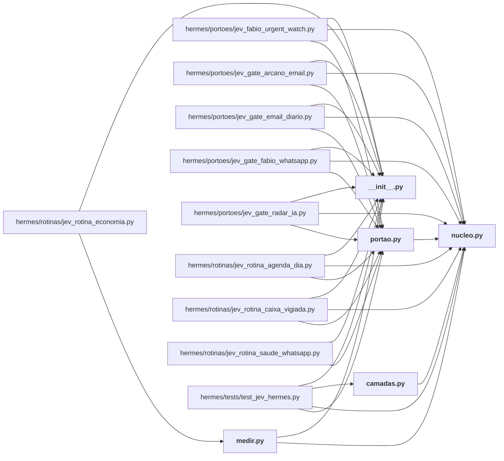

# hermes/jev_hermes/

← [MAPA.md](../../MAPA.md) · pasta acima: [hermes](../../mapa/pastas/hermes.md) · abrir a pasta: [hermes/jev_hermes/](../../hermes/jev_hermes)

## Arquivos

| arquivo | tipo | tamanho | descrição |
|---|---|---:|---|
| [__init__.py](../../hermes/jev_hermes/__init__.py) | código | 1 l. | O Jev no Hermes da VPS: núcleo, camadas do plugin, porteiros de cron e medição. |
| [camadas.py](../../hermes/jev_hermes/camadas.py) | código | 520 l. | As camadas do Jev dentro do Hermes: decidem o que entra no contexto do modelo caro. |
| [medir.py](../../hermes/jev_hermes/medir.py) | código | 149 l. | Medição do Jev no Hermes, recalculada dos registros: `python3 medir.py [--gravar]`. |
| [nucleo.py](../../hermes/jev_hermes/nucleo.py) | código | 466 l. | O cliente único do Jev no Hermes da VPS: chaves, provedores, teto, cache e registro. |
| [portao.py](../../hermes/jev_hermes/portao.py) | código | 130 l. | O que os porteiros de cron compartilham: decidir se o modelo caro precisa acordar. |

## Grafo de imports e links

Nós em negrito são desta pasta; setas cheias são imports, tracejadas são links de documento.

## Ligações e conteúdo de cada arquivo

### __init__.py

- **é usado por** — import: [`hermes/jev_hermes/medir.py`](../../hermes/jev_hermes/medir.py), [`hermes/portoes/jev_fabio_urgent_watch.py`](../../hermes/portoes/jev_fabio_urgent_watch.py), [`hermes/portoes/jev_gate_arcano_email.py`](../../hermes/portoes/jev_gate_arcano_email.py), [`hermes/portoes/jev_gate_email_diario.py`](../../hermes/portoes/jev_gate_email_diario.py), [`hermes/portoes/jev_gate_fabio_whatsapp.py`](../../hermes/portoes/jev_gate_fabio_whatsapp.py), [`hermes/portoes/jev_gate_radar_ia.py`](../../hermes/portoes/jev_gate_radar_ia.py), [`hermes/rotinas/jev_rotina_agenda_dia.py`](../../hermes/rotinas/jev_rotina_agenda_dia.py), [`hermes/rotinas/jev_rotina_caixa_vigiada.py`](../../hermes/rotinas/jev_rotina_caixa_vigiada.py), [`hermes/rotinas/jev_rotina_economia.py`](../../hermes/rotinas/jev_rotina_economia.py), [`hermes/rotinas/jev_rotina_saude_whatsapp.py`](../../hermes/rotinas/jev_rotina_saude_whatsapp.py), [`hermes/tests/test_jev_hermes.py`](../../hermes/tests/test_jev_hermes.py)

### camadas.py

- **usa** — import: [`hermes/jev_hermes/nucleo.py`](../../hermes/jev_hermes/nucleo.py); citação: [`docs/CAMADAS-CLAUDE-CODE.md`](../../docs/CAMADAS-CLAUDE-CODE.md)
- **é usado por** — import: [`hermes/tests/test_jev_hermes.py`](../../hermes/tests/test_jev_hermes.py)
- **chama de outros arquivos** — [`nucleo._agora`](../../hermes/jev_hermes/nucleo.py#L160), [`nucleo.classificar_em_paralelo`](../../hermes/jev_hermes/nucleo.py#L422), [`nucleo.dec`](../../hermes/jev_hermes/nucleo.py#L459), [`nucleo.escolha`](../../hermes/jev_hermes/nucleo.py#L454), [`nucleo.perguntar`](../../hermes/jev_hermes/nucleo.py#L339), [`nucleo.redigir`](../../hermes/jev_hermes/nucleo.py#L131), [`nucleo.registrar`](../../hermes/jev_hermes/nucleo.py#L322), [`nucleo.resumo_das_chamadas`](../../hermes/jev_hermes/nucleo.py#L440)
- **menciona 8 conceitos** — [E1](../../mapa/conhecimento/experimentos.md#e1) (2×), [E13](../../mapa/conhecimento/experimentos.md#e13) (1×), [E16](../../mapa/conhecimento/experimentos.md#e16) (1×), [R18](../../mapa/conhecimento/rodadas.md#r18) (1×), [R20](../../mapa/conhecimento/rodadas.md#r20) (1×), [R23](../../mapa/conhecimento/rodadas.md#r23) (1×), [R26](../../mapa/conhecimento/rodadas.md#r26) (1×), [R27](../../mapa/conhecimento/rodadas.md#r27) (1×)
- **conteúdo** — [registrar](../../hermes/jev_hermes/camadas.py#L31) (l. 31), [tokens](../../hermes/jev_hermes/camadas.py#L36) (l. 36), [guardar_pedido](../../hermes/jev_hermes/camadas.py#L42) (l. 42), [pedido_vigente](../../hermes/jev_hermes/camadas.py#L60) (l. 60), [_seguro](../../hermes/jev_hermes/camadas.py#L72) (l. 72), [limpar_sessoes](../../hermes/jev_hermes/camadas.py#L76) (l. 76), [tema](../../hermes/jev_hermes/camadas.py#L182) (l. 182), [dividir_em_blocos](../../hermes/jev_hermes/camadas.py#L224) (l. 224), [_json_do_resultado](../../hermes/jev_hermes/camadas.py#L240) (l. 240), [posicao](../../hermes/jev_hermes/camadas.py#L252) (l. 252), [leitura](../../hermes/jev_hermes/camadas.py#L261) (l. 261; usado em 1), [itens_da_busca](../../hermes/jev_hermes/camadas.py#L350) (l. 350), [busca](../../hermes/jev_hermes/camadas.py#L376) (l. 376; usado em 1), [texto_de](../../hermes/jev_hermes/camadas.py#L425) (l. 425), [sentinela](../../hermes/jev_hermes/camadas.py#L449) (l. 449; usado em 1), [saida](../../hermes/jev_hermes/camadas.py#L489) (l. 489)

### medir.py

- **usa** — import: [`hermes/jev_hermes/__init__.py`](../../hermes/jev_hermes/__init__.py), [`hermes/jev_hermes/nucleo.py`](../../hermes/jev_hermes/nucleo.py)
- **é usado por** — import: [`hermes/rotinas/jev_rotina_economia.py`](../../hermes/rotinas/jev_rotina_economia.py)
- **chama de outros arquivos** — [`nucleo._agora`](../../hermes/jev_hermes/nucleo.py#L160), [`nucleo.situacao`](../../hermes/jev_hermes/nucleo.py#L174)
- **conteúdo** — [linhas](../../hermes/jev_hermes/medir.py#L25) (l. 25), [tamanho_medio_do_prompt](../../hermes/jev_hermes/medir.py#L39) (l. 39), [medir](../../hermes/jev_hermes/medir.py#L52) (l. 52; usado em 1), [pagina](../../hermes/jev_hermes/medir.py#L107) (l. 107; usado em 1)

### nucleo.py

- **usa** — citação: [`executor/prices.json`](../../executor/prices.json), [`executor/runner.py`](../../executor/runner.py)
- **é usado por** — import: [`hermes/jev_hermes/camadas.py`](../../hermes/jev_hermes/camadas.py), [`hermes/jev_hermes/medir.py`](../../hermes/jev_hermes/medir.py), [`hermes/jev_hermes/portao.py`](../../hermes/jev_hermes/portao.py), [`hermes/portoes/jev_fabio_urgent_watch.py`](../../hermes/portoes/jev_fabio_urgent_watch.py), [`hermes/portoes/jev_gate_arcano_email.py`](../../hermes/portoes/jev_gate_arcano_email.py), [`hermes/portoes/jev_gate_email_diario.py`](../../hermes/portoes/jev_gate_email_diario.py), [`hermes/portoes/jev_gate_fabio_whatsapp.py`](../../hermes/portoes/jev_gate_fabio_whatsapp.py), [`hermes/portoes/jev_gate_radar_ia.py`](../../hermes/portoes/jev_gate_radar_ia.py), [`hermes/rotinas/jev_rotina_agenda_dia.py`](../../hermes/rotinas/jev_rotina_agenda_dia.py), [`hermes/rotinas/jev_rotina_caixa_vigiada.py`](../../hermes/rotinas/jev_rotina_caixa_vigiada.py), [`hermes/tests/test_jev_hermes.py`](../../hermes/tests/test_jev_hermes.py)
- **menciona 1 conceito** — [E5](../../mapa/conhecimento/experimentos.md#e5) (1×)
- **conteúdo** — [_ler_arquivo](../../hermes/jev_hermes/nucleo.py#L66) (l. 66), [configuracao](../../hermes/jev_hermes/nucleo.py#L80) (l. 80), [tetos](../../hermes/jev_hermes/nucleo.py#L86) (l. 86), [ordem_de_provedores](../../hermes/jev_hermes/nucleo.py#L95) (l. 95), [desligado](../../hermes/jev_hermes/nucleo.py#L103) (l. 103), [redigir](../../hermes/jev_hermes/nucleo.py#L131) (l. 131; usado em 1), [_banco](../../hermes/jev_hermes/nucleo.py#L147) (l. 147), [_agora](../../hermes/jev_hermes/nucleo.py#L160) (l. 160; usado em 3), [pior_caso_usd](../../hermes/jev_hermes/nucleo.py#L164) (l. 164), [situacao](../../hermes/jev_hermes/nucleo.py#L174) (l. 174; usado em 2), [_reservar](../../hermes/jev_hermes/nucleo.py#L193) (l. 193), [_liquidar](../../hermes/jev_hermes/nucleo.py#L222) (l. 222), [_chave_de_cache](../../hermes/jev_hermes/nucleo.py#L229) (l. 229), [_do_cache](../../hermes/jev_hermes/nucleo.py#L234) (l. 234), [_para_o_cache](../../hermes/jev_hermes/nucleo.py#L245) (l. 245), [ErroDeContrato](../../hermes/jev_hermes/nucleo.py#L257) (l. 257), [validar](../../hermes/jev_hermes/nucleo.py#L261) (l. 261), [transporte_http](../../hermes/jev_hermes/nucleo.py#L289) (l. 289), [_custo](../../hermes/jev_hermes/nucleo.py#L310) (l. 310), [registrar](../../hermes/jev_hermes/nucleo.py#L322) (l. 322; usado em 2), [_resumo_das_respostas](../../hermes/jev_hermes/nucleo.py#L332) (l. 332), [perguntar](../../hermes/jev_hermes/nucleo.py#L339) (l. 339; usado em 5), [classificar_em_paralelo](../../hermes/jev_hermes/nucleo.py#L422) (l. 422; usado em 5), [resumo_das_chamadas](../../hermes/jev_hermes/nucleo.py#L440) (l. 440; usado em 5), [escolha](../../hermes/jev_hermes/nucleo.py#L454) (l. 454; usado em 8), [dec](../../hermes/jev_hermes/nucleo.py#L459) (l. 459; usado em 5)

### portao.py

- **usa** — import: [`hermes/jev_hermes/nucleo.py`](../../hermes/jev_hermes/nucleo.py)
- **é usado por** — import: [`hermes/portoes/jev_fabio_urgent_watch.py`](../../hermes/portoes/jev_fabio_urgent_watch.py), [`hermes/portoes/jev_gate_arcano_email.py`](../../hermes/portoes/jev_gate_arcano_email.py), [`hermes/portoes/jev_gate_email_diario.py`](../../hermes/portoes/jev_gate_email_diario.py), [`hermes/portoes/jev_gate_fabio_whatsapp.py`](../../hermes/portoes/jev_gate_fabio_whatsapp.py), [`hermes/portoes/jev_gate_radar_ia.py`](../../hermes/portoes/jev_gate_radar_ia.py), [`hermes/rotinas/jev_rotina_agenda_dia.py`](../../hermes/rotinas/jev_rotina_agenda_dia.py), [`hermes/rotinas/jev_rotina_caixa_vigiada.py`](../../hermes/rotinas/jev_rotina_caixa_vigiada.py), [`hermes/rotinas/jev_rotina_saude_whatsapp.py`](../../hermes/rotinas/jev_rotina_saude_whatsapp.py), [`hermes/tests/test_jev_hermes.py`](../../hermes/tests/test_jev_hermes.py)
- **chama de outros arquivos** — [`nucleo._agora`](../../hermes/jev_hermes/nucleo.py#L160), [`nucleo.registrar`](../../hermes/jev_hermes/nucleo.py#L322)
- **conteúdo** — [registrar](../../hermes/jev_hermes/portao.py#L30) (l. 30; usado em 4), [encerrar](../../hermes/jev_hermes/portao.py#L35) (l. 35; usado em 5), [executar](../../hermes/jev_hermes/portao.py#L44) (l. 44; usado em 5), [rodar](../../hermes/jev_hermes/portao.py#L57) (l. 57; usado em 2), [json_da_saida](../../hermes/jev_hermes/portao.py#L65) (l. 65; usado em 3), [gmail_listar](../../hermes/jev_hermes/portao.py#L76) (l. 76; usado em 3), [gmail_cabecalhos](../../hermes/jev_hermes/portao.py#L83) (l. 83; usado em 3), [probabilidade](../../hermes/jev_hermes/portao.py#L120) (l. 120; usado em 1), [email_descartavel](../../hermes/jev_hermes/portao.py#L126) (l. 126; usado em 2)
