# hermes/jev_hermes/

← [MAPA.md](../../MAPA.md) · pasta acima: [hermes](../../mapa/pastas/hermes.md) · abrir a pasta: [hermes/jev_hermes/](../../hermes/jev_hermes)

## Subpastas

| subpasta | arquivos | finalidade |
|---|---:|---|
| [listas/](../../mapa/pastas/hermes__jev_hermes__listas.md) | 2 |  |

## Arquivos

| arquivo | tipo | tamanho | descrição |
|---|---|---:|---|
| [__init__.py](../../hermes/jev_hermes/__init__.py) | código | 1 l. | O Jev no Hermes da VPS: núcleo, camadas do plugin, porteiros de cron e medição. |
| [camadas.py](../../hermes/jev_hermes/camadas.py) | código | 644 l. | As camadas do Jev dentro do Hermes: decidem o que entra no contexto do modelo caro. |
| [checklist.py](../../hermes/jev_hermes/checklist.py) | código | 228 l. | Checklist: um documento, uma lista fixa de perguntas, um semáforo por item — numa chamada só. |
| [medir.py](../../hermes/jev_hermes/medir.py) | código | 170 l. | Medição do Jev no Hermes, recalculada dos registros: `python3 medir.py [--gravar]`. |
| [nucleo.py](../../hermes/jev_hermes/nucleo.py) | código | 491 l. | O cliente único do Jev no Hermes da VPS: chaves, provedores, teto, cache e registro. |
| [pendencias.py](../../hermes/jev_hermes/pendencias.py) | código | 200 l. | Pendências do WhatsApp pessoal de Igor, decididas pelo Jev. Sem modelo principal. |
| [ponte_openai.py](../../hermes/jev_hermes/ponte_openai.py) | código | 157 l. | Ponte OpenAI → Jev: deixa o OmniRoute (e qualquer cliente OpenAI) usar o Jev como "modelo". |
| [portao.py](../../hermes/jev_hermes/portao.py) | código | 130 l. | O que os porteiros de cron compartilham: decidir se o modelo caro precisa acordar. |
| [prazos.py](../../hermes/jev_hermes/prazos.py) | código | 410 l. | Controle de prazos dos e-mails de Igor, decidido pelo Jev. |
| [recortes.py](../../hermes/jev_hermes/recortes.py) | código | 340 l. | Recortes de contexto que o estudo de uso do Hermes pediu (2026-09-21). |

## Grafo de imports e links

Nós em negrito são desta pasta; setas cheias são imports, tracejadas são links de documento.

```mermaid
flowchart LR
  n_hermes_jev_hermes___init___py["<b>__init__.py</b>"]
  n_hermes_jev_hermes_camadas_py["<b>camadas.py</b>"]
  n_hermes_jev_hermes_checklist_py["<b>checklist.py</b>"]
  n_hermes_jev_hermes_medir_py["<b>medir.py</b>"]
  n_hermes_jev_hermes_nucleo_py["<b>nucleo.py</b>"]
  n_hermes_jev_hermes_pendencias_py["<b>pendencias.py</b>"]
  n_hermes_jev_hermes_ponte_openai_py["<b>ponte_openai.py</b>"]
  n_hermes_jev_hermes_portao_py["<b>portao.py</b>"]
  n_hermes_jev_hermes_prazos_py["<b>prazos.py</b>"]
  n_hermes_jev_hermes_recortes_py["<b>recortes.py</b>"]
  n_hermes_portoes_jev_fabio_urgent_watch_py["hermes/portoes/jev_fabio_urgent_watch.py"]
  n_hermes_portoes_jev_gate_arcano_email_py["hermes/portoes/jev_gate_arcano_email.py"]
  n_hermes_portoes_jev_gate_boletim_taguatinga_py["hermes/portoes/jev_gate_boletim_taguatinga.py"]
  n_hermes_portoes_jev_gate_email_diario_py["hermes/portoes/jev_gate_email_diario.py"]
  n_hermes_portoes_jev_gate_fabio_whatsapp_py["hermes/portoes/jev_gate_fabio_whatsapp.py"]
  n_hermes_portoes_jev_gate_radar_ia_py["hermes/portoes/jev_gate_radar_ia.py"]
  n_hermes_portoes_jev_gate_sono_memoria_py["hermes/portoes/jev_gate_sono_memoria.py"]
  n_hermes_portoes_jev_gate_tese_diaria_py["hermes/portoes/jev_gate_tese_diaria.py"]
  n_hermes_rotinas_jev_rotina_agenda_dia_py["hermes/rotinas/jev_rotina_agenda_dia.py"]
  n_hermes_rotinas_jev_rotina_caixa_vigiada_py["hermes/rotinas/jev_rotina_caixa_vigiada.py"]
  n_hermes_rotinas_jev_rotina_economia_py["hermes/rotinas/jev_rotina_economia.py"]
  n_hermes_rotinas_jev_rotina_painel_manha_py["hermes/rotinas/jev_rotina_painel_manha.py"]
  n_hermes_rotinas_jev_rotina_prazos_py["hermes/rotinas/jev_rotina_prazos.py"]
  n_hermes_rotinas_jev_rotina_saude_whatsapp_py["hermes/rotinas/jev_rotina_saude_whatsapp.py"]
  n_hermes_tests_test_jev_hermes_py["hermes/tests/test_jev_hermes.py"]
  n_hermes_tests_test_recortes_py["hermes/tests/test_recortes.py"]
  n_hermes_jev_hermes_camadas_py --> n_hermes_jev_hermes_nucleo_py
  n_hermes_jev_hermes_checklist_py --> n_hermes_jev_hermes___init___py
  n_hermes_jev_hermes_checklist_py --> n_hermes_jev_hermes_camadas_py
  n_hermes_jev_hermes_checklist_py --> n_hermes_jev_hermes_nucleo_py
  n_hermes_jev_hermes_medir_py --> n_hermes_jev_hermes___init___py
  n_hermes_jev_hermes_medir_py --> n_hermes_jev_hermes_nucleo_py
  n_hermes_jev_hermes_pendencias_py --> n_hermes_jev_hermes___init___py
  n_hermes_jev_hermes_pendencias_py --> n_hermes_jev_hermes_nucleo_py
  n_hermes_jev_hermes_ponte_openai_py --> n_hermes_jev_hermes___init___py
  n_hermes_jev_hermes_ponte_openai_py --> n_hermes_jev_hermes_nucleo_py
  n_hermes_jev_hermes_portao_py --> n_hermes_jev_hermes_nucleo_py
  n_hermes_jev_hermes_prazos_py --> n_hermes_jev_hermes___init___py
  n_hermes_jev_hermes_prazos_py --> n_hermes_jev_hermes_nucleo_py
  n_hermes_jev_hermes_prazos_py --> n_hermes_jev_hermes_portao_py
  n_hermes_jev_hermes_recortes_py --> n_hermes_jev_hermes_camadas_py
  n_hermes_jev_hermes_recortes_py --> n_hermes_jev_hermes_nucleo_py
  n_hermes_portoes_jev_fabio_urgent_watch_py --> n_hermes_jev_hermes___init___py
  n_hermes_portoes_jev_fabio_urgent_watch_py --> n_hermes_jev_hermes_nucleo_py
  n_hermes_portoes_jev_fabio_urgent_watch_py --> n_hermes_jev_hermes_portao_py
  n_hermes_portoes_jev_gate_arcano_email_py --> n_hermes_jev_hermes___init___py
  n_hermes_portoes_jev_gate_arcano_email_py --> n_hermes_jev_hermes_nucleo_py
  n_hermes_portoes_jev_gate_arcano_email_py --> n_hermes_jev_hermes_portao_py
  n_hermes_portoes_jev_gate_boletim_taguatinga_py --> n_hermes_jev_hermes___init___py
  n_hermes_portoes_jev_gate_boletim_taguatinga_py --> n_hermes_jev_hermes_nucleo_py
  n_hermes_portoes_jev_gate_boletim_taguatinga_py --> n_hermes_jev_hermes_portao_py
  n_hermes_portoes_jev_gate_email_diario_py --> n_hermes_jev_hermes___init___py
  n_hermes_portoes_jev_gate_email_diario_py --> n_hermes_jev_hermes_nucleo_py
  n_hermes_portoes_jev_gate_email_diario_py --> n_hermes_jev_hermes_portao_py
  n_hermes_portoes_jev_gate_fabio_whatsapp_py --> n_hermes_jev_hermes___init___py
  n_hermes_portoes_jev_gate_fabio_whatsapp_py --> n_hermes_jev_hermes_nucleo_py
  n_hermes_portoes_jev_gate_fabio_whatsapp_py --> n_hermes_jev_hermes_portao_py
  n_hermes_portoes_jev_gate_radar_ia_py --> n_hermes_jev_hermes___init___py
  n_hermes_portoes_jev_gate_radar_ia_py --> n_hermes_jev_hermes_nucleo_py
  n_hermes_portoes_jev_gate_radar_ia_py --> n_hermes_jev_hermes_portao_py
  n_hermes_portoes_jev_gate_sono_memoria_py --> n_hermes_jev_hermes___init___py
  n_hermes_portoes_jev_gate_sono_memoria_py --> n_hermes_jev_hermes_nucleo_py
  n_hermes_portoes_jev_gate_sono_memoria_py --> n_hermes_jev_hermes_portao_py
  n_hermes_portoes_jev_gate_tese_diaria_py --> n_hermes_jev_hermes___init___py
  n_hermes_portoes_jev_gate_tese_diaria_py --> n_hermes_jev_hermes_nucleo_py
  n_hermes_portoes_jev_gate_tese_diaria_py --> n_hermes_jev_hermes_portao_py
  n_hermes_rotinas_jev_rotina_agenda_dia_py --> n_hermes_jev_hermes___init___py
  n_hermes_rotinas_jev_rotina_agenda_dia_py --> n_hermes_jev_hermes_nucleo_py
  n_hermes_rotinas_jev_rotina_agenda_dia_py --> n_hermes_jev_hermes_portao_py
  n_hermes_rotinas_jev_rotina_caixa_vigiada_py --> n_hermes_jev_hermes___init___py
  n_hermes_rotinas_jev_rotina_caixa_vigiada_py --> n_hermes_jev_hermes_nucleo_py
  n_hermes_rotinas_jev_rotina_caixa_vigiada_py --> n_hermes_jev_hermes_portao_py
  n_hermes_rotinas_jev_rotina_economia_py --> n_hermes_jev_hermes___init___py
  n_hermes_rotinas_jev_rotina_economia_py --> n_hermes_jev_hermes_medir_py
  n_hermes_rotinas_jev_rotina_painel_manha_py --> n_hermes_jev_hermes___init___py
  n_hermes_rotinas_jev_rotina_painel_manha_py --> n_hermes_jev_hermes_nucleo_py
  n_hermes_rotinas_jev_rotina_painel_manha_py --> n_hermes_jev_hermes_pendencias_py
  n_hermes_rotinas_jev_rotina_painel_manha_py --> n_hermes_jev_hermes_portao_py
  n_hermes_rotinas_jev_rotina_painel_manha_py --> n_hermes_jev_hermes_prazos_py
  n_hermes_rotinas_jev_rotina_prazos_py --> n_hermes_jev_hermes___init___py
  n_hermes_rotinas_jev_rotina_prazos_py --> n_hermes_jev_hermes_portao_py
  n_hermes_rotinas_jev_rotina_prazos_py --> n_hermes_jev_hermes_prazos_py
  n_hermes_rotinas_jev_rotina_saude_whatsapp_py --> n_hermes_jev_hermes___init___py
  n_hermes_rotinas_jev_rotina_saude_whatsapp_py --> n_hermes_jev_hermes_portao_py
  n_hermes_tests_test_jev_hermes_py --> n_hermes_jev_hermes___init___py
  n_hermes_tests_test_jev_hermes_py --> n_hermes_jev_hermes_camadas_py
  n_hermes_tests_test_jev_hermes_py --> n_hermes_jev_hermes_checklist_py
  n_hermes_tests_test_jev_hermes_py --> n_hermes_jev_hermes_nucleo_py
  n_hermes_tests_test_jev_hermes_py --> n_hermes_jev_hermes_pendencias_py
  n_hermes_tests_test_jev_hermes_py --> n_hermes_jev_hermes_ponte_openai_py
  n_hermes_tests_test_jev_hermes_py --> n_hermes_jev_hermes_portao_py
  n_hermes_tests_test_jev_hermes_py --> n_hermes_jev_hermes_prazos_py
  n_hermes_tests_test_recortes_py --> n_hermes_jev_hermes___init___py
  n_hermes_tests_test_recortes_py --> n_hermes_jev_hermes_recortes_py
```

## Ligações e conteúdo de cada arquivo

### __init__.py

- **é usado por** — import: [`hermes/jev_hermes/checklist.py`](../../hermes/jev_hermes/checklist.py), [`hermes/jev_hermes/medir.py`](../../hermes/jev_hermes/medir.py), [`hermes/jev_hermes/pendencias.py`](../../hermes/jev_hermes/pendencias.py), [`hermes/jev_hermes/ponte_openai.py`](../../hermes/jev_hermes/ponte_openai.py), [`hermes/jev_hermes/prazos.py`](../../hermes/jev_hermes/prazos.py), [`hermes/portoes/jev_fabio_urgent_watch.py`](../../hermes/portoes/jev_fabio_urgent_watch.py), [`hermes/portoes/jev_gate_arcano_email.py`](../../hermes/portoes/jev_gate_arcano_email.py), [`hermes/portoes/jev_gate_boletim_taguatinga.py`](../../hermes/portoes/jev_gate_boletim_taguatinga.py), [`hermes/portoes/jev_gate_email_diario.py`](../../hermes/portoes/jev_gate_email_diario.py), [`hermes/portoes/jev_gate_fabio_whatsapp.py`](../../hermes/portoes/jev_gate_fabio_whatsapp.py), [`hermes/portoes/jev_gate_radar_ia.py`](../../hermes/portoes/jev_gate_radar_ia.py), [`hermes/portoes/jev_gate_sono_memoria.py`](../../hermes/portoes/jev_gate_sono_memoria.py), [`hermes/portoes/jev_gate_tese_diaria.py`](../../hermes/portoes/jev_gate_tese_diaria.py), [`hermes/rotinas/jev_rotina_agenda_dia.py`](../../hermes/rotinas/jev_rotina_agenda_dia.py), [`hermes/rotinas/jev_rotina_caixa_vigiada.py`](../../hermes/rotinas/jev_rotina_caixa_vigiada.py), [`hermes/rotinas/jev_rotina_economia.py`](../../hermes/rotinas/jev_rotina_economia.py), [`hermes/rotinas/jev_rotina_painel_manha.py`](../../hermes/rotinas/jev_rotina_painel_manha.py), [`hermes/rotinas/jev_rotina_prazos.py`](../../hermes/rotinas/jev_rotina_prazos.py), [`hermes/rotinas/jev_rotina_saude_whatsapp.py`](../../hermes/rotinas/jev_rotina_saude_whatsapp.py), [`hermes/tests/test_jev_hermes.py`](../../hermes/tests/test_jev_hermes.py), [`hermes/tests/test_recortes.py`](../../hermes/tests/test_recortes.py)
- **parecidos (julgados pelo Jev)** — [`hermes/README.md`](../../hermes/README.md) (complementar, 0.32), [`hermes/rotinas/jev_reiniciar_ocioso.py`](../../hermes/rotinas/jev_reiniciar_ocioso.py) (não julgado, 0.26), [`hermes/plugin/jev-camadas/__init__.py`](../../hermes/plugin/jev-camadas/__init__.py) (complementar, 0.23), [`hermes/plugin/jev-advisor/__init__.py`](../../hermes/plugin/jev-advisor/__init__.py) (complementar, 0.22)

### camadas.py

- **usa** — import: [`hermes/jev_hermes/nucleo.py`](../../hermes/jev_hermes/nucleo.py); citação: [`docs/CAMADAS-CLAUDE-CODE.md`](../../docs/CAMADAS-CLAUDE-CODE.md)
- **é usado por** — import: [`hermes/jev_hermes/checklist.py`](../../hermes/jev_hermes/checklist.py), [`hermes/jev_hermes/recortes.py`](../../hermes/jev_hermes/recortes.py), [`hermes/tests/test_jev_hermes.py`](../../hermes/tests/test_jev_hermes.py)
- **chama de outros arquivos** — [`nucleo._agora`](../../hermes/jev_hermes/nucleo.py#L176), [`nucleo.classificar_em_paralelo`](../../hermes/jev_hermes/nucleo.py#L447), [`nucleo.dec`](../../hermes/jev_hermes/nucleo.py#L484), [`nucleo.escolha`](../../hermes/jev_hermes/nucleo.py#L479), [`nucleo.perguntar`](../../hermes/jev_hermes/nucleo.py#L355), [`nucleo.redigir`](../../hermes/jev_hermes/nucleo.py#L133), [`nucleo.registrar`](../../hermes/jev_hermes/nucleo.py#L338), [`nucleo.resumo_das_chamadas`](../../hermes/jev_hermes/nucleo.py#L465)
- **parecidos (julgados pelo Jev)** — [`integracao/camadas/nucleo.py`](../../integracao/camadas/nucleo.py) (complementar, 0.35), [`hermes/plugin/jev-camadas/__init__.py`](../../hermes/plugin/jev-camadas/__init__.py) (mesmo assunto, 0.31), [`integracao/hooks/jev_prompt_router.py`](../../integracao/hooks/jev_prompt_router.py) (complementar, 0.28), [`integracao/camadas/__init__.py`](../../integracao/camadas/__init__.py) (complementar, 0.24), [`integracao/camadas/medir.py`](../../integracao/camadas/medir.py) (complementar, 0.20)
- **menciona 8 conceitos** — [E1](../../mapa/conhecimento/experimentos.md#e1) (2×), [E13](../../mapa/conhecimento/experimentos.md#e13) (1×), [E16](../../mapa/conhecimento/experimentos.md#e16) (1×), [R18](../../mapa/conhecimento/rodadas.md#r18) (1×), [R20](../../mapa/conhecimento/rodadas.md#r20) (1×), [R23](../../mapa/conhecimento/rodadas.md#r23) (1×), [R26](../../mapa/conhecimento/rodadas.md#r26) (1×), [R27](../../mapa/conhecimento/rodadas.md#r27) (1×)
- **conteúdo** — [registrar](../../hermes/jev_hermes/camadas.py#L31) (l. 31; usado em 1), [tokens](../../hermes/jev_hermes/camadas.py#L36) (l. 36; usado em 1), [guardar_pedido](../../hermes/jev_hermes/camadas.py#L42) (l. 42), [_guardar_recente](../../hermes/jev_hermes/camadas.py#L74) (l. 74), [_pedido_recente](../../hermes/jev_hermes/camadas.py#L86) (l. 86), [pedido_vigente](../../hermes/jev_hermes/camadas.py#L98) (l. 98), [_seguro](../../hermes/jev_hermes/camadas.py#L112) (l. 112), [limpar_sessoes](../../hermes/jev_hermes/camadas.py#L116) (l. 116), [tema](../../hermes/jev_hermes/camadas.py#L226) (l. 226; usado em 1), [dividir_em_blocos](../../hermes/jev_hermes/camadas.py#L277) (l. 277), [_json_do_resultado](../../hermes/jev_hermes/camadas.py#L293) (l. 293; usado em 1), [posicao](../../hermes/jev_hermes/camadas.py#L305) (l. 305; usado em 1), [leitura](../../hermes/jev_hermes/camadas.py#L314) (l. 314; usado em 1), [itens_da_busca](../../hermes/jev_hermes/camadas.py#L403) (l. 403), [busca](../../hermes/jev_hermes/camadas.py#L429) (l. 429; usado em 1), [texto_de](../../hermes/jev_hermes/camadas.py#L478) (l. 478), [sentinela](../../hermes/jev_hermes/camadas.py#L502) (l. 502; usado em 1), [saida](../../hermes/jev_hermes/camadas.py#L542) (l. 542), [recortar_terminal](../../hermes/jev_hermes/camadas.py#L586) (l. 586; usado em 2)

### checklist.py

- **usa** — import: [`hermes/jev_hermes/__init__.py`](../../hermes/jev_hermes/__init__.py), [`hermes/jev_hermes/camadas.py`](../../hermes/jev_hermes/camadas.py), [`hermes/jev_hermes/nucleo.py`](../../hermes/jev_hermes/nucleo.py); citação: [`integracao/camadas/checklist.py`](../../integracao/camadas/checklist.py)
- **é usado por** — import: [`hermes/tests/test_jev_hermes.py`](../../hermes/tests/test_jev_hermes.py)
- **chama de outros arquivos** — [`camadas.registrar`](../../hermes/jev_hermes/camadas.py#L31), [`nucleo.classificar_em_paralelo`](../../hermes/jev_hermes/nucleo.py#L447), [`nucleo.dec`](../../hermes/jev_hermes/nucleo.py#L484), [`nucleo.resumo_das_chamadas`](../../hermes/jev_hermes/nucleo.py#L465)
- **parecidos (julgados pelo Jev)** — [R38](../../mapa/conhecimento/rodadas.md#r38) (não julgado, 0.32), [R43](../../mapa/conhecimento/rodadas.md#r43) (não julgado, 0.24), [`research/hermes/VALIDACAO-LOCAL.md`](../../research/hermes/VALIDACAO-LOCAL.md) (não julgado, 0.20)
- **menciona 7 conceitos** — [R50](../../mapa/conhecimento/rodadas.md#r50) (2×), [R13](../../mapa/conhecimento/rodadas.md#r13) (1×), [R28](../../mapa/conhecimento/rodadas.md#r28) (1×), [R31](../../mapa/conhecimento/rodadas.md#r31) (1×), [R32](../../mapa/conhecimento/rodadas.md#r32) (1×), [R33](../../mapa/conhecimento/rodadas.md#r33) (1×), [R49](../../mapa/conhecimento/rodadas.md#r49) (1×)
- **conteúdo** — [carregar_lista](../../hermes/jev_hermes/checklist.py#L51) (l. 51; usado em 1), [validar_lista](../../hermes/jev_hermes/checklist.py#L60) (l. 60), [perguntas_da](../../hermes/jev_hermes/checklist.py#L94) (l. 94), [ler_item](../../hermes/jev_hermes/checklist.py#L109) (l. 109), [probabilidade_valida](../../hermes/jev_hermes/checklist.py#L129) (l. 129), [semaforo](../../hermes/jev_hermes/checklist.py#L133) (l. 133), [auditar](../../hermes/jev_hermes/checklist.py#L143) (l. 143; usado em 1), [ler_documento](../../hermes/jev_hermes/checklist.py#L170) (l. 170), [main](../../hermes/jev_hermes/checklist.py#L188) (l. 188)

### medir.py

- **usa** — import: [`hermes/jev_hermes/__init__.py`](../../hermes/jev_hermes/__init__.py), [`hermes/jev_hermes/nucleo.py`](../../hermes/jev_hermes/nucleo.py)
- **é usado por** — import: [`hermes/rotinas/jev_rotina_economia.py`](../../hermes/rotinas/jev_rotina_economia.py)
- **chama de outros arquivos** — [`nucleo._agora`](../../hermes/jev_hermes/nucleo.py#L176), [`nucleo.situacao`](../../hermes/jev_hermes/nucleo.py#L190)
- **parecidos (julgados pelo Jev)** — [`integracao/camadas/medir.py`](../../integracao/camadas/medir.py) (complementar, 0.32), [`research/audit_hermes_pdf.py`](../../research/audit_hermes_pdf.py) (mesmo assunto, 0.21)
- **conteúdo** — [linhas](../../hermes/jev_hermes/medir.py#L36) (l. 36), [tamanho_medio_do_prompt](../../hermes/jev_hermes/medir.py#L50) (l. 50), [medir](../../hermes/jev_hermes/medir.py#L63) (l. 63; usado em 1), [pagina](../../hermes/jev_hermes/medir.py#L118) (l. 118; usado em 1)

### nucleo.py

- **usa** — citação: [`executor/prices.json`](../../executor/prices.json), [`executor/runner.py`](../../executor/runner.py)
- **é usado por** — import: [`hermes/jev_hermes/camadas.py`](../../hermes/jev_hermes/camadas.py), [`hermes/jev_hermes/checklist.py`](../../hermes/jev_hermes/checklist.py), [`hermes/jev_hermes/medir.py`](../../hermes/jev_hermes/medir.py), [`hermes/jev_hermes/pendencias.py`](../../hermes/jev_hermes/pendencias.py), [`hermes/jev_hermes/ponte_openai.py`](../../hermes/jev_hermes/ponte_openai.py), [`hermes/jev_hermes/portao.py`](../../hermes/jev_hermes/portao.py), [`hermes/jev_hermes/prazos.py`](../../hermes/jev_hermes/prazos.py), [`hermes/jev_hermes/recortes.py`](../../hermes/jev_hermes/recortes.py), [`hermes/portoes/jev_fabio_urgent_watch.py`](../../hermes/portoes/jev_fabio_urgent_watch.py), [`hermes/portoes/jev_gate_arcano_email.py`](../../hermes/portoes/jev_gate_arcano_email.py), [`hermes/portoes/jev_gate_boletim_taguatinga.py`](../../hermes/portoes/jev_gate_boletim_taguatinga.py), [`hermes/portoes/jev_gate_email_diario.py`](../../hermes/portoes/jev_gate_email_diario.py), [`hermes/portoes/jev_gate_fabio_whatsapp.py`](../../hermes/portoes/jev_gate_fabio_whatsapp.py), [`hermes/portoes/jev_gate_radar_ia.py`](../../hermes/portoes/jev_gate_radar_ia.py), [`hermes/portoes/jev_gate_sono_memoria.py`](../../hermes/portoes/jev_gate_sono_memoria.py), [`hermes/portoes/jev_gate_tese_diaria.py`](../../hermes/portoes/jev_gate_tese_diaria.py), [`hermes/rotinas/jev_rotina_agenda_dia.py`](../../hermes/rotinas/jev_rotina_agenda_dia.py), [`hermes/rotinas/jev_rotina_caixa_vigiada.py`](../../hermes/rotinas/jev_rotina_caixa_vigiada.py), [`hermes/rotinas/jev_rotina_painel_manha.py`](../../hermes/rotinas/jev_rotina_painel_manha.py), [`hermes/tests/test_jev_hermes.py`](../../hermes/tests/test_jev_hermes.py)
- **parecidos (julgados pelo Jev)** — [`integracao/jev_router/roteador.py`](../../integracao/jev_router/roteador.py) (complementar, 0.43), [`executor/credenciais.py`](../../executor/credenciais.py) (mesmo assunto, 0.29), [`integracao/camadas/nucleo.py`](../../integracao/camadas/nucleo.py) (complementar, 0.26), [`integracao/jev_router/cliente.py`](../../integracao/jev_router/cliente.py) (complementar, 0.21)
- **menciona 1 conceito** — [E5](../../mapa/conhecimento/experimentos.md#e5) (1×)
- **conteúdo** — [_ler_arquivo](../../hermes/jev_hermes/nucleo.py#L68) (l. 68), [configuracao](../../hermes/jev_hermes/nucleo.py#L82) (l. 82), [tetos](../../hermes/jev_hermes/nucleo.py#L88) (l. 88), [ordem_de_provedores](../../hermes/jev_hermes/nucleo.py#L97) (l. 97), [desligado](../../hermes/jev_hermes/nucleo.py#L105) (l. 105; usado em 1), [redigir](../../hermes/jev_hermes/nucleo.py#L133) (l. 133; usado em 1), [_banco](../../hermes/jev_hermes/nucleo.py#L149) (l. 149), [_agora](../../hermes/jev_hermes/nucleo.py#L176) (l. 176; usado em 3), [pior_caso_usd](../../hermes/jev_hermes/nucleo.py#L180) (l. 180), [situacao](../../hermes/jev_hermes/nucleo.py#L190) (l. 190; usado em 2), [_reservar](../../hermes/jev_hermes/nucleo.py#L209) (l. 209), [_liquidar](../../hermes/jev_hermes/nucleo.py#L238) (l. 238), [_chave_de_cache](../../hermes/jev_hermes/nucleo.py#L245) (l. 245), [_do_cache](../../hermes/jev_hermes/nucleo.py#L250) (l. 250), [_para_o_cache](../../hermes/jev_hermes/nucleo.py#L261) (l. 261), [ErroDeContrato](../../hermes/jev_hermes/nucleo.py#L273) (l. 273), [validar](../../hermes/jev_hermes/nucleo.py#L277) (l. 277), [transporte_http](../../hermes/jev_hermes/nucleo.py#L305) (l. 305), [_custo](../../hermes/jev_hermes/nucleo.py#L326) (l. 326), [registrar](../../hermes/jev_hermes/nucleo.py#L338) (l. 338; usado em 2), [_resumo_das_respostas](../../hermes/jev_hermes/nucleo.py#L348) (l. 348), [perguntar](../../hermes/jev_hermes/nucleo.py#L355) (l. 355; usado em 8), [classificar_em_paralelo](../../hermes/jev_hermes/nucleo.py#L447) (l. 447; usado em 13), [resumo_das_chamadas](../../hermes/jev_hermes/nucleo.py#L465) (l. 465; usado em 13), [escolha](../../hermes/jev_hermes/nucleo.py#L479) (l. 479; usado em 14), [dec](../../hermes/jev_hermes/nucleo.py#L484) (l. 484; usado em 10)

### pendencias.py

- **usa** — import: [`hermes/jev_hermes/__init__.py`](../../hermes/jev_hermes/__init__.py), [`hermes/jev_hermes/nucleo.py`](../../hermes/jev_hermes/nucleo.py)
- **é usado por** — import: [`hermes/rotinas/jev_rotina_painel_manha.py`](../../hermes/rotinas/jev_rotina_painel_manha.py), [`hermes/tests/test_jev_hermes.py`](../../hermes/tests/test_jev_hermes.py)
- **chama de outros arquivos** — [`nucleo.classificar_em_paralelo`](../../hermes/jev_hermes/nucleo.py#L447), [`nucleo.escolha`](../../hermes/jev_hermes/nucleo.py#L479), [`nucleo.resumo_das_chamadas`](../../hermes/jev_hermes/nucleo.py#L465)
- **parecidos (julgados pelo Jev)** — [`hermes/rotinas/jev_rotina_saude_whatsapp.py`](../../hermes/rotinas/jev_rotina_saude_whatsapp.py) (complementar, 0.29), [`hermes/rotinas/jev_reiniciar_ocioso.py`](../../hermes/rotinas/jev_reiniciar_ocioso.py) (não julgado, 0.25), [R3](../../mapa/conhecimento/rodadas.md#r3) (complementar, 0.21)
- **conteúdo** — [canal_do_hermes](../../hermes/jev_hermes/pendencias.py#L72) (l. 72), [_conectar](../../hermes/jev_hermes/pendencias.py#L82) (l. 82), [_linha](../../hermes/jev_hermes/pendencias.py#L88) (l. 88), [_nome](../../hermes/jev_hermes/pendencias.py#L94) (l. 94), [_conversas](../../hermes/jev_hermes/pendencias.py#L104) (l. 104), [esperando_igor](../../hermes/jev_hermes/pendencias.py#L120) (l. 120; usado em 2), [promessas_abertas](../../hermes/jev_hermes/pendencias.py#L148) (l. 148; usado em 1), [main](../../hermes/jev_hermes/pendencias.py#L190) (l. 190)

### ponte_openai.py

- **usa** — import: [`hermes/jev_hermes/__init__.py`](../../hermes/jev_hermes/__init__.py), [`hermes/jev_hermes/nucleo.py`](../../hermes/jev_hermes/nucleo.py)
- **é usado por** — import: [`hermes/tests/test_jev_hermes.py`](../../hermes/tests/test_jev_hermes.py)
- **chama de outros arquivos** — [`nucleo.desligado`](../../hermes/jev_hermes/nucleo.py#L105), [`nucleo.perguntar`](../../hermes/jev_hermes/nucleo.py#L355)
- **parecidos (julgados pelo Jev)** — [`hermes/plugin/youtube-auto-bridge/__init__.py`](../../hermes/plugin/youtube-auto-bridge/__init__.py) (não julgado, 0.23)
- **conteúdo** — [texto_da_mensagem](../../hermes/jev_hermes/ponte_openai.py#L42) (l. 42), [contrato](../../hermes/jev_hermes/ponte_openai.py#L49) (l. 49), [rota](../../hermes/jev_hermes/ponte_openai.py#L69) (l. 69), [Ponte](../../hermes/jev_hermes/ponte_openai.py#L77) (l. 77; usado em 1), [main](../../hermes/jev_hermes/ponte_openai.py#L150) (l. 150)

### portao.py

- **usa** — import: [`hermes/jev_hermes/nucleo.py`](../../hermes/jev_hermes/nucleo.py)
- **é usado por** — import: [`hermes/jev_hermes/prazos.py`](../../hermes/jev_hermes/prazos.py), [`hermes/portoes/jev_fabio_urgent_watch.py`](../../hermes/portoes/jev_fabio_urgent_watch.py), [`hermes/portoes/jev_gate_arcano_email.py`](../../hermes/portoes/jev_gate_arcano_email.py), [`hermes/portoes/jev_gate_boletim_taguatinga.py`](../../hermes/portoes/jev_gate_boletim_taguatinga.py), [`hermes/portoes/jev_gate_email_diario.py`](../../hermes/portoes/jev_gate_email_diario.py), [`hermes/portoes/jev_gate_fabio_whatsapp.py`](../../hermes/portoes/jev_gate_fabio_whatsapp.py), [`hermes/portoes/jev_gate_radar_ia.py`](../../hermes/portoes/jev_gate_radar_ia.py), [`hermes/portoes/jev_gate_sono_memoria.py`](../../hermes/portoes/jev_gate_sono_memoria.py), [`hermes/portoes/jev_gate_tese_diaria.py`](../../hermes/portoes/jev_gate_tese_diaria.py), [`hermes/rotinas/jev_rotina_agenda_dia.py`](../../hermes/rotinas/jev_rotina_agenda_dia.py), [`hermes/rotinas/jev_rotina_caixa_vigiada.py`](../../hermes/rotinas/jev_rotina_caixa_vigiada.py), [`hermes/rotinas/jev_rotina_painel_manha.py`](../../hermes/rotinas/jev_rotina_painel_manha.py), [`hermes/rotinas/jev_rotina_prazos.py`](../../hermes/rotinas/jev_rotina_prazos.py), [`hermes/rotinas/jev_rotina_saude_whatsapp.py`](../../hermes/rotinas/jev_rotina_saude_whatsapp.py), [`hermes/tests/test_jev_hermes.py`](../../hermes/tests/test_jev_hermes.py)
- **chama de outros arquivos** — [`nucleo._agora`](../../hermes/jev_hermes/nucleo.py#L176), [`nucleo.registrar`](../../hermes/jev_hermes/nucleo.py#L338)
- **conteúdo** — [registrar](../../hermes/jev_hermes/portao.py#L30) (l. 30; usado em 6), [encerrar](../../hermes/jev_hermes/portao.py#L35) (l. 35; usado em 8), [executar](../../hermes/jev_hermes/portao.py#L44) (l. 44; usado em 8), [rodar](../../hermes/jev_hermes/portao.py#L57) (l. 57; usado em 4), [json_da_saida](../../hermes/jev_hermes/portao.py#L65) (l. 65; usado em 5), [gmail_listar](../../hermes/jev_hermes/portao.py#L76) (l. 76; usado em 3), [gmail_cabecalhos](../../hermes/jev_hermes/portao.py#L83) (l. 83; usado em 4), [probabilidade](../../hermes/jev_hermes/portao.py#L120) (l. 120; usado em 2), [email_descartavel](../../hermes/jev_hermes/portao.py#L126) (l. 126; usado em 2)

### prazos.py

- **usa** — import: [`hermes/jev_hermes/__init__.py`](../../hermes/jev_hermes/__init__.py), [`hermes/jev_hermes/nucleo.py`](../../hermes/jev_hermes/nucleo.py), [`hermes/jev_hermes/portao.py`](../../hermes/jev_hermes/portao.py)
- **é usado por** — import: [`hermes/rotinas/jev_rotina_painel_manha.py`](../../hermes/rotinas/jev_rotina_painel_manha.py), [`hermes/rotinas/jev_rotina_prazos.py`](../../hermes/rotinas/jev_rotina_prazos.py), [`hermes/tests/test_jev_hermes.py`](../../hermes/tests/test_jev_hermes.py)
- **chama de outros arquivos** — [`nucleo.classificar_em_paralelo`](../../hermes/jev_hermes/nucleo.py#L447), [`nucleo.escolha`](../../hermes/jev_hermes/nucleo.py#L479), [`nucleo.perguntar`](../../hermes/jev_hermes/nucleo.py#L355), [`nucleo.resumo_das_chamadas`](../../hermes/jev_hermes/nucleo.py#L465), [`portao.gmail_cabecalhos`](../../hermes/jev_hermes/portao.py#L83), [`portao.json_da_saida`](../../hermes/jev_hermes/portao.py#L65), [`portao.rodar`](../../hermes/jev_hermes/portao.py#L57)
- **conteúdo** — [_banco](../../hermes/jev_hermes/prazos.py#L91) (l. 91), [_texto_da_parte](../../hermes/jev_hermes/prazos.py#L108) (l. 108), [mensagens_do_fio](../../hermes/jev_hermes/prazos.py#L128) (l. 128), [datas_candidatas](../../hermes/jev_hermes/prazos.py#L146) (l. 146; usado em 1), [decidir](../../hermes/jev_hermes/prazos.py#L195) (l. 195; usado em 1), [estado_do_prazo](../../hermes/jev_hermes/prazos.py#L238) (l. 238; usado em 1), [_evento](../../hermes/jev_hermes/prazos.py#L250) (l. 250), [_gws_evento](../../hermes/jev_hermes/prazos.py#L265) (l. 265), [sincronizar_agenda](../../hermes/jev_hermes/prazos.py#L272) (l. 272), [_listar](../../hermes/jev_hermes/prazos.py#L298) (l. 298), [_fora](../../hermes/jev_hermes/prazos.py#L305) (l. 305), [atualizar](../../hermes/jev_hermes/prazos.py#L310) (l. 310; usado em 1), [ignorar](../../hermes/jev_hermes/prazos.py#L367) (l. 367), [em_aberto](../../hermes/jev_hermes/prazos.py#L382) (l. 382; usado em 2), [linha_do_prazo](../../hermes/jev_hermes/prazos.py#L391) (l. 391; usado em 1)

### recortes.py

- **usa** — import: [`hermes/jev_hermes/camadas.py`](../../hermes/jev_hermes/camadas.py), [`hermes/jev_hermes/nucleo.py`](../../hermes/jev_hermes/nucleo.py)
- **é usado por** — import: [`hermes/tests/test_recortes.py`](../../hermes/tests/test_recortes.py); citação: [`hermes/plugin/jev-camadas/__init__.py`](../../hermes/plugin/jev-camadas/__init__.py)
- **chama de outros arquivos** — [`camadas._json_do_resultado`](../../hermes/jev_hermes/camadas.py#L293), [`camadas.posicao`](../../hermes/jev_hermes/camadas.py#L305), [`camadas.recortar_terminal`](../../hermes/jev_hermes/camadas.py#L586), [`camadas.tokens`](../../hermes/jev_hermes/camadas.py#L36), [`nucleo.classificar_em_paralelo`](../../hermes/jev_hermes/nucleo.py#L447), [`nucleo.dec`](../../hermes/jev_hermes/nucleo.py#L484), [`nucleo.escolha`](../../hermes/jev_hermes/nucleo.py#L479), [`nucleo.perguntar`](../../hermes/jev_hermes/nucleo.py#L355), [`nucleo.resumo_das_chamadas`](../../hermes/jev_hermes/nucleo.py#L465)
- **parecidos (julgados pelo Jev)** — [`integracao/avaliacao/amostrar_com_contexto.py`](../../integracao/avaliacao/amostrar_com_contexto.py) (não julgado, 0.26)
- **conteúdo** — [_classificar](../../hermes/jev_hermes/recortes.py#L82) (l. 82), [secoes_da_skill](../../hermes/jev_hermes/recortes.py#L90) (l. 90), [agrupar_secoes](../../hermes/jev_hermes/recortes.py#L112) (l. 112), [skill](../../hermes/jev_hermes/recortes.py#L130) (l. 130), [resultado](../../hermes/jev_hermes/recortes.py#L203) (l. 203), [sessoes](../../hermes/jev_hermes/recortes.py#L219) (l. 219), [transcricao](../../hermes/jev_hermes/recortes.py#L278) (l. 278), [_pares](../../hermes/jev_hermes/recortes.py#L325) (l. 325)
