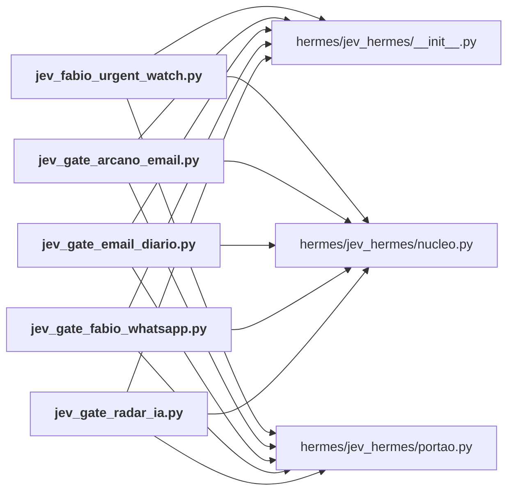

# hermes/portoes/

← [MAPA.md](../../MAPA.md) · pasta acima: [hermes](../../mapa/pastas/hermes.md) · abrir a pasta: [hermes/portoes/](../../hermes/portoes)

## Arquivos

| arquivo | tipo | tamanho | descrição |
|---|---|---:|---|
| [jev_fabio_urgent_watch.py](../../hermes/portoes/jev_fabio_urgent_watch.py) | código | 116 l. | Watchdog urgente de mensagens novas de Fábio Medina Osório (job 07bde220eec7, sem agente). |
| [jev_gate_arcano_email.py](../../hermes/portoes/jev_gate_arcano_email.py) | código | 76 l. | Porteiro do job ARCANO — e-mails de Fábio (6b539f9271ed), a cada 30 minutos. |
| [jev_gate_email_diario.py](../../hermes/portoes/jev_gate_email_diario.py) | código | 56 l. | Porteiro do job email-revisao-diaria-whatsapp (a3288e4d3f60), uma vez ao dia. |
| [jev_gate_fabio_whatsapp.py](../../hermes/portoes/jev_gate_fabio_whatsapp.py) | código | 108 l. | Porteiro do job Monitor Fábio Osório — WhatsApp pessoal (19fa0f01b2c5), 3 vezes ao dia. |
| [jev_gate_radar_ia.py](../../hermes/portoes/jev_gate_radar_ia.py) | código | 125 l. | Porteiro do job Radar e assimilação de IA (29f2c9f69bb3), uma vez ao dia. |

## Grafo de imports e links

Nós em negrito são desta pasta; setas cheias são imports, tracejadas são links de documento.

## Ligações e conteúdo de cada arquivo

### jev_fabio_urgent_watch.py

- **usa** — import: [`hermes/jev_hermes/__init__.py`](../../hermes/jev_hermes/__init__.py), [`hermes/jev_hermes/nucleo.py`](../../hermes/jev_hermes/nucleo.py), [`hermes/jev_hermes/portao.py`](../../hermes/jev_hermes/portao.py)
- **chama de outros arquivos** — [`nucleo.dec`](../../hermes/jev_hermes/nucleo.py#L459), [`nucleo.escolha`](../../hermes/jev_hermes/nucleo.py#L454), [`nucleo.perguntar`](../../hermes/jev_hermes/nucleo.py#L339), [`portao.registrar`](../../hermes/jev_hermes/portao.py#L30)
- **menciona 1 conceito** — [E1](../../mapa/conhecimento/experimentos.md#e1) (1×)
- **conteúdo** — [load_state](../../hermes/portoes/jev_fabio_urgent_watch.py#L50) (l. 50), [save_state](../../hermes/portoes/jev_fabio_urgent_watch.py#L57) (l. 57), [fmt_ts](../../hermes/portoes/jev_fabio_urgent_watch.py#L63) (l. 63), [main](../../hermes/portoes/jev_fabio_urgent_watch.py#L67) (l. 67)

### jev_gate_arcano_email.py

- **usa** — import: [`hermes/jev_hermes/__init__.py`](../../hermes/jev_hermes/__init__.py), [`hermes/jev_hermes/nucleo.py`](../../hermes/jev_hermes/nucleo.py), [`hermes/jev_hermes/portao.py`](../../hermes/jev_hermes/portao.py)
- **chama de outros arquivos** — [`nucleo.dec`](../../hermes/jev_hermes/nucleo.py#L459), [`nucleo.escolha`](../../hermes/jev_hermes/nucleo.py#L454), [`nucleo.perguntar`](../../hermes/jev_hermes/nucleo.py#L339), [`portao.encerrar`](../../hermes/jev_hermes/portao.py#L35), [`portao.executar`](../../hermes/jev_hermes/portao.py#L44), [`portao.gmail_cabecalhos`](../../hermes/jev_hermes/portao.py#L83), [`portao.gmail_listar`](../../hermes/jev_hermes/portao.py#L76)
- **conteúdo** — [main](../../hermes/portoes/jev_gate_arcano_email.py#L44) (l. 44)

### jev_gate_email_diario.py

- **usa** — import: [`hermes/jev_hermes/__init__.py`](../../hermes/jev_hermes/__init__.py), [`hermes/jev_hermes/nucleo.py`](../../hermes/jev_hermes/nucleo.py), [`hermes/jev_hermes/portao.py`](../../hermes/jev_hermes/portao.py)
- **chama de outros arquivos** — [`nucleo.classificar_em_paralelo`](../../hermes/jev_hermes/nucleo.py#L422), [`nucleo.dec`](../../hermes/jev_hermes/nucleo.py#L459), [`nucleo.escolha`](../../hermes/jev_hermes/nucleo.py#L454), [`nucleo.resumo_das_chamadas`](../../hermes/jev_hermes/nucleo.py#L440), [`portao.email_descartavel`](../../hermes/jev_hermes/portao.py#L126), [`portao.encerrar`](../../hermes/jev_hermes/portao.py#L35), [`portao.executar`](../../hermes/jev_hermes/portao.py#L44), [`portao.gmail_cabecalhos`](../../hermes/jev_hermes/portao.py#L83), [`portao.gmail_listar`](../../hermes/jev_hermes/portao.py#L76)
- **conteúdo** — [main](../../hermes/portoes/jev_gate_email_diario.py#L25) (l. 25)

### jev_gate_fabio_whatsapp.py

- **usa** — import: [`hermes/jev_hermes/__init__.py`](../../hermes/jev_hermes/__init__.py), [`hermes/jev_hermes/nucleo.py`](../../hermes/jev_hermes/nucleo.py), [`hermes/jev_hermes/portao.py`](../../hermes/jev_hermes/portao.py)
- **chama de outros arquivos** — [`nucleo.dec`](../../hermes/jev_hermes/nucleo.py#L459), [`nucleo.escolha`](../../hermes/jev_hermes/nucleo.py#L454), [`nucleo.perguntar`](../../hermes/jev_hermes/nucleo.py#L339), [`portao.encerrar`](../../hermes/jev_hermes/portao.py#L35), [`portao.executar`](../../hermes/jev_hermes/portao.py#L44), [`portao.json_da_saida`](../../hermes/jev_hermes/portao.py#L65), [`portao.rodar`](../../hermes/jev_hermes/portao.py#L57)
- **conteúdo** — [mensagens_novas](../../hermes/portoes/jev_gate_fabio_whatsapp.py#L52) (l. 52), [main](../../hermes/portoes/jev_gate_fabio_whatsapp.py#L62) (l. 62)

### jev_gate_radar_ia.py

- **usa** — import: [`hermes/jev_hermes/__init__.py`](../../hermes/jev_hermes/__init__.py), [`hermes/jev_hermes/nucleo.py`](../../hermes/jev_hermes/nucleo.py), [`hermes/jev_hermes/portao.py`](../../hermes/jev_hermes/portao.py)
- **chama de outros arquivos** — [`nucleo.classificar_em_paralelo`](../../hermes/jev_hermes/nucleo.py#L422), [`nucleo.escolha`](../../hermes/jev_hermes/nucleo.py#L454), [`nucleo.resumo_das_chamadas`](../../hermes/jev_hermes/nucleo.py#L440), [`portao.encerrar`](../../hermes/jev_hermes/portao.py#L35), [`portao.executar`](../../hermes/jev_hermes/portao.py#L44), [`portao.json_da_saida`](../../hermes/jev_hermes/portao.py#L65)
- **conteúdo** — [perguntas](../../hermes/portoes/jev_gate_radar_ia.py#L29) (l. 29), [descartar_todos](../../hermes/portoes/jev_gate_radar_ia.py#L51) (l. 51), [main](../../hermes/portoes/jev_gate_radar_ia.py#L70) (l. 70)
