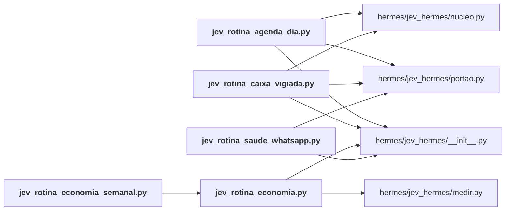

# hermes/rotinas/

← [MAPA.md](../../MAPA.md) · pasta acima: [hermes](../../mapa/pastas/hermes.md) · abrir a pasta: [hermes/rotinas/](../../hermes/rotinas)

## Arquivos

| arquivo | tipo | tamanho | descrição |
|---|---|---:|---|
| [jev_rotina_agenda_dia.py](../../hermes/rotinas/jev_rotina_agenda_dia.py) | código | 68 l. | Agenda do dia, às 7h, com o Jev marcando o que exige preparo. Sem modelo principal. |
| [jev_rotina_caixa_vigiada.py](../../hermes/rotinas/jev_rotina_caixa_vigiada.py) | código | 63 l. | Caixa vigiada pelo Jev: e-mail que pede atenção vira alerta no WhatsApp na hora. |
| [jev_rotina_economia.py](../../hermes/rotinas/jev_rotina_economia.py) | código | 29 l. | Medição do Jev no Hermes. `--gravar`: regrava o relatório local (diário, silencioso). `--semanal`: resumo curto para o WhatsApp (segundas às 8h05). Sem modelo… |
| [jev_rotina_economia_semanal.py](../../hermes/rotinas/jev_rotina_economia_semanal.py) | código | 11 l. | Resumo semanal da economia do Jev para o WhatsApp (segundas às 8h05). |
| [jev_rotina_saude_whatsapp.py](../../hermes/rotinas/jev_rotina_saude_whatsapp.py) | código | 48 l. | Saúde do coletor do WhatsApp pessoal, às 8h. Regra determinística: nada de modelo. |

## Grafo de imports e links

Nós em negrito são desta pasta; setas cheias são imports, tracejadas são links de documento.

## Ligações e conteúdo de cada arquivo

### jev_rotina_agenda_dia.py

- **usa** — import: [`hermes/jev_hermes/__init__.py`](../../hermes/jev_hermes/__init__.py), [`hermes/jev_hermes/nucleo.py`](../../hermes/jev_hermes/nucleo.py), [`hermes/jev_hermes/portao.py`](../../hermes/jev_hermes/portao.py)
- **chama de outros arquivos** — [`nucleo.classificar_em_paralelo`](../../hermes/jev_hermes/nucleo.py#L422), [`nucleo.escolha`](../../hermes/jev_hermes/nucleo.py#L454), [`nucleo.resumo_das_chamadas`](../../hermes/jev_hermes/nucleo.py#L440), [`portao.json_da_saida`](../../hermes/jev_hermes/portao.py#L65), [`portao.registrar`](../../hermes/jev_hermes/portao.py#L30), [`portao.rodar`](../../hermes/jev_hermes/portao.py#L57)
- **conteúdo** — [main](../../hermes/rotinas/jev_rotina_agenda_dia.py#L31) (l. 31)

### jev_rotina_caixa_vigiada.py

- **usa** — import: [`hermes/jev_hermes/__init__.py`](../../hermes/jev_hermes/__init__.py), [`hermes/jev_hermes/nucleo.py`](../../hermes/jev_hermes/nucleo.py), [`hermes/jev_hermes/portao.py`](../../hermes/jev_hermes/portao.py)
- **chama de outros arquivos** — [`nucleo.classificar_em_paralelo`](../../hermes/jev_hermes/nucleo.py#L422), [`nucleo.escolha`](../../hermes/jev_hermes/nucleo.py#L454), [`nucleo.resumo_das_chamadas`](../../hermes/jev_hermes/nucleo.py#L440), [`portao.email_descartavel`](../../hermes/jev_hermes/portao.py#L126), [`portao.gmail_cabecalhos`](../../hermes/jev_hermes/portao.py#L83), [`portao.gmail_listar`](../../hermes/jev_hermes/portao.py#L76), [`portao.probabilidade`](../../hermes/jev_hermes/portao.py#L120), [`portao.registrar`](../../hermes/jev_hermes/portao.py#L30)
- **conteúdo** — [main](../../hermes/rotinas/jev_rotina_caixa_vigiada.py#L29) (l. 29)

### jev_rotina_economia.py

- **usa** — import: [`hermes/jev_hermes/__init__.py`](../../hermes/jev_hermes/__init__.py), [`hermes/jev_hermes/medir.py`](../../hermes/jev_hermes/medir.py)
- **é usado por** — import: [`hermes/rotinas/jev_rotina_economia_semanal.py`](../../hermes/rotinas/jev_rotina_economia_semanal.py)
- **chama de outros arquivos** — [`medir.medir`](../../hermes/jev_hermes/medir.py#L52), [`medir.pagina`](../../hermes/jev_hermes/medir.py#L107)
- **conteúdo** — [main](../../hermes/rotinas/jev_rotina_economia.py#L10) (l. 10; usado em 1)

### jev_rotina_economia_semanal.py

- **usa** — import: [`hermes/rotinas/jev_rotina_economia.py`](../../hermes/rotinas/jev_rotina_economia.py)
- **chama de outros arquivos** — [`jev_rotina_economia.main`](../../hermes/rotinas/jev_rotina_economia.py#L10)

### jev_rotina_saude_whatsapp.py

- **usa** — import: [`hermes/jev_hermes/__init__.py`](../../hermes/jev_hermes/__init__.py), [`hermes/jev_hermes/portao.py`](../../hermes/jev_hermes/portao.py)
- **chama de outros arquivos** — [`portao.registrar`](../../hermes/jev_hermes/portao.py#L30)
- **conteúdo** — [main](../../hermes/rotinas/jev_rotina_saude_whatsapp.py#L22) (l. 22)
