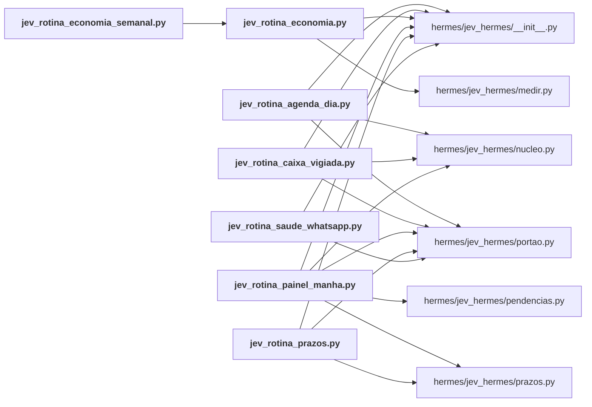

# hermes/rotinas/

← [MAPA.md](../../MAPA.md) · pasta acima: [hermes](../../mapa/pastas/hermes.md) · abrir a pasta: [hermes/rotinas/](../../hermes/rotinas)

## Arquivos

| arquivo | tipo | tamanho | descrição |
|---|---|---:|---|
| [jev_reiniciar_ocioso.py](../../hermes/rotinas/jev_reiniciar_ocioso.py) | código | 20 l. | Reinicia o hermes-gateway só quando Igor está ocioso há 15 min (carrega o plugin novo). |
| [jev_rotina_agenda_dia.py](../../hermes/rotinas/jev_rotina_agenda_dia.py) | código | 68 l. | Agenda do dia, às 7h, com o Jev marcando o que exige preparo. Sem modelo principal. |
| [jev_rotina_caixa_vigiada.py](../../hermes/rotinas/jev_rotina_caixa_vigiada.py) | código | 63 l. | Caixa vigiada pelo Jev: e-mail que pede atenção vira alerta no WhatsApp na hora. |
| [jev_rotina_economia.py](../../hermes/rotinas/jev_rotina_economia.py) | código | 29 l. | Medição do Jev no Hermes. `--gravar`: regrava o relatório local (diário, silencioso). `--semanal`: resumo curto para o WhatsApp (segundas às 8h05). Sem modelo… |
| [jev_rotina_economia_semanal.py](../../hermes/rotinas/jev_rotina_economia_semanal.py) | código | 11 l. | Resumo semanal da economia do Jev para o WhatsApp (segundas às 8h05). |
| [jev_rotina_painel_manha.py](../../hermes/rotinas/jev_rotina_painel_manha.py) | código | 192 l. | Painel da manhã, às 7h: uma prioridade, o próximo gesto e a agenda. Sem modelo principal. |
| [jev_rotina_prazos.py](../../hermes/rotinas/jev_rotina_prazos.py) | código | 42 l. | Controle de prazos por e-mail, a cada 2 horas das 7h às 21h. Sem modelo principal. |
| [jev_rotina_saude_whatsapp.py](../../hermes/rotinas/jev_rotina_saude_whatsapp.py) | código | 48 l. | Saúde do coletor do WhatsApp pessoal, às 8h. Regra determinística: nada de modelo. |

## Grafo de imports e links

Nós em negrito são desta pasta; setas cheias são imports, tracejadas são links de documento.

## Ligações e conteúdo de cada arquivo

### jev_reiniciar_ocioso.py

- **parecidos (julgados pelo Jev)** — [`hermes/jev_hermes/__init__.py`](../../hermes/jev_hermes/__init__.py) (não julgado, 0.26), [`hermes/jev_hermes/pendencias.py`](../../hermes/jev_hermes/pendencias.py) (não julgado, 0.25), [`hermes/plugin/jev-advisor/__init__.py`](../../hermes/plugin/jev-advisor/__init__.py) (não julgado, 0.24)
- **conteúdo** — [log](../../hermes/rotinas/jev_reiniciar_ocioso.py#L5) (l. 5)

### jev_rotina_agenda_dia.py

- **usa** — import: [`hermes/jev_hermes/__init__.py`](../../hermes/jev_hermes/__init__.py), [`hermes/jev_hermes/nucleo.py`](../../hermes/jev_hermes/nucleo.py), [`hermes/jev_hermes/portao.py`](../../hermes/jev_hermes/portao.py)
- **chama de outros arquivos** — [`nucleo.classificar_em_paralelo`](../../hermes/jev_hermes/nucleo.py#L447), [`nucleo.escolha`](../../hermes/jev_hermes/nucleo.py#L479), [`nucleo.resumo_das_chamadas`](../../hermes/jev_hermes/nucleo.py#L465), [`portao.json_da_saida`](../../hermes/jev_hermes/portao.py#L65), [`portao.registrar`](../../hermes/jev_hermes/portao.py#L30), [`portao.rodar`](../../hermes/jev_hermes/portao.py#L57)
- **parecidos (julgados pelo Jev)** — [`hermes/rotinas/jev_rotina_painel_manha.py`](../../hermes/rotinas/jev_rotina_painel_manha.py) (complementar, 0.28), [`hermes/rotinas/jev_rotina_prazos.py`](../../hermes/rotinas/jev_rotina_prazos.py) (não julgado, 0.24)
- **conteúdo** — [main](../../hermes/rotinas/jev_rotina_agenda_dia.py#L31) (l. 31)

### jev_rotina_caixa_vigiada.py

- **usa** — import: [`hermes/jev_hermes/__init__.py`](../../hermes/jev_hermes/__init__.py), [`hermes/jev_hermes/nucleo.py`](../../hermes/jev_hermes/nucleo.py), [`hermes/jev_hermes/portao.py`](../../hermes/jev_hermes/portao.py)
- **chama de outros arquivos** — [`nucleo.classificar_em_paralelo`](../../hermes/jev_hermes/nucleo.py#L447), [`nucleo.escolha`](../../hermes/jev_hermes/nucleo.py#L479), [`nucleo.resumo_das_chamadas`](../../hermes/jev_hermes/nucleo.py#L465), [`portao.email_descartavel`](../../hermes/jev_hermes/portao.py#L126), [`portao.gmail_cabecalhos`](../../hermes/jev_hermes/portao.py#L83), [`portao.gmail_listar`](../../hermes/jev_hermes/portao.py#L76), [`portao.probabilidade`](../../hermes/jev_hermes/portao.py#L120), [`portao.registrar`](../../hermes/jev_hermes/portao.py#L30)
- **parecidos (julgados pelo Jev)** — [`hermes/rotinas/jev_rotina_prazos.py`](../../hermes/rotinas/jev_rotina_prazos.py) (não julgado, 0.40), [`hermes/portoes/jev_gate_arcano_email.py`](../../hermes/portoes/jev_gate_arcano_email.py) (complementar, 0.23)
- **conteúdo** — [main](../../hermes/rotinas/jev_rotina_caixa_vigiada.py#L29) (l. 29)

### jev_rotina_economia.py

- **usa** — import: [`hermes/jev_hermes/__init__.py`](../../hermes/jev_hermes/__init__.py), [`hermes/jev_hermes/medir.py`](../../hermes/jev_hermes/medir.py)
- **é usado por** — import: [`hermes/rotinas/jev_rotina_economia_semanal.py`](../../hermes/rotinas/jev_rotina_economia_semanal.py)
- **chama de outros arquivos** — [`medir.medir`](../../hermes/jev_hermes/medir.py#L63), [`medir.pagina`](../../hermes/jev_hermes/medir.py#L118)
- **parecidos (julgados pelo Jev)** — [`hermes/portoes/jev_gate_sono_memoria.py`](../../hermes/portoes/jev_gate_sono_memoria.py) (complementar, 0.33), [`hermes/rotinas/jev_rotina_saude_whatsapp.py`](../../hermes/rotinas/jev_rotina_saude_whatsapp.py) (complementar, 0.23)
- **conteúdo** — [main](../../hermes/rotinas/jev_rotina_economia.py#L10) (l. 10; usado em 1)

### jev_rotina_economia_semanal.py

- **usa** — import: [`hermes/rotinas/jev_rotina_economia.py`](../../hermes/rotinas/jev_rotina_economia.py)
- **chama de outros arquivos** — [`jev_rotina_economia.main`](../../hermes/rotinas/jev_rotina_economia.py#L10)

### jev_rotina_painel_manha.py

- **usa** — import: [`hermes/jev_hermes/__init__.py`](../../hermes/jev_hermes/__init__.py), [`hermes/jev_hermes/nucleo.py`](../../hermes/jev_hermes/nucleo.py), [`hermes/jev_hermes/pendencias.py`](../../hermes/jev_hermes/pendencias.py), [`hermes/jev_hermes/portao.py`](../../hermes/jev_hermes/portao.py), [`hermes/jev_hermes/prazos.py`](../../hermes/jev_hermes/prazos.py)
- **chama de outros arquivos** — [`nucleo.classificar_em_paralelo`](../../hermes/jev_hermes/nucleo.py#L447), [`nucleo.resumo_das_chamadas`](../../hermes/jev_hermes/nucleo.py#L465), [`pendencias.esperando_igor`](../../hermes/jev_hermes/pendencias.py#L120), [`pendencias.promessas_abertas`](../../hermes/jev_hermes/pendencias.py#L148), [`portao.json_da_saida`](../../hermes/jev_hermes/portao.py#L65), [`portao.registrar`](../../hermes/jev_hermes/portao.py#L30), [`portao.rodar`](../../hermes/jev_hermes/portao.py#L57), [`prazos.em_aberto`](../../hermes/jev_hermes/prazos.py#L382)
- **parecidos (julgados pelo Jev)** — [`hermes/rotinas/jev_rotina_prazos.py`](../../hermes/rotinas/jev_rotina_prazos.py) (não julgado, 0.34), [`hermes/rotinas/jev_rotina_agenda_dia.py`](../../hermes/rotinas/jev_rotina_agenda_dia.py) (complementar, 0.28)
- **conteúdo** — [compromissos](../../hermes/rotinas/jev_rotina_painel_manha.py#L34) (l. 34), [encerrados](../../hermes/rotinas/jev_rotina_painel_manha.py#L55) (l. 55), [sem_os_encerrados](../../hermes/rotinas/jev_rotina_painel_manha.py#L63) (l. 63), [demandas](../../hermes/rotinas/jev_rotina_painel_manha.py#L87) (l. 87), [whatsapp](../../hermes/rotinas/jev_rotina_painel_manha.py#L109) (l. 109), [prazos_abertos](../../hermes/rotinas/jev_rotina_painel_manha.py#L125) (l. 125), [main](../../hermes/rotinas/jev_rotina_painel_manha.py#L139) (l. 139)

### jev_rotina_prazos.py

- **usa** — import: [`hermes/jev_hermes/__init__.py`](../../hermes/jev_hermes/__init__.py), [`hermes/jev_hermes/portao.py`](../../hermes/jev_hermes/portao.py), [`hermes/jev_hermes/prazos.py`](../../hermes/jev_hermes/prazos.py)
- **chama de outros arquivos** — [`portao.registrar`](../../hermes/jev_hermes/portao.py#L30), [`prazos.atualizar`](../../hermes/jev_hermes/prazos.py#L310), [`prazos.em_aberto`](../../hermes/jev_hermes/prazos.py#L382), [`prazos.linha_do_prazo`](../../hermes/jev_hermes/prazos.py#L391)
- **parecidos (julgados pelo Jev)** — [`hermes/rotinas/jev_rotina_caixa_vigiada.py`](../../hermes/rotinas/jev_rotina_caixa_vigiada.py) (não julgado, 0.40), [`hermes/rotinas/jev_rotina_painel_manha.py`](../../hermes/rotinas/jev_rotina_painel_manha.py) (não julgado, 0.34), [`hermes/portoes/jev_gate_arcano_email.py`](../../hermes/portoes/jev_gate_arcano_email.py) (não julgado, 0.25), [`hermes/rotinas/jev_rotina_agenda_dia.py`](../../hermes/rotinas/jev_rotina_agenda_dia.py) (não julgado, 0.24)
- **conteúdo** — [main](../../hermes/rotinas/jev_rotina_prazos.py#L17) (l. 17)

### jev_rotina_saude_whatsapp.py

- **usa** — import: [`hermes/jev_hermes/__init__.py`](../../hermes/jev_hermes/__init__.py), [`hermes/jev_hermes/portao.py`](../../hermes/jev_hermes/portao.py)
- **chama de outros arquivos** — [`portao.registrar`](../../hermes/jev_hermes/portao.py#L30)
- **parecidos (julgados pelo Jev)** — [`hermes/jev_hermes/pendencias.py`](../../hermes/jev_hermes/pendencias.py) (complementar, 0.29), [`hermes/portoes/jev_gate_fabio_whatsapp.py`](../../hermes/portoes/jev_gate_fabio_whatsapp.py) (complementar, 0.27), [`hermes/portoes/jev_gate_boletim_taguatinga.py`](../../hermes/portoes/jev_gate_boletim_taguatinga.py) (não julgado, 0.26), [`hermes/rotinas/jev_rotina_economia.py`](../../hermes/rotinas/jev_rotina_economia.py) (complementar, 0.23)
- **conteúdo** — [main](../../hermes/rotinas/jev_rotina_saude_whatsapp.py#L22) (l. 22)
