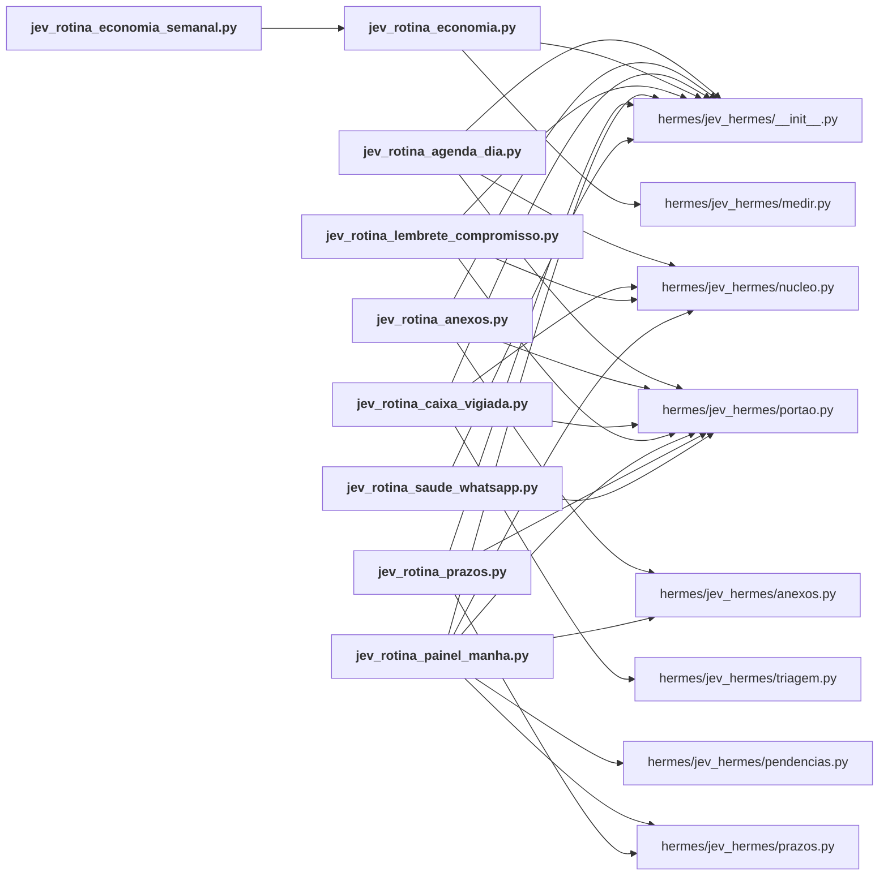

# hermes/rotinas/

← [MAPA.md](../../MAPA.md) · pasta acima: [hermes](../../mapa/pastas/hermes.md) · abrir a pasta: [hermes/rotinas/](../../hermes/rotinas)

## Arquivos

| arquivo | tipo | tamanho | descrição |
|---|---|---:|---|
| [jev_comparar_job.py](../../hermes/rotinas/jev_comparar_job.py) | código | 81 l. | Compara as execuções de um job de cron antes e depois de ganhar porteiro. |
| [jev_observar_porteiros.py](../../hermes/rotinas/jev_observar_porteiros.py) | código | 82 l. | Observa as primeiras execuções agendadas dos porteiros novos e escreve o que o agente fez. |
| [jev_reiniciar_ocioso.py](../../hermes/rotinas/jev_reiniciar_ocioso.py) | código | 20 l. | Reinicia o hermes-gateway só quando Igor está ocioso há 15 min (carrega o plugin novo). |
| [jev_rotina_agenda_dia.py](../../hermes/rotinas/jev_rotina_agenda_dia.py) | código | 68 l. | Agenda do dia, às 7h, com o Jev marcando o que exige preparo. Sem modelo principal. |
| [jev_rotina_anexos.py](../../hermes/rotinas/jev_rotina_anexos.py) | código | 33 l. | Triagem de anexo recebido, duas vezes por dia (8h e 15h). Sem modelo principal. |
| [jev_rotina_caixa_vigiada.py](../../hermes/rotinas/jev_rotina_caixa_vigiada.py) | código | 87 l. | Caixa vigiada pelo Jev: e-mail que pede atenção vira alerta no WhatsApp na hora. |
| [jev_rotina_economia.py](../../hermes/rotinas/jev_rotina_economia.py) | código | 31 l. | Medição do Jev no Hermes. `--gravar`: regrava o relatório local (diário, silencioso). `--semanal`: resumo curto para o WhatsApp (segundas às 8h05). Sem modelo… |
| [jev_rotina_economia_semanal.py](../../hermes/rotinas/jev_rotina_economia_semanal.py) | código | 11 l. | Resumo semanal da economia do Jev para o WhatsApp (segundas às 8h05). |
| [jev_rotina_lembrete_compromisso.py](../../hermes/rotinas/jev_rotina_lembrete_compromisso.py) | código | 113 l. | Lembrete de compromisso: aviso no WhatsApp cerca de uma hora antes, sem acordar modelo. |
| [jev_rotina_painel_manha.py](../../hermes/rotinas/jev_rotina_painel_manha.py) | código | 209 l. | Painel da manhã, às 7h: uma prioridade, o próximo gesto e a agenda. Sem modelo principal. |
| [jev_rotina_prazos.py](../../hermes/rotinas/jev_rotina_prazos.py) | código | 42 l. | Controle de prazos por e-mail, a cada 2 horas das 7h às 21h. Sem modelo principal. |
| [jev_rotina_saude_whatsapp.py](../../hermes/rotinas/jev_rotina_saude_whatsapp.py) | código | 48 l. | Saúde do coletor do WhatsApp pessoal, às 8h. Regra determinística: nada de modelo. |

## Grafo de imports e links

Nós em negrito são desta pasta; setas cheias são imports, tracejadas são links de documento.

```mermaid
flowchart LR
  n_hermes_jev_hermes___init___py["hermes/jev_hermes/__init__.py"]
  n_hermes_jev_hermes_anexos_py["hermes/jev_hermes/anexos.py"]
  n_hermes_jev_hermes_medir_py["hermes/jev_hermes/medir.py"]
  n_hermes_jev_hermes_nucleo_py["hermes/jev_hermes/nucleo.py"]
  n_hermes_jev_hermes_pendencias_py["hermes/jev_hermes/pendencias.py"]
  n_hermes_jev_hermes_portao_py["hermes/jev_hermes/portao.py"]
  n_hermes_jev_hermes_prazos_py["hermes/jev_hermes/prazos.py"]
  n_hermes_jev_hermes_triagem_py["hermes/jev_hermes/triagem.py"]
  n_hermes_rotinas_jev_rotina_agenda_dia_py["<b>jev_rotina_agenda_dia.py</b>"]
  n_hermes_rotinas_jev_rotina_anexos_py["<b>jev_rotina_anexos.py</b>"]
  n_hermes_rotinas_jev_rotina_caixa_vigiada_py["<b>jev_rotina_caixa_vigiada.py</b>"]
  n_hermes_rotinas_jev_rotina_economia_py["<b>jev_rotina_economia.py</b>"]
  n_hermes_rotinas_jev_rotina_economia_semanal_py["<b>jev_rotina_economia_semanal.py</b>"]
  n_hermes_rotinas_jev_rotina_lembrete_compromisso_py["<b>jev_rotina_lembrete_compromisso.py</b>"]
  n_hermes_rotinas_jev_rotina_painel_manha_py["<b>jev_rotina_painel_manha.py</b>"]
  n_hermes_rotinas_jev_rotina_prazos_py["<b>jev_rotina_prazos.py</b>"]
  n_hermes_rotinas_jev_rotina_saude_whatsapp_py["<b>jev_rotina_saude_whatsapp.py</b>"]
  n_hermes_rotinas_jev_rotina_agenda_dia_py --> n_hermes_jev_hermes___init___py
  n_hermes_rotinas_jev_rotina_agenda_dia_py --> n_hermes_jev_hermes_nucleo_py
  n_hermes_rotinas_jev_rotina_agenda_dia_py --> n_hermes_jev_hermes_portao_py
  n_hermes_rotinas_jev_rotina_anexos_py --> n_hermes_jev_hermes___init___py
  n_hermes_rotinas_jev_rotina_anexos_py --> n_hermes_jev_hermes_anexos_py
  n_hermes_rotinas_jev_rotina_anexos_py --> n_hermes_jev_hermes_portao_py
  n_hermes_rotinas_jev_rotina_caixa_vigiada_py --> n_hermes_jev_hermes___init___py
  n_hermes_rotinas_jev_rotina_caixa_vigiada_py --> n_hermes_jev_hermes_nucleo_py
  n_hermes_rotinas_jev_rotina_caixa_vigiada_py --> n_hermes_jev_hermes_portao_py
  n_hermes_rotinas_jev_rotina_caixa_vigiada_py --> n_hermes_jev_hermes_triagem_py
  n_hermes_rotinas_jev_rotina_economia_py --> n_hermes_jev_hermes___init___py
  n_hermes_rotinas_jev_rotina_economia_py --> n_hermes_jev_hermes_medir_py
  n_hermes_rotinas_jev_rotina_economia_semanal_py --> n_hermes_rotinas_jev_rotina_economia_py
  n_hermes_rotinas_jev_rotina_lembrete_compromisso_py --> n_hermes_jev_hermes___init___py
  n_hermes_rotinas_jev_rotina_lembrete_compromisso_py --> n_hermes_jev_hermes_nucleo_py
  n_hermes_rotinas_jev_rotina_lembrete_compromisso_py --> n_hermes_jev_hermes_portao_py
  n_hermes_rotinas_jev_rotina_painel_manha_py --> n_hermes_jev_hermes___init___py
  n_hermes_rotinas_jev_rotina_painel_manha_py --> n_hermes_jev_hermes_anexos_py
  n_hermes_rotinas_jev_rotina_painel_manha_py --> n_hermes_jev_hermes_nucleo_py
  n_hermes_rotinas_jev_rotina_painel_manha_py --> n_hermes_jev_hermes_pendencias_py
  n_hermes_rotinas_jev_rotina_painel_manha_py --> n_hermes_jev_hermes_portao_py
  n_hermes_rotinas_jev_rotina_painel_manha_py --> n_hermes_jev_hermes_prazos_py
  n_hermes_rotinas_jev_rotina_prazos_py --> n_hermes_jev_hermes___init___py
  n_hermes_rotinas_jev_rotina_prazos_py --> n_hermes_jev_hermes_portao_py
  n_hermes_rotinas_jev_rotina_prazos_py --> n_hermes_jev_hermes_prazos_py
  n_hermes_rotinas_jev_rotina_saude_whatsapp_py --> n_hermes_jev_hermes___init___py
  n_hermes_rotinas_jev_rotina_saude_whatsapp_py --> n_hermes_jev_hermes_portao_py
```

## Ligações e conteúdo de cada arquivo

### jev_comparar_job.py

- **parecidos (julgados pelo Jev)** — [`hermes/portoes/jev_gate_boletim_taguatinga.py`](../../hermes/portoes/jev_gate_boletim_taguatinga.py) (não julgado, 0.34), [`hermes/portoes/jev_gate_radar_tematico.py`](../../hermes/portoes/jev_gate_radar_tematico.py) (não julgado, 0.33), [`hermes/portoes/jev_gate_tese_diaria.py`](../../hermes/portoes/jev_gate_tese_diaria.py) (não julgado, 0.31), [`hermes/portoes/jev_gate_arcano_email.py`](../../hermes/portoes/jev_gate_arcano_email.py) (não julgado, 0.30), [`hermes/jev_hermes/__init__.py`](../../hermes/jev_hermes/__init__.py) (não julgado, 0.28), [`hermes/jev_hermes/portao.py`](../../hermes/jev_hermes/portao.py) (não julgado, 0.25)
- **conteúdo** — [sessoes](../../hermes/rotinas/jev_comparar_job.py#L22) (l. 22), [main](../../hermes/rotinas/jev_comparar_job.py#L51) (l. 51)

### jev_observar_porteiros.py

- **parecidos (julgados pelo Jev)** — [`hermes/portoes/jev_gate_sono_memoria.py`](../../hermes/portoes/jev_gate_sono_memoria.py) (não julgado, 0.21)
- **conteúdo** — [portoes](../../hermes/rotinas/jev_observar_porteiros.py#L22) (l. 22), [ultima_saida](../../hermes/rotinas/jev_observar_porteiros.py#L35) (l. 35), [relatar](../../hermes/rotinas/jev_observar_porteiros.py#L41) (l. 41), [main](../../hermes/rotinas/jev_observar_porteiros.py#L57) (l. 57)

### jev_reiniciar_ocioso.py

- **parecidos (julgados pelo Jev)** — [`hermes/jev_hermes/__init__.py`](../../hermes/jev_hermes/__init__.py) (não julgado, 0.26), [`hermes/jev_hermes/pendencias.py`](../../hermes/jev_hermes/pendencias.py) (não julgado, 0.25), [`hermes/plugin/jev-advisor/__init__.py`](../../hermes/plugin/jev-advisor/__init__.py) (não julgado, 0.22)
- **conteúdo** — [log](../../hermes/rotinas/jev_reiniciar_ocioso.py#L5) (l. 5)

### jev_rotina_agenda_dia.py

- **usa** — import: [`hermes/jev_hermes/__init__.py`](../../hermes/jev_hermes/__init__.py), [`hermes/jev_hermes/nucleo.py`](../../hermes/jev_hermes/nucleo.py), [`hermes/jev_hermes/portao.py`](../../hermes/jev_hermes/portao.py)
- **chama de outros arquivos** — [`nucleo.classificar_em_paralelo`](../../hermes/jev_hermes/nucleo.py#L447), [`nucleo.escolha`](../../hermes/jev_hermes/nucleo.py#L479), [`nucleo.resumo_das_chamadas`](../../hermes/jev_hermes/nucleo.py#L465), [`portao.json_da_saida`](../../hermes/jev_hermes/portao.py#L65), [`portao.registrar`](../../hermes/jev_hermes/portao.py#L30), [`portao.rodar`](../../hermes/jev_hermes/portao.py#L57)
- **parecidos (julgados pelo Jev)** — [`hermes/rotinas/jev_rotina_anexos.py`](../../hermes/rotinas/jev_rotina_anexos.py) (não julgado, 0.34), [`hermes/rotinas/jev_rotina_painel_manha.py`](../../hermes/rotinas/jev_rotina_painel_manha.py) (complementar, 0.27), [`hermes/rotinas/jev_rotina_prazos.py`](../../hermes/rotinas/jev_rotina_prazos.py) (não julgado, 0.24)
- **conteúdo** — [main](../../hermes/rotinas/jev_rotina_agenda_dia.py#L31) (l. 31)

### jev_rotina_anexos.py

- **usa** — import: [`hermes/jev_hermes/__init__.py`](../../hermes/jev_hermes/__init__.py), [`hermes/jev_hermes/anexos.py`](../../hermes/jev_hermes/anexos.py), [`hermes/jev_hermes/portao.py`](../../hermes/jev_hermes/portao.py)
- **chama de outros arquivos** — [`anexos.atualizar`](../../hermes/jev_hermes/anexos.py#L145), [`portao.registrar`](../../hermes/jev_hermes/portao.py#L30)
- **parecidos (julgados pelo Jev)** — [`hermes/rotinas/jev_rotina_agenda_dia.py`](../../hermes/rotinas/jev_rotina_agenda_dia.py) (não julgado, 0.34), [`hermes/rotinas/jev_rotina_painel_manha.py`](../../hermes/rotinas/jev_rotina_painel_manha.py) (não julgado, 0.30), [`hermes/rotinas/jev_rotina_prazos.py`](../../hermes/rotinas/jev_rotina_prazos.py) (não julgado, 0.24), [`hermes/portoes/jev_gate_fabio_whatsapp.py`](../../hermes/portoes/jev_gate_fabio_whatsapp.py) (não julgado, 0.23)
- **conteúdo** — [main](../../hermes/rotinas/jev_rotina_anexos.py#L17) (l. 17)

### jev_rotina_caixa_vigiada.py

- **usa** — import: [`hermes/jev_hermes/__init__.py`](../../hermes/jev_hermes/__init__.py), [`hermes/jev_hermes/nucleo.py`](../../hermes/jev_hermes/nucleo.py), [`hermes/jev_hermes/portao.py`](../../hermes/jev_hermes/portao.py), [`hermes/jev_hermes/triagem.py`](../../hermes/jev_hermes/triagem.py)
- **chama de outros arquivos** — [`nucleo.classificar_em_paralelo`](../../hermes/jev_hermes/nucleo.py#L447), [`nucleo.escolha`](../../hermes/jev_hermes/nucleo.py#L479), [`nucleo.resumo_das_chamadas`](../../hermes/jev_hermes/nucleo.py#L465), [`portao.email_descartavel`](../../hermes/jev_hermes/portao.py#L126), [`portao.gmail_cabecalhos`](../../hermes/jev_hermes/portao.py#L83), [`portao.gmail_listar`](../../hermes/jev_hermes/portao.py#L76), [`portao.probabilidade`](../../hermes/jev_hermes/portao.py#L120), [`portao.registrar`](../../hermes/jev_hermes/portao.py#L30), [`triagem.acompanhamentos_vencidos`](../../hermes/jev_hermes/triagem.py#L118), [`triagem.despachar`](../../hermes/jev_hermes/triagem.py#L140)
- **parecidos (julgados pelo Jev)** — [`hermes/rotinas/jev_rotina_prazos.py`](../../hermes/rotinas/jev_rotina_prazos.py) (não julgado, 0.39), [`hermes/rotinas/jev_rotina_lembrete_compromisso.py`](../../hermes/rotinas/jev_rotina_lembrete_compromisso.py) (não julgado, 0.26), [`hermes/portoes/jev_gate_arcano_email.py`](../../hermes/portoes/jev_gate_arcano_email.py) (complementar, 0.23)
- **conteúdo** — [main](../../hermes/rotinas/jev_rotina_caixa_vigiada.py#L33) (l. 33)

### jev_rotina_economia.py

- **usa** — import: [`hermes/jev_hermes/__init__.py`](../../hermes/jev_hermes/__init__.py), [`hermes/jev_hermes/medir.py`](../../hermes/jev_hermes/medir.py)
- **é usado por** — import: [`hermes/rotinas/jev_rotina_economia_semanal.py`](../../hermes/rotinas/jev_rotina_economia_semanal.py)
- **chama de outros arquivos** — [`medir.medir`](../../hermes/jev_hermes/medir.py#L122), [`medir.mil`](../../hermes/jev_hermes/medir.py#L209), [`medir.pagina`](../../hermes/jev_hermes/medir.py#L225)
- **parecidos (julgados pelo Jev)** — [`hermes/portoes/jev_gate_sono_memoria.py`](../../hermes/portoes/jev_gate_sono_memoria.py) (complementar, 0.32), [`hermes/rotinas/jev_rotina_saude_whatsapp.py`](../../hermes/rotinas/jev_rotina_saude_whatsapp.py) (complementar, 0.23)
- **conteúdo** — [main](../../hermes/rotinas/jev_rotina_economia.py#L10) (l. 10; usado em 1)

### jev_rotina_economia_semanal.py

- **usa** — import: [`hermes/rotinas/jev_rotina_economia.py`](../../hermes/rotinas/jev_rotina_economia.py)
- **chama de outros arquivos** — [`jev_rotina_economia.main`](../../hermes/rotinas/jev_rotina_economia.py#L10)

### jev_rotina_lembrete_compromisso.py

- **usa** — import: [`hermes/jev_hermes/__init__.py`](../../hermes/jev_hermes/__init__.py), [`hermes/jev_hermes/nucleo.py`](../../hermes/jev_hermes/nucleo.py), [`hermes/jev_hermes/portao.py`](../../hermes/jev_hermes/portao.py)
- **é usado por** — citação: [`hermes/tests/test_fluxos.py`](../../hermes/tests/test_fluxos.py)
- **chama de outros arquivos** — [`nucleo.classificar_em_paralelo`](../../hermes/jev_hermes/nucleo.py#L447), [`nucleo.escolha`](../../hermes/jev_hermes/nucleo.py#L479), [`nucleo.resumo_das_chamadas`](../../hermes/jev_hermes/nucleo.py#L465), [`portao.json_da_saida`](../../hermes/jev_hermes/portao.py#L65), [`portao.registrar`](../../hermes/jev_hermes/portao.py#L30), [`portao.rodar`](../../hermes/jev_hermes/portao.py#L57)
- **parecidos (julgados pelo Jev)** — [`hermes/rotinas/jev_rotina_painel_manha.py`](../../hermes/rotinas/jev_rotina_painel_manha.py) (não julgado, 0.28), [`hermes/rotinas/jev_rotina_caixa_vigiada.py`](../../hermes/rotinas/jev_rotina_caixa_vigiada.py) (não julgado, 0.26), [Q096](../../mapa/conhecimento/perguntas.md#q096) (não julgado, 0.23), [Q093](../../mapa/conhecimento/perguntas.md#q093) (não julgado, 0.21)
- **conteúdo** — [proximos](../../hermes/rotinas/jev_rotina_lembrete_compromisso.py#L43) (l. 43), [linha](../../hermes/rotinas/jev_rotina_lembrete_compromisso.py#L64) (l. 64), [decidir](../../hermes/rotinas/jev_rotina_lembrete_compromisso.py#L76) (l. 76), [main](../../hermes/rotinas/jev_rotina_lembrete_compromisso.py#L89) (l. 89)

### jev_rotina_painel_manha.py

- **usa** — import: [`hermes/jev_hermes/__init__.py`](../../hermes/jev_hermes/__init__.py), [`hermes/jev_hermes/anexos.py`](../../hermes/jev_hermes/anexos.py), [`hermes/jev_hermes/nucleo.py`](../../hermes/jev_hermes/nucleo.py), [`hermes/jev_hermes/pendencias.py`](../../hermes/jev_hermes/pendencias.py), [`hermes/jev_hermes/portao.py`](../../hermes/jev_hermes/portao.py), [`hermes/jev_hermes/prazos.py`](../../hermes/jev_hermes/prazos.py)
- **chama de outros arquivos** — [`anexos.em_aberto`](../../hermes/jev_hermes/anexos.py#L194), [`nucleo.classificar_em_paralelo`](../../hermes/jev_hermes/nucleo.py#L447), [`nucleo.resumo_das_chamadas`](../../hermes/jev_hermes/nucleo.py#L465), [`pendencias.esperando_igor`](../../hermes/jev_hermes/pendencias.py#L120), [`pendencias.promessas_abertas`](../../hermes/jev_hermes/pendencias.py#L148), [`portao.json_da_saida`](../../hermes/jev_hermes/portao.py#L65), [`portao.registrar`](../../hermes/jev_hermes/portao.py#L30), [`portao.rodar`](../../hermes/jev_hermes/portao.py#L57), [`prazos.em_aberto`](../../hermes/jev_hermes/prazos.py#L381)
- **parecidos (julgados pelo Jev)** — [`hermes/rotinas/jev_rotina_prazos.py`](../../hermes/rotinas/jev_rotina_prazos.py) (não julgado, 0.33), [`hermes/rotinas/jev_rotina_anexos.py`](../../hermes/rotinas/jev_rotina_anexos.py) (não julgado, 0.30), [`hermes/rotinas/jev_rotina_lembrete_compromisso.py`](../../hermes/rotinas/jev_rotina_lembrete_compromisso.py) (não julgado, 0.28), [`hermes/rotinas/jev_rotina_agenda_dia.py`](../../hermes/rotinas/jev_rotina_agenda_dia.py) (complementar, 0.27)
- **conteúdo** — [compromissos](../../hermes/rotinas/jev_rotina_painel_manha.py#L34) (l. 34), [encerrados](../../hermes/rotinas/jev_rotina_painel_manha.py#L55) (l. 55), [sem_os_encerrados](../../hermes/rotinas/jev_rotina_painel_manha.py#L63) (l. 63), [demandas](../../hermes/rotinas/jev_rotina_painel_manha.py#L87) (l. 87), [whatsapp](../../hermes/rotinas/jev_rotina_painel_manha.py#L109) (l. 109), [prazos_abertos](../../hermes/rotinas/jev_rotina_painel_manha.py#L125) (l. 125), [anexos_vermelhos](../../hermes/rotinas/jev_rotina_painel_manha.py#L139) (l. 139), [main](../../hermes/rotinas/jev_rotina_painel_manha.py#L152) (l. 152)

### jev_rotina_prazos.py

- **usa** — import: [`hermes/jev_hermes/__init__.py`](../../hermes/jev_hermes/__init__.py), [`hermes/jev_hermes/portao.py`](../../hermes/jev_hermes/portao.py), [`hermes/jev_hermes/prazos.py`](../../hermes/jev_hermes/prazos.py)
- **chama de outros arquivos** — [`portao.registrar`](../../hermes/jev_hermes/portao.py#L30), [`prazos.atualizar`](../../hermes/jev_hermes/prazos.py#L309), [`prazos.em_aberto`](../../hermes/jev_hermes/prazos.py#L381), [`prazos.linha_do_prazo`](../../hermes/jev_hermes/prazos.py#L390)
- **parecidos (julgados pelo Jev)** — [`hermes/rotinas/jev_rotina_caixa_vigiada.py`](../../hermes/rotinas/jev_rotina_caixa_vigiada.py) (não julgado, 0.39), [`hermes/rotinas/jev_rotina_painel_manha.py`](../../hermes/rotinas/jev_rotina_painel_manha.py) (não julgado, 0.33), [`hermes/portoes/jev_gate_arcano_email.py`](../../hermes/portoes/jev_gate_arcano_email.py) (não julgado, 0.25), [`hermes/rotinas/jev_rotina_anexos.py`](../../hermes/rotinas/jev_rotina_anexos.py) (não julgado, 0.24), [`hermes/rotinas/jev_rotina_agenda_dia.py`](../../hermes/rotinas/jev_rotina_agenda_dia.py) (não julgado, 0.24)
- **conteúdo** — [main](../../hermes/rotinas/jev_rotina_prazos.py#L17) (l. 17)

### jev_rotina_saude_whatsapp.py

- **usa** — import: [`hermes/jev_hermes/__init__.py`](../../hermes/jev_hermes/__init__.py), [`hermes/jev_hermes/portao.py`](../../hermes/jev_hermes/portao.py)
- **chama de outros arquivos** — [`portao.registrar`](../../hermes/jev_hermes/portao.py#L30)
- **parecidos (julgados pelo Jev)** — [`hermes/jev_hermes/pendencias.py`](../../hermes/jev_hermes/pendencias.py) (complementar, 0.29), [`hermes/portoes/jev_gate_fabio_whatsapp.py`](../../hermes/portoes/jev_gate_fabio_whatsapp.py) (complementar, 0.27), [`hermes/portoes/jev_gate_boletim_taguatinga.py`](../../hermes/portoes/jev_gate_boletim_taguatinga.py) (não julgado, 0.26), [`hermes/rotinas/jev_rotina_economia.py`](../../hermes/rotinas/jev_rotina_economia.py) (complementar, 0.23)
- **conteúdo** — [main](../../hermes/rotinas/jev_rotina_saude_whatsapp.py#L22) (l. 22)
