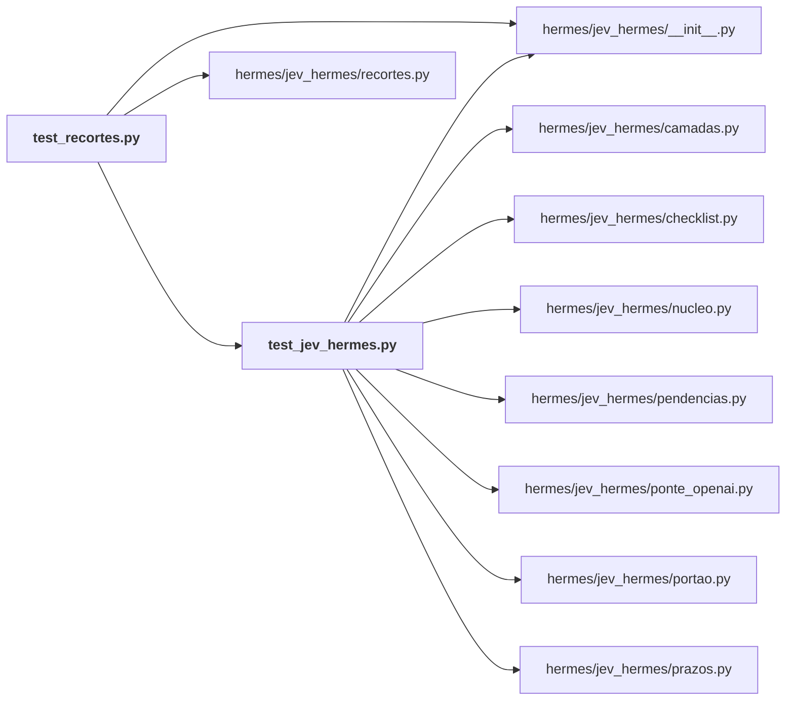

# hermes/tests/

← [MAPA.md](../../MAPA.md) · pasta acima: [hermes](../../mapa/pastas/hermes.md) · abrir a pasta: [hermes/tests/](../../hermes/tests)

## Arquivos

| arquivo | tipo | tamanho | descrição |
|---|---|---:|---|
| [test_jev_hermes.py](../../hermes/tests/test_jev_hermes.py) | código | 301 l. | Testes offline do Jev no Hermes: transporte simulado, diretório temporário, nenhuma chamada paga. |
| [test_recortes.py](../../hermes/tests/test_recortes.py) | código | 170 l. | Recortes de skill, resultado, sessões e transcrição, e os porteiros da tese e do boletim. |

## Grafo de imports e links

Nós em negrito são desta pasta; setas cheias são imports, tracejadas são links de documento.

## Ligações e conteúdo de cada arquivo

### test_jev_hermes.py

- **usa** — import: [`hermes/jev_hermes/__init__.py`](../../hermes/jev_hermes/__init__.py), [`hermes/jev_hermes/camadas.py`](../../hermes/jev_hermes/camadas.py), [`hermes/jev_hermes/checklist.py`](../../hermes/jev_hermes/checklist.py), [`hermes/jev_hermes/nucleo.py`](../../hermes/jev_hermes/nucleo.py), [`hermes/jev_hermes/pendencias.py`](../../hermes/jev_hermes/pendencias.py), [`hermes/jev_hermes/ponte_openai.py`](../../hermes/jev_hermes/ponte_openai.py), [`hermes/jev_hermes/portao.py`](../../hermes/jev_hermes/portao.py), [`hermes/jev_hermes/prazos.py`](../../hermes/jev_hermes/prazos.py)
- **é usado por** — import: [`hermes/tests/test_recortes.py`](../../hermes/tests/test_recortes.py)
- **chama de outros arquivos** — [`camadas.busca`](../../hermes/jev_hermes/camadas.py#L429), [`camadas.leitura`](../../hermes/jev_hermes/camadas.py#L314), [`camadas.recortar_terminal`](../../hermes/jev_hermes/camadas.py#L586), [`camadas.sentinela`](../../hermes/jev_hermes/camadas.py#L502), [`camadas.tema`](../../hermes/jev_hermes/camadas.py#L226), [`checklist.auditar`](../../hermes/jev_hermes/checklist.py#L143), [`checklist.carregar_lista`](../../hermes/jev_hermes/checklist.py#L51), [`nucleo.perguntar`](../../hermes/jev_hermes/nucleo.py#L355), [`nucleo.situacao`](../../hermes/jev_hermes/nucleo.py#L190), [`pendencias.esperando_igor`](../../hermes/jev_hermes/pendencias.py#L120), [`ponte_openai.Ponte`](../../hermes/jev_hermes/ponte_openai.py#L77), [`portao.encerrar`](../../hermes/jev_hermes/portao.py#L35), [`portao.executar`](../../hermes/jev_hermes/portao.py#L44), [`prazos.datas_candidatas`](../../hermes/jev_hermes/prazos.py#L146), [`prazos.decidir`](../../hermes/jev_hermes/prazos.py#L195), [`prazos.estado_do_prazo`](../../hermes/jev_hermes/prazos.py#L238)
- **conteúdo** — [jev](../../hermes/tests/test_jev_hermes.py#L20) (l. 20; usado em 1), [responder](../../hermes/tests/test_jev_hermes.py#L33) (l. 33; usado em 1), [test_resposta_liquida_custo_e_segunda_vem_do_cache](../../hermes/tests/test_jev_hermes.py#L59) (l. 59), [test_429_do_openrouter_cai_para_typesafe](../../hermes/tests/test_jev_hermes.py#L70) (l. 70), [test_erro_de_contrato_nao_troca_de_provedor](../../hermes/tests/test_jev_hermes.py#L78) (l. 78), [test_teto_recusa_antes_de_enviar](../../hermes/tests/test_jev_hermes.py#L85) (l. 85), [test_credencial_nao_sai_no_estado](../../hermes/tests/test_jev_hermes.py#L93) (l. 93), [test_registro_nao_guarda_o_texto](../../hermes/tests/test_jev_hermes.py#L103) (l. 103), [test_interruptor_desliga_sem_enviar](../../hermes/tests/test_jev_hermes.py#L109) (l. 109), [_arquivo_numerado](../../hermes/tests/test_jev_hermes.py#L117) (l. 117), [test_leitura_recorta_na_janela_dos_essenciais](../../hermes/tests/test_jev_hermes.py#L121) (l. 121), [test_leitura_respeita_intervalo_pedido_pelo_agente](../../hermes/tests/test_jev_hermes.py#L133) (l. 133), [test_busca_anexa_ordem_sem_esconder_nada](../../hermes/tests/test_jev_hermes.py#L140) (l. 140), [test_sentinela_avisa_quando_o_texto_da_ordens](../../hermes/tests/test_jev_hermes.py#L151) (l. 151), [test_portao_termina_com_sinal_para_o_agendador](../../hermes/tests/test_jev_hermes.py#L160) (l. 160), [test_portao_acorda_quando_falha](../../hermes/tests/test_jev_hermes.py#L169) (l. 169), [test_rota_externa_usa_a_chave_recebida](../../hermes/tests/test_jev_hermes.py#L177) (l. 177), [test_ponte_traduz_chat_para_decisao](../../hermes/tests/test_jev_hermes.py#L185) (l. 185), [test_recorte_mantem_essenciais_com_vizinhas_e_pontas](../../hermes/tests/test_jev_hermes.py#L216) (l. 216), [test_recorte_deixa_inteira_saida_que_termina_em_falha](../../hermes/tests/test_jev_hermes.py#L230) (l. 230), [test_tema_de_pesquisa_sugere_delegar](../../hermes/tests/test_jev_hermes.py#L237) (l. 237), [test_pendencias_acha_quem_espera_e_ignora_social](../../hermes/tests/test_jev_hermes.py#L246) (l. 246), [test_checklist_numa_chamada_so_com_sentinela](../../hermes/tests/test_jev_hermes.py#L271) (l. 271), [test_prazos_acha_datas_e_decide_pelo_jev](../../hermes/tests/test_jev_hermes.py#L286) (l. 286)

### test_recortes.py

- **usa** — import: [`hermes/jev_hermes/__init__.py`](../../hermes/jev_hermes/__init__.py), [`hermes/jev_hermes/recortes.py`](../../hermes/jev_hermes/recortes.py), [`hermes/tests/test_jev_hermes.py`](../../hermes/tests/test_jev_hermes.py)
- **chama de outros arquivos** — [`test_jev_hermes.jev`](../../hermes/tests/test_jev_hermes.py#L20), [`test_jev_hermes.responder`](../../hermes/tests/test_jev_hermes.py#L33)
- **conteúdo** — [responder_por_pergunta](../../hermes/tests/test_recortes.py#L16) (l. 16), [recortes](../../hermes/tests/test_recortes.py#L31) (l. 31), [skill_falsa](../../hermes/tests/test_recortes.py#L43) (l. 43), [test_skill_fica_com_as_secoes_essenciais_e_o_cabecalho](../../hermes/tests/test_recortes.py#L50) (l. 50), [test_skill_nao_mexe_sem_essencial_nem_pequena](../../hermes/tests/test_recortes.py#L61) (l. 61), [test_resultado_preserva_o_envelope_externo](../../hermes/tests/test_recortes.py#L68) (l. 68), [test_sessoes_encolhe_irrelevantes_e_encurta_complementares](../../hermes/tests/test_recortes.py#L78) (l. 78), [test_transcricao_tira_o_enchimento_e_diz_a_frente](../../hermes/tests/test_recortes.py#L90) (l. 90), [test_transcricao_curta_ou_sem_enchimento_fica_inteira](../../hermes/tests/test_recortes.py#L103) (l. 103), [test_pedido_recente_so_vale_quando_um_pedido_foi_feito](../../hermes/tests/test_recortes.py#L110) (l. 110), [_porteiro](../../hermes/tests/test_recortes.py#L121) (l. 121), [test_porteiro_da_tese_acorda_com_candidatos_ordenados](../../hermes/tests/test_recortes.py#L129) (l. 129), [test_porteiro_do_boletim_descarta_fora_e_ruido](../../hermes/tests/test_recortes.py#L150) (l. 150)
