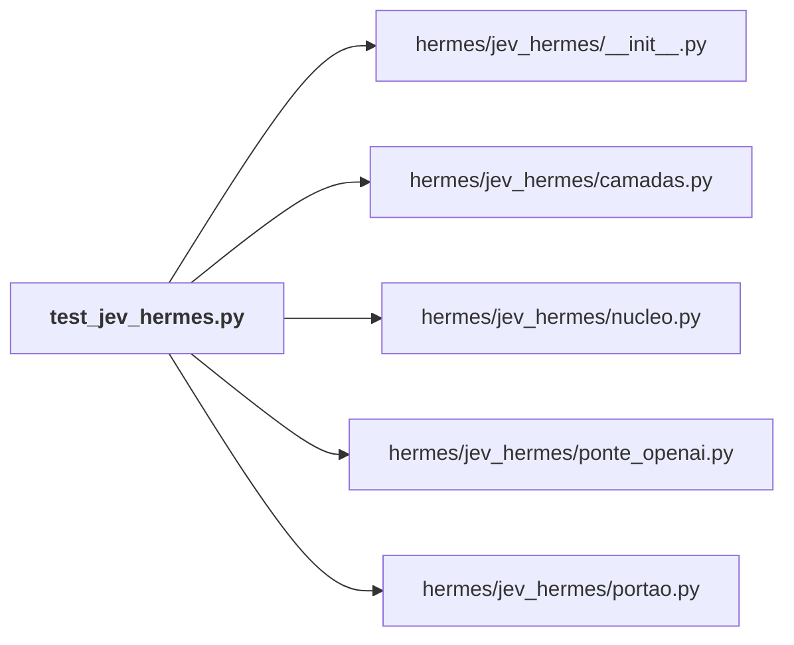

# hermes/tests/

← [MAPA.md](../../MAPA.md) · pasta acima: [hermes](../../mapa/pastas/hermes.md) · abrir a pasta: [hermes/tests/](../../hermes/tests)

## Arquivos

| arquivo | tipo | tamanho | descrição |
|---|---|---:|---|
| [test_jev_hermes.py](../../hermes/tests/test_jev_hermes.py) | código | 243 l. | Testes offline do Jev no Hermes: transporte simulado, diretório temporário, nenhuma chamada paga. |

## Grafo de imports e links

Nós em negrito são desta pasta; setas cheias são imports, tracejadas são links de documento.

## Ligações e conteúdo de cada arquivo

### test_jev_hermes.py

- **usa** — import: [`hermes/jev_hermes/__init__.py`](../../hermes/jev_hermes/__init__.py), [`hermes/jev_hermes/camadas.py`](../../hermes/jev_hermes/camadas.py), [`hermes/jev_hermes/nucleo.py`](../../hermes/jev_hermes/nucleo.py), [`hermes/jev_hermes/ponte_openai.py`](../../hermes/jev_hermes/ponte_openai.py), [`hermes/jev_hermes/portao.py`](../../hermes/jev_hermes/portao.py)
- **chama de outros arquivos** — [`camadas.busca`](../../hermes/jev_hermes/camadas.py#L385), [`camadas.leitura`](../../hermes/jev_hermes/camadas.py#L270), [`camadas.recortar_terminal`](../../hermes/jev_hermes/camadas.py#L542), [`camadas.sentinela`](../../hermes/jev_hermes/camadas.py#L458), [`camadas.tema`](../../hermes/jev_hermes/camadas.py#L186), [`nucleo.perguntar`](../../hermes/jev_hermes/nucleo.py#L341), [`nucleo.situacao`](../../hermes/jev_hermes/nucleo.py#L176), [`ponte_openai.Ponte`](../../hermes/jev_hermes/ponte_openai.py#L77), [`portao.encerrar`](../../hermes/jev_hermes/portao.py#L35), [`portao.executar`](../../hermes/jev_hermes/portao.py#L44)
- **conteúdo** — [jev](../../hermes/tests/test_jev_hermes.py#L20) (l. 20), [responder](../../hermes/tests/test_jev_hermes.py#L33) (l. 33), [test_resposta_liquida_custo_e_segunda_vem_do_cache](../../hermes/tests/test_jev_hermes.py#L59) (l. 59), [test_429_do_openrouter_cai_para_typesafe](../../hermes/tests/test_jev_hermes.py#L70) (l. 70), [test_erro_de_contrato_nao_troca_de_provedor](../../hermes/tests/test_jev_hermes.py#L78) (l. 78), [test_teto_recusa_antes_de_enviar](../../hermes/tests/test_jev_hermes.py#L85) (l. 85), [test_credencial_nao_sai_no_estado](../../hermes/tests/test_jev_hermes.py#L93) (l. 93), [test_registro_nao_guarda_o_texto](../../hermes/tests/test_jev_hermes.py#L103) (l. 103), [test_interruptor_desliga_sem_enviar](../../hermes/tests/test_jev_hermes.py#L109) (l. 109), [_arquivo_numerado](../../hermes/tests/test_jev_hermes.py#L117) (l. 117), [test_leitura_recorta_na_janela_dos_essenciais](../../hermes/tests/test_jev_hermes.py#L121) (l. 121), [test_leitura_respeita_intervalo_pedido_pelo_agente](../../hermes/tests/test_jev_hermes.py#L133) (l. 133), [test_busca_anexa_ordem_sem_esconder_nada](../../hermes/tests/test_jev_hermes.py#L140) (l. 140), [test_sentinela_avisa_quando_o_texto_da_ordens](../../hermes/tests/test_jev_hermes.py#L151) (l. 151), [test_portao_termina_com_sinal_para_o_agendador](../../hermes/tests/test_jev_hermes.py#L160) (l. 160), [test_portao_acorda_quando_falha](../../hermes/tests/test_jev_hermes.py#L169) (l. 169), [test_rota_externa_usa_a_chave_recebida](../../hermes/tests/test_jev_hermes.py#L177) (l. 177), [test_ponte_traduz_chat_para_decisao](../../hermes/tests/test_jev_hermes.py#L185) (l. 185), [test_recorte_mantem_essenciais_com_vizinhas_e_pontas](../../hermes/tests/test_jev_hermes.py#L216) (l. 216), [test_recorte_deixa_inteira_saida_que_termina_em_falha](../../hermes/tests/test_jev_hermes.py#L230) (l. 230), [test_tema_de_pesquisa_sugere_delegar](../../hermes/tests/test_jev_hermes.py#L237) (l. 237)
