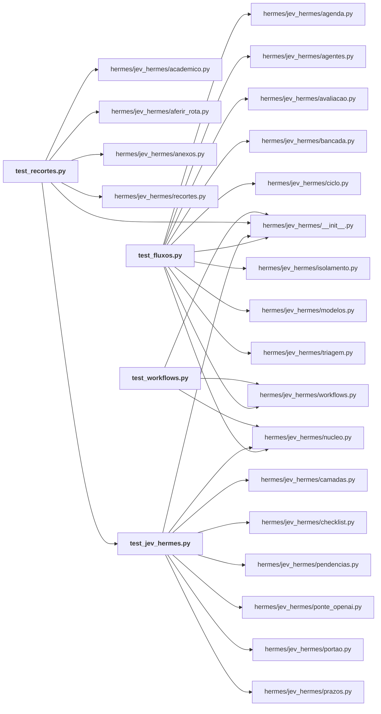

# hermes/tests/

← [MAPA.md](../../MAPA.md) · pasta acima: [hermes](../../mapa/pastas/hermes.md) · abrir a pasta: [hermes/tests/](../../hermes/tests)

## Arquivos

| arquivo | tipo | tamanho | descrição |
|---|---|---:|---|
| [test_fluxos.py](../../hermes/tests/test_fluxos.py) | código | 674 l. | Testes offline dos seis fluxos do quadro: Jev simulado, agentes simulados, nenhuma chamada paga. |
| [test_jev_hermes.py](../../hermes/tests/test_jev_hermes.py) | código | 319 l. | Testes offline do Jev no Hermes: transporte simulado, diretório temporário, nenhuma chamada paga. |
| [test_recortes.py](../../hermes/tests/test_recortes.py) | código | 337 l. | Recortes de skill, resultado, sessões e transcrição, e os porteiros da tese e do boletim. |
| [test_workflows.py](../../hermes/tests/test_workflows.py) | código | 862 l. | Testes offline dos cinco fluxos: transporte Jev falso, estado em diretório temporário, rede bloqueada. |

## Grafo de imports e links

Nós em negrito são desta pasta; setas cheias são imports, tracejadas são links de documento.

```mermaid
flowchart LR
  n_hermes_jev_hermes___init___py["hermes/jev_hermes/__init__.py"]
  n_hermes_jev_hermes_academico_py["hermes/jev_hermes/academico.py"]
  n_hermes_jev_hermes_aferir_rota_py["hermes/jev_hermes/aferir_rota.py"]
  n_hermes_jev_hermes_agenda_py["hermes/jev_hermes/agenda.py"]
  n_hermes_jev_hermes_agentes_py["hermes/jev_hermes/agentes.py"]
  n_hermes_jev_hermes_anexos_py["hermes/jev_hermes/anexos.py"]
  n_hermes_jev_hermes_avaliacao_py["hermes/jev_hermes/avaliacao.py"]
  n_hermes_jev_hermes_bancada_py["hermes/jev_hermes/bancada.py"]
  n_hermes_jev_hermes_camadas_py["hermes/jev_hermes/camadas.py"]
  n_hermes_jev_hermes_checklist_py["hermes/jev_hermes/checklist.py"]
  n_hermes_jev_hermes_ciclo_py["hermes/jev_hermes/ciclo.py"]
  n_hermes_jev_hermes_isolamento_py["hermes/jev_hermes/isolamento.py"]
  n_hermes_jev_hermes_modelos_py["hermes/jev_hermes/modelos.py"]
  n_hermes_jev_hermes_nucleo_py["hermes/jev_hermes/nucleo.py"]
  n_hermes_jev_hermes_pendencias_py["hermes/jev_hermes/pendencias.py"]
  n_hermes_jev_hermes_ponte_openai_py["hermes/jev_hermes/ponte_openai.py"]
  n_hermes_jev_hermes_portao_py["hermes/jev_hermes/portao.py"]
  n_hermes_jev_hermes_prazos_py["hermes/jev_hermes/prazos.py"]
  n_hermes_jev_hermes_recortes_py["hermes/jev_hermes/recortes.py"]
  n_hermes_jev_hermes_triagem_py["hermes/jev_hermes/triagem.py"]
  n_hermes_jev_hermes_workflows_py["hermes/jev_hermes/workflows.py"]
  n_hermes_tests_test_fluxos_py["<b>test_fluxos.py</b>"]
  n_hermes_tests_test_jev_hermes_py["<b>test_jev_hermes.py</b>"]
  n_hermes_tests_test_recortes_py["<b>test_recortes.py</b>"]
  n_hermes_tests_test_workflows_py["<b>test_workflows.py</b>"]
  n_hermes_tests_test_fluxos_py --> n_hermes_jev_hermes___init___py
  n_hermes_tests_test_fluxos_py --> n_hermes_jev_hermes_agenda_py
  n_hermes_tests_test_fluxos_py --> n_hermes_jev_hermes_agentes_py
  n_hermes_tests_test_fluxos_py --> n_hermes_jev_hermes_avaliacao_py
  n_hermes_tests_test_fluxos_py --> n_hermes_jev_hermes_bancada_py
  n_hermes_tests_test_fluxos_py --> n_hermes_jev_hermes_ciclo_py
  n_hermes_tests_test_fluxos_py --> n_hermes_jev_hermes_isolamento_py
  n_hermes_tests_test_fluxos_py --> n_hermes_jev_hermes_modelos_py
  n_hermes_tests_test_fluxos_py --> n_hermes_jev_hermes_nucleo_py
  n_hermes_tests_test_fluxos_py --> n_hermes_jev_hermes_triagem_py
  n_hermes_tests_test_fluxos_py --> n_hermes_jev_hermes_workflows_py
  n_hermes_tests_test_jev_hermes_py --> n_hermes_jev_hermes___init___py
  n_hermes_tests_test_jev_hermes_py --> n_hermes_jev_hermes_camadas_py
  n_hermes_tests_test_jev_hermes_py --> n_hermes_jev_hermes_checklist_py
  n_hermes_tests_test_jev_hermes_py --> n_hermes_jev_hermes_nucleo_py
  n_hermes_tests_test_jev_hermes_py --> n_hermes_jev_hermes_pendencias_py
  n_hermes_tests_test_jev_hermes_py --> n_hermes_jev_hermes_ponte_openai_py
  n_hermes_tests_test_jev_hermes_py --> n_hermes_jev_hermes_portao_py
  n_hermes_tests_test_jev_hermes_py --> n_hermes_jev_hermes_prazos_py
  n_hermes_tests_test_recortes_py --> n_hermes_jev_hermes___init___py
  n_hermes_tests_test_recortes_py --> n_hermes_jev_hermes_academico_py
  n_hermes_tests_test_recortes_py --> n_hermes_jev_hermes_aferir_rota_py
  n_hermes_tests_test_recortes_py --> n_hermes_jev_hermes_anexos_py
  n_hermes_tests_test_recortes_py --> n_hermes_jev_hermes_recortes_py
  n_hermes_tests_test_recortes_py --> n_hermes_tests_test_jev_hermes_py
  n_hermes_tests_test_workflows_py --> n_hermes_jev_hermes___init___py
  n_hermes_tests_test_workflows_py --> n_hermes_jev_hermes_nucleo_py
  n_hermes_tests_test_workflows_py --> n_hermes_jev_hermes_workflows_py
```

## Ligações e conteúdo de cada arquivo

### test_fluxos.py

- **usa** — import: [`hermes/jev_hermes/__init__.py`](../../hermes/jev_hermes/__init__.py), [`hermes/jev_hermes/agenda.py`](../../hermes/jev_hermes/agenda.py), [`hermes/jev_hermes/agentes.py`](../../hermes/jev_hermes/agentes.py), [`hermes/jev_hermes/avaliacao.py`](../../hermes/jev_hermes/avaliacao.py), [`hermes/jev_hermes/bancada.py`](../../hermes/jev_hermes/bancada.py), [`hermes/jev_hermes/ciclo.py`](../../hermes/jev_hermes/ciclo.py), [`hermes/jev_hermes/isolamento.py`](../../hermes/jev_hermes/isolamento.py), [`hermes/jev_hermes/modelos.py`](../../hermes/jev_hermes/modelos.py), [`hermes/jev_hermes/nucleo.py`](../../hermes/jev_hermes/nucleo.py), [`hermes/jev_hermes/triagem.py`](../../hermes/jev_hermes/triagem.py), [`hermes/jev_hermes/workflows.py`](../../hermes/jev_hermes/workflows.py); citação: [`hermes/rotinas/jev_rotina_lembrete_compromisso.py`](../../hermes/rotinas/jev_rotina_lembrete_compromisso.py)
- **chama de outros arquivos** — [`agenda.janela`](../../hermes/jev_hermes/agenda.py#L104), [`avaliacao.contar`](../../hermes/jev_hermes/avaliacao.py#L45), [`isolamento.isolar`](../../hermes/jev_hermes/isolamento.py#L34)
- **conteúdo** — [jev](../../hermes/tests/test_fluxos.py#L20) (l. 20), [Jev](../../hermes/tests/test_fluxos.py#L34) (l. 34), [fluxo_simples](../../hermes/tests/test_fluxos.py#L60) (l. 60), [test_guarda_com_uma_acao_nao_chama_o_jev](../../hermes/tests/test_fluxos.py#L73) (l. 73), [test_confianca_baixa_usa_a_regra_e_escape_sem_regra_vai_para_pessoa](../../hermes/tests/test_fluxos.py#L86) (l. 86), [test_ciclo_conclui_so_quando_a_guarda_do_fim_libera](../../hermes/tests/test_fluxos.py#L94) (l. 94), [test_repeticao_sem_mudanca_e_limite_de_passos_levam_a_pessoa](../../hermes/tests/test_fluxos.py#L102) (l. 102), [test_erros_seguidos_levam_a_pessoa](../../hermes/tests/test_fluxos.py#L111) (l. 111), [AgendaFalsa](../../hermes/tests/test_fluxos.py#L124) (l. 124), [test_janela_das_semanas](../../hermes/tests/test_fluxos.py#L154) (l. 154), [test_agendar_pergunta_tarde_com_tres_opcoes_e_so_conclui_depois_de_confirmado](../../hermes/tests/test_fluxos.py#L164) (l. 164), [test_reserva_nao_confirmada_nao_conclui](../../hermes/tests/test_fluxos.py#L179) (l. 179), [test_conflito_na_hora_de_reservar_volta_a_buscar](../../hermes/tests/test_fluxos.py#L187) (l. 187), [test_resposta_livre_e_recusa_passam_pelo_jev](../../hermes/tests/test_fluxos.py#L198) (l. 198), [test_resposta_ambigua_pergunta_de_novo](../../hermes/tests/test_fluxos.py#L209) (l. 209), [test_sem_horario_o_jev_escolhe_entre_ampliar_e_perguntar](../../hermes/tests/test_fluxos.py#L218) (l. 218), [test_modelo_pelo_tipo_escalada_por_falha_e_orcamento](../../hermes/tests/test_fluxos.py#L230) (l. 230), [test_resumo_conta_decisoes_e_escaladas](../../hermes/tests/test_fluxos.py#L245) (l. 245), [test_executor_manda_o_pedido_pela_entrada_e_gasta_o_orcamento](../../hermes/tests/test_fluxos.py#L252) (l. 252), [test_contagem_de_pytest_e_unittest](../../hermes/tests/test_fluxos.py#L270) (l. 270), [observacao_teste](../../hermes/tests/test_fluxos.py#L279) (l. 279), [rodar_laco](../../hermes/tests/test_fluxos.py#L285) (l. 285), [test_refazer_devolve_as_faltas_e_depois_aprova](../../hermes/tests/test_fluxos.py#L298) (l. 298), [test_mesmas_faltas_duas_vezes_vao_para_pessoa](../../hermes/tests/test_fluxos.py#L305) (l. 305), [test_criterio_nao_atendido_com_confianca_alta_refaz](../../hermes/tests/test_fluxos.py#L310) (l. 310), [test_sensivel_e_sem_evidencia_nao_refazem](../../hermes/tests/test_fluxos.py#L317) (l. 317), [test_observar_testes_roda_o_comando_de_verdade](../../hermes/tests/test_fluxos.py#L324) (l. 324), [test_diff_so_mede_o_agente](../../hermes/tests/test_fluxos.py#L330) (l. 330), [oficina](../../hermes/tests/test_fluxos.py#L350) (l. 350), [test_roteador_pula_a_pesquisa_quando_o_estado_ja_diz_o_problema](../../hermes/tests/test_fluxos.py#L373) (l. 373), [test_esteira_segue_a_ordem_e_para_quando_falha](../../hermes/tests/test_fluxos.py#L383) (l. 383), [test_teste_que_falha_volta_para_o_programador_com_nivel_acima](../../hermes/tests/test_fluxos.py#L394) (l. 394), [respostas](../../hermes/tests/test_fluxos.py#L414) (l. 414), [test_oportunidade_vira_cartao_com_acompanhamento_e_lembrete_unico](../../hermes/tests/test_fluxos.py#L422) (l. 422), [test_rotulos_por_destino_duvida_ordem_e_falha](../../hermes/tests/test_fluxos.py#L434) (l. 434), [test_triar_manda_as_duas_perguntas_num_pedido_so](../../hermes/tests/test_fluxos.py#L454) (l. 454), [test_bancada_mede_pelo_verificador_oculto_e_compara](../../hermes/tests/test_fluxos.py#L462) (l. 462), [test_tarefas_da_bancada_cobrem_os_quatro_tipos](../../hermes/tests/test_fluxos.py#L485) (l. 485), [test_plugin_valida_operacao_e_lista_abertos](../../hermes/tests/test_fluxos.py#L494) (l. 494), [test_chamado_que_cita_cliente_pode_ser_aprovado_pelo_harness](../../hermes/tests/test_fluxos.py#L504) (l. 504) … e mais 13

### test_jev_hermes.py

- **usa** — import: [`hermes/jev_hermes/__init__.py`](../../hermes/jev_hermes/__init__.py), [`hermes/jev_hermes/camadas.py`](../../hermes/jev_hermes/camadas.py), [`hermes/jev_hermes/checklist.py`](../../hermes/jev_hermes/checklist.py), [`hermes/jev_hermes/nucleo.py`](../../hermes/jev_hermes/nucleo.py), [`hermes/jev_hermes/pendencias.py`](../../hermes/jev_hermes/pendencias.py), [`hermes/jev_hermes/ponte_openai.py`](../../hermes/jev_hermes/ponte_openai.py), [`hermes/jev_hermes/portao.py`](../../hermes/jev_hermes/portao.py), [`hermes/jev_hermes/prazos.py`](../../hermes/jev_hermes/prazos.py)
- **é usado por** — import: [`hermes/tests/test_recortes.py`](../../hermes/tests/test_recortes.py)
- **chama de outros arquivos** — [`camadas.busca`](../../hermes/jev_hermes/camadas.py#L500), [`camadas.leitura`](../../hermes/jev_hermes/camadas.py#L382), [`camadas.recortar_terminal`](../../hermes/jev_hermes/camadas.py#L657), [`camadas.sentinela`](../../hermes/jev_hermes/camadas.py#L573), [`camadas.tema`](../../hermes/jev_hermes/camadas.py#L280), [`checklist.auditar`](../../hermes/jev_hermes/checklist.py#L143), [`checklist.carregar_lista`](../../hermes/jev_hermes/checklist.py#L51), [`nucleo.perguntar`](../../hermes/jev_hermes/nucleo.py#L355), [`nucleo.situacao`](../../hermes/jev_hermes/nucleo.py#L190), [`pendencias.esperando_igor`](../../hermes/jev_hermes/pendencias.py#L120), [`ponte_openai.Ponte`](../../hermes/jev_hermes/ponte_openai.py#L77), [`portao.encerrar`](../../hermes/jev_hermes/portao.py#L35), [`portao.executar`](../../hermes/jev_hermes/portao.py#L44), [`prazos.datas_candidatas`](../../hermes/jev_hermes/prazos.py#L145), [`prazos.decidir`](../../hermes/jev_hermes/prazos.py#L194), [`prazos.estado_do_prazo`](../../hermes/jev_hermes/prazos.py#L237)
- **conteúdo** — [jev](../../hermes/tests/test_jev_hermes.py#L19) (l. 19; usado em 1), [responder](../../hermes/tests/test_jev_hermes.py#L32) (l. 32; usado em 1), [test_resposta_liquida_custo_e_segunda_vem_do_cache](../../hermes/tests/test_jev_hermes.py#L58) (l. 58), [test_429_do_openrouter_cai_para_typesafe](../../hermes/tests/test_jev_hermes.py#L69) (l. 69), [test_erro_de_contrato_nao_troca_de_provedor](../../hermes/tests/test_jev_hermes.py#L77) (l. 77), [test_teto_recusa_antes_de_enviar](../../hermes/tests/test_jev_hermes.py#L84) (l. 84), [test_credencial_nao_sai_no_estado](../../hermes/tests/test_jev_hermes.py#L92) (l. 92), [test_registro_nao_guarda_o_texto](../../hermes/tests/test_jev_hermes.py#L102) (l. 102), [test_interruptor_desliga_sem_enviar](../../hermes/tests/test_jev_hermes.py#L108) (l. 108), [_arquivo_numerado](../../hermes/tests/test_jev_hermes.py#L116) (l. 116), [test_leitura_recorta_na_janela_dos_essenciais](../../hermes/tests/test_jev_hermes.py#L120) (l. 120), [test_leitura_respeita_intervalo_pedido_pelo_agente](../../hermes/tests/test_jev_hermes.py#L132) (l. 132), [test_busca_anexa_ordem_sem_esconder_nada](../../hermes/tests/test_jev_hermes.py#L139) (l. 139), [test_sentinela_avisa_quando_o_texto_da_ordens](../../hermes/tests/test_jev_hermes.py#L150) (l. 150), [test_portao_termina_com_sinal_para_o_agendador](../../hermes/tests/test_jev_hermes.py#L159) (l. 159), [test_portao_acorda_quando_falha](../../hermes/tests/test_jev_hermes.py#L168) (l. 168), [test_rota_externa_usa_a_chave_recebida](../../hermes/tests/test_jev_hermes.py#L176) (l. 176), [test_ponte_traduz_chat_para_decisao](../../hermes/tests/test_jev_hermes.py#L184) (l. 184), [test_recorte_mantem_essenciais_com_vizinhas_e_pontas](../../hermes/tests/test_jev_hermes.py#L215) (l. 215), [test_recorte_deixa_inteira_saida_que_termina_em_falha](../../hermes/tests/test_jev_hermes.py#L229) (l. 229), [test_tema_de_pesquisa_sugere_delegar](../../hermes/tests/test_jev_hermes.py#L236) (l. 236), [test_rota_de_ferramenta_e_conselho_e_some_quando_incerta](../../hermes/tests/test_jev_hermes.py#L245) (l. 245), [test_pendencias_acha_quem_espera_e_ignora_social](../../hermes/tests/test_jev_hermes.py#L264) (l. 264), [test_checklist_numa_chamada_so_com_sentinela](../../hermes/tests/test_jev_hermes.py#L289) (l. 289), [test_prazos_acha_datas_e_decide_pelo_jev](../../hermes/tests/test_jev_hermes.py#L304) (l. 304)

### test_recortes.py

- **usa** — import: [`hermes/jev_hermes/__init__.py`](../../hermes/jev_hermes/__init__.py), [`hermes/jev_hermes/academico.py`](../../hermes/jev_hermes/academico.py), [`hermes/jev_hermes/aferir_rota.py`](../../hermes/jev_hermes/aferir_rota.py), [`hermes/jev_hermes/anexos.py`](../../hermes/jev_hermes/anexos.py), [`hermes/jev_hermes/recortes.py`](../../hermes/jev_hermes/recortes.py), [`hermes/tests/test_jev_hermes.py`](../../hermes/tests/test_jev_hermes.py)
- **chama de outros arquivos** — [`academico.consultas_do`](../../hermes/jev_hermes/academico.py#L164), [`academico.executar`](../../hermes/jev_hermes/academico.py#L198), [`aferir_rota.aferir`](../../hermes/jev_hermes/aferir_rota.py#L73), [`anexos.atualizar`](../../hermes/jev_hermes/anexos.py#L145), [`anexos.em_aberto`](../../hermes/jev_hermes/anexos.py#L194), [`recortes.resultado`](../../hermes/jev_hermes/recortes.py#L205), [`recortes.sessoes`](../../hermes/jev_hermes/recortes.py#L221), [`recortes.skill`](../../hermes/jev_hermes/recortes.py#L130), [`recortes.transcricao`](../../hermes/jev_hermes/recortes.py#L282), [`test_jev_hermes.jev`](../../hermes/tests/test_jev_hermes.py#L19), [`test_jev_hermes.responder`](../../hermes/tests/test_jev_hermes.py#L32)
- **conteúdo** — [responder_por_pergunta](../../hermes/tests/test_recortes.py#L16) (l. 16), [recortes](../../hermes/tests/test_recortes.py#L31) (l. 31), [skill_falsa](../../hermes/tests/test_recortes.py#L43) (l. 43), [test_skill_fica_com_as_secoes_essenciais_e_o_cabecalho](../../hermes/tests/test_recortes.py#L50) (l. 50), [test_skill_nao_mexe_sem_essencial_nem_pequena](../../hermes/tests/test_recortes.py#L61) (l. 61), [test_resultado_preserva_o_envelope_externo](../../hermes/tests/test_recortes.py#L68) (l. 68), [test_sessoes_encolhe_irrelevantes_e_encurta_complementares](../../hermes/tests/test_recortes.py#L78) (l. 78), [test_transcricao_tira_o_enchimento_e_diz_a_frente](../../hermes/tests/test_recortes.py#L90) (l. 90), [test_transcricao_curta_ou_sem_enchimento_fica_inteira](../../hermes/tests/test_recortes.py#L103) (l. 103), [test_pedido_recente_so_vale_quando_um_pedido_foi_feito](../../hermes/tests/test_recortes.py#L110) (l. 110), [_porteiro](../../hermes/tests/test_recortes.py#L121) (l. 121), [_academico](../../hermes/tests/test_recortes.py#L136) (l. 136), [test_porteiro_da_tese_acorda_com_candidatos_ordenados](../../hermes/tests/test_recortes.py#L150) (l. 150), [test_radar_tematico_usa_as_consultas_do_perfil_e_pede_tres](../../hermes/tests/test_recortes.py#L163) (l. 163), [test_porteiro_academico_acorda_quando_a_coleta_falha](../../hermes/tests/test_recortes.py#L177) (l. 177), [test_porteiro_do_boletim_descarta_fora_e_ruido](../../hermes/tests/test_recortes.py#L190) (l. 190), [test_afericao_da_rota_separa_prova_de_turno_real](../../hermes/tests/test_recortes.py#L213) (l. 213), [test_leitura_nao_recorta_arquivo_estruturado](../../hermes/tests/test_recortes.py#L251) (l. 251), [test_pedido_longo_nao_estoura_o_limite_da_chamada](../../hermes/tests/test_recortes.py#L265) (l. 265), [test_recorte_age_com_essencial_de_confianca_fraca](../../hermes/tests/test_recortes.py#L284) (l. 284), [test_anexo_de_peca_e_triado_e_o_resto_so_registrado](../../hermes/tests/test_recortes.py#L304) (l. 304)

### test_workflows.py

- **usa** — import: [`hermes/jev_hermes/__init__.py`](../../hermes/jev_hermes/__init__.py), [`hermes/jev_hermes/nucleo.py`](../../hermes/jev_hermes/nucleo.py), [`hermes/jev_hermes/workflows.py`](../../hermes/jev_hermes/workflows.py); citação: [`README.md`](../../README.md)
- **é usado por** — citação: [`hermes/skill/jev/SKILL.md`](../../hermes/skill/jev/SKILL.md)
- **chama de outros arquivos** — [`nucleo.transporte_http`](../../hermes/jev_hermes/nucleo.py#L305), [`workflows.EntradaInvalida`](../../hermes/jev_hermes/workflows.py#L85), [`workflows.Observacao`](../../hermes/jev_hermes/workflows.py#L225), [`workflows.comparar_experimentos`](../../hermes/jev_hermes/workflows.py#L719), [`workflows.executar`](../../hermes/jev_hermes/workflows.py#L857), [`workflows.judge`](../../hermes/jev_hermes/workflows.py#L356), [`workflows.observar_arquivo`](../../hermes/jev_hermes/workflows.py#L237), [`workflows.selecionar_agente`](../../hermes/jev_hermes/workflows.py#L522), [`workflows.selecionar_modelo`](../../hermes/jev_hermes/workflows.py#L559), [`workflows.triar`](../../hermes/jev_hermes/workflows.py#L612)
- **conteúdo** — [_sem_rede](../../hermes/tests/test_workflows.py#L31) (l. 31), [setUpModule](../../hermes/tests/test_workflows.py#L38) (l. 38), [Jev](../../hermes/tests/test_workflows.py#L51) (l. 51), [limpar_estado](../../hermes/tests/test_workflows.py#L77) (l. 77), [Base](../../hermes/tests/test_workflows.py#L82) (l. 82), [entrada_judge](../../hermes/tests/test_workflows.py#L89) (l. 89), [repositorio](../../hermes/tests/test_workflows.py#L110) (l. 110), [observacoes_ok](../../hermes/tests/test_workflows.py#L117) (l. 117), [jev_aprova](../../hermes/tests/test_workflows.py#L126) (l. 126), [TestJudgeFronteiraDeConfianca](../../hermes/tests/test_workflows.py#L135) (l. 135), [TestJudge](../../hermes/tests/test_workflows.py#L206) (l. 206), [TestObservarArquivo](../../hermes/tests/test_workflows.py#L394) (l. 394), [entrada_agente](../../hermes/tests/test_workflows.py#L443) (l. 443), [TestAgente](../../hermes/tests/test_workflows.py#L462) (l. 462), [entrada_modelo](../../hermes/tests/test_workflows.py#L530) (l. 530), [TestModelo](../../hermes/tests/test_workflows.py#L549) (l. 549), [jev_triagem](../../hermes/tests/test_workflows.py#L594) (l. 594), [TestTriagem](../../hermes/tests/test_workflows.py#L608) (l. 608), [entrada_experimento](../../hermes/tests/test_workflows.py#L663) (l. 663), [TestExperimento](../../hermes/tests/test_workflows.py#L681) (l. 681), [carregar_plugin](../../hermes/tests/test_workflows.py#L808) (l. 808), [Contexto](../../hermes/tests/test_workflows.py#L816) (l. 816), [TestPlugin](../../hermes/tests/test_workflows.py#L827) (l. 827), [TestSemRede](../../hermes/tests/test_workflows.py#L855) (l. 855)
