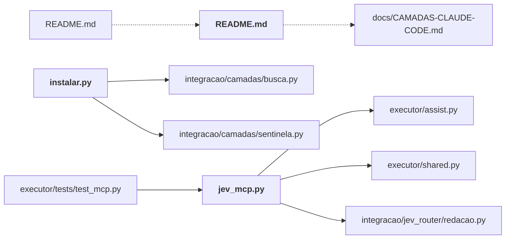

# integracao/

O Jev dentro do fluxo real: roteador de prompts, hooks do Claude Code, servidor MCP, instalador, leitura de contexto para o Codex.

← [MAPA.md](../../MAPA.md) · pasta acima: [raiz](../../mapa/pastas/_raiz.md) · abrir a pasta: [integracao/](../../integracao)

## Subpastas

| subpasta | arquivos | finalidade |
|---|---:|---|
| [avaliacao/](../../mapa/pastas/integracao__avaliacao.md) | 17 | Avaliação da integração com tráfego real do Igor (E13): amostragem, gabaritos e relatórios agregados. O texto original é privado e fica fora do Git. |
| [camadas/](../../mapa/pastas/integracao__camadas.md) | 10 | As camadas que decidem o que entra no contexto do modelo caro: leitura, busca, sentinela, saída, verificação, `ler` (skill /jev-ler), medição e rotina. |
| [hooks/](../../mapa/pastas/integracao__hooks.md) | 6 | Os scripts de hook instalados no Claude Code/Codex; cada um é um invólucro fino sobre uma camada. |
| [jev_router/](../../mapa/pastas/integracao__jev_router.md) | 7 | Roteador de prompts: política, orçamento, redação de credenciais, cliente do provedor e CLI. |
| [tests/](../../mapa/pastas/integracao__tests.md) | 5 | Testes da integração: camadas, guarda de comando, redação, roteador e rotina. |

## Arquivos

| arquivo | tipo | tamanho | descrição |
|---|---|---:|---|
| [README.md](../../integracao/README.md) | doc | 254 l. | O Jev dentro do Claude Code e do Codex — Depois do estudo (31 mil chamadas, 27 rodadas), o Jev foi posto nos pontos do fluxo do |
| [instalar.py](../../integracao/instalar.py) | código | 341 l. | Instala (ou remove) o hook do Jev no Claude Code e no Codex. |
| [jev_mcp.py](../../integracao/jev_mcp.py) | código | 206 l. | Minimal MCP stdio server: no dependencies, no shell execution, no secret in config. |

## Grafo de imports e links

Nós em negrito são desta pasta; setas cheias são imports, tracejadas são links de documento.

## Ligações e conteúdo de cada arquivo

### README.md

- **usa** — link: [`docs/CAMADAS-CLAUDE-CODE.md`](../../docs/CAMADAS-CLAUDE-CODE.md); citação: [`.gitignore`](../../.gitignore), [`executor/ledger.py`](../../executor/ledger.py), [`integracao/camadas/medir.py`](../../integracao/camadas/medir.py), [`integracao/camadas/rotina.py`](../../integracao/camadas/rotina.py), [`integracao/hooks/jev_guarda_comando.py`](../../integracao/hooks/jev_guarda_comando.py), [`integracao/hooks/jev_prompt_router.py`](../../integracao/hooks/jev_prompt_router.py), [`integracao/instalar.py`](../../integracao/instalar.py), [`integracao/jev_router/cli.py`](../../integracao/jev_router/cli.py), [`integracao/jev_router/redacao.py`](../../integracao/jev_router/redacao.py), [`integracao/tests/test_redacao.py`](../../integracao/tests/test_redacao.py), [`laboratorio/PREREGISTRO.md`](../../laboratorio/PREREGISTRO.md)
- **é usado por** — link: [`README.md`](../../README.md)
- **conteúdo** — As camadas (2026-09-20): o Jev decide o que entra no contexto do modelo caro (l. 3), O que não funcionou, e por quê (l. 81), O que funciona, e está instalado (l. 143), Como está instalado (l. 164), Garantias de operação (l. 187), Como refazer a medição (l. 202), O que se mediu do roteador em produção (l. 218), Os dois hooks, e como mexer neles (l. 239)

### instalar.py

- **usa** — import: [`integracao/camadas/busca.py`](../../integracao/camadas/busca.py), [`integracao/camadas/sentinela.py`](../../integracao/camadas/sentinela.py); citação: [`docs/CAMADAS-CLAUDE-CODE.md`](../../docs/CAMADAS-CLAUDE-CODE.md), [`integracao/camadas/rotina.py`](../../integracao/camadas/rotina.py), [`integracao/hooks/jev_busca.py`](../../integracao/hooks/jev_busca.py), [`integracao/hooks/jev_guarda_comando.py`](../../integracao/hooks/jev_guarda_comando.py), [`integracao/hooks/jev_leitura.py`](../../integracao/hooks/jev_leitura.py), [`integracao/hooks/jev_prompt_router.py`](../../integracao/hooks/jev_prompt_router.py), [`integracao/hooks/jev_saida.py`](../../integracao/hooks/jev_saida.py), [`integracao/hooks/jev_sentinela.py`](../../integracao/hooks/jev_sentinela.py)
- **é usado por** — citação: [`integracao/README.md`](../../integracao/README.md), [`laboratorio/r17-economia-de-contexto.json`](../../laboratorio/r17-economia-de-contexto.json), [`laboratorio/r18-escala.json`](../../laboratorio/r18-escala.json), [`laboratorio/r18-perguntas.json`](../../laboratorio/r18-perguntas.json), [`laboratorio/r20-k-adaptativo.json`](../../laboratorio/r20-k-adaptativo.json), [`laboratorio/r20-perguntas.json`](../../laboratorio/r20-perguntas.json)
- **conteúdo** — [entrada_de](../../integracao/instalar.py#L119) (l. 119), [instalado_em](../../integracao/instalar.py#L133) (l. 133), [instalar_gancho](../../integracao/instalar.py#L142) (l. 142), [desinstalar_gancho](../../integracao/instalar.py#L174) (l. 174), [gravar_modo](../../integracao/instalar.py#L200) (l. 200), [backup](../../integracao/instalar.py#L205) (l. 205), [carregar](../../integracao/instalar.py#L211) (l. 211), [gravar](../../integracao/instalar.py#L215) (l. 215), [ja_instalado](../../integracao/instalar.py#L219) (l. 219), [instalar](../../integracao/instalar.py#L227) (l. 227), [desinstalar](../../integracao/instalar.py#L244) (l. 244), [agendar](../../integracao/instalar.py#L270) (l. 270), [ver](../../integracao/instalar.py#L281) (l. 281), [main](../../integracao/instalar.py#L304) (l. 304)

### jev_mcp.py

- **usa** — import: [`executor/assist.py`](../../executor/assist.py), [`executor/shared.py`](../../executor/shared.py), [`integracao/jev_router/redacao.py`](../../integracao/jev_router/redacao.py)
- **é usado por** — import: [`executor/tests/test_mcp.py`](../../executor/tests/test_mcp.py); citação: [`executor/smoke_mcp.py`](../../executor/smoke_mcp.py), [`laboratorio/r17-economia-de-contexto.json`](../../laboratorio/r17-economia-de-contexto.json), [`laboratorio/r18-escala.json`](../../laboratorio/r18-escala.json), [`laboratorio/r18-perguntas.json`](../../laboratorio/r18-perguntas.json), [`laboratorio/r20-k-adaptativo.json`](../../laboratorio/r20-k-adaptativo.json), [`laboratorio/r20-perguntas.json`](../../laboratorio/r20-perguntas.json)
- **conteúdo** — [metrics](../../integracao/jev_mcp.py#L97) (l. 97), [call](../../integracao/jev_mcp.py#L109) (l. 109), [handle](../../integracao/jev_mcp.py#L166) (l. 166), [main](../../integracao/jev_mcp.py#L193) (l. 193)
