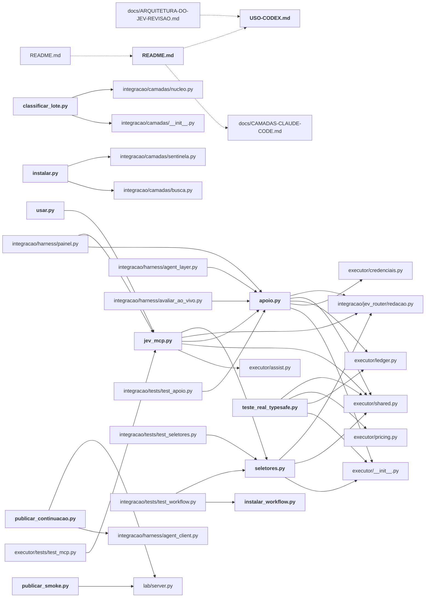

# integracao/

O Jev dentro do fluxo real: roteador de prompts, hooks do Claude Code, servidor MCP, instalador, leitura de contexto para o Codex.

← [MAPA.md](../../MAPA.md) · pasta acima: [raiz](../../mapa/pastas/_raiz.md) · abrir a pasta: [integracao/](../../integracao)

## Subpastas

| subpasta | arquivos | finalidade |
|---|---:|---|
| [avaliacao/](../../mapa/pastas/integracao__avaliacao.md) | 19 | Avaliação da integração com tráfego real do Igor (E13): amostragem, gabaritos e relatórios agregados. O texto original é privado e fica fora do Git. |
| [camadas/](../../mapa/pastas/integracao__camadas.md) | 13 | As camadas que decidem o que entra no contexto do modelo caro: leitura, busca, sentinela, saída, verificação, `ler` (skill /jev-ler), medição e rotina. |
| [gateway/](../../mapa/pastas/integracao__gateway.md) | 3 |  |
| [harness/](../../mapa/pastas/integracao__harness.md) | 30 |  |
| [hooks/](../../mapa/pastas/integracao__hooks.md) | 8 | Os scripts de hook instalados no Claude Code/Codex; cada um é um invólucro fino sobre uma camada. |
| [jev_router/](../../mapa/pastas/integracao__jev_router.md) | 7 | Roteador de prompts: política, orçamento, redação de credenciais, cliente do provedor e CLI. |
| [skill/](../../mapa/pastas/integracao__skill.md) | 1 |  |
| [skills/](../../mapa/pastas/integracao__skills.md) | 1 |  |
| [tests/](../../mapa/pastas/integracao__tests.md) | 11 | Testes da integração: camadas, guarda de comando, redação, roteador e rotina. |

## Arquivos

| arquivo | tipo | tamanho | descrição |
|---|---|---:|---|
| [README.md](../../integracao/README.md) | doc | 260 l. | O Jev dentro do Claude Code e do Codex — Instalação global e uso cotidiano nesta máquina: JEV no Codex e Claude Code. |
| [USO-CODEX.md](../../integracao/USO-CODEX.md) | doc | 158 l. | JEV no Codex e no Claude Code — Instalação nesta máquina em 21/09/2026: |
| [apoio.py](../../integracao/apoio.py) | código | 77 l. | Bounded semantic judgments through the existing wallet; no separate paid client. |
| [classificar_lote.py](../../integracao/classificar_lote.py) | código | 35 l. | Classificação em lote pelo Jev para programas em outra linguagem (Node, PowerShell...). |
| [instalar.py](../../integracao/instalar.py) | código | 354 l. | Instala (ou remove) o hook do Jev no Claude Code e no Codex. |
| [instalar_workflow.py](../../integracao/instalar_workflow.py) | código | 40 l. | Install/remove the local task-entry hook without replacing other handlers. |
| [jev_mcp.py](../../integracao/jev_mcp.py) | código | 192 l. | Minimal MCP stdio server: no dependencies, no shell execution, no secret in config. |
| [publicar_continuacao.py](../../integracao/publicar_continuacao.py) | código | 100 l. | Reconcile harness evidence with the original plan, without claiming smoke completion. |
| [publicar_smoke.py](../../integracao/publicar_smoke.py) | código | 71 l. | Publish actual TypeSafe smoke records through the dashboard's revision-checked API. |
| [seletores.py](../../integracao/seletores.py) | código | 101 l. | Select among host-provided available tools/skills; never execute the selection. |
| [teste_real_typesafe.py](../../integracao/teste_real_typesafe.py) | código | 79 l. | Rodada de oito casos, autorizada separadamente por Igor em 21/09/2026: US$ 0,03. |
| [usar.py](../../integracao/usar.py) | código | 28 l. | CLI fallback for agents without the MCP loaded. Never prints exception contents. |

## Grafo de imports e links

Nós em negrito são desta pasta; setas cheias são imports, tracejadas são links de documento.

```mermaid
flowchart LR
  n_README_md["README.md"]
  n_docs_ARQUITETURA_DO_JEV_REVISAO_md["docs/ARQUITETURA-DO-JEV-REVISAO.md"]
  n_docs_CAMADAS_CLAUDE_CODE_md["docs/CAMADAS-CLAUDE-CODE.md"]
  n_executor___init___py["executor/__init__.py"]
  n_executor_assist_py["executor/assist.py"]
  n_executor_credenciais_py["executor/credenciais.py"]
  n_executor_ledger_py["executor/ledger.py"]
  n_executor_pricing_py["executor/pricing.py"]
  n_executor_shared_py["executor/shared.py"]
  n_executor_tests_test_mcp_py["executor/tests/test_mcp.py"]
  n_integracao_README_md["<b>README.md</b>"]
  n_integracao_USO_CODEX_md["<b>USO-CODEX.md</b>"]
  n_integracao_apoio_py["<b>apoio.py</b>"]
  n_integracao_camadas___init___py["integracao/camadas/__init__.py"]
  n_integracao_camadas_busca_py["integracao/camadas/busca.py"]
  n_integracao_camadas_nucleo_py["integracao/camadas/nucleo.py"]
  n_integracao_camadas_sentinela_py["integracao/camadas/sentinela.py"]
  n_integracao_classificar_lote_py["<b>classificar_lote.py</b>"]
  n_integracao_harness_agent_client_py["integracao/harness/agent_client.py"]
  n_integracao_harness_agent_layer_py["integracao/harness/agent_layer.py"]
  n_integracao_harness_avaliar_ao_vivo_py["integracao/harness/avaliar_ao_vivo.py"]
  n_integracao_harness_painel_py["integracao/harness/painel.py"]
  n_integracao_instalar_py["<b>instalar.py</b>"]
  n_integracao_instalar_workflow_py["<b>instalar_workflow.py</b>"]
  n_integracao_jev_mcp_py["<b>jev_mcp.py</b>"]
  n_integracao_jev_router_redacao_py["integracao/jev_router/redacao.py"]
  n_integracao_publicar_continuacao_py["<b>publicar_continuacao.py</b>"]
  n_integracao_publicar_smoke_py["<b>publicar_smoke.py</b>"]
  n_integracao_seletores_py["<b>seletores.py</b>"]
  n_integracao_teste_real_typesafe_py["<b>teste_real_typesafe.py</b>"]
  n_integracao_tests_test_apoio_py["integracao/tests/test_apoio.py"]
  n_integracao_tests_test_seletores_py["integracao/tests/test_seletores.py"]
  n_integracao_tests_test_workflow_py["integracao/tests/test_workflow.py"]
  n_integracao_usar_py["<b>usar.py</b>"]
  n_lab_server_py["lab/server.py"]
  n_README_md -.-> n_integracao_README_md
  n_docs_ARQUITETURA_DO_JEV_REVISAO_md -.-> n_integracao_USO_CODEX_md
  n_executor_tests_test_mcp_py --> n_integracao_jev_mcp_py
  n_integracao_README_md -.-> n_docs_CAMADAS_CLAUDE_CODE_md
  n_integracao_README_md -.-> n_integracao_USO_CODEX_md
  n_integracao_apoio_py --> n_executor___init___py
  n_integracao_apoio_py --> n_executor_credenciais_py
  n_integracao_apoio_py --> n_executor_ledger_py
  n_integracao_apoio_py --> n_executor_shared_py
  n_integracao_apoio_py --> n_integracao_jev_router_redacao_py
  n_integracao_classificar_lote_py --> n_integracao_camadas___init___py
  n_integracao_classificar_lote_py --> n_integracao_camadas_nucleo_py
  n_integracao_harness_agent_layer_py --> n_integracao_apoio_py
  n_integracao_harness_avaliar_ao_vivo_py --> n_integracao_apoio_py
  n_integracao_harness_painel_py --> n_integracao_apoio_py
  n_integracao_harness_painel_py --> n_integracao_jev_mcp_py
  n_integracao_instalar_py --> n_integracao_camadas_busca_py
  n_integracao_instalar_py --> n_integracao_camadas_sentinela_py
  n_integracao_jev_mcp_py --> n_executor_assist_py
  n_integracao_jev_mcp_py --> n_executor_shared_py
  n_integracao_jev_mcp_py --> n_integracao_apoio_py
  n_integracao_jev_mcp_py --> n_integracao_jev_router_redacao_py
  n_integracao_jev_mcp_py --> n_integracao_seletores_py
  n_integracao_publicar_continuacao_py --> n_integracao_harness_agent_client_py
  n_integracao_publicar_continuacao_py --> n_lab_server_py
  n_integracao_publicar_smoke_py --> n_lab_server_py
  n_integracao_seletores_py --> n_executor___init___py
  n_integracao_seletores_py --> n_executor_shared_py
  n_integracao_seletores_py --> n_integracao_jev_router_redacao_py
  n_integracao_teste_real_typesafe_py --> n_executor___init___py
  n_integracao_teste_real_typesafe_py --> n_executor_ledger_py
  n_integracao_teste_real_typesafe_py --> n_executor_pricing_py
  n_integracao_teste_real_typesafe_py --> n_executor_shared_py
  n_integracao_tests_test_apoio_py --> n_integracao_apoio_py
  n_integracao_tests_test_seletores_py --> n_integracao_seletores_py
  n_integracao_tests_test_workflow_py --> n_integracao_instalar_workflow_py
  n_integracao_tests_test_workflow_py --> n_integracao_seletores_py
  n_integracao_usar_py --> n_integracao_jev_mcp_py
```

## Ligações e conteúdo de cada arquivo

### README.md

- **usa** — link: [`docs/CAMADAS-CLAUDE-CODE.md`](../../docs/CAMADAS-CLAUDE-CODE.md), [`integracao/USO-CODEX.md`](../../integracao/USO-CODEX.md); citação: [`.gitignore`](../../.gitignore), [`executor/credenciais.py`](../../executor/credenciais.py), [`executor/ledger.py`](../../executor/ledger.py), [`integracao/camadas/medir.py`](../../integracao/camadas/medir.py), [`integracao/camadas/rotina.py`](../../integracao/camadas/rotina.py), [`integracao/hooks/jev_guarda_comando.py`](../../integracao/hooks/jev_guarda_comando.py), [`integracao/hooks/jev_prompt_router.py`](../../integracao/hooks/jev_prompt_router.py), [`integracao/instalar.py`](../../integracao/instalar.py), [`integracao/jev_router/cli.py`](../../integracao/jev_router/cli.py), [`integracao/jev_router/redacao.py`](../../integracao/jev_router/redacao.py), [`integracao/tests/test_redacao.py`](../../integracao/tests/test_redacao.py), [`laboratorio/PREREGISTRO.md`](../../laboratorio/PREREGISTRO.md)
- **é usado por** — link: [`README.md`](../../README.md)
- **parecidos (julgados pelo Jev)** — [`integracao/jev_router/politica.py`](../../integracao/jev_router/politica.py) (não julgado, 0.27), [`docs/JEV-GATEWAY.md`](../../docs/JEV-GATEWAY.md) (não julgado, 0.27), [`integracao/harness/PREREGISTRO.md`](../../integracao/harness/PREREGISTRO.md) (não julgado, 0.26), [`integracao/avaliacao/amostrar.py`](../../integracao/avaliacao/amostrar.py) (não julgado, 0.21)
- **papel nos estudos** — define [E13](../../mapa/conhecimento/experimentos.md#e13)
- **menciona 9 conceitos** — [E1](../../mapa/conhecimento/experimentos.md#e1) (1×), [E3](../../mapa/conhecimento/experimentos.md#e3) (1×), [E5](../../mapa/conhecimento/experimentos.md#e5) (1×), [E8](../../mapa/conhecimento/experimentos.md#e8) (1×), [E11](../../mapa/conhecimento/experimentos.md#e11) (1×), [E12](../../mapa/conhecimento/experimentos.md#e12) (1×), [R16](../../mapa/conhecimento/rodadas.md#r16) (1×), [H038](../../mapa/conhecimento/hipoteses.md#h038) (1×), [Q044](../../mapa/conhecimento/perguntas.md#q044) (1×)
- **conteúdo** — As camadas (2026-09-20): o Jev decide o que entra no contexto do modelo caro (l. 7), O que não funcionou, e por quê (l. 87), O que funciona, e está instalado (l. 149), Como está instalado (l. 170), Garantias de operação (l. 193), Como refazer a medição (l. 208), O que se mediu do roteador em produção (l. 224), Os dois hooks, e como mexer neles (l. 245)

### USO-CODEX.md

- **usa** — citação: [`executor/shared.py`](../../executor/shared.py), [`integracao/hooks/jev_workflow.py`](../../integracao/hooks/jev_workflow.py), [`integracao/instalar_workflow.py`](../../integracao/instalar_workflow.py), [`integracao/jev_mcp.py`](../../integracao/jev_mcp.py), [`integracao/skills/jev-assist/SKILL.md`](../../integracao/skills/jev-assist/SKILL.md), [`integracao/usar.py`](../../integracao/usar.py)
- **é usado por** — link: [`docs/ARQUITETURA-DO-JEV-REVISAO.md`](../../docs/ARQUITETURA-DO-JEV-REVISAO.md), [`integracao/README.md`](../../integracao/README.md); citação: [`AGENTS.md`](../../AGENTS.md), [`output/arquitetura-jev.html`](../../output/arquitetura-jev.html)
- **parecidos (julgados pelo Jev)** — [`integracao/instalar.py`](../../integracao/instalar.py) (não julgado, 0.32), [`docs/JEV-GATEWAY.md`](../../docs/JEV-GATEWAY.md) (não julgado, 0.32), [`integracao/camadas/__init__.py`](../../integracao/camadas/__init__.py) (não julgado, 0.26), [`integracao/jev_router/politica.py`](../../integracao/jev_router/politica.py) (não julgado, 0.24), [`hermes/plugin/jev-advisor/__init__.py`](../../hermes/plugin/jev-advisor/__init__.py) (não julgado, 0.21)
- **conteúdo** — O que delegar (l. 42), Estado financeiro desta instalação (l. 82), Conferir e usar sem MCP carregado (l. 119), Fonte para comparação de modelos (l. 145)

### apoio.py

- **usa** — import: [`executor/__init__.py`](../../executor/__init__.py), [`executor/credenciais.py`](../../executor/credenciais.py), [`executor/ledger.py`](../../executor/ledger.py), [`executor/shared.py`](../../executor/shared.py), [`integracao/jev_router/redacao.py`](../../integracao/jev_router/redacao.py)
- **é usado por** — import: [`integracao/harness/agent_layer.py`](../../integracao/harness/agent_layer.py), [`integracao/harness/avaliar_ao_vivo.py`](../../integracao/harness/avaliar_ao_vivo.py), [`integracao/harness/painel.py`](../../integracao/harness/painel.py), [`integracao/jev_mcp.py`](../../integracao/jev_mcp.py), [`integracao/tests/test_apoio.py`](../../integracao/tests/test_apoio.py)
- **chama de outros arquivos** — [`credenciais.chave`](../../executor/credenciais.py#L71), [`credenciais.situacao`](../../executor/credenciais.py#L80), [`ledger.Ledger`](../../executor/ledger.py#L32), [`shared.active_runtime`](../../executor/shared.py#L30), [`shared.ask`](../../executor/shared.py#L152), [`redacao.limpar`](../../integracao/jev_router/redacao.py#L43)
- **parecidos (julgados pelo Jev)** — [`integracao/harness/agent_client.py`](../../integracao/harness/agent_client.py) (não julgado, 0.23), [`integracao/harness/ponte.py`](../../integracao/harness/ponte.py) (não julgado, 0.20)
- **conteúdo** — [status](../../integracao/apoio.py#L10) (l. 10; usado em 5), [judge](../../integracao/apoio.py#L51) (l. 51; usado em 2)

### classificar_lote.py

- **usa** — import: [`integracao/camadas/__init__.py`](../../integracao/camadas/__init__.py), [`integracao/camadas/nucleo.py`](../../integracao/camadas/nucleo.py)
- **chama de outros arquivos** — [`nucleo.classificar_em_paralelo`](../../integracao/camadas/nucleo.py#L176), [`nucleo.resumo_das_chamadas`](../../integracao/camadas/nucleo.py#L206)
- **conteúdo** — [main](../../integracao/classificar_lote.py#L18) (l. 18)

### instalar.py

- **usa** — import: [`integracao/camadas/busca.py`](../../integracao/camadas/busca.py), [`integracao/camadas/sentinela.py`](../../integracao/camadas/sentinela.py); citação: [`docs/CAMADAS-CLAUDE-CODE.md`](../../docs/CAMADAS-CLAUDE-CODE.md), [`integracao/camadas/rotina.py`](../../integracao/camadas/rotina.py), [`integracao/hooks/jev_busca.py`](../../integracao/hooks/jev_busca.py), [`integracao/hooks/jev_guarda_comando.py`](../../integracao/hooks/jev_guarda_comando.py), [`integracao/hooks/jev_leitura.py`](../../integracao/hooks/jev_leitura.py), [`integracao/hooks/jev_leitura_shell.py`](../../integracao/hooks/jev_leitura_shell.py), [`integracao/hooks/jev_prompt_router.py`](../../integracao/hooks/jev_prompt_router.py), [`integracao/hooks/jev_saida.py`](../../integracao/hooks/jev_saida.py), [`integracao/hooks/jev_sentinela.py`](../../integracao/hooks/jev_sentinela.py)
- **é usado por** — citação: [`integracao/README.md`](../../integracao/README.md), [`integracao/skill/jev-completo/SKILL.md`](../../integracao/skill/jev-completo/SKILL.md), [`laboratorio/r17-economia-de-contexto.json`](../../laboratorio/r17-economia-de-contexto.json), [`laboratorio/r18-escala.json`](../../laboratorio/r18-escala.json), [`laboratorio/r18-perguntas.json`](../../laboratorio/r18-perguntas.json), [`laboratorio/r20-k-adaptativo.json`](../../laboratorio/r20-k-adaptativo.json), [`laboratorio/r20-perguntas.json`](../../laboratorio/r20-perguntas.json), [`laboratorio/r38-dois-trechos-em-lista-bruto.json`](../../laboratorio/r38-dois-trechos-em-lista-bruto.json), [`laboratorio/r38-dois-trechos-em-lista.json`](../../laboratorio/r38-dois-trechos-em-lista.json), [`laboratorio/r39-codigo-numa-chamada-bruto.json`](../../laboratorio/r39-codigo-numa-chamada-bruto.json), [`laboratorio/r39-codigo-numa-chamada.json`](../../laboratorio/r39-codigo-numa-chamada.json), [`laboratorio/r43-tamanho-da-lista-bruto.json`](../../laboratorio/r43-tamanho-da-lista-bruto.json), [`laboratorio/r43-tamanho-da-lista.json`](../../laboratorio/r43-tamanho-da-lista.json), [`laboratorio/r44-candidato-envenenado-bruto.json`](../../laboratorio/r44-candidato-envenenado-bruto.json), [`laboratorio/r44-candidato-envenenado.json`](../../laboratorio/r44-candidato-envenenado.json), [`laboratorio/r45-lista-nas-duas-ordens-bruto.json`](../../laboratorio/r45-lista-nas-duas-ordens-bruto.json), [`laboratorio/r45-lista-nas-duas-ordens.json`](../../laboratorio/r45-lista-nas-duas-ordens.json)
- **parecidos (julgados pelo Jev)** — [`integracao/instalar_workflow.py`](../../integracao/instalar_workflow.py) (não julgado, 0.35), [`integracao/USO-CODEX.md`](../../integracao/USO-CODEX.md) (não julgado, 0.32), [`integracao/harness/PREREGISTRO.md`](../../integracao/harness/PREREGISTRO.md) (não julgado, 0.29), [`docs/JEV-GATEWAY.md`](../../docs/JEV-GATEWAY.md) (não julgado, 0.23)
- **menciona 1 conceito** — [R16](../../mapa/conhecimento/rodadas.md#r16) (1×)
- **conteúdo** — [entrada_de](../../integracao/instalar.py#L132) (l. 132), [instalado_em](../../integracao/instalar.py#L146) (l. 146), [instalar_gancho](../../integracao/instalar.py#L155) (l. 155), [desinstalar_gancho](../../integracao/instalar.py#L187) (l. 187), [gravar_modo](../../integracao/instalar.py#L213) (l. 213), [backup](../../integracao/instalar.py#L218) (l. 218), [carregar](../../integracao/instalar.py#L224) (l. 224), [gravar](../../integracao/instalar.py#L228) (l. 228), [ja_instalado](../../integracao/instalar.py#L232) (l. 232), [instalar](../../integracao/instalar.py#L240) (l. 240), [desinstalar](../../integracao/instalar.py#L257) (l. 257), [agendar](../../integracao/instalar.py#L283) (l. 283), [ver](../../integracao/instalar.py#L294) (l. 294), [main](../../integracao/instalar.py#L317) (l. 317)

### instalar_workflow.py

- **usa** — citação: [`integracao/hooks/jev_workflow.py`](../../integracao/hooks/jev_workflow.py)
- **é usado por** — import: [`integracao/tests/test_workflow.py`](../../integracao/tests/test_workflow.py); citação: [`integracao/USO-CODEX.md`](../../integracao/USO-CODEX.md)
- **parecidos (julgados pelo Jev)** — [`integracao/instalar.py`](../../integracao/instalar.py) (não julgado, 0.35), [`lab/server.py`](../../lab/server.py) (não julgado, 0.30)
- **conteúdo** — [configure](../../integracao/instalar_workflow.py#L12) (l. 12; usado em 1), [main](../../integracao/instalar_workflow.py#L30) (l. 30)

### jev_mcp.py

- **usa** — import: [`executor/assist.py`](../../executor/assist.py), [`executor/shared.py`](../../executor/shared.py), [`integracao/apoio.py`](../../integracao/apoio.py), [`integracao/jev_router/redacao.py`](../../integracao/jev_router/redacao.py), [`integracao/seletores.py`](../../integracao/seletores.py)
- **é usado por** — import: [`executor/tests/test_mcp.py`](../../executor/tests/test_mcp.py), [`integracao/harness/painel.py`](../../integracao/harness/painel.py), [`integracao/usar.py`](../../integracao/usar.py); citação: [`executor/smoke_mcp.py`](../../executor/smoke_mcp.py), [`integracao/USO-CODEX.md`](../../integracao/USO-CODEX.md), [`integracao/skill/jev-completo/SKILL.md`](../../integracao/skill/jev-completo/SKILL.md), [`laboratorio/r17-economia-de-contexto.json`](../../laboratorio/r17-economia-de-contexto.json), [`laboratorio/r18-escala.json`](../../laboratorio/r18-escala.json), [`laboratorio/r18-perguntas.json`](../../laboratorio/r18-perguntas.json), [`laboratorio/r20-k-adaptativo.json`](../../laboratorio/r20-k-adaptativo.json), [`laboratorio/r20-perguntas.json`](../../laboratorio/r20-perguntas.json), [`laboratorio/r38-dois-trechos-em-lista-bruto.json`](../../laboratorio/r38-dois-trechos-em-lista-bruto.json), [`laboratorio/r38-dois-trechos-em-lista.json`](../../laboratorio/r38-dois-trechos-em-lista.json), [`laboratorio/r39-codigo-numa-chamada-bruto.json`](../../laboratorio/r39-codigo-numa-chamada-bruto.json), [`laboratorio/r39-codigo-numa-chamada.json`](../../laboratorio/r39-codigo-numa-chamada.json), [`laboratorio/r44-candidato-envenenado-bruto.json`](../../laboratorio/r44-candidato-envenenado-bruto.json), [`laboratorio/r44-candidato-envenenado.json`](../../laboratorio/r44-candidato-envenenado.json)
- **chama de outros arquivos** — [`assist.evaluate`](../../executor/assist.py#L39), [`shared.active_runtime`](../../executor/shared.py#L30), [`apoio.judge`](../../integracao/apoio.py#L51), [`apoio.status`](../../integracao/apoio.py#L10), [`redacao.limpar`](../../integracao/jev_router/redacao.py#L43), [`seletores.route`](../../integracao/seletores.py#L75), [`seletores.route_definition`](../../integracao/seletores.py#L91), [`seletores.select`](../../integracao/seletores.py#L8), [`seletores.tool_definition`](../../integracao/seletores.py#L57)
- **parecidos (julgados pelo Jev)** — [`integracao/harness/mcp.py`](../../integracao/harness/mcp.py) (não julgado, 0.33)
- **conteúdo** — [metrics](../../integracao/jev_mcp.py#L72) (l. 72), [call](../../integracao/jev_mcp.py#L91) (l. 91; usado em 2), [handle](../../integracao/jev_mcp.py#L152) (l. 152; usado em 2), [main](../../integracao/jev_mcp.py#L179) (l. 179)

### publicar_continuacao.py

- **usa** — import: [`integracao/harness/agent_client.py`](../../integracao/harness/agent_client.py), [`lab/server.py`](../../lab/server.py); citação: [`integracao/harness/RELATORIO.md`](../../integracao/harness/RELATORIO.md), [`integracao/harness/resultados.json`](../../integracao/harness/resultados.json)
- **chama de outros arquivos** — [`agent_client.Client`](../../integracao/harness/agent_client.py#L18), [`server.validate_state`](../../lab/server.py#L64)
- **parecidos (julgados pelo Jev)** — [`integracao/harness/avaliar_ao_vivo.py`](../../integracao/harness/avaliar_ao_vivo.py) (não julgado, 0.37)
- **conteúdo** — [main](../../integracao/publicar_continuacao.py#L35) (l. 35)

### publicar_smoke.py

- **usa** — import: [`lab/server.py`](../../lab/server.py); citação: [`integracao/harness/resultados.json`](../../integracao/harness/resultados.json)
- **chama de outros arquivos** — [`server.validate_state`](../../lab/server.py#L64)
- **parecidos (julgados pelo Jev)** — [R50](../../mapa/conhecimento/rodadas.md#r50) (não julgado, 0.26)
- **menciona 1 conceito** — [S01](../../mapa/conhecimento/sistemas.md#s01) (2×)
- **conteúdo** — [main](../../integracao/publicar_smoke.py#L13) (l. 13)

### seletores.py

- **usa** — import: [`executor/__init__.py`](../../executor/__init__.py), [`executor/shared.py`](../../executor/shared.py), [`integracao/jev_router/redacao.py`](../../integracao/jev_router/redacao.py)
- **é usado por** — import: [`integracao/jev_mcp.py`](../../integracao/jev_mcp.py), [`integracao/tests/test_seletores.py`](../../integracao/tests/test_seletores.py), [`integracao/tests/test_workflow.py`](../../integracao/tests/test_workflow.py)
- **chama de outros arquivos** — [`shared.ask`](../../executor/shared.py#L152), [`redacao.limpar`](../../integracao/jev_router/redacao.py#L43)
- **parecidos (julgados pelo Jev)** — [`executor/assist.py`](../../executor/assist.py) (não julgado, 0.24), [`integracao/harness/mcp.py`](../../integracao/harness/mcp.py) (não julgado, 0.21), [`integracao/hooks/jev_workflow.py`](../../integracao/hooks/jev_workflow.py) (não julgado, 0.20)
- **conteúdo** — [select](../../integracao/seletores.py#L8) (l. 8; usado em 2), [tool_definition](../../integracao/seletores.py#L57) (l. 57; usado em 1), [route](../../integracao/seletores.py#L75) (l. 75; usado em 2), [route_definition](../../integracao/seletores.py#L91) (l. 91; usado em 1)

### teste_real_typesafe.py

- **usa** — import: [`executor/__init__.py`](../../executor/__init__.py), [`executor/ledger.py`](../../executor/ledger.py), [`executor/pricing.py`](../../executor/pricing.py), [`executor/shared.py`](../../executor/shared.py); citação: [`integracao/harness/resultados.json`](../../integracao/harness/resultados.json)
- **chama de outros arquivos** — [`ledger.Ledger`](../../executor/ledger.py#L32), [`pricing.load_prices`](../../executor/pricing.py#L18), [`pricing.usd_to_nusd`](../../executor/pricing.py#L74), [`shared.ask`](../../executor/shared.py#L152)
- **parecidos (julgados pelo Jev)** — [H024](../../mapa/conhecimento/hipoteses.md#h024) (não julgado, 0.33), [`laboratorio/r50_checklist_de_contrato.py`](../../laboratorio/r50_checklist_de_contrato.py) (não julgado, 0.27), [`hermes/jev_hermes/pendencias.py`](../../hermes/jev_hermes/pendencias.py) (não julgado, 0.23), [`integracao/avaliacao/skills.py`](../../integracao/avaliacao/skills.py) (não julgado, 0.21), [`laboratorio/r30_hipotese_e_prova.py`](../../laboratorio/r30_hipotese_e_prova.py) (não julgado, 0.20), [R3](../../mapa/conhecimento/rodadas.md#r3) (não julgado, 0.20)
- **conteúdo** — [main](../../integracao/teste_real_typesafe.py#L15) (l. 15)

### usar.py

- **usa** — import: [`integracao/jev_mcp.py`](../../integracao/jev_mcp.py)
- **é usado por** — citação: [`integracao/USO-CODEX.md`](../../integracao/USO-CODEX.md), [`integracao/harness/README.md`](../../integracao/harness/README.md), [`integracao/hooks/jev_workflow.py`](../../integracao/hooks/jev_workflow.py), [`integracao/skills/jev-assist/SKILL.md`](../../integracao/skills/jev-assist/SKILL.md)
- **chama de outros arquivos** — [`jev_mcp.handle`](../../integracao/jev_mcp.py#L152)
- **parecidos (julgados pelo Jev)** — [`integracao/harness/avaliar_ao_vivo.py`](../../integracao/harness/avaliar_ao_vivo.py) (não julgado, 0.34), [`integracao/harness/test_agents.py`](../../integracao/harness/test_agents.py) (não julgado, 0.25), [`integracao/harness/agent_cli.py`](../../integracao/harness/agent_cli.py) (não julgado, 0.23), [`integracao/harness/mcp.py`](../../integracao/harness/mcp.py) (não julgado, 0.22)
- **conteúdo** — [main](../../integracao/usar.py#L11) (l. 11)
