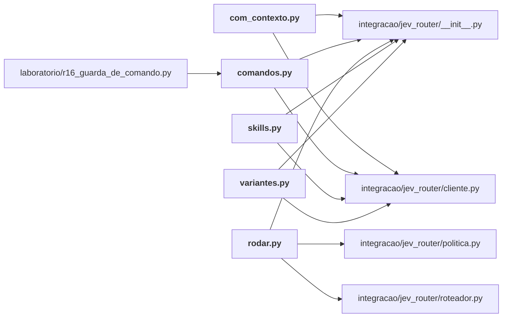

# integracao/avaliacao/

Avaliação da integração com tráfego real do Igor (E13): amostragem, gabaritos e relatórios agregados. O texto original é privado e fica fora do Git.

← [MAPA.md](../../MAPA.md) · pasta acima: [integracao](../../mapa/pastas/integracao.md) · abrir a pasta: [integracao/avaliacao/](../../integracao/avaliacao)

## Arquivos

| arquivo | tipo | tamanho | descrição |
|---|---|---:|---|
| [amostrar.py](../../integracao/avaliacao/amostrar.py) | código | 57 l. | Sorteia prompts reais do histórico do Claude Code para avaliar o roteador. |
| [amostrar_com_contexto.py](../../integracao/avaliacao/amostrar_com_contexto.py) | código | 126 l. | Monta pares (contexto anterior, pedido) a partir dos transcripts reais do Claude Code. |
| [auditar_producao.py](../../integracao/avaliacao/auditar_producao.py) | código | 122 l. | Movimento 1 — o roteador em produção: o que ele decidiu sobre os meus próprios pedidos. |
| [camadas-medicao.json](../../integracao/avaliacao/camadas-medicao.json) | dado | 143 l. | Objeto com 10 chaves: leitura, busca, sentinela, ler, saida, verificar, roteador, guarda, parametros, total |
| [com-contexto.json](../../integracao/avaliacao/com-contexto.json) | dado | 539 l. | Objeto com 3 chaves: sem-contexto, com-contexto, mudaram_com_o_contexto |
| [com_contexto.py](../../integracao/avaliacao/com_contexto.py) | código | 128 l. | O teste decisivo: a mesma pergunta, com e sem o contexto anterior da conversa. |
| [comandos.py](../../integracao/avaliacao/comandos.py) | código | 173 l. | Extrai comandos de shell realmente executados e testa o Jev como guarda de irreversível. |
| [gabarito-autor.json](../../integracao/avaliacao/gabarito-autor.json) | dado | 67 l. | Objeto com 4 chaves: anotador, viés_declarado, anotado_em, gabarito |
| [gabarito-comandos.json](../../integracao/avaliacao/gabarito-comandos.json) | dado | 188 l. | Objeto com 5 chaves: anotador, criterio, nota, anotado_em, gabarito |
| [gabarito-contexto.json](../../integracao/avaliacao/gabarito-contexto.json) | dado | 47 l. | Objeto com 5 chaves: anotador, viés_declarado, escala, omitidos, gabarito |
| [gabarito-skills.json](../../integracao/avaliacao/gabarito-skills.json) | dado | 187 l. | Objeto com 4 chaves: anotador, criterio, anotado_em, gabarito |
| [relatorio.json](../../integracao/avaliacao/relatorio.json) | dado | 314 l. | Objeto com 4 chaves: casos, por_gabarito, classificados, economia |
| [rodar.py](../../integracao/avaliacao/rodar.py) | código | 148 l. | Roteia a amostra de pedidos reais com o Jev e compara com os gabaritos. |
| [skills-resultado.json](../../integracao/avaliacao/skills-resultado.json) | dado | 588 l. | Objeto com 6 chaves: casos, jev, regra, distribuicao_jev, distribuicao_gabarito, linhas |
| [skills.py](../../integracao/avaliacao/skills.py) | código | 145 l. | O Jev contra os oito regex de sugestão de skill que já rodam nesta máquina. |
| [variantes.json](../../integracao/avaliacao/variantes.json) | dado | 1214 l. | Objeto com 6 chaves: B1-alvo-nomeado, B1-alvo-nomeado/resumo, B2-esforco-humano, B2-esforco-humano/resumo, B3-continuacao, B3-continuacao/resumo |
| [variantes.py](../../integracao/avaliacao/variantes.py) | código | 123 l. | Testa formulações concorrentes da pergunta de roteamento contra o gabarito do autor. |

## Grafo de imports e links

Nós em negrito são desta pasta; setas cheias são imports, tracejadas são links de documento.

## Ligações e conteúdo de cada arquivo

### amostrar.py

- **é usado por** — citação: [`laboratorio/r18-perguntas.json`](../../laboratorio/r18-perguntas.json), [`laboratorio/r20-k-adaptativo.json`](../../laboratorio/r20-k-adaptativo.json), [`laboratorio/r20-perguntas.json`](../../laboratorio/r20-perguntas.json), [`laboratorio/r38-dois-trechos-em-lista-bruto.json`](../../laboratorio/r38-dois-trechos-em-lista-bruto.json), [`laboratorio/r38-dois-trechos-em-lista.json`](../../laboratorio/r38-dois-trechos-em-lista.json), [`laboratorio/r39-codigo-numa-chamada-bruto.json`](../../laboratorio/r39-codigo-numa-chamada-bruto.json), [`laboratorio/r39-codigo-numa-chamada.json`](../../laboratorio/r39-codigo-numa-chamada.json), [`laboratorio/r43-tamanho-da-lista-bruto.json`](../../laboratorio/r43-tamanho-da-lista-bruto.json), [`laboratorio/r43-tamanho-da-lista.json`](../../laboratorio/r43-tamanho-da-lista.json), [`laboratorio/r44-candidato-envenenado-bruto.json`](../../laboratorio/r44-candidato-envenenado-bruto.json), [`laboratorio/r44-candidato-envenenado.json`](../../laboratorio/r44-candidato-envenenado.json)
- **parecidos (julgados pelo Jev)** — [`integracao/avaliacao/amostrar_com_contexto.py`](../../integracao/avaliacao/amostrar_com_contexto.py) (complementar, 0.30), [H053](../../mapa/conhecimento/hipoteses.md#h053) (complementar, 0.27), [`integracao/avaliacao/auditar_producao.py`](../../integracao/avaliacao/auditar_producao.py) (complementar, 0.26), [`integracao/jev_router/politica.py`](../../integracao/jev_router/politica.py) (complementar, 0.25)
- **conteúdo** — [carregar](../../integracao/avaliacao/amostrar.py#L21) (l. 21), [main](../../integracao/avaliacao/amostrar.py#L41) (l. 41)

### amostrar_com_contexto.py

- **é usado por** — citação: [`laboratorio/r17-economia-de-contexto.json`](../../laboratorio/r17-economia-de-contexto.json), [`laboratorio/r18-escala.json`](../../laboratorio/r18-escala.json), [`laboratorio/r18-perguntas.json`](../../laboratorio/r18-perguntas.json), [`laboratorio/r20-k-adaptativo.json`](../../laboratorio/r20-k-adaptativo.json), [`laboratorio/r20-perguntas.json`](../../laboratorio/r20-perguntas.json), [`laboratorio/r38-dois-trechos-em-lista-bruto.json`](../../laboratorio/r38-dois-trechos-em-lista-bruto.json), [`laboratorio/r38-dois-trechos-em-lista.json`](../../laboratorio/r38-dois-trechos-em-lista.json), [`laboratorio/r39-codigo-numa-chamada-bruto.json`](../../laboratorio/r39-codigo-numa-chamada-bruto.json), [`laboratorio/r39-codigo-numa-chamada.json`](../../laboratorio/r39-codigo-numa-chamada.json), [`laboratorio/r43-tamanho-da-lista-bruto.json`](../../laboratorio/r43-tamanho-da-lista-bruto.json), [`laboratorio/r43-tamanho-da-lista.json`](../../laboratorio/r43-tamanho-da-lista.json), [`laboratorio/r44-candidato-envenenado-bruto.json`](../../laboratorio/r44-candidato-envenenado-bruto.json), [`laboratorio/r44-candidato-envenenado.json`](../../laboratorio/r44-candidato-envenenado.json), [`laboratorio/r45-lista-nas-duas-ordens-bruto.json`](../../laboratorio/r45-lista-nas-duas-ordens-bruto.json), [`laboratorio/r45-lista-nas-duas-ordens.json`](../../laboratorio/r45-lista-nas-duas-ordens.json)
- **parecidos (julgados pelo Jev)** — [`integracao/avaliacao/amostrar.py`](../../integracao/avaliacao/amostrar.py) (complementar, 0.30), [`hermes/jev_hermes/recortes.py`](../../hermes/jev_hermes/recortes.py) (não julgado, 0.26), [`integracao/jev_router/politica.py`](../../integracao/jev_router/politica.py) (complementar, 0.21), [`integracao/camadas/nucleo.py`](../../integracao/camadas/nucleo.py) (complementar, 0.20)
- **conteúdo** — [texto](../../integracao/avaliacao/amostrar_com_contexto.py#L27) (l. 27), [e_digitado](../../integracao/avaliacao/amostrar_com_contexto.py#L50) (l. 50), [pares_de](../../integracao/avaliacao/amostrar_com_contexto.py#L54) (l. 54), [main](../../integracao/avaliacao/amostrar_com_contexto.py#L96) (l. 96)

### auditar_producao.py

- **é usado por** — citação: [`laboratorio/r17-economia-de-contexto.json`](../../laboratorio/r17-economia-de-contexto.json), [`laboratorio/r18-perguntas.json`](../../laboratorio/r18-perguntas.json), [`laboratorio/r20-k-adaptativo.json`](../../laboratorio/r20-k-adaptativo.json), [`laboratorio/r20-perguntas.json`](../../laboratorio/r20-perguntas.json), [`laboratorio/r38-dois-trechos-em-lista-bruto.json`](../../laboratorio/r38-dois-trechos-em-lista-bruto.json), [`laboratorio/r38-dois-trechos-em-lista.json`](../../laboratorio/r38-dois-trechos-em-lista.json), [`laboratorio/r39-codigo-numa-chamada-bruto.json`](../../laboratorio/r39-codigo-numa-chamada-bruto.json), [`laboratorio/r39-codigo-numa-chamada.json`](../../laboratorio/r39-codigo-numa-chamada.json), [`laboratorio/r43-tamanho-da-lista-bruto.json`](../../laboratorio/r43-tamanho-da-lista-bruto.json), [`laboratorio/r43-tamanho-da-lista.json`](../../laboratorio/r43-tamanho-da-lista.json), [`laboratorio/r44-candidato-envenenado-bruto.json`](../../laboratorio/r44-candidato-envenenado-bruto.json), [`laboratorio/r44-candidato-envenenado.json`](../../laboratorio/r44-candidato-envenenado.json), [`laboratorio/r45-lista-nas-duas-ordens-bruto.json`](../../laboratorio/r45-lista-nas-duas-ordens-bruto.json), [`laboratorio/r45-lista-nas-duas-ordens.json`](../../laboratorio/r45-lista-nas-duas-ordens.json)
- **parecidos (julgados pelo Jev)** — [`integracao/jev_router/cli.py`](../../integracao/jev_router/cli.py) (complementar, 0.29), [`integracao/jev_router/__init__.py`](../../integracao/jev_router/__init__.py) (complementar, 0.29), [`integracao/avaliacao/amostrar.py`](../../integracao/avaliacao/amostrar.py) (complementar, 0.26), [Q092](../../mapa/conhecimento/perguntas.md#q092) (não julgado, 0.23), [`laboratorio/canarios_de_comportamento.py`](../../laboratorio/canarios_de_comportamento.py) (complementar, 0.20)
- **conteúdo** — [marca](../../integracao/avaliacao/auditar_producao.py#L28) (l. 28), [pedidos_do_historico](../../integracao/avaliacao/auditar_producao.py#L32) (l. 32), [main](../../integracao/avaliacao/auditar_producao.py#L81) (l. 81)

### camadas-medicao.json

- **é usado por** — citação: [`integracao/camadas/medir.py`](../../integracao/camadas/medir.py), [`integracao/camadas/rotina.py`](../../integracao/camadas/rotina.py)

### com-contexto.json

- **é usado por** — citação: [`integracao/avaliacao/com_contexto.py`](../../integracao/avaliacao/com_contexto.py)

### com_contexto.py

- **usa** — import: [`integracao/jev_router/__init__.py`](../../integracao/jev_router/__init__.py), [`integracao/jev_router/cliente.py`](../../integracao/jev_router/cliente.py); citação: [`integracao/avaliacao/com-contexto.json`](../../integracao/avaliacao/com-contexto.json), [`integracao/avaliacao/gabarito-contexto.json`](../../integracao/avaliacao/gabarito-contexto.json)
- **é usado por** — citação: [`laboratorio/r17-economia-de-contexto.json`](../../laboratorio/r17-economia-de-contexto.json), [`laboratorio/r18-escala.json`](../../laboratorio/r18-escala.json), [`laboratorio/r18-perguntas.json`](../../laboratorio/r18-perguntas.json), [`laboratorio/r20-k-adaptativo.json`](../../laboratorio/r20-k-adaptativo.json), [`laboratorio/r20-perguntas.json`](../../laboratorio/r20-perguntas.json), [`laboratorio/r38-dois-trechos-em-lista-bruto.json`](../../laboratorio/r38-dois-trechos-em-lista-bruto.json), [`laboratorio/r38-dois-trechos-em-lista.json`](../../laboratorio/r38-dois-trechos-em-lista.json), [`laboratorio/r39-codigo-numa-chamada-bruto.json`](../../laboratorio/r39-codigo-numa-chamada-bruto.json), [`laboratorio/r39-codigo-numa-chamada.json`](../../laboratorio/r39-codigo-numa-chamada.json), [`laboratorio/r43-tamanho-da-lista-bruto.json`](../../laboratorio/r43-tamanho-da-lista-bruto.json), [`laboratorio/r43-tamanho-da-lista.json`](../../laboratorio/r43-tamanho-da-lista.json), [`laboratorio/r44-candidato-envenenado-bruto.json`](../../laboratorio/r44-candidato-envenenado-bruto.json), [`laboratorio/r44-candidato-envenenado.json`](../../laboratorio/r44-candidato-envenenado.json), [`laboratorio/r45-lista-nas-duas-ordens-bruto.json`](../../laboratorio/r45-lista-nas-duas-ordens-bruto.json), [`laboratorio/r45-lista-nas-duas-ordens.json`](../../laboratorio/r45-lista-nas-duas-ordens.json)
- **chama de outros arquivos** — [`cliente.perguntar`](../../integracao/jev_router/cliente.py#L57)
- **parecidos (julgados pelo Jev)** — [`laboratorio/r38_r41_terceira_leva.py`](../../laboratorio/r38_r41_terceira_leva.py) (complementar, 0.22)
- **conteúdo** — [estado_sem](../../integracao/avaliacao/com_contexto.py#L49) (l. 49), [estado_com](../../integracao/avaliacao/com_contexto.py#L53) (l. 53), [rodar](../../integracao/avaliacao/com_contexto.py#L61) (l. 61), [medir](../../integracao/avaliacao/com_contexto.py#L73) (l. 73), [main](../../integracao/avaliacao/com_contexto.py#L102) (l. 102)

### comandos.py

- **usa** — import: [`integracao/jev_router/__init__.py`](../../integracao/jev_router/__init__.py), [`integracao/jev_router/cliente.py`](../../integracao/jev_router/cliente.py); citação: [`integracao/avaliacao/gabarito-comandos.json`](../../integracao/avaliacao/gabarito-comandos.json)
- **é usado por** — import: [`laboratorio/r16_guarda_de_comando.py`](../../laboratorio/r16_guarda_de_comando.py); citação: [`laboratorio/r17-economia-de-contexto.json`](../../laboratorio/r17-economia-de-contexto.json), [`laboratorio/r18-escala.json`](../../laboratorio/r18-escala.json), [`laboratorio/r18-perguntas.json`](../../laboratorio/r18-perguntas.json), [`laboratorio/r20-k-adaptativo.json`](../../laboratorio/r20-k-adaptativo.json), [`laboratorio/r20-perguntas.json`](../../laboratorio/r20-perguntas.json), [`laboratorio/r38-dois-trechos-em-lista-bruto.json`](../../laboratorio/r38-dois-trechos-em-lista-bruto.json), [`laboratorio/r38-dois-trechos-em-lista.json`](../../laboratorio/r38-dois-trechos-em-lista.json), [`laboratorio/r39-codigo-numa-chamada-bruto.json`](../../laboratorio/r39-codigo-numa-chamada-bruto.json), [`laboratorio/r39-codigo-numa-chamada.json`](../../laboratorio/r39-codigo-numa-chamada.json), [`laboratorio/r43-tamanho-da-lista-bruto.json`](../../laboratorio/r43-tamanho-da-lista-bruto.json), [`laboratorio/r43-tamanho-da-lista.json`](../../laboratorio/r43-tamanho-da-lista.json), [`laboratorio/r44-candidato-envenenado-bruto.json`](../../laboratorio/r44-candidato-envenenado-bruto.json), [`laboratorio/r44-candidato-envenenado.json`](../../laboratorio/r44-candidato-envenenado.json), [`laboratorio/r45-lista-nas-duas-ordens-bruto.json`](../../laboratorio/r45-lista-nas-duas-ordens-bruto.json), [`laboratorio/r45-lista-nas-duas-ordens.json`](../../laboratorio/r45-lista-nas-duas-ordens.json)
- **chama de outros arquivos** — [`cliente.perguntar`](../../integracao/jev_router/cliente.py#L57)
- **parecidos (julgados pelo Jev)** — [R16](../../mapa/conhecimento/rodadas.md#r16) (mesmo assunto, 0.49), [H069](../../mapa/conhecimento/hipoteses.md#h069) (mesmo assunto, 0.25), [R41](../../mapa/conhecimento/rodadas.md#r41) (complementar, 0.24), [`integracao/jev_mcp.py`](../../integracao/jev_mcp.py) (complementar, 0.20)
- **menciona 1 conceito** — [E1](../../mapa/conhecimento/experimentos.md#e1) (1×)
- **conteúdo** — [extrair](../../integracao/avaliacao/comandos.py#L52) (l. 52; usado em 1), [rodar](../../integracao/avaliacao/comandos.py#L84) (l. 84), [medir](../../integracao/avaliacao/comandos.py#L97) (l. 97), [main](../../integracao/avaliacao/comandos.py#L125) (l. 125)

### gabarito-autor.json

- **é usado por** — citação: [`integracao/avaliacao/rodar.py`](../../integracao/avaliacao/rodar.py), [`integracao/avaliacao/variantes.py`](../../integracao/avaliacao/variantes.py)
- **menciona 3 conceitos** — [E8](../../mapa/conhecimento/experimentos.md#e8) (1×), [E11](../../mapa/conhecimento/experimentos.md#e11) (1×), [E12](../../mapa/conhecimento/experimentos.md#e12) (1×)

### gabarito-comandos.json

- **é usado por** — citação: [`integracao/avaliacao/comandos.py`](../../integracao/avaliacao/comandos.py), [`laboratorio/r16_guarda_de_comando.py`](../../laboratorio/r16_guarda_de_comando.py)

### gabarito-contexto.json

- **é usado por** — citação: [`integracao/avaliacao/com_contexto.py`](../../integracao/avaliacao/com_contexto.py)
- **menciona 1 conceito** — [E8](../../mapa/conhecimento/experimentos.md#e8) (1×)

### gabarito-skills.json

- **é usado por** — citação: [`integracao/avaliacao/skills.py`](../../integracao/avaliacao/skills.py), [`integracao/tests/test_roteador.py`](../../integracao/tests/test_roteador.py)

### rodar.py

- **usa** — import: [`integracao/jev_router/__init__.py`](../../integracao/jev_router/__init__.py), [`integracao/jev_router/politica.py`](../../integracao/jev_router/politica.py), [`integracao/jev_router/roteador.py`](../../integracao/jev_router/roteador.py); citação: [`integracao/avaliacao/gabarito-autor.json`](../../integracao/avaliacao/gabarito-autor.json)
- **é usado por** — citação: [`laboratorio/r17-economia-de-contexto.json`](../../laboratorio/r17-economia-de-contexto.json), [`laboratorio/r18-escala.json`](../../laboratorio/r18-escala.json), [`laboratorio/r18-perguntas.json`](../../laboratorio/r18-perguntas.json), [`laboratorio/r20-k-adaptativo.json`](../../laboratorio/r20-k-adaptativo.json), [`laboratorio/r20-perguntas.json`](../../laboratorio/r20-perguntas.json), [`laboratorio/r38-dois-trechos-em-lista-bruto.json`](../../laboratorio/r38-dois-trechos-em-lista-bruto.json), [`laboratorio/r38-dois-trechos-em-lista.json`](../../laboratorio/r38-dois-trechos-em-lista.json), [`laboratorio/r39-codigo-numa-chamada-bruto.json`](../../laboratorio/r39-codigo-numa-chamada-bruto.json), [`laboratorio/r39-codigo-numa-chamada.json`](../../laboratorio/r39-codigo-numa-chamada.json), [`laboratorio/r43-tamanho-da-lista-bruto.json`](../../laboratorio/r43-tamanho-da-lista-bruto.json), [`laboratorio/r43-tamanho-da-lista.json`](../../laboratorio/r43-tamanho-da-lista.json), [`laboratorio/r44-candidato-envenenado-bruto.json`](../../laboratorio/r44-candidato-envenenado-bruto.json), [`laboratorio/r44-candidato-envenenado.json`](../../laboratorio/r44-candidato-envenenado.json), [`laboratorio/r45-lista-nas-duas-ordens-bruto.json`](../../laboratorio/r45-lista-nas-duas-ordens-bruto.json), [`laboratorio/r45-lista-nas-duas-ordens.json`](../../laboratorio/r45-lista-nas-duas-ordens.json)
- **parecidos (julgados pelo Jev)** — [`executor/run_e10b_piloto.py`](../../executor/run_e10b_piloto.py) (complementar, 0.29), [`executor/run_e12_replicacao.py`](../../executor/run_e12_replicacao.py) (complementar, 0.27), [E13](../../mapa/conhecimento/experimentos.md#e13) (complementar, 0.25), [E12](../../mapa/conhecimento/experimentos.md#e12) (complementar, 0.25), [E10b](../../mapa/conhecimento/experimentos.md#e10b) (complementar, 0.23), [`executor/run_e8_anotador.py`](../../executor/run_e8_anotador.py) (complementar, 0.23), [H023](../../mapa/conhecimento/hipoteses.md#h023) (não julgado, 0.20), [`executor/placar.py`](../../executor/placar.py) (não julgado, 0.20)
- **conteúdo** — [rodar](../../integracao/avaliacao/rodar.py#L28) (l. 28), [carregar_gabaritos](../../integracao/avaliacao/rodar.py#L43) (l. 43), [comparar](../../integracao/avaliacao/rodar.py#L51) (l. 51), [economia](../../integracao/avaliacao/rodar.py#L105) (l. 105), [main](../../integracao/avaliacao/rodar.py#L120) (l. 120)

### skills-resultado.json

- **é usado por** — citação: [`integracao/avaliacao/skills.py`](../../integracao/avaliacao/skills.py), [`integracao/tests/test_roteador.py`](../../integracao/tests/test_roteador.py)

### skills.py

- **usa** — import: [`integracao/jev_router/__init__.py`](../../integracao/jev_router/__init__.py), [`integracao/jev_router/cliente.py`](../../integracao/jev_router/cliente.py); citação: [`integracao/avaliacao/gabarito-skills.json`](../../integracao/avaliacao/gabarito-skills.json), [`integracao/avaliacao/skills-resultado.json`](../../integracao/avaliacao/skills-resultado.json)
- **é usado por** — citação: [`laboratorio/r17-economia-de-contexto.json`](../../laboratorio/r17-economia-de-contexto.json), [`laboratorio/r18-perguntas.json`](../../laboratorio/r18-perguntas.json), [`laboratorio/r20-k-adaptativo.json`](../../laboratorio/r20-k-adaptativo.json), [`laboratorio/r20-perguntas.json`](../../laboratorio/r20-perguntas.json), [`laboratorio/r38-dois-trechos-em-lista-bruto.json`](../../laboratorio/r38-dois-trechos-em-lista-bruto.json), [`laboratorio/r38-dois-trechos-em-lista.json`](../../laboratorio/r38-dois-trechos-em-lista.json), [`laboratorio/r39-codigo-numa-chamada-bruto.json`](../../laboratorio/r39-codigo-numa-chamada-bruto.json), [`laboratorio/r39-codigo-numa-chamada.json`](../../laboratorio/r39-codigo-numa-chamada.json), [`laboratorio/r43-tamanho-da-lista-bruto.json`](../../laboratorio/r43-tamanho-da-lista-bruto.json), [`laboratorio/r43-tamanho-da-lista.json`](../../laboratorio/r43-tamanho-da-lista.json), [`laboratorio/r44-candidato-envenenado-bruto.json`](../../laboratorio/r44-candidato-envenenado-bruto.json), [`laboratorio/r44-candidato-envenenado.json`](../../laboratorio/r44-candidato-envenenado.json), [`laboratorio/r45-lista-nas-duas-ordens-bruto.json`](../../laboratorio/r45-lista-nas-duas-ordens-bruto.json), [`laboratorio/r45-lista-nas-duas-ordens.json`](../../laboratorio/r45-lista-nas-duas-ordens.json)
- **chama de outros arquivos** — [`cliente.perguntar`](../../integracao/jev_router/cliente.py#L57)
- **parecidos (julgados pelo Jev)** — [`laboratorio/r50_checklist_de_contrato.py`](../../laboratorio/r50_checklist_de_contrato.py) (complementar, 0.27)
- **menciona 1 conceito** — [E1](../../mapa/conhecimento/experimentos.md#e1) (1×)
- **conteúdo** — [regexes](../../integracao/avaliacao/skills.py#L56) (l. 56), [pela_regra](../../integracao/avaliacao/skills.py#L71) (l. 71), [main](../../integracao/avaliacao/skills.py#L76) (l. 76)

### variantes.json

- **é usado por** — citação: [`integracao/avaliacao/variantes.py`](../../integracao/avaliacao/variantes.py)

### variantes.py

- **usa** — import: [`integracao/jev_router/__init__.py`](../../integracao/jev_router/__init__.py), [`integracao/jev_router/cliente.py`](../../integracao/jev_router/cliente.py); citação: [`integracao/avaliacao/gabarito-autor.json`](../../integracao/avaliacao/gabarito-autor.json), [`integracao/avaliacao/variantes.json`](../../integracao/avaliacao/variantes.json)
- **é usado por** — citação: [`laboratorio/r18-perguntas.json`](../../laboratorio/r18-perguntas.json), [`laboratorio/r20-k-adaptativo.json`](../../laboratorio/r20-k-adaptativo.json), [`laboratorio/r20-perguntas.json`](../../laboratorio/r20-perguntas.json), [`laboratorio/r38-dois-trechos-em-lista-bruto.json`](../../laboratorio/r38-dois-trechos-em-lista-bruto.json), [`laboratorio/r38-dois-trechos-em-lista.json`](../../laboratorio/r38-dois-trechos-em-lista.json), [`laboratorio/r39-codigo-numa-chamada-bruto.json`](../../laboratorio/r39-codigo-numa-chamada-bruto.json), [`laboratorio/r39-codigo-numa-chamada.json`](../../laboratorio/r39-codigo-numa-chamada.json), [`laboratorio/r44-candidato-envenenado-bruto.json`](../../laboratorio/r44-candidato-envenenado-bruto.json), [`laboratorio/r44-candidato-envenenado.json`](../../laboratorio/r44-candidato-envenenado.json), [`laboratorio/r45-lista-nas-duas-ordens-bruto.json`](../../laboratorio/r45-lista-nas-duas-ordens-bruto.json), [`laboratorio/r45-lista-nas-duas-ordens.json`](../../laboratorio/r45-lista-nas-duas-ordens.json)
- **chama de outros arquivos** — [`cliente.perguntar`](../../integracao/jev_router/cliente.py#L57)
- **menciona 1 conceito** — [E3](../../mapa/conhecimento/experimentos.md#e3) (1×)
- **conteúdo** — [main](../../integracao/avaliacao/variantes.py#L72) (l. 72)
