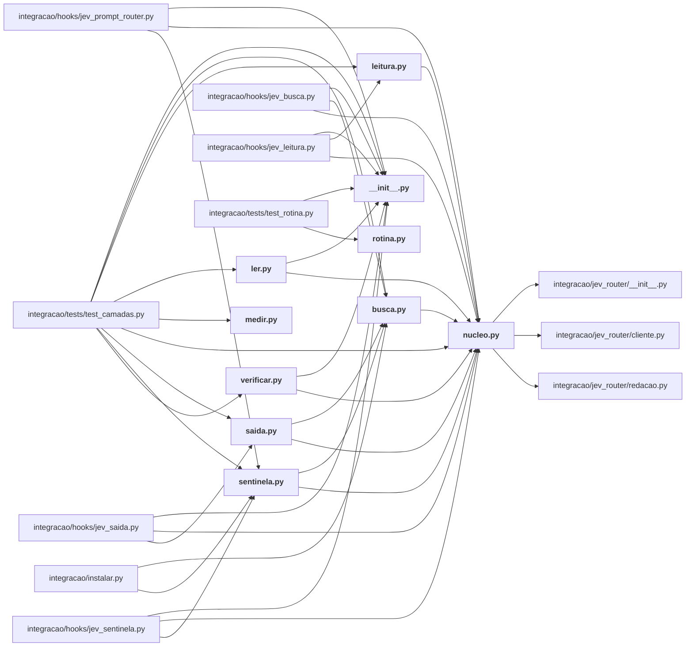

# integracao/camadas/

As camadas que decidem o que entra no contexto do modelo caro: leitura, busca, sentinela, saída, verificação, `ler` (skill /jev-ler), medição e rotina.

← [MAPA.md](../../MAPA.md) · pasta acima: [integracao](../../mapa/pastas/integracao.md) · abrir a pasta: [integracao/camadas/](../../integracao/camadas)

## Arquivos

| arquivo | tipo | tamanho | descrição |
|---|---|---:|---|
| [__init__.py](../../integracao/camadas/__init__.py) | código | 1 l. | As camadas do Jev no Claude Code: leitura, busca, sentinela e a ferramenta de leitura seletiva. |
| [busca.py](../../integracao/camadas/busca.py) | código | 187 l. | Camada de busca: depois de uma listagem com muitos itens, o Jev diz por onde começar. |
| [leitura.py](../../integracao/camadas/leitura.py) | código | 149 l. | Camada de leitura: antes de um `Read` grande, o Jev diz que parte do arquivo interessa. |
| [ler.py](../../integracao/camadas/ler.py) | código | 188 l. | Leitura seletiva: o agente pergunta, o Jev diz quais trechos entram no contexto. |
| [medir.py](../../integracao/camadas/medir.py) | código | 433 l. | A medição das camadas: o que o Jev poupou, custou e errou, recalculado do registro. |
| [nucleo.py](../../integracao/camadas/nucleo.py) | código | 249 l. | O que as camadas do Jev no Claude Code compartilham: pedido vigente, chamadas em paralelo, registro único e estimativa de tokens. |
| [rotina.py](../../integracao/camadas/rotina.py) | código | 111 l. | A rotina que mantém a medição viva sem ninguém lembrar de rodá-la. |
| [saida.py](../../integracao/camadas/saida.py) | código | 85 l. | Camada de saída: numa saída longa de comando com erro, o Jev aponta onde está a causa. |
| [sentinela.py](../../integracao/camadas/sentinela.py) | código | 75 l. | Camada sentinela: texto que veio de fora passa pela pergunta que detecta ordem ao sistema. |
| [verificar.py](../../integracao/camadas/verificar.py) | código | 126 l. | Verificação: a afirmação se sustenta na fonte? O Jev responde suportado, contradito ou não informado. |

## Grafo de imports e links

Nós em negrito são desta pasta; setas cheias são imports, tracejadas são links de documento.

## Ligações e conteúdo de cada arquivo

### __init__.py

- **é usado por** — import: [`integracao/camadas/ler.py`](../../integracao/camadas/ler.py), [`integracao/camadas/verificar.py`](../../integracao/camadas/verificar.py), [`integracao/hooks/jev_busca.py`](../../integracao/hooks/jev_busca.py), [`integracao/hooks/jev_leitura.py`](../../integracao/hooks/jev_leitura.py), [`integracao/hooks/jev_prompt_router.py`](../../integracao/hooks/jev_prompt_router.py), [`integracao/hooks/jev_saida.py`](../../integracao/hooks/jev_saida.py), [`integracao/hooks/jev_sentinela.py`](../../integracao/hooks/jev_sentinela.py), [`integracao/tests/test_camadas.py`](../../integracao/tests/test_camadas.py), [`integracao/tests/test_rotina.py`](../../integracao/tests/test_rotina.py)

### busca.py

- **usa** — import: [`integracao/camadas/nucleo.py`](../../integracao/camadas/nucleo.py)
- **é usado por** — import: [`integracao/camadas/saida.py`](../../integracao/camadas/saida.py), [`integracao/camadas/sentinela.py`](../../integracao/camadas/sentinela.py), [`integracao/hooks/jev_busca.py`](../../integracao/hooks/jev_busca.py), [`integracao/instalar.py`](../../integracao/instalar.py), [`integracao/tests/test_camadas.py`](../../integracao/tests/test_camadas.py)
- **conteúdo** — [texto_da_resposta](../../integracao/camadas/busca.py#L47) (l. 47), [agrupar](../../integracao/camadas/busca.py#L70) (l. 70), [_maior_lista_de_dicionarios](../../integracao/camadas/busca.py#L90) (l. 90), [itens_de_listagem](../../integracao/camadas/busca.py#L110) (l. 110), [candidatos](../../integracao/camadas/busca.py#L129) (l. 129), [analisar](../../integracao/camadas/busca.py#L138) (l. 138), [nota_para_o_agente](../../integracao/camadas/busca.py#L177) (l. 177)

### leitura.py

- **usa** — import: [`integracao/camadas/nucleo.py`](../../integracao/camadas/nucleo.py); citação: [`AGENTS.md`](../../AGENTS.md), [`executor/ledger.py`](../../executor/ledger.py)
- **é usado por** — import: [`integracao/hooks/jev_leitura.py`](../../integracao/hooks/jev_leitura.py), [`integracao/tests/test_camadas.py`](../../integracao/tests/test_camadas.py)
- **conteúdo** — [analisar](../../integracao/camadas/leitura.py#L54) (l. 54), [nota_para_o_agente](../../integracao/camadas/leitura.py#L141) (l. 141)

### ler.py

- **usa** — import: [`integracao/camadas/__init__.py`](../../integracao/camadas/__init__.py), [`integracao/camadas/nucleo.py`](../../integracao/camadas/nucleo.py); citação: [`executor/ledger.py`](../../executor/ledger.py), [`executor/shared.py`](../../executor/shared.py), [`laboratorio/nucleo.py`](../../laboratorio/nucleo.py)
- **é usado por** — import: [`integracao/tests/test_camadas.py`](../../integracao/tests/test_camadas.py); citação: [`AGENTS.md`](../../AGENTS.md)
- **conteúdo** — [candidatos_de](../../integracao/camadas/ler.py#L42) (l. 42), [candidatos_do_rg](../../integracao/camadas/ler.py#L69) (l. 69), [selecionar](../../integracao/camadas/ler.py#L105) (l. 105), [imprimir](../../integracao/camadas/ler.py#L136) (l. 136), [main](../../integracao/camadas/ler.py#L163) (l. 163)

### medir.py

- **usa** — citação: [`docs/CAMADAS-CLAUDE-CODE.md`](../../docs/CAMADAS-CLAUDE-CODE.md), [`integracao/avaliacao/camadas-medicao.json`](../../integracao/avaliacao/camadas-medicao.json)
- **é usado por** — import: [`integracao/tests/test_camadas.py`](../../integracao/tests/test_camadas.py); citação: [`docs/CAMADAS-CLAUDE-CODE.md`](../../docs/CAMADAS-CLAUDE-CODE.md), [`integracao/README.md`](../../integracao/README.md), [`integracao/camadas/rotina.py`](../../integracao/camadas/rotina.py)
- **conteúdo** — [_jsonl](../../integracao/camadas/medir.py#L42) (l. 42), [_mediana](../../integracao/camadas/medir.py#L54) (l. 54), [_p90](../../integracao/camadas/medir.py#L59) (l. 59), [leitura](../../integracao/camadas/medir.py#L64) (l. 64), [busca](../../integracao/camadas/medir.py#L114) (l. 114), [sentinela](../../integracao/camadas/medir.py#L144) (l. 144), [saida](../../integracao/camadas/medir.py#L161) (l. 161), [verificar](../../integracao/camadas/medir.py#L178) (l. 178), [ler](../../integracao/camadas/medir.py#L192) (l. 192), [roteador_e_guarda](../../integracao/camadas/medir.py#L208) (l. 208), [medir](../../integracao/camadas/medir.py#L231) (l. 231), [_rotina](../../integracao/camadas/medir.py#L256) (l. 256), [n](../../integracao/camadas/medir.py#L266) (l. 266), [pagina](../../integracao/camadas/medir.py#L274) (l. 274), [main](../../integracao/camadas/medir.py#L418) (l. 418)

### nucleo.py

- **usa** — import: [`integracao/jev_router/__init__.py`](../../integracao/jev_router/__init__.py), [`integracao/jev_router/cliente.py`](../../integracao/jev_router/cliente.py), [`integracao/jev_router/redacao.py`](../../integracao/jev_router/redacao.py); citação: [`docs/CAMADAS-CLAUDE-CODE.md`](../../docs/CAMADAS-CLAUDE-CODE.md)
- **é usado por** — import: [`integracao/camadas/busca.py`](../../integracao/camadas/busca.py), [`integracao/camadas/leitura.py`](../../integracao/camadas/leitura.py), [`integracao/camadas/ler.py`](../../integracao/camadas/ler.py), [`integracao/camadas/saida.py`](../../integracao/camadas/saida.py), [`integracao/camadas/sentinela.py`](../../integracao/camadas/sentinela.py), [`integracao/camadas/verificar.py`](../../integracao/camadas/verificar.py), [`integracao/hooks/jev_busca.py`](../../integracao/hooks/jev_busca.py), [`integracao/hooks/jev_leitura.py`](../../integracao/hooks/jev_leitura.py), [`integracao/hooks/jev_prompt_router.py`](../../integracao/hooks/jev_prompt_router.py), [`integracao/hooks/jev_saida.py`](../../integracao/hooks/jev_saida.py), [`integracao/hooks/jev_sentinela.py`](../../integracao/hooks/jev_sentinela.py), [`integracao/tests/test_camadas.py`](../../integracao/tests/test_camadas.py)
- **conteúdo** — [modo_vigente](../../integracao/camadas/nucleo.py#L68) (l. 68), [registrar](../../integracao/camadas/nucleo.py#L79) (l. 79), [tokens](../../integracao/camadas/nucleo.py#L91) (l. 91), [dec](../../integracao/camadas/nucleo.py#L95) (l. 95), [arquivo_da_sessao](../../integracao/camadas/nucleo.py#L104) (l. 104), [guardar_pedido](../../integracao/camadas/nucleo.py#L108) (l. 108), [pedido_vigente](../../integracao/camadas/nucleo.py#L125) (l. 125), [_pedido_do_transcript](../../integracao/camadas/nucleo.py#L145) (l. 145), [classificar_em_paralelo](../../integracao/camadas/nucleo.py#L176) (l. 176), [resumo_das_chamadas](../../integracao/camadas/nucleo.py#L198) (l. 198), [dividir_em_blocos](../../integracao/camadas/nucleo.py#L215) (l. 215), [estado_do_trecho](../../integracao/camadas/nucleo.py#L243) (l. 243), [escolha](../../integracao/camadas/nucleo.py#L247) (l. 247)

### rotina.py

- **usa** — citação: [`docs/AUDITORIA-DE-NUMEROS.md`](../../docs/AUDITORIA-DE-NUMEROS.md), [`docs/BATERIA-COMPLEMENTAR.md`](../../docs/BATERIA-COMPLEMENTAR.md), [`docs/CAMADAS-CLAUDE-CODE.md`](../../docs/CAMADAS-CLAUDE-CODE.md), [`docs/CEM-HIPOTESES.md`](../../docs/CEM-HIPOTESES.md), [`docs/CEM-PERGUNTAS-ESTRATEGICAS.md`](../../docs/CEM-PERGUNTAS-ESTRATEGICAS.md), [`docs/DOSSIE-DE-EVIDENCIAS.md`](../../docs/DOSSIE-DE-EVIDENCIAS.md), [`docs/GUIA-PRATICO-JEV.md`](../../docs/GUIA-PRATICO-JEV.md), [`integracao/avaliacao/camadas-medicao.json`](../../integracao/avaliacao/camadas-medicao.json), [`integracao/camadas/medir.py`](../../integracao/camadas/medir.py), [`laboratorio/auditoria.py`](../../laboratorio/auditoria.py), [`laboratorio/conciliar_caixa.py`](../../laboratorio/conciliar_caixa.py), [`laboratorio/gerar_bateria.py`](../../laboratorio/gerar_bateria.py), [`laboratorio/gerar_dossie.py`](../../laboratorio/gerar_dossie.py), [`runs/extrato-ledger.json`](../../runs/extrato-ledger.json)
- **é usado por** — import: [`integracao/tests/test_rotina.py`](../../integracao/tests/test_rotina.py); citação: [`integracao/README.md`](../../integracao/README.md), [`integracao/instalar.py`](../../integracao/instalar.py)
- **conteúdo** — [_log](../../integracao/camadas/rotina.py#L52) (l. 52), [_rodar](../../integracao/camadas/rotina.py#L58) (l. 58), [_commit](../../integracao/camadas/rotina.py#L68) (l. 68), [executar](../../integracao/camadas/rotina.py#L83) (l. 83), [main](../../integracao/camadas/rotina.py#L101) (l. 101)

### saida.py

- **usa** — import: [`integracao/camadas/busca.py`](../../integracao/camadas/busca.py), [`integracao/camadas/nucleo.py`](../../integracao/camadas/nucleo.py); citação: [`executor/assist.py`](../../executor/assist.py)
- **é usado por** — import: [`integracao/hooks/jev_saida.py`](../../integracao/hooks/jev_saida.py), [`integracao/tests/test_camadas.py`](../../integracao/tests/test_camadas.py)
- **conteúdo** — [analisar](../../integracao/camadas/saida.py#L46) (l. 46), [nota_para_o_agente](../../integracao/camadas/saida.py#L79) (l. 79)

### sentinela.py

- **usa** — import: [`integracao/camadas/busca.py`](../../integracao/camadas/busca.py), [`integracao/camadas/nucleo.py`](../../integracao/camadas/nucleo.py)
- **é usado por** — import: [`integracao/hooks/jev_prompt_router.py`](../../integracao/hooks/jev_prompt_router.py), [`integracao/hooks/jev_sentinela.py`](../../integracao/hooks/jev_sentinela.py), [`integracao/instalar.py`](../../integracao/instalar.py), [`integracao/tests/test_camadas.py`](../../integracao/tests/test_camadas.py)
- **conteúdo** — [partes_de](../../integracao/camadas/sentinela.py#L36) (l. 36), [analisar](../../integracao/camadas/sentinela.py#L41) (l. 41), [nota_para_o_agente](../../integracao/camadas/sentinela.py#L69) (l. 69)

### verificar.py

- **usa** — import: [`integracao/camadas/__init__.py`](../../integracao/camadas/__init__.py), [`integracao/camadas/nucleo.py`](../../integracao/camadas/nucleo.py); citação: [`integracao/jev_router/orcamento.py`](../../integracao/jev_router/orcamento.py)
- **é usado por** — import: [`integracao/tests/test_camadas.py`](../../integracao/tests/test_camadas.py)
- **conteúdo** — [ler_fonte](../../integracao/camadas/verificar.py#L47) (l. 47), [verificar](../../integracao/camadas/verificar.py#L65) (l. 65), [main](../../integracao/camadas/verificar.py#L91) (l. 91)
