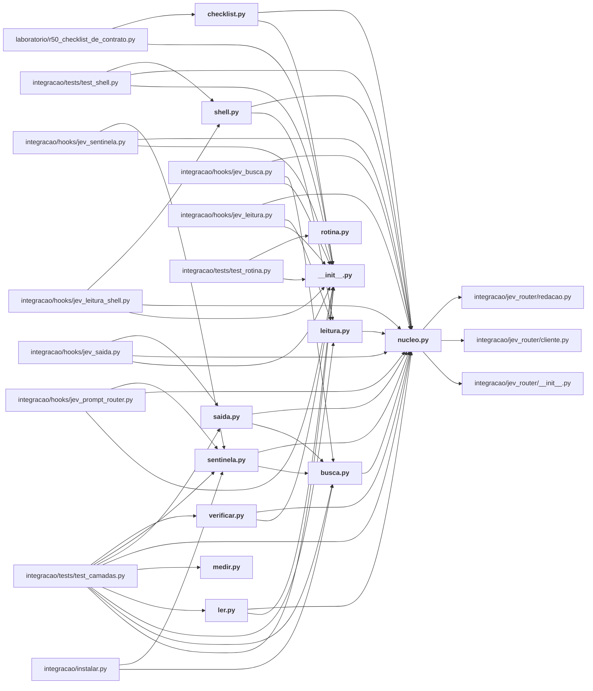

# integracao/camadas/

As camadas que decidem o que entra no contexto do modelo caro: leitura, busca, sentinela, saída, verificação, `ler` (skill /jev-ler), medição e rotina.

← [MAPA.md](../../MAPA.md) · pasta acima: [integracao](../../mapa/pastas/integracao.md) · abrir a pasta: [integracao/camadas/](../../integracao/camadas)

## Subpastas

| subpasta | arquivos | finalidade |
|---|---:|---|
| [listas/](../../mapa/pastas/integracao__camadas__listas.md) | 1 |  |

## Arquivos

| arquivo | tipo | tamanho | descrição |
|---|---|---:|---|
| [__init__.py](../../integracao/camadas/__init__.py) | código | 1 l. | As camadas do Jev no Claude Code: leitura, busca, sentinela e a ferramenta de leitura seletiva. |
| [busca.py](../../integracao/camadas/busca.py) | código | 187 l. | Camada de busca: depois de uma listagem com muitos itens, o Jev diz por onde começar. |
| [checklist.py](../../integracao/camadas/checklist.py) | código | 200 l. | Checklist: um documento, uma lista fixa de perguntas, um semáforo por item — numa chamada só. |
| [leitura.py](../../integracao/camadas/leitura.py) | código | 149 l. | Camada de leitura: antes de um `Read` grande, o Jev diz que parte do arquivo interessa. |
| [ler.py](../../integracao/camadas/ler.py) | código | 188 l. | Leitura seletiva: o agente pergunta, o Jev diz quais trechos entram no contexto. |
| [medir.py](../../integracao/camadas/medir.py) | código | 441 l. | A medição das camadas: o que o Jev poupou, custou e errou, recalculado do registro. |
| [nucleo.py](../../integracao/camadas/nucleo.py) | código | 257 l. | O que as camadas do Jev no Claude Code compartilham: pedido vigente, chamadas em paralelo, registro único e estimativa de tokens. |
| [rotina.py](../../integracao/camadas/rotina.py) | código | 122 l. | A rotina que mantém a medição viva sem ninguém lembrar de rodá-la. |
| [saida.py](../../integracao/camadas/saida.py) | código | 92 l. | Camada de saída: numa saída longa de comando com erro, o Jev aponta onde está a causa. |
| [sentinela.py](../../integracao/camadas/sentinela.py) | código | 75 l. | Camada sentinela: texto que veio de fora passa pela pergunta que detecta ordem ao sistema. |
| [shell.py](../../integracao/camadas/shell.py) | código | 217 l. | Camada de leitura pelo shell: o mesmo filtro do `Read`, na porta por onde o texto entra. |
| [verificar.py](../../integracao/camadas/verificar.py) | código | 126 l. | Verificação: a afirmação se sustenta na fonte? O Jev responde suportado, contradito ou não informado. |

## Grafo de imports e links

Nós em negrito são desta pasta; setas cheias são imports, tracejadas são links de documento.

## Ligações e conteúdo de cada arquivo

### __init__.py

- **é usado por** — import: [`integracao/camadas/checklist.py`](../../integracao/camadas/checklist.py), [`integracao/camadas/ler.py`](../../integracao/camadas/ler.py), [`integracao/camadas/verificar.py`](../../integracao/camadas/verificar.py), [`integracao/hooks/jev_busca.py`](../../integracao/hooks/jev_busca.py), [`integracao/hooks/jev_leitura.py`](../../integracao/hooks/jev_leitura.py), [`integracao/hooks/jev_leitura_shell.py`](../../integracao/hooks/jev_leitura_shell.py), [`integracao/hooks/jev_prompt_router.py`](../../integracao/hooks/jev_prompt_router.py), [`integracao/hooks/jev_saida.py`](../../integracao/hooks/jev_saida.py), [`integracao/hooks/jev_sentinela.py`](../../integracao/hooks/jev_sentinela.py), [`integracao/tests/test_camadas.py`](../../integracao/tests/test_camadas.py), [`integracao/tests/test_rotina.py`](../../integracao/tests/test_rotina.py), [`integracao/tests/test_shell.py`](../../integracao/tests/test_shell.py), [`laboratorio/r50_checklist_de_contrato.py`](../../laboratorio/r50_checklist_de_contrato.py)
- **parecidos (julgados pelo Jev)** — [`docs/CAMADAS-CLAUDE-CODE.md`](../../docs/CAMADAS-CLAUDE-CODE.md) (complementar, 0.41), [`integracao/camadas/medir.py`](../../integracao/camadas/medir.py) (complementar, 0.30), [`integracao/jev_router/politica.py`](../../integracao/jev_router/politica.py) (complementar, 0.25), [R46](../../mapa/conhecimento/rodadas.md#r46) (complementar, 0.24), [`hermes/jev_hermes/camadas.py`](../../hermes/jev_hermes/camadas.py) (complementar, 0.24)

### busca.py

- **usa** — import: [`integracao/camadas/nucleo.py`](../../integracao/camadas/nucleo.py)
- **é usado por** — import: [`integracao/camadas/saida.py`](../../integracao/camadas/saida.py), [`integracao/camadas/sentinela.py`](../../integracao/camadas/sentinela.py), [`integracao/hooks/jev_busca.py`](../../integracao/hooks/jev_busca.py), [`integracao/instalar.py`](../../integracao/instalar.py), [`integracao/tests/test_camadas.py`](../../integracao/tests/test_camadas.py)
- **chama de outros arquivos** — [`nucleo.classificar_em_paralelo`](../../integracao/camadas/nucleo.py#L176), [`nucleo.escolha`](../../integracao/camadas/nucleo.py#L255), [`nucleo.estado_do_trecho`](../../integracao/camadas/nucleo.py#L251), [`nucleo.resumo_das_chamadas`](../../integracao/camadas/nucleo.py#L206)
- **parecidos (julgados pelo Jev)** — [R43](../../mapa/conhecimento/rodadas.md#r43) (complementar, 0.46), [`integracao/camadas/leitura.py`](../../integracao/camadas/leitura.py) (complementar, 0.34), [R38](../../mapa/conhecimento/rodadas.md#r38) (complementar, 0.28), [`integracao/camadas/ler.py`](../../integracao/camadas/ler.py) (complementar, 0.23), [`integracao/camadas/shell.py`](../../integracao/camadas/shell.py) (não julgado, 0.23)
- **menciona 2 conceitos** — [E1](../../mapa/conhecimento/experimentos.md#e1) (1×), [E16](../../mapa/conhecimento/experimentos.md#e16) (1×)
- **conteúdo** — [texto_da_resposta](../../integracao/camadas/busca.py#L47) (l. 47; usado em 3), [agrupar](../../integracao/camadas/busca.py#L70) (l. 70; usado em 1), [_maior_lista_de_dicionarios](../../integracao/camadas/busca.py#L90) (l. 90), [itens_de_listagem](../../integracao/camadas/busca.py#L110) (l. 110; usado em 1), [candidatos](../../integracao/camadas/busca.py#L129) (l. 129), [analisar](../../integracao/camadas/busca.py#L138) (l. 138; usado em 2), [nota_para_o_agente](../../integracao/camadas/busca.py#L177) (l. 177; usado em 2)

### checklist.py

- **usa** — import: [`integracao/camadas/__init__.py`](../../integracao/camadas/__init__.py), [`integracao/camadas/nucleo.py`](../../integracao/camadas/nucleo.py)
- **é usado por** — import: [`laboratorio/r50_checklist_de_contrato.py`](../../laboratorio/r50_checklist_de_contrato.py); citação: [`docs/ESSENCIA-DO-JEV.md`](../../docs/ESSENCIA-DO-JEV.md), [`hermes/jev_hermes/checklist.py`](../../hermes/jev_hermes/checklist.py), [`integracao/skill/jev-completo/SKILL.md`](../../integracao/skill/jev-completo/SKILL.md)
- **chama de outros arquivos** — [`nucleo.classificar_em_paralelo`](../../integracao/camadas/nucleo.py#L176), [`nucleo.dec`](../../integracao/camadas/nucleo.py#L95), [`nucleo.registrar`](../../integracao/camadas/nucleo.py#L79), [`nucleo.resumo_das_chamadas`](../../integracao/camadas/nucleo.py#L206)
- **parecidos (julgados pelo Jev)** — [R38](../../mapa/conhecimento/rodadas.md#r38) (complementar, 0.34), [R43](../../mapa/conhecimento/rodadas.md#r43) (complementar, 0.26), [R45](../../mapa/conhecimento/rodadas.md#r45) (complementar, 0.20)
- **menciona 7 conceitos** — [R13](../../mapa/conhecimento/rodadas.md#r13) (1×), [R28](../../mapa/conhecimento/rodadas.md#r28) (1×), [R31](../../mapa/conhecimento/rodadas.md#r31) (1×), [R32](../../mapa/conhecimento/rodadas.md#r32) (1×), [R33](../../mapa/conhecimento/rodadas.md#r33) (1×), [R49](../../mapa/conhecimento/rodadas.md#r49) (1×), [R50](../../mapa/conhecimento/rodadas.md#r50) (1×)
- **conteúdo** — [carregar_lista](../../integracao/camadas/checklist.py#L49) (l. 49; usado em 1), [validar_lista](../../integracao/camadas/checklist.py#L58) (l. 58), [perguntas_da](../../integracao/camadas/checklist.py#L92) (l. 92; usado em 1), [ler_item](../../integracao/camadas/checklist.py#L107) (l. 107; usado em 1), [probabilidade_valida](../../integracao/camadas/checklist.py#L127) (l. 127), [semaforo](../../integracao/camadas/checklist.py#L131) (l. 131; usado em 1), [auditar](../../integracao/camadas/checklist.py#L141) (l. 141), [main](../../integracao/camadas/checklist.py#L168) (l. 168)

### leitura.py

- **usa** — import: [`integracao/camadas/nucleo.py`](../../integracao/camadas/nucleo.py); citação: [`AGENTS.md`](../../AGENTS.md), [`executor/ledger.py`](../../executor/ledger.py)
- **é usado por** — import: [`integracao/camadas/shell.py`](../../integracao/camadas/shell.py), [`integracao/hooks/jev_leitura.py`](../../integracao/hooks/jev_leitura.py), [`integracao/tests/test_camadas.py`](../../integracao/tests/test_camadas.py)
- **chama de outros arquivos** — [`nucleo.classificar_em_paralelo`](../../integracao/camadas/nucleo.py#L176), [`nucleo.dividir_em_blocos`](../../integracao/camadas/nucleo.py#L223), [`nucleo.escolha`](../../integracao/camadas/nucleo.py#L255), [`nucleo.estado_do_trecho`](../../integracao/camadas/nucleo.py#L251), [`nucleo.resumo_das_chamadas`](../../integracao/camadas/nucleo.py#L206), [`nucleo.tokens`](../../integracao/camadas/nucleo.py#L91)
- **parecidos (julgados pelo Jev)** — [`integracao/camadas/sentinela.py`](../../integracao/camadas/sentinela.py) (complementar, 0.43), [`integracao/camadas/busca.py`](../../integracao/camadas/busca.py) (complementar, 0.34), [`integracao/camadas/saida.py`](../../integracao/camadas/saida.py) (complementar, 0.31), [`integracao/camadas/ler.py`](../../integracao/camadas/ler.py) (mesmo assunto, 0.26)
- **menciona 3 conceitos** — [R26](../../mapa/conhecimento/rodadas.md#r26) (3×), [R18](../../mapa/conhecimento/rodadas.md#r18) (1×), [R20](../../mapa/conhecimento/rodadas.md#r20) (1×)
- **conteúdo** — [analisar](../../integracao/camadas/leitura.py#L54) (l. 54; usado em 3), [nota_para_o_agente](../../integracao/camadas/leitura.py#L141) (l. 141; usado em 2)

### ler.py

- **usa** — import: [`integracao/camadas/__init__.py`](../../integracao/camadas/__init__.py), [`integracao/camadas/nucleo.py`](../../integracao/camadas/nucleo.py); citação: [`executor/ledger.py`](../../executor/ledger.py), [`executor/shared.py`](../../executor/shared.py), [`laboratorio/nucleo.py`](../../laboratorio/nucleo.py)
- **é usado por** — import: [`integracao/tests/test_camadas.py`](../../integracao/tests/test_camadas.py); citação: [`AGENTS.md`](../../AGENTS.md), [`integracao/skill/jev-completo/SKILL.md`](../../integracao/skill/jev-completo/SKILL.md)
- **chama de outros arquivos** — [`nucleo.classificar_em_paralelo`](../../integracao/camadas/nucleo.py#L176), [`nucleo.dec`](../../integracao/camadas/nucleo.py#L95), [`nucleo.dividir_em_blocos`](../../integracao/camadas/nucleo.py#L223), [`nucleo.escolha`](../../integracao/camadas/nucleo.py#L255), [`nucleo.estado_do_trecho`](../../integracao/camadas/nucleo.py#L251), [`nucleo.registrar`](../../integracao/camadas/nucleo.py#L79), [`nucleo.resumo_das_chamadas`](../../integracao/camadas/nucleo.py#L206), [`nucleo.tokens`](../../integracao/camadas/nucleo.py#L91)
- **parecidos (julgados pelo Jev)** — [R43](../../mapa/conhecimento/rodadas.md#r43) (complementar, 0.32), [`integracao/camadas/leitura.py`](../../integracao/camadas/leitura.py) (mesmo assunto, 0.26), [`integracao/camadas/busca.py`](../../integracao/camadas/busca.py) (complementar, 0.23), [R38](../../mapa/conhecimento/rodadas.md#r38) (não julgado, 0.21), [`planning/preregistro-E16-recuperacao.md`](../../planning/preregistro-E16-recuperacao.md) (complementar, 0.21)
- **menciona 1 conceito** — [R26](../../mapa/conhecimento/rodadas.md#r26) (1×)
- **conteúdo** — [candidatos_de](../../integracao/camadas/ler.py#L42) (l. 42), [candidatos_do_rg](../../integracao/camadas/ler.py#L69) (l. 69; usado em 1), [selecionar](../../integracao/camadas/ler.py#L105) (l. 105; usado em 1), [imprimir](../../integracao/camadas/ler.py#L136) (l. 136; usado em 1), [main](../../integracao/camadas/ler.py#L163) (l. 163)

### medir.py

- **usa** — citação: [`docs/CAMADAS-CLAUDE-CODE.md`](../../docs/CAMADAS-CLAUDE-CODE.md), [`integracao/avaliacao/camadas-medicao.json`](../../integracao/avaliacao/camadas-medicao.json)
- **é usado por** — import: [`integracao/tests/test_camadas.py`](../../integracao/tests/test_camadas.py); citação: [`docs/CAMADAS-CLAUDE-CODE.md`](../../docs/CAMADAS-CLAUDE-CODE.md), [`integracao/README.md`](../../integracao/README.md), [`integracao/camadas/rotina.py`](../../integracao/camadas/rotina.py), [`laboratorio/r45-lista-nas-duas-ordens-bruto.json`](../../laboratorio/r45-lista-nas-duas-ordens-bruto.json), [`laboratorio/r45-lista-nas-duas-ordens.json`](../../laboratorio/r45-lista-nas-duas-ordens.json)
- **parecidos (julgados pelo Jev)** — [`hermes/jev_hermes/medir.py`](../../hermes/jev_hermes/medir.py) (complementar, 0.32), [`integracao/camadas/__init__.py`](../../integracao/camadas/__init__.py) (complementar, 0.30), [`hermes/jev_hermes/camadas.py`](../../hermes/jev_hermes/camadas.py) (complementar, 0.20)
- **menciona 10 conceitos** — [E1](../../mapa/conhecimento/experimentos.md#e1) (2×), [E16](../../mapa/conhecimento/experimentos.md#e16) (2×), [R18](../../mapa/conhecimento/rodadas.md#r18) (2×), [R20](../../mapa/conhecimento/rodadas.md#r20) (2×), [R23](../../mapa/conhecimento/rodadas.md#r23) (2×), [R26](../../mapa/conhecimento/rodadas.md#r26) (2×), [E3](../../mapa/conhecimento/experimentos.md#e3) (1×), [E13](../../mapa/conhecimento/experimentos.md#e13) (1×), [R16](../../mapa/conhecimento/rodadas.md#r16) (1×), [R27](../../mapa/conhecimento/rodadas.md#r27) (1×)
- **conteúdo** — [_jsonl](../../integracao/camadas/medir.py#L42) (l. 42), [_mediana](../../integracao/camadas/medir.py#L54) (l. 54), [_p90](../../integracao/camadas/medir.py#L59) (l. 59), [leitura](../../integracao/camadas/medir.py#L64) (l. 64), [busca](../../integracao/camadas/medir.py#L120) (l. 120), [sentinela](../../integracao/camadas/medir.py#L150) (l. 150), [saida](../../integracao/camadas/medir.py#L167) (l. 167), [verificar](../../integracao/camadas/medir.py#L184) (l. 184), [ler](../../integracao/camadas/medir.py#L198) (l. 198), [roteador_e_guarda](../../integracao/camadas/medir.py#L214) (l. 214), [medir](../../integracao/camadas/medir.py#L237) (l. 237; usado em 1), [_rotina](../../integracao/camadas/medir.py#L262) (l. 262), [n](../../integracao/camadas/medir.py#L272) (l. 272), [pagina](../../integracao/camadas/medir.py#L280) (l. 280; usado em 1), [main](../../integracao/camadas/medir.py#L426) (l. 426)

### nucleo.py

- **usa** — import: [`integracao/jev_router/__init__.py`](../../integracao/jev_router/__init__.py), [`integracao/jev_router/cliente.py`](../../integracao/jev_router/cliente.py), [`integracao/jev_router/redacao.py`](../../integracao/jev_router/redacao.py); citação: [`docs/CAMADAS-CLAUDE-CODE.md`](../../docs/CAMADAS-CLAUDE-CODE.md)
- **é usado por** — import: [`integracao/camadas/busca.py`](../../integracao/camadas/busca.py), [`integracao/camadas/checklist.py`](../../integracao/camadas/checklist.py), [`integracao/camadas/leitura.py`](../../integracao/camadas/leitura.py), [`integracao/camadas/ler.py`](../../integracao/camadas/ler.py), [`integracao/camadas/saida.py`](../../integracao/camadas/saida.py), [`integracao/camadas/sentinela.py`](../../integracao/camadas/sentinela.py), [`integracao/camadas/shell.py`](../../integracao/camadas/shell.py), [`integracao/camadas/verificar.py`](../../integracao/camadas/verificar.py), [`integracao/hooks/jev_busca.py`](../../integracao/hooks/jev_busca.py), [`integracao/hooks/jev_leitura.py`](../../integracao/hooks/jev_leitura.py), [`integracao/hooks/jev_leitura_shell.py`](../../integracao/hooks/jev_leitura_shell.py), [`integracao/hooks/jev_prompt_router.py`](../../integracao/hooks/jev_prompt_router.py), [`integracao/hooks/jev_saida.py`](../../integracao/hooks/jev_saida.py), [`integracao/hooks/jev_sentinela.py`](../../integracao/hooks/jev_sentinela.py), [`integracao/tests/test_camadas.py`](../../integracao/tests/test_camadas.py), [`integracao/tests/test_shell.py`](../../integracao/tests/test_shell.py); citação: [`laboratorio/r45-lista-nas-duas-ordens-bruto.json`](../../laboratorio/r45-lista-nas-duas-ordens-bruto.json), [`laboratorio/r45-lista-nas-duas-ordens.json`](../../laboratorio/r45-lista-nas-duas-ordens.json)
- **chama de outros arquivos** — [`cliente.perguntar`](../../integracao/jev_router/cliente.py#L57), [`redacao.limpar`](../../integracao/jev_router/redacao.py#L43)
- **parecidos (julgados pelo Jev)** — [`hermes/jev_hermes/camadas.py`](../../hermes/jev_hermes/camadas.py) (complementar, 0.35), [`integracao/jev_router/roteador.py`](../../integracao/jev_router/roteador.py) (complementar, 0.26), [`hermes/jev_hermes/nucleo.py`](../../hermes/jev_hermes/nucleo.py) (complementar, 0.26), [`integracao/hooks/jev_guarda_comando.py`](../../integracao/hooks/jev_guarda_comando.py) (complementar, 0.21), [`integracao/avaliacao/amostrar_com_contexto.py`](../../integracao/avaliacao/amostrar_com_contexto.py) (complementar, 0.20)
- **conteúdo** — [modo_vigente](../../integracao/camadas/nucleo.py#L68) (l. 68; usado em 5), [registrar](../../integracao/camadas/nucleo.py#L79) (l. 79; usado em 10), [tokens](../../integracao/camadas/nucleo.py#L91) (l. 91; usado em 3), [dec](../../integracao/camadas/nucleo.py#L95) (l. 95; usado em 5), [arquivo_da_sessao](../../integracao/camadas/nucleo.py#L104) (l. 104; usado em 1), [guardar_pedido](../../integracao/camadas/nucleo.py#L108) (l. 108; usado em 2), [pedido_vigente](../../integracao/camadas/nucleo.py#L125) (l. 125; usado em 4), [_pedido_do_transcript](../../integracao/camadas/nucleo.py#L145) (l. 145), [classificar_em_paralelo](../../integracao/camadas/nucleo.py#L176) (l. 176; usado em 7), [resumo_das_chamadas](../../integracao/camadas/nucleo.py#L206) (l. 206; usado em 7), [dividir_em_blocos](../../integracao/camadas/nucleo.py#L223) (l. 223; usado em 2), [estado_do_trecho](../../integracao/camadas/nucleo.py#L251) (l. 251; usado em 3), [escolha](../../integracao/camadas/nucleo.py#L255) (l. 255; usado em 6)

### rotina.py

- **usa** — citação: [`docs/AUDITORIA-DE-NUMEROS.md`](../../docs/AUDITORIA-DE-NUMEROS.md), [`docs/BATERIA-COMPLEMENTAR.md`](../../docs/BATERIA-COMPLEMENTAR.md), [`docs/CAMADAS-CLAUDE-CODE.md`](../../docs/CAMADAS-CLAUDE-CODE.md), [`docs/CEM-HIPOTESES.md`](../../docs/CEM-HIPOTESES.md), [`docs/CEM-PERGUNTAS-ESTRATEGICAS.md`](../../docs/CEM-PERGUNTAS-ESTRATEGICAS.md), [`docs/DOSSIE-DE-EVIDENCIAS.md`](../../docs/DOSSIE-DE-EVIDENCIAS.md), [`docs/GUIA-PRATICO-JEV.md`](../../docs/GUIA-PRATICO-JEV.md), [`integracao/avaliacao/camadas-medicao.json`](../../integracao/avaliacao/camadas-medicao.json), [`integracao/camadas/medir.py`](../../integracao/camadas/medir.py), [`laboratorio/auditoria-placar.json`](../../laboratorio/auditoria-placar.json), [`laboratorio/auditoria.py`](../../laboratorio/auditoria.py), [`laboratorio/conciliar_caixa.py`](../../laboratorio/conciliar_caixa.py), [`laboratorio/gerar_bateria.py`](../../laboratorio/gerar_bateria.py), [`laboratorio/gerar_dossie.py`](../../laboratorio/gerar_dossie.py), [`runs/caixa-conciliado.json`](../../runs/caixa-conciliado.json), [`runs/extrato-ledger.json`](../../runs/extrato-ledger.json)
- **é usado por** — import: [`integracao/tests/test_rotina.py`](../../integracao/tests/test_rotina.py); citação: [`integracao/README.md`](../../integracao/README.md), [`integracao/instalar.py`](../../integracao/instalar.py)
- **parecidos (julgados pelo Jev)** — [`laboratorio/h100/avaliar.py`](../../laboratorio/h100/avaliar.py) (complementar, 0.22)
- **conteúdo** — [_log](../../integracao/camadas/rotina.py#L59) (l. 59), [_rodar](../../integracao/camadas/rotina.py#L65) (l. 65), [_commit](../../integracao/camadas/rotina.py#L75) (l. 75), [executar](../../integracao/camadas/rotina.py#L90) (l. 90; usado em 1), [main](../../integracao/camadas/rotina.py#L112) (l. 112)

### saida.py

- **usa** — import: [`integracao/camadas/busca.py`](../../integracao/camadas/busca.py), [`integracao/camadas/nucleo.py`](../../integracao/camadas/nucleo.py); citação: [`executor/assist.py`](../../executor/assist.py)
- **é usado por** — import: [`integracao/hooks/jev_saida.py`](../../integracao/hooks/jev_saida.py), [`integracao/tests/test_camadas.py`](../../integracao/tests/test_camadas.py)
- **chama de outros arquivos** — [`busca.texto_da_resposta`](../../integracao/camadas/busca.py#L47), [`nucleo.classificar_em_paralelo`](../../integracao/camadas/nucleo.py#L176), [`nucleo.dec`](../../integracao/camadas/nucleo.py#L95), [`nucleo.escolha`](../../integracao/camadas/nucleo.py#L255), [`nucleo.resumo_das_chamadas`](../../integracao/camadas/nucleo.py#L206)
- **parecidos (julgados pelo Jev)** — [`integracao/camadas/leitura.py`](../../integracao/camadas/leitura.py) (complementar, 0.31), [`integracao/camadas/sentinela.py`](../../integracao/camadas/sentinela.py) (complementar, 0.28), [`integracao/camadas/shell.py`](../../integracao/camadas/shell.py) (não julgado, 0.28), [H081](../../mapa/conhecimento/hipoteses.md#h081) (complementar, 0.22)
- **conteúdo** — [analisar](../../integracao/camadas/saida.py#L53) (l. 53; usado em 2), [nota_para_o_agente](../../integracao/camadas/saida.py#L86) (l. 86; usado em 2)

### sentinela.py

- **usa** — import: [`integracao/camadas/busca.py`](../../integracao/camadas/busca.py), [`integracao/camadas/nucleo.py`](../../integracao/camadas/nucleo.py)
- **é usado por** — import: [`integracao/hooks/jev_prompt_router.py`](../../integracao/hooks/jev_prompt_router.py), [`integracao/hooks/jev_sentinela.py`](../../integracao/hooks/jev_sentinela.py), [`integracao/instalar.py`](../../integracao/instalar.py), [`integracao/tests/test_camadas.py`](../../integracao/tests/test_camadas.py); citação: [`laboratorio/r43-tamanho-da-lista-bruto.json`](../../laboratorio/r43-tamanho-da-lista-bruto.json), [`laboratorio/r43-tamanho-da-lista.json`](../../laboratorio/r43-tamanho-da-lista.json)
- **chama de outros arquivos** — [`busca.texto_da_resposta`](../../integracao/camadas/busca.py#L47), [`nucleo.classificar_em_paralelo`](../../integracao/camadas/nucleo.py#L176), [`nucleo.dec`](../../integracao/camadas/nucleo.py#L95), [`nucleo.escolha`](../../integracao/camadas/nucleo.py#L255), [`nucleo.resumo_das_chamadas`](../../integracao/camadas/nucleo.py#L206)
- **parecidos (julgados pelo Jev)** — [`integracao/camadas/leitura.py`](../../integracao/camadas/leitura.py) (complementar, 0.43), [`integracao/camadas/shell.py`](../../integracao/camadas/shell.py) (não julgado, 0.29), [`integracao/camadas/saida.py`](../../integracao/camadas/saida.py) (complementar, 0.28), [Q043](../../mapa/conhecimento/perguntas.md#q043) (mesmo assunto, 0.24)
- **menciona 2 conceitos** — [R23](../../mapa/conhecimento/rodadas.md#r23) (2×), [R27](../../mapa/conhecimento/rodadas.md#r27) (1×)
- **conteúdo** — [partes_de](../../integracao/camadas/sentinela.py#L36) (l. 36), [analisar](../../integracao/camadas/sentinela.py#L41) (l. 41; usado em 3), [nota_para_o_agente](../../integracao/camadas/sentinela.py#L69) (l. 69; usado em 3)

### shell.py

- **usa** — import: [`integracao/camadas/leitura.py`](../../integracao/camadas/leitura.py), [`integracao/camadas/nucleo.py`](../../integracao/camadas/nucleo.py)
- **é usado por** — import: [`integracao/hooks/jev_leitura_shell.py`](../../integracao/hooks/jev_leitura_shell.py), [`integracao/tests/test_shell.py`](../../integracao/tests/test_shell.py)
- **chama de outros arquivos** — [`leitura.analisar`](../../integracao/camadas/leitura.py#L54)
- **parecidos (julgados pelo Jev)** — [`integracao/camadas/sentinela.py`](../../integracao/camadas/sentinela.py) (não julgado, 0.29), [`integracao/camadas/saida.py`](../../integracao/camadas/saida.py) (não julgado, 0.28), [`integracao/camadas/busca.py`](../../integracao/camadas/busca.py) (não julgado, 0.23), [`integracao/hooks/jev_leitura.py`](../../integracao/hooks/jev_leitura.py) (não julgado, 0.22), [`docs/CAMADAS-CLAUDE-CODE.md`](../../docs/CAMADAS-CLAUDE-CODE.md) (não julgado, 0.21)
- **conteúdo** — [dividir](../../integracao/camadas/shell.py#L38) (l. 38; usado em 2), [_caminho](../../integracao/camadas/shell.py#L80) (l. 80), [interpretar](../../integracao/camadas/shell.py#L95) (l. 95; usado em 1), [_linhas](../../integracao/camadas/shell.py#L132) (l. 132), [analisar](../../integracao/camadas/shell.py#L142) (l. 142; usado em 2), [nota_para_o_agente](../../integracao/camadas/shell.py#L207) (l. 207; usado em 2)

### verificar.py

- **usa** — import: [`integracao/camadas/__init__.py`](../../integracao/camadas/__init__.py), [`integracao/camadas/nucleo.py`](../../integracao/camadas/nucleo.py); citação: [`integracao/jev_router/orcamento.py`](../../integracao/jev_router/orcamento.py)
- **é usado por** — import: [`integracao/tests/test_camadas.py`](../../integracao/tests/test_camadas.py); citação: [`integracao/skill/jev-completo/SKILL.md`](../../integracao/skill/jev-completo/SKILL.md)
- **chama de outros arquivos** — [`nucleo.classificar_em_paralelo`](../../integracao/camadas/nucleo.py#L176), [`nucleo.dec`](../../integracao/camadas/nucleo.py#L95), [`nucleo.escolha`](../../integracao/camadas/nucleo.py#L255), [`nucleo.registrar`](../../integracao/camadas/nucleo.py#L79), [`nucleo.resumo_das_chamadas`](../../integracao/camadas/nucleo.py#L206)
- **parecidos (julgados pelo Jev)** — [E4](../../mapa/conhecimento/experimentos.md#e4) (complementar, 0.21)
- **menciona 1 conceito** — [E3](../../mapa/conhecimento/experimentos.md#e3) (1×)
- **conteúdo** — [ler_fonte](../../integracao/camadas/verificar.py#L47) (l. 47), [verificar](../../integracao/camadas/verificar.py#L65) (l. 65; usado em 1), [main](../../integracao/camadas/verificar.py#L91) (l. 91)
