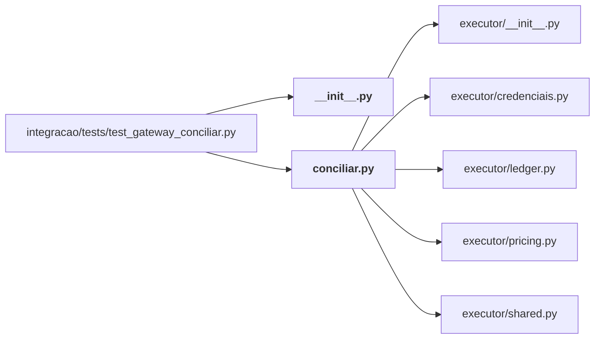

# integracao/gateway/

← [MAPA.md](../../MAPA.md) · pasta acima: [integracao](../../mapa/pastas/integracao.md) · abrir a pasta: [integracao/gateway/](../../integracao/gateway)

## Arquivos

| arquivo | tipo | tamanho | descrição |
|---|---|---:|---|
| [PARA-O-AUTOR.md](../../integracao/gateway/PARA-O-AUTOR.md) | doc | 55 l. | Duas contribuições prontas para o repositório vinilana/jev-gateway — Rascunhos de issue, em inglês porque o repositório é em inglês. Não foram enviados: enviar… |
| [__init__.py](../../integracao/gateway/__init__.py) | código | 0 B | Script Python |
| [conciliar.py](../../integracao/gateway/conciliar.py) | código | 227 l. | Concilia o gasto do jev-gateway com o livro-caixa e resume o que ele decidiu. |

## Grafo de imports e links

Nós em negrito são desta pasta; setas cheias são imports, tracejadas são links de documento.

## Ligações e conteúdo de cada arquivo

### PARA-O-AUTOR.md

- **parecidos (julgados pelo Jev)** — [`integracao/harness/agent_client.py`](../../integracao/harness/agent_client.py) (não julgado, 0.25), [`docs/JEV-GATEWAY.md`](../../docs/JEV-GATEWAY.md) (não julgado, 0.24), [E16](../../mapa/conhecimento/experimentos.md#e16) (não julgado, 0.22)
- **conteúdo** — 1. Windows: `jev-claude`/`jev-codex` fail with `spawn claude ENOENT` (l. 6), 2. Same request retried by the client is re-scored by Jev every time (l. 27), 3. (nota, não issue) O que observamos e pode interessar ao autor (l. 49)

### __init__.py

- **é usado por** — import: [`integracao/tests/test_gateway_conciliar.py`](../../integracao/tests/test_gateway_conciliar.py)

### conciliar.py

- **usa** — import: [`executor/__init__.py`](../../executor/__init__.py), [`executor/credenciais.py`](../../executor/credenciais.py), [`executor/ledger.py`](../../executor/ledger.py), [`executor/pricing.py`](../../executor/pricing.py), [`executor/shared.py`](../../executor/shared.py)
- **é usado por** — import: [`integracao/tests/test_gateway_conciliar.py`](../../integracao/tests/test_gateway_conciliar.py); citação: [`docs/JEV-GATEWAY.md`](../../docs/JEV-GATEWAY.md), [`integracao/camadas/rotina.py`](../../integracao/camadas/rotina.py), [`integracao/skill/jev-completo/SKILL.md`](../../integracao/skill/jev-completo/SKILL.md)
- **chama de outros arquivos** — [`ledger.Ledger`](../../executor/ledger.py#L32), [`pricing.load_prices`](../../executor/pricing.py#L18), [`pricing.observed_nusd`](../../executor/pricing.py#L65), [`pricing.usd_to_nusd`](../../executor/pricing.py#L74), [`shared.ask`](../../executor/shared.py#L152), [`shared.import_legacy`](../../executor/shared.py#L94)
- **parecidos (julgados pelo Jev)** — [`laboratorio/caixa.py`](../../laboratorio/caixa.py) (não julgado, 0.34), [`laboratorio/conciliar_caixa.py`](../../laboratorio/conciliar_caixa.py) (não julgado, 0.34), [`integracao/jev_router/orcamento.py`](../../integracao/jev_router/orcamento.py) (não julgado, 0.33), [`executor/exportar_extrato.py`](../../executor/exportar_extrato.py) (não julgado, 0.25)
- **conteúdo** — [eventos_do_log](../../integracao/gateway/conciliar.py#L44) (l. 44), [custo_nusd](../../integracao/gateway/conciliar.py#L61) (l. 61), [linha_de_gasto](../../integracao/gateway/conciliar.py#L68) (l. 68), [_ler_estado](../../integracao/gateway/conciliar.py#L83) (l. 83), [_assinatura](../../integracao/gateway/conciliar.py#L90) (l. 90), [novas_linhas](../../integracao/gateway/conciliar.py#L95) (l. 95; usado em 1), [anexar](../../integracao/gateway/conciliar.py#L119) (l. 119), [importar_no_livro_caixa](../../integracao/gateway/conciliar.py#L125) (l. 125), [desligar_roteamento](../../integracao/gateway/conciliar.py#L137) (l. 137), [relatorio](../../integracao/gateway/conciliar.py#L151) (l. 151; usado em 1), [conciliar](../../integracao/gateway/conciliar.py#L178) (l. 178), [main](../../integracao/gateway/conciliar.py#L192) (l. 192)
