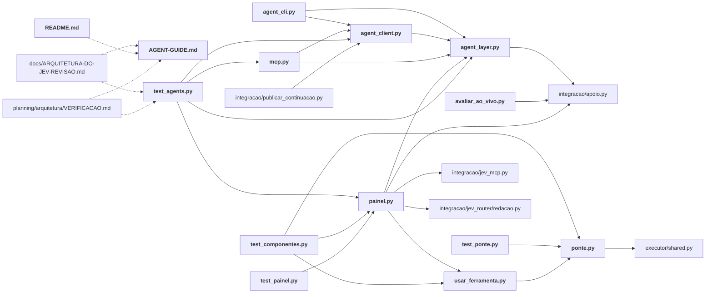

# integracao/harness/

← [MAPA.md](../../MAPA.md) · pasta acima: [integracao](../../mapa/pastas/integracao.md) · abrir a pasta: [integracao/harness/](../../integracao/harness)

## Subpastas

| subpasta | arquivos | finalidade |
|---|---:|---|
| [fixtures/](../../mapa/pastas/integracao__harness__fixtures.md) | 1 |  |
| [patches/](../../mapa/pastas/integracao__harness__patches.md) | 2 |  |
| [skill/](../../mapa/pastas/integracao__harness__skill.md) | 1 |  |
| [web/](../../mapa/pastas/integracao__harness__web.md) | 3 |  |

## Arquivos

| arquivo | tipo | tamanho | descrição |
|---|---|---:|---|
| [AGENT-GUIDE.md](../../integracao/harness/AGENT-GUIDE.md) | doc | 87 l. | JEV Harness — contrato de operação para agentes — Você opera um executor local no computador do usuário. MCP e CLI usam o mesmo serviço que a interface HTML. N… |
| [PREREGISTRO.md](../../integracao/harness/PREREGISTRO.md) | doc | 20 l. | Instalação e avaliação no Codex — 21/09/2026 — Pedido: instalar e exercitar os 16 sistemas citados para decidir sua utilidade no harness do Codex. |
| [README.md](../../integracao/harness/README.md) | doc | 99 l. | Ferramentas Jev no harness do Codex — Instalação e testes: 21/09/2026. Veja `resultados.json` e `RELATORIO.md` nesta pasta. |
| [RELATORIO.md](../../integracao/harness/RELATORIO.md) | doc | 56 l. | Instalação e avaliação local dos 16 sistemas — Data: 21/09/2026. Windows ARM64, Node 24.16, Python 3.14; ambientes Python dos projetos usam 3.13 x64. Revisões… |
| [VALIDACAO-AGENTES.md](../../integracao/harness/VALIDACAO-AGENTES.md) | doc | 21 l. | Validação da camada de agentes — 21/09/2026 — API v1 e MCP v2 implementados sobre o mesmo executor da interface HTML. Contrato descoberto ao vivo: **26 operaçõ… |
| [abrir-painel.ps1](../../integracao/harness/abrir-painel.ps1) | outro | 1 KB | Arquivo |
| [agent_cli.py](../../integracao/harness/agent_cli.py) | código | 32 l. | Portable JSON CLI for the Jev harness agent API. Stdout is one JSON envelope. |
| [agent_client.py](../../integracao/harness/agent_client.py) | código | 78 l. | Agent SDK: no UI, no provider secrets, no implicit inference retries. |
| [agent_layer.py](../../integracao/harness/agent_layer.py) | código | 136 l. | Versioned, compact agent contract over the same Desk used by the HTML UI. |
| [auditar_instalacoes.py](../../integracao/harness/auditar_instalacoes.py) | código | 64 l. | Install isolated upstream environments and persist bounded, credential-free checks. |
| [avaliar_ao_vivo.py](../../integracao/harness/avaliar_ao_vivo.py) | código | 39 l. | Native CLI smoke test; won't initialize a wallet or pay without existing accounting. |
| [corpus.json](../../integracao/harness/corpus.json) | dado | 21 l. | Objeto com 6 chaves: origin, frozen_before_calls, scope, classification, evidence, ranking |
| [mcp.py](../../integracao/harness/mcp.py) | código | 94 l. | Jev agent-facing MCP. All operations share the panel executor and history. |
| [painel.py](../../integracao/harness/painel.py) | código | 327 l. | Local Jev control desk. Fixed operations, persistent runs, shared inference wallet. |
| [ponte.py](../../integracao/harness/ponte.py) | código | 72 l. | Authenticated loopback adapter to the existing shared wallet, never a new payer. |
| [resultados.json](../../integracao/harness/resultados.json) | dado | 232 l. | Objeto com 9 chaves: date, status, paid_status, systems, mcp, report, panel_url, live_cli_smoke, every_live_smoke |
| [studio.py](../../integracao/harness/studio.py) | código | 17 l. | Studio wrapper: uses only the parent's local authenticated bridge. |
| [test_agents.py](../../integracao/harness/test_agents.py) | código | 112 l. | Agent workflows against an isolated HTTP server and real local subprocesses. |
| [test_componentes.py](../../integracao/harness/test_componentes.py) | código | 51 l. | Offline upstream CLI over the real bridge; inference is explicitly simulated. |
| [test_news.mjs](../../integracao/harness/test_news.mjs) | outro | 1 KB | Arquivo |
| [test_painel.py](../../integracao/harness/test_painel.py) | código | 73 l. | Define: PanelTests |
| [test_ponte.py](../../integracao/harness/test_ponte.py) | código | 32 l. | Define: BridgeTests |
| [usar_ferramenta.py](../../integracao/harness/usar_ferramenta.py) | código | 58 l. | Run installed upstream tools with shared Jev transport and no upstream API secrets. |

## Grafo de imports e links

Nós em negrito são desta pasta; setas cheias são imports, tracejadas são links de documento.

## Ligações e conteúdo de cada arquivo

### AGENT-GUIDE.md

- **usa** — citação: [`integracao/harness/agent_cli.py`](../../integracao/harness/agent_cli.py)
- **é usado por** — link: [`docs/ARQUITETURA-DO-JEV-REVISAO.md`](../../docs/ARQUITETURA-DO-JEV-REVISAO.md), [`integracao/harness/README.md`](../../integracao/harness/README.md), [`planning/arquitetura/VERIFICACAO.md`](../../planning/arquitetura/VERIFICACAO.md); citação: [`integracao/harness/mcp.py`](../../integracao/harness/mcp.py), [`integracao/harness/painel.py`](../../integracao/harness/painel.py), [`integracao/harness/skill/jev-harness/SKILL.md`](../../integracao/harness/skill/jev-harness/SKILL.md), [`output/arquitetura-jev.html`](../../output/arquitetura-jev.html)
- **parecidos (julgados pelo Jev)** — [`integracao/harness/VALIDACAO-AGENTES.md`](../../integracao/harness/VALIDACAO-AGENTES.md) (não julgado, 0.26)
- **conteúdo** — Entrada recomendada (l. 5), Ciclo de trabalho (l. 19), Inferência e integração cotidiana (l. 49), Repetição, falha e retomada (l. 59), HTTP e descoberta (l. 73), Prompt para delegar a outro agente (l. 85)

### PREREGISTRO.md

- **usa** — citação: [`executor/shared.py`](../../executor/shared.py)
- **parecidos (julgados pelo Jev)** — [`integracao/instalar.py`](../../integracao/instalar.py) (não julgado, 0.29), [`integracao/jev_router/cli.py`](../../integracao/jev_router/cli.py) (não julgado, 0.28), [`integracao/jev_router/politica.py`](../../integracao/jev_router/politica.py) (não julgado, 0.28), [`integracao/README.md`](../../integracao/README.md) (não julgado, 0.26), [`integracao/harness/RELATORIO.md`](../../integracao/harness/RELATORIO.md) (não julgado, 0.25), [`integracao/harness/skill/jev-harness/SKILL.md`](../../integracao/harness/skill/jev-harness/SKILL.md) (não julgado, 0.22), [`integracao/harness/README.md`](../../integracao/harness/README.md) (não julgado, 0.21)
- **conteúdo** — Camada para agentes (l. 18)

### README.md

- **usa** — link: [`integracao/harness/AGENT-GUIDE.md`](../../integracao/harness/AGENT-GUIDE.md); citação: [`executor/shared.py`](../../executor/shared.py), [`integracao/harness/RELATORIO.md`](../../integracao/harness/RELATORIO.md), [`integracao/harness/abrir-painel.ps1`](../../integracao/harness/abrir-painel.ps1), [`integracao/harness/agent_cli.py`](../../integracao/harness/agent_cli.py), [`integracao/harness/auditar_instalacoes.py`](../../integracao/harness/auditar_instalacoes.py), [`integracao/harness/avaliar_ao_vivo.py`](../../integracao/harness/avaliar_ao_vivo.py), [`integracao/harness/corpus.json`](../../integracao/harness/corpus.json), [`integracao/harness/painel.py`](../../integracao/harness/painel.py), [`integracao/harness/resultados.json`](../../integracao/harness/resultados.json), [`integracao/harness/test_news.mjs`](../../integracao/harness/test_news.mjs), [`integracao/harness/usar_ferramenta.py`](../../integracao/harness/usar_ferramenta.py), [`integracao/usar.py`](../../integracao/usar.py)
- **parecidos (julgados pelo Jev)** — [`integracao/harness/PREREGISTRO.md`](../../integracao/harness/PREREGISTRO.md) (não julgado, 0.21)
- **conteúdo** — Operação por agentes (l. 5), Central HTML (l. 19), O que está disponível (l. 37), Comandos de uso (l. 48), Estado das chamadas reais (l. 74), Reproduzir verificações (l. 80), Remover somente a integração deste trabalho (l. 93)

### RELATORIO.md

- **usa** — citação: [`README.md`](../../README.md), [`integracao/harness/avaliar_ao_vivo.py`](../../integracao/harness/avaliar_ao_vivo.py), [`integracao/harness/resultados.json`](../../integracao/harness/resultados.json)
- **é usado por** — citação: [`hermes/jev_hermes/medir.py`](../../hermes/jev_hermes/medir.py), [`integracao/harness/README.md`](../../integracao/harness/README.md), [`integracao/harness/painel.py`](../../integracao/harness/painel.py), [`integracao/harness/resultados.json`](../../integracao/harness/resultados.json), [`integracao/publicar_continuacao.py`](../../integracao/publicar_continuacao.py), [`lab/data/execution.json`](../../lab/data/execution.json), [`lab/index.html`](../../lab/index.html)
- **parecidos (julgados pelo Jev)** — [`integracao/harness/PREREGISTRO.md`](../../integracao/harness/PREREGISTRO.md) (não julgado, 0.25), [`executor/simple_round.py`](../../executor/simple_round.py) (não julgado, 0.24), [E13](../../mapa/conhecimento/experimentos.md#e13) (não julgado, 0.21)
- **conteúdo** — O que foi efetivamente integrado (l. 26), Correções e instalação reproduzível (l. 38), Dúvidas ainda abertas para uma decisão definitiva (l. 48)

### VALIDACAO-AGENTES.md

- **parecidos (julgados pelo Jev)** — [`integracao/harness/AGENT-GUIDE.md`](../../integracao/harness/AGENT-GUIDE.md) (não julgado, 0.26), [`research/hermes/VALIDACAO-LOCAL.md`](../../research/hermes/VALIDACAO-LOCAL.md) (não julgado, 0.25), [`hermes/jev_hermes/avaliacao.py`](../../hermes/jev_hermes/avaliacao.py) (não julgado, 0.25), [`integracao/camadas/leitura.py`](../../integracao/camadas/leitura.py) (não julgado, 0.21), [`docs/ARQUITETURA-DO-JEV-REVISAO.md`](../../docs/ARQUITETURA-DO-JEV-REVISAO.md) (não julgado, 0.20)
- **conteúdo** — Evidência observada (l. 5), Testes de regressão (l. 13)

### abrir-painel.ps1

- **é usado por** — citação: [`integracao/harness/README.md`](../../integracao/harness/README.md)

### agent_cli.py

- **usa** — import: [`integracao/harness/agent_client.py`](../../integracao/harness/agent_client.py), [`integracao/harness/agent_layer.py`](../../integracao/harness/agent_layer.py)
- **é usado por** — citação: [`integracao/harness/AGENT-GUIDE.md`](../../integracao/harness/AGENT-GUIDE.md), [`integracao/harness/README.md`](../../integracao/harness/README.md), [`integracao/harness/skill/jev-harness/SKILL.md`](../../integracao/harness/skill/jev-harness/SKILL.md)
- **chama de outros arquivos** — [`agent_client.Client`](../../integracao/harness/agent_client.py#L18), [`agent_layer.error_body`](../../integracao/harness/agent_layer.py#L20)
- **parecidos (julgados pelo Jev)** — [`integracao/usar.py`](../../integracao/usar.py) (não julgado, 0.23)
- **conteúdo** — [main](../../integracao/harness/agent_cli.py#L12) (l. 12)

### agent_client.py

- **usa** — import: [`integracao/harness/agent_layer.py`](../../integracao/harness/agent_layer.py); citação: [`integracao/harness/painel.py`](../../integracao/harness/painel.py)
- **é usado por** — import: [`integracao/harness/agent_cli.py`](../../integracao/harness/agent_cli.py), [`integracao/harness/mcp.py`](../../integracao/harness/mcp.py), [`integracao/harness/test_agents.py`](../../integracao/harness/test_agents.py), [`integracao/publicar_continuacao.py`](../../integracao/publicar_continuacao.py)
- **chama de outros arquivos** — [`agent_layer.AgentError`](../../integracao/harness/agent_layer.py#L14)
- **parecidos (julgados pelo Jev)** — [`integracao/gateway/PARA-O-AUTOR.md`](../../integracao/gateway/PARA-O-AUTOR.md) (não julgado, 0.25), [`integracao/apoio.py`](../../integracao/apoio.py) (não julgado, 0.23)
- **conteúdo** — [Client](../../integracao/harness/agent_client.py#L18) (l. 18; usado em 4)

### agent_layer.py

- **usa** — import: [`integracao/apoio.py`](../../integracao/apoio.py)
- **é usado por** — import: [`integracao/harness/agent_cli.py`](../../integracao/harness/agent_cli.py), [`integracao/harness/agent_client.py`](../../integracao/harness/agent_client.py), [`integracao/harness/mcp.py`](../../integracao/harness/mcp.py), [`integracao/harness/painel.py`](../../integracao/harness/painel.py), [`integracao/harness/test_agents.py`](../../integracao/harness/test_agents.py)
- **chama de outros arquivos** — [`apoio.status`](../../integracao/apoio.py#L10)
- **conteúdo** — [AgentError](../../integracao/harness/agent_layer.py#L14) (l. 14; usado em 3), [error_body](../../integracao/harness/agent_layer.py#L20) (l. 20; usado em 3), [fields](../../integracao/harness/agent_layer.py#L28) (l. 28), [integer](../../integracao/harness/agent_layer.py#L33) (l. 33), [identity](../../integracao/harness/agent_layer.py#L39) (l. 39), [manifest](../../integracao/harness/agent_layer.py#L45) (l. 45), [job](../../integracao/harness/agent_layer.py#L73) (l. 73), [dispatch](../../integracao/harness/agent_layer.py#L92) (l. 92; usado em 1)

### auditar_instalacoes.py

- **usa** — citação: [`planning/arquitetura/package.json`](../../planning/arquitetura/package.json)
- **é usado por** — citação: [`integracao/harness/README.md`](../../integracao/harness/README.md)
- **parecidos (julgados pelo Jev)** — [`integracao/harness/usar_ferramenta.py`](../../integracao/harness/usar_ferramenta.py) (não julgado, 0.33), [`lab/build_ui.py`](../../lab/build_ui.py) (não julgado, 0.25), [R50](../../mapa/conhecimento/rodadas.md#r50) (não julgado, 0.24)
- **conteúdo** — [run](../../integracao/harness/auditar_instalacoes.py#L14) (l. 14), [project](../../integracao/harness/auditar_instalacoes.py#L32) (l. 32)

### avaliar_ao_vivo.py

- **usa** — import: [`integracao/apoio.py`](../../integracao/apoio.py); citação: [`integracao/harness/corpus.json`](../../integracao/harness/corpus.json), [`integracao/harness/usar_ferramenta.py`](../../integracao/harness/usar_ferramenta.py)
- **é usado por** — citação: [`integracao/harness/README.md`](../../integracao/harness/README.md), [`integracao/harness/RELATORIO.md`](../../integracao/harness/RELATORIO.md), [`integracao/harness/painel.py`](../../integracao/harness/painel.py)
- **chama de outros arquivos** — [`apoio.status`](../../integracao/apoio.py#L10)
- **parecidos (julgados pelo Jev)** — [`integracao/publicar_continuacao.py`](../../integracao/publicar_continuacao.py) (não julgado, 0.37), [`integracao/usar.py`](../../integracao/usar.py) (não julgado, 0.34), [`integracao/harness/test_ponte.py`](../../integracao/harness/test_ponte.py) (não julgado, 0.29), [`integracao/harness/ponte.py`](../../integracao/harness/ponte.py) (não julgado, 0.27), [`executor/smoke_mcp.py`](../../executor/smoke_mcp.py) (não julgado, 0.26), [`integracao/harness/test_componentes.py`](../../integracao/harness/test_componentes.py) (não julgado, 0.26), [`integracao/harness/test_agents.py`](../../integracao/harness/test_agents.py) (não julgado, 0.25)
- **conteúdo** — [main](../../integracao/harness/avaliar_ao_vivo.py#L11) (l. 11)

### corpus.json

- **é usado por** — citação: [`executor/run_e15.py`](../../executor/run_e15.py), [`executor/run_e16.py`](../../executor/run_e16.py), [`integracao/harness/README.md`](../../integracao/harness/README.md), [`integracao/harness/avaliar_ao_vivo.py`](../../integracao/harness/avaliar_ao_vivo.py)

### mcp.py

- **usa** — import: [`integracao/harness/agent_client.py`](../../integracao/harness/agent_client.py), [`integracao/harness/agent_layer.py`](../../integracao/harness/agent_layer.py); citação: [`integracao/harness/AGENT-GUIDE.md`](../../integracao/harness/AGENT-GUIDE.md)
- **é usado por** — import: [`integracao/harness/test_agents.py`](../../integracao/harness/test_agents.py); citação: [`integracao/harness/test_componentes.py`](../../integracao/harness/test_componentes.py)
- **chama de outros arquivos** — [`agent_client.Client`](../../integracao/harness/agent_client.py#L18), [`agent_layer.error_body`](../../integracao/harness/agent_layer.py#L20)
- **parecidos (julgados pelo Jev)** — [`integracao/jev_mcp.py`](../../integracao/jev_mcp.py) (não julgado, 0.33), [`integracao/harness/test_painel.py`](../../integracao/harness/test_painel.py) (não julgado, 0.28), [`integracao/usar.py`](../../integracao/usar.py) (não julgado, 0.22), [`integracao/seletores.py`](../../integracao/seletores.py) (não julgado, 0.21)
- **conteúdo** — [definition](../../integracao/harness/mcp.py#L17) (l. 17), [call](../../integracao/harness/mcp.py#L45) (l. 45), [handle](../../integracao/harness/mcp.py#L64) (l. 64; usado em 1)

### painel.py

- **usa** — import: [`integracao/apoio.py`](../../integracao/apoio.py), [`integracao/harness/agent_layer.py`](../../integracao/harness/agent_layer.py), [`integracao/harness/usar_ferramenta.py`](../../integracao/harness/usar_ferramenta.py), [`integracao/jev_mcp.py`](../../integracao/jev_mcp.py), [`integracao/jev_router/redacao.py`](../../integracao/jev_router/redacao.py); citação: [`README.md`](../../README.md), [`integracao/harness/AGENT-GUIDE.md`](../../integracao/harness/AGENT-GUIDE.md), [`integracao/harness/RELATORIO.md`](../../integracao/harness/RELATORIO.md), [`integracao/harness/avaliar_ao_vivo.py`](../../integracao/harness/avaliar_ao_vivo.py), [`integracao/harness/resultados.json`](../../integracao/harness/resultados.json), [`integracao/harness/test_news.mjs`](../../integracao/harness/test_news.mjs)
- **é usado por** — import: [`integracao/harness/test_agents.py`](../../integracao/harness/test_agents.py), [`integracao/harness/test_componentes.py`](../../integracao/harness/test_componentes.py), [`integracao/harness/test_painel.py`](../../integracao/harness/test_painel.py); citação: [`integracao/harness/README.md`](../../integracao/harness/README.md), [`integracao/harness/agent_client.py`](../../integracao/harness/agent_client.py)
- **chama de outros arquivos** — [`apoio.status`](../../integracao/apoio.py#L10), [`agent_layer.AgentError`](../../integracao/harness/agent_layer.py#L14), [`agent_layer.dispatch`](../../integracao/harness/agent_layer.py#L92), [`agent_layer.error_body`](../../integracao/harness/agent_layer.py#L20), [`jev_mcp.call`](../../integracao/jev_mcp.py#L91), [`redacao.limpar`](../../integracao/jev_router/redacao.py#L43)
- **conteúdo** — [clean_env](../../integracao/harness/painel.py#L48) (l. 48; usado em 1), [test_commands](../../integracao/harness/painel.py#L54) (l. 54), [Desk](../../integracao/harness/painel.py#L73) (l. 73; usado em 2), [make_server](../../integracao/harness/painel.py#L248) (l. 248; usado em 2), [main](../../integracao/harness/painel.py#L305) (l. 305)

### ponte.py

- **usa** — import: [`executor/shared.py`](../../executor/shared.py)
- **é usado por** — import: [`integracao/harness/test_componentes.py`](../../integracao/harness/test_componentes.py), [`integracao/harness/test_ponte.py`](../../integracao/harness/test_ponte.py), [`integracao/harness/usar_ferramenta.py`](../../integracao/harness/usar_ferramenta.py)
- **chama de outros arquivos** — [`shared.active_runtime`](../../executor/shared.py#L30), [`shared.ask`](../../executor/shared.py#L152)
- **parecidos (julgados pelo Jev)** — [`integracao/harness/studio.py`](../../integracao/harness/studio.py) (não julgado, 0.34), [`integracao/harness/avaliar_ao_vivo.py`](../../integracao/harness/avaliar_ao_vivo.py) (não julgado, 0.27), [`integracao/apoio.py`](../../integracao/apoio.py) (não julgado, 0.20)
- **conteúdo** — [decide](../../integracao/harness/ponte.py#L14) (l. 14; usado em 1), [Bridge](../../integracao/harness/ponte.py#L33) (l. 33; usado em 3)

### resultados.json

- **usa** — citação: [`integracao/harness/RELATORIO.md`](../../integracao/harness/RELATORIO.md)
- **é usado por** — citação: [`integracao/harness/README.md`](../../integracao/harness/README.md), [`integracao/harness/RELATORIO.md`](../../integracao/harness/RELATORIO.md), [`integracao/harness/painel.py`](../../integracao/harness/painel.py), [`integracao/publicar_continuacao.py`](../../integracao/publicar_continuacao.py), [`integracao/publicar_smoke.py`](../../integracao/publicar_smoke.py), [`integracao/teste_real_typesafe.py`](../../integracao/teste_real_typesafe.py), [`lab/data/execution.json`](../../lab/data/execution.json), [`lab/index.html`](../../lab/index.html)

### studio.py

- **usa** — citação: [`integracao/harness/usar_ferramenta.py`](../../integracao/harness/usar_ferramenta.py)
- **é usado por** — citação: [`integracao/harness/usar_ferramenta.py`](../../integracao/harness/usar_ferramenta.py)
- **parecidos (julgados pelo Jev)** — [`integracao/harness/ponte.py`](../../integracao/harness/ponte.py) (não julgado, 0.34), [`integracao/harness/test_componentes.py`](../../integracao/harness/test_componentes.py) (não julgado, 0.26)

### test_agents.py

- **usa** — import: [`integracao/harness/agent_client.py`](../../integracao/harness/agent_client.py), [`integracao/harness/agent_layer.py`](../../integracao/harness/agent_layer.py), [`integracao/harness/mcp.py`](../../integracao/harness/mcp.py), [`integracao/harness/painel.py`](../../integracao/harness/painel.py)
- **é usado por** — link: [`docs/ARQUITETURA-DO-JEV-REVISAO.md`](../../docs/ARQUITETURA-DO-JEV-REVISAO.md), [`planning/arquitetura/VERIFICACAO.md`](../../planning/arquitetura/VERIFICACAO.md); citação: [`output/arquitetura-jev.html`](../../output/arquitetura-jev.html)
- **chama de outros arquivos** — [`agent_client.Client`](../../integracao/harness/agent_client.py#L18), [`agent_layer.AgentError`](../../integracao/harness/agent_layer.py#L14), [`mcp.handle`](../../integracao/harness/mcp.py#L64), [`painel.Desk`](../../integracao/harness/painel.py#L73), [`painel.make_server`](../../integracao/harness/painel.py#L248)
- **parecidos (julgados pelo Jev)** — [`integracao/harness/test_painel.py`](../../integracao/harness/test_painel.py) (não julgado, 0.29), [`integracao/harness/avaliar_ao_vivo.py`](../../integracao/harness/avaliar_ao_vivo.py) (não julgado, 0.25), [`integracao/usar.py`](../../integracao/usar.py) (não julgado, 0.25), [`executor/smoke_mcp.py`](../../executor/smoke_mcp.py) (não julgado, 0.23), [`integracao/harness/test_ponte.py`](../../integracao/harness/test_ponte.py) (não julgado, 0.21)
- **conteúdo** — [AgentTests](../../integracao/harness/test_agents.py#L18) (l. 18)

### test_componentes.py

- **usa** — import: [`integracao/harness/painel.py`](../../integracao/harness/painel.py), [`integracao/harness/ponte.py`](../../integracao/harness/ponte.py), [`integracao/harness/usar_ferramenta.py`](../../integracao/harness/usar_ferramenta.py); citação: [`integracao/harness/mcp.py`](../../integracao/harness/mcp.py)
- **chama de outros arquivos** — [`painel.clean_env`](../../integracao/harness/painel.py#L48), [`ponte.Bridge`](../../integracao/harness/ponte.py#L33), [`usar_ferramenta.command`](../../integracao/harness/usar_ferramenta.py#L14)
- **parecidos (julgados pelo Jev)** — [`integracao/harness/studio.py`](../../integracao/harness/studio.py) (não julgado, 0.26), [`integracao/harness/avaliar_ao_vivo.py`](../../integracao/harness/avaliar_ao_vivo.py) (não julgado, 0.26), [E13](../../mapa/conhecimento/experimentos.md#e13) (não julgado, 0.24), [`integracao/harness/test_painel.py`](../../integracao/harness/test_painel.py) (não julgado, 0.22)
- **conteúdo** — [IntegrationTests](../../integracao/harness/test_componentes.py#L9) (l. 9)

### test_news.mjs

- **é usado por** — citação: [`integracao/harness/README.md`](../../integracao/harness/README.md), [`integracao/harness/painel.py`](../../integracao/harness/painel.py)

### test_painel.py

- **usa** — import: [`integracao/harness/painel.py`](../../integracao/harness/painel.py)
- **chama de outros arquivos** — [`painel.Desk`](../../integracao/harness/painel.py#L73), [`painel.make_server`](../../integracao/harness/painel.py#L248)
- **parecidos (julgados pelo Jev)** — [`integracao/harness/test_ponte.py`](../../integracao/harness/test_ponte.py) (não julgado, 0.31), [`integracao/harness/test_agents.py`](../../integracao/harness/test_agents.py) (não julgado, 0.29), [`integracao/harness/mcp.py`](../../integracao/harness/mcp.py) (não julgado, 0.28), [`executor/smoke_mcp.py`](../../executor/smoke_mcp.py) (não julgado, 0.23), [`integracao/harness/test_componentes.py`](../../integracao/harness/test_componentes.py) (não julgado, 0.22)
- **conteúdo** — [PanelTests](../../integracao/harness/test_painel.py#L14) (l. 14)

### test_ponte.py

- **usa** — import: [`integracao/harness/ponte.py`](../../integracao/harness/ponte.py)
- **chama de outros arquivos** — [`ponte.Bridge`](../../integracao/harness/ponte.py#L33), [`ponte.decide`](../../integracao/harness/ponte.py#L14)
- **parecidos (julgados pelo Jev)** — [`integracao/harness/test_painel.py`](../../integracao/harness/test_painel.py) (não julgado, 0.31), [`integracao/harness/avaliar_ao_vivo.py`](../../integracao/harness/avaliar_ao_vivo.py) (não julgado, 0.29), [`integracao/hooks/jev_workflow.py`](../../integracao/hooks/jev_workflow.py) (não julgado, 0.24), [`integracao/harness/test_agents.py`](../../integracao/harness/test_agents.py) (não julgado, 0.21)
- **conteúdo** — [BridgeTests](../../integracao/harness/test_ponte.py#L9) (l. 9)

### usar_ferramenta.py

- **usa** — import: [`integracao/harness/ponte.py`](../../integracao/harness/ponte.py); citação: [`integracao/harness/studio.py`](../../integracao/harness/studio.py)
- **é usado por** — import: [`integracao/harness/painel.py`](../../integracao/harness/painel.py), [`integracao/harness/test_componentes.py`](../../integracao/harness/test_componentes.py); citação: [`integracao/harness/README.md`](../../integracao/harness/README.md), [`integracao/harness/avaliar_ao_vivo.py`](../../integracao/harness/avaliar_ao_vivo.py), [`integracao/harness/studio.py`](../../integracao/harness/studio.py)
- **chama de outros arquivos** — [`ponte.Bridge`](../../integracao/harness/ponte.py#L33)
- **parecidos (julgados pelo Jev)** — [`integracao/harness/auditar_instalacoes.py`](../../integracao/harness/auditar_instalacoes.py) (não julgado, 0.33)
- **conteúdo** — [command](../../integracao/harness/usar_ferramenta.py#L14) (l. 14; usado em 1), [main](../../integracao/harness/usar_ferramenta.py#L45) (l. 45)
