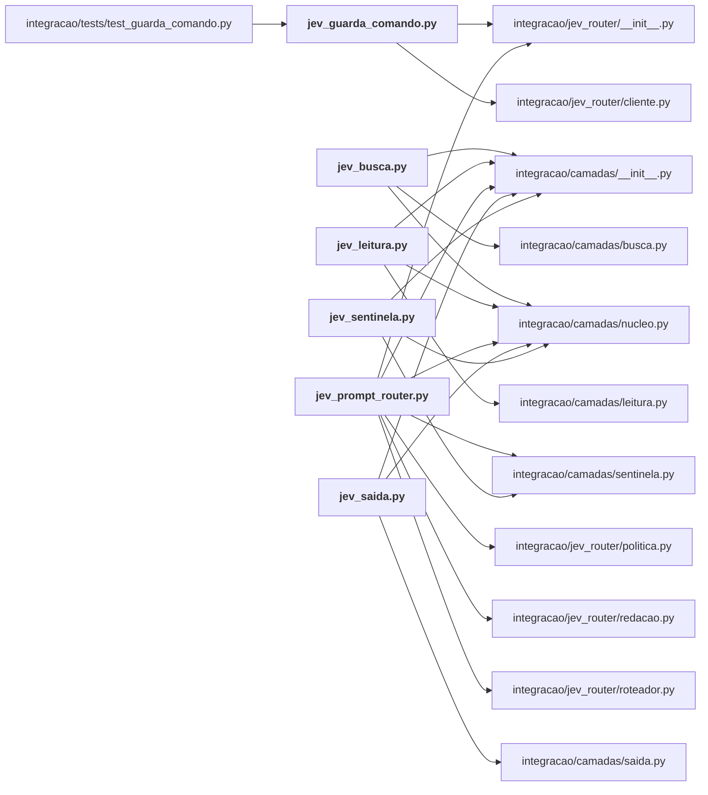

# integracao/hooks/

Os scripts de hook instalados no Claude Code/Codex; cada um é um invólucro fino sobre uma camada.

← [MAPA.md](../../MAPA.md) · pasta acima: [integracao](../../mapa/pastas/integracao.md) · abrir a pasta: [integracao/hooks/](../../integracao/hooks)

## Arquivos

| arquivo | tipo | tamanho | descrição |
|---|---|---:|---|
| [jev_busca.py](../../integracao/hooks/jev_busca.py) | código | 56 l. | Hook PostToolUse (Grep, Glob, WebSearch, buscas do Gmail, Drive e Agenda): numa listagem com muitos itens, o Jev diz por onde começar. |
| [jev_guarda_comando.py](../../integracao/hooks/jev_guarda_comando.py) | código | 158 l. | Hook PreToolUse: o Jev reduz as confirmações que o guarda por palavra pede à toa. |
| [jev_leitura.py](../../integracao/hooks/jev_leitura.py) | código | 69 l. | Hook PreToolUse (Read): antes de ler um arquivo grande, o Jev encolhe o intervalo. |
| [jev_prompt_router.py](../../integracao/hooks/jev_prompt_router.py) | código | 133 l. | Hook UserPromptSubmit: o Jev diz o tema do pedido e sugere a skill certa. |
| [jev_saida.py](../../integracao/hooks/jev_saida.py) | código | 54 l. | Hook PostToolUse (Bash, PowerShell): em saída longa com erro, o Jev aponta a parte da causa. |
| [jev_sentinela.py](../../integracao/hooks/jev_sentinela.py) | código | 54 l. | Hook PostToolUse (conteúdo externo): o sentinela lê o que a ferramenta devolveu. |

## Grafo de imports e links

Nós em negrito são desta pasta; setas cheias são imports, tracejadas são links de documento.

## Ligações e conteúdo de cada arquivo

### jev_busca.py

- **usa** — import: [`integracao/camadas/__init__.py`](../../integracao/camadas/__init__.py), [`integracao/camadas/busca.py`](../../integracao/camadas/busca.py), [`integracao/camadas/nucleo.py`](../../integracao/camadas/nucleo.py)
- **é usado por** — citação: [`integracao/instalar.py`](../../integracao/instalar.py)
- **conteúdo** — [main](../../integracao/hooks/jev_busca.py#L20) (l. 20)

### jev_guarda_comando.py

- **usa** — import: [`integracao/jev_router/__init__.py`](../../integracao/jev_router/__init__.py), [`integracao/jev_router/cliente.py`](../../integracao/jev_router/cliente.py)
- **é usado por** — import: [`integracao/tests/test_guarda_comando.py`](../../integracao/tests/test_guarda_comando.py); citação: [`docs/GUIA-PRATICO-JEV.md`](../../docs/GUIA-PRATICO-JEV.md), [`integracao/README.md`](../../integracao/README.md), [`integracao/instalar.py`](../../integracao/instalar.py), [`laboratorio/PREREGISTRO.md`](../../laboratorio/PREREGISTRO.md), [`laboratorio/r17-economia-de-contexto.json`](../../laboratorio/r17-economia-de-contexto.json), [`laboratorio/r17_economia_de_contexto.py`](../../laboratorio/r17_economia_de_contexto.py), [`laboratorio/r18-perguntas.json`](../../laboratorio/r18-perguntas.json), [`laboratorio/r20-k-adaptativo.json`](../../laboratorio/r20-k-adaptativo.json), [`laboratorio/r20-perguntas.json`](../../laboratorio/r20-perguntas.json)
- **conteúdo** — [modo_vigente](../../integracao/hooks/jev_guarda_comando.py#L73) (l. 73), [registrar](../../integracao/hooks/jev_guarda_comando.py#L83) (l. 83), [avaliar](../../integracao/hooks/jev_guarda_comando.py#L93) (l. 93), [main](../../integracao/hooks/jev_guarda_comando.py#L112) (l. 112), [_marca](../../integracao/hooks/jev_guarda_comando.py#L152) (l. 152)

### jev_leitura.py

- **usa** — import: [`integracao/camadas/__init__.py`](../../integracao/camadas/__init__.py), [`integracao/camadas/leitura.py`](../../integracao/camadas/leitura.py), [`integracao/camadas/nucleo.py`](../../integracao/camadas/nucleo.py)
- **é usado por** — citação: [`integracao/instalar.py`](../../integracao/instalar.py), [`integracao/tests/test_camadas.py`](../../integracao/tests/test_camadas.py)
- **conteúdo** — [main](../../integracao/hooks/jev_leitura.py#L23) (l. 23)

### jev_prompt_router.py

- **usa** — import: [`integracao/camadas/__init__.py`](../../integracao/camadas/__init__.py), [`integracao/camadas/nucleo.py`](../../integracao/camadas/nucleo.py), [`integracao/camadas/sentinela.py`](../../integracao/camadas/sentinela.py), [`integracao/jev_router/__init__.py`](../../integracao/jev_router/__init__.py), [`integracao/jev_router/politica.py`](../../integracao/jev_router/politica.py), [`integracao/jev_router/redacao.py`](../../integracao/jev_router/redacao.py), [`integracao/jev_router/roteador.py`](../../integracao/jev_router/roteador.py)
- **é usado por** — citação: [`integracao/README.md`](../../integracao/README.md), [`integracao/instalar.py`](../../integracao/instalar.py), [`integracao/tests/test_roteador.py`](../../integracao/tests/test_roteador.py), [`laboratorio/r17-economia-de-contexto.json`](../../laboratorio/r17-economia-de-contexto.json), [`laboratorio/r18-perguntas.json`](../../laboratorio/r18-perguntas.json), [`laboratorio/r20-k-adaptativo.json`](../../laboratorio/r20-k-adaptativo.json), [`laboratorio/r20-perguntas.json`](../../laboratorio/r20-perguntas.json)
- **conteúdo** — [modo_vigente](../../integracao/hooks/jev_prompt_router.py#L31) (l. 31), [guardar_estado](../../integracao/hooks/jev_prompt_router.py#L47) (l. 47), [sentinela_do_colado](../../integracao/hooks/jev_prompt_router.py#L58) (l. 58), [main](../../integracao/hooks/jev_prompt_router.py#L76) (l. 76)

### jev_saida.py

- **usa** — import: [`integracao/camadas/__init__.py`](../../integracao/camadas/__init__.py), [`integracao/camadas/nucleo.py`](../../integracao/camadas/nucleo.py), [`integracao/camadas/saida.py`](../../integracao/camadas/saida.py)
- **é usado por** — citação: [`integracao/instalar.py`](../../integracao/instalar.py)
- **conteúdo** — [main](../../integracao/hooks/jev_saida.py#L18) (l. 18)

### jev_sentinela.py

- **usa** — import: [`integracao/camadas/__init__.py`](../../integracao/camadas/__init__.py), [`integracao/camadas/nucleo.py`](../../integracao/camadas/nucleo.py), [`integracao/camadas/sentinela.py`](../../integracao/camadas/sentinela.py)
- **é usado por** — citação: [`integracao/instalar.py`](../../integracao/instalar.py), [`integracao/tests/test_camadas.py`](../../integracao/tests/test_camadas.py)
- **conteúdo** — [main](../../integracao/hooks/jev_sentinela.py#L19) (l. 19)
