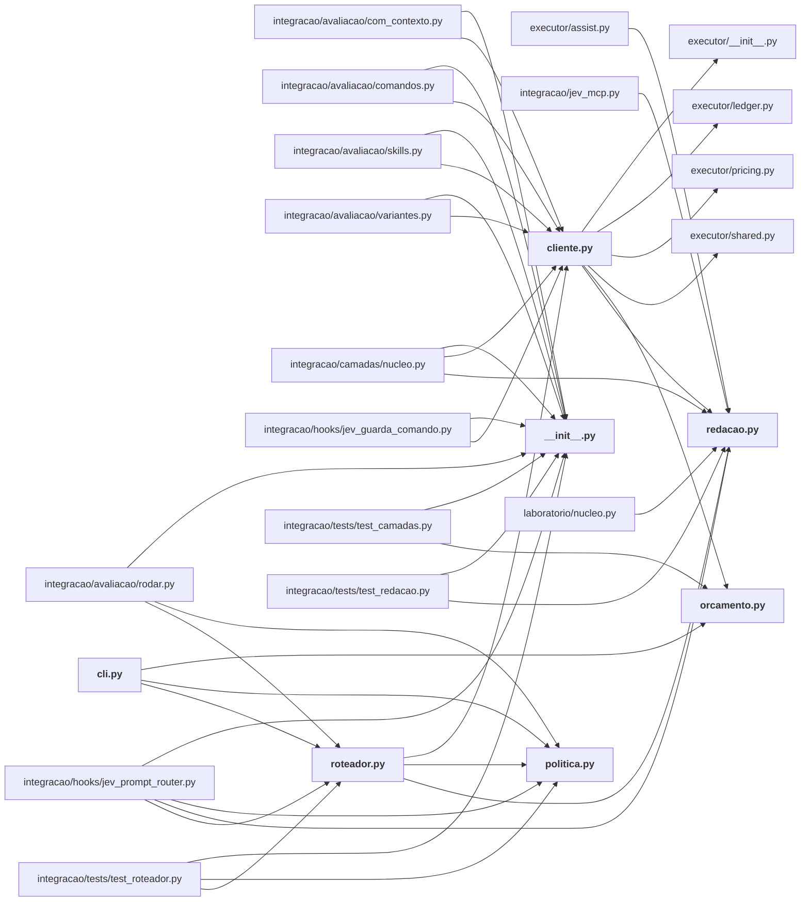

# integracao/jev_router/

Roteador de prompts: política, orçamento, redação de credenciais, cliente do provedor e CLI.

← [MAPA.md](../../MAPA.md) · pasta acima: [integracao](../../mapa/pastas/integracao.md) · abrir a pasta: [integracao/jev_router/](../../integracao/jev_router)

## Arquivos

| arquivo | tipo | tamanho | descrição |
|---|---|---:|---|
| [__init__.py](../../integracao/jev_router/__init__.py) | código | 1 l. | Roteador de trabalho baseado no Jev: classifica o pedido antes de gastar modelo caro. |
| [cli.py](../../integracao/jev_router/cli.py) | código | 50 l. | Linha de comando do roteador, para quem não tem hook: Codex, scripts, ou o próprio agente. |
| [cliente.py](../../integracao/jev_router/cliente.py) | código | 107 l. | Chamada ao endpoint de decisões do Jev, no formato que um hook pode usar. |
| [orcamento.py](../../integracao/jev_router/orcamento.py) | código | 90 l. | Controle persistente de gasto do roteador, separado do livro-caixa dos experimentos. |
| [politica.py](../../integracao/jev_router/politica.py) | código | 118 l. | O que o Jev decide nos fluxos do Claude Code e do Codex, e o que ele não decide. |
| [redacao.py](../../integracao/jev_router/redacao.py) | código | 53 l. | Mascara segredo antes de o pedido sair desta máquina. |
| [roteador.py](../../integracao/jev_router/roteador.py) | código | 127 l. | Orquestra a classificação: cache, chamada ao Jev, política e registro da decisão. |

## Grafo de imports e links

Nós em negrito são desta pasta; setas cheias são imports, tracejadas são links de documento.

## Ligações e conteúdo de cada arquivo

### __init__.py

- **é usado por** — import: [`integracao/avaliacao/com_contexto.py`](../../integracao/avaliacao/com_contexto.py), [`integracao/avaliacao/comandos.py`](../../integracao/avaliacao/comandos.py), [`integracao/avaliacao/rodar.py`](../../integracao/avaliacao/rodar.py), [`integracao/avaliacao/skills.py`](../../integracao/avaliacao/skills.py), [`integracao/avaliacao/variantes.py`](../../integracao/avaliacao/variantes.py), [`integracao/camadas/nucleo.py`](../../integracao/camadas/nucleo.py), [`integracao/hooks/jev_guarda_comando.py`](../../integracao/hooks/jev_guarda_comando.py), [`integracao/hooks/jev_prompt_router.py`](../../integracao/hooks/jev_prompt_router.py), [`integracao/tests/test_camadas.py`](../../integracao/tests/test_camadas.py), [`integracao/tests/test_redacao.py`](../../integracao/tests/test_redacao.py), [`integracao/tests/test_roteador.py`](../../integracao/tests/test_roteador.py)

### cli.py

- **usa** — import: [`integracao/jev_router/orcamento.py`](../../integracao/jev_router/orcamento.py), [`integracao/jev_router/politica.py`](../../integracao/jev_router/politica.py), [`integracao/jev_router/roteador.py`](../../integracao/jev_router/roteador.py)
- **é usado por** — citação: [`integracao/README.md`](../../integracao/README.md), [`laboratorio/r18-perguntas.json`](../../laboratorio/r18-perguntas.json)
- **conteúdo** — [main](../../integracao/jev_router/cli.py#L18) (l. 18)

### cliente.py

- **usa** — import: [`executor/__init__.py`](../../executor/__init__.py), [`executor/ledger.py`](../../executor/ledger.py), [`executor/pricing.py`](../../executor/pricing.py), [`executor/shared.py`](../../executor/shared.py), [`integracao/jev_router/orcamento.py`](../../integracao/jev_router/orcamento.py), [`integracao/jev_router/redacao.py`](../../integracao/jev_router/redacao.py); citação: [`executor/runner.py`](../../executor/runner.py)
- **é usado por** — import: [`integracao/avaliacao/com_contexto.py`](../../integracao/avaliacao/com_contexto.py), [`integracao/avaliacao/comandos.py`](../../integracao/avaliacao/comandos.py), [`integracao/avaliacao/skills.py`](../../integracao/avaliacao/skills.py), [`integracao/avaliacao/variantes.py`](../../integracao/avaliacao/variantes.py), [`integracao/camadas/nucleo.py`](../../integracao/camadas/nucleo.py), [`integracao/hooks/jev_guarda_comando.py`](../../integracao/hooks/jev_guarda_comando.py), [`integracao/jev_router/roteador.py`](../../integracao/jev_router/roteador.py); citação: [`laboratorio/r17-economia-de-contexto.json`](../../laboratorio/r17-economia-de-contexto.json), [`laboratorio/r18-escala.json`](../../laboratorio/r18-escala.json), [`laboratorio/r18-perguntas.json`](../../laboratorio/r18-perguntas.json), [`laboratorio/r20-k-adaptativo.json`](../../laboratorio/r20-k-adaptativo.json), [`laboratorio/r20-perguntas.json`](../../laboratorio/r20-perguntas.json)
- **conteúdo** — [chave](../../integracao/jev_router/cliente.py#L29) (l. 29), [transporte_http](../../integracao/jev_router/cliente.py#L41) (l. 41), [perguntar](../../integracao/jev_router/cliente.py#L57) (l. 57)

### orcamento.py

- **usa** — citação: [`executor/ledger.py`](../../executor/ledger.py), [`executor/prices.json`](../../executor/prices.json)
- **é usado por** — import: [`integracao/jev_router/cli.py`](../../integracao/jev_router/cli.py), [`integracao/jev_router/cliente.py`](../../integracao/jev_router/cliente.py), [`integracao/tests/test_camadas.py`](../../integracao/tests/test_camadas.py); citação: [`integracao/camadas/verificar.py`](../../integracao/camadas/verificar.py), [`laboratorio/r17-economia-de-contexto.json`](../../laboratorio/r17-economia-de-contexto.json), [`laboratorio/r17_economia_de_contexto.py`](../../laboratorio/r17_economia_de_contexto.py), [`laboratorio/r18-escala.json`](../../laboratorio/r18-escala.json), [`laboratorio/r18-perguntas.json`](../../laboratorio/r18-perguntas.json), [`laboratorio/r20-k-adaptativo.json`](../../laboratorio/r20-k-adaptativo.json), [`laboratorio/r20-perguntas.json`](../../laboratorio/r20-perguntas.json)
- **conteúdo** — [custo_maximo_por_chamada_usd](../../integracao/jev_router/orcamento.py#L34) (l. 34), [_linhas](../../integracao/jev_router/orcamento.py#L40) (l. 40), [situacao](../../integracao/jev_router/orcamento.py#L55) (l. 55), [pode_gastar](../../integracao/jev_router/orcamento.py#L70) (l. 70), [registrar](../../integracao/jev_router/orcamento.py#L81) (l. 81)

### politica.py

- **é usado por** — import: [`integracao/avaliacao/rodar.py`](../../integracao/avaliacao/rodar.py), [`integracao/hooks/jev_prompt_router.py`](../../integracao/hooks/jev_prompt_router.py), [`integracao/jev_router/cli.py`](../../integracao/jev_router/cli.py), [`integracao/jev_router/roteador.py`](../../integracao/jev_router/roteador.py), [`integracao/tests/test_roteador.py`](../../integracao/tests/test_roteador.py); citação: [`laboratorio/r17-economia-de-contexto.json`](../../laboratorio/r17-economia-de-contexto.json), [`laboratorio/r17_economia_de_contexto.py`](../../laboratorio/r17_economia_de_contexto.py), [`laboratorio/r18-escala.json`](../../laboratorio/r18-escala.json), [`laboratorio/r18-perguntas.json`](../../laboratorio/r18-perguntas.json), [`laboratorio/r20-k-adaptativo.json`](../../laboratorio/r20-k-adaptativo.json), [`laboratorio/r20-perguntas.json`](../../laboratorio/r20-perguntas.json)
- **conteúdo** — [decidir](../../integracao/jev_router/politica.py#L84) (l. 84), [texto_para_o_agente](../../integracao/jev_router/politica.py#L109) (l. 109)

### redacao.py

- **é usado por** — import: [`executor/assist.py`](../../executor/assist.py), [`integracao/camadas/nucleo.py`](../../integracao/camadas/nucleo.py), [`integracao/hooks/jev_prompt_router.py`](../../integracao/hooks/jev_prompt_router.py), [`integracao/jev_mcp.py`](../../integracao/jev_mcp.py), [`integracao/jev_router/cliente.py`](../../integracao/jev_router/cliente.py), [`integracao/jev_router/roteador.py`](../../integracao/jev_router/roteador.py), [`integracao/tests/test_redacao.py`](../../integracao/tests/test_redacao.py), [`laboratorio/nucleo.py`](../../laboratorio/nucleo.py); citação: [`integracao/README.md`](../../integracao/README.md), [`laboratorio/r17-economia-de-contexto.json`](../../laboratorio/r17-economia-de-contexto.json), [`laboratorio/r17_economia_de_contexto.py`](../../laboratorio/r17_economia_de_contexto.py), [`laboratorio/r20-k-adaptativo.json`](../../laboratorio/r20-k-adaptativo.json), [`laboratorio/r20-perguntas.json`](../../laboratorio/r20-perguntas.json)
- **conteúdo** — [limpar](../../integracao/jev_router/redacao.py#L43) (l. 43)

### roteador.py

- **usa** — import: [`integracao/jev_router/cliente.py`](../../integracao/jev_router/cliente.py), [`integracao/jev_router/politica.py`](../../integracao/jev_router/politica.py), [`integracao/jev_router/redacao.py`](../../integracao/jev_router/redacao.py); citação: [`.gitignore`](../../.gitignore)
- **é usado por** — import: [`integracao/avaliacao/rodar.py`](../../integracao/avaliacao/rodar.py), [`integracao/hooks/jev_prompt_router.py`](../../integracao/hooks/jev_prompt_router.py), [`integracao/jev_router/cli.py`](../../integracao/jev_router/cli.py), [`integracao/tests/test_roteador.py`](../../integracao/tests/test_roteador.py); citação: [`laboratorio/r17-economia-de-contexto.json`](../../laboratorio/r17-economia-de-contexto.json), [`laboratorio/r17_economia_de_contexto.py`](../../laboratorio/r17_economia_de_contexto.py), [`laboratorio/r18-escala.json`](../../laboratorio/r18-escala.json), [`laboratorio/r18-perguntas.json`](../../laboratorio/r18-perguntas.json), [`laboratorio/r20-k-adaptativo.json`](../../laboratorio/r20-k-adaptativo.json), [`laboratorio/r20-perguntas.json`](../../laboratorio/r20-perguntas.json)
- **conteúdo** — [impressao](../../integracao/jev_router/roteador.py#L30) (l. 30), [do_cache](../../integracao/jev_router/roteador.py#L37) (l. 37), [para_o_cache](../../integracao/jev_router/roteador.py#L47) (l. 47), [guardar_pedido](../../integracao/jev_router/roteador.py#L56) (l. 56), [registrar](../../integracao/jev_router/roteador.py#L73) (l. 73), [classificar](../../integracao/jev_router/roteador.py#L81) (l. 81)
