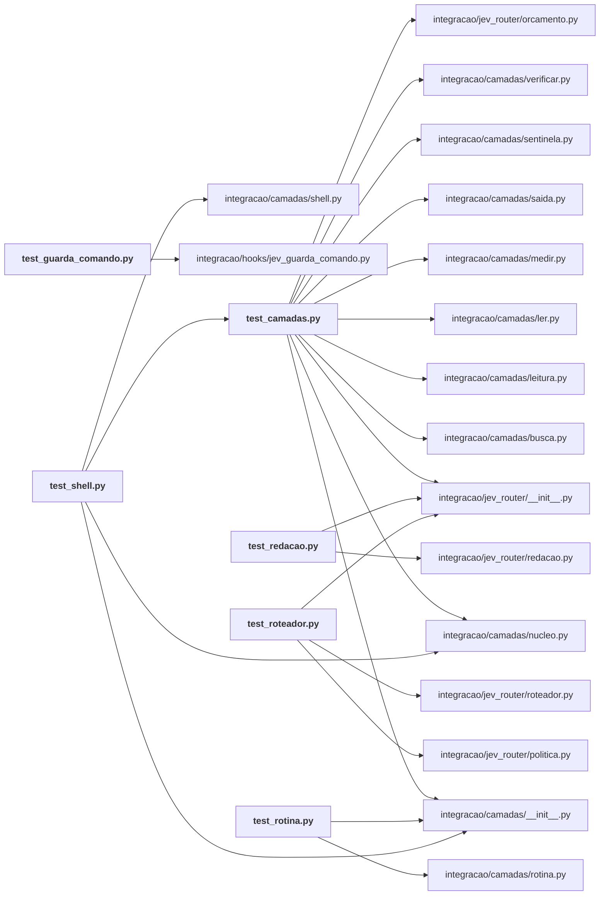

# integracao/tests/

Testes da integração: camadas, guarda de comando, redação, roteador e rotina.

← [MAPA.md](../../MAPA.md) · pasta acima: [integracao](../../mapa/pastas/integracao.md) · abrir a pasta: [integracao/tests/](../../integracao/tests)

## Arquivos

| arquivo | tipo | tamanho | descrição |
|---|---|---:|---|
| [test_camadas.py](../../integracao/tests/test_camadas.py) | código | 432 l. | As camadas do Jev no Claude Code falham para o lado aberto, calam em sombra e medem tudo. |
| [test_guarda_comando.py](../../integracao/tests/test_guarda_comando.py) | código | 148 l. | O guarda de comando: o que ele pode fazer, e sobretudo o que ele não pode. |
| [test_redacao.py](../../integracao/tests/test_redacao.py) | código | 77 l. | Nenhuma credencial pode atravessar a fronteira desta máquina dentro de um pedido. |
| [test_roteador.py](../../integracao/tests/test_roteador.py) | código | 218 l. | O classificador tem de falhar para o lado aberto e calar quando não tem confiança. |
| [test_rotina.py](../../integracao/tests/test_rotina.py) | código | 59 l. | A rotina automática para no primeiro passo que falha e só commita quando tudo fechou. |
| [test_shell.py](../../integracao/tests/test_shell.py) | código | 117 l. | A leitura pelo shell só mexe em comando de leitura pura, e o que ela escreve é leitura. |

## Grafo de imports e links

Nós em negrito são desta pasta; setas cheias são imports, tracejadas são links de documento.

## Ligações e conteúdo de cada arquivo

### test_camadas.py

- **usa** — import: [`integracao/camadas/__init__.py`](../../integracao/camadas/__init__.py), [`integracao/camadas/busca.py`](../../integracao/camadas/busca.py), [`integracao/camadas/leitura.py`](../../integracao/camadas/leitura.py), [`integracao/camadas/ler.py`](../../integracao/camadas/ler.py), [`integracao/camadas/medir.py`](../../integracao/camadas/medir.py), [`integracao/camadas/nucleo.py`](../../integracao/camadas/nucleo.py), [`integracao/camadas/saida.py`](../../integracao/camadas/saida.py), [`integracao/camadas/sentinela.py`](../../integracao/camadas/sentinela.py), [`integracao/camadas/verificar.py`](../../integracao/camadas/verificar.py), [`integracao/jev_router/__init__.py`](../../integracao/jev_router/__init__.py), [`integracao/jev_router/orcamento.py`](../../integracao/jev_router/orcamento.py); citação: [`integracao/hooks/jev_leitura.py`](../../integracao/hooks/jev_leitura.py), [`integracao/hooks/jev_sentinela.py`](../../integracao/hooks/jev_sentinela.py)
- **é usado por** — import: [`integracao/tests/test_shell.py`](../../integracao/tests/test_shell.py)
- **chama de outros arquivos** — [`busca.agrupar`](../../integracao/camadas/busca.py#L70), [`busca.analisar`](../../integracao/camadas/busca.py#L138), [`busca.itens_de_listagem`](../../integracao/camadas/busca.py#L110), [`busca.nota_para_o_agente`](../../integracao/camadas/busca.py#L177), [`busca.texto_da_resposta`](../../integracao/camadas/busca.py#L47), [`leitura.analisar`](../../integracao/camadas/leitura.py#L54), [`leitura.nota_para_o_agente`](../../integracao/camadas/leitura.py#L141), [`ler.candidatos_do_rg`](../../integracao/camadas/ler.py#L69), [`ler.imprimir`](../../integracao/camadas/ler.py#L136), [`ler.selecionar`](../../integracao/camadas/ler.py#L105), [`medir.medir`](../../integracao/camadas/medir.py#L237), [`medir.pagina`](../../integracao/camadas/medir.py#L280), [`nucleo.arquivo_da_sessao`](../../integracao/camadas/nucleo.py#L104), [`nucleo.guardar_pedido`](../../integracao/camadas/nucleo.py#L108), [`nucleo.pedido_vigente`](../../integracao/camadas/nucleo.py#L125), [`nucleo.registrar`](../../integracao/camadas/nucleo.py#L79), [`nucleo.tokens`](../../integracao/camadas/nucleo.py#L91), [`saida.analisar`](../../integracao/camadas/saida.py#L53), [`saida.nota_para_o_agente`](../../integracao/camadas/saida.py#L86), [`sentinela.analisar`](../../integracao/camadas/sentinela.py#L41), [`sentinela.nota_para_o_agente`](../../integracao/camadas/sentinela.py#L69), [`verificar.verificar`](../../integracao/camadas/verificar.py#L65), [`orcamento.custo_maximo_por_chamada_usd`](../../integracao/jev_router/orcamento.py#L34), [`orcamento.pode_gastar`](../../integracao/jev_router/orcamento.py#L70)
- **conteúdo** — [transporte_por_trecho](../../integracao/tests/test_camadas.py#L22) (l. 22; usado em 1), [quebrado](../../integracao/tests/test_camadas.py#L38) (l. 38; usado em 1), [arquivo_com_alvo](../../integracao/tests/test_camadas.py#L42) (l. 42; usado em 1), [Leitura](../../integracao/tests/test_camadas.py#L48) (l. 48), [Busca](../../integracao/tests/test_camadas.py#L104) (l. 104), [Listagens](../../integracao/tests/test_camadas.py#L138) (l. 138), [Saida](../../integracao/tests/test_camadas.py#L167) (l. 167), [Verificar](../../integracao/tests/test_camadas.py#L202) (l. 202), [Sentinela](../../integracao/tests/test_camadas.py#L224) (l. 224), [Ler](../../integracao/tests/test_camadas.py#L248) (l. 248), [PedidoVigente](../../integracao/tests/test_camadas.py#L287) (l. 287), [Hooks](../../integracao/tests/test_camadas.py#L314) (l. 314), [Medidor](../../integracao/tests/test_camadas.py#L370) (l. 370), [Orcamento](../../integracao/tests/test_camadas.py#L416) (l. 416)

### test_guarda_comando.py

- **usa** — import: [`integracao/hooks/jev_guarda_comando.py`](../../integracao/hooks/jev_guarda_comando.py)
- **chama de outros arquivos** — [`jev_guarda_comando.avaliar`](../../integracao/hooks/jev_guarda_comando.py#L93), [`jev_guarda_comando.main`](../../integracao/hooks/jev_guarda_comando.py#L112)
- **menciona 1 conceito** — [R16](../../mapa/conhecimento/rodadas.md#r16) (1×)
- **conteúdo** — [resposta](../../integracao/tests/test_guarda_comando.py#L19) (l. 19), [quebrado](../../integracao/tests/test_guarda_comando.py#L27) (l. 27), [SoOlhaOQueARegraBarrou](../../integracao/tests/test_guarda_comando.py#L33) (l. 33), [NuncaLiberaOQueEGrave](../../integracao/tests/test_guarda_comando.py#L55) (l. 55), [Hook](../../integracao/tests/test_guarda_comando.py#L80) (l. 80)

### test_redacao.py

- **usa** — import: [`integracao/jev_router/__init__.py`](../../integracao/jev_router/__init__.py), [`integracao/jev_router/redacao.py`](../../integracao/jev_router/redacao.py); citação: [`executor/tests/test_calibracao_e12.py`](../../executor/tests/test_calibracao_e12.py)
- **é usado por** — citação: [`integracao/README.md`](../../integracao/README.md)
- **chama de outros arquivos** — [`redacao.limpar`](../../integracao/jev_router/redacao.py#L43)
- **conteúdo** — [Formas](../../integracao/tests/test_redacao.py#L20) (l. 20), [ContraAsChavesQueExistemAqui](../../integracao/tests/test_redacao.py#L50) (l. 50)

### test_roteador.py

- **usa** — import: [`integracao/jev_router/__init__.py`](../../integracao/jev_router/__init__.py), [`integracao/jev_router/politica.py`](../../integracao/jev_router/politica.py), [`integracao/jev_router/roteador.py`](../../integracao/jev_router/roteador.py); citação: [`.gitignore`](../../.gitignore), [`integracao/avaliacao/gabarito-skills.json`](../../integracao/avaliacao/gabarito-skills.json), [`integracao/avaliacao/skills-resultado.json`](../../integracao/avaliacao/skills-resultado.json), [`integracao/hooks/jev_prompt_router.py`](../../integracao/hooks/jev_prompt_router.py)
- **chama de outros arquivos** — [`politica.decidir`](../../integracao/jev_router/politica.py#L84), [`politica.texto_para_o_agente`](../../integracao/jev_router/politica.py#L109), [`roteador.classificar`](../../integracao/jev_router/roteador.py#L81), [`roteador.impressao`](../../integracao/jev_router/roteador.py#L30), [`roteador.para_o_cache`](../../integracao/jev_router/roteador.py#L47)
- **conteúdo** — [resposta](../../integracao/tests/test_roteador.py#L22) (l. 22), [quebrado](../../integracao/tests/test_roteador.py#L31) (l. 31), [PoliticaDeSugestao](../../integracao/tests/test_roteador.py#L37) (l. 37), [FalhaParaOLadoAberto](../../integracao/tests/test_roteador.py#L83) (l. 83), [Hook](../../integracao/tests/test_roteador.py#L160) (l. 160)

### test_rotina.py

- **usa** — import: [`integracao/camadas/__init__.py`](../../integracao/camadas/__init__.py), [`integracao/camadas/rotina.py`](../../integracao/camadas/rotina.py)
- **chama de outros arquivos** — [`rotina.executar`](../../integracao/camadas/rotina.py#L90)
- **conteúdo** — [Rotina](../../integracao/tests/test_rotina.py#L14) (l. 14)

### test_shell.py

- **usa** — import: [`integracao/camadas/__init__.py`](../../integracao/camadas/__init__.py), [`integracao/camadas/nucleo.py`](../../integracao/camadas/nucleo.py), [`integracao/camadas/shell.py`](../../integracao/camadas/shell.py), [`integracao/tests/test_camadas.py`](../../integracao/tests/test_camadas.py)
- **chama de outros arquivos** — [`shell.analisar`](../../integracao/camadas/shell.py#L142), [`shell.dividir`](../../integracao/camadas/shell.py#L38), [`shell.interpretar`](../../integracao/camadas/shell.py#L95), [`shell.nota_para_o_agente`](../../integracao/camadas/shell.py#L207), [`test_camadas.arquivo_com_alvo`](../../integracao/tests/test_camadas.py#L42), [`test_camadas.quebrado`](../../integracao/tests/test_camadas.py#L38), [`test_camadas.transporte_por_trecho`](../../integracao/tests/test_camadas.py#L22)
- **conteúdo** — [Gramatica](../../integracao/tests/test_shell.py#L18) (l. 18), [Reescrita](../../integracao/tests/test_shell.py#L49) (l. 49)
