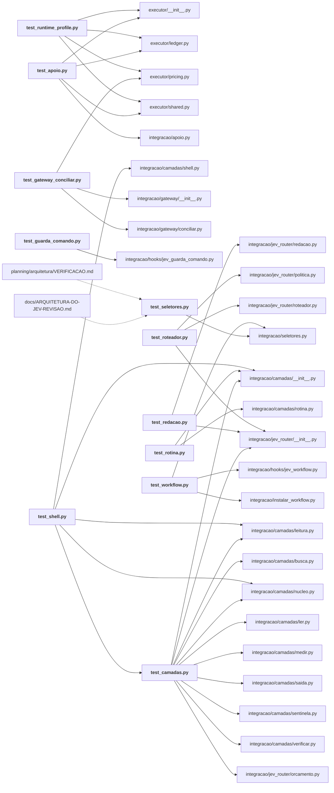

# integracao/tests/

Testes da integração: camadas, guarda de comando, redação, roteador e rotina.

← [MAPA.md](../../MAPA.md) · pasta acima: [integracao](../../mapa/pastas/integracao.md) · abrir a pasta: [integracao/tests/](../../integracao/tests)

## Arquivos

| arquivo | tipo | tamanho | descrição |
|---|---|---:|---|
| [test_apoio.py](../../integracao/tests/test_apoio.py) | código | 46 l. | Define: question, test_independent_questions_share_one_call, test_invalid_rubrics_never_reach_transport, test_missing_wallet_sta |
| [test_camadas.py](../../integracao/tests/test_camadas.py) | código | 448 l. | As camadas do Jev no Claude Code falham para o lado aberto, calam em sombra e medem tudo. |
| [test_gateway_conciliar.py](../../integracao/tests/test_gateway_conciliar.py) | código | 57 l. | O conciliador do jev-gateway: lê só linhas de rota com chamada ao Jev, precifica pela tabela local, não conta a mesma linha duas vezes e recomeça quando o log… |
| [test_guarda_comando.py](../../integracao/tests/test_guarda_comando.py) | código | 148 l. | O guarda de comando: o que ele pode fazer, e sobretudo o que ele não pode. |
| [test_redacao.py](../../integracao/tests/test_redacao.py) | código | 77 l. | Nenhuma credencial pode atravessar a fronteira desta máquina dentro de um pedido. |
| [test_roteador.py](../../integracao/tests/test_roteador.py) | código | 230 l. | O classificador tem de falhar para o lado aberto e calar quando não tem confiança. |
| [test_rotina.py](../../integracao/tests/test_rotina.py) | código | 59 l. | A rotina automática para no primeiro passo que falha e só commita quando tudo fechou. |
| [test_runtime_profile.py](../../integracao/tests/test_runtime_profile.py) | código | 59 l. | Define: profile, test_profile_reuses_existing_wallet, test_unknown_profile_cannot_fall_back, test_stale_price_blocks_calls_but_a |
| [test_seletores.py](../../integracao/tests/test_seletores.py) | código | 41 l. | Define: test_maps_model_choice_to_available_id, test_abstains, test_user_explicit_choice_never_calls_provider, test_duplicate_id |
| [test_shell.py](../../integracao/tests/test_shell.py) | código | 150 l. | A leitura pelo shell só mexe em comando de leitura pura, e o que ela escreve é leitura. |
| [test_workflow.py](../../integracao/tests/test_workflow.py) | código | 50 l. | Define: test_installer_preserves_other_hooks_and_is_idempotent, test_hook_contains_no_prompt_or_session_private_values, test_sho |

## Grafo de imports e links

Nós em negrito são desta pasta; setas cheias são imports, tracejadas são links de documento.

```mermaid
flowchart LR
  n_docs_ARQUITETURA_DO_JEV_REVISAO_md["docs/ARQUITETURA-DO-JEV-REVISAO.md"]
  n_executor___init___py["executor/__init__.py"]
  n_executor_ledger_py["executor/ledger.py"]
  n_executor_pricing_py["executor/pricing.py"]
  n_executor_shared_py["executor/shared.py"]
  n_integracao_apoio_py["integracao/apoio.py"]
  n_integracao_camadas___init___py["integracao/camadas/__init__.py"]
  n_integracao_camadas_busca_py["integracao/camadas/busca.py"]
  n_integracao_camadas_leitura_py["integracao/camadas/leitura.py"]
  n_integracao_camadas_ler_py["integracao/camadas/ler.py"]
  n_integracao_camadas_medir_py["integracao/camadas/medir.py"]
  n_integracao_camadas_nucleo_py["integracao/camadas/nucleo.py"]
  n_integracao_camadas_rotina_py["integracao/camadas/rotina.py"]
  n_integracao_camadas_saida_py["integracao/camadas/saida.py"]
  n_integracao_camadas_sentinela_py["integracao/camadas/sentinela.py"]
  n_integracao_camadas_shell_py["integracao/camadas/shell.py"]
  n_integracao_camadas_verificar_py["integracao/camadas/verificar.py"]
  n_integracao_gateway___init___py["integracao/gateway/__init__.py"]
  n_integracao_gateway_conciliar_py["integracao/gateway/conciliar.py"]
  n_integracao_hooks_jev_guarda_comando_py["integracao/hooks/jev_guarda_comando.py"]
  n_integracao_hooks_jev_workflow_py["integracao/hooks/jev_workflow.py"]
  n_integracao_instalar_workflow_py["integracao/instalar_workflow.py"]
  n_integracao_jev_router___init___py["integracao/jev_router/__init__.py"]
  n_integracao_jev_router_orcamento_py["integracao/jev_router/orcamento.py"]
  n_integracao_jev_router_politica_py["integracao/jev_router/politica.py"]
  n_integracao_jev_router_redacao_py["integracao/jev_router/redacao.py"]
  n_integracao_jev_router_roteador_py["integracao/jev_router/roteador.py"]
  n_integracao_seletores_py["integracao/seletores.py"]
  n_integracao_tests_test_apoio_py["<b>test_apoio.py</b>"]
  n_integracao_tests_test_camadas_py["<b>test_camadas.py</b>"]
  n_integracao_tests_test_gateway_conciliar_py["<b>test_gateway_conciliar.py</b>"]
  n_integracao_tests_test_guarda_comando_py["<b>test_guarda_comando.py</b>"]
  n_integracao_tests_test_redacao_py["<b>test_redacao.py</b>"]
  n_integracao_tests_test_roteador_py["<b>test_roteador.py</b>"]
  n_integracao_tests_test_rotina_py["<b>test_rotina.py</b>"]
  n_integracao_tests_test_runtime_profile_py["<b>test_runtime_profile.py</b>"]
  n_integracao_tests_test_seletores_py["<b>test_seletores.py</b>"]
  n_integracao_tests_test_shell_py["<b>test_shell.py</b>"]
  n_integracao_tests_test_workflow_py["<b>test_workflow.py</b>"]
  n_planning_arquitetura_VERIFICACAO_md["planning/arquitetura/VERIFICACAO.md"]
  n_docs_ARQUITETURA_DO_JEV_REVISAO_md -.-> n_integracao_tests_test_seletores_py
  n_integracao_tests_test_apoio_py --> n_executor___init___py
  n_integracao_tests_test_apoio_py --> n_executor_ledger_py
  n_integracao_tests_test_apoio_py --> n_executor_shared_py
  n_integracao_tests_test_apoio_py --> n_integracao_apoio_py
  n_integracao_tests_test_camadas_py --> n_integracao_camadas___init___py
  n_integracao_tests_test_camadas_py --> n_integracao_camadas_busca_py
  n_integracao_tests_test_camadas_py --> n_integracao_camadas_leitura_py
  n_integracao_tests_test_camadas_py --> n_integracao_camadas_ler_py
  n_integracao_tests_test_camadas_py --> n_integracao_camadas_medir_py
  n_integracao_tests_test_camadas_py --> n_integracao_camadas_nucleo_py
  n_integracao_tests_test_camadas_py --> n_integracao_camadas_saida_py
  n_integracao_tests_test_camadas_py --> n_integracao_camadas_sentinela_py
  n_integracao_tests_test_camadas_py --> n_integracao_camadas_verificar_py
  n_integracao_tests_test_camadas_py --> n_integracao_jev_router___init___py
  n_integracao_tests_test_camadas_py --> n_integracao_jev_router_orcamento_py
  n_integracao_tests_test_gateway_conciliar_py --> n_executor_pricing_py
  n_integracao_tests_test_gateway_conciliar_py --> n_integracao_gateway___init___py
  n_integracao_tests_test_gateway_conciliar_py --> n_integracao_gateway_conciliar_py
  n_integracao_tests_test_guarda_comando_py --> n_integracao_hooks_jev_guarda_comando_py
  n_integracao_tests_test_redacao_py --> n_integracao_jev_router___init___py
  n_integracao_tests_test_redacao_py --> n_integracao_jev_router_redacao_py
  n_integracao_tests_test_roteador_py --> n_integracao_jev_router___init___py
  n_integracao_tests_test_roteador_py --> n_integracao_jev_router_politica_py
  n_integracao_tests_test_roteador_py --> n_integracao_jev_router_roteador_py
  n_integracao_tests_test_rotina_py --> n_integracao_camadas___init___py
  n_integracao_tests_test_rotina_py --> n_integracao_camadas_rotina_py
  n_integracao_tests_test_runtime_profile_py --> n_executor___init___py
  n_integracao_tests_test_runtime_profile_py --> n_executor_ledger_py
  n_integracao_tests_test_runtime_profile_py --> n_executor_pricing_py
  n_integracao_tests_test_runtime_profile_py --> n_executor_shared_py
  n_integracao_tests_test_seletores_py --> n_integracao_seletores_py
  n_integracao_tests_test_shell_py --> n_integracao_camadas___init___py
  n_integracao_tests_test_shell_py --> n_integracao_camadas_leitura_py
  n_integracao_tests_test_shell_py --> n_integracao_camadas_nucleo_py
  n_integracao_tests_test_shell_py --> n_integracao_camadas_shell_py
  n_integracao_tests_test_shell_py --> n_integracao_tests_test_camadas_py
  n_integracao_tests_test_workflow_py --> n_integracao_hooks_jev_workflow_py
  n_integracao_tests_test_workflow_py --> n_integracao_instalar_workflow_py
  n_integracao_tests_test_workflow_py --> n_integracao_seletores_py
  n_planning_arquitetura_VERIFICACAO_md -.-> n_integracao_tests_test_seletores_py
```

## Ligações e conteúdo de cada arquivo

### test_apoio.py

- **usa** — import: [`executor/__init__.py`](../../executor/__init__.py), [`executor/ledger.py`](../../executor/ledger.py), [`executor/shared.py`](../../executor/shared.py), [`integracao/apoio.py`](../../integracao/apoio.py)
- **chama de outros arquivos** — [`ledger.BudgetError`](../../executor/ledger.py#L20), [`shared.ask`](../../executor/shared.py#L152), [`apoio.judge`](../../integracao/apoio.py#L51), [`apoio.status`](../../integracao/apoio.py#L10)
- **conteúdo** — [question](../../integracao/tests/test_apoio.py#L8) (l. 8), [test_independent_questions_share_one_call](../../integracao/tests/test_apoio.py#L13) (l. 13), [test_invalid_rubrics_never_reach_transport](../../integracao/tests/test_apoio.py#L24) (l. 24), [test_missing_wallet_status_creates_nothing](../../integracao/tests/test_apoio.py#L31) (l. 31), [test_missing_wallet_blocks_before_credentials_or_network](../../integracao/tests/test_apoio.py#L39) (l. 39)

### test_camadas.py

- **usa** — import: [`integracao/camadas/__init__.py`](../../integracao/camadas/__init__.py), [`integracao/camadas/busca.py`](../../integracao/camadas/busca.py), [`integracao/camadas/leitura.py`](../../integracao/camadas/leitura.py), [`integracao/camadas/ler.py`](../../integracao/camadas/ler.py), [`integracao/camadas/medir.py`](../../integracao/camadas/medir.py), [`integracao/camadas/nucleo.py`](../../integracao/camadas/nucleo.py), [`integracao/camadas/saida.py`](../../integracao/camadas/saida.py), [`integracao/camadas/sentinela.py`](../../integracao/camadas/sentinela.py), [`integracao/camadas/verificar.py`](../../integracao/camadas/verificar.py), [`integracao/jev_router/__init__.py`](../../integracao/jev_router/__init__.py), [`integracao/jev_router/orcamento.py`](../../integracao/jev_router/orcamento.py); citação: [`integracao/hooks/jev_leitura.py`](../../integracao/hooks/jev_leitura.py), [`integracao/hooks/jev_sentinela.py`](../../integracao/hooks/jev_sentinela.py)
- **é usado por** — import: [`integracao/tests/test_shell.py`](../../integracao/tests/test_shell.py)
- **chama de outros arquivos** — [`busca.agrupar`](../../integracao/camadas/busca.py#L70), [`busca.analisar`](../../integracao/camadas/busca.py#L138), [`busca.itens_de_listagem`](../../integracao/camadas/busca.py#L110), [`busca.nota_para_o_agente`](../../integracao/camadas/busca.py#L177), [`busca.texto_da_resposta`](../../integracao/camadas/busca.py#L47), [`leitura.analisar`](../../integracao/camadas/leitura.py#L59), [`leitura.nota_para_o_agente`](../../integracao/camadas/leitura.py#L147), [`ler.candidatos_do_rg`](../../integracao/camadas/ler.py#L69), [`ler.imprimir`](../../integracao/camadas/ler.py#L136), [`ler.selecionar`](../../integracao/camadas/ler.py#L105), [`medir.medir`](../../integracao/camadas/medir.py#L237), [`medir.pagina`](../../integracao/camadas/medir.py#L280), [`nucleo.arquivo_da_sessao`](../../integracao/camadas/nucleo.py#L104), [`nucleo.estado_do_trecho`](../../integracao/camadas/nucleo.py#L264), [`nucleo.guardar_pedido`](../../integracao/camadas/nucleo.py#L108), [`nucleo.pedido_curto`](../../integracao/camadas/nucleo.py#L259), [`nucleo.pedido_vigente`](../../integracao/camadas/nucleo.py#L125), [`nucleo.registrar`](../../integracao/camadas/nucleo.py#L79), [`nucleo.tokens`](../../integracao/camadas/nucleo.py#L91), [`saida.analisar`](../../integracao/camadas/saida.py#L53), [`saida.nota_para_o_agente`](../../integracao/camadas/saida.py#L86), [`sentinela.analisar`](../../integracao/camadas/sentinela.py#L41), [`sentinela.nota_para_o_agente`](../../integracao/camadas/sentinela.py#L69), [`verificar.verificar`](../../integracao/camadas/verificar.py#L65), [`orcamento.custo_maximo_por_chamada_usd`](../../integracao/jev_router/orcamento.py#L34), [`orcamento.pode_gastar`](../../integracao/jev_router/orcamento.py#L70)
- **conteúdo** — [transporte_por_trecho](../../integracao/tests/test_camadas.py#L22) (l. 22; usado em 1), [quebrado](../../integracao/tests/test_camadas.py#L38) (l. 38; usado em 1), [arquivo_com_alvo](../../integracao/tests/test_camadas.py#L42) (l. 42; usado em 1), [Leitura](../../integracao/tests/test_camadas.py#L48) (l. 48), [Busca](../../integracao/tests/test_camadas.py#L104) (l. 104), [Listagens](../../integracao/tests/test_camadas.py#L138) (l. 138), [Saida](../../integracao/tests/test_camadas.py#L167) (l. 167), [Verificar](../../integracao/tests/test_camadas.py#L202) (l. 202), [Sentinela](../../integracao/tests/test_camadas.py#L224) (l. 224), [Ler](../../integracao/tests/test_camadas.py#L248) (l. 248), [PedidoVigente](../../integracao/tests/test_camadas.py#L287) (l. 287), [Hooks](../../integracao/tests/test_camadas.py#L314) (l. 314), [Medidor](../../integracao/tests/test_camadas.py#L370) (l. 370), [Orcamento](../../integracao/tests/test_camadas.py#L416) (l. 416), [PedidoCurto](../../integracao/tests/test_camadas.py#L435) (l. 435)

### test_gateway_conciliar.py

- **usa** — import: [`executor/pricing.py`](../../executor/pricing.py), [`integracao/gateway/__init__.py`](../../integracao/gateway/__init__.py), [`integracao/gateway/conciliar.py`](../../integracao/gateway/conciliar.py)
- **é usado por** — citação: [`docs/JEV-GATEWAY.md`](../../docs/JEV-GATEWAY.md)
- **chama de outros arquivos** — [`pricing.load_prices`](../../executor/pricing.py#L18), [`conciliar.novas_linhas`](../../integracao/gateway/conciliar.py#L95), [`conciliar.relatorio`](../../integracao/gateway/conciliar.py#L151)
- **conteúdo** — [escrever](../../integracao/tests/test_gateway_conciliar.py#L21) (l. 21), [test_precifica_pela_tabela_local_e_ignora_turno_sem_jev](../../integracao/tests/test_gateway_conciliar.py#L27) (l. 27), [test_nao_conta_duas_vezes_e_recomeca_em_arquivo_novo](../../integracao/tests/test_gateway_conciliar.py#L39) (l. 39), [test_relatorio_por_cliente_e_dia](../../integracao/tests/test_gateway_conciliar.py#L52) (l. 52)

### test_guarda_comando.py

- **usa** — import: [`integracao/hooks/jev_guarda_comando.py`](../../integracao/hooks/jev_guarda_comando.py)
- **chama de outros arquivos** — [`jev_guarda_comando.avaliar`](../../integracao/hooks/jev_guarda_comando.py#L93), [`jev_guarda_comando.main`](../../integracao/hooks/jev_guarda_comando.py#L112)
- **menciona 1 conceito** — [R16](../../mapa/conhecimento/rodadas.md#r16) (1×)
- **conteúdo** — [resposta](../../integracao/tests/test_guarda_comando.py#L19) (l. 19), [quebrado](../../integracao/tests/test_guarda_comando.py#L27) (l. 27), [SoOlhaOQueARegraBarrou](../../integracao/tests/test_guarda_comando.py#L33) (l. 33), [NuncaLiberaOQueEGrave](../../integracao/tests/test_guarda_comando.py#L55) (l. 55), [Hook](../../integracao/tests/test_guarda_comando.py#L80) (l. 80)

### test_redacao.py

- **usa** — import: [`integracao/jev_router/__init__.py`](../../integracao/jev_router/__init__.py), [`integracao/jev_router/redacao.py`](../../integracao/jev_router/redacao.py); citação: [`executor/tests/test_calibracao_e12.py`](../../executor/tests/test_calibracao_e12.py)
- **é usado por** — citação: [`integracao/README.md`](../../integracao/README.md)
- **chama de outros arquivos** — [`redacao.limpar`](../../integracao/jev_router/redacao.py#L43)
- **conteúdo** — [Formas](../../integracao/tests/test_redacao.py#L20) (l. 20), [ContraAsChavesQueExistemAqui](../../integracao/tests/test_redacao.py#L50) (l. 50)

### test_roteador.py

- **usa** — import: [`integracao/jev_router/__init__.py`](../../integracao/jev_router/__init__.py), [`integracao/jev_router/politica.py`](../../integracao/jev_router/politica.py), [`integracao/jev_router/roteador.py`](../../integracao/jev_router/roteador.py); citação: [`.gitignore`](../../.gitignore), [`integracao/avaliacao/gabarito-skills.json`](../../integracao/avaliacao/gabarito-skills.json), [`integracao/avaliacao/skills-resultado.json`](../../integracao/avaliacao/skills-resultado.json), [`integracao/hooks/jev_prompt_router.py`](../../integracao/hooks/jev_prompt_router.py)
- **chama de outros arquivos** — [`politica.decidir`](../../integracao/jev_router/politica.py#L108), [`politica.texto_para_o_agente`](../../integracao/jev_router/politica.py#L135), [`roteador.classificar`](../../integracao/jev_router/roteador.py#L81), [`roteador.impressao`](../../integracao/jev_router/roteador.py#L30), [`roteador.para_o_cache`](../../integracao/jev_router/roteador.py#L47)
- **conteúdo** — [resposta](../../integracao/tests/test_roteador.py#L22) (l. 22), [quebrado](../../integracao/tests/test_roteador.py#L31) (l. 31), [PoliticaDeSugestao](../../integracao/tests/test_roteador.py#L37) (l. 37), [FalhaParaOLadoAberto](../../integracao/tests/test_roteador.py#L95) (l. 95), [Hook](../../integracao/tests/test_roteador.py#L172) (l. 172)

### test_rotina.py

- **usa** — import: [`integracao/camadas/__init__.py`](../../integracao/camadas/__init__.py), [`integracao/camadas/rotina.py`](../../integracao/camadas/rotina.py)
- **chama de outros arquivos** — [`rotina.executar`](../../integracao/camadas/rotina.py#L90)
- **conteúdo** — [Rotina](../../integracao/tests/test_rotina.py#L14) (l. 14)

### test_runtime_profile.py

- **usa** — import: [`executor/__init__.py`](../../executor/__init__.py), [`executor/ledger.py`](../../executor/ledger.py), [`executor/pricing.py`](../../executor/pricing.py), [`executor/shared.py`](../../executor/shared.py)
- **chama de outros arquivos** — [`ledger.BudgetError`](../../executor/ledger.py#L20), [`ledger.Ledger`](../../executor/ledger.py#L32), [`pricing.load_prices`](../../executor/pricing.py#L18), [`pricing.usd_to_nusd`](../../executor/pricing.py#L74), [`shared.active_runtime`](../../executor/shared.py#L30)
- **conteúdo** — [profile](../../integracao/tests/test_runtime_profile.py#L12) (l. 12), [test_profile_reuses_existing_wallet](../../integracao/tests/test_runtime_profile.py#L27) (l. 27), [test_unknown_profile_cannot_fall_back](../../integracao/tests/test_runtime_profile.py#L36) (l. 36), [test_stale_price_blocks_calls_but_allows_status](../../integracao/tests/test_runtime_profile.py#L43) (l. 43), [test_wallet_cannot_silently_expand](../../integracao/tests/test_runtime_profile.py#L54) (l. 54)

### test_seletores.py

- **usa** — import: [`integracao/seletores.py`](../../integracao/seletores.py)
- **é usado por** — link: [`docs/ARQUITETURA-DO-JEV-REVISAO.md`](../../docs/ARQUITETURA-DO-JEV-REVISAO.md), [`planning/arquitetura/VERIFICACAO.md`](../../planning/arquitetura/VERIFICACAO.md); citação: [`output/arquitetura-jev.html`](../../output/arquitetura-jev.html)
- **chama de outros arquivos** — [`seletores.select`](../../integracao/seletores.py#L8)
- **conteúdo** — [test_maps_model_choice_to_available_id](../../integracao/tests/test_seletores.py#L9) (l. 9), [test_abstains](../../integracao/tests/test_seletores.py#L21) (l. 21), [test_user_explicit_choice_never_calls_provider](../../integracao/tests/test_seletores.py#L29) (l. 29), [test_duplicate_ids_rejected_before_payment](../../integracao/tests/test_seletores.py#L37) (l. 37)

### test_shell.py

- **usa** — import: [`integracao/camadas/__init__.py`](../../integracao/camadas/__init__.py), [`integracao/camadas/leitura.py`](../../integracao/camadas/leitura.py), [`integracao/camadas/nucleo.py`](../../integracao/camadas/nucleo.py), [`integracao/camadas/shell.py`](../../integracao/camadas/shell.py), [`integracao/tests/test_camadas.py`](../../integracao/tests/test_camadas.py)
- **chama de outros arquivos** — [`leitura.analisar`](../../integracao/camadas/leitura.py#L59), [`shell.analisar`](../../integracao/camadas/shell.py#L145), [`shell.dividir`](../../integracao/camadas/shell.py#L41), [`shell.interpretar`](../../integracao/camadas/shell.py#L98), [`shell.nota_para_o_agente`](../../integracao/camadas/shell.py#L210), [`test_camadas.arquivo_com_alvo`](../../integracao/tests/test_camadas.py#L42), [`test_camadas.quebrado`](../../integracao/tests/test_camadas.py#L38), [`test_camadas.transporte_por_trecho`](../../integracao/tests/test_camadas.py#L22)
- **conteúdo** — [Gramatica](../../integracao/tests/test_shell.py#L18) (l. 18), [Reescrita](../../integracao/tests/test_shell.py#L49) (l. 49), [Estruturados](../../integracao/tests/test_shell.py#L116) (l. 116)

### test_workflow.py

- **usa** — import: [`integracao/hooks/jev_workflow.py`](../../integracao/hooks/jev_workflow.py), [`integracao/instalar_workflow.py`](../../integracao/instalar_workflow.py), [`integracao/seletores.py`](../../integracao/seletores.py)
- **chama de outros arquivos** — [`jev_workflow.activate`](../../integracao/hooks/jev_workflow.py#L9), [`instalar_workflow.configure`](../../integracao/instalar_workflow.py#L12), [`seletores.route`](../../integracao/seletores.py#L75)
- **conteúdo** — [test_installer_preserves_other_hooks_and_is_idempotent](../../integracao/tests/test_workflow.py#L6) (l. 6), [test_hook_contains_no_prompt_or_session_private_values](../../integracao/tests/test_workflow.py#L23) (l. 23), [test_short_confirmation_does_not_route_again](../../integracao/tests/test_workflow.py#L33) (l. 33), [test_route_failure_keeps_agent_working](../../integracao/tests/test_workflow.py#L37) (l. 37), [test_explicit_choices_do_not_pay](../../integracao/tests/test_workflow.py#L45) (l. 45)
