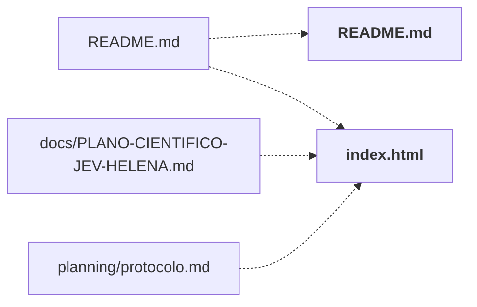

# lab/

Painel local de acompanhamento (servidor stdlib + HTML/JS): fila de rodadas, execuções, métricas e orçamento.

← [MAPA.md](../../MAPA.md) · pasta acima: [raiz](../../mapa/pastas/_raiz.md) · abrir a pasta: [lab/](../../lab)

## Subpastas

| subpasta | arquivos | finalidade |
|---|---:|---|
| [data/](../../mapa/pastas/lab__data.md) | 1 | Estado compartilhado do painel (`execution.json`). |
| [tests/](../../mapa/pastas/lab__tests.md) | 1 | Testes do servidor do painel. |

## Arquivos

| arquivo | tipo | tamanho | descrição |
|---|---|---:|---|
| [README.md](../../lab/README.md) | doc | 121 l. | JEV — interface de acompanhamento — Abra `lab/index.html` no navegador ou execute, na raiz do projeto: |
| [VALIDACAO.md](../../lab/VALIDACAO.md) | doc | 18 l. | Verificação da interface — 18/09/2026 — O estado entregue permanece com **zero execuções novas**. As 96 decisões do Hermes continuam na base histórica separada… |
| [build_ui.py](../../lab/build_ui.py) | código | 26 l. | Build a standalone HTML dashboard from local, credential-free data. |
| [dashboard.css](../../lab/dashboard.css) | web | 19 l. | Folha de estilo |
| [dashboard.html](../../lab/dashboard.html) | web | 34 l. | Página: JEV / Terminal de testes |
| [dashboard.js](../../lab/dashboard.js) | web | 208 l. | JavaScript; 40 funções |
| [index.html](../../lab/index.html) | web | 387 l. | Página: JEV / Terminal de testes |
| [metrics.js](../../lab/metrics.js) | web | 93 l. | Metrics calculated only from the selected real records. No generated examples. |
| [server.py](../../lab/server.py) | código | 301 l. | Local dashboard server. No inference endpoints or access to .env. |
| [template.html](../../lab/template.html) | web | 49 l. | Página: Jev · Laboratório Helena |
| [terminal.js](../../lab/terminal.js) | web | 31 l. | JavaScript; 4 funções |

## Grafo de imports e links

Nós em negrito são desta pasta; setas cheias são imports, tracejadas são links de documento.

## Ligações e conteúdo de cada arquivo

### README.md

- **usa** — citação: [`lab/build_ui.py`](../../lab/build_ui.py), [`lab/dashboard.css`](../../lab/dashboard.css), [`lab/dashboard.html`](../../lab/dashboard.html), [`lab/dashboard.js`](../../lab/dashboard.js), [`lab/data/execution.json`](../../lab/data/execution.json), [`lab/index.html`](../../lab/index.html), [`lab/metrics.js`](../../lab/metrics.js), [`lab/server.py`](../../lab/server.py)
- **é usado por** — link: [`README.md`](../../README.md); citação: [`lab/dashboard.js`](../../lab/dashboard.js), [`lab/index.html`](../../lab/index.html), [`lab/server.py`](../../lab/server.py)
- **parecidos (julgados pelo Jev)** — [`lab/VALIDACAO.md`](../../lab/VALIDACAO.md) (complementar, 0.23)
- **menciona 2 conceitos** — [S01](../../mapa/conhecimento/sistemas.md#s01) (2×), [S15](../../mapa/conhecimento/sistemas.md#s15) (1×)
- **conteúdo** — O que funciona (l. 11), Métricas e significado (l. 25), Como importar resultados reais (l. 38), Como o executor futuro publica sem intervenção manual (l. 104), Reconstrução e verificação (l. 114)

### VALIDACAO.md

- **parecidos (julgados pelo Jev)** — [`lab/README.md`](../../lab/README.md) (complementar, 0.23), [H076](../../mapa/conhecimento/hipoteses.md#h076) (complementar, 0.22)
- **conteúdo** — Concluído (l. 3), Ajuste de foco (l. 16)

### build_ui.py

- **usa** — citação: [`lab/dashboard.css`](../../lab/dashboard.css), [`lab/dashboard.html`](../../lab/dashboard.html), [`lab/dashboard.js`](../../lab/dashboard.js), [`lab/index.html`](../../lab/index.html), [`lab/metrics.js`](../../lab/metrics.js), [`lab/terminal.js`](../../lab/terminal.js), [`planning/plan.json`](../../planning/plan.json), [`research/hermes/fase2-decisoes-do-pdf.csv`](../../research/hermes/fase2-decisoes-do-pdf.csv)
- **é usado por** — citação: [`lab/README.md`](../../lab/README.md), [`laboratorio/r18-perguntas.json`](../../laboratorio/r18-perguntas.json), [`laboratorio/r20-k-adaptativo.json`](../../laboratorio/r20-k-adaptativo.json), [`laboratorio/r20-perguntas.json`](../../laboratorio/r20-perguntas.json), [`laboratorio/r38-dois-trechos-em-lista-bruto.json`](../../laboratorio/r38-dois-trechos-em-lista-bruto.json), [`laboratorio/r38-dois-trechos-em-lista.json`](../../laboratorio/r38-dois-trechos-em-lista.json), [`laboratorio/r39-codigo-numa-chamada-bruto.json`](../../laboratorio/r39-codigo-numa-chamada-bruto.json), [`laboratorio/r39-codigo-numa-chamada.json`](../../laboratorio/r39-codigo-numa-chamada.json), [`planning/build_deliverables.py`](../../planning/build_deliverables.py)
- **conteúdo** — [build](../../lab/build_ui.py#L9) (l. 9)

### dashboard.css

- **é usado por** — citação: [`lab/README.md`](../../lab/README.md), [`lab/build_ui.py`](../../lab/build_ui.py)

### dashboard.html

- **é usado por** — citação: [`lab/README.md`](../../lab/README.md), [`lab/build_ui.py`](../../lab/build_ui.py)

### dashboard.js

- **usa** — citação: [`docs/PLANO-CIENTIFICO-JEV-HELENA.md`](../../docs/PLANO-CIENTIFICO-JEV-HELENA.md), [`lab/README.md`](../../lab/README.md), [`output/pdf/PLANO-CIENTIFICO-JEV-HELENA.pdf`](../../output/pdf/PLANO-CIENTIFICO-JEV-HELENA.pdf), [`planning/matriz-testes.csv`](../../planning/matriz-testes.csv), [`planning/schema.sql`](../../planning/schema.sql), [`research/FONTES.md`](../../research/FONTES.md), [`research/hermes/auditoria-local.json`](../../research/hermes/auditoria-local.json), [`research/hermes/fase2-decisoes-do-pdf.csv`](../../research/hermes/fase2-decisoes-do-pdf.csv)
- **é usado por** — citação: [`lab/README.md`](../../lab/README.md), [`lab/build_ui.py`](../../lab/build_ui.py)
- **conteúdo** — [toast](../../lab/dashboard.js#L34) (l. 34), [notice](../../lab/dashboard.js#L35) (l. 35), [connection](../../lab/dashboard.js#L36) (l. 36), [metrics](../../lab/dashboard.js#L42) (l. 42), [optionsStatus](../../lab/dashboard.js#L52) (l. 52), [timeline](../../lab/dashboard.js#L53) (l. 53), [activity](../../lab/dashboard.js#L54) (l. 54), [overview](../../lab/dashboard.js#L58) (l. 58), [execution](../../lab/dashboard.js#L63) (l. 63), [systemsView](../../lab/dashboard.js#L69) (l. 69), [resultRows](../../lab/dashboard.js#L73) (l. 73), [resultsView](../../lab/dashboard.js#L78) (l. 78), [runList](../../lab/dashboard.js#L88) (l. 88), [budgetView](../../lab/dashboard.js#L91) (l. 91), [artifactURL](../../lab/dashboard.js#L97) (l. 97), [filesView](../../lab/dashboard.js#L98) (l. 98), [render](../../lab/dashboard.js#L101) (l. 101), [navigate](../../lab/dashboard.js#L108) (l. 108), [bindView](../../lab/dashboard.js#L109) (l. 109), [showSystem](../../lab/dashboard.js#L127) (l. 127), [safeLink](../../lab/dashboard.js#L132) (l. 132), [showRun](../../lab/dashboard.js#L133) (l. 133), [event](../../lab/dashboard.js#L137) (l. 137), [save](../../lab/dashboard.js#L138) (l. 138), [loadServer](../../lab/dashboard.js#L150) (l. 150), [initialize](../../lab/dashboard.js#L151) (l. 151), [assert](../../lab/dashboard.js#L156) (l. 156), [object](../../lab/dashboard.js#L157) (l. 157), [textField](../../lab/dashboard.js#L158) (l. 158), [numField](../../lab/dashboard.js#L159) (l. 159), [onlyKeys](../../lab/dashboard.js#L160) (l. 160), [validateRun](../../lab/dashboard.js#L161) (l. 161), [validateState](../../lab/dashboard.js#L171) (l. 171), [openImport](../../lab/dashboard.js#L179) (l. 179), [prepareImport](../../lab/dashboard.js#L180) (l. 180), [assertRunUpdate](../../lab/dashboard.js#L189) (l. 189), [download](../../lab/dashboard.js#L197) (l. 197), [downloadJSON](../../lab/dashboard.js#L198) (l. 198), [downloadCSV](../../lab/dashboard.js#L199) (l. 199), [backup](../../lab/dashboard.js#L200) (l. 200)

### index.html

- **usa** — citação: [`docs/PLANO-CIENTIFICO-JEV-HELENA.md`](../../docs/PLANO-CIENTIFICO-JEV-HELENA.md), [`docs/RELATORIO-FINAL-JEV.md`](../../docs/RELATORIO-FINAL-JEV.md), [`executor/gabarito.py`](../../executor/gabarito.py), [`executor/ledger.py`](../../executor/ledger.py), [`executor/prices.json`](../../executor/prices.json), [`executor/pricing.py`](../../executor/pricing.py), [`executor/runner.py`](../../executor/runner.py), [`executor/tests/test_achados_revisao.py`](../../executor/tests/test_achados_revisao.py), [`lab/README.md`](../../lab/README.md), [`output/pdf/PLANO-CIENTIFICO-JEV-HELENA.pdf`](../../output/pdf/PLANO-CIENTIFICO-JEV-HELENA.pdf), [`planning/matriz-testes.csv`](../../planning/matriz-testes.csv), [`planning/plan.json`](../../planning/plan.json), [`planning/schema.sql`](../../planning/schema.sql), [`research/FONTES.md`](../../research/FONTES.md), [`research/hermes/auditoria-local.json`](../../research/hermes/auditoria-local.json), [`research/hermes/fase2-decisoes-do-pdf.csv`](../../research/hermes/fase2-decisoes-do-pdf.csv)
- **é usado por** — link: [`README.md`](../../README.md), [`docs/PLANO-CIENTIFICO-JEV-HELENA.md`](../../docs/PLANO-CIENTIFICO-JEV-HELENA.md), [`planning/protocolo.md`](../../planning/protocolo.md); citação: [`lab/README.md`](../../lab/README.md), [`lab/build_ui.py`](../../lab/build_ui.py), [`lab/server.py`](../../lab/server.py), [`laboratorio/r21-prosa.json`](../../laboratorio/r21-prosa.json)
- **menciona 30 conceitos** — [S01](../../mapa/conhecimento/sistemas.md#s01) (20×), [E1](../../mapa/conhecimento/experimentos.md#e1) (13×), [E8](../../mapa/conhecimento/experimentos.md#e8) (11×), [E7](../../mapa/conhecimento/experimentos.md#e7) (10×), [E11](../../mapa/conhecimento/experimentos.md#e11) (6×), [S02](../../mapa/conhecimento/sistemas.md#s02) (5×), [S03](../../mapa/conhecimento/sistemas.md#s03) (5×), [S04](../../mapa/conhecimento/sistemas.md#s04) (5×), [S05](../../mapa/conhecimento/sistemas.md#s05) (5×), [S06](../../mapa/conhecimento/sistemas.md#s06) (5×), [S07](../../mapa/conhecimento/sistemas.md#s07) (5×), [S08](../../mapa/conhecimento/sistemas.md#s08) (5×), [S09](../../mapa/conhecimento/sistemas.md#s09) (5×), [S10](../../mapa/conhecimento/sistemas.md#s10) (5×), [S11](../../mapa/conhecimento/sistemas.md#s11) (5×), [S12](../../mapa/conhecimento/sistemas.md#s12) (5×), [S13](../../mapa/conhecimento/sistemas.md#s13) (5×), [S14](../../mapa/conhecimento/sistemas.md#s14) (5×), [S15](../../mapa/conhecimento/sistemas.md#s15) (5×), [E2](../../mapa/conhecimento/experimentos.md#e2) (4×), [E2b](../../mapa/conhecimento/experimentos.md#e2b) (4×), [E9](../../mapa/conhecimento/experimentos.md#e9) (4×), [E3](../../mapa/conhecimento/experimentos.md#e3) (3×), [E4](../../mapa/conhecimento/experimentos.md#e4) (3×), [E10](../../mapa/conhecimento/experimentos.md#e10) (3×) … e mais 5

### metrics.js

- **é usado por** — citação: [`lab/README.md`](../../lab/README.md), [`lab/build_ui.py`](../../lab/build_ui.py)
- **conteúdo** — [className](../../lab/metrics.js#L5) (l. 5), [percent](../../lab/metrics.js#L6) (l. 6), [wilsonInterval](../../lab/metrics.js#L7) (l. 7), [quantileNearest](../../lab/metrics.js#L8) (l. 8), [medianValue](../../lab/metrics.js#L9) (l. 9), [classificationStats](../../lab/metrics.js#L10) (l. 10), [metricSelection](../../lab/metrics.js#L23) (l. 23), [metricCard](../../lab/metrics.js#L35) (l. 35), [metricsView](../../lab/metrics.js#L36) (l. 36), [confusionSection](../../lab/metrics.js#L71) (l. 71), [operationalSection](../../lab/metrics.js#L74) (l. 74), [confidenceSection](../../lab/metrics.js#L87) (l. 87), [bindMetrics](../../lab/metrics.js#L90) (l. 90)

### server.py

- **usa** — citação: [`docs/PLANO-CIENTIFICO-JEV-HELENA.md`](../../docs/PLANO-CIENTIFICO-JEV-HELENA.md), [`executor/placar.py`](../../executor/placar.py), [`lab/README.md`](../../lab/README.md), [`lab/data/execution.json`](../../lab/data/execution.json), [`lab/index.html`](../../lab/index.html), [`output/pdf/PLANO-CIENTIFICO-JEV-HELENA.pdf`](../../output/pdf/PLANO-CIENTIFICO-JEV-HELENA.pdf), [`planning/matriz-testes.csv`](../../planning/matriz-testes.csv), [`planning/schema.sql`](../../planning/schema.sql), [`research/FONTES.md`](../../research/FONTES.md), [`research/hermes/auditoria-local.json`](../../research/hermes/auditoria-local.json), [`research/hermes/fase2-decisoes-do-pdf.csv`](../../research/hermes/fase2-decisoes-do-pdf.csv)
- **é usado por** — citação: [`README.md`](../../README.md), [`lab/README.md`](../../lab/README.md), [`lab/tests/test_server.py`](../../lab/tests/test_server.py), [`laboratorio/r17-economia-de-contexto.json`](../../laboratorio/r17-economia-de-contexto.json), [`laboratorio/r18-escala.json`](../../laboratorio/r18-escala.json), [`laboratorio/r18-perguntas.json`](../../laboratorio/r18-perguntas.json), [`laboratorio/r20-k-adaptativo.json`](../../laboratorio/r20-k-adaptativo.json), [`laboratorio/r20-perguntas.json`](../../laboratorio/r20-perguntas.json), [`laboratorio/r38-dois-trechos-em-lista-bruto.json`](../../laboratorio/r38-dois-trechos-em-lista-bruto.json), [`laboratorio/r38-dois-trechos-em-lista.json`](../../laboratorio/r38-dois-trechos-em-lista.json), [`laboratorio/r39-codigo-numa-chamada-bruto.json`](../../laboratorio/r39-codigo-numa-chamada-bruto.json), [`laboratorio/r39-codigo-numa-chamada.json`](../../laboratorio/r39-codigo-numa-chamada.json), [`laboratorio/r43-tamanho-da-lista-bruto.json`](../../laboratorio/r43-tamanho-da-lista-bruto.json), [`laboratorio/r43-tamanho-da-lista.json`](../../laboratorio/r43-tamanho-da-lista.json), [`laboratorio/r44-candidato-envenenado-bruto.json`](../../laboratorio/r44-candidato-envenenado-bruto.json), [`laboratorio/r44-candidato-envenenado.json`](../../laboratorio/r44-candidato-envenenado.json), [`laboratorio/r45-lista-nas-duas-ordens-bruto.json`](../../laboratorio/r45-lista-nas-duas-ordens-bruto.json), [`laboratorio/r45-lista-nas-duas-ordens.json`](../../laboratorio/r45-lista-nas-duas-ordens.json)
- **parecidos (julgados pelo Jev)** — [`hermes/jev_hermes/ponte_openai.py`](../../hermes/jev_hermes/ponte_openai.py) (complementar, 0.30), [`research/hermes/VALIDACAO-LOCAL.md`](../../research/hermes/VALIDACAO-LOCAL.md) (complementar, 0.25), [`executor/publish_simple_round.py`](../../executor/publish_simple_round.py) (complementar, 0.21)
- **conteúdo** — [require](../../lab/server.py#L34) (l. 34), [keys](../../lab/server.py#L39) (l. 39), [text](../../lab/server.py#L44) (l. 44), [numeric](../../lab/server.py#L48) (l. 48), [timestamp](../../lab/server.py#L56) (l. 56), [validate_state](../../lab/server.py#L64) (l. 64), [read_state](../../lab/server.py#L174) (l. 174), [validate_run_update](../../lab/server.py#L179) (l. 179), [write_state](../../lab/server.py#L201) (l. 201), [Handler](../../lab/server.py#L215) (l. 215), [main](../../lab/server.py#L290) (l. 290)

### template.html

- **usa** — citação: [`docs/PLANO-CIENTIFICO-JEV-HELENA.md`](../../docs/PLANO-CIENTIFICO-JEV-HELENA.md), [`output/pdf/PLANO-CIENTIFICO-JEV-HELENA.pdf`](../../output/pdf/PLANO-CIENTIFICO-JEV-HELENA.pdf), [`planning/schema.sql`](../../planning/schema.sql)

### terminal.js

- **é usado por** — citação: [`lab/build_ui.py`](../../lab/build_ui.py)
- **conteúdo** — [plannedQueue](../../lab/terminal.js#L2) (l. 2), [terminalLines](../../lab/terminal.js#L7) (l. 7), [decisionBoard](../../lab/terminal.js#L14) (l. 14), [terminalView](../../lab/terminal.js#L20) (l. 20)
