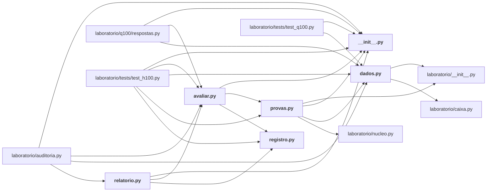

# laboratorio/h100/

Bateria H100: as cem hipóteses (dados, provas, avaliação, registro, relatório).

← [MAPA.md](../../MAPA.md) · pasta acima: [laboratorio](../../mapa/pastas/laboratorio.md) · abrir a pasta: [laboratorio/h100/](../../laboratorio/h100)

## Arquivos

| arquivo | tipo | tamanho | descrição |
|---|---|---:|---|
| [__init__.py](../../laboratorio/h100/__init__.py) | código | 0 B | Script Python |
| [avaliar.py](../../laboratorio/h100/avaliar.py) | código | 81 l. | Roda as cem provas, guarda o veredito e devolve o placar. |
| [dados.py](../../laboratorio/h100/dados.py) | código | 224 l. | Carregadores das fontes que decidem as cem hipóteses. |
| [provas.py](../../laboratorio/h100/provas.py) | código | 1153 l. | Uma prova por hipótese: mede, compara com o critério registrado e devolve o veredito. |
| [registro.py](../../laboratorio/h100/registro.py) | código | 515 l. | As cem hipóteses sobre o Jev, com a previsão escrita antes do teste. |
| [relatorio.py](../../laboratorio/h100/relatorio.py) | código | 175 l. | Gera `docs/CEM-HIPOTESES.md` a partir do registro e dos vereditos. |

## Grafo de imports e links

Nós em negrito são desta pasta; setas cheias são imports, tracejadas são links de documento.

## Ligações e conteúdo de cada arquivo

### __init__.py

- **é usado por** — import: [`laboratorio/auditoria.py`](../../laboratorio/auditoria.py), [`laboratorio/h100/avaliar.py`](../../laboratorio/h100/avaliar.py), [`laboratorio/h100/provas.py`](../../laboratorio/h100/provas.py), [`laboratorio/h100/relatorio.py`](../../laboratorio/h100/relatorio.py), [`laboratorio/q100/respostas.py`](../../laboratorio/q100/respostas.py), [`laboratorio/tests/test_h100.py`](../../laboratorio/tests/test_h100.py), [`laboratorio/tests/test_q100.py`](../../laboratorio/tests/test_q100.py)

### avaliar.py

- **usa** — import: [`laboratorio/h100/__init__.py`](../../laboratorio/h100/__init__.py), [`laboratorio/h100/provas.py`](../../laboratorio/h100/provas.py), [`laboratorio/h100/registro.py`](../../laboratorio/h100/registro.py); citação: [`laboratorio/h100-resultados.json`](../../laboratorio/h100-resultados.json)
- **é usado por** — import: [`laboratorio/auditoria.py`](../../laboratorio/auditoria.py), [`laboratorio/h100/relatorio.py`](../../laboratorio/h100/relatorio.py), [`laboratorio/q100/respostas.py`](../../laboratorio/q100/respostas.py), [`laboratorio/tests/test_h100.py`](../../laboratorio/tests/test_h100.py); citação: [`docs/CEM-HIPOTESES.md`](../../docs/CEM-HIPOTESES.md)
- **parecidos (julgados pelo Jev)** — [`laboratorio/r16_guarda_de_comando.py`](../../laboratorio/r16_guarda_de_comando.py) (complementar, 0.28), [`integracao/camadas/rotina.py`](../../integracao/camadas/rotina.py) (complementar, 0.22)
- **conteúdo** — [rodar](../../laboratorio/h100/avaliar.py#L25) (l. 25; usado em 4), [placar](../../laboratorio/h100/avaliar.py#L44) (l. 44), [por_familia](../../laboratorio/h100/avaliar.py#L48) (l. 48), [main](../../laboratorio/h100/avaliar.py#L55) (l. 55)

### dados.py

- **usa** — import: [`laboratorio/__init__.py`](../../laboratorio/__init__.py), [`laboratorio/caixa.py`](../../laboratorio/caixa.py); citação: [`laboratorio/r1-r3-estresse.json`](../../laboratorio/r1-r3-estresse.json), [`laboratorio/r10-injecao-comparada.json`](../../laboratorio/r10-injecao-comparada.json), [`laboratorio/r11-extremos.json`](../../laboratorio/r11-extremos.json), [`laboratorio/r12-r13-contexto.json`](../../laboratorio/r12-r13-contexto.json), [`laboratorio/r15-adversario-externo.json`](../../laboratorio/r15-adversario-externo.json), [`laboratorio/r19-armadilha.json`](../../laboratorio/r19-armadilha.json), [`laboratorio/r4-r7-limites.json`](../../laboratorio/r4-r7-limites.json), [`laboratorio/r8-r9-adversarial.json`](../../laboratorio/r8-r9-adversarial.json), [`laboratorio/retratacoes.json`](../../laboratorio/retratacoes.json)
- **é usado por** — import: [`laboratorio/auditoria.py`](../../laboratorio/auditoria.py), [`laboratorio/h100/provas.py`](../../laboratorio/h100/provas.py), [`laboratorio/q100/respostas.py`](../../laboratorio/q100/respostas.py), [`laboratorio/tests/test_h100.py`](../../laboratorio/tests/test_h100.py), [`laboratorio/tests/test_q100.py`](../../laboratorio/tests/test_q100.py)
- **chama de outros arquivos** — [`caixa.conciliado`](../../laboratorio/caixa.py#L48), [`caixa.corte_utc`](../../laboratorio/caixa.py#L64)
- **parecidos (julgados pelo Jev)** — [`laboratorio/q100/registro.py`](../../laboratorio/q100/registro.py) (complementar, 0.20)
- **menciona 17 conceitos** — [R10](../../mapa/conhecimento/rodadas.md#r10) (3×), [R15](../../mapa/conhecimento/rodadas.md#r15) (3×), [R4](../../mapa/conhecimento/rodadas.md#r4) (2×), [R11](../../mapa/conhecimento/rodadas.md#r11) (2×), [R1](../../mapa/conhecimento/rodadas.md#r1) (1×), [R2](../../mapa/conhecimento/rodadas.md#r2) (1×), [R3](../../mapa/conhecimento/rodadas.md#r3) (1×), [R5](../../mapa/conhecimento/rodadas.md#r5) (1×), [R6](../../mapa/conhecimento/rodadas.md#r6) (1×), [R7](../../mapa/conhecimento/rodadas.md#r7) (1×), [R8](../../mapa/conhecimento/rodadas.md#r8) (1×), [R9](../../mapa/conhecimento/rodadas.md#r9) (1×), [R12](../../mapa/conhecimento/rodadas.md#r12) (1×), [R13](../../mapa/conhecimento/rodadas.md#r13) (1×), [R16](../../mapa/conhecimento/rodadas.md#r16) (1×), [R19](../../mapa/conhecimento/rodadas.md#r19) (1×), [H087](../../mapa/conhecimento/hipoteses.md#h087) (1×)
- **conteúdo** — [artefato](../../laboratorio/h100/dados.py#L31) (l. 31; usado em 2), [decisoes](../../laboratorio/h100/dados.py#L36) (l. 36; usado em 2), [tentativas](../../laboratorio/h100/dados.py#L70) (l. 70; usado em 2), [custo_por_experimento](../../laboratorio/h100/dados.py#L86) (l. 86; usado em 1), [retratacoes](../../laboratorio/h100/dados.py#L93) (l. 93; usado em 3), [esta_retratada](../../laboratorio/h100/dados.py#L104) (l. 104; usado em 2), [gastos](../../laboratorio/h100/dados.py#L112) (l. 112; usado em 2), [linhas_com_gabarito](../../laboratorio/h100/dados.py#L120) (l. 120; usado em 2), [apenas_jev](../../laboratorio/h100/dados.py#L165) (l. 165; usado em 2), [entropia](../../laboratorio/h100/dados.py#L173) (l. 173; usado em 1), [pearson](../../laboratorio/h100/dados.py#L182) (l. 182; usado em 2), [auc](../../laboratorio/h100/dados.py#L195) (l. 195; usado em 1), [percentil](../../laboratorio/h100/dados.py#L211) (l. 211; usado em 2), [mediana](../../laboratorio/h100/dados.py#L219) (l. 219; usado em 2), [taxa](../../laboratorio/h100/dados.py#L223) (l. 223)

### provas.py

- **usa** — import: [`laboratorio/__init__.py`](../../laboratorio/__init__.py), [`laboratorio/h100/__init__.py`](../../laboratorio/h100/__init__.py), [`laboratorio/h100/dados.py`](../../laboratorio/h100/dados.py), [`laboratorio/nucleo.py`](../../laboratorio/nucleo.py); citação: [`laboratorio/mapa-de-limites.json`](../../laboratorio/mapa-de-limites.json), [`laboratorio/r0-calibracao.json`](../../laboratorio/r0-calibracao.json), [`laboratorio/r1-r3-estresse.json`](../../laboratorio/r1-r3-estresse.json), [`laboratorio/r11-extremos.json`](../../laboratorio/r11-extremos.json), [`laboratorio/r12-r13-contexto.json`](../../laboratorio/r12-r13-contexto.json), [`laboratorio/r15-adversario-externo.json`](../../laboratorio/r15-adversario-externo.json), [`laboratorio/r15b-familias.json`](../../laboratorio/r15b-familias.json), [`laboratorio/r16-resumo.json`](../../laboratorio/r16-resumo.json), [`laboratorio/r18-escala.json`](../../laboratorio/r18-escala.json), [`laboratorio/r18-r20-consolidado.json`](../../laboratorio/r18-r20-consolidado.json), [`laboratorio/r19-armadilha.json`](../../laboratorio/r19-armadilha.json), [`laboratorio/r20-k-adaptativo.json`](../../laboratorio/r20-k-adaptativo.json), [`laboratorio/r21-generalizacao.json`](../../laboratorio/r21-generalizacao.json), [`laboratorio/r21b-cruzamento.json`](../../laboratorio/r21b-cruzamento.json), [`laboratorio/r4-r7-limites.json`](../../laboratorio/r4-r7-limites.json), [`laboratorio/r8-r9-adversarial.json`](../../laboratorio/r8-r9-adversarial.json)
- **é usado por** — import: [`laboratorio/h100/avaliar.py`](../../laboratorio/h100/avaliar.py), [`laboratorio/tests/test_h100.py`](../../laboratorio/tests/test_h100.py); citação: [`docs/CEM-HIPOTESES.md`](../../docs/CEM-HIPOTESES.md), [`laboratorio/h100/relatorio.py`](../../laboratorio/h100/relatorio.py)
- **chama de outros arquivos** — [`dados.apenas_jev`](../../laboratorio/h100/dados.py#L165), [`dados.artefato`](../../laboratorio/h100/dados.py#L31), [`dados.auc`](../../laboratorio/h100/dados.py#L195), [`dados.custo_por_experimento`](../../laboratorio/h100/dados.py#L86), [`dados.decisoes`](../../laboratorio/h100/dados.py#L36), [`dados.entropia`](../../laboratorio/h100/dados.py#L173), [`dados.esta_retratada`](../../laboratorio/h100/dados.py#L104), [`dados.gastos`](../../laboratorio/h100/dados.py#L112), [`dados.linhas_com_gabarito`](../../laboratorio/h100/dados.py#L120), [`dados.mediana`](../../laboratorio/h100/dados.py#L219), [`dados.pearson`](../../laboratorio/h100/dados.py#L182), [`dados.percentil`](../../laboratorio/h100/dados.py#L211), [`dados.tentativas`](../../laboratorio/h100/dados.py#L70), [`nucleo.wilson`](../../laboratorio/nucleo.py#L156)
- **papel nos estudos** — prova [H001](../../mapa/conhecimento/hipoteses.md#h001), prova [H002](../../mapa/conhecimento/hipoteses.md#h002), prova [H003](../../mapa/conhecimento/hipoteses.md#h003), prova [H004](../../mapa/conhecimento/hipoteses.md#h004), prova [H005](../../mapa/conhecimento/hipoteses.md#h005), prova [H006](../../mapa/conhecimento/hipoteses.md#h006), prova [H007](../../mapa/conhecimento/hipoteses.md#h007), prova [H008](../../mapa/conhecimento/hipoteses.md#h008), prova [H009](../../mapa/conhecimento/hipoteses.md#h009), prova [H010](../../mapa/conhecimento/hipoteses.md#h010), prova [H011](../../mapa/conhecimento/hipoteses.md#h011), prova [H012](../../mapa/conhecimento/hipoteses.md#h012), prova [H013](../../mapa/conhecimento/hipoteses.md#h013), prova [H014](../../mapa/conhecimento/hipoteses.md#h014), prova [H015](../../mapa/conhecimento/hipoteses.md#h015), prova [H016](../../mapa/conhecimento/hipoteses.md#h016), prova [H017](../../mapa/conhecimento/hipoteses.md#h017), prova [H018](../../mapa/conhecimento/hipoteses.md#h018), prova [H019](../../mapa/conhecimento/hipoteses.md#h019), prova [H020](../../mapa/conhecimento/hipoteses.md#h020), prova [H021](../../mapa/conhecimento/hipoteses.md#h021), prova [H022](../../mapa/conhecimento/hipoteses.md#h022), prova [H023](../../mapa/conhecimento/hipoteses.md#h023), prova [H024](../../mapa/conhecimento/hipoteses.md#h024), prova [H025](../../mapa/conhecimento/hipoteses.md#h025), prova [H026](../../mapa/conhecimento/hipoteses.md#h026), prova [H027](../../mapa/conhecimento/hipoteses.md#h027), prova [H028](../../mapa/conhecimento/hipoteses.md#h028), prova [H029](../../mapa/conhecimento/hipoteses.md#h029), prova [H030](../../mapa/conhecimento/hipoteses.md#h030), prova [H031](../../mapa/conhecimento/hipoteses.md#h031), prova [H032](../../mapa/conhecimento/hipoteses.md#h032), prova [H033](../../mapa/conhecimento/hipoteses.md#h033), prova [H034](../../mapa/conhecimento/hipoteses.md#h034), prova [H035](../../mapa/conhecimento/hipoteses.md#h035), prova [H036](../../mapa/conhecimento/hipoteses.md#h036), prova [H037](../../mapa/conhecimento/hipoteses.md#h037), prova [H038](../../mapa/conhecimento/hipoteses.md#h038), prova [H039](../../mapa/conhecimento/hipoteses.md#h039), prova [H040](../../mapa/conhecimento/hipoteses.md#h040), prova [H041](../../mapa/conhecimento/hipoteses.md#h041), prova [H042](../../mapa/conhecimento/hipoteses.md#h042), prova [H043](../../mapa/conhecimento/hipoteses.md#h043), prova [H044](../../mapa/conhecimento/hipoteses.md#h044), prova [H045](../../mapa/conhecimento/hipoteses.md#h045), prova [H046](../../mapa/conhecimento/hipoteses.md#h046), prova [H047](../../mapa/conhecimento/hipoteses.md#h047), prova [H048](../../mapa/conhecimento/hipoteses.md#h048), prova [H049](../../mapa/conhecimento/hipoteses.md#h049), prova [H050](../../mapa/conhecimento/hipoteses.md#h050), prova [H051](../../mapa/conhecimento/hipoteses.md#h051), prova [H052](../../mapa/conhecimento/hipoteses.md#h052), prova [H053](../../mapa/conhecimento/hipoteses.md#h053), prova [H054](../../mapa/conhecimento/hipoteses.md#h054), prova [H055](../../mapa/conhecimento/hipoteses.md#h055), prova [H056](../../mapa/conhecimento/hipoteses.md#h056), prova [H057](../../mapa/conhecimento/hipoteses.md#h057), prova [H058](../../mapa/conhecimento/hipoteses.md#h058), prova [H059](../../mapa/conhecimento/hipoteses.md#h059), prova [H060](../../mapa/conhecimento/hipoteses.md#h060), prova [H061](../../mapa/conhecimento/hipoteses.md#h061), prova [H062](../../mapa/conhecimento/hipoteses.md#h062), prova [H063](../../mapa/conhecimento/hipoteses.md#h063), prova [H064](../../mapa/conhecimento/hipoteses.md#h064), prova [H065](../../mapa/conhecimento/hipoteses.md#h065), prova [H066](../../mapa/conhecimento/hipoteses.md#h066), prova [H067](../../mapa/conhecimento/hipoteses.md#h067), prova [H068](../../mapa/conhecimento/hipoteses.md#h068), prova [H069](../../mapa/conhecimento/hipoteses.md#h069), prova [H070](../../mapa/conhecimento/hipoteses.md#h070), prova [H071](../../mapa/conhecimento/hipoteses.md#h071), prova [H072](../../mapa/conhecimento/hipoteses.md#h072), prova [H073](../../mapa/conhecimento/hipoteses.md#h073), prova [H074](../../mapa/conhecimento/hipoteses.md#h074), prova [H075](../../mapa/conhecimento/hipoteses.md#h075), prova [H076](../../mapa/conhecimento/hipoteses.md#h076), prova [H077](../../mapa/conhecimento/hipoteses.md#h077), prova [H078](../../mapa/conhecimento/hipoteses.md#h078), prova [H079](../../mapa/conhecimento/hipoteses.md#h079), prova [H080](../../mapa/conhecimento/hipoteses.md#h080), prova [H081](../../mapa/conhecimento/hipoteses.md#h081), prova [H082](../../mapa/conhecimento/hipoteses.md#h082), prova [H083](../../mapa/conhecimento/hipoteses.md#h083), prova [H084](../../mapa/conhecimento/hipoteses.md#h084), prova [H085](../../mapa/conhecimento/hipoteses.md#h085), prova [H086](../../mapa/conhecimento/hipoteses.md#h086), prova [H087](../../mapa/conhecimento/hipoteses.md#h087), prova [H088](../../mapa/conhecimento/hipoteses.md#h088), prova [H089](../../mapa/conhecimento/hipoteses.md#h089), prova [H090](../../mapa/conhecimento/hipoteses.md#h090), prova [H091](../../mapa/conhecimento/hipoteses.md#h091), prova [H092](../../mapa/conhecimento/hipoteses.md#h092), prova [H093](../../mapa/conhecimento/hipoteses.md#h093), prova [H094](../../mapa/conhecimento/hipoteses.md#h094), prova [H095](../../mapa/conhecimento/hipoteses.md#h095), prova [H096](../../mapa/conhecimento/hipoteses.md#h096), prova [H097](../../mapa/conhecimento/hipoteses.md#h097), prova [H098](../../mapa/conhecimento/hipoteses.md#h098), prova [H099](../../mapa/conhecimento/hipoteses.md#h099), prova [H100](../../mapa/conhecimento/hipoteses.md#h100)
- **menciona 16 conceitos** — [R12](../../mapa/conhecimento/rodadas.md#r12) (7×), [R11](../../mapa/conhecimento/rodadas.md#r11) (6×), [R9](../../mapa/conhecimento/rodadas.md#r9) (4×), [R8](../../mapa/conhecimento/rodadas.md#r8) (2×), [R21b](../../mapa/conhecimento/rodadas.md#r21b) (2×), [R1](../../mapa/conhecimento/rodadas.md#r1) (1×), [R2](../../mapa/conhecimento/rodadas.md#r2) (1×), [R3](../../mapa/conhecimento/rodadas.md#r3) (1×), [R4](../../mapa/conhecimento/rodadas.md#r4) (1×), [R5](../../mapa/conhecimento/rodadas.md#r5) (1×), [R6](../../mapa/conhecimento/rodadas.md#r6) (1×), [R7](../../mapa/conhecimento/rodadas.md#r7) (1×), [R15](../../mapa/conhecimento/rodadas.md#r15) (1×), [R15b](../../mapa/conhecimento/rodadas.md#r15b) (1×), [R18](../../mapa/conhecimento/rodadas.md#r18) (1×), [R20](../../mapa/conhecimento/rodadas.md#r20) (1×)
- **conteúdo** — [prova](../../laboratorio/h100/provas.py#L24) (l. 24), [ok](../../laboratorio/h100/provas.py#L31) (l. 31), [inconclusiva](../../laboratorio/h100/provas.py#L36) (l. 36), [_acuracia](../../laboratorio/h100/provas.py#L40) (l. 40), [_condicao_r11](../../laboratorio/h100/provas.py#L47) (l. 47), [_referencia_r11](../../laboratorio/h100/provas.py#L51) (l. 51), [h001](../../laboratorio/h100/provas.py#L57) (l. 57), [_recibos_liquidados](../../laboratorio/h100/provas.py#L69) (l. 69), [h002](../../laboratorio/h100/provas.py#L76) (l. 76), [h003](../../laboratorio/h100/provas.py#L83) (l. 83), [h004](../../laboratorio/h100/provas.py#L90) (l. 90), [h005](../../laboratorio/h100/provas.py#L99) (l. 99), [h006](../../laboratorio/h100/provas.py#L110) (l. 110), [h007](../../laboratorio/h100/provas.py#L119) (l. 119), [h008](../../laboratorio/h100/provas.py#L127) (l. 127), [h009](../../laboratorio/h100/provas.py#L135) (l. 135), [h010](../../laboratorio/h100/provas.py#L142) (l. 142), [h011](../../laboratorio/h100/provas.py#L149) (l. 149), [h012](../../laboratorio/h100/provas.py#L172) (l. 172), [h013](../../laboratorio/h100/provas.py#L198) (l. 198), [h014](../../laboratorio/h100/provas.py#L216) (l. 216), [h015](../../laboratorio/h100/provas.py#L226) (l. 226), [h016](../../laboratorio/h100/provas.py#L235) (l. 235), [h017](../../laboratorio/h100/provas.py#L246) (l. 246), [h018](../../laboratorio/h100/provas.py#L257) (l. 257), [h019](../../laboratorio/h100/provas.py#L266) (l. 266), [h020](../../laboratorio/h100/provas.py#L279) (l. 279), [h021](../../laboratorio/h100/provas.py#L289) (l. 289), [h022](../../laboratorio/h100/provas.py#L298) (l. 298), [h023](../../laboratorio/h100/provas.py#L308) (l. 308), [h024](../../laboratorio/h100/provas.py#L314) (l. 314), [h025](../../laboratorio/h100/provas.py#L322) (l. 322), [h026](../../laboratorio/h100/provas.py#L329) (l. 329), [_vetores_do_caixa](../../laboratorio/h100/provas.py#L339) (l. 339), [h027](../../laboratorio/h100/provas.py#L345) (l. 345), [h028](../../laboratorio/h100/provas.py#L353) (l. 353), [h029](../../laboratorio/h100/provas.py#L366) (l. 366), [h030](../../laboratorio/h100/provas.py#L378) (l. 378), [h031](../../laboratorio/h100/provas.py#L392) (l. 392), [h032](../../laboratorio/h100/provas.py#L400) (l. 400) … e mais 75

### registro.py

- **é usado por** — import: [`laboratorio/h100/avaliar.py`](../../laboratorio/h100/avaliar.py), [`laboratorio/h100/relatorio.py`](../../laboratorio/h100/relatorio.py), [`laboratorio/tests/test_h100.py`](../../laboratorio/tests/test_h100.py); citação: [`docs/CEM-HIPOTESES.md`](../../docs/CEM-HIPOTESES.md)
- **parecidos (julgados pelo Jev)** — [Q087](../../mapa/conhecimento/perguntas.md#q087) (complementar, 0.20), [`laboratorio/q100/registro.py`](../../laboratorio/q100/registro.py) (complementar, 0.20)
- **papel nos estudos** — registra [H001](../../mapa/conhecimento/hipoteses.md#h001), registra [H002](../../mapa/conhecimento/hipoteses.md#h002), registra [H003](../../mapa/conhecimento/hipoteses.md#h003), registra [H004](../../mapa/conhecimento/hipoteses.md#h004), registra [H005](../../mapa/conhecimento/hipoteses.md#h005), registra [H006](../../mapa/conhecimento/hipoteses.md#h006), registra [H007](../../mapa/conhecimento/hipoteses.md#h007), registra [H008](../../mapa/conhecimento/hipoteses.md#h008), registra [H009](../../mapa/conhecimento/hipoteses.md#h009), registra [H010](../../mapa/conhecimento/hipoteses.md#h010), registra [H011](../../mapa/conhecimento/hipoteses.md#h011), registra [H012](../../mapa/conhecimento/hipoteses.md#h012), registra [H013](../../mapa/conhecimento/hipoteses.md#h013), registra [H014](../../mapa/conhecimento/hipoteses.md#h014), registra [H015](../../mapa/conhecimento/hipoteses.md#h015), registra [H016](../../mapa/conhecimento/hipoteses.md#h016), registra [H017](../../mapa/conhecimento/hipoteses.md#h017), registra [H018](../../mapa/conhecimento/hipoteses.md#h018), registra [H019](../../mapa/conhecimento/hipoteses.md#h019), registra [H020](../../mapa/conhecimento/hipoteses.md#h020), registra [H021](../../mapa/conhecimento/hipoteses.md#h021), registra [H022](../../mapa/conhecimento/hipoteses.md#h022), registra [H023](../../mapa/conhecimento/hipoteses.md#h023), registra [H024](../../mapa/conhecimento/hipoteses.md#h024), registra [H025](../../mapa/conhecimento/hipoteses.md#h025), registra [H026](../../mapa/conhecimento/hipoteses.md#h026), registra [H027](../../mapa/conhecimento/hipoteses.md#h027), registra [H028](../../mapa/conhecimento/hipoteses.md#h028), registra [H029](../../mapa/conhecimento/hipoteses.md#h029), registra [H030](../../mapa/conhecimento/hipoteses.md#h030), registra [H031](../../mapa/conhecimento/hipoteses.md#h031), registra [H032](../../mapa/conhecimento/hipoteses.md#h032), registra [H033](../../mapa/conhecimento/hipoteses.md#h033), registra [H034](../../mapa/conhecimento/hipoteses.md#h034), registra [H035](../../mapa/conhecimento/hipoteses.md#h035), registra [H036](../../mapa/conhecimento/hipoteses.md#h036), registra [H037](../../mapa/conhecimento/hipoteses.md#h037), registra [H038](../../mapa/conhecimento/hipoteses.md#h038), registra [H039](../../mapa/conhecimento/hipoteses.md#h039), registra [H040](../../mapa/conhecimento/hipoteses.md#h040), registra [H041](../../mapa/conhecimento/hipoteses.md#h041), registra [H042](../../mapa/conhecimento/hipoteses.md#h042), registra [H043](../../mapa/conhecimento/hipoteses.md#h043), registra [H044](../../mapa/conhecimento/hipoteses.md#h044), registra [H045](../../mapa/conhecimento/hipoteses.md#h045), registra [H046](../../mapa/conhecimento/hipoteses.md#h046), registra [H047](../../mapa/conhecimento/hipoteses.md#h047), registra [H048](../../mapa/conhecimento/hipoteses.md#h048), registra [H049](../../mapa/conhecimento/hipoteses.md#h049), registra [H050](../../mapa/conhecimento/hipoteses.md#h050), registra [H051](../../mapa/conhecimento/hipoteses.md#h051), registra [H052](../../mapa/conhecimento/hipoteses.md#h052), registra [H053](../../mapa/conhecimento/hipoteses.md#h053), registra [H054](../../mapa/conhecimento/hipoteses.md#h054), registra [H055](../../mapa/conhecimento/hipoteses.md#h055), registra [H056](../../mapa/conhecimento/hipoteses.md#h056), registra [H057](../../mapa/conhecimento/hipoteses.md#h057), registra [H058](../../mapa/conhecimento/hipoteses.md#h058), registra [H059](../../mapa/conhecimento/hipoteses.md#h059), registra [H060](../../mapa/conhecimento/hipoteses.md#h060), registra [H061](../../mapa/conhecimento/hipoteses.md#h061), registra [H062](../../mapa/conhecimento/hipoteses.md#h062), registra [H063](../../mapa/conhecimento/hipoteses.md#h063), registra [H064](../../mapa/conhecimento/hipoteses.md#h064), registra [H065](../../mapa/conhecimento/hipoteses.md#h065), registra [H066](../../mapa/conhecimento/hipoteses.md#h066), registra [H067](../../mapa/conhecimento/hipoteses.md#h067), registra [H068](../../mapa/conhecimento/hipoteses.md#h068), registra [H069](../../mapa/conhecimento/hipoteses.md#h069), registra [H070](../../mapa/conhecimento/hipoteses.md#h070), registra [H071](../../mapa/conhecimento/hipoteses.md#h071), registra [H072](../../mapa/conhecimento/hipoteses.md#h072), registra [H073](../../mapa/conhecimento/hipoteses.md#h073), registra [H074](../../mapa/conhecimento/hipoteses.md#h074), registra [H075](../../mapa/conhecimento/hipoteses.md#h075), registra [H076](../../mapa/conhecimento/hipoteses.md#h076), registra [H077](../../mapa/conhecimento/hipoteses.md#h077), registra [H078](../../mapa/conhecimento/hipoteses.md#h078), registra [H079](../../mapa/conhecimento/hipoteses.md#h079), registra [H080](../../mapa/conhecimento/hipoteses.md#h080), registra [H081](../../mapa/conhecimento/hipoteses.md#h081), registra [H082](../../mapa/conhecimento/hipoteses.md#h082), registra [H083](../../mapa/conhecimento/hipoteses.md#h083), registra [H084](../../mapa/conhecimento/hipoteses.md#h084), registra [H085](../../mapa/conhecimento/hipoteses.md#h085), registra [H086](../../mapa/conhecimento/hipoteses.md#h086), registra [H087](../../mapa/conhecimento/hipoteses.md#h087), registra [H088](../../mapa/conhecimento/hipoteses.md#h088), registra [H089](../../mapa/conhecimento/hipoteses.md#h089), registra [H090](../../mapa/conhecimento/hipoteses.md#h090), registra [H091](../../mapa/conhecimento/hipoteses.md#h091), registra [H092](../../mapa/conhecimento/hipoteses.md#h092), registra [H093](../../mapa/conhecimento/hipoteses.md#h093), registra [H094](../../mapa/conhecimento/hipoteses.md#h094), registra [H095](../../mapa/conhecimento/hipoteses.md#h095), registra [H096](../../mapa/conhecimento/hipoteses.md#h096), registra [H097](../../mapa/conhecimento/hipoteses.md#h097), registra [H098](../../mapa/conhecimento/hipoteses.md#h098), registra [H099](../../mapa/conhecimento/hipoteses.md#h099), registra [H100](../../mapa/conhecimento/hipoteses.md#h100)
- **menciona 22 conceitos** — [R11](../../mapa/conhecimento/rodadas.md#r11) (16×), [R18](../../mapa/conhecimento/rodadas.md#r18) (14×), [R20](../../mapa/conhecimento/rodadas.md#r20) (12×), [R8](../../mapa/conhecimento/rodadas.md#r8) (10×), [R19](../../mapa/conhecimento/rodadas.md#r19) (9×), [R1](../../mapa/conhecimento/rodadas.md#r1) (8×), [R2](../../mapa/conhecimento/rodadas.md#r2) (8×), [R3](../../mapa/conhecimento/rodadas.md#r3) (8×), [R7](../../mapa/conhecimento/rodadas.md#r7) (7×), [R6](../../mapa/conhecimento/rodadas.md#r6) (6×), [R4](../../mapa/conhecimento/rodadas.md#r4) (5×), [R5](../../mapa/conhecimento/rodadas.md#r5) (5×), [R9](../../mapa/conhecimento/rodadas.md#r9) (5×), [R12](../../mapa/conhecimento/rodadas.md#r12) (5×), [R15b](../../mapa/conhecimento/rodadas.md#r15b) (4×), [R15](../../mapa/conhecimento/rodadas.md#r15) (3×), [R16b](../../mapa/conhecimento/rodadas.md#r16b) (3×), [R0](../../mapa/conhecimento/rodadas.md#r0) (2×), [R21](../../mapa/conhecimento/rodadas.md#r21) (2×), [R22](../../mapa/conhecimento/rodadas.md#r22) (2×), [R16](../../mapa/conhecimento/rodadas.md#r16) (1×), [R23](../../mapa/conhecimento/rodadas.md#r23) (1×)
- **conteúdo** — [H](../../laboratorio/h100/registro.py#L40) (l. 40)

### relatorio.py

- **usa** — import: [`laboratorio/h100/__init__.py`](../../laboratorio/h100/__init__.py), [`laboratorio/h100/avaliar.py`](../../laboratorio/h100/avaliar.py), [`laboratorio/h100/registro.py`](../../laboratorio/h100/registro.py); citação: [`docs/CEM-HIPOTESES.md`](../../docs/CEM-HIPOTESES.md), [`laboratorio/auditoria.py`](../../laboratorio/auditoria.py), [`laboratorio/h100/provas.py`](../../laboratorio/h100/provas.py)
- **é usado por** — import: [`laboratorio/auditoria.py`](../../laboratorio/auditoria.py); citação: [`docs/CEM-HIPOTESES.md`](../../docs/CEM-HIPOTESES.md)
- **chama de outros arquivos** — [`avaliar.rodar`](../../laboratorio/h100/avaliar.py#L25)
- **parecidos (julgados pelo Jev)** — [`laboratorio/q100/relatorio.py`](../../laboratorio/q100/relatorio.py) (complementar, 0.70), [`laboratorio/gerar_dossie.py`](../../laboratorio/gerar_dossie.py) (complementar, 0.29), [`laboratorio/gerar_bateria.py`](../../laboratorio/gerar_bateria.py) (complementar, 0.27)
- **menciona 20 conceitos** — [R23](../../mapa/conhecimento/rodadas.md#r23) (3×), [R18](../../mapa/conhecimento/rodadas.md#r18) (2×), [R22](../../mapa/conhecimento/rodadas.md#r22) (2×), [R26](../../mapa/conhecimento/rodadas.md#r26) (2×), [R15](../../mapa/conhecimento/rodadas.md#r15) (1×), [R15b](../../mapa/conhecimento/rodadas.md#r15b) (1×), [R24](../../mapa/conhecimento/rodadas.md#r24) (1×), [R25](../../mapa/conhecimento/rodadas.md#r25) (1×), [H012](../../mapa/conhecimento/hipoteses.md#h012) (1×), [H015](../../mapa/conhecimento/hipoteses.md#h015) (1×), [H038](../../mapa/conhecimento/hipoteses.md#h038) (1×), [H043](../../mapa/conhecimento/hipoteses.md#h043) (1×), [H058](../../mapa/conhecimento/hipoteses.md#h058) (1×), [H065](../../mapa/conhecimento/hipoteses.md#h065) (1×), [H089](../../mapa/conhecimento/hipoteses.md#h089) (1×), [H094](../../mapa/conhecimento/hipoteses.md#h094) (1×), [H095](../../mapa/conhecimento/hipoteses.md#h095) (1×), [H098](../../mapa/conhecimento/hipoteses.md#h098) (1×), [H100](../../mapa/conhecimento/hipoteses.md#h100) (1×), [Q072](../../mapa/conhecimento/perguntas.md#q072) (1×)
- **conteúdo** — [_formatar](../../laboratorio/h100/relatorio.py#L80) (l. 80), [montar](../../laboratorio/h100/relatorio.py#L88) (l. 88; usado em 1), [main](../../laboratorio/h100/relatorio.py#L168) (l. 168)
