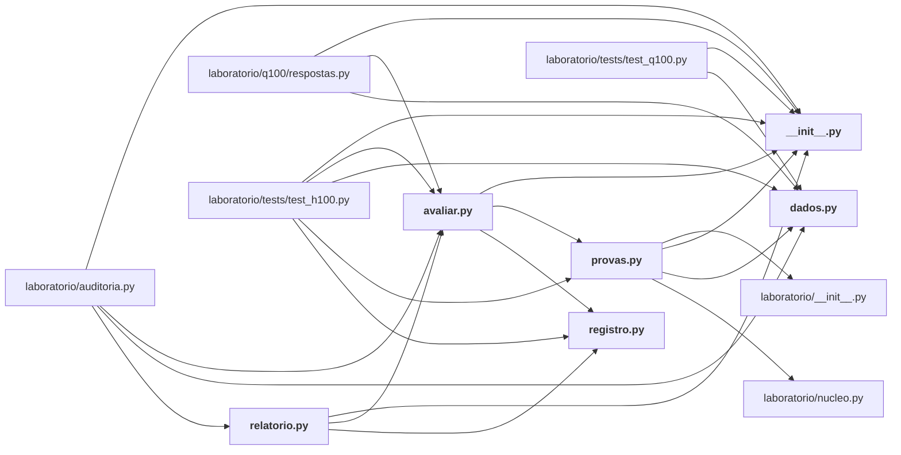

# laboratorio/h100/

Bateria H100: as cem hipóteses (dados, provas, avaliação, registro, relatório).

← [MAPA.md](../../MAPA.md) · pasta acima: [laboratorio](../../mapa/pastas/laboratorio.md) · abrir a pasta: [laboratorio/h100/](../../laboratorio/h100)

## Arquivos

| arquivo | tipo | tamanho | descrição |
|---|---|---:|---|
| [__init__.py](../../laboratorio/h100/__init__.py) | código | 0 B | Script Python |
| [avaliar.py](../../laboratorio/h100/avaliar.py) | código | 81 l. | Roda as cem provas, guarda o veredito e devolve o placar. |
| [dados.py](../../laboratorio/h100/dados.py) | código | 219 l. | Carregadores das fontes que decidem as cem hipóteses. |
| [provas.py](../../laboratorio/h100/provas.py) | código | 1153 l. | Uma prova por hipótese: mede, compara com o critério registrado e devolve o veredito. |
| [registro.py](../../laboratorio/h100/registro.py) | código | 515 l. | As cem hipóteses sobre o Jev, com a previsão escrita antes do teste. |
| [relatorio.py](../../laboratorio/h100/relatorio.py) | código | 175 l. | Gera `docs/CEM-HIPOTESES.md` a partir do registro e dos vereditos. |

## Grafo de imports e links

Nós em negrito são desta pasta; setas cheias são imports, tracejadas são links de documento.

## Ligações e conteúdo de cada arquivo

### __init__.py

- **é usado por** — import: [`laboratorio/auditoria.py`](../../laboratorio/auditoria.py), [`laboratorio/h100/avaliar.py`](../../laboratorio/h100/avaliar.py), [`laboratorio/h100/provas.py`](../../laboratorio/h100/provas.py), [`laboratorio/h100/relatorio.py`](../../laboratorio/h100/relatorio.py), [`laboratorio/q100/respostas.py`](../../laboratorio/q100/respostas.py), [`laboratorio/tests/test_h100.py`](../../laboratorio/tests/test_h100.py), [`laboratorio/tests/test_q100.py`](../../laboratorio/tests/test_q100.py)

### avaliar.py

- **usa** — import: [`laboratorio/h100/__init__.py`](../../laboratorio/h100/__init__.py), [`laboratorio/h100/provas.py`](../../laboratorio/h100/provas.py), [`laboratorio/h100/registro.py`](../../laboratorio/h100/registro.py); citação: [`laboratorio/h100-resultados.json`](../../laboratorio/h100-resultados.json)
- **é usado por** — import: [`laboratorio/auditoria.py`](../../laboratorio/auditoria.py), [`laboratorio/h100/relatorio.py`](../../laboratorio/h100/relatorio.py), [`laboratorio/q100/respostas.py`](../../laboratorio/q100/respostas.py), [`laboratorio/tests/test_h100.py`](../../laboratorio/tests/test_h100.py); citação: [`docs/CEM-HIPOTESES.md`](../../docs/CEM-HIPOTESES.md)
- **conteúdo** — [rodar](../../laboratorio/h100/avaliar.py#L25) (l. 25), [placar](../../laboratorio/h100/avaliar.py#L44) (l. 44), [por_familia](../../laboratorio/h100/avaliar.py#L48) (l. 48), [main](../../laboratorio/h100/avaliar.py#L55) (l. 55)

### dados.py

- **usa** — citação: [`laboratorio/r1-r3-estresse.json`](../../laboratorio/r1-r3-estresse.json), [`laboratorio/r10-injecao-comparada.json`](../../laboratorio/r10-injecao-comparada.json), [`laboratorio/r11-extremos.json`](../../laboratorio/r11-extremos.json), [`laboratorio/r12-r13-contexto.json`](../../laboratorio/r12-r13-contexto.json), [`laboratorio/r15-adversario-externo.json`](../../laboratorio/r15-adversario-externo.json), [`laboratorio/r19-armadilha.json`](../../laboratorio/r19-armadilha.json), [`laboratorio/r4-r7-limites.json`](../../laboratorio/r4-r7-limites.json), [`laboratorio/r8-r9-adversarial.json`](../../laboratorio/r8-r9-adversarial.json), [`laboratorio/retratacoes.json`](../../laboratorio/retratacoes.json)
- **é usado por** — import: [`laboratorio/auditoria.py`](../../laboratorio/auditoria.py), [`laboratorio/h100/provas.py`](../../laboratorio/h100/provas.py), [`laboratorio/q100/respostas.py`](../../laboratorio/q100/respostas.py), [`laboratorio/tests/test_h100.py`](../../laboratorio/tests/test_h100.py), [`laboratorio/tests/test_q100.py`](../../laboratorio/tests/test_q100.py)
- **conteúdo** — [artefato](../../laboratorio/h100/dados.py#L31) (l. 31), [decisoes](../../laboratorio/h100/dados.py#L36) (l. 36), [tentativas](../../laboratorio/h100/dados.py#L66) (l. 66), [custo_por_experimento](../../laboratorio/h100/dados.py#L78) (l. 78), [retratacoes](../../laboratorio/h100/dados.py#L88) (l. 88), [esta_retratada](../../laboratorio/h100/dados.py#L99) (l. 99), [gastos](../../laboratorio/h100/dados.py#L107) (l. 107), [linhas_com_gabarito](../../laboratorio/h100/dados.py#L115) (l. 115), [apenas_jev](../../laboratorio/h100/dados.py#L160) (l. 160), [entropia](../../laboratorio/h100/dados.py#L168) (l. 168), [pearson](../../laboratorio/h100/dados.py#L177) (l. 177), [auc](../../laboratorio/h100/dados.py#L190) (l. 190), [percentil](../../laboratorio/h100/dados.py#L206) (l. 206), [mediana](../../laboratorio/h100/dados.py#L214) (l. 214), [taxa](../../laboratorio/h100/dados.py#L218) (l. 218)

### provas.py

- **usa** — import: [`laboratorio/__init__.py`](../../laboratorio/__init__.py), [`laboratorio/h100/__init__.py`](../../laboratorio/h100/__init__.py), [`laboratorio/h100/dados.py`](../../laboratorio/h100/dados.py), [`laboratorio/nucleo.py`](../../laboratorio/nucleo.py); citação: [`laboratorio/mapa-de-limites.json`](../../laboratorio/mapa-de-limites.json), [`laboratorio/r0-calibracao.json`](../../laboratorio/r0-calibracao.json), [`laboratorio/r1-r3-estresse.json`](../../laboratorio/r1-r3-estresse.json), [`laboratorio/r11-extremos.json`](../../laboratorio/r11-extremos.json), [`laboratorio/r12-r13-contexto.json`](../../laboratorio/r12-r13-contexto.json), [`laboratorio/r15-adversario-externo.json`](../../laboratorio/r15-adversario-externo.json), [`laboratorio/r15b-familias.json`](../../laboratorio/r15b-familias.json), [`laboratorio/r16-resumo.json`](../../laboratorio/r16-resumo.json), [`laboratorio/r18-escala.json`](../../laboratorio/r18-escala.json), [`laboratorio/r18-r20-consolidado.json`](../../laboratorio/r18-r20-consolidado.json), [`laboratorio/r19-armadilha.json`](../../laboratorio/r19-armadilha.json), [`laboratorio/r20-k-adaptativo.json`](../../laboratorio/r20-k-adaptativo.json), [`laboratorio/r21-generalizacao.json`](../../laboratorio/r21-generalizacao.json), [`laboratorio/r21b-cruzamento.json`](../../laboratorio/r21b-cruzamento.json), [`laboratorio/r4-r7-limites.json`](../../laboratorio/r4-r7-limites.json), [`laboratorio/r8-r9-adversarial.json`](../../laboratorio/r8-r9-adversarial.json)
- **é usado por** — import: [`laboratorio/h100/avaliar.py`](../../laboratorio/h100/avaliar.py), [`laboratorio/tests/test_h100.py`](../../laboratorio/tests/test_h100.py); citação: [`docs/CEM-HIPOTESES.md`](../../docs/CEM-HIPOTESES.md), [`laboratorio/h100/relatorio.py`](../../laboratorio/h100/relatorio.py)
- **conteúdo** — [prova](../../laboratorio/h100/provas.py#L24) (l. 24), [ok](../../laboratorio/h100/provas.py#L31) (l. 31), [inconclusiva](../../laboratorio/h100/provas.py#L36) (l. 36), [_acuracia](../../laboratorio/h100/provas.py#L40) (l. 40), [_condicao_r11](../../laboratorio/h100/provas.py#L47) (l. 47), [_referencia_r11](../../laboratorio/h100/provas.py#L51) (l. 51), [h001](../../laboratorio/h100/provas.py#L57) (l. 57), [_recibos_liquidados](../../laboratorio/h100/provas.py#L69) (l. 69), [h002](../../laboratorio/h100/provas.py#L76) (l. 76), [h003](../../laboratorio/h100/provas.py#L83) (l. 83), [h004](../../laboratorio/h100/provas.py#L90) (l. 90), [h005](../../laboratorio/h100/provas.py#L99) (l. 99), [h006](../../laboratorio/h100/provas.py#L110) (l. 110), [h007](../../laboratorio/h100/provas.py#L119) (l. 119), [h008](../../laboratorio/h100/provas.py#L127) (l. 127), [h009](../../laboratorio/h100/provas.py#L135) (l. 135), [h010](../../laboratorio/h100/provas.py#L142) (l. 142), [h011](../../laboratorio/h100/provas.py#L149) (l. 149), [h012](../../laboratorio/h100/provas.py#L172) (l. 172), [h013](../../laboratorio/h100/provas.py#L198) (l. 198), [h014](../../laboratorio/h100/provas.py#L216) (l. 216), [h015](../../laboratorio/h100/provas.py#L226) (l. 226), [h016](../../laboratorio/h100/provas.py#L235) (l. 235), [h017](../../laboratorio/h100/provas.py#L246) (l. 246), [h018](../../laboratorio/h100/provas.py#L257) (l. 257), [h019](../../laboratorio/h100/provas.py#L266) (l. 266), [h020](../../laboratorio/h100/provas.py#L279) (l. 279), [h021](../../laboratorio/h100/provas.py#L289) (l. 289), [h022](../../laboratorio/h100/provas.py#L298) (l. 298), [h023](../../laboratorio/h100/provas.py#L308) (l. 308), [h024](../../laboratorio/h100/provas.py#L314) (l. 314), [h025](../../laboratorio/h100/provas.py#L322) (l. 322), [h026](../../laboratorio/h100/provas.py#L329) (l. 329), [_vetores_do_caixa](../../laboratorio/h100/provas.py#L339) (l. 339), [h027](../../laboratorio/h100/provas.py#L345) (l. 345), [h028](../../laboratorio/h100/provas.py#L353) (l. 353), [h029](../../laboratorio/h100/provas.py#L366) (l. 366), [h030](../../laboratorio/h100/provas.py#L378) (l. 378), [h031](../../laboratorio/h100/provas.py#L392) (l. 392), [h032](../../laboratorio/h100/provas.py#L400) (l. 400) … e mais 75

### registro.py

- **é usado por** — import: [`laboratorio/h100/avaliar.py`](../../laboratorio/h100/avaliar.py), [`laboratorio/h100/relatorio.py`](../../laboratorio/h100/relatorio.py), [`laboratorio/tests/test_h100.py`](../../laboratorio/tests/test_h100.py); citação: [`docs/CEM-HIPOTESES.md`](../../docs/CEM-HIPOTESES.md)
- **conteúdo** — [H](../../laboratorio/h100/registro.py#L40) (l. 40)

### relatorio.py

- **usa** — import: [`laboratorio/h100/__init__.py`](../../laboratorio/h100/__init__.py), [`laboratorio/h100/avaliar.py`](../../laboratorio/h100/avaliar.py), [`laboratorio/h100/registro.py`](../../laboratorio/h100/registro.py); citação: [`docs/CEM-HIPOTESES.md`](../../docs/CEM-HIPOTESES.md), [`laboratorio/auditoria.py`](../../laboratorio/auditoria.py), [`laboratorio/h100/provas.py`](../../laboratorio/h100/provas.py)
- **é usado por** — import: [`laboratorio/auditoria.py`](../../laboratorio/auditoria.py); citação: [`docs/CEM-HIPOTESES.md`](../../docs/CEM-HIPOTESES.md)
- **conteúdo** — [_formatar](../../laboratorio/h100/relatorio.py#L80) (l. 80), [montar](../../laboratorio/h100/relatorio.py#L88) (l. 88), [main](../../laboratorio/h100/relatorio.py#L168) (l. 168)
