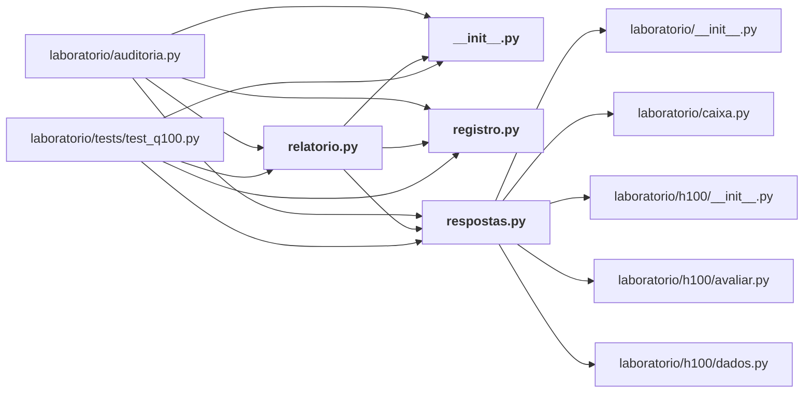

# laboratorio/q100/

Bateria Q100: as cem perguntas estratégicas (respostas, registro, relatório).

← [MAPA.md](../../MAPA.md) · pasta acima: [laboratorio](../../mapa/pastas/laboratorio.md) · abrir a pasta: [laboratorio/q100/](../../laboratorio/q100)

## Arquivos

| arquivo | tipo | tamanho | descrição |
|---|---|---:|---|
| [__init__.py](../../laboratorio/q100/__init__.py) | código | 0 B | Script Python |
| [registro.py](../../laboratorio/q100/registro.py) | código | 375 l. | Cem perguntas estratégicas sobre o Jev: o que decidir, e o que decide. |
| [relatorio.py](../../laboratorio/q100/relatorio.py) | código | 181 l. | Gera `docs/CEM-PERGUNTAS-ESTRATEGICAS.md` a partir do registro e das respostas. |
| [respostas.py](../../laboratorio/q100/respostas.py) | código | 1521 l. | Uma resposta por pergunta estratégica: o número, a decisão e o que a faria virar. |

## Grafo de imports e links

Nós em negrito são desta pasta; setas cheias são imports, tracejadas são links de documento.

## Ligações e conteúdo de cada arquivo

### __init__.py

- **é usado por** — import: [`laboratorio/auditoria.py`](../../laboratorio/auditoria.py), [`laboratorio/q100/relatorio.py`](../../laboratorio/q100/relatorio.py), [`laboratorio/tests/test_q100.py`](../../laboratorio/tests/test_q100.py)

### registro.py

- **é usado por** — import: [`laboratorio/auditoria.py`](../../laboratorio/auditoria.py), [`laboratorio/q100/relatorio.py`](../../laboratorio/q100/relatorio.py), [`laboratorio/tests/test_q100.py`](../../laboratorio/tests/test_q100.py); citação: [`docs/CEM-PERGUNTAS-ESTRATEGICAS.md`](../../docs/CEM-PERGUNTAS-ESTRATEGICAS.md), [`laboratorio/PREREGISTRO.md`](../../laboratorio/PREREGISTRO.md)
- **conteúdo** — [Q](../../laboratorio/q100/registro.py#L45) (l. 45)

### relatorio.py

- **usa** — import: [`laboratorio/q100/__init__.py`](../../laboratorio/q100/__init__.py), [`laboratorio/q100/registro.py`](../../laboratorio/q100/registro.py), [`laboratorio/q100/respostas.py`](../../laboratorio/q100/respostas.py); citação: [`docs/CEM-PERGUNTAS-ESTRATEGICAS.md`](../../docs/CEM-PERGUNTAS-ESTRATEGICAS.md), [`laboratorio/auditoria.py`](../../laboratorio/auditoria.py)
- **é usado por** — import: [`laboratorio/auditoria.py`](../../laboratorio/auditoria.py), [`laboratorio/tests/test_q100.py`](../../laboratorio/tests/test_q100.py); citação: [`docs/CEM-PERGUNTAS-ESTRATEGICAS.md`](../../docs/CEM-PERGUNTAS-ESTRATEGICAS.md)
- **chama de outros arquivos** — [`respostas.mil`](../../laboratorio/q100/respostas.py#L46)
- **menciona 7 conceitos** — [R11](../../mapa/conhecimento/rodadas.md#r11) (1×), [Q023](../../mapa/conhecimento/perguntas.md#q023) (1×), [Q036](../../mapa/conhecimento/perguntas.md#q036) (1×), [Q042](../../mapa/conhecimento/perguntas.md#q042) (1×), [Q044](../../mapa/conhecimento/perguntas.md#q044) (1×), [Q073](../../mapa/conhecimento/perguntas.md#q073) (1×), [Q096](../../mapa/conhecimento/perguntas.md#q096) (1×)
- **conteúdo** — [montar](../../laboratorio/q100/relatorio.py#L62) (l. 62; usado em 2), [main](../../laboratorio/q100/relatorio.py#L174) (l. 174)

### respostas.py

- **usa** — import: [`laboratorio/__init__.py`](../../laboratorio/__init__.py), [`laboratorio/caixa.py`](../../laboratorio/caixa.py), [`laboratorio/h100/__init__.py`](../../laboratorio/h100/__init__.py), [`laboratorio/h100/avaliar.py`](../../laboratorio/h100/avaliar.py), [`laboratorio/h100/dados.py`](../../laboratorio/h100/dados.py); citação: [`laboratorio/auditoria-placar.json`](../../laboratorio/auditoria-placar.json), [`laboratorio/auditoria.py`](../../laboratorio/auditoria.py), [`laboratorio/canarios-de-comportamento.jsonl`](../../laboratorio/canarios-de-comportamento.jsonl), [`laboratorio/mapa-de-limites.json`](../../laboratorio/mapa-de-limites.json), [`laboratorio/r1-r3-estresse.json`](../../laboratorio/r1-r3-estresse.json), [`laboratorio/r11-extremos.json`](../../laboratorio/r11-extremos.json), [`laboratorio/r12-r13-contexto.json`](../../laboratorio/r12-r13-contexto.json), [`laboratorio/r15b-familias.json`](../../laboratorio/r15b-familias.json), [`laboratorio/r16-resumo.json`](../../laboratorio/r16-resumo.json), [`laboratorio/r18-escala.json`](../../laboratorio/r18-escala.json), [`laboratorio/r18-r20-consolidado.json`](../../laboratorio/r18-r20-consolidado.json), [`laboratorio/r19-armadilha.json`](../../laboratorio/r19-armadilha.json), [`laboratorio/r19_armadilha_de_sujeito.py`](../../laboratorio/r19_armadilha_de_sujeito.py), [`laboratorio/r20-k-adaptativo.json`](../../laboratorio/r20-k-adaptativo.json), [`laboratorio/r21-generalizacao.json`](../../laboratorio/r21-generalizacao.json), [`laboratorio/r21_generalizacao.py`](../../laboratorio/r21_generalizacao.py), [`laboratorio/r21b-cruzamento.json`](../../laboratorio/r21b-cruzamento.json), [`laboratorio/r22-defesas.json`](../../laboratorio/r22-defesas.json), [`laboratorio/r23-parafrase.json`](../../laboratorio/r23-parafrase.json), [`laboratorio/r24-votacao.json`](../../laboratorio/r24-votacao.json), [`laboratorio/r25-terceiro-dominio.json`](../../laboratorio/r25-terceiro-dominio.json), [`laboratorio/r26-dois-trechos.json`](../../laboratorio/r26-dois-trechos.json), [`laboratorio/r27-integracao.json`](../../laboratorio/r27-integracao.json), [`laboratorio/r8-r9-adversarial.json`](../../laboratorio/r8-r9-adversarial.json)
- **é usado por** — import: [`laboratorio/auditoria.py`](../../laboratorio/auditoria.py), [`laboratorio/q100/relatorio.py`](../../laboratorio/q100/relatorio.py), [`laboratorio/tests/test_q100.py`](../../laboratorio/tests/test_q100.py); citação: [`docs/CEM-PERGUNTAS-ESTRATEGICAS.md`](../../docs/CEM-PERGUNTAS-ESTRATEGICAS.md), [`laboratorio/PREREGISTRO.md`](../../laboratorio/PREREGISTRO.md)
- **chama de outros arquivos** — [`caixa.totais`](../../laboratorio/caixa.py#L56), [`avaliar.rodar`](../../laboratorio/h100/avaliar.py#L25), [`dados.apenas_jev`](../../laboratorio/h100/dados.py#L165), [`dados.artefato`](../../laboratorio/h100/dados.py#L31), [`dados.decisoes`](../../laboratorio/h100/dados.py#L36), [`dados.esta_retratada`](../../laboratorio/h100/dados.py#L104), [`dados.gastos`](../../laboratorio/h100/dados.py#L112), [`dados.linhas_com_gabarito`](../../laboratorio/h100/dados.py#L120), [`dados.mediana`](../../laboratorio/h100/dados.py#L219), [`dados.pearson`](../../laboratorio/h100/dados.py#L182), [`dados.percentil`](../../laboratorio/h100/dados.py#L211), [`dados.tentativas`](../../laboratorio/h100/dados.py#L70)
- **papel nos estudos** — responde [Q001](../../mapa/conhecimento/perguntas.md#q001), responde [Q002](../../mapa/conhecimento/perguntas.md#q002), responde [Q003](../../mapa/conhecimento/perguntas.md#q003), responde [Q004](../../mapa/conhecimento/perguntas.md#q004), responde [Q005](../../mapa/conhecimento/perguntas.md#q005), responde [Q006](../../mapa/conhecimento/perguntas.md#q006), responde [Q007](../../mapa/conhecimento/perguntas.md#q007), responde [Q008](../../mapa/conhecimento/perguntas.md#q008), responde [Q009](../../mapa/conhecimento/perguntas.md#q009), responde [Q010](../../mapa/conhecimento/perguntas.md#q010), responde [Q011](../../mapa/conhecimento/perguntas.md#q011), responde [Q012](../../mapa/conhecimento/perguntas.md#q012), responde [Q013](../../mapa/conhecimento/perguntas.md#q013), responde [Q014](../../mapa/conhecimento/perguntas.md#q014), responde [Q015](../../mapa/conhecimento/perguntas.md#q015), responde [Q016](../../mapa/conhecimento/perguntas.md#q016), responde [Q017](../../mapa/conhecimento/perguntas.md#q017), responde [Q018](../../mapa/conhecimento/perguntas.md#q018), responde [Q019](../../mapa/conhecimento/perguntas.md#q019), responde [Q020](../../mapa/conhecimento/perguntas.md#q020), responde [Q021](../../mapa/conhecimento/perguntas.md#q021), responde [Q022](../../mapa/conhecimento/perguntas.md#q022), responde [Q023](../../mapa/conhecimento/perguntas.md#q023), responde [Q024](../../mapa/conhecimento/perguntas.md#q024), responde [Q025](../../mapa/conhecimento/perguntas.md#q025), responde [Q026](../../mapa/conhecimento/perguntas.md#q026), responde [Q027](../../mapa/conhecimento/perguntas.md#q027), responde [Q028](../../mapa/conhecimento/perguntas.md#q028), responde [Q029](../../mapa/conhecimento/perguntas.md#q029), responde [Q030](../../mapa/conhecimento/perguntas.md#q030), responde [Q031](../../mapa/conhecimento/perguntas.md#q031), responde [Q032](../../mapa/conhecimento/perguntas.md#q032), responde [Q033](../../mapa/conhecimento/perguntas.md#q033), responde [Q034](../../mapa/conhecimento/perguntas.md#q034), responde [Q035](../../mapa/conhecimento/perguntas.md#q035), responde [Q036](../../mapa/conhecimento/perguntas.md#q036), responde [Q037](../../mapa/conhecimento/perguntas.md#q037), responde [Q038](../../mapa/conhecimento/perguntas.md#q038), responde [Q039](../../mapa/conhecimento/perguntas.md#q039), responde [Q040](../../mapa/conhecimento/perguntas.md#q040), responde [Q041](../../mapa/conhecimento/perguntas.md#q041), responde [Q042](../../mapa/conhecimento/perguntas.md#q042), responde [Q043](../../mapa/conhecimento/perguntas.md#q043), responde [Q044](../../mapa/conhecimento/perguntas.md#q044), responde [Q045](../../mapa/conhecimento/perguntas.md#q045), responde [Q046](../../mapa/conhecimento/perguntas.md#q046), responde [Q047](../../mapa/conhecimento/perguntas.md#q047), responde [Q048](../../mapa/conhecimento/perguntas.md#q048), responde [Q049](../../mapa/conhecimento/perguntas.md#q049), responde [Q050](../../mapa/conhecimento/perguntas.md#q050), responde [Q051](../../mapa/conhecimento/perguntas.md#q051), responde [Q052](../../mapa/conhecimento/perguntas.md#q052), responde [Q053](../../mapa/conhecimento/perguntas.md#q053), responde [Q054](../../mapa/conhecimento/perguntas.md#q054), responde [Q055](../../mapa/conhecimento/perguntas.md#q055), responde [Q056](../../mapa/conhecimento/perguntas.md#q056), responde [Q057](../../mapa/conhecimento/perguntas.md#q057), responde [Q058](../../mapa/conhecimento/perguntas.md#q058), responde [Q059](../../mapa/conhecimento/perguntas.md#q059), responde [Q060](../../mapa/conhecimento/perguntas.md#q060), responde [Q061](../../mapa/conhecimento/perguntas.md#q061), responde [Q062](../../mapa/conhecimento/perguntas.md#q062), responde [Q063](../../mapa/conhecimento/perguntas.md#q063), responde [Q064](../../mapa/conhecimento/perguntas.md#q064), responde [Q065](../../mapa/conhecimento/perguntas.md#q065), responde [Q066](../../mapa/conhecimento/perguntas.md#q066), responde [Q067](../../mapa/conhecimento/perguntas.md#q067), responde [Q068](../../mapa/conhecimento/perguntas.md#q068), responde [Q069](../../mapa/conhecimento/perguntas.md#q069), responde [Q070](../../mapa/conhecimento/perguntas.md#q070), responde [Q071](../../mapa/conhecimento/perguntas.md#q071), responde [Q072](../../mapa/conhecimento/perguntas.md#q072), responde [Q073](../../mapa/conhecimento/perguntas.md#q073), responde [Q074](../../mapa/conhecimento/perguntas.md#q074), responde [Q075](../../mapa/conhecimento/perguntas.md#q075), responde [Q076](../../mapa/conhecimento/perguntas.md#q076), responde [Q077](../../mapa/conhecimento/perguntas.md#q077), responde [Q078](../../mapa/conhecimento/perguntas.md#q078), responde [Q079](../../mapa/conhecimento/perguntas.md#q079), responde [Q080](../../mapa/conhecimento/perguntas.md#q080), responde [Q081](../../mapa/conhecimento/perguntas.md#q081), responde [Q082](../../mapa/conhecimento/perguntas.md#q082), responde [Q083](../../mapa/conhecimento/perguntas.md#q083), responde [Q084](../../mapa/conhecimento/perguntas.md#q084), responde [Q085](../../mapa/conhecimento/perguntas.md#q085), responde [Q086](../../mapa/conhecimento/perguntas.md#q086), responde [Q087](../../mapa/conhecimento/perguntas.md#q087), responde [Q088](../../mapa/conhecimento/perguntas.md#q088), responde [Q089](../../mapa/conhecimento/perguntas.md#q089), responde [Q090](../../mapa/conhecimento/perguntas.md#q090), responde [Q091](../../mapa/conhecimento/perguntas.md#q091), responde [Q092](../../mapa/conhecimento/perguntas.md#q092), responde [Q093](../../mapa/conhecimento/perguntas.md#q093), responde [Q094](../../mapa/conhecimento/perguntas.md#q094), responde [Q095](../../mapa/conhecimento/perguntas.md#q095), responde [Q096](../../mapa/conhecimento/perguntas.md#q096), responde [Q097](../../mapa/conhecimento/perguntas.md#q097), responde [Q098](../../mapa/conhecimento/perguntas.md#q098), responde [Q099](../../mapa/conhecimento/perguntas.md#q099), responde [Q100](../../mapa/conhecimento/perguntas.md#q100)
- **menciona 29 conceitos** — [R18](../../mapa/conhecimento/rodadas.md#r18) (8×), [R23](../../mapa/conhecimento/rodadas.md#r23) (6×), [R11](../../mapa/conhecimento/rodadas.md#r11) (5×), [R20](../../mapa/conhecimento/rodadas.md#r20) (5×), [R22](../../mapa/conhecimento/rodadas.md#r22) (5×), [E12](../../mapa/conhecimento/experimentos.md#e12) (4×), [R12](../../mapa/conhecimento/rodadas.md#r12) (4×), [R1](../../mapa/conhecimento/rodadas.md#r1) (3×), [R2](../../mapa/conhecimento/rodadas.md#r2) (3×), [R3](../../mapa/conhecimento/rodadas.md#r3) (3×), [R15](../../mapa/conhecimento/rodadas.md#r15) (3×), [R19](../../mapa/conhecimento/rodadas.md#r19) (3×), [R21b](../../mapa/conhecimento/rodadas.md#r21b) (3×), [E10](../../mapa/conhecimento/experimentos.md#e10) (2×), [E11](../../mapa/conhecimento/experimentos.md#e11) (2×), [R4](../../mapa/conhecimento/rodadas.md#r4) (2×), [R5](../../mapa/conhecimento/rodadas.md#r5) (2×), [R6](../../mapa/conhecimento/rodadas.md#r6) (2×), [R7](../../mapa/conhecimento/rodadas.md#r7) (2×), [R13](../../mapa/conhecimento/rodadas.md#r13) (2×), [R21](../../mapa/conhecimento/rodadas.md#r21) (2×), [R24](../../mapa/conhecimento/rodadas.md#r24) (2×), [R26](../../mapa/conhecimento/rodadas.md#r26) (2×), [R27](../../mapa/conhecimento/rodadas.md#r27) (2×), [E8](../../mapa/conhecimento/experimentos.md#e8) (1×) … e mais 4
- **conteúdo** — [resposta](../../laboratorio/q100/respostas.py#L30) (l. 30), [usd](../../laboratorio/q100/respostas.py#L41) (l. 41), [mil](../../laboratorio/q100/respostas.py#L46) (l. 46; usado em 1), [R](../../laboratorio/q100/respostas.py#L68) (l. 68), [p](../../laboratorio/q100/respostas.py#L94) (l. 94; usado em 2), [_declarar](../../laboratorio/q100/respostas.py#L98) (l. 98), [_placar_da_auditoria](../../laboratorio/q100/respostas.py#L102) (l. 102), [_artefato](../../laboratorio/q100/respostas.py#L116) (l. 116), [_ledger](../../laboratorio/q100/respostas.py#L120) (l. 120), [_custo_por_decisao](../../laboratorio/q100/respostas.py#L125) (l. 125), [_linhas_jev](../../laboratorio/q100/respostas.py#L134) (l. 134; usado em 1), [_linhas_uso_normal](../../laboratorio/q100/respostas.py#L162) (l. 162), [_h100](../../laboratorio/q100/respostas.py#L174) (l. 174), [_latencias](../../laboratorio/q100/respostas.py#L178) (l. 178), [_r23](../../laboratorio/q100/respostas.py#L185) (l. 185), [_familias_de_instrucao_surpresa](../../laboratorio/q100/respostas.py#L189) (l. 189), [_r24](../../laboratorio/q100/respostas.py#L195) (l. 195), [_r25](../../laboratorio/q100/respostas.py#L199) (l. 199), [_r26](../../laboratorio/q100/respostas.py#L203) (l. 203), [_r27](../../laboratorio/q100/respostas.py#L207) (l. 207), [_r22](../../laboratorio/q100/respostas.py#L211) (l. 211), [q001](../../laboratorio/q100/respostas.py#L217) (l. 217), [q002](../../laboratorio/q100/respostas.py#L227) (l. 227), [q003](../../laboratorio/q100/respostas.py#L236) (l. 236), [q004](../../laboratorio/q100/respostas.py#L250) (l. 250), [q005](../../laboratorio/q100/respostas.py#L259) (l. 259), [q006](../../laboratorio/q100/respostas.py#L277) (l. 277), [q007](../../laboratorio/q100/respostas.py#L286) (l. 286), [q008](../../laboratorio/q100/respostas.py#L295) (l. 295), [q009](../../laboratorio/q100/respostas.py#L305) (l. 305), [q010](../../laboratorio/q100/respostas.py#L322) (l. 322), [q011](../../laboratorio/q100/respostas.py#L333) (l. 333), [q012](../../laboratorio/q100/respostas.py#L343) (l. 343), [q013](../../laboratorio/q100/respostas.py#L370) (l. 370), [q014](../../laboratorio/q100/respostas.py#L388) (l. 388), [q015](../../laboratorio/q100/respostas.py#L410) (l. 410), [q016](../../laboratorio/q100/respostas.py#L423) (l. 423), [q017](../../laboratorio/q100/respostas.py#L444) (l. 444), [q018](../../laboratorio/q100/respostas.py#L457) (l. 457), [q019](../../laboratorio/q100/respostas.py#L473) (l. 473) … e mais 82
