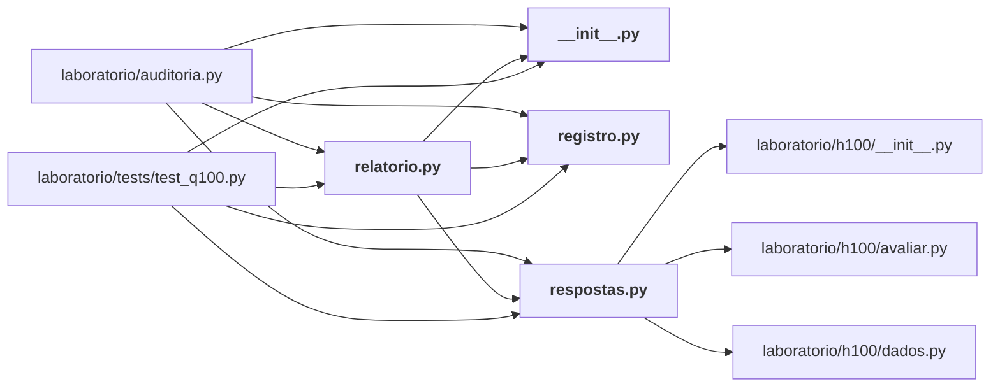

# laboratorio/q100/

Bateria Q100: as cem perguntas estratégicas (respostas, registro, relatório).

← [MAPA.md](../../MAPA.md) · pasta acima: [laboratorio](../../mapa/pastas/laboratorio.md) · abrir a pasta: [laboratorio/q100/](../../laboratorio/q100)

## Arquivos

| arquivo | tipo | tamanho | descrição |
|---|---|---:|---|
| [__init__.py](../../laboratorio/q100/__init__.py) | código | 0 B | Script Python |
| [registro.py](../../laboratorio/q100/registro.py) | código | 375 l. | Cem perguntas estratégicas sobre o Jev: o que decidir, e o que decide. |
| [relatorio.py](../../laboratorio/q100/relatorio.py) | código | 181 l. | Gera `docs/CEM-PERGUNTAS-ESTRATEGICAS.md` a partir do registro e das respostas. |
| [respostas.py](../../laboratorio/q100/respostas.py) | código | 1524 l. | Uma resposta por pergunta estratégica: o número, a decisão e o que a faria virar. |

## Grafo de imports e links

Nós em negrito são desta pasta; setas cheias são imports, tracejadas são links de documento.

## Ligações e conteúdo de cada arquivo

### __init__.py

- **é usado por** — import: [`laboratorio/auditoria.py`](../../laboratorio/auditoria.py), [`laboratorio/q100/relatorio.py`](../../laboratorio/q100/relatorio.py), [`laboratorio/tests/test_q100.py`](../../laboratorio/tests/test_q100.py)

### registro.py

- **é usado por** — import: [`laboratorio/auditoria.py`](../../laboratorio/auditoria.py), [`laboratorio/q100/relatorio.py`](../../laboratorio/q100/relatorio.py), [`laboratorio/tests/test_q100.py`](../../laboratorio/tests/test_q100.py); citação: [`docs/CEM-PERGUNTAS-ESTRATEGICAS.md`](../../docs/CEM-PERGUNTAS-ESTRATEGICAS.md), [`laboratorio/PREREGISTRO.md`](../../laboratorio/PREREGISTRO.md)
- **conteúdo** — [Q](../../laboratorio/q100/registro.py#L45) (l. 45)

### relatorio.py

- **usa** — import: [`laboratorio/q100/__init__.py`](../../laboratorio/q100/__init__.py), [`laboratorio/q100/registro.py`](../../laboratorio/q100/registro.py), [`laboratorio/q100/respostas.py`](../../laboratorio/q100/respostas.py); citação: [`docs/CEM-PERGUNTAS-ESTRATEGICAS.md`](../../docs/CEM-PERGUNTAS-ESTRATEGICAS.md), [`laboratorio/auditoria.py`](../../laboratorio/auditoria.py)
- **é usado por** — import: [`laboratorio/auditoria.py`](../../laboratorio/auditoria.py), [`laboratorio/tests/test_q100.py`](../../laboratorio/tests/test_q100.py); citação: [`docs/CEM-PERGUNTAS-ESTRATEGICAS.md`](../../docs/CEM-PERGUNTAS-ESTRATEGICAS.md)
- **conteúdo** — [montar](../../laboratorio/q100/relatorio.py#L62) (l. 62), [main](../../laboratorio/q100/relatorio.py#L174) (l. 174)

### respostas.py

- **usa** — import: [`laboratorio/h100/__init__.py`](../../laboratorio/h100/__init__.py), [`laboratorio/h100/avaliar.py`](../../laboratorio/h100/avaliar.py), [`laboratorio/h100/dados.py`](../../laboratorio/h100/dados.py); citação: [`laboratorio/auditoria-placar.json`](../../laboratorio/auditoria-placar.json), [`laboratorio/auditoria.py`](../../laboratorio/auditoria.py), [`laboratorio/canarios-de-comportamento.jsonl`](../../laboratorio/canarios-de-comportamento.jsonl), [`laboratorio/mapa-de-limites.json`](../../laboratorio/mapa-de-limites.json), [`laboratorio/r1-r3-estresse.json`](../../laboratorio/r1-r3-estresse.json), [`laboratorio/r11-extremos.json`](../../laboratorio/r11-extremos.json), [`laboratorio/r12-r13-contexto.json`](../../laboratorio/r12-r13-contexto.json), [`laboratorio/r15b-familias.json`](../../laboratorio/r15b-familias.json), [`laboratorio/r16-resumo.json`](../../laboratorio/r16-resumo.json), [`laboratorio/r18-escala.json`](../../laboratorio/r18-escala.json), [`laboratorio/r18-r20-consolidado.json`](../../laboratorio/r18-r20-consolidado.json), [`laboratorio/r19-armadilha.json`](../../laboratorio/r19-armadilha.json), [`laboratorio/r19_armadilha_de_sujeito.py`](../../laboratorio/r19_armadilha_de_sujeito.py), [`laboratorio/r20-k-adaptativo.json`](../../laboratorio/r20-k-adaptativo.json), [`laboratorio/r21-generalizacao.json`](../../laboratorio/r21-generalizacao.json), [`laboratorio/r21_generalizacao.py`](../../laboratorio/r21_generalizacao.py), [`laboratorio/r21b-cruzamento.json`](../../laboratorio/r21b-cruzamento.json), [`laboratorio/r22-defesas.json`](../../laboratorio/r22-defesas.json), [`laboratorio/r23-parafrase.json`](../../laboratorio/r23-parafrase.json), [`laboratorio/r24-votacao.json`](../../laboratorio/r24-votacao.json), [`laboratorio/r25-terceiro-dominio.json`](../../laboratorio/r25-terceiro-dominio.json), [`laboratorio/r26-dois-trechos.json`](../../laboratorio/r26-dois-trechos.json), [`laboratorio/r27-integracao.json`](../../laboratorio/r27-integracao.json), [`laboratorio/r8-r9-adversarial.json`](../../laboratorio/r8-r9-adversarial.json)
- **é usado por** — import: [`laboratorio/auditoria.py`](../../laboratorio/auditoria.py), [`laboratorio/q100/relatorio.py`](../../laboratorio/q100/relatorio.py), [`laboratorio/tests/test_q100.py`](../../laboratorio/tests/test_q100.py); citação: [`docs/CEM-PERGUNTAS-ESTRATEGICAS.md`](../../docs/CEM-PERGUNTAS-ESTRATEGICAS.md), [`laboratorio/PREREGISTRO.md`](../../laboratorio/PREREGISTRO.md)
- **conteúdo** — [resposta](../../laboratorio/q100/respostas.py#L30) (l. 30), [usd](../../laboratorio/q100/respostas.py#L41) (l. 41), [mil](../../laboratorio/q100/respostas.py#L46) (l. 46), [R](../../laboratorio/q100/respostas.py#L68) (l. 68), [p](../../laboratorio/q100/respostas.py#L94) (l. 94), [_declarar](../../laboratorio/q100/respostas.py#L98) (l. 98), [_placar_da_auditoria](../../laboratorio/q100/respostas.py#L102) (l. 102), [_artefato](../../laboratorio/q100/respostas.py#L116) (l. 116), [_ledger](../../laboratorio/q100/respostas.py#L120) (l. 120), [_custo_por_decisao](../../laboratorio/q100/respostas.py#L128) (l. 128), [_linhas_jev](../../laboratorio/q100/respostas.py#L137) (l. 137), [_linhas_uso_normal](../../laboratorio/q100/respostas.py#L165) (l. 165), [_h100](../../laboratorio/q100/respostas.py#L177) (l. 177), [_latencias](../../laboratorio/q100/respostas.py#L181) (l. 181), [_r23](../../laboratorio/q100/respostas.py#L188) (l. 188), [_familias_de_instrucao_surpresa](../../laboratorio/q100/respostas.py#L192) (l. 192), [_r24](../../laboratorio/q100/respostas.py#L198) (l. 198), [_r25](../../laboratorio/q100/respostas.py#L202) (l. 202), [_r26](../../laboratorio/q100/respostas.py#L206) (l. 206), [_r27](../../laboratorio/q100/respostas.py#L210) (l. 210), [_r22](../../laboratorio/q100/respostas.py#L214) (l. 214), [q001](../../laboratorio/q100/respostas.py#L220) (l. 220), [q002](../../laboratorio/q100/respostas.py#L230) (l. 230), [q003](../../laboratorio/q100/respostas.py#L239) (l. 239), [q004](../../laboratorio/q100/respostas.py#L253) (l. 253), [q005](../../laboratorio/q100/respostas.py#L262) (l. 262), [q006](../../laboratorio/q100/respostas.py#L280) (l. 280), [q007](../../laboratorio/q100/respostas.py#L289) (l. 289), [q008](../../laboratorio/q100/respostas.py#L298) (l. 298), [q009](../../laboratorio/q100/respostas.py#L308) (l. 308), [q010](../../laboratorio/q100/respostas.py#L325) (l. 325), [q011](../../laboratorio/q100/respostas.py#L336) (l. 336), [q012](../../laboratorio/q100/respostas.py#L346) (l. 346), [q013](../../laboratorio/q100/respostas.py#L373) (l. 373), [q014](../../laboratorio/q100/respostas.py#L391) (l. 391), [q015](../../laboratorio/q100/respostas.py#L413) (l. 413), [q016](../../laboratorio/q100/respostas.py#L426) (l. 426), [q017](../../laboratorio/q100/respostas.py#L447) (l. 447), [q018](../../laboratorio/q100/respostas.py#L460) (l. 460), [q019](../../laboratorio/q100/respostas.py#L476) (l. 476) … e mais 82
