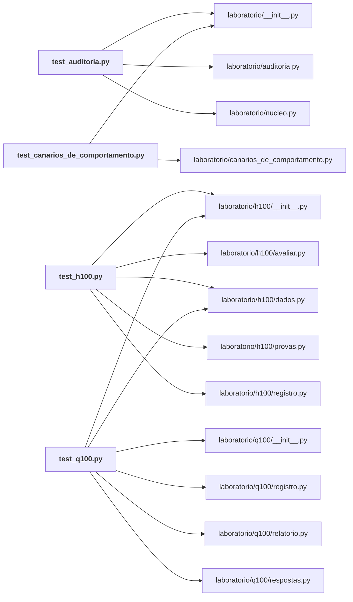

# laboratorio/tests/

Testes do laboratório: auditoria, canários, H100, Q100.

← [MAPA.md](../../MAPA.md) · pasta acima: [laboratorio](../../mapa/pastas/laboratorio.md) · abrir a pasta: [laboratorio/tests/](../../laboratorio/tests)

## Arquivos

| arquivo | tipo | tamanho | descrição |
|---|---|---:|---|
| [__init__.py](../../laboratorio/tests/__init__.py) | código | 0 B | Script Python |
| [test_auditoria.py](../../laboratorio/tests/test_auditoria.py) | código | 46 l. | Prende a auditoria na suíte: nenhum número publicado pode divergir do dado bruto. |
| [test_canarios_de_comportamento.py](../../laboratorio/tests/test_canarios_de_comportamento.py) | código | 67 l. | Testa o desenho dos canários sem gastar um centavo. |
| [test_h100.py](../../laboratorio/tests/test_h100.py) | código | 72 l. | Prende o registro das cem hipóteses e as provas delas. |
| [test_q100.py](../../laboratorio/tests/test_q100.py) | código | 143 l. | Prende o registro das cem perguntas estratégicas e as respostas delas. |

## Grafo de imports e links

Nós em negrito são desta pasta; setas cheias são imports, tracejadas são links de documento.

## Ligações e conteúdo de cada arquivo

### test_auditoria.py

- **usa** — import: [`laboratorio/__init__.py`](../../laboratorio/__init__.py), [`laboratorio/auditoria.py`](../../laboratorio/auditoria.py), [`laboratorio/nucleo.py`](../../laboratorio/nucleo.py)
- **é usado por** — citação: [`docs/AUDITORIA-DE-NUMEROS.md`](../../docs/AUDITORIA-DE-NUMEROS.md), [`laboratorio/auditoria.py`](../../laboratorio/auditoria.py)
- **conteúdo** — [placar](../../laboratorio/tests/test_auditoria.py#L13) (l. 13), [test_todo_numero_publicado_fecha_com_o_dado_bruto](../../laboratorio/tests/test_auditoria.py#L17) (l. 17), [test_a_auditoria_confere_algo_de_cada_rodada](../../laboratorio/tests/test_auditoria.py#L23) (l. 23), [test_a_estatistica_independente_reproduz_a_do_laboratorio](../../laboratorio/tests/test_auditoria.py#L31) (l. 31), [test_o_teto_de_gasto_autorizado_nao_foi_ultrapassado](../../laboratorio/tests/test_auditoria.py#L44) (l. 44)

### test_canarios_de_comportamento.py

- **usa** — import: [`laboratorio/__init__.py`](../../laboratorio/__init__.py), [`laboratorio/canarios_de_comportamento.py`](../../laboratorio/canarios_de_comportamento.py)
- **conteúdo** — [lista](../../laboratorio/tests/test_canarios_de_comportamento.py#L14) (l. 14), [test_todo_canario_declara_o_que_sustenta](../../laboratorio/tests/test_canarios_de_comportamento.py#L18) (l. 18), [test_o_payload_de_cada_canario_e_valido](../../laboratorio/tests/test_canarios_de_comportamento.py#L23) (l. 23), [test_o_veredito_reprova_a_resposta_errada](../../laboratorio/tests/test_canarios_de_comportamento.py#L34) (l. 34), [test_o_veredito_reprova_a_ausencia_de_resposta](../../laboratorio/tests/test_canarios_de_comportamento.py#L49) (l. 49), [test_o_teto_de_gasto_da_corrida_esta_declarado](../../laboratorio/tests/test_canarios_de_comportamento.py#L58) (l. 58), [test_a_suite_cabe_no_teto_declarado](../../laboratorio/tests/test_canarios_de_comportamento.py#L62) (l. 62)

### test_h100.py

- **usa** — import: [`laboratorio/h100/__init__.py`](../../laboratorio/h100/__init__.py), [`laboratorio/h100/avaliar.py`](../../laboratorio/h100/avaliar.py), [`laboratorio/h100/dados.py`](../../laboratorio/h100/dados.py), [`laboratorio/h100/provas.py`](../../laboratorio/h100/provas.py), [`laboratorio/h100/registro.py`](../../laboratorio/h100/registro.py)
- **conteúdo** — [resultados](../../laboratorio/tests/test_h100.py#L14) (l. 14), [test_o_registro_tem_cem_hipoteses_com_identificador_unico](../../laboratorio/tests/test_h100.py#L18) (l. 18), [test_toda_hipotese_declara_previsao_fonte_e_criterio](../../laboratorio/tests/test_h100.py#L23) (l. 23), [test_toda_hipotese_tem_prova](../../laboratorio/tests/test_h100.py#L31) (l. 31), [test_nenhuma_prova_quebra](../../laboratorio/tests/test_h100.py#L36) (l. 36), [test_todo_veredito_vem_com_numero_ou_com_motivo](../../laboratorio/tests/test_h100.py#L41) (l. 41), [test_a_varredura_encontra_dos_dois_lados](../../laboratorio/tests/test_h100.py#L51) (l. 51), [test_as_emendas_estao_datadas_e_justificadas](../../laboratorio/tests/test_h100.py#L57) (l. 57), [test_nenhuma_hipotese_se_apoia_em_condicao_retratada_sem_avisar](../../laboratorio/tests/test_h100.py#L64) (l. 64)

### test_q100.py

- **usa** — import: [`laboratorio/h100/__init__.py`](../../laboratorio/h100/__init__.py), [`laboratorio/h100/dados.py`](../../laboratorio/h100/dados.py), [`laboratorio/q100/__init__.py`](../../laboratorio/q100/__init__.py), [`laboratorio/q100/registro.py`](../../laboratorio/q100/registro.py), [`laboratorio/q100/relatorio.py`](../../laboratorio/q100/relatorio.py), [`laboratorio/q100/respostas.py`](../../laboratorio/q100/respostas.py)
- **conteúdo** — [respondidas](../../laboratorio/tests/test_q100.py#L16) (l. 16), [test_o_registro_tem_cem_perguntas_com_identificador_unico](../../laboratorio/tests/test_q100.py#L20) (l. 20), [test_toda_pergunta_declara_decisao_fonte_e_gatilho_de_virada](../../laboratorio/tests/test_q100.py#L25) (l. 25), [test_toda_pergunta_tem_resposta](../../laboratorio/tests/test_q100.py#L33) (l. 33), [test_nenhuma_resposta_quebra](../../laboratorio/tests/test_q100.py#L38) (l. 38), [test_nenhuma_resposta_usa_parametro_que_nao_declarou](../../laboratorio/tests/test_q100.py#L42) (l. 42), [test_alguma_conta_declara_parametro](../../laboratorio/tests/test_q100.py#L67) (l. 67), [test_todo_parametro_declarado_existe_e_diz_o_que_e](../../laboratorio/tests/test_q100.py#L73) (l. 73), [test_resposta_que_depende_de_parametro_nao_se_diz_de_alta_confianca](../../laboratorio/tests/test_q100.py#L80) (l. 80), [test_nenhuma_resposta_usa_decimal_a_inglesa](../../laboratorio/tests/test_q100.py#L87) (l. 87), [test_nenhuma_resposta_despeja_estrutura_de_dado_na_prosa](../../laboratorio/tests/test_q100.py#L98) (l. 98), [test_resposta_que_afirma_medida_carrega_a_medida_conferivel](../../laboratorio/tests/test_q100.py#L105) (l. 105), [test_toda_resposta_termina_em_decisao_e_nao_em_curiosidade](../../laboratorio/tests/test_q100.py#L118) (l. 118), [test_as_familias_todas_tem_pergunta](../../laboratorio/tests/test_q100.py#L124) (l. 124), [test_a_pagina_se_gera_e_cita_todas_as_perguntas](../../laboratorio/tests/test_q100.py#L129) (l. 129), [test_nenhuma_resposta_se_apoia_em_condicao_retratada](../../laboratorio/tests/test_q100.py#L136) (l. 136)
