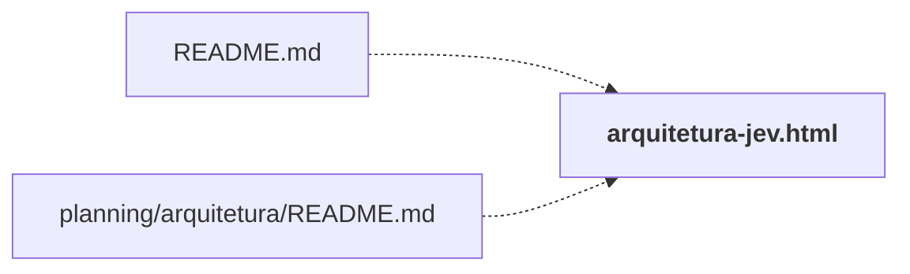

# output/

Entregáveis gerados (HTML e PDF). Não editar à mão: regenerar pelos scripts de `planning/` e `laboratorio/`.

← [MAPA.md](../../MAPA.md) · pasta acima: [raiz](../../mapa/pastas/_raiz.md) · abrir a pasta: [output/](../../output)

## Subpastas

| subpasta | arquivos | finalidade |
|---|---:|---|
| [pdf/](../../mapa/pastas/output__pdf.md) | 5 | PDFs finais: guia prático, plano científico e relatório final. |

## Arquivos

| arquivo | tipo | tamanho | descrição |
|---|---|---:|---|
| [arquitetura-jev.html](../../output/arquitetura-jev.html) | web | 374 l. | Página: Arquitetura do JEV — Professor Igor Vasconcelos · INTEIA |
| [mapa-de-limites.html](../../output/mapa-de-limites.html) | web | 548 l. | Página: Mapa de Limites do Jev |

## Grafo de imports e links

Nós em negrito são desta pasta; setas cheias são imports, tracejadas são links de documento.

## Ligações e conteúdo de cada arquivo

### arquitetura-jev.html

- **usa** — citação: [`docs/DOSSIE-DE-EVIDENCIAS.md`](../../docs/DOSSIE-DE-EVIDENCIAS.md), [`docs/LIMITES-DO-JEV.md`](../../docs/LIMITES-DO-JEV.md), [`executor/tests/test_ledger.py`](../../executor/tests/test_ledger.py), [`executor/tests/test_liquidacao_429.py`](../../executor/tests/test_liquidacao_429.py), [`laboratorio/r18-r20-consolidado.json`](../../laboratorio/r18-r20-consolidado.json), [`laboratorio/r21b-cruzamento.json`](../../laboratorio/r21b-cruzamento.json), [`laboratorio/r26-dois-trechos.json`](../../laboratorio/r26-dois-trechos.json), [`research/JEV-FLOW.md`](../../research/JEV-FLOW.md), [`research/TEN-LEVELS-OF-JEV.md`](../../research/TEN-LEVELS-OF-JEV.md)
- **é usado por** — link: [`README.md`](../../README.md), [`planning/arquitetura/README.md`](../../planning/arquitetura/README.md); citação: [`planning/arquitetura/arquivos-mapa.txt`](../../planning/arquitetura/arquivos-mapa.txt)
- **menciona 7 conceitos** — [R18](../../mapa/conhecimento/rodadas.md#r18) (4×), [R20](../../mapa/conhecimento/rodadas.md#r20) (4×), [R19](../../mapa/conhecimento/rodadas.md#r19) (2×), [R21b](../../mapa/conhecimento/rodadas.md#r21b) (2×), [R26](../../mapa/conhecimento/rodadas.md#r26) (2×), [E3](../../mapa/conhecimento/experimentos.md#e3) (1×), [R1](../../mapa/conhecimento/rodadas.md#r1) (1×)

### mapa-de-limites.html

- **usa** — citação: [`docs/BATERIA-COMPLEMENTAR.md`](../../docs/BATERIA-COMPLEMENTAR.md), [`laboratorio/PREREGISTRO.md`](../../laboratorio/PREREGISTRO.md), [`laboratorio/auditoria.py`](../../laboratorio/auditoria.py), [`laboratorio/mapa-de-limites.json`](../../laboratorio/mapa-de-limites.json)
- **é usado por** — citação: [`docs/LIMITES-DO-JEV.md`](../../docs/LIMITES-DO-JEV.md), [`laboratorio/gerar_mapa_visual.py`](../../laboratorio/gerar_mapa_visual.py), [`laboratorio/r21-prosa.json`](../../laboratorio/r21-prosa.json)
- **menciona 17 conceitos** — [R0](../../mapa/conhecimento/rodadas.md#r0) (5×), [R1](../../mapa/conhecimento/rodadas.md#r1) (5×), [E12](../../mapa/conhecimento/experimentos.md#e12) (3×), [R15b](../../mapa/conhecimento/rodadas.md#r15b) (3×), [R17](../../mapa/conhecimento/rodadas.md#r17) (3×), [E14](../../mapa/conhecimento/experimentos.md#e14) (2×), [R18](../../mapa/conhecimento/rodadas.md#r18) (2×), [R19](../../mapa/conhecimento/rodadas.md#r19) (2×), [R20](../../mapa/conhecimento/rodadas.md#r20) (2×), [R21b](../../mapa/conhecimento/rodadas.md#r21b) (2×), [R11](../../mapa/conhecimento/rodadas.md#r11) (1×), [R15](../../mapa/conhecimento/rodadas.md#r15) (1×), [R16](../../mapa/conhecimento/rodadas.md#r16) (1×), [R16b](../../mapa/conhecimento/rodadas.md#r16b) (1×), [R21](../../mapa/conhecimento/rodadas.md#r21) (1×), [R22](../../mapa/conhecimento/rodadas.md#r22) (1×), [R23](../../mapa/conhecimento/rodadas.md#r23) (1×)
