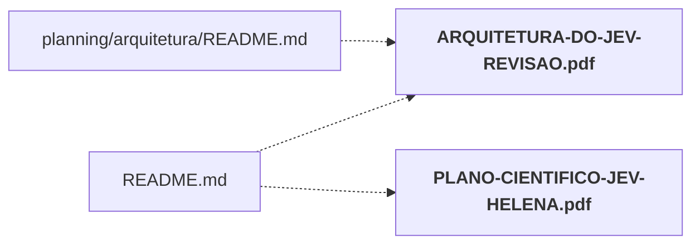

# output/pdf/

PDFs finais: guia prático, plano científico e relatório final.

← [MAPA.md](../../MAPA.md) · pasta acima: [output](../../mapa/pastas/output.md) · abrir a pasta: [output/pdf/](../../output/pdf)

## Arquivos

| arquivo | tipo | tamanho | descrição |
|---|---|---:|---|
| [ARQUITETURA-DO-JEV-REVISAO.pdf](../../output/pdf/ARQUITETURA-DO-JEV-REVISAO.pdf) | pdf | 2 MB | Documento PDF (binário) |
| [GUIA-PRATICO-JEV.pdf](../../output/pdf/GUIA-PRATICO-JEV.pdf) | pdf | 89 KB | Documento PDF (binário) |
| [PLANO-CIENTIFICO-JEV-HELENA.pdf](../../output/pdf/PLANO-CIENTIFICO-JEV-HELENA.pdf) | pdf | 144 KB | Documento PDF (binário) |
| [RELATORIO-FINAL-JEV.pdf](../../output/pdf/RELATORIO-FINAL-JEV.pdf) | pdf | 144 KB | Documento PDF (binário) |
| [_teste.pdf](../../output/pdf/_teste.pdf) | pdf | 99 KB | Documento PDF (binário) |

## Grafo de imports e links

Nós em negrito são desta pasta; setas cheias são imports, tracejadas são links de documento.

## Ligações e conteúdo de cada arquivo

### ARQUITETURA-DO-JEV-REVISAO.pdf

- **é usado por** — link: [`README.md`](../../README.md), [`planning/arquitetura/README.md`](../../planning/arquitetura/README.md); citação: [`planning/arquitetura/arquivos-mapa.txt`](../../planning/arquitetura/arquivos-mapa.txt)

### GUIA-PRATICO-JEV.pdf

- **é usado por** — citação: [`planning/build_guia_pdf.py`](../../planning/build_guia_pdf.py)

### PLANO-CIENTIFICO-JEV-HELENA.pdf

- **é usado por** — link: [`README.md`](../../README.md); citação: [`docs/RELATORIO-FINAL-JEV.md`](../../docs/RELATORIO-FINAL-JEV.md), [`executor/tests/test_entregaveis.py`](../../executor/tests/test_entregaveis.py), [`lab/dashboard.js`](../../lab/dashboard.js), [`lab/index.html`](../../lab/index.html), [`lab/server.py`](../../lab/server.py), [`lab/template.html`](../../lab/template.html), [`laboratorio/r21-prosa.json`](../../laboratorio/r21-prosa.json), [`planning/build_deliverables.py`](../../planning/build_deliverables.py)

### RELATORIO-FINAL-JEV.pdf

- **é usado por** — citação: [`docs/RELATORIO-FINAL-JEV.md`](../../docs/RELATORIO-FINAL-JEV.md), [`executor/tests/test_entregaveis.py`](../../executor/tests/test_entregaveis.py), [`laboratorio/r21-prosa.json`](../../laboratorio/r21-prosa.json), [`planning/build_relatorio_pdf.py`](../../planning/build_relatorio_pdf.py)
