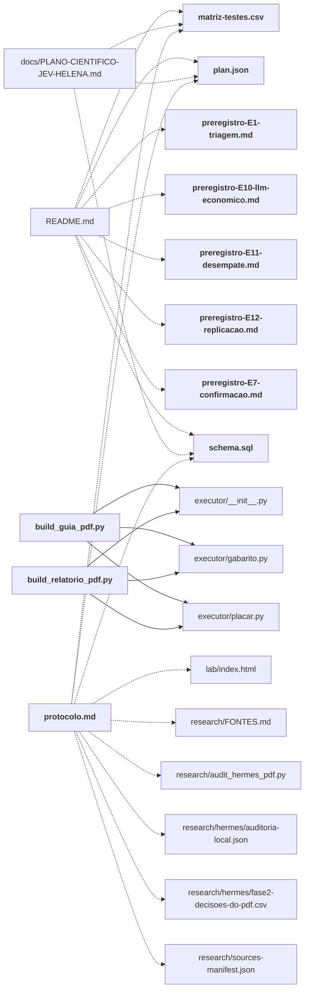

# planning/

Protocolo, pré-registros dos experimentos, emendas, esquema SQL, matriz de testes e os geradores dos documentos/PDFs.

← [MAPA.md](../../MAPA.md) · pasta acima: [raiz](../../mapa/pastas/_raiz.md) · abrir a pasta: [planning/](../../planning)

## Arquivos

| arquivo | tipo | tamanho | descrição |
|---|---|---:|---|
| [build_deliverables.py](../../planning/build_deliverables.py) | código | 206 l. | Publica painel estatico e PDF do plano. Sem rede, sem segredos, sem inferencia. |
| [build_guia_pdf.py](../../planning/build_guia_pdf.py) | código | 92 l. | Gera o PDF do guia prático, com a mesma tipografia do relatório final. |
| [build_plan.py](../../planning/build_plan.py) | código | 174 l. | Gera matriz, manifesto e fichas de planejamento; nenhuma chamada de inferencia. |
| [build_relatorio_pdf.py](../../planning/build_relatorio_pdf.py) | código | 77 l. | Gera o PDF do relatório final, reaproveitando a tipografia do plano — e só ela. |
| [emenda-E15-01.md](../../planning/emenda-E15-01.md) | doc | 6 l. | Emenda anterior à execução paga — 2026-09-19 — O usuário autorizou até US$ 2 nesta rodada. O teto do bloco E15 passa de US$ 0,20 |
| [matriz-testes.csv](../../planning/matriz-testes.csv) | dado | 16 l. | 15 linhas; colunas: id, name, repo, url, sha, family, smoke_unit, smoke_units, smoke_jev_call_cap, smoke_llm_call_cap, question, smoke |
| [plan.json](../../planning/plan.json) | dado | 737 l. | Objeto com 18 chaves: version, date, status, seed, paid_calls_this_stage, new_spend_usd, total_cap_usd, historical_conservative_usd, conservative_available_usd… |
| [preregistro-E1-triagem.md](../../planning/preregistro-E1-triagem.md) | doc | 120 l. | Pré-registro — E1 piloto, tarefa de triagem — **Congelado em 2026-09-18, antes de qualquer resultado desta tarefa.** Alterações posteriores só como |
| [preregistro-E10-llm-economico.md](../../planning/preregistro-E10-llm-economico.md) | doc | 149 l. | Pré-registro E10 — o braço do LLM econômico — **Registrado em 19 de setembro de 2026, antes de qualquer chamada paga a este modelo.** |
| [preregistro-E11-desempate.md](../../planning/preregistro-E11-desempate.md) | doc | 212 l. | Pré-registro E11 — o desempate entre o Jev e o LLM econômico — **Registrado em 19 de setembro de 2026, antes de escrever uma única linha do corpus novo e antes |
| [preregistro-E12-replicacao.md](../../planning/preregistro-E12-replicacao.md) | doc | 244 l. | Pré-registro E12 — a replicação do desempate com mais famílias e mais comparadores — **Registrado em 19 de setembro de 2026, antes de escrever uma única linha… |
| [preregistro-E15-implantacao.md](../../planning/preregistro-E15-implantacao.md) | doc | 44 l. | E15 — limites e implantação assistida do JEV — Registro anterior às chamadas desta rodada, 2026-09-19. Autor: Codex. |
| [preregistro-E16-recuperacao.md](../../planning/preregistro-E16-recuperacao.md) | doc | 22 l. | E16 — recuperação de contexto com candidatos reais — Registrado após E15 e antes de despachar E16, 2026-09-19. |
| [preregistro-E7-confirmacao.md](../../planning/preregistro-E7-confirmacao.md) | doc | 92 l. | Pré-registro E7 — conjunto de confirmação da triagem — **Registrado em:** 2026-09-19, antes de qualquer chamada paga sobre este corpus. |
| [protocolo.md](../../planning/protocolo.md) | doc | 300 l. | Plano científico de avaliação do ecossistema Jev — **Helena · versão 1.0 · 18 de setembro de 2026** |
| [schema.sql](../../planning/schema.sql) | esquema | 158 l. | Esquema SQL; tabelas: experiments, cases, annotations, arms, attempts, attempt_cases, decisions, task_outcomes, budget_events, provider_snapshots, artifacts |

## Grafo de imports e links

Nós em negrito são desta pasta; setas cheias são imports, tracejadas são links de documento.

## Ligações e conteúdo de cada arquivo

### build_deliverables.py

- **usa** — citação: [`docs/PLANO-CIENTIFICO-JEV-HELENA.md`](../../docs/PLANO-CIENTIFICO-JEV-HELENA.md), [`lab/build_ui.py`](../../lab/build_ui.py), [`output/pdf/PLANO-CIENTIFICO-JEV-HELENA.pdf`](../../output/pdf/PLANO-CIENTIFICO-JEV-HELENA.pdf), [`planning/plan.json`](../../planning/plan.json), [`research/hermes/fase2-decisoes-do-pdf.csv`](../../research/hermes/fase2-decisoes-do-pdf.csv)
- **é usado por** — citação: [`README.md`](../../README.md), [`executor/tests/test_entregaveis.py`](../../executor/tests/test_entregaveis.py), [`planning/build_guia_pdf.py`](../../planning/build_guia_pdf.py), [`planning/build_relatorio_pdf.py`](../../planning/build_relatorio_pdf.py)
- **parecidos (julgados pelo Jev)** — [`research/audit_hermes_pdf.py`](../../research/audit_hermes_pdf.py) (complementar, 0.34)
- **menciona 3 conceitos** — [E11](../../mapa/conhecimento/experimentos.md#e11) (1×), [E12](../../mapa/conhecimento/experimentos.md#e12) (1×), [V13](../../mapa/conhecimento/revisoes.md#v13) (1×)
- **conteúdo** — [markup](../../planning/build_deliverables.py#L29) (l. 29), [PlanDoc](../../planning/build_deliverables.py#L43) (l. 43), [footer](../../planning/build_deliverables.py#L53) (l. 53), [build_pdf](../../planning/build_deliverables.py#L95) (l. 95), [main](../../planning/build_deliverables.py#L195) (l. 195)

### build_guia_pdf.py

- **usa** — import: [`executor/__init__.py`](../../executor/__init__.py), [`executor/gabarito.py`](../../executor/gabarito.py), [`executor/placar.py`](../../executor/placar.py); citação: [`docs/GUIA-PRATICO-JEV.md`](../../docs/GUIA-PRATICO-JEV.md), [`docs/RELATORIO-FINAL-JEV.md`](../../docs/RELATORIO-FINAL-JEV.md), [`output/pdf/GUIA-PRATICO-JEV.pdf`](../../output/pdf/GUIA-PRATICO-JEV.pdf), [`planning/build_deliverables.py`](../../planning/build_deliverables.py), [`runs/e1-triagem/relatorio.json`](../../runs/e1-triagem/relatorio.json), [`runs/e11-desempate/relatorio.json`](../../runs/e11-desempate/relatorio.json), [`runs/e12-replicacao/relatorio.json`](../../runs/e12-replicacao/relatorio.json), [`runs/e7-confirmacao/relatorio.json`](../../runs/e7-confirmacao/relatorio.json)
- **chama de outros arquivos** — [`gabarito.desempenho_do_estudo`](../../executor/gabarito.py#L145), [`placar.faixa_dos_gabaritos`](../../executor/placar.py#L81), [`placar.montar`](../../executor/placar.py#L641)
- **parecidos (julgados pelo Jev)** — [`planning/build_relatorio_pdf.py`](../../planning/build_relatorio_pdf.py) (complementar, 0.65)
- **menciona 2 conceitos** — [E1](../../mapa/conhecimento/experimentos.md#e1) (1×), [E12](../../mapa/conhecimento/experimentos.md#e12) (1×)
- **conteúdo** — [corte_que_zera_o_erro](../../planning/build_guia_pdf.py#L23) (l. 23), [capa](../../planning/build_guia_pdf.py#L43) (l. 43), [main](../../planning/build_guia_pdf.py#L84) (l. 84)

### build_plan.py

- **usa** — citação: [`docs/PLANO-CIENTIFICO-JEV-HELENA.md`](../../docs/PLANO-CIENTIFICO-JEV-HELENA.md), [`planning/matriz-testes.csv`](../../planning/matriz-testes.csv), [`planning/plan.json`](../../planning/plan.json), [`planning/protocolo.md`](../../planning/protocolo.md), [`research/hermes/auditoria-local.json`](../../research/hermes/auditoria-local.json), [`research/sources-manifest.json`](../../research/sources-manifest.json)
- **é usado por** — citação: [`README.md`](../../README.md)
- **menciona 15 conceitos** — [S01](../../mapa/conhecimento/sistemas.md#s01) (1×), [S02](../../mapa/conhecimento/sistemas.md#s02) (1×), [S03](../../mapa/conhecimento/sistemas.md#s03) (1×), [S04](../../mapa/conhecimento/sistemas.md#s04) (1×), [S05](../../mapa/conhecimento/sistemas.md#s05) (1×), [S06](../../mapa/conhecimento/sistemas.md#s06) (1×), [S07](../../mapa/conhecimento/sistemas.md#s07) (1×), [S08](../../mapa/conhecimento/sistemas.md#s08) (1×), [S09](../../mapa/conhecimento/sistemas.md#s09) (1×), [S10](../../mapa/conhecimento/sistemas.md#s10) (1×), [S11](../../mapa/conhecimento/sistemas.md#s11) (1×), [S12](../../mapa/conhecimento/sistemas.md#s12) (1×), [S13](../../mapa/conhecimento/sistemas.md#s13) (1×), [S14](../../mapa/conhecimento/sistemas.md#s14) (1×), [S15](../../mapa/conhecimento/sistemas.md#s15) (1×)
- **conteúdo** — [system](../../planning/build_plan.py#L11) (l. 11), [main](../../planning/build_plan.py#L129) (l. 129)

### build_relatorio_pdf.py

- **usa** — import: [`executor/__init__.py`](../../executor/__init__.py), [`executor/gabarito.py`](../../executor/gabarito.py), [`executor/placar.py`](../../executor/placar.py); citação: [`docs/RELATORIO-FINAL-JEV.md`](../../docs/RELATORIO-FINAL-JEV.md), [`output/pdf/RELATORIO-FINAL-JEV.pdf`](../../output/pdf/RELATORIO-FINAL-JEV.pdf), [`planning/build_deliverables.py`](../../planning/build_deliverables.py), [`runs/e1-triagem/relatorio.json`](../../runs/e1-triagem/relatorio.json), [`runs/e11-desempate/relatorio.json`](../../runs/e11-desempate/relatorio.json), [`runs/e12-replicacao/relatorio.json`](../../runs/e12-replicacao/relatorio.json), [`runs/e7-confirmacao/relatorio.json`](../../runs/e7-confirmacao/relatorio.json)
- **chama de outros arquivos** — [`gabarito.desempenho_do_estudo`](../../executor/gabarito.py#L145), [`placar.faixa_dos_gabaritos`](../../executor/placar.py#L81), [`placar.montar`](../../executor/placar.py#L641)
- **parecidos (julgados pelo Jev)** — [`planning/build_guia_pdf.py`](../../planning/build_guia_pdf.py) (complementar, 0.65)
- **menciona 3 conceitos** — [E1](../../mapa/conhecimento/experimentos.md#e1) (1×), [E12](../../mapa/conhecimento/experimentos.md#e12) (1×), [V13](../../mapa/conhecimento/revisoes.md#v13) (1×)
- **conteúdo** — [negrito](../../planning/build_relatorio_pdf.py#L27) (l. 27), [capa](../../planning/build_relatorio_pdf.py#L34) (l. 34), [main](../../planning/build_relatorio_pdf.py#L69) (l. 69)

### emenda-E15-01.md

- **parecidos (julgados pelo Jev)** — [`planning/preregistro-E15-implantacao.md`](../../planning/preregistro-E15-implantacao.md) (complementar, 0.24), [`planning/preregistro-E7-confirmacao.md`](../../planning/preregistro-E7-confirmacao.md) (complementar, 0.23)
- **papel nos estudos** — emenda [E15](../../mapa/conhecimento/experimentos.md#e15)

### matriz-testes.csv

- **é usado por** — link: [`README.md`](../../README.md), [`docs/PLANO-CIENTIFICO-JEV-HELENA.md`](../../docs/PLANO-CIENTIFICO-JEV-HELENA.md), [`planning/protocolo.md`](../../planning/protocolo.md); citação: [`lab/dashboard.js`](../../lab/dashboard.js), [`lab/index.html`](../../lab/index.html), [`lab/server.py`](../../lab/server.py), [`planning/build_plan.py`](../../planning/build_plan.py)
- **menciona 15 conceitos** — [S01](../../mapa/conhecimento/sistemas.md#s01) (1×), [S02](../../mapa/conhecimento/sistemas.md#s02) (1×), [S03](../../mapa/conhecimento/sistemas.md#s03) (1×), [S04](../../mapa/conhecimento/sistemas.md#s04) (1×), [S05](../../mapa/conhecimento/sistemas.md#s05) (1×), [S06](../../mapa/conhecimento/sistemas.md#s06) (1×), [S07](../../mapa/conhecimento/sistemas.md#s07) (1×), [S08](../../mapa/conhecimento/sistemas.md#s08) (1×), [S09](../../mapa/conhecimento/sistemas.md#s09) (1×), [S10](../../mapa/conhecimento/sistemas.md#s10) (1×), [S11](../../mapa/conhecimento/sistemas.md#s11) (1×), [S12](../../mapa/conhecimento/sistemas.md#s12) (1×), [S13](../../mapa/conhecimento/sistemas.md#s13) (1×), [S14](../../mapa/conhecimento/sistemas.md#s14) (1×), [S15](../../mapa/conhecimento/sistemas.md#s15) (1×)

### plan.json

- **é usado por** — link: [`README.md`](../../README.md), [`docs/PLANO-CIENTIFICO-JEV-HELENA.md`](../../docs/PLANO-CIENTIFICO-JEV-HELENA.md), [`planning/protocolo.md`](../../planning/protocolo.md); citação: [`executor/simple_round.py`](../../executor/simple_round.py), [`lab/build_ui.py`](../../lab/build_ui.py), [`lab/data/execution.json`](../../lab/data/execution.json), [`lab/index.html`](../../lab/index.html), [`planning/build_deliverables.py`](../../planning/build_deliverables.py), [`planning/build_plan.py`](../../planning/build_plan.py)
- **menciona 15 conceitos** — [S01](../../mapa/conhecimento/sistemas.md#s01) (1×), [S02](../../mapa/conhecimento/sistemas.md#s02) (1×), [S03](../../mapa/conhecimento/sistemas.md#s03) (1×), [S04](../../mapa/conhecimento/sistemas.md#s04) (1×), [S05](../../mapa/conhecimento/sistemas.md#s05) (1×), [S06](../../mapa/conhecimento/sistemas.md#s06) (1×), [S07](../../mapa/conhecimento/sistemas.md#s07) (1×), [S08](../../mapa/conhecimento/sistemas.md#s08) (1×), [S09](../../mapa/conhecimento/sistemas.md#s09) (1×), [S10](../../mapa/conhecimento/sistemas.md#s10) (1×), [S11](../../mapa/conhecimento/sistemas.md#s11) (1×), [S12](../../mapa/conhecimento/sistemas.md#s12) (1×), [S13](../../mapa/conhecimento/sistemas.md#s13) (1×), [S14](../../mapa/conhecimento/sistemas.md#s14) (1×), [S15](../../mapa/conhecimento/sistemas.md#s15) (1×)

### preregistro-E1-triagem.md

- **usa** — citação: [`executor/analise.py`](../../executor/analise.py), [`executor/baseline_regra.py`](../../executor/baseline_regra.py)
- **é usado por** — link: [`README.md`](../../README.md); citação: [`docs/RELATORIO-EXECUCAO-JEV-HELENA.md`](../../docs/RELATORIO-EXECUCAO-JEV-HELENA.md), [`executor/baseline_regra.py`](../../executor/baseline_regra.py), [`executor/run_e1_triagem.py`](../../executor/run_e1_triagem.py), [`runs/e1-triagem/relatorio.json`](../../runs/e1-triagem/relatorio.json)
- **parecidos (julgados pelo Jev)** — [`planning/preregistro-E10-llm-economico.md`](../../planning/preregistro-E10-llm-economico.md) (complementar, 0.28), [`planning/preregistro-E7-confirmacao.md`](../../planning/preregistro-E7-confirmacao.md) (complementar, 0.27), [`planning/preregistro-E11-desempate.md`](../../planning/preregistro-E11-desempate.md) (complementar, 0.26), [`laboratorio/r4_r7_limites.py`](../../laboratorio/r4_r7_limites.py) (complementar, 0.25), [`docs/RELATORIO-FINAL-JEV.md`](../../docs/RELATORIO-FINAL-JEV.md) (complementar, 0.21)
- **papel nos estudos** — pré-registra [E1](../../mapa/conhecimento/experimentos.md#e1)
- **menciona 1 conceito** — [E3](../../mapa/conhecimento/experimentos.md#e3) (1×)
- **conteúdo** — Pergunta (l. 6), Tarefa (l. 12), Desenho (l. 29), Gabarito (l. 43), Comparadores (l. 49), Métrica principal e critério (l. 56), Erros graves (l. 65), O que este piloto não pode concluir (l. 70)

### preregistro-E10-llm-economico.md

- **usa** — citação: [`data/corpus/triagem-confirmacao.jsonl`](../../data/corpus/triagem-confirmacao.jsonl)
- **é usado por** — link: [`README.md`](../../README.md); citação: [`executor/run_e10_llm_economico.py`](../../executor/run_e10_llm_economico.py), [`executor/run_e10b_piloto.py`](../../executor/run_e10b_piloto.py), [`runs/e10-llm-economico/relatorio.json`](../../runs/e10-llm-economico/relatorio.json), [`runs/e10b-piloto/relatorio.json`](../../runs/e10b-piloto/relatorio.json)
- **parecidos (julgados pelo Jev)** — [`planning/preregistro-E11-desempate.md`](../../planning/preregistro-E11-desempate.md) (complementar, 0.58), [`planning/preregistro-E7-confirmacao.md`](../../planning/preregistro-E7-confirmacao.md) (complementar, 0.48), [`planning/preregistro-E12-replicacao.md`](../../planning/preregistro-E12-replicacao.md) (complementar, 0.43), [E11](../../mapa/conhecimento/experimentos.md#e11) (complementar, 0.30), [`planning/preregistro-E1-triagem.md`](../../planning/preregistro-E1-triagem.md) (complementar, 0.28), [`executor/run_e11_desempate.py`](../../executor/run_e11_desempate.py) (complementar, 0.28)
- **papel nos estudos** — pré-registra [E10](../../mapa/conhecimento/experimentos.md#e10)
- **menciona 4 conceitos** — [E1](../../mapa/conhecimento/experimentos.md#e1) (5×), [E10b](../../mapa/conhecimento/experimentos.md#e10b) (3×), [E7](../../mapa/conhecimento/experimentos.md#e7) (2×), [E8](../../mapa/conhecimento/experimentos.md#e8) (1×)
- **conteúdo** — Por que este experimento existe (l. 5), Hipótese (l. 18), Desenho (l. 29), Regra de decisão, congelada antes de olhar (l. 46), Orçamento (l. 60), O que este experimento não pode concluir (l. 82)

### preregistro-E11-desempate.md

- **usa** — citação: [`data/corpus/triagem-desempate.jsonl`](../../data/corpus/triagem-desempate.jsonl), [`runs/e11-desempate/respostas.jsonl`](../../runs/e11-desempate/respostas.jsonl)
- **é usado por** — link: [`README.md`](../../README.md); citação: [`executor/adjudicar_e11.py`](../../executor/adjudicar_e11.py), [`executor/run_e11_desempate.py`](../../executor/run_e11_desempate.py), [`runs/e11-desempate/adjudicacao.json`](../../runs/e11-desempate/adjudicacao.json), [`runs/e11-desempate/relatorio.json`](../../runs/e11-desempate/relatorio.json)
- **parecidos (julgados pelo Jev)** — [`planning/preregistro-E10-llm-economico.md`](../../planning/preregistro-E10-llm-economico.md) (complementar, 0.58), [`planning/preregistro-E12-replicacao.md`](../../planning/preregistro-E12-replicacao.md) (mesmo assunto, 0.55), [`planning/preregistro-E7-confirmacao.md`](../../planning/preregistro-E7-confirmacao.md) (complementar, 0.39), [`planning/preregistro-E1-triagem.md`](../../planning/preregistro-E1-triagem.md) (complementar, 0.26), [`docs/RELATORIO-FINAL-JEV.md`](../../docs/RELATORIO-FINAL-JEV.md) (complementar, 0.21)
- **papel nos estudos** — pré-registra [E11](../../mapa/conhecimento/experimentos.md#e11)
- **menciona 6 conceitos** — [E1](../../mapa/conhecimento/experimentos.md#e1) (5×), [E10](../../mapa/conhecimento/experimentos.md#e10) (2×), [E7](../../mapa/conhecimento/experimentos.md#e7) (1×), [E8](../../mapa/conhecimento/experimentos.md#e8) (1×), [E9](../../mapa/conhecimento/experimentos.md#e9) (1×), [E10b](../../mapa/conhecimento/experimentos.md#e10b) (1×)
- **conteúdo** — Por que este experimento existe (l. 6), Hipótese (l. 24), Desenho (l. 33), As 20 famílias, declaradas antes de escrever os casos (l. 48), Métrica primária e regra de decisão, congeladas antes de existir dado (l. 73), Orçamento (l. 96), O que este experimento continua não podendo concluir (l. 109)

### preregistro-E12-replicacao.md

- **usa** — citação: [`data/corpus/triagem-replicacao.jsonl`](../../data/corpus/triagem-replicacao.jsonl), [`executor/prices.json`](../../executor/prices.json)
- **é usado por** — link: [`README.md`](../../README.md); citação: [`executor/adjudicar_e12.py`](../../executor/adjudicar_e12.py), [`executor/run_e12_replicacao.py`](../../executor/run_e12_replicacao.py), [`runs/e12-replicacao/adjudicacao.json`](../../runs/e12-replicacao/adjudicacao.json), [`runs/e12-replicacao/anuladas-emenda-3.json`](../../runs/e12-replicacao/anuladas-emenda-3.json), [`runs/e12-replicacao/relatorio.json`](../../runs/e12-replicacao/relatorio.json)
- **parecidos (julgados pelo Jev)** — [`planning/preregistro-E11-desempate.md`](../../planning/preregistro-E11-desempate.md) (mesmo assunto, 0.55), [`planning/preregistro-E10-llm-economico.md`](../../planning/preregistro-E10-llm-economico.md) (complementar, 0.43), [`planning/preregistro-E7-confirmacao.md`](../../planning/preregistro-E7-confirmacao.md) (complementar, 0.38)
- **papel nos estudos** — pré-registra [E12](../../mapa/conhecimento/experimentos.md#e12)
- **menciona 4 conceitos** — [E10](../../mapa/conhecimento/experimentos.md#e10) (6×), [E11](../../mapa/conhecimento/experimentos.md#e11) (6×), [E1](../../mapa/conhecimento/experimentos.md#e1) (3×), [E6](../../mapa/conhecimento/experimentos.md#e6) (1×)
- **conteúdo** — Por que este experimento existe (l. 6), Hipótese (l. 22), Desenho (l. 32), As 30 famílias, declaradas antes de escrever os casos (l. 63), Regra de decisão, congelada antes de existir qualquer dado (l. 102), O que este experimento não decide (l. 140), Orçamento (l. 149), Emenda 1 — falha de transporte não é resposta errada (l. 161), Emenda 2 — cobertura mínima de um braço (l. 188), Emenda 3 — teto de saída suficiente para modelo que raciocina antes de responder (l. 215)

### preregistro-E15-implantacao.md

- **é usado por** — citação: [`executor/run_e15.py`](../../executor/run_e15.py), [`laboratorio/PREREGISTRO.md`](../../laboratorio/PREREGISTRO.md)
- **parecidos (julgados pelo Jev)** — [`planning/emenda-E15-01.md`](../../planning/emenda-E15-01.md) (complementar, 0.24)
- **papel nos estudos** — pré-registra [E15](../../mapa/conhecimento/experimentos.md#e15)
- **menciona 1 conceito** — [R11](../../mapa/conhecimento/rodadas.md#r11) (1×)
- **conteúdo** — Perguntas e decisões congeladas (l. 5), Desenho e limites (l. 24), Implantação (l. 39)

### preregistro-E16-recuperacao.md

- **é usado por** — citação: [`executor/run_e16.py`](../../executor/run_e16.py)
- **parecidos (julgados pelo Jev)** — [R43](../../mapa/conhecimento/rodadas.md#r43) (complementar, 0.27), [`integracao/camadas/ler.py`](../../integracao/camadas/ler.py) (complementar, 0.22)
- **papel nos estudos** — pré-registra [E16](../../mapa/conhecimento/experimentos.md#e16)
- **menciona 1 conceito** — [E15](../../mapa/conhecimento/experimentos.md#e15) (5×)

### preregistro-E7-confirmacao.md

- **usa** — citação: [`data/corpus/triagem-confirmacao.jsonl`](../../data/corpus/triagem-confirmacao.jsonl), [`executor/baseline_regra.py`](../../executor/baseline_regra.py), [`executor/run_e1_triagem.py`](../../executor/run_e1_triagem.py)
- **é usado por** — link: [`README.md`](../../README.md); citação: [`executor/run_e7_confirmacao.py`](../../executor/run_e7_confirmacao.py), [`runs/e7-confirmacao/relatorio.json`](../../runs/e7-confirmacao/relatorio.json)
- **parecidos (julgados pelo Jev)** — [`planning/preregistro-E10-llm-economico.md`](../../planning/preregistro-E10-llm-economico.md) (complementar, 0.48), [`planning/preregistro-E11-desempate.md`](../../planning/preregistro-E11-desempate.md) (complementar, 0.39), [`planning/preregistro-E12-replicacao.md`](../../planning/preregistro-E12-replicacao.md) (complementar, 0.38), [`planning/preregistro-E1-triagem.md`](../../planning/preregistro-E1-triagem.md) (complementar, 0.27), [`planning/emenda-E15-01.md`](../../planning/emenda-E15-01.md) (complementar, 0.23), [`docs/TRIAGEM-JEV-HELENA.md`](../../docs/TRIAGEM-JEV-HELENA.md) (complementar, 0.20)
- **papel nos estudos** — pré-registra [E7](../../mapa/conhecimento/experimentos.md#e7)
- **menciona 1 conceito** — [E1](../../mapa/conhecimento/experimentos.md#e1) (7×)
- **conteúdo** — Por que este experimento existe (l. 9), Hipótese (l. 17), Desenho (l. 24), Critério de decisão, fixado antes (l. 40), O que este experimento NÃO resolve (l. 51), Orçamento (l. 61), Emenda 1 — 2026-09-19, depois da execução (l. 68)

### protocolo.md

- **usa** — link: [`lab/index.html`](../../lab/index.html), [`planning/matriz-testes.csv`](../../planning/matriz-testes.csv), [`planning/plan.json`](../../planning/plan.json), [`planning/schema.sql`](../../planning/schema.sql), [`research/FONTES.md`](../../research/FONTES.md), [`research/audit_hermes_pdf.py`](../../research/audit_hermes_pdf.py), [`research/hermes/auditoria-local.json`](../../research/hermes/auditoria-local.json), [`research/hermes/fase2-decisoes-do-pdf.csv`](../../research/hermes/fase2-decisoes-do-pdf.csv), [`research/sources-manifest.json`](../../research/sources-manifest.json); citação: [`research/hermes/manifest.json`](../../research/hermes/manifest.json)
- **é usado por** — citação: [`README.md`](../../README.md), [`executor/README.md`](../../executor/README.md), [`planning/build_plan.py`](../../planning/build_plan.py)
- **parecidos (julgados pelo Jev)** — [`docs/PLANO-CIENTIFICO-JEV-HELENA.md`](../../docs/PLANO-CIENTIFICO-JEV-HELENA.md) (mesmo assunto, 0.93), [`docs/TRIAGEM-JEV-HELENA.md`](../../docs/TRIAGEM-JEV-HELENA.md) (complementar, 0.23), [`docs/RELATORIO-FINAL-JEV.md`](../../docs/RELATORIO-FINAL-JEV.md) (complementar, 0.20)
- **papel nos estudos** — define [S01](../../mapa/conhecimento/sistemas.md#s01), define [S02](../../mapa/conhecimento/sistemas.md#s02), define [S03](../../mapa/conhecimento/sistemas.md#s03), define [S04](../../mapa/conhecimento/sistemas.md#s04), define [S05](../../mapa/conhecimento/sistemas.md#s05), define [S06](../../mapa/conhecimento/sistemas.md#s06), define [S07](../../mapa/conhecimento/sistemas.md#s07), define [S08](../../mapa/conhecimento/sistemas.md#s08), define [S09](../../mapa/conhecimento/sistemas.md#s09), define [S10](../../mapa/conhecimento/sistemas.md#s10), define [S11](../../mapa/conhecimento/sistemas.md#s11), define [S12](../../mapa/conhecimento/sistemas.md#s12), define [S13](../../mapa/conhecimento/sistemas.md#s13), define [S14](../../mapa/conhecimento/sistemas.md#s14), define [S15](../../mapa/conhecimento/sistemas.md#s15)
- **menciona 5 conceitos** — [E4](../../mapa/conhecimento/experimentos.md#e4) (3×), [E1](../../mapa/conhecimento/experimentos.md#e1) (1×), [E2](../../mapa/conhecimento/experimentos.md#e2) (1×), [E3](../../mapa/conhecimento/experimentos.md#e3) (1×), [E5](../../mapa/conhecimento/experimentos.md#e5) (1×)
- **conteúdo** — 1. O que os testes anteriores realmente estabelecem (l. 13), 2. Objetivo, perguntas e critérios de utilidade (l. 46), 3. Cobertura: todos entram, cada um com um teste honesto (l. 64), 4. Desenho dos dados e gabaritos (l. 92), 5. Experimentos: separar as causas (l. 118), 6. Análise quantitativa e limites de inferência (l. 150), 7. Quanto gastar e como impedir estouro (l. 168), 8. OpenRouter ou TypeSafe direto: escolha e procedimento (l. 207), 9. Registro dos dados e interface do laboratório (l. 233), 10. Fluxo de execução e entregáveis por etapa (l. 263), 11. Regra final de adoção e aproveitamento de tokens (l. 281), 12. Fontes e arquivos de trabalho (l. 293)

### schema.sql

- **é usado por** — link: [`README.md`](../../README.md), [`docs/PLANO-CIENTIFICO-JEV-HELENA.md`](../../docs/PLANO-CIENTIFICO-JEV-HELENA.md), [`planning/protocolo.md`](../../planning/protocolo.md); citação: [`executor/ledger.py`](../../executor/ledger.py), [`lab/dashboard.js`](../../lab/dashboard.js), [`lab/index.html`](../../lab/index.html), [`lab/server.py`](../../lab/server.py), [`lab/template.html`](../../lab/template.html)
