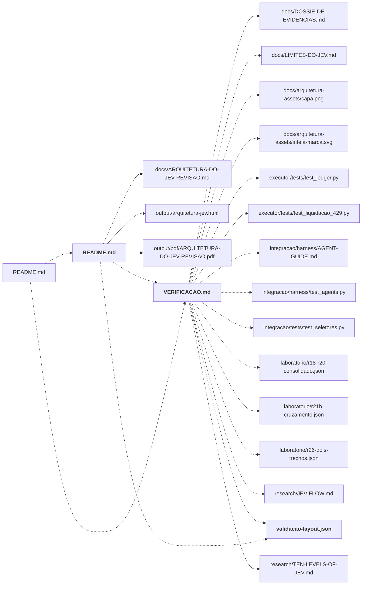

# planning/arquitetura/

Gerador da arquitetura em HTML/PDF, leiaute dos diagramas, estilos e registro de fontes e validação.

← [MAPA.md](../../MAPA.md) · pasta acima: [planning](../../mapa/pastas/planning.md) · abrir a pasta: [planning/arquitetura/](../../planning/arquitetura)

## Arquivos

| arquivo | tipo | tamanho | descrição |
|---|---|---:|---|
| [README.md](../../planning/arquitetura/README.md) | doc | 41 l. | Documento de arquitetura — Requer Node.js 20 ou superior e Google Chrome. Na pasta `planning/arquitetura`: |
| [VERIFICACAO.md](../../planning/arquitetura/VERIFICACAO.md) | doc | 79 l. | Arquitetura do JEV — fontes e validação — Data da revisão: 24/09/2026. |
| [arquivos-mapa.txt](../../planning/arquitetura/arquivos-mapa.txt) | texto | 27 l. | docs/ARQUITETURA-DO-JEV.pdf |
| [diagrams.mjs](../../planning/arquitetura/diagrams.mjs) | outro | 7 KB | Arquivo |
| [package.json](../../planning/arquitetura/package.json) | dado | 10 l. | Objeto com 5 chaves: name, private, type, scripts, dependencies |
| [render.mjs](../../planning/arquitetura/render.mjs) | outro | 8 KB | Arquivo |
| [style.css](../../planning/arquitetura/style.css) | web | 73 l. | Folha de estilo |
| [validacao-layout.json](../../planning/arquitetura/validacao-layout.json) | dado | 217 l. | Objeto com 9 chaves: source, source_sha256, pages, diagrams, html_sha256, pdf_sha256, cover_sha256, diagramChecks, layout |

## Grafo de imports e links

Nós em negrito são desta pasta; setas cheias são imports, tracejadas são links de documento.

## Ligações e conteúdo de cada arquivo

### README.md

- **usa** — link: [`docs/ARQUITETURA-DO-JEV-REVISAO.md`](../../docs/ARQUITETURA-DO-JEV-REVISAO.md), [`output/arquitetura-jev.html`](../../output/arquitetura-jev.html), [`output/pdf/ARQUITETURA-DO-JEV-REVISAO.pdf`](../../output/pdf/ARQUITETURA-DO-JEV-REVISAO.pdf), [`planning/arquitetura/VERIFICACAO.md`](../../planning/arquitetura/VERIFICACAO.md), [`planning/arquitetura/validacao-layout.json`](../../planning/arquitetura/validacao-layout.json); citação: [`planning/arquitetura/arquivos-mapa.txt`](../../planning/arquitetura/arquivos-mapa.txt), [`planning/arquitetura/diagrams.mjs`](../../planning/arquitetura/diagrams.mjs)
- **é usado por** — link: [`README.md`](../../README.md); citação: [`planning/arquitetura/arquivos-mapa.txt`](../../planning/arquitetura/arquivos-mapa.txt)
- **parecidos (julgados pelo Jev)** — [`research/TEN-LEVELS-OF-JEV.md`](../../research/TEN-LEVELS-OF-JEV.md) (não julgado, 0.30), [`docs/arquitetura-assets/fonte-original.md`](../../docs/arquitetura-assets/fonte-original.md) (não julgado, 0.20)
- **conteúdo** — Arquivos (l. 3), Regenerar (l. 11), Editar (l. 24), Atualizar o mapa durante a edição (l. 32)

### VERIFICACAO.md

- **usa** — link: [`docs/DOSSIE-DE-EVIDENCIAS.md`](../../docs/DOSSIE-DE-EVIDENCIAS.md), [`docs/LIMITES-DO-JEV.md`](../../docs/LIMITES-DO-JEV.md), [`docs/arquitetura-assets/capa.png`](../../docs/arquitetura-assets/capa.png), [`docs/arquitetura-assets/inteia-marca.svg`](../../docs/arquitetura-assets/inteia-marca.svg), [`executor/tests/test_ledger.py`](../../executor/tests/test_ledger.py), [`executor/tests/test_liquidacao_429.py`](../../executor/tests/test_liquidacao_429.py), [`integracao/harness/AGENT-GUIDE.md`](../../integracao/harness/AGENT-GUIDE.md), [`integracao/harness/test_agents.py`](../../integracao/harness/test_agents.py), [`integracao/tests/test_seletores.py`](../../integracao/tests/test_seletores.py), [`laboratorio/r18-r20-consolidado.json`](../../laboratorio/r18-r20-consolidado.json), [`laboratorio/r21b-cruzamento.json`](../../laboratorio/r21b-cruzamento.json), [`laboratorio/r26-dois-trechos.json`](../../laboratorio/r26-dois-trechos.json), [`planning/arquitetura/validacao-layout.json`](../../planning/arquitetura/validacao-layout.json), [`research/JEV-FLOW.md`](../../research/JEV-FLOW.md), [`research/TEN-LEVELS-OF-JEV.md`](../../research/TEN-LEVELS-OF-JEV.md); citação: [`docs/ARQUITETURA-DO-JEV.pdf`](../../docs/ARQUITETURA-DO-JEV.pdf), [`docs/arquitetura-assets/fonte-original.md`](../../docs/arquitetura-assets/fonte-original.md), [`laboratorio/tests/test_auditoria.py`](../../laboratorio/tests/test_auditoria.py)
- **é usado por** — link: [`README.md`](../../README.md), [`planning/arquitetura/README.md`](../../planning/arquitetura/README.md); citação: [`planning/arquitetura/arquivos-mapa.txt`](../../planning/arquitetura/arquivos-mapa.txt)
- **parecidos (julgados pelo Jev)** — [`integracao/camadas/verificar.py`](../../integracao/camadas/verificar.py) (não julgado, 0.23), [`research/FONTES.md`](../../research/FONTES.md) (não julgado, 0.21)
- **menciona 1 conceito** — [V26](../../mapa/conhecimento/revisoes.md#v26) (1×)
- **conteúdo** — Material de origem (l. 5), Decisões fundamentadas (l. 14), Verificações executadas (l. 31), Documento e diagramação (l. 43), Complemento de 28/09/2026 (l. 52), Identidade e autoria — 28/09/2026 (l. 69), Imagem da capa original (l. 73)

### arquivos-mapa.txt

- **usa** — citação: [`docs/ARQUITETURA-DO-JEV-REVISAO.md`](../../docs/ARQUITETURA-DO-JEV-REVISAO.md), [`docs/ARQUITETURA-DO-JEV.pdf`](../../docs/ARQUITETURA-DO-JEV.pdf), [`docs/arquitetura-assets/capa.png`](../../docs/arquitetura-assets/capa.png), [`docs/arquitetura-assets/diagrama-01.svg`](../../docs/arquitetura-assets/diagrama-01.svg), [`docs/arquitetura-assets/diagrama-02.svg`](../../docs/arquitetura-assets/diagrama-02.svg), [`docs/arquitetura-assets/diagrama-03.svg`](../../docs/arquitetura-assets/diagrama-03.svg), [`docs/arquitetura-assets/diagrama-04.svg`](../../docs/arquitetura-assets/diagrama-04.svg), [`docs/arquitetura-assets/diagrama-05.svg`](../../docs/arquitetura-assets/diagrama-05.svg), [`docs/arquitetura-assets/diagrama-06.svg`](../../docs/arquitetura-assets/diagrama-06.svg), [`docs/arquitetura-assets/diagrama-07.svg`](../../docs/arquitetura-assets/diagrama-07.svg), [`docs/arquitetura-assets/diagrama-08.svg`](../../docs/arquitetura-assets/diagrama-08.svg), [`docs/arquitetura-assets/diagrama-09.svg`](../../docs/arquitetura-assets/diagrama-09.svg), [`docs/arquitetura-assets/diagrama-10.svg`](../../docs/arquitetura-assets/diagrama-10.svg), [`docs/arquitetura-assets/fonte-original.md`](../../docs/arquitetura-assets/fonte-original.md), [`docs/arquitetura-assets/inteia-marca.svg`](../../docs/arquitetura-assets/inteia-marca.svg), [`output/arquitetura-jev.html`](../../output/arquitetura-jev.html), [`output/pdf/ARQUITETURA-DO-JEV-REVISAO.pdf`](../../output/pdf/ARQUITETURA-DO-JEV-REVISAO.pdf), [`planning/arquitetura/README.md`](../../planning/arquitetura/README.md), [`planning/arquitetura/VERIFICACAO.md`](../../planning/arquitetura/VERIFICACAO.md), [`planning/arquitetura/diagrams.mjs`](../../planning/arquitetura/diagrams.mjs), [`planning/arquitetura/package.json`](../../planning/arquitetura/package.json), [`planning/arquitetura/render.mjs`](../../planning/arquitetura/render.mjs), [`planning/arquitetura/style.css`](../../planning/arquitetura/style.css), [`planning/arquitetura/validacao-layout.json`](../../planning/arquitetura/validacao-layout.json), [`research/JEV-FLOW.md`](../../research/JEV-FLOW.md), [`research/TEN-LEVELS-OF-JEV.md`](../../research/TEN-LEVELS-OF-JEV.md)
- **é usado por** — citação: [`planning/arquitetura/README.md`](../../planning/arquitetura/README.md)

### diagrams.mjs

- **é usado por** — citação: [`planning/arquitetura/README.md`](../../planning/arquitetura/README.md), [`planning/arquitetura/arquivos-mapa.txt`](../../planning/arquitetura/arquivos-mapa.txt)

### package.json

- **usa** — citação: [`planning/arquitetura/render.mjs`](../../planning/arquitetura/render.mjs)
- **é usado por** — citação: [`executor/simple_round.py`](../../executor/simple_round.py), [`integracao/harness/auditar_instalacoes.py`](../../integracao/harness/auditar_instalacoes.py), [`lab/data/execution.json`](../../lab/data/execution.json), [`lab/index.html`](../../lab/index.html), [`planning/arquitetura/arquivos-mapa.txt`](../../planning/arquitetura/arquivos-mapa.txt), [`research/FONTES.md`](../../research/FONTES.md), [`research/sources-manifest.json`](../../research/sources-manifest.json)

### render.mjs

- **é usado por** — citação: [`planning/arquitetura/arquivos-mapa.txt`](../../planning/arquitetura/arquivos-mapa.txt), [`planning/arquitetura/package.json`](../../planning/arquitetura/package.json)

### style.css

- **é usado por** — citação: [`planning/arquitetura/arquivos-mapa.txt`](../../planning/arquitetura/arquivos-mapa.txt)

### validacao-layout.json

- **usa** — citação: [`docs/ARQUITETURA-DO-JEV-REVISAO.md`](../../docs/ARQUITETURA-DO-JEV-REVISAO.md)
- **é usado por** — link: [`planning/arquitetura/README.md`](../../planning/arquitetura/README.md), [`planning/arquitetura/VERIFICACAO.md`](../../planning/arquitetura/VERIFICACAO.md); citação: [`planning/arquitetura/arquivos-mapa.txt`](../../planning/arquitetura/arquivos-mapa.txt)
