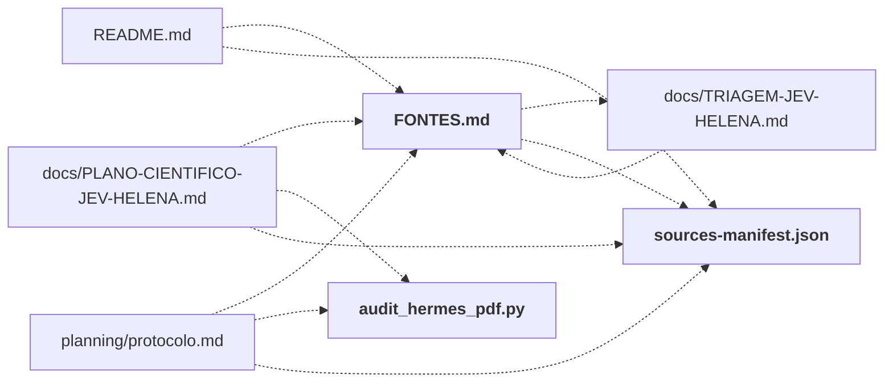

# research/

Pesquisa de base: fontes consultadas, manifesto das fontes GitHub, inventário de sistemas, auditoria do PDF do Hermes.

← [MAPA.md](../../MAPA.md) · pasta acima: [raiz](../../mapa/pastas/_raiz.md) · abrir a pasta: [research/](../../research)

## Subpastas

| subpasta | arquivos | finalidade |
|---|---:|---|
| [hermes/](../../mapa/pastas/research__hermes.md) | 7 | Material do Hermes: relatório final da Helena, dossiê quantitativo, auditoria local e decisões extraídas do PDF. |

## Arquivos

| arquivo | tipo | tamanho | descrição |
|---|---|---:|---|
| [FONTES.md](../../research/FONTES.md) | doc | 272 l. | Fontes e revisões — triagem JEV — Coleta: 18/09/2026. As 18 cópias foram obtidas por Git, sem instalar dependências ou executar código dos projetos. O manifest… |
| [audit_hermes_pdf.py](../../research/audit_hermes_pdf.py) | código | 96 l. | Recalcula tabelas do PDF, sem rede e sem importar codigo do Hermes. |
| [collect_sources.py](../../research/collect_sources.py) | código | 12 l. | Define: fetch |
| [inventario-sistemas.json](../../research/inventario-sistemas.json) | dado | 242 l. | Lista de 15 itens (id, name, repo, langs, files, test_files, decisions_api, systemone_api, openrouter, jev_model) |
| [sources-manifest.json](../../research/sources-manifest.json) | dado | 517 l. | Lista de 18 itens (repo, sha, url, path, retrieved_date, commit_date, root_entries, test_files, license_files) |

## Grafo de imports e links

Nós em negrito são desta pasta; setas cheias são imports, tracejadas são links de documento.

## Ligações e conteúdo de cada arquivo

### FONTES.md

- **usa** — link: [`docs/TRIAGEM-JEV-HELENA.md`](../../docs/TRIAGEM-JEV-HELENA.md), [`research/sources-manifest.json`](../../research/sources-manifest.json); citação: [`.gitattributes`](../../.gitattributes), [`.gitignore`](../../.gitignore), [`AGENTS.md`](../../AGENTS.md), [`README.md`](../../README.md)
- **é usado por** — link: [`README.md`](../../README.md), [`docs/PLANO-CIENTIFICO-JEV-HELENA.md`](../../docs/PLANO-CIENTIFICO-JEV-HELENA.md), [`docs/TRIAGEM-JEV-HELENA.md`](../../docs/TRIAGEM-JEV-HELENA.md), [`planning/protocolo.md`](../../planning/protocolo.md); citação: [`lab/dashboard.js`](../../lab/dashboard.js), [`lab/index.html`](../../lab/index.html), [`lab/server.py`](../../lab/server.py)
- **conteúdo** — Documentação externa consultada (l. 7), Catálogo por revisão (l. 17), Enquadramento da análise (l. 268)

### audit_hermes_pdf.py

- **usa** — citação: [`research/hermes/Jev-Dossie-Quantitativo.txt`](../../research/hermes/Jev-Dossie-Quantitativo.txt), [`research/hermes/auditoria-local.json`](../../research/hermes/auditoria-local.json), [`research/hermes/fase2-decisoes-do-pdf.csv`](../../research/hermes/fase2-decisoes-do-pdf.csv)
- **é usado por** — link: [`docs/PLANO-CIENTIFICO-JEV-HELENA.md`](../../docs/PLANO-CIENTIFICO-JEV-HELENA.md), [`planning/protocolo.md`](../../planning/protocolo.md); citação: [`README.md`](../../README.md)
- **conteúdo** — [wilson](../../research/audit_hermes_pdf.py#L20) (l. 20), [main](../../research/audit_hermes_pdf.py#L27) (l. 27)

### collect_sources.py

- **usa** — citação: [`research/sources-manifest.json`](../../research/sources-manifest.json)
- **é usado por** — citação: [`docs/TRIAGEM-JEV-HELENA.md`](../../docs/TRIAGEM-JEV-HELENA.md)
- **conteúdo** — [fetch](../../research/collect_sources.py#L4) (l. 4)

### sources-manifest.json

- **usa** — citação: [`.gitattributes`](../../.gitattributes), [`.gitignore`](../../.gitignore), [`AGENTS.md`](../../AGENTS.md), [`README.md`](../../README.md)
- **é usado por** — link: [`README.md`](../../README.md), [`docs/PLANO-CIENTIFICO-JEV-HELENA.md`](../../docs/PLANO-CIENTIFICO-JEV-HELENA.md), [`planning/protocolo.md`](../../planning/protocolo.md), [`research/FONTES.md`](../../research/FONTES.md); citação: [`docs/TRIAGEM-JEV-HELENA.md`](../../docs/TRIAGEM-JEV-HELENA.md), [`planning/build_plan.py`](../../planning/build_plan.py), [`research/collect_sources.py`](../../research/collect_sources.py)
