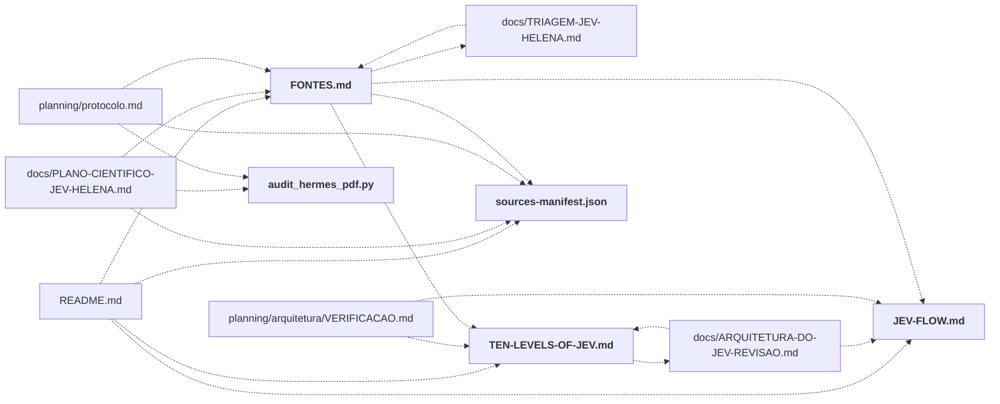

# research/

Pesquisa de base: fontes consultadas, manifesto das fontes GitHub, inventário de sistemas, referências adicionais e auditoria do PDF do Hermes.

← [MAPA.md](../../MAPA.md) · pasta acima: [raiz](../../mapa/pastas/_raiz.md) · abrir a pasta: [research/](../../research)

## Subpastas

| subpasta | arquivos | finalidade |
|---|---:|---|
| [hermes/](../../mapa/pastas/research__hermes.md) | 7 | Material do Hermes: relatório final da Helena, dossiê quantitativo, auditoria local e decisões extraídas do PDF. |

## Arquivos

| arquivo | tipo | tamanho | descrição |
|---|---|---:|---|
| [FONTES.md](../../research/FONTES.md) | doc | 280 l. | Fontes e revisões — triagem JEV — Coleta: 18/09/2026. As 18 cópias foram obtidas por Git, sem instalar dependências ou executar código dos projetos. O manifest… |
| [JEV-FLOW.md](../../research/JEV-FLOW.md) | doc | 32 l. | Jev Flow — ficha de referência — **Repositório:** igormorais123/jev-flow (fork de daltonrpj/jev-flow) |
| [TEN-LEVELS-OF-JEV.md](../../research/TEN-LEVELS-OF-JEV.md) | doc | 48 l. | 10 Levels of Jev — contribuições à arquitetura — Os caminhos abaixo pertencem a `apps/ten-levels/src/levels/`, na revisão indicada. |
| [audit_hermes_pdf.py](../../research/audit_hermes_pdf.py) | código | 96 l. | Recalcula tabelas do PDF, sem rede e sem importar codigo do Hermes. |
| [collect_sources.py](../../research/collect_sources.py) | código | 12 l. | Define: fetch |
| [inventario-sistemas.json](../../research/inventario-sistemas.json) | dado | 242 l. | Lista de 15 itens (id, name, repo, langs, files, test_files, decisions_api, systemone_api, openrouter, jev_model) |
| [sources-manifest.json](../../research/sources-manifest.json) | dado | 517 l. | Lista de 18 itens (repo, sha, url, path, retrieved_date, commit_date, root_entries, test_files, license_files) |

## Grafo de imports e links

Nós em negrito são desta pasta; setas cheias são imports, tracejadas são links de documento.

```mermaid
flowchart LR
  n_README_md["README.md"]
  n_docs_ARQUITETURA_DO_JEV_REVISAO_md["docs/ARQUITETURA-DO-JEV-REVISAO.md"]
  n_docs_PLANO_CIENTIFICO_JEV_HELENA_md["docs/PLANO-CIENTIFICO-JEV-HELENA.md"]
  n_docs_TRIAGEM_JEV_HELENA_md["docs/TRIAGEM-JEV-HELENA.md"]
  n_planning_arquitetura_VERIFICACAO_md["planning/arquitetura/VERIFICACAO.md"]
  n_planning_protocolo_md["planning/protocolo.md"]
  n_research_FONTES_md["<b>FONTES.md</b>"]
  n_research_JEV_FLOW_md["<b>JEV-FLOW.md</b>"]
  n_research_TEN_LEVELS_OF_JEV_md["<b>TEN-LEVELS-OF-JEV.md</b>"]
  n_research_audit_hermes_pdf_py["<b>audit_hermes_pdf.py</b>"]
  n_research_sources_manifest_json["<b>sources-manifest.json</b>"]
  n_README_md -.-> n_research_FONTES_md
  n_README_md -.-> n_research_JEV_FLOW_md
  n_README_md -.-> n_research_TEN_LEVELS_OF_JEV_md
  n_README_md -.-> n_research_sources_manifest_json
  n_docs_ARQUITETURA_DO_JEV_REVISAO_md -.-> n_research_JEV_FLOW_md
  n_docs_ARQUITETURA_DO_JEV_REVISAO_md -.-> n_research_TEN_LEVELS_OF_JEV_md
  n_docs_PLANO_CIENTIFICO_JEV_HELENA_md -.-> n_research_FONTES_md
  n_docs_PLANO_CIENTIFICO_JEV_HELENA_md -.-> n_research_audit_hermes_pdf_py
  n_docs_PLANO_CIENTIFICO_JEV_HELENA_md -.-> n_research_sources_manifest_json
  n_docs_TRIAGEM_JEV_HELENA_md -.-> n_research_FONTES_md
  n_planning_arquitetura_VERIFICACAO_md -.-> n_research_JEV_FLOW_md
  n_planning_arquitetura_VERIFICACAO_md -.-> n_research_TEN_LEVELS_OF_JEV_md
  n_planning_protocolo_md -.-> n_research_FONTES_md
  n_planning_protocolo_md -.-> n_research_audit_hermes_pdf_py
  n_planning_protocolo_md -.-> n_research_sources_manifest_json
  n_research_FONTES_md -.-> n_docs_TRIAGEM_JEV_HELENA_md
  n_research_FONTES_md -.-> n_research_JEV_FLOW_md
  n_research_FONTES_md -.-> n_research_TEN_LEVELS_OF_JEV_md
  n_research_FONTES_md -.-> n_research_sources_manifest_json
  n_research_TEN_LEVELS_OF_JEV_md -.-> n_docs_ARQUITETURA_DO_JEV_REVISAO_md
```

## Ligações e conteúdo de cada arquivo

### FONTES.md

- **usa** — link: [`docs/TRIAGEM-JEV-HELENA.md`](../../docs/TRIAGEM-JEV-HELENA.md), [`research/JEV-FLOW.md`](../../research/JEV-FLOW.md), [`research/TEN-LEVELS-OF-JEV.md`](../../research/TEN-LEVELS-OF-JEV.md), [`research/sources-manifest.json`](../../research/sources-manifest.json); citação: [`.gitattributes`](../../.gitattributes), [`.gitignore`](../../.gitignore), [`AGENTS.md`](../../AGENTS.md), [`README.md`](../../README.md), [`planning/arquitetura/package.json`](../../planning/arquitetura/package.json)
- **é usado por** — link: [`README.md`](../../README.md), [`docs/PLANO-CIENTIFICO-JEV-HELENA.md`](../../docs/PLANO-CIENTIFICO-JEV-HELENA.md), [`docs/TRIAGEM-JEV-HELENA.md`](../../docs/TRIAGEM-JEV-HELENA.md), [`planning/protocolo.md`](../../planning/protocolo.md); citação: [`integracao/skill/jev-completo/SKILL.md`](../../integracao/skill/jev-completo/SKILL.md), [`lab/dashboard.js`](../../lab/dashboard.js), [`lab/index.html`](../../lab/index.html), [`lab/server.py`](../../lab/server.py)
- **parecidos (julgados pelo Jev)** — [`planning/arquitetura/VERIFICACAO.md`](../../planning/arquitetura/VERIFICACAO.md) (não julgado, 0.21)
- **conteúdo** — Documentação externa consultada (l. 9), Catálogo por revisão (l. 19), Referência complementar de 28/09/2026 (l. 270), Enquadramento da análise original (l. 276)

### JEV-FLOW.md

- **é usado por** — link: [`README.md`](../../README.md), [`docs/ARQUITETURA-DO-JEV-REVISAO.md`](../../docs/ARQUITETURA-DO-JEV-REVISAO.md), [`planning/arquitetura/VERIFICACAO.md`](../../planning/arquitetura/VERIFICACAO.md), [`research/FONTES.md`](../../research/FONTES.md); citação: [`output/arquitetura-jev.html`](../../output/arquitetura-jev.html), [`planning/arquitetura/arquivos-mapa.txt`](../../planning/arquitetura/arquivos-mapa.txt)
- **menciona 2 conceitos** — [S01](../../mapa/conhecimento/sistemas.md#s01) (1×), [S15](../../mapa/conhecimento/sistemas.md#s15) (1×)
- **conteúdo** — O que é (l. 8), O que vale aproveitar no JEV (l. 16), Verificação nesta revisão (l. 23), Encaixe no estudo (l. 30)

### TEN-LEVELS-OF-JEV.md

- **usa** — link: [`docs/ARQUITETURA-DO-JEV-REVISAO.md`](../../docs/ARQUITETURA-DO-JEV-REVISAO.md)
- **é usado por** — link: [`README.md`](../../README.md), [`docs/ARQUITETURA-DO-JEV-REVISAO.md`](../../docs/ARQUITETURA-DO-JEV-REVISAO.md), [`planning/arquitetura/VERIFICACAO.md`](../../planning/arquitetura/VERIFICACAO.md), [`research/FONTES.md`](../../research/FONTES.md); citação: [`output/arquitetura-jev.html`](../../output/arquitetura-jev.html), [`planning/arquitetura/arquivos-mapa.txt`](../../planning/arquitetura/arquivos-mapa.txt)
- **parecidos (julgados pelo Jev)** — [`planning/arquitetura/README.md`](../../planning/arquitetura/README.md) (não julgado, 0.30)
- **conteúdo** — Seleção das contribuições (l. 8), Conferência no código associado (l. 23), Conteúdo excluído da edição (l. 33), Registro da análise (l. 42)

### audit_hermes_pdf.py

- **usa** — citação: [`research/hermes/Jev-Dossie-Quantitativo.txt`](../../research/hermes/Jev-Dossie-Quantitativo.txt), [`research/hermes/auditoria-local.json`](../../research/hermes/auditoria-local.json), [`research/hermes/fase2-decisoes-do-pdf.csv`](../../research/hermes/fase2-decisoes-do-pdf.csv)
- **é usado por** — link: [`docs/PLANO-CIENTIFICO-JEV-HELENA.md`](../../docs/PLANO-CIENTIFICO-JEV-HELENA.md), [`planning/protocolo.md`](../../planning/protocolo.md); citação: [`README.md`](../../README.md)
- **parecidos (julgados pelo Jev)** — [`planning/build_deliverables.py`](../../planning/build_deliverables.py) (complementar, 0.34)
- **conteúdo** — [wilson](../../research/audit_hermes_pdf.py#L20) (l. 20), [main](../../research/audit_hermes_pdf.py#L27) (l. 27)

### collect_sources.py

- **usa** — citação: [`research/sources-manifest.json`](../../research/sources-manifest.json)
- **é usado por** — citação: [`docs/TRIAGEM-JEV-HELENA.md`](../../docs/TRIAGEM-JEV-HELENA.md)
- **conteúdo** — [fetch](../../research/collect_sources.py#L4) (l. 4)

### inventario-sistemas.json

- **menciona 15 conceitos** — [S01](../../mapa/conhecimento/sistemas.md#s01) (1×), [S02](../../mapa/conhecimento/sistemas.md#s02) (1×), [S03](../../mapa/conhecimento/sistemas.md#s03) (1×), [S04](../../mapa/conhecimento/sistemas.md#s04) (1×), [S05](../../mapa/conhecimento/sistemas.md#s05) (1×), [S06](../../mapa/conhecimento/sistemas.md#s06) (1×), [S07](../../mapa/conhecimento/sistemas.md#s07) (1×), [S08](../../mapa/conhecimento/sistemas.md#s08) (1×), [S09](../../mapa/conhecimento/sistemas.md#s09) (1×), [S10](../../mapa/conhecimento/sistemas.md#s10) (1×), [S11](../../mapa/conhecimento/sistemas.md#s11) (1×), [S12](../../mapa/conhecimento/sistemas.md#s12) (1×), [S13](../../mapa/conhecimento/sistemas.md#s13) (1×), [S14](../../mapa/conhecimento/sistemas.md#s14) (1×), [S15](../../mapa/conhecimento/sistemas.md#s15) (1×)

### sources-manifest.json

- **usa** — citação: [`.gitattributes`](../../.gitattributes), [`.gitignore`](../../.gitignore), [`AGENTS.md`](../../AGENTS.md), [`README.md`](../../README.md), [`planning/arquitetura/package.json`](../../planning/arquitetura/package.json)
- **é usado por** — link: [`README.md`](../../README.md), [`docs/PLANO-CIENTIFICO-JEV-HELENA.md`](../../docs/PLANO-CIENTIFICO-JEV-HELENA.md), [`planning/protocolo.md`](../../planning/protocolo.md), [`research/FONTES.md`](../../research/FONTES.md); citação: [`docs/TRIAGEM-JEV-HELENA.md`](../../docs/TRIAGEM-JEV-HELENA.md), [`planning/build_plan.py`](../../planning/build_plan.py), [`research/collect_sources.py`](../../research/collect_sources.py)
