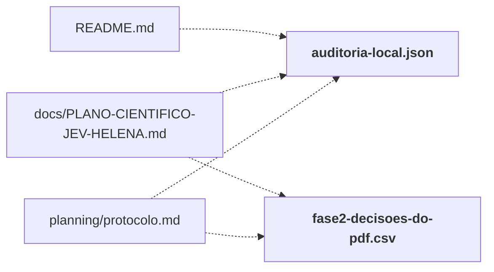

# research/hermes/

Material do Hermes: relatório final da Helena, dossiê quantitativo, auditoria local e decisões extraídas do PDF.

← [MAPA.md](../../MAPA.md) · pasta acima: [research](../../mapa/pastas/research.md) · abrir a pasta: [research/hermes/](../../research/hermes)

## Arquivos

| arquivo | tipo | tamanho | descrição |
|---|---|---:|---|
| [Jev-Dossie-Quantitativo.txt](../../research/hermes/Jev-Dossie-Quantitativo.txt) | texto | 2308 l. | === PAGINA 1 === |
| [RELATORIO-FINAL-HELENA.txt](../../research/hermes/RELATORIO-FINAL-HELENA.txt) | texto | 218 l. | === PAGINA 1 === |
| [VALIDACAO-LOCAL.md](../../research/hermes/VALIDACAO-LOCAL.md) | doc | 12 l. | Validação local da entrega — 18/09/2026 — Estes checks validam a entrega documental, os cálculos derivados do PDF e a interface. Não constituem testes dos 15 s… |
| [auditoria-local.json](../../research/hermes/auditoria-local.json) | dado | 303 l. | Objeto com 15 chaves: method, paid_calls, new_cost_usd, input_sha256, source, n_rows, n_unique_cases, n_calls, caveat, summary, paired, historical_budget_from_… |
| [fase2-decisoes-do-pdf.csv](../../research/hermes/fase2-decisoes-do-pdf.csv) | dado | 97 l. | 96 linhas; colunas: phase, mode, call_id, case_id, app, split, expected, predicted, correct, confidence_pdf, source_page, provenance |
| [manifest.json](../../research/hermes/manifest.json) | dado | 14 l. | Lista de 2 itens (file, sha256, pages, text_chars) |
| [openrouter-key-usage-snapshot.json](../../research/hermes/openrouter-key-usage-snapshot.json) | dado | 12 l. | Objeto com 10 chaves: usage, limit, limit_remaining, limit_reset, usage_daily, usage_weekly, usage_monthly, is_free_tier, queried_at_utc, kind |

## Grafo de imports e links

Nós em negrito são desta pasta; setas cheias são imports, tracejadas são links de documento.

## Ligações e conteúdo de cada arquivo

### Jev-Dossie-Quantitativo.txt

- **é usado por** — citação: [`research/audit_hermes_pdf.py`](../../research/audit_hermes_pdf.py)

### VALIDACAO-LOCAL.md

- **parecidos (julgados pelo Jev)** — [`hermes/portoes/jev_gate_sono_memoria.py`](../../hermes/portoes/jev_gate_sono_memoria.py) (complementar, 0.30), [`integracao/camadas/checklist.py`](../../integracao/camadas/checklist.py) (complementar, 0.26), [`lab/server.py`](../../lab/server.py) (complementar, 0.25), [R50](../../mapa/conhecimento/rodadas.md#r50) (complementar, 0.20)

### auditoria-local.json

- **é usado por** — link: [`README.md`](../../README.md), [`docs/PLANO-CIENTIFICO-JEV-HELENA.md`](../../docs/PLANO-CIENTIFICO-JEV-HELENA.md), [`planning/protocolo.md`](../../planning/protocolo.md); citação: [`lab/dashboard.js`](../../lab/dashboard.js), [`lab/index.html`](../../lab/index.html), [`lab/server.py`](../../lab/server.py), [`planning/build_plan.py`](../../planning/build_plan.py), [`research/audit_hermes_pdf.py`](../../research/audit_hermes_pdf.py)

### fase2-decisoes-do-pdf.csv

- **é usado por** — link: [`docs/PLANO-CIENTIFICO-JEV-HELENA.md`](../../docs/PLANO-CIENTIFICO-JEV-HELENA.md), [`planning/protocolo.md`](../../planning/protocolo.md); citação: [`lab/build_ui.py`](../../lab/build_ui.py), [`lab/dashboard.js`](../../lab/dashboard.js), [`lab/index.html`](../../lab/index.html), [`lab/server.py`](../../lab/server.py), [`planning/build_deliverables.py`](../../planning/build_deliverables.py), [`research/audit_hermes_pdf.py`](../../research/audit_hermes_pdf.py)

### manifest.json

- **é usado por** — citação: [`docs/PLANO-CIENTIFICO-JEV-HELENA.md`](../../docs/PLANO-CIENTIFICO-JEV-HELENA.md), [`executor/run_e15.py`](../../executor/run_e15.py), [`executor/run_e16.py`](../../executor/run_e16.py), [`laboratorio/r20-k-adaptativo.json`](../../laboratorio/r20-k-adaptativo.json), [`laboratorio/r26-bruto.json`](../../laboratorio/r26-bruto.json), [`laboratorio/r26-dois-trechos.json`](../../laboratorio/r26-dois-trechos.json), [`planning/protocolo.md`](../../planning/protocolo.md)
